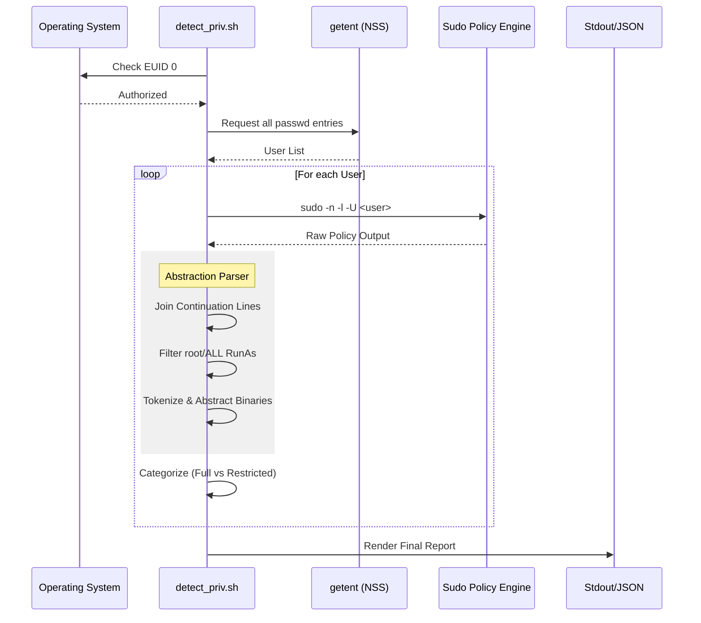

# Privileged User Detection Utility (detect_priv.sh) Technical Documentation

## 1. Application Overview and Objectives
The `detect_priv.sh` utility is a specialized security auditing tool designed for Linux environments (RHEL 8+ and Ubuntu 22.04+). Its primary objective is the comprehensive identification and categorization of administrative privileges across all system identities.

Unlike basic sudoers parsers, this utility utilizes the internal `sudo` policy engine to evaluate effective permissions, ensuring that complex configurations involving `User_Aliases`, group-based rights (`%wheel`, `%sudo`), and modular includes are accurately accounted for.

### Primary Objectives:
*   **Direct Root Discovery**: Identification of accounts with UID 0 that bypass traditional policy layers.
*   **Administrative Categorization**: Differentiation between global administrative access (`ALL=(ALL) ALL`) and restricted, command-specific sudo access.
*   **Capability Abstraction**: Distillation of raw command paths and wildcard patterns into unique "Access Point" binaries to facilitate risk surface analysis.
*   **CI/CD Readiness**: Provision of a neutral, machine-parseable JSON interface for automated security pipelines.

## 2. Architecture and Design Choices

### 2.1 Engine-Based Validation
The application avoids the inherent risks of manual `/etc/sudoers` regex parsing by utilizing the `sudo -l -U <user>` command. This design choice ensures that the utility respects the same logic as the kernel's authorization layer, capturing modular configurations and aliased memberships that static parsers often miss.

### 2.2 Abstraction Layer
A multi-stage parsing pipeline is implemented to handle the non-deterministic output of `sudo -l`. This includes:
*   **Continuation Buffer**: A `sed`-based look-ahead buffer that joins multi-line command lists into single logical entities.
*   **Tokenization Engine**: A split-and-strip logic that separates RunAs identities, security flags (e.g., `NOPASSWD`), and command strings.
*   **Capability Mapping**: Instead of reporting raw, redundant command strings, the utility abstracts capabilities into a unique list of binaries (Access Points), providing a concise overview of a user's operational reach.

### 2.3 Shell Hardening
The utility implements `set -euo pipefail` to ensure structural integrity:
*   `-e`: Immediate exit on command failure.
*   `-u`: Error on uninitialized variable reference.
*   `-o pipefail`: Propagates non-zero exit codes through pipes, preventing silent failures in the data processing chain.

## 3. Data Flow and Control Logic

### 3.1 Operational Flow
The application follows a linear data processing sequence:
1.  **Initialization**: Environment setup and argument parsing.
2.  **Authorization**: Verification of root-level execution (EUID 0).
3.  **Discovery**: Enumeration of system identities via the Name Service Switch (`getent`).
4.  **Processing Loop**: Per-user policy evaluation and categorization.
5.  **Aggregation**: Collection of results into memory-resident arrays.
6.  **Rendering**: Output generation based on selected format (Text or JSON).

### 3.2 Sequence Diagram


## 4. Dependencies
The application is designed for maximum portability across modern Linux distributions and relies on standard POSIX and GNU utilities.

| Dependency | Purpose | Requirement |
| :--- | :--- | :--- |
| `bash` | Execution environment | v4.0+ (Array support) |
| `sudo` | Policy evaluation engine | v1.8+ (Support for -U) |
| `getent` | User discovery | NSS compatibility |
| `sed` | Stream editor (joining/regex) | GNU or BSD |
| `awk` | Text processing (UID check) | Standard |
| `jq` | JSON formatting (optional) | Monochrome support for --json |

## 5. Command Line Arguments

| Argument | Type | Default | Description |
| :--- | :--- | :--- | :--- |
| `--json` | Flag | false | Outputs results in neutral, monochrome JSON format for machine consumption. |
| `--help` | Flag | N/A | Displays usage information. |

## 6. Usage Examples

### 6.1 Standard Security Audit
To generate a human-readable report of all privileged users on the local system:
```bash
sudo ./detect_priv.sh
```

### 6.2 CI/CD Integration
To ingest privilege data into a security orchestration or logging platform (e.g., Splunk, ELK):
```bash
sudo ./detect_priv.sh --json
```

### 6.3 Restricted Access Identification
The utility identifies users with high-risk restricted access, such as a web administrator with specific service management rights:
```text
Restricted Sudo Privileges (Limited Commands as Root):
  USER            CMDS       ACCESS POINTS (BINARIES)
  ----            ----       ------------------------
  webadm          11         /usr/bin/journalctl,/usr/bin/systemctl,/usr/sbin/nginx
```
