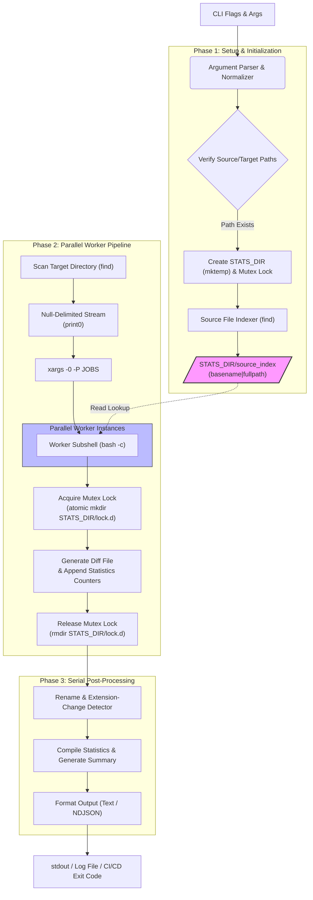
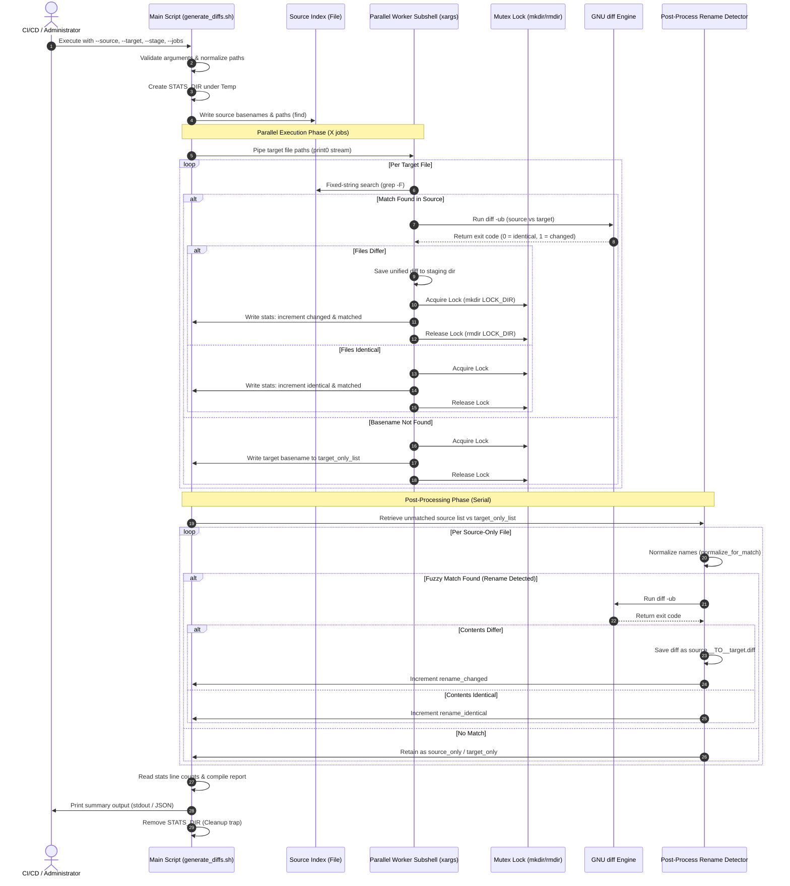
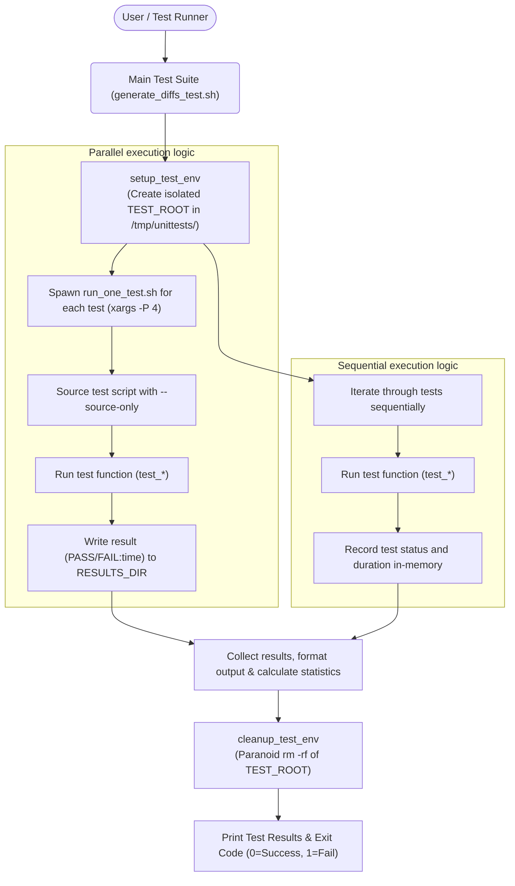

# Recursive Script Diff Generator (`generate_diffs.sh`)
<!-- Context: This document serves as the formal architectural specification and user guide for the Recursive Script Diff Generator utility and its companion test suite. -->

The `generate_diffs.sh` utility is a high-performance shell script designed to recursively identify scripts and files with identical names across distinct source and target directory structures, generating unified diffs for modifications. It is engineered for operations such as compliance auditing, staging validation, environmental drift analysis, and code base migration.

---

## 1. Application Overview and Objectives
<!-- Context: Core design objectives focus on cross-platform reliability, runtime speed, and predictability in CI/CD pipelines. -->

In large-scale infrastructure environments, scripts (e.g., configurations, extraction routines, utility wrappers) evolve across multiple environments (e.g., Dev, QA, Production) or versions. Understanding the exact modifications, additions, and deletions across these directory trees is a critical operational task.

### Primary Objectives:
*   **Performance at Scale**: Leverage multi-core CPUs via parallel subshell execution to process thousands of file pairs rapidly.
*   **Fuzzy Rename Detection**: Identify version bumps (e.g., `script_v1.0.sh` to `script_v2.0.sh`), platform suffix changes (e.g., `script_unix.sh` to `script.sh`), and formatting adjustments (case, underscores, dashes) to track history across naming evolutions.
*   **Staging Directory Integrity**: Construct an output tree in a staging directory that mirrors the target directory's relative paths, preventing filename collisions and preserving organizational structure.
*   **CI/CD Integration Readiness**: Provide predictable exit codes, newline-delimited JSON (NDJSON) output streams, log redirection, and dry-run modes to facilitate automation.
*   **Platform Portability**: Maintain complete compatibility across Linux, macOS, Cygwin, MSYS2, and Windows (Git Bash) systems without relying on non-standard packages.

---

## 2. Architecture and Design Choices, Assumptions, and Edge Cases
<!-- Context: Architectural decisions prioritize POSIX shell compliance and local execution security. -->

### System Architecture Diagram
The diagram below illustrates the functional architecture of [generate_diffs.sh](./generate_diffs.sh):



### Key Design Choices:
1.  **Parallel Execution Engine**: The script coordinates parallel workers using `find` piped into `xargs -0 -P "$JOBS"`. This approach scales execution across all available hardware threads without requiring heavyweight runtimes (like Python or Node.js) or GNU Parallel, which is frequently absent in minimal container or server environments.
2.  **Directory-Based Mutex Lock**: Because parallel subshells append to shared tracking files and print to `stdout`, a synchronization mechanism is required. Standard `flock` is not portable across Cygwin/MSYS2. The script utilizes `mkdir "$LOCK_DIR"` as an atomic test-and-set mutex lock. Since directory creation is an atomic operation at the kernel level on POSIX-compliant filesystems, it ensures thread safety without external dependencies.
3.  **Source Index Lookups**: Prior to scanning target files, the script compiles a memory/file-based index of all source files mapped by their basenames: `basename|fullpath`. When workers scan target files, they perform fixed-string lookups using `grep -F` against this pre-compiled index. This avoids nested recursive filesystem traversal, shifting lookup complexity from $O(M \times N)$ directory walks to $O(N)$ lookups.
4.  **Fuzzy String Normalization**: Rename detection utilizes the [normalize_for_match](./generate_diffs.sh) function. This function strips versioning annotations (`v1.0`, `2026.06`), platform suffixes (`_windows`, `_unix`), extensions, casing, and separators (underscores, dashes). By mapping files like `ACTT_Linux_v2.0.sh` and `actt_linux.sh` to the core identifier `acttlinux`, the engine accurately associates files despite organizational renaming. To optimize execution, this CPU-intensive fuzzy comparison is deferred to a sequential post-processing phase running *only* on the subset of unmatched files, preventing thread starvation during parallel execution.
5.  **Resource and I/O Efficiency**: To minimize disk access and CPU consumption, the script implements the following I/O optimization strategies:
    *   **Process Substitution**: Uses process substitution (e.g. `while read ... < <(find ...)`) instead of standard piping to subshells, preventing context-switching overhead and retaining variable states within the parent shell.
    *   **Immediate Staging Cleanup**: Deletes identical/empty diffs immediately (`rm -f "$diff_file"`) rather than retaining empty files, reducing staging filesystem metadata bloat.

### Key Assumptions:
*   **Name Uniqueness within Directory Sets**: While files may reside in nested folders, rename detection assumes that unique name stems match across the source and target. If duplicate basenames exist in different directories of the source set, the lookup retrieves the first match found.
*   **Write Capabilities on Target Runtimes**: The script assumes write permissions are granted to the staging directory (`--stage`) and the operating system's temp directories (evaluated via environment variables `TMPDIR` and `TEMP`, falling back to `/tmp`) to create tracking files.
*   **Tool Availability**: The shell execution environment is assumed to possess a POSIX-compliant Bash shell (4.3+) and GNU variants of `diff` and `find`.

### Edge Cases Handled:
*   **Empty Directories**: The pipeline executes gracefully with empty sets, displaying `0` files matched, without syntax errors or division-by-zero crashes.
*   **Windows Paths**: Path variables are normalized via the [normalize_path](./generate_diffs.sh) function to replace Windows backslashes (`\`) with forward slashes (`/`) and strip trailing slashes, eliminating path concatenations errors.
*   **Special Characters in Filenames**: Spaces, dashes, dots, and brackets in file names are handled safely by passing null-terminated strings (`-print0` and `xargs -0`) and using double-quoted variable expansion throughout.
*   **Case Sensitivity in Extensions**: The file matching patterns use the case-insensitive `-iname` flag during the `find` lookup to ensure extensions like `.sh`, `.SH`, and `.Sh` are cataloged.
*   **Empty Files**: Empty files are parsed without errors. If a file was empty in the source but contains code in the target, a diff is generated showing the new code as added. If both are empty, they are classified as identical.
*   **File Renames with Identical Contents**: If a renamed file has unchanged content, it is categorized as a `rename_identical` state, suppressing empty diff generation while tracking the name modification.

---

## 3. Data Flow and Control Logic
<!-- Context: The control flow transitions from a parallel processing phase to a serial post-processing phase to ensure accurate rename detection. -->

### Operational Flow:
1.  **Parse and Validate**: Read and normalize CLI arguments. Ensure target and source exist. Confirm `jq` is present if `--json` is selected.
2.  **Compile Source Index**: Execute `find` on the source path. Write entries in `basename|fullpath` format to a temporary index file.
3.  **Process Target Files in Parallel**:
    *   Scan target files matching `--pattern` and excluding `--exclude`.
    *   Pipe filenames to `xargs` running workers.
    *   For each file, search the source index. If matched, run `diff -ub` and save to staging if differences exist. If identical, clean up empty diff file.
    *   If unmatched, write target filename to `target_only_list`.
    *   Maintain thread safety using `LOCK_DIR` for stats updates and output printing.
4.  **Perform Rename Analysis**:
    *   Scan unmatched source files against `target_only_list`.
    *   Normalize names via `normalize_for_match`. If they correspond, evaluate content drift.
    *   Generate a diff named `source__TO__target.diff` in the corresponding staging directory if contents differ.
5.  **Compile Binary Rename Analysis**:
    *   Evaluate compiled libraries and executables (`.dll`, `.exe`, `.so`, etc.).
    *   Identify renaming actions without generating diffs.
    *   Check for script-to-binary compiled transition edge cases (e.g. `tool.sh` to `tool.exe`).
6.  **Aggregate Statistics**: Read the line count of individual log files (e.g. `matched`, `changed`, `identical`) inside the temporary stats folder to assemble totals.
7.  **Generate Output Report**: Output formatted text summary or NDJSON record, and exit.

### Sequence Diagram
This diagram depicts the data transitions and synchronization points:



---

## 4. Dependencies
<!-- Context: Dependencies are restricted to core system binaries to guarantee execution on hardened systems. -->

The utility is designed to minimize runtime overhead and external software supply chain risks:

| Dependency | Minimum Version | Category | Purpose |
| :--- | :--- | :--- | :--- |
| **Bash** | 4.3+ | Interpreter | Execution runtime; uses nameref (`local -n`) for dynamic array binding, process substitution, and local arrays. |
| **GNU diff** | Any | Utility | Computes file differences and outputs unified structures (`diff -ub`). |
| **GNU find** | Any | Utility | Traverses directory structures recursively matching pattern masks. |
| **xargs** | Any | Utility | Orchestrates parallel execution via `-P` and processes null-delimited lines via `-0`. |
| **coreutils** | Any | Utility set | Standard utilities: `mkdir`/`rmdir` (atomic lock), `mktemp` (temp directory), `wc` (counter), `sed` & `tr` (text normalization), `awk` (duration math). |
| **jq** | 1.5+ | Utility | **Optional**: Required only when the `--json` option is specified for JSON validation and output serialization. |

---

## 5. Security Assessment
<!-- Context: Security analysis focuses on privilege containment, input sanitization, and vulnerability elimination. -->

### Threat Vector Analysis:
*   **Encryption in Transit**: Not applicable. The script operates entirely within the local context. It establishes no network sockets, initiates no remote calls, and does not download or upload data (preventing data exfiltration vectors).
*   **Secret Management**: The script does not accept, store, or output credentials, API tokens, or configuration secrets. Diffs may contain sensitive system configurations if they are modified in the target script directory. Protection of these diffs relies on the security posture of the staging directory.
*   **Authentication Configuration**: Authentication is delegated to the operating system's kernel. The script does not manage user accounts or authentications.
*   **Role-Based Access Control (RBAC)**: Execution authority is governed by the DAC (Discretionary Access Control) or RBAC policies of the operating system account running the script. The script requires:
    *   **Read Access**: Source (`--source`) and Target (`--target`) directories.
    *   **Write Access**: Staging (`--stage`) directory and the system temp directories (evaluated via environment variables `TMPDIR` and `TEMP`, falling back to `/tmp`).
*   **Library Vulnerabilities**: By avoiding package managers (e.g. npm, pip, gem), the utility is immune to remote dependency confusion, lockfile poisoning, and third-party library exploits. Its only optional dependency, `jq`, is a lightweight system binary.
*   **Privilege Level**: The script is designed to run in an unprivileged user context. It does not require root/administrator privileges (`sudo`). To align with the principle of least privilege, it should be executed under a dedicated service account restricted to reading code directories and writing to the staging area.
*   **Sanitization Against Shell Injection**: Inputs parsed via CLI options (e.g., `--pattern`, `--exclude`) are validated and enclosed in double-quotes during variable evaluation. Filenames are processed via null-delimited strings (`-print0` and `xargs -0`) to prevent filenames containing characters like `;`, `&`, or `|` from executing arbitrary shell commands.

---

## 6. Command Line Arguments
<!-- Context: Strict validation rules are applied to all command line arguments to reject malformed inputs before execution starts. -->

The script supports the following command-line flags and arguments:

| Argument Flag | Input Type | Default Value | Description |
| :--- | :--- | :--- | :--- |
| **`--source <dir>`** | String (Path) | *None (Required)* | The old/baseline directory containing the original scripts. |
| **`--target <dir>`** | String (Path) | *None (Required)* | The new directory containing the updated scripts. |
| **`--stage <dir>`** | String (Path) | *None (Required)* | The output staging directory where `.diff` files will be written. Created if missing. |
| **`--jobs <n>`** | Integer | CPU Core Count | Number of parallel worker threads. Automatically falls back to `4` if CPU query fails. |
| **`--log <file>`** | String (Path) | *None (Disabled)* | Redirects all execution output (stdout and stderr) to the specified log file. |
| **`--pattern <pat>`** | String | `all` | Comma-separated list of extension groups or wildcard patterns (e.g. `shell,config,*.txt`). |
| **`--exclude <pat>`** | String | *None (Empty)* | Excludes files matching this glob pattern. Can be repeated multiple times. |
| **`--verbose`** | Boolean (Flag) | `false` | Enables verbose logs, including reporting identical files. |
| **`--quiet`** | Boolean (Flag) | `false` | Suppresses all standard output. Errors are still printed to `stderr`. |
| **`--summary-only`** | Boolean (Flag) | `false` | Suppresses per-file console outputs, displaying only the final statistics summary. |
| **`--dry-run`** | Boolean (Flag) | `false` | Runs the comparison pipeline but skips writing files to the staging directory. |
| **`--json`** | Boolean (Flag) | `false` | Outputs each result record and the final summary as Newline-Delimited JSON (NDJSON). |
| **`--no-renames`** | Boolean (Flag) | `false` | Disables the fuzzy rename detection algorithm, improving execution speed on large directories. |
| **`--exit-code`** | Boolean (Flag) | `false` | Modifies exit behavior: exits with code `1` if any file differences are found. |
| **`--version`** | Boolean (Flag) | *N/A* | Displays version information and exits immediately. |
| **`--help`** | Boolean (Flag) | *N/A* | Displays the help usage guide and exits immediately. |

---

## 7. Detailed Examples on How to Use and Deploy
<!-- Context: These examples provide copy-pasteable commands and representative outputs to verify proper operation. -->

### Scenario A: Ad-Hoc Drift Analysis (Plain Text Output)
Compare a local deployment folder against a newly extracted delivery package, staging diffs to `/var/tmp/staged_diffs` with verbose output:

```bash
./generate_diffs.sh \
  --source /opt/deployments/v1.1/scripts \
  --target /tmp/delivery_v1.2/scripts \
  --stage /var/tmp/staged_diffs \
  --pattern "shell,windows" \
  --verbose
```

#### Meaningful Output Sample:
```text
Building source index from: /opt/deployments/v1.1/scripts
Indexed 4 source script(s)
Scanning target directory: /tmp/delivery_v1.2/scripts
Found 5 target script(s)
Staging diffs to: /var/tmp/staged_diffs

Changed: db_migrate.sh -> /var/tmp/staged_diffs/db_migrate.sh.diff
Identical: health_check.ps1
Identical: env_setup.sh
Target-only: backup_run.sh

Checking for source-only files...

Analyzing potential renames...
Diff (rename): clean_logs_v1.sh -> clean_logs_v2.sh

Checking for binary/dependency renames...

================================================================================
                              DIFF ANALYSIS SUMMARY
================================================================================

Source: /opt/deployments/v1.1/scripts
Target: /tmp/delivery_v1.2/scripts
Output: /var/tmp/staged_diffs

STATISTICS
--------------------------------------------------------------------------------
Matched pairs:     3
  - Changed:       1 (diffs generated)
  - Identical:     2 (no diff needed)
Source-only:       1 (not in target)
Target-only:       2 (new in target)
Likely renames:    1
  - Changed:       1 (diffs generated)
  - Identical:     0 (name only)
Binary renames:    0

--------------------------------------------------------------------------------
CHANGED FILES (diffs generated) [2]
--------------------------------------------------------------------------------
db_migrate.sh
clean_logs_v1.sh__TO__clean_logs_v2.sh

--------------------------------------------------------------------------------
LIKELY RENAMES (version updates) [1]
--------------------------------------------------------------------------------
These files appear to be renamed versions of each other:

  clean_logs_v1.sh -> clean_logs_v2.sh

--------------------------------------------------------------------------------
TARGET-ONLY FILES (new additions) [1]
--------------------------------------------------------------------------------
These files exist only in target (newly added):

  backup_run.sh

--------------------------------------------------------------------------------
Elapsed time: 0s
================================================================================
```

---

### Scenario B: CI/CD Pipeline Automation (NDJSON Output)
Integrate the utility into a Jenkins or GitLab CI/CD runner to assess code changes. If modifications are detected, fail the step:

```bash
./generate_diffs.sh \
  --source ./src/main/resources/config \
  --target ./target/classes/config \
  --stage ./target/diff-reports \
  --pattern config \
  --json \
  --exit-code
```

#### Meaningful NDJSON Output Sample:
```json
{"type":"changed","file":"application.yml","source":"./src/main/resources/config/application.yml","target":"./target/classes/config/application.yml","diff":"./target/diff-reports/application.yml.diff"}
{"type":"identical","file":"bootstrap.json","source":"./src/main/resources/config/bootstrap.json","target":"./target/classes/config/bootstrap.json"}
{"type":"target_only","file":"new-feature-flag.json","path":"./target/classes/config/new-feature-flag.json"}
{"type":"summary","source_dir":"./src/main/resources/config","target_dir":"./target/classes/config","stage_dir":"./target/diff-reports","matched":2,"changed":1,"identical":1,"source_only":0,"target_only":1,"renames":0,"renamed_changed":0,"renamed_identical":0,"binary_renames":0,"diff_count":1,"elapsed_seconds":0,"dry_run":false}
```

*Note: In the event of changes, the script returns exit code `1`. If no changes were found, it returns exit code `0`.*

---

## 8. Test Suite (`generate_diffs_test.sh`)
<!-- Context: The test suite utilizes unit-testing practices with full lifecycle hooks for environment setup and teardown. -->

The [generate_diffs_test.sh](./generate_diffs_test.sh) script provides comprehensive verification for all functionality of the utility.

### Test Architecture and Execution Flow
The diagram below illustrates the test execution flow of `generate_diffs_test.sh`:



### Sandbox Test Isolation:
*   Each test run creates a unique workspace folder under `/tmp/unittests/generate_diffs_YYYYMMDDhhmmss`.
*   Every test case constructs its own isolated directory structure:
    *   `.../TEST_ROOT/test_name/source/`
    *   `.../TEST_ROOT/test_name/target/`
    *   `.../TEST_ROOT/test_name/stage/`
*   This isolation permits high-speed concurrency tests without risk of file collisions or inter-test data leakage.
*   **Paranoid Cleanup Safety**: The [cleanup_test_env](./generate_diffs_test.sh) function implements 7 safety checks before executing `rm -rf` to protect system files. It verifies that `TEST_ROOT` is non-empty, resides under `/tmp/unittests/`, matches the exact timestamp format, is a directory (not a symlink), does not contain directory traversal strings (`..`), and is at least 25 characters long.

### Test Case Specifications (67 Tests)
<!-- Context: The test suite defines individual test cases to isolate unit verification logic. All test functions listed below are implemented in generate_diffs_test.sh. -->

All test functions listed below are implemented in [generate_diffs_test.sh](./generate_diffs_test.sh).

#### A. CLI Option Validations (16 Tests)
*   `test_help_option`: Asserts that `--help` displays usage details and returns exit code `2`.
*   `test_version_option`: Verifies `--version` returns `0` and prints version information.
*   `test_missing_arguments`: Asserts that omitting mandatory parameters (`--source`, `--target`, `--stage`) yields exit code `2`.
*   `test_invalid_source`: Asserts that a non-existent source directory yields exit code `1` and prints an error message.
*   `test_invalid_jobs`: Verifies that non-integer arguments for `--jobs` are rejected with exit code `2`.
*   `test_verbose_option`: Asserts that verbose logs display matching records (e.g. `Identical:`).
*   `test_quiet_option`: Verifies that `--quiet` silences all standard outputs.
*   `test_summary_only_option`: Confirms that only the final statistics summary is written.
*   `test_dry_run_option`: Asserts that differences are evaluated, but no files are created in the staging folder.
*   `test_json_option`: Validates that the `--json` output format produces syntactically correct NDJSON.
*   `test_log_option`: Asserts that log redirection captures both statistics and summary records in the specified file.
*   `test_exit_code_no_changes`: Asserts that `--exit-code` yields exit code `0` when directories are identical.
*   `test_exit_code_with_changes`: Asserts that `--exit-code` yields exit code `1` when code differences exist.
*   `test_exclude_option`: Verifies that a single exclude pattern filter functions as expected.
*   `test_exclude_multiple`: Confirms multiple independent `--exclude` options filter files.
*   `test_no_renames_option`: Asserts that `--no-renames` skips rename searches and returns `0` renames.

#### B. Pattern Matching (7 Tests)
*   `test_pattern_shell`: Verifies that the `shell` group targets only shell scripts (e.g. `.sh`, `.bash`).
*   `test_pattern_windows`: Verifies that the `windows` group captures `.ps1`, `.bat`, and `.cmd`.
*   `test_pattern_sql`: Confirms the `sql` group captures only `.sql` structures.
*   `test_pattern_devel`: Confirms that development extensions (e.g. `.py`, `.go`, `.rs`) are scanned.
*   `test_pattern_config`: Validates that config and markup files (e.g. `.json`, `.yaml`, `.xml`) are scanned.
*   `test_pattern_wildcard`: Validates that custom wildcards (e.g., `*.txt`) work as filters.
*   `test_pattern_combined`: Verifies that mixed configurations (e.g., `shell,*.txt`) compile and execute.

#### C. Core Helper Functions (4 Tests)
*   `test_normalize_for_match`: Asserts that normalization handles uppercase characters, platforms, and date formats.
*   `test_count_lines`: Confirms that statistic counters compute line files correctly.
*   `test_build_find_expr`: Validates command building constraints for `find`.
*   `test_path_functions`: Confirms relative directory structures are maintained in the output.

#### D. Diff Generation (3 Tests)
*   `test_diff_generation`: Asserts that modified script contents yield unified diffs showing additions (`+`) and deletions (`-`).
*   `test_no_diff_identical`: Asserts that identical files generate no empty `.diff` output files.
*   `test_diff_directory_structure`: Verifies that diff structures replicate nested directory layouts.

#### E. Rename Detection (3 Tests)
*   `test_rename_version`: Confirms script version migrations (e.g. `_v1.0` to `_v2.0`) are matched as renames.
*   `test_rename_platform`: Confirms platform suffix removals (e.g., `_unix` to base name) are matched.
*   `test_rename_with_diff`: Confirms that renamed files with updated content produce a `source__TO__target.diff` file.

#### F. Presence Validations (2 Tests)
*   `test_source_only`: Asserts that retired scripts are flagged as source-only.
*   `test_target_only`: Asserts that newly added scripts are flagged as target-only.

#### G. Parallel Integrity (2 Tests)
*   `test_parallel_no_garble`: Asserts that multiple jobs printing to the console do not interleave output lines.
*   `test_parallel_json_valid`: Confirms that NDJSON streams compiled in parallel remain valid JSON.

#### H. Edge Cases (10 Tests)
*   `test_empty_directories`: Verifies that directories with 0 files are handled without exceptions.
*   `test_paths_with_spaces`: Confirms file paths with space characters are handled properly.
*   `test_special_characters`: Verifies filenames containing dots, dashes, and underscores.
*   `test_case_sensitivity`: Verifies that extension matching works case-insensitively.
*   `test_long_filenames`: Asserts that file names exceeding 80 characters are processed correctly.
*   `test_empty_files`: Verifies empty files are handled correctly.
*   `test_quiet_shows_errors`: Asserts that `--quiet` does not suppress errors printed to `stderr`.
*   `test_diff_format_valid`: Verifies the output structure displays unified diff tokens (`---`, `+++`, `@@`).
*   `test_default_pattern_all`: Confirms omitting `--pattern` defaults to `all` patterns.
*   `test_stage_dir_created`: Verifies the staging folder is created if it does not exist.

#### I. JSON Output Types (7 Tests)
*   `test_json_type_identical`: Verifies JSON record for identical file has `type: "identical"`.
*   `test_json_type_changed`: Verifies JSON record for changed file has `type: "changed"`.
*   `test_json_type_source_only`: Verifies JSON record for source-only file has `type: "source_only"`.
*   `test_json_type_target_only`: Verifies JSON record for target-only file has `type: "target_only"`.
*   `test_json_type_summary`: Verifies JSON record for summary has `type: "summary"`.
*   `test_json_type_rename_changed`: Verifies JSON record for renamed changed file has `type: "rename_changed"`.
*   `test_json_type_rename_identical`: Verifies JSON record for renamed identical file has `type: "rename_identical"`.

#### J. Path Normalization (2 Tests)
*   `test_path_normalization_backslash`: Asserts that Windows backslash paths are converted to forward slash paths.
*   `test_path_normalization_trailing`: Asserts trailing slashes do not cause traversal errors.

#### K. Binary Rename Validation (2 Tests)
*   `test_binary_rename_detection`: Verifies binary rename matching (e.g. `.dll` rename).
*   `test_extension_change_detection`: Verifies compiled language transformations (e.g., `.sh` compiled/packaged to `.exe`).

#### L. Constraints & Logs (4 Tests)
*   `test_invalid_target`: Asserts that invalid target directories fail with exit code `1`.
*   `test_jobs_sequential`: Verifies execution stability under `--jobs 1`.
*   `test_json_requires_jq`: Confirms that executing with `--json` triggers a `jq` check.
*   `test_log_json_output`: Verifies that logging to a file in JSON mode creates valid JSON log content.

#### M. Progress & Summaries (4 Tests)
*   `test_progress_indicator`: Confirms progress markers are drawn to stderr on lists exceeding 20 files.
*   `test_progress_quiet`: Confirms progress outputs are suppressed when executing under `--quiet`.
*   `test_summary_statistics`: Verifies that all statistical headers appear in the final report.
*   `test_summary_sections`: Verifies that structural headers (SOURCE-ONLY, TARGET-ONLY) are printed.

#### N. Thread Safety (1 Test)
*   `test_concurrent_stats`: Stresses the locking engine with 8 parallel worker jobs over 30 files, asserting count accuracy.

---

### Executing the Test Suite
Ensure the script is executable, then run it from its local directory:

```bash
# Set execute permissions
chmod +x generate_diffs_test.sh

# Run the test suite in parallel (Default: utilizing up to 4 concurrent test workers)
./generate_diffs_test.sh

# Run the test suite sequentially (Useful for debugging logs step-by-step)
./generate_diffs_test.sh --sequential

# Run the test suite with detailed trace outputs
./generate_diffs_test.sh --verbose
```

### Windows Antivirus Exclusion Note
<!-- Context: Concurrency testing on Windows systems (e.g. Cygwin/MSYS2/Git Bash) can cause high CPU overhead (>40%) due to antivirus scanning of rapid temporary folder creation and teardown. Exclusion policies mitigate this behavior. -->
> [!IMPORTANT]
> To prevent significant CPU spikes (>40%) on Windows hosts during high-concurrency test runs, configure Defender/antivirus exclusions for the temporary directory and the Bash process. Run the following PowerShell commands as Administrator before executing the test suite:
> 
> ```powershell
> # Exclude the Cygwin/MSYS2 tmp directory
> Add-MpPreference -ExclusionPath "C:\cygwin64\tmp\unittests", "C:\msys64\tmp\unittests"
> 
> # Exclude the Cygwin/MSYS2 shell process
> Add-MpPreference -ExclusionProcess "C:\cygwin64\bin\bash.exe", "C:\msys64\usr\bin\bash.exe"
> ```
> 
> After completion, remove these exclusions by running:
> 
> ```powershell
> Remove-MpPreference -ExclusionPath "C:\cygwin64\tmp\unittests", "C:\msys64\tmp\unittests"
> Remove-MpPreference -ExclusionProcess "C:\cygwin64\bin\bash.exe", "C:\msys64\usr\bin\bash.exe"
> ```

#### Meaningful Test Run Output Sample:
```text
========================================================================
  generate_diffs.sh Unit Tests
========================================================================

[INFO] Setting up test environment at /tmp/unittests/generate_diffs_20260625134000
[INFO] Running 67 tests in parallel (max 4 concurrent tests)...

[PASS] [0001] test_help_option                                 0.03s
[PASS] [0002] test_version_option                              0.02s
[PASS] [0003] test_missing_arguments                           0.02s
[PASS] [0004] test_invalid_source                              0.03s
...
[PASS] [0065] test_summary_statistics                          0.08s
[PASS] [0066] test_summary_sections                            0.07s
[PASS] [0067] test_concurrent_stats                            0.41s

[INFO] Cleaning up test environment
[INFO] Removed /tmp/unittests/generate_diffs_20260625134000

========================================================================
  Test Results
========================================================================

  Total:   67
  Passed:  67

  Elapsed: 0m 9s

ALL TESTS PASSED
```
