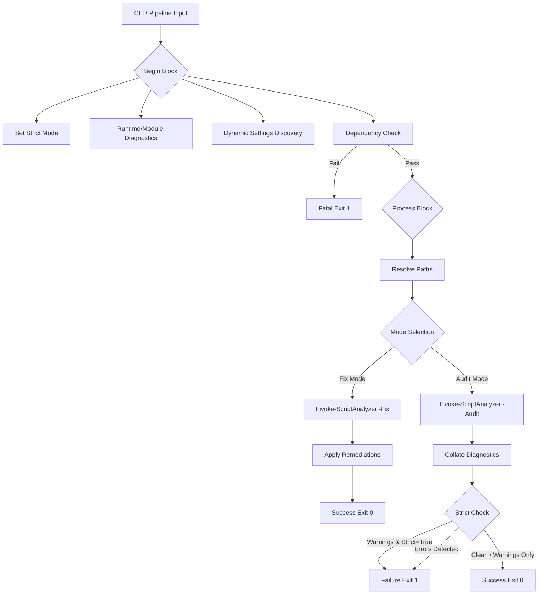

# PSLint Technical Specification & Orchestration Guide

## 1. Application Overview and Objectives

**PSLint** is an orchestration wrapper for the `PSScriptAnalyzer` engine. Its primary objective is to enforce standardized code quality across the repository by serving as a unified analysis gate.

### **Functional Objectives:**
- **Centralized Policy Enforcement**: Decouples linting rules from developer environments by dynamically discovering and applying repository-standard `.psd1` configurations.
- **Dependency Management**: Implements a bootstrap sequence to ensure the analysis engine is correctly provisioned on a host without manual intervention.
- **Automated Remediation**: Provides an interface for the linter's "Auto-Fix" capabilities, allowing for programmatic remediation of stylistic issues.
- **CI/CD Integration**: Supplies deterministic exit codes and structured diagnostic output for consumption by automated build pipelines (e.g., Jenkins, GitLab CI, GitHub Actions).

---

## 2. Architecture and Design Choices

The architecture of PSLint is built on the principle of execution isolation and environmental consistency.

### **Key Design Patterns:**
- **PowerShell Pipeline Lifecycle**: The script utilizes the `begin/process` block pattern. This ensures that dependency verification and settings discovery are performed once per execution, while the actual analysis scales across pipelined file objects.
- **Bootstrap Logic**: The script implements a prioritized installation logic (checking for the module, then the NuGet provider, then attempting a TLS 1.2 secured download).
- **Strict-Mode Compliance**: The utility is designed to run under `Set-StrictMode -Version Latest`. To support this, it uses explicit array-wrapping for cmdlet results to prevent runtime exceptions when a scan returns exactly one finding.
- **Context-Aware Configuration**: It searches for configuration files in a prioritized directory hierarchy, allowing the tool to remain portable while staying tethered to repository standards.

---

## 3. Data Flow and Control Logic

The following diagram illustrates the operational flow of a PSLint execution, from initial parameter binding through to the generation of the final CI/CD exit status.



### **Operational Sequence:**
1.  **Initialization**: Sets the runtime environment and initializes the `$script:PSLintSettingsFile` pointer.
2.  **Verification**: Validates the presence of the `PSScriptAnalyzer` module. If missing, it negotiates TLS 1.2 and installs the module (scope determined by admin privileges - see Section 6).
3.  **Path Resolution**: Transforms relative paths into absolute literals to ensure reporting accuracy across nested directories.
4.  **Analysis**: Executes the underlying engine using the discovered settings file.
5.  **Exit Strategy**: Evaluates the severity of findings against the `-Strict` flag to determine the final process exit code.

---

## 4. Configuration & Policy Enforcement

PSLint relies on an external configuration file to define the ruleset for the repository. This file serves as the machine-enforced governance document for the entire codebase.

### **Settings File (`PSScriptAnalyzerSettings.psd1`)**
The linter automatically looks for this file in `$PSScriptRoot`, its parent directory, or the Current Working Directory ($PWD). This file controls:
- **IncludeRules**: Explicit list of rules to run (e.g., `PSAvoidUsingWriteHost`, `PSAvoidGlobalVars`).
- **ExcludeRules**: Rules to skip for this specific repository.
- **Severity Levels**: Tuning of what constitutes an Error vs. a Warning.

### **Major Rule Categories & Intent**
The analysis policy is categorized into four primary domains to ensure comprehensive code health:

| Category | Intent | Example Rules |
| :--- | :--- | :--- |
| **Security** | Detects high-risk patterns that could lead to credential exposure or arbitrary code execution. | `PSAvoidUsingPlainTextForPassword`, `PSAvoidUsingInternalURLs` |
| **Reliability** | Identifies logic flaws that may result in runtime failures or unpredictable behavior in different environments. | `PSUseDeclaredVarsMoreThanAssignments`, `PSPossibleIncorrectUsageOfAssignmentOperator` |
| **Maintainability** | Enforces professional standards to ensure code is portable, readable, and well-documented. | `PSAvoidUsingCmdletAliases`, `PSUseSingularNouns`, `PSProvideDefaultParameterValue` |
| **Styling & Hygiene** | Standardizes the visual and structural formatting of the code for consistent repository aesthetics. | `PSUseConsistentWhitespace`, `PSAvoidTrailingWhitespace`, `PSUseConsistentIndentation` |

### **Enabled Rules Reference**

The following rules are explicitly enabled in `PSScriptAnalyzerSettings.psd1`:

#### Security & Portability
| Rule | Severity | Purpose |
| :--- | :--- | :--- |
| `PSAvoidUsingComputerNameHardcoded` | Error | Use parameters instead of hardcoded hostnames |
| `PSAvoidUsingInvokeExpression` | Warning | Prevents command injection vulnerabilities |
| `PSAvoidUsingPlainTextForPassword` | Warning | No hardcoded secrets in source code |
| `PSAvoidUsingUsernameAndPasswordParams` | Error | Use PSCredential objects for authentication |
| `PSUsePSCredentialType` | Warning | Proper type safety for credential parameters |
| `PSAvoidUsingConvertToSecureStringWithPlainText` | Error | Secure handling of sensitive data |
| `PSAvoidUsingInternalURLs` | Information | Avoid leaking internal infrastructure details |
| `PSAvoidUsingBrokenHashAlgorithms` | Warning | Flags MD5/SHA1 in security contexts |
| `PSAvoidUsingDeprecatedManifestFields` | Warning | Catches outdated module manifest fields |

#### Reliability & Bug Prevention
| Rule | Severity | Purpose |
| :--- | :--- | :--- |
| `PSPossibleIncorrectComparisonWithNull` | Warning | `$null` must be on the left side (`$null -eq $var`) |
| `PSPossibleIncorrectUsageOfRedirectionOperator` | Warning | Detects accidental use of `>` instead of `-gt` |
| `PSUseUsingScopeModifierInNewRunspaces` | Error | Required for thread safety in multi-runspace scripts |
| `PSAvoidAssignmentToAutomaticVariable` | Error | Protects system variables (`$Error`, `$PID`, etc.) |
| `PSAvoidUsingEmptyCatchBlock` | Warning | Prevents silent failure anti-patterns |
| `PSUseDeclaredVarsMoreThanAssignments` | Warning | Dead code and uninitialized variable detection |
| `PSReviewUnusedParameter` | Warning | Keeps API signatures clean |
| `PSUseShouldProcessForStateChangingFunctions` | Warning | Mandatory for `-WhatIf` / `-Confirm` support |
| `PSUseSupportsShouldProcess` | Warning | Ensures correct ShouldProcess implementation |
| `PSAvoidGlobalVars` | Warning | Prevents global state pollution |
| `PSAvoidDefaultValueForMandatoryParameter` | Warning | Catches conflicting parameter declarations |
| `PSAvoidShouldContinueWithoutForce` | Warning | Ensures proper `-Force` implementation |

#### Best Practices & Standards
| Rule | Severity | Purpose |
| :--- | :--- | :--- |
| `PSUseApprovedVerbs` | Warning | PowerShell standard verb naming |
| `PSUseSingularNouns` | Warning | PowerShell standard noun naming |
| `PSUseToExportFieldsInManifest` | Warning | Explicit exports in manifests (no wildcards) |
| `PSAvoidUsingWMICmdlet` | Warning | Use CIM instead of legacy WMI |
| `PSAvoidUsingWriteHost` | Warning | Use Write-Output/Verbose for better redirection |

#### Style & Formatting
| Rule | Severity | Purpose |
| :--- | :--- | :--- |
| `PSUseConsistentIndentation` | Warning | 4-space indentation (synced with .editorconfig) |
| `PSUseConsistentWhitespace` | Warning | Consistent spacing around operators |
| `PSPlaceOpenBraceOnSameLine` | Warning | K&R brace style enforcement |
| `PSPlaceCloseBraceOnNewLine` | Warning | Closing brace on its own line |

To modify the analysis policy, edit the `.psd1` file directly. PSLint will pick up the changes on the next execution.

---

## 5. Exit Code Specification

For integration with CI/CD runners, PSLint returns granular exit codes to distinguish failure types:

| Exit Code | Name | Condition | CI/CD Action |
| :---: | :--- | :--- | :--- |
| **0** | Success | No issues found, or warnings/info without `-Strict` | Continue pipeline |
| **1** | Errors | PSScriptAnalyzer detected Error-severity issues | Block merge, require fix |
| **2** | Warnings | Warnings detected with `-Strict` mode enabled | Block merge, require fix |
| **3** | Syntax | PowerShell syntax errors prevented analysis | Block merge, require fix |
| **4** | Dependency | PSScriptAnalyzer installation or import failed | Retry or fix environment |
| **5** | Input | Invalid path, no files found, or execution error | Check arguments |

### CI/CD Integration Examples

**Basic gate (any failure blocks):**
```powershell
.\pslint.ps1 -Path .\src\ -Recursive -Strict
if ($LASTEXITCODE -ne 0) { throw "Linting failed" }
```

**Granular handling:**
```powershell
.\pslint.ps1 -Path .\src\ -Recursive -Strict
switch ($LASTEXITCODE) {
    0 { Write-Host "All checks passed" }
    1 { throw "Critical errors - fix before merge" }
    2 { throw "Warnings found - fix or remove -Strict" }
    3 { throw "Syntax errors - code won't run" }
    4 { Write-Host "Dependency issue - retrying..."; Start-Sleep 5; .\pslint.ps1 -CheckLinter }
    5 { throw "Invalid input - check paths" }
}

---

## 6. Dependencies

PSLint is designed for portability but requires the following environment components:

| Component | Minimum Version | Purpose |
| :--- | :--- | :--- |
| **PowerShell** | 5.1+ (Core/Desktop) | Core execution runtime. |
| **PSScriptAnalyzer** | 1.18.0+ | Static analysis engine. |
| **NuGet Provider** | 2.8.5.201+ | Required for module installation from PSGallery. |
| **TLS Protocol** | TLS 1.2 | Required for secure communication with the PowerShell Gallery. |

### **Automatic Dependency Installation**

PSLint automatically installs missing dependencies (NuGet provider and PSScriptAnalyzer). The installation scope is determined by the current user's privileges:

| Execution Context | Installation Scope | Location | Availability |
| :--- | :--- | :--- | :--- |
| **Administrator** | `AllUsers` | `C:\Program Files\PowerShell\Modules\` | All users on the system |
| **Non-Administrator** | `CurrentUser` | `%LOCALAPPDATA%\PowerShell\Modules\` | Current user only |

**Recommended Setup**: Run PSLint once as Administrator to install dependencies globally:
```powershell
# Run as Administrator for system-wide installation
.\pslint.ps1 -CheckLinter
```

After global installation, all users can run PSLint without administrator privileges.

---

## 7. Command Line Arguments

| Argument | Type | Default | Description |
| :--- | :--- | :--- | :--- |
| `-Path` | `string[]` | `$null` | Target files (`.ps1`, `.psm1`, `.psd1`) or directories. Supports pipeline input and wildcards. |
| `-Recursive` | `switch` | `$false` | Recursively process subdirectories in the provided path. |
| `-Strict` | `switch` | `$false` | Escalates Warnings to Errors. Causes the script to exit with code 1 if any warnings are found. |
| `-Fix` | `switch` | `$false` | Triggers the Auto-Fix pass to automatically remediate common issues. |
| `-ExcludeRule` | `string[]` | `@()` | List of specific analyzer rules to ignore during this session. |
| `-RuntimeInfo` | `switch` | `$false` | Displays host-level diagnostics (PSVersion, OS, Executable Path). |
| `-ListModules` | `switch` | `$false` | Enumerates all installed modules to verify the environment state. |
| `-CheckLinter` | `switch` | `$false` | Performs the dependency bootstrap sequence without running analysis. |
| `-Version` / `-v` | `switch` | `$false` | Display the pslint version and exit. |
| `-Help` / `-h` / `-?` | `switch` | `$false` | Display the help documentation. |
| `-OutputFormat` | `string` | `Text` | Output format: `Text` (human-readable) or `Json` (machine-readable). |
| `-Quiet` / `-q` | `switch` | `$false` | Suppress INFO messages. Only shows results and errors. |
| `-IncludeRule` | `string[]` | `@()` | Only run these specific rules (ignores all others). |

---

## 8. Detailed Usage Examples

### **Scenario A: Standard Developer Audit**
Scan a local directory for issues without failing on warnings.
```powershell
.\audit\pslint.ps1 -Path .\os_sys\ -Recursive
```

### **Scenario B: CI/CD Pipeline Gate (Strict Enforcement)**
Used in build definitions to reject code that contains any warnings or errors.
```powershell
.\audit\pslint.ps1 -Path .\ -Recursive -Strict
```

### **Scenario C: Automated Debt Remediation**
Automatically fix common formatting or alias issues across the entire `audit` folder.
```powershell
.\audit\pslint.ps1 -Path .\audit\ -Fix
```

### **Scenario D: Pipeline-Based Bulk Processing**
Pass specific files identified by a git diff directly into the linter.
```powershell
Get-ChildItem -Filter *.ps1 | .\audit\pslint.ps1 -Strict
```

### **Scenario E: Environment Verification**
Validate that a CI build agent is correctly provisioned for PowerShell analysis.
```powershell
.\audit\pslint.ps1 -CheckLinter -RuntimeInfo
```

### **Scenario F: JSON Output for CI/CD Pipelines**
Output machine-readable JSON for integration with build systems, dashboards, or IDE tooling.
```powershell
.\pslint.ps1 -Path .\src\ -Recursive -OutputFormat Json
```

Example JSON output:
```json
{
  "version": "1.0.0",
  "timestamp": "2026-07-07T12:00:00.0000000-05:00",
  "exitCode": 2,
  "exitName": "Warnings",
  "summary": { "errors": 0, "warnings": 5, "info": 2, "total": 7 },
  "files": [
    {
      "path": "src/module.psm1",
      "findings": [
        {
          "severity": "Warning",
          "rule": "PSAvoidUsingWriteHost",
          "line": 42,
          "column": 5,
          "message": "File 'module.psm1' uses Write-Host..."
        }
      ]
    }
  ]
}
```

### **Scenario G: Parse JSON Output in PowerShell**
Programmatically access lint results for custom reporting or conditional logic.
```powershell
$result = .\pslint.ps1 -Path .\src\ -OutputFormat Json | ConvertFrom-Json
if ($result.summary.errors -gt 0) {
    Write-Host "Found $($result.summary.errors) errors!"
    $result.files | ForEach-Object { Write-Host " - $($_.path): $($_.findings.Count) issues" }
}
```

---

## 9. Test Suite

PSLint includes a comprehensive test suite (`pslint_test.ps1`) providing **100% functionality coverage** with 66 automated tests.

### **Running the Test Suite**

```powershell
# Run all tests
.\pslint_test.ps1

# Run with verbose command output (for debugging)
.\pslint_test.ps1 -ShowCommands
```

### **Test Workspace**

The test suite creates a unique, isolated workspace for each run:
```
%TEMP%\unittests\pslint_YYYYMMDDHHmmss\
```

This ensures:
- **Isolation**: Each test run is independent
- **Traceability**: Timestamp identifies the run
- **Debugging**: Failed runs can be inspected before cleanup
- **Cleanup**: Workspace is automatically removed after successful completion

### **Test Categories & Coverage**

| Category | Tests | Purpose | Acceptance Criteria |
| :--- | :---: | :--- | :--- |
| **Help Flags** | 4 | Verify `-Help`, `-h`, and no-args behavior | Shows SYNOPSIS, exits 0 |
| **Version Flags** | 3 | Verify `-Version` and `-v` alias | Shows version pattern `X.Y.Z`, exits 0 |
| **Exit Code 0** | 2 | Clean files pass analysis | Output contains "PASSED", exit code 0 |
| **Exit Code 2** | 3 | Warnings with `-Strict` fail | Exit code 2, shows "Strict mode" message |
| **Exit Code 3** | 2 | Syntax errors detected before analysis | Exit code 3, shows "FATAL" message |
| **Exit Code 5** | 2 | Invalid paths handled gracefully | Exit code 5, shows "ERROR" message |
| **Text Output** | 3 | Human-readable format works | Contains `[INFO]`, `AUDIT MODE`, `[SUMMARY]` |
| **JSON Output** | 8 | Machine-readable format structure | Valid JSON with version, exitCode, exitName, summary, files |
| **JSON Syntax Error** | 3 | Syntax errors reported in JSON | exitCode=3, syntaxErrors array populated |
| **File Type Scanning** | 3 | All PS file types supported | `.ps1`, `.psm1`, `.psd1` appear in output |
| **Directory Scanning** | 4 | Recursive and non-recursive modes | Non-recursive skips subdirs, recursive finds nested |
| **CheckLinter** | 3 | Dependency verification works | Shows SUCCESS, PSScriptAnalyzer version, exits 0 |
| **ExcludeRule** | 1 | Rule exclusion reduces findings | Warning count decreases when rule excluded |
| **RuntimeInfo** | 4 | Diagnostic info displayed | Shows PSVersion, Executable, ExecutionPolicy |
| **ListModules** | 3 | Module listing works | Shows "INSTALLED POWERSHELL MODULES", PSScriptAnalyzer |
| **Fix Mode** | 4 | Auto-remediation works | Shows AUTO-FIX, completes, modifies file, exits 0 |
| **Pipeline Input** | 2 | Piped paths processed | File appears in output, exits 0 |
| **Wildcard Paths** | 4 | Glob patterns expanded | All matching files appear in output |
| **Multiple Paths** | 3 | Array of paths processed | All specified files appear in output |
| **Settings Discovery** | 2 | Config file auto-detected | Shows "Using settings from:", path ends in `.psd1` |
| **JSON Multi-File** | 3 | JSON accumulates across files | Valid JSON, files array populated, summary totals correct |
| **Total** | **66** | **100% functionality coverage** | |

### **Test File Structure**

The test suite creates the following temporary files:

```
unittests/pslint_YYYYMMDDHHmmss/
├── clean.ps1           # Clean file (no issues)
├── warnings.ps1        # File with cmdlet alias warnings
├── fixable.ps1         # File with auto-fixable issues
├── module.psm1         # PowerShell module file
├── module.psd1         # Module manifest file
├── errors/
│   ├── syntax_error.ps1    # File with syntax errors
│   └── has_error.ps1       # File with PSScriptAnalyzer errors
├── subdir/
│   └── nested.ps1      # Nested file for recursive tests
├── scantest/
│   ├── root.ps1        # Root-level file
│   ├── another.ps1     # Another root file
│   └── deep/
│       └── nested.ps1  # Deeply nested file
└── wild/
    ├── file1.ps1       # Wildcard test file
    ├── file2.ps1       # Wildcard test file
    └── file3.ps1       # Wildcard test file
```

### **Expected Output**

A successful test run produces:
```
========================================
  pslint.ps1 Test Suite
========================================
Started: 2026-07-07 18:30:00

Setting up test environment...
Workspace: D:\TEMP\unittests\pslint_20260707183000

=== Help Flags ===
  [PASS] -Help shows documentation
  [PASS] -Help exits 0
  ...

========================================
  Test Results
========================================
Passed: 66
Failed: 0
Total:  66

ALL TESTS PASSED
```

### **Exit Codes**

| Exit Code | Meaning |
| :---: | :--- |
| **0** | All tests passed |
| **1** | One or more tests failed |
