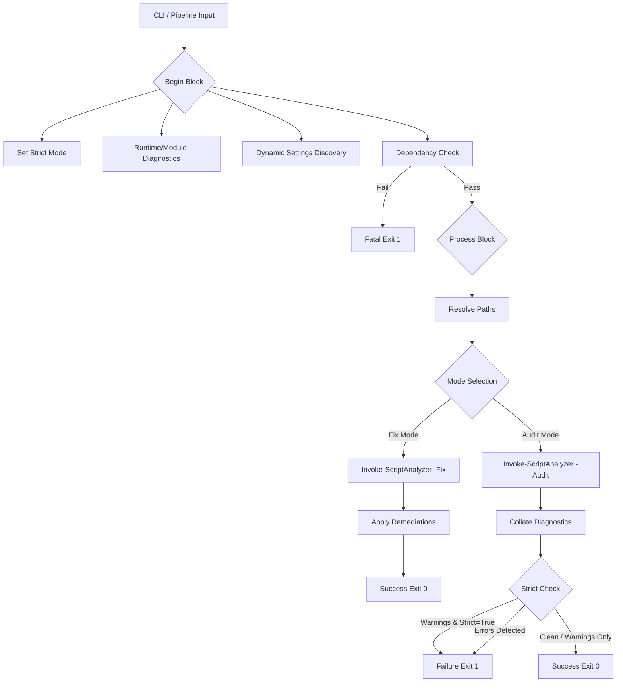

# PSLint Technical Specification & Orchestration Guide

## 1. Application Overview and Objectives

**PSLint** is an orchestration wrapper for the `PSScriptAnalyzer` engine. Its primary objective is to enforce standardized code quality across the repository by serving as a unified analysis gate.

### **Functional Objectives:**
- **Centralized Policy Enforcement**: Decouples linting rules from developer environments by dynamically discovering and applying repository-standard `.psd1` configurations.
- **Dependency Management**: Implements a bootstrap sequence to ensure the analysis engine is correctly provisioned on a host without manual intervention.
- **Automated Remediation**: Provides an interface for the linter's "Auto-Fix" capabilities, allowing for programmatic remediation of stylistic issues.
- **CI/CD Integration**: Supplies deterministic exit codes and structured diagnostic output for consumption by automated build pipelines (e.g., Jenkins, GitLab CI, GitHub Actions).

---

## 2. Architecture and Design Choices

The architecture of PSLint is built on the principle of execution isolation and environmental consistency.

### **Key Design Patterns:**
- **PowerShell Pipeline Lifecycle**: The script utilizes the `begin/process` block pattern. This ensures that dependency verification and settings discovery are performed once per execution, while the actual analysis scales across pipelined file objects.
- **Bootstrap Logic**: The script implements a prioritized installation logic (checking for the module, then the NuGet provider, then attempting a TLS 1.2 secured download).
- **Strict-Mode Compliance**: The utility is designed to run under `Set-StrictMode -Version Latest`. To support this, it uses explicit array-wrapping for cmdlet results to prevent runtime exceptions when a scan returns exactly one finding.
- **Context-Aware Configuration**: It searches for configuration files in a prioritized directory hierarchy, allowing the tool to remain portable while staying tethered to repository standards.

---

## 3. Data Flow and Control Logic

The following diagram illustrates the operational flow of a PSLint execution, from initial parameter binding through to the generation of the final CI/CD exit status.



### **Operational Sequence:**
1.  **Initialization**: Sets the runtime environment and initializes the `$script:PSLintSettingsFile` pointer.
2.  **Verification**: Validates the presence of the `PSScriptAnalyzer` module. If missing, it negotiates TLS 1.2 and installs the module to the `CurrentUser` scope.
3.  **Path Resolution**: Transforms relative paths into absolute literals to ensure reporting accuracy across nested directories.
4.  **Analysis**: Executes the underlying engine using the discovered settings file.
5.  **Exit Strategy**: Evaluates the severity of findings against the `-Strict` flag to determine the final process exit code.

---

## 4. Configuration & Policy Enforcement

PSLint relies on an external configuration file to define the ruleset for the repository. This file serves as the machine-enforced governance document for the entire codebase.

### **Settings File (`PSScriptAnalyzerSettings.psd1`)**
The linter automatically looks for this file in `$PSScriptRoot`, its parent directory, or the Current Working Directory ($PWD). This file controls:
- **IncludeRules**: Explicit list of rules to run (e.g., `PSAvoidUsingWriteHost`, `PSAvoidGlobalVars`).
- **ExcludeRules**: Rules to skip for this specific repository.
- **Severity Levels**: Tuning of what constitutes an Error vs. a Warning.

### **Major Rule Categories & Intent**
The analysis policy is categorized into four primary domains to ensure comprehensive code health:

| Category | Intent | Example Rules |
| :--- | :--- | :--- |
| **Security** | Detects high-risk patterns that could lead to credential exposure or arbitrary code execution. | `PSAvoidUsingPlainTextForPassword`, `PSAvoidUsingInternalURLs` |
| **Reliability** | Identifies logic flaws that may result in runtime failures or unpredictable behavior in different environments. | `PSUseDeclaredVarsMoreThanAssignments`, `PSPossibleIncorrectUsageOfAssignmentOperator` |
| **Maintainability** | Enforces professional standards to ensure code is portable, readable, and well-documented. | `PSAvoidUsingCmdletAliases`, `PSUseSingularNouns`, `PSProvideDefaultParameterValue` |
| **Styling & Hygiene** | Standardizes the visual and structural formatting of the code for consistent repository aesthetics. | `PSUseConsistentWhitespace`, `PSAvoidTrailingWhitespace`, `PSUseConsistentIndentation` |

To modify the analysis policy, edit the `.psd1` file directly. PSLint will pick up the changes on the next execution.

---

## 5. Exit Code Specification

For integration with CI/CD runners, PSLint returns the following exit codes:

| Exit Code | Condition |
| :--- | :--- |
| **0** | **Success**: No issues found, or warnings found while `-Strict` was disabled. |
| **1** | **Failure**: Critical Errors detected, OR Warnings detected while `-Strict` was enabled, OR Dependency installation failed. |

---

## 6. Dependencies

PSLint is designed for portability but requires the following environment components:

| Component | Minimum Version | Purpose |
| :--- | :--- | :--- |
| **PowerShell** | 5.1+ (Core/Desktop) | Core execution runtime. |
| **PSScriptAnalyzer** | 1.18.0+ | Static analysis engine. |
| **NuGet Provider** | 2.8.5.201+ | Required for module installation from PSGallery. |
| **TLS Protocol** | TLS 1.2 | Required for secure communication with the PowerShell Gallery. |

---

## 7. Command Line Arguments

| Argument | Type | Default | Description |
| :--- | :--- | :--- | :--- |
| `-Path` | `string[]` | `$null` | Target files or directories. Supports pipeline input and wildcards. |
| `-Recursive` | `switch` | `$false` | Recursively process subdirectories in the provided path. |
| `-Strict` | `switch` | `$false` | Escalates Warnings to Errors. Causes the script to exit with code 1 if any warnings are found. |
| `-Fix` | `switch` | `$false` | Triggers the Auto-Fix pass to automatically remediate common issues. |
| `-ExcludeRule` | `string[]` | `@()` | List of specific analyzer rules to ignore during this session. |
| `-RuntimeInfo` | `switch` | `$false` | Displays host-level diagnostics (PSVersion, OS, Executable Path). |
| `-ListModules` | `switch` | `$false` | Enumerates all installed modules to verify the environment state. |
| `-CheckLinter` | `switch` | `$false` | Performs the dependency bootstrap sequence without running analysis. |

---

## 8. Detailed Usage Examples

### **Scenario A: Standard Developer Audit**
Scan a local directory for issues without failing on warnings.
```powershell
.\audit\pslint.ps1 -Path .\os_sys\ -Recursive
```

### **Scenario B: CI/CD Pipeline Gate (Strict Enforcement)**
Used in build definitions to reject code that contains any warnings or errors.
```powershell
.\audit\pslint.ps1 -Path .\ -Recursive -Strict
```

### **Scenario C: Automated Debt Remediation**
Automatically fix common formatting or alias issues across the entire `audit` folder.
```powershell
.\audit\pslint.ps1 -Path .\audit\ -Fix
```

### **Scenario D: Pipeline-Based Bulk Processing**
Pass specific files identified by a git diff directly into the linter.
```powershell
Get-ChildItem -Filter *.ps1 | .\audit\pslint.ps1 -Strict
```

### **Scenario E: Environment Verification**
Validate that a CI build agent is correctly provisioned for PowerShell analysis.
```powershell
.\audit\pslint.ps1 -CheckLinter -RuntimeInfo
```
