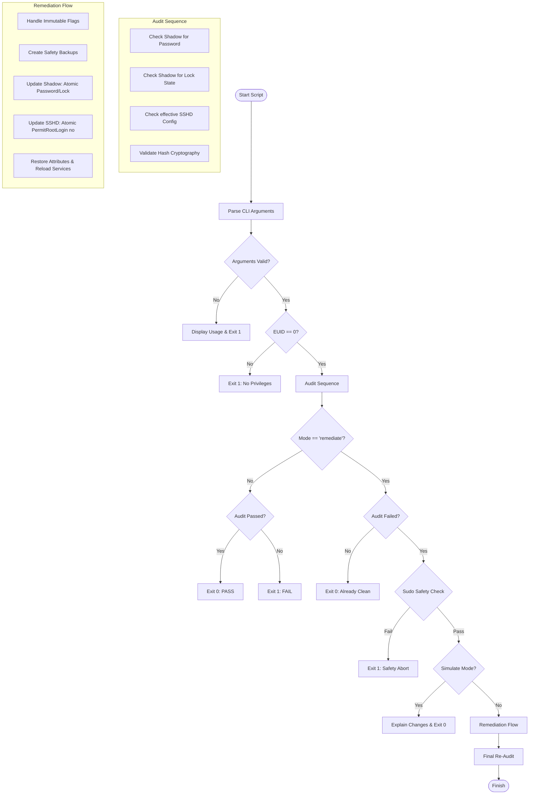

# Root Security Audit & Remediation (root_audit.sh)

## Application Overview and Objectives
The `root_audit.sh` utility is a security orchestration script for RHEL 9+ or Ubuntu 24.04+ environments. Its primary objective is to enforce a rigorous security posture for the `root` account, aligning with modern CIS and STIG compliance requirements.

The application serves two primary functions:
1.  **Security Audit**: A non-intrusive, read-only assessment of the root account's current state (password status, lock state, SSH accessibility, and cryptographic hash strength).
2.  **Automated Remediation**: A deterministic process to harden the root account by enforcing complex 32-character passwords, locking the account to prevent direct interactive login, and disabling direct SSH access, all while maintaining strict operational safety.

## Architecture and Design Choices
### 1. Modular Functional Design
The script is architected as a collection of discrete, idempotent functions. This high-level modularity includes:
- **Service Isolation**: Dedicated functions for service management (e.g., `reload_ssh_service`).
- **Audit Orchestration**: Centralized `run_full_audit` for consistent state checking.
- **Security Logic**: Decoupled helpers for sudoers path discovery and group membership detection.
- **Testability**: Functions can be sourced and unit-tested in isolation without triggering the `main` execution flow.

### 2. Operational Safety & Atomicity
Security tooling that modifies core system files like `/etc/shadow` or `/etc/sshd_config` must be fail-safe.
-   **Atomic Edits**: Modifications to configuration files use a `mktemp` -> `sed` -> `mv` pattern. The `mv` command ensures an atomic replacement, preventing system files from being left in a corrupted state if the script is interrupted.
-   **Automatic Backups**: Every file modification is preceded by a timestamped backup (`file.YYYYMMDDhhmmss`) with preserved attributes (`cp -p`).
-   **Immutable Attribute Handling**: The script detects and handles the Linux `immutable` (`i`) attribute using `lsattr` and `chattr`, ensuring it can operate on systems hardened with filesystem-level locks.

### 3. Non-Interactive Orchestration
Designed for execution via automation platforms (Ansible, Puppet, Salt) or service accounts, the script is fully non-interactive. It relies on deterministic CLI arguments and returns standard exit codes (0 for success/pass, non-zero for failure).

### 4. Sudo Safety "Kill-Switch"
A critical architectural safety feature is the `verify_sudo_users` function. It prevents administrative "brick" scenarios by aborting any destructive remediation (like locking root) if it cannot confirm the existence of at least one other non-root user with `sudo` privileges.

## Data Flow and Control Logic



## Dependencies
The script utilizes standard Linux core utilities available on all RHEL/Ubuntu minimal installations. No third-party modules or libraries are required.

-   **Shell**: `bash` (4.0+)
-   **Core Utils**: `grep`, `sed`, `awk`, `cut`, `tr`, `find`, `mktemp`, `cp`, `mv`, `date`.
-   **User Management**: `passwd`, `chpasswd`, `getent`.
-   **System Management**: `systemctl` (for SSHD reload).
-   **Security**: `lsattr`, `chattr` (for immutable flag handling), `sshd` (for `-T` config auditing).

## Command Line Arguments

| Argument | Type | Default | Description |
| :--- | :--- | :--- | :--- |
| `--mode` | String | `audit` | Execution mode. Options: `audit` (read-only) or `remediate` (fix). |
| `--password` | String | N/A | (Remediate only) Sets the root password. **Security Note**: Prefer using the `ROOT_PASSWORD` environment variable to avoid process list visibility. |
| `--generate` | Flag | `false` | (Remediate only) Automatically generates a secure 32-char password. |
| `--simulate` | Flag | `false` | (Remediate only) Explains changes without applying them (Dry-run). |
| `--json` | Flag | `false` | Enables CI/CD friendly JSON output on STDOUT. |

### Configuration via Environment Variables
For advanced orchestration, the following variables can be set to override defaults:
-   `SHADOW_FILE`: Path to shadow file (default: `/etc/shadow`)
-   `SSH_CONFIG`: Path to sshd_config (default: `/etc/ssh/sshd_config`)
-   `SUDOERS_FILE`: Path to main sudoers (default: `/etc/sudoers`)
-   `MIN_PASS_LEN`: Minimum password length policy (default: 32)

## Usage Examples

### 1. Standard Audit
Performs a read-only security check.
```bash
sudo ./root_audit.sh --mode audit
```
*Note: Executing the script without arguments will display the usage information.*

### 2. Automated Remediation with Generation
Generates a 32-character password, locks the account, and hardens SSH.
```bash
sudo ./root_audit.sh --mode remediate --generate
```

### 3. Manual Remediation
Uses a pre-defined password that meets the 32-character policy.
```bash
sudo ./root_audit.sh --mode remediate --password 'v@ryStr0ngP@ssw0rd_32_Chars_Long!!'
```

### 4. Integration via Environment Overrides
Used for testing or non-standard filesystem layouts.
```bash
SSH_CONFIG="/custom/sshd_config" sudo ./root_audit.sh --mode audit
```

## Unit Tests
The `root_audit_test.sh` suite provides comprehensive validation of the application's logic, safety mechanisms, and error handling. It is designed to run in a fully isolated environment without modifying the host system.

### Test Execution
To execute the test suite, run the following command from the source directory:
```bash
./root_audit_test.sh
```
*Note: The test suite creates a temporary workspace in `$TMPDIR/unitests/<uuid>` and performs an automatic cleanup upon completion.*

### Test Coverage Scenarios
The suite covers **28 distinct validation points**, categorized as follows:

| Category | Scenarios Covered |
| :--- | :--- |
| **Password Policy** | Exhaustive validation of length and complexity (uppercase, lowercase, digits, special characters) including rejection paths. |
| **Attribute Handling** | Detection, temporary removal, and restoration of the `immutable` (i) flag during file operations. |
| **File Safety** | Verification of timestamped backups (`.YYYYMMDDHHMMSS`) and atomic state transitions. |
| **Audit Engine** | Logic validation for detecting unlocked accounts, weak cryptographic hashes (MD5), and insecure SSH configurations. |
| **Sudo Safety Kill-Switch** | Multi-path discovery simulation for administrators (groups and explicit entries) to prevent administrative lockout. |
| **CLI Orchestration** | Comprehensive exit code validation for all modes, no-argument guards, and environment variable (`ROOT_PASSWORD`) injection. |
| **JSON Mode** | Verification of schema integrity and machine-readable output for CI/CD integration. |
| **Privilege Logic** | Strict enforcement of `EUID=0` requirements for both successful execution and graceful failure. |

### 5. Compliance Verification (Audit + Generation)
Runs a full compliance remediation with an auto-generated password and ensures all subsequent checks pass.
```bash
# Generate password, harden SSH, and perform a post-remediation audit
sudo ./root_audit.sh --mode remediate --generate
```

### 6. Secure Remediation (Environment Variable)
To avoid sensitive data appearing in process lists (`ps`) or shell history, use the `ROOT_PASSWORD` environment variable.
```bash
# Pass password securely via environment
export ROOT_PASSWORD='v@ryStr0ngP@ssw0rd_32_Chars_Long!!'
sudo -E ./root_audit.sh --mode remediate
```
*Note: The `-E` flag for `sudo` is used to preserve the environment variable.*

## Remote Execution via SSH
When executing `root_audit.sh` remotely via SSH, you can pass the `ROOT_PASSWORD` variable securely using the following patterns.

### 1. Direct Command Prefix (Recommended)
This is the most common method. By prefixing the command with the variable assignment and using `sudo -E`, the variable is passed to the script's environment.
```bash
ssh -t user@remote-host "export ROOT_PASSWORD='your-secure-password'; sudo -E /path/to/root_audit.sh --mode remediate"
```
*Note: The `-t` flag is often required for `sudo` prompts over SSH.*

### 2. Piped Execution (No script on host)
If the script is not already present on the remote host, you can stream it over SSH while passing the environment.
```bash
cat root_audit.sh | ssh user@remote-host "export ROOT_PASSWORD='your-secure-password'; sudo -E bash -s -- --mode remediate"
```

### 3. SSH Configuration (SendEnv)
If your organization allows it, you can configure SSH to pass the environment variable automatically.
1.  **Remote Host**: Add `AcceptEnv ROOT_PASSWORD` to `/etc/ssh/sshd_config`.
2.  **Local Host**: Use `SendEnv` in your SSH command.
```bash
export ROOT_PASSWORD='your-secure-password'
ssh -o SendEnv=ROOT_PASSWORD user@remote-host "sudo -E /path/to/root_audit.sh --mode remediate"
```

## Simulation Mode
The `--simulate` flag allows you to dry-run the remediation process. It performs a full audit and sudo safety check, then explains every step it *would* take without modifying the system.

### Example Simulation
```bash
sudo ./root_audit.sh --mode remediate --generate --simulate
```

### Simulation Output Breakdown
- **Password**: Explains that a 32-character password would be enforced.
- **Locking**: Explains that the account would be locked in the shadow file.
- **SSH Hardening**: Details the atomic modification of `sshd_config` and the service reload.
- **Safety**: Confirms that backups and immutable attribute handling would be performed.

## JSON Mode for CI/CD
The `--json` flag enables machine-readable output on `STDOUT`. This is ideal for integration with automation tools, monitoring systems, and security orchestrators.

### Example Usage
```bash
sudo ./root_audit.sh --mode audit --json
```

### JSON Schema
The output is a structured object containing:
- `timestamp`: ISO-8601 execution time.
- `target_user`: Target account name.
- `mode`: Execution mode (`audit` or `remediate`).
- `immutable`: Boolean indicating if `chattr +i` was detected on scoped files.
- `status`: `success` or `failure`.
- `audit`: Granular results of all security checks (Audit mode only).
- `remediation`: Summary of actions taken (Remediate mode only).

`jq` Support: If `jq` is installed, the output will be pretty-printed. If not, the script falls back to raw JSON strings. Standard log messages are preserved on `STDERR`.

### 7. Simulation with JSON Output
Combine flags to preview remediation steps in a machine-readable format without making system changes.
```bash
sudo ./root_audit.sh --mode remediate --generate --simulate --json
```
*This is the recommended pattern for validating remediation logic in CI/CD pipelines before production deployment.*

### JSON Output Examples

#### Audit Mode
```json
{
  "timestamp": "2026-04-23T14:47:54-05:00",
  "target_user": "root",
  "mode": "audit",
  "immutable": false,
  "simulate": false,
  "status": "failure",
  "audit": {
    "password_exists": "true",
    "account_locked": "false",
    "ssh_disabled": "false",
    "hash_strong": "true"
  }
}
```

#### Remediate Mode
```json
{
  "timestamp": "2026-04-23T14:50:12-05:00",
  "target_user": "root",
  "mode": "remediate",
  "immutable": true,
  "simulate": false,
  "status": "success",
  "remediation": {
    "password_updated": true,
    "account_locked": true,
    "ssh_hardened": true,
    "backup_created": true,
    "sudo_safety_passed": "true"
  }
}
```
