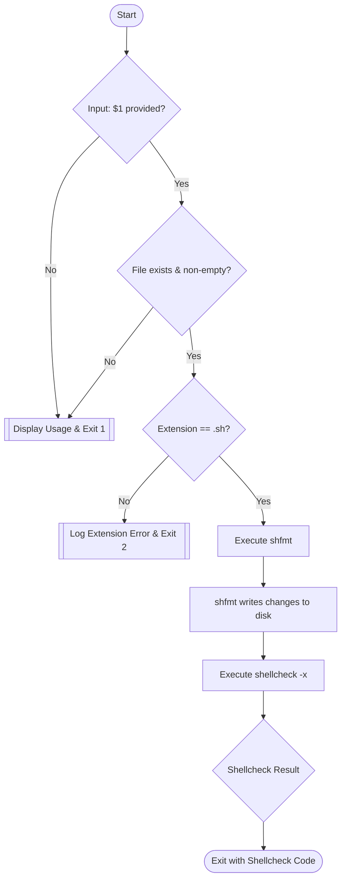

# shlint.sh - Bash Hygiene & Static Analysis Orchestrator

## Application Overview and Objectives

`shlint.sh` is a utility designed to enforce coding standards and maintain structural integrity across shell-based automation ecosystems.

### Core Objectives:
*   **Structural Standardization:** Enforce a uniform indentation and formatting style using `shfmt`, ensuring codebase consistency.
*   **Defensive Programming:** Utilize `shellcheck` to identify semantic errors, logical bugs, and POSIX/Bash-specific antipatterns.
*   **Workflow Integration:** Provide a simple entry point to validate script health before deployment.
*   **Transparency:** Abstract the complexity of underlying tool configurations into a simple, predictable interface.

---

## Architecture and Design Choices

The utility follows a **Fail-Fast Wrapper Architecture**, prioritizing validation before execution to prevent unnecessary processing or destructive formatting on non-target files.

### Design Principles:
1.  **Idempotency:** The script can be run multiple times on the same target without unintended side effects (outside of the initial formatting correction).
2.  **Modular Dependency Integration:** Instead of re-implementing formatting or linting logic, `shlint.sh` leverages industry-standard binaries (`shfmt` and `shellcheck`), focusing on the *orchestration* and *configuration* of these tools.
3.  **Strict File Scoping:** To prevent accidental corruption of configuration files or binaries, the script enforces a `.sh` extension requirement, ensuring it only operates on intended shell scripts.
4.  **Operational Simplicity:** Minimalist CLI design ensures zero learning curve for systems engineers while providing maximum utility.

---

## Data Flow and Control Logic

The operational flow follows a linear execution path with integrated guardrails. The process begins with environment/input validation and terminates after the secondary analysis tool returns its status.

### Mermaid Flow Diagram



### Control Logic Details:
*   **Validation Phase:** The script uses `[[ -s "$1" ]]` to verify existence and content, followed by a pattern match `[[ "$1" != *.sh ]]` for type safety.
*   **Mutation Phase:** `shfmt` is invoked with `-w` (write), applying specific organizational tokens:
    *   `-i 2`: 2-space indentation (Industry standard for readability).
    *   `-ci`: Indented case patterns for logical separation in switch blocks.
    *   `-sr`: Space after redirects for visual clarity in I/O operations.
*   **Analysis Phase:** `shellcheck` is run with the `-x` flag, allowing the analyzer to follow `source` and `.` commands to validate the full dependency tree of the script.

---

## Dependencies

To maintain its operational capabilities, `shlint.sh` requires the following modules to be present in the system's `PATH`:

| Dependency | Purpose | Source/Provider |
| :--- | :--- | :--- |
| **Bash** (4.0+) | Execution environment for the orchestrator. | GNU Project |
| **shfmt** | Lexical analysis and source code formatting. | [mvdan/sh](https://github.com/mvdan/sh) |
| **shellcheck** | Static analysis and bug detection. | [koalaman/shellcheck](https://github.com/koalaman/shellcheck) |

---

## Command Line Arguments

The script adheres to a standard UNIX-style single-argument interface.

| Argument | Type | Description | Default | Mandatory |
| :--- | :--- | :--- | :--- | :--- |
| `$1` | `String (Path)` | The absolute or relative path to the `.sh` file to be processed. | N/A | **Yes** |

### Exit Codes:
*   **0**: Success. Script is formatted and passes linting.
*   **1**: Usage/IO Error (File missing or empty).
*   **2**: Type Error (Incorrect file extension).

---

## Detailed Examples

### 1. Standard Execution
Automating the hygiene of a local script:
```bash
./shlint.sh my_database_backup.sh
```
*Effect: `my_database_backup.sh` is reformatted to 2-space indentation and any logic errors are printed to stdout.*

### 2. Validation Failure (Wrong Extension)
Attempting to run against a non-shell file:
```bash
./shlint.sh README.md
```
*Output:*
```text
Error: File 'README.md' does not have a .sh extension.
```

### 3. CI/CD Integration (Pipeline)
Incorporating into a build pipeline to block commits with poor hygiene:
```bash
# In a shell executor block
find . -name "*.sh" -exec ./shlint.sh {} +
if [ $? -ne 0 ]; then
    echo "Hygiene check failed. Please fix script errors."
    exit 1
fi
```

### 4. Handling Sourced Dependencies
Because `shlint.sh` uses `shellcheck -x`, it will validate external includes:
```bash
# content of main.sh
source ./lib/utils.sh
check_disk_usage
```
Running `./shlint.sh main.sh` will also verify that `utils.sh` exists and contains valid code.
