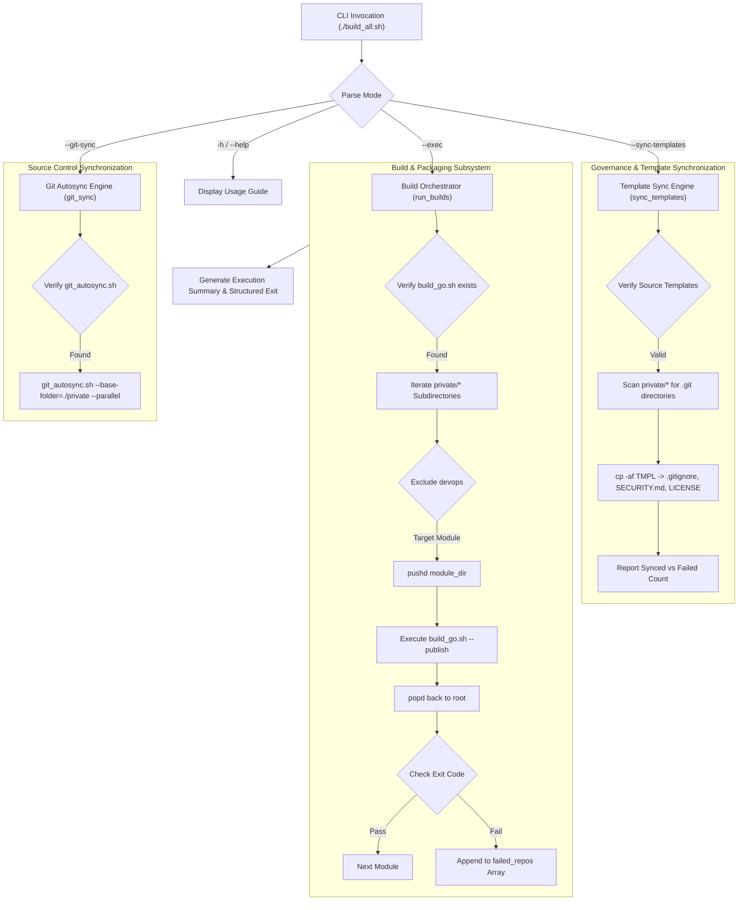
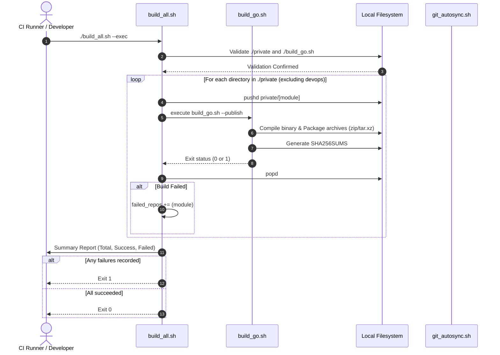
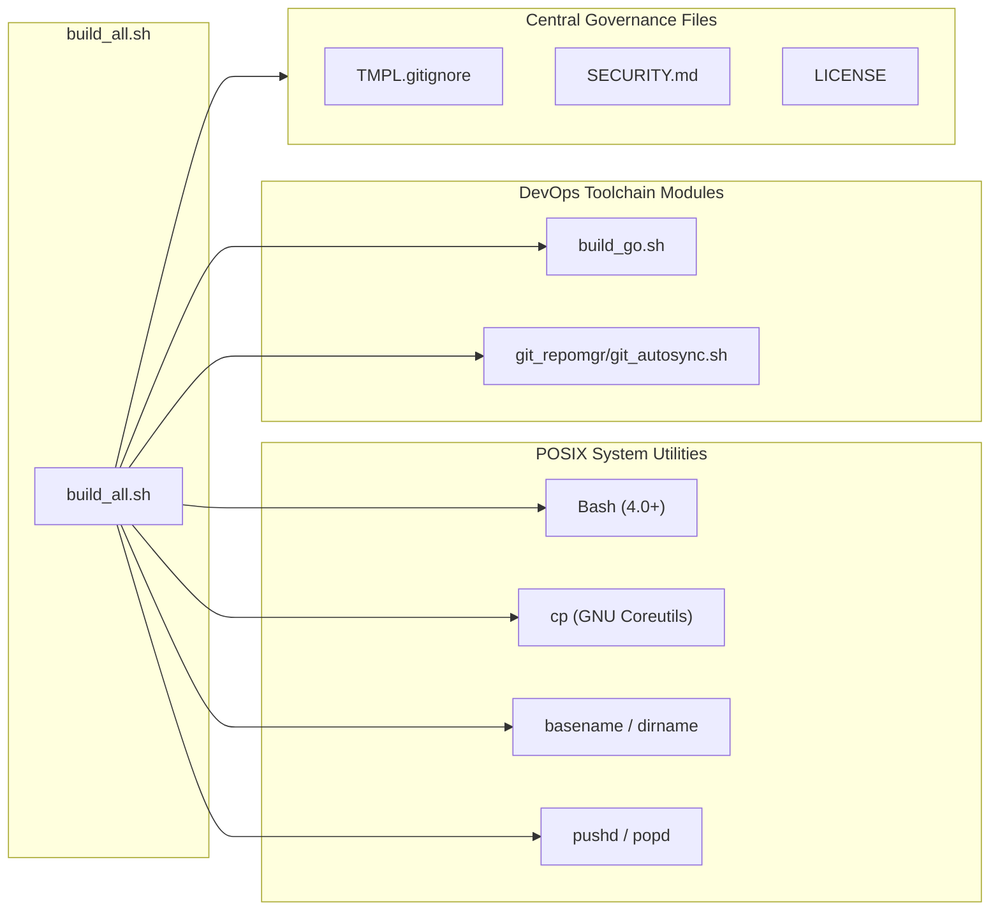
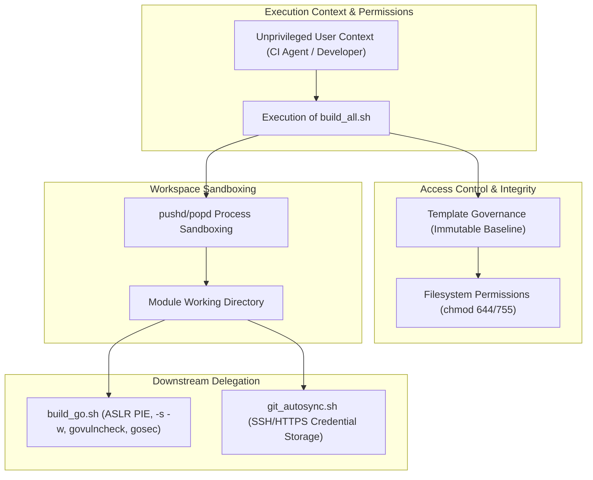

# Architecture Reference: Multi-Module Build Orchestrator (`build_all.sh`)

This document provides an architectural specification, operational flow analysis, and technical reference for [build_all.sh](build_all.sh), the multi-module build orchestrator and governance automation engine within the Devops toolchain.

---

## 1. Application Overview and Objectives

`build_all.sh` serves as the top-level orchestration controller across all sub-projects and service modules residing in the codebase repository structure (primarily targeting the `private/` workspace directory). It standardizes module iteration, automated compilation, template governance, and Git synchronizations.

```
+-----------------------------------------------------------------------------------+
|                                   build_all.sh                                    |
|                                                                                   |
|  +--------------------+   +--------------------+   +---------------------------+  |
|  | Template Sync Engine|  | Module Build Runner|  | Centralized Git Autosync  |  |
|  | (.gitignore/LICENSE|  | (Sequentially calls|  | (Delegates to              |  |
|  |  /SECURITY.md)     |  |  build_go.sh)      |  |  git_autosync.sh)         |  |
|  +--------------------+   +--------------------+   +---------------------------+  |
+-----------------------------------------------------------------------------------+
```

### Core Objectives
* **Unified Build Orchestration:** Automates batch compilation, auditing, and packaging of all internal modules by sequentially invoking the underlying compilation engine ([build_go.sh](build_go.sh) with `--publish`).
* **Governance & Template Enforcement:** Centrally synchronizes repository configuration files (`TMPL.gitignore`, `SECURITY.md`, and `LICENSE`) to ensure strict legal, security, and repository cleanliness compliance across all active projects.
* **Workspace Isolation & Sandboxing:** Leverages directory stack management (`pushd`/`popd`) to run builds in local module scopes without environment contamination or directory path drift.
* **Git Pipeline Integration:** Coordinates parallel Git commits and updates across all active sub-repositories via integration with `git_autosync.sh`.
* **Failure Accounting & Diagnostic Reporting:** Tracks execution statuses across all discovered sub-modules, aggregating failure logs and returning structured exit codes for CI/CD pipeline automation.

---

## 2. Architecture and Design Choices, Assumptions, Edge Cases, Performance

### 2.1. Architectural Layout



### 2.2. Design Principles & Choices
1. **Dynamic Path Resolution:** Uses `${BASH_SOURCE[0]}` to resolve the root directory dynamically (`SCRIPT_DIR`). This guarantees execution stability whether called from root, subdirectories, or external CI wrappers.
2. **Directory Sandboxing:** Employs `pushd "$d" &> /dev/null` and `popd &> /dev/null` inside the build loop, guaranteeing that environment path shifts and current working directory states remain isolated to each individual build run.
3. **Selective Exclusion Matrix:** Maintains a declarative `CODE_EXCLUDES="devops"` filter to prevent recursive build loops or attempting compilation on infrastructure-only repositories.
4. **Fail-Fast Preconditions vs. Batch Resilience:**
   - **Fail-Fast Preconditions:** Immediately terminates if required base structures (`private/`, `TMPL.gitignore`, `build_go.sh`) are missing.
   - **Batch Execution Resilience:** When running module builds, a single module failure does not crash the entire orchestration loop; instead, it is captured in `failed_repos`, allowing subsequent modules to build while still guaranteeing a non-zero exit code (`exit 1`) at completion.

### 2.3. Assumptions
* All project repositories reside within the `${CODE_BASE}` directory (default: `private`).
* Each project module is an autonomous unit compatible with the standard compilation engine ([build_go.sh](build_go.sh)).
* Central templates (`TMPL.gitignore`, `SECURITY.md`, `LICENSE`) are maintained in the root directory alongside `build_all.sh`.

### 2.4. Edge Cases Handled
* **Uninitialized Git Directories in Template Sync:** `sync_templates` verifies both `[ -d "$repo" ]` and `[ -e "$repo/.git" ]` before attempting file copies, preventing pollution of non-repository directories.
* **Directory Enter Failures:** If `pushd` fails due to permissions or broken symlinks, the error is immediately logged and tracked in `failed_repos` without unbalancing the directory stack.
* **Non-Uniform Exit Reporting:** Tracks cumulative success and failure counts, ensuring pipeline aborts if `total_repos != success_count`.

---

## 3. Data Flow and Control Logic

### 3.1. Operational Flow and Code Relations



### 3.2. Data Sequences
1. **CLI Parameter Routing:** The entrypoint `main "$@"` matches arguments against `--sync-templates`, `--git-sync`, or `--exec`.
2. **Directory Enumeration:** Discovers directory names under `private/*`.
3. **Execution Context Switch:** Enters target sub-project directory via `pushd`.
4. **Downstream Compilation:** Calls `build_go.sh --publish`, passing build, test, and archive responsibilities to the core engine.
5. **Output Validation & Metric Aggregation:** Evaluates exit codes, updates cumulative counters, and prints tabular diagnostic summaries.

---

## 4. Performance and Scalability

### 4.1. Concurrency Model
* **Build Orchestration (`--exec`):** Sequential execution model per repository. This prevents CPU and I/O thrashing during heavy Go compiler operations, memory-intensive static analysis (`golangci-lint`), and parallel test execution handled internally by each Go build.
* **Git Synchronization (`--git-sync`):** Leverages parallel process dispatching via `git_autosync.sh --parallel`, allowing network-bound Git fetch/push operations to run concurrently across all modules.

### 4.2. Resource Management
* **Filesystem Descriptors:** Suppresses subshell stdout/stderr during directory navigation (`&> /dev/null`) to minimize I/O pipe overhead.
* **Process Stack Isolation:** Uses explicit `popd` calls to guarantee that directory handles are cleanly released after each module run.

---

## 5. Dependencies

### 5.1. System and Script Dependencies



| Dependency | Classification | Minimum Version | Purpose |
| :--- | :--- | :--- | :--- |
| **Bash** | System Shell | `4.0+` | Shell interpreter supporting array operations and regex matching. |
| **GNU Coreutils** | System Utility | POSIX standard | `cp -af`, `basename`, `dirname`, `mkdir`. |
| **[build_go.sh](build_go.sh)** | Internal Script | `1.2.3xg+` | Go compilation, linting, validation, and archive engine. |
| **[git_autosync.sh](../git_repomgr/git_autosync.sh)** | Internal Script | `1.0.0+` | Multi-repository Git sync orchestrator. |
| **Governance Templates** | Config Assets | Latest | `TMPL.gitignore`, `SECURITY.md`, `LICENSE`. |

---

## 6. Security Architecture

### 6.1. Security Boundary Diagram



### 6.2. Security Assessment

| Assessment Domain | Status | Technical Implementation |
| :--- | :--- | :--- |
| **Encryption in Transit** | **Compliant** | All remote repository interactions invoked during `--git-sync` or module dependency fetching leverage authenticated TLS/HTTPS (`https://proxy.golang.org`) or SSH key exchanges. |
| **Secret Management** | **Compliant** | Zero embedded credentials, tokens, or private keys. All authentication relies on native Git credential helpers, environment variables, or SSH agent contexts. |
| **Authentication & RBAC** | **Compliant** | Governed by OS-level filesystem permissions and repository branch protection rules in Git. Script restricts operations to user-owned project directories. |
| **Template Governance** | **Compliant** | Enforces consistent `SECURITY.md` reporting policies and `LICENSE` files across all internal repositories, eliminating compliance drifts. |
| **Unprivileged Execution** | **Compliant** | Fully operates in non-root/unprivileged user context. No `sudo` or elevated privilege escalation required. |
| **Code Sanitization** | **Compliant** | Downstream builds enforce `dos2unix` and uniform POSIX file permissions (`chmod 644` for files, `chmod 755` for executables). |

---

## 7. Code Quality Assessment and Best Practices

* **POSIX Compliance & Portability:** Uses standard parameter expansions and built-in array handling compatible across Linux, MSYS2, and Cygwin environments.
* **Fail-Fast Error Handling:** Pre-flight validations prevent execution on corrupt workspace structures.
* **Non-Destructive Operations:** Template synchronization uses `cp -af` to preserve file attributes and timestamps while atomically updating configuration baselines.
* **Clear Logging & Metrics:** Produces structured console output with header bars, module tracking indicators (`[OK]` / `[ERROR]`), and summarized completion totals.

---

## 8. Command Line Arguments

| Flag | Argument | Type | Default | Description |
| :--- | :--- | :--- | :--- | :--- |
| `--exec` | *None* | Flag | `false` | Discovers and executes build orchestration across all active sub-projects via `build_go.sh --publish`. |
| `--sync-templates` | *None* | Flag | `false` | Synchronizes centralized `TMPL.gitignore`, `SECURITY.md`, and `LICENSE` templates into all active Git repos in `private/`. |
| `--git-sync` | *None* | Flag | `false` | Invokes the centralized Git autosync utility (`git_autosync.sh`) to synchronize all private repositories. |
| `-h, --help` | *None* | Flag | `false` | Displays script syntax, available options, and operational help. |

---

## 9. Usage Examples and Deployment Workflows

### 9.1. Synchronize Project Templates
Distribute the central `.gitignore`, `SECURITY.md`, and `LICENSE` files to all sub-repositories:
```bash
./build_all.sh --sync-templates
```
**Sample Output:**
```
Starting synchronization of templates...
Source: ./TMPL.gitignore -> .gitignore
Source: ./SECURITY.md -> SECURITY.md
Source: ./LICENSE -> LICENSE
Target directory: ./private
================================================================================
Processing private repository: dirpoller
  [OK] Successfully synchronized all templates.
Processing private repository: netprobe
  [OK] Successfully synchronized all templates.
Processing private repository: authproxy
  [OK] Successfully synchronized all templates.
================================================================================
Synchronization completed.
Total repositories processed: 3
Successfully updated:        3
```

---

### 9.2. Execute Full Multi-Module Build Orchestration
Run the automated build, QA, and packaging pipeline across all discovered modules:
```bash
./build_all.sh --exec
```
**Sample Output:**
```
-----[PRIVATE/DIRPOLLER]-----------------------------------------------------------------------------------
Initialize Go Module criticalsys.net/dirpoller
Generate dependency list
Linting Code
Build Module criticalsys.net/dirpoller - Version: 1.4.0-20260827 [main.version] - Main Module: generic
dirpoller 1.4.0-20260827 (x86_64-pc-windows-msvc)
Generating distribution archive [D:/devel/distrib/dirpoller-1.4.0-20260827]
Calculating SHA256 checksums

-----[PRIVATE/NETPROBE]-----------------------------------------------------------------------------------
Generate dependency list
Linting Code
Build Module criticalsys.net/netprobe - Version: 2.1.0-20260827 [main.version] - Main Module: generic
netprobe 2.1.0-20260827 (x86_64-pc-windows-msvc)
Generating distribution archive [D:/devel/distrib/netprobe-2.1.0-20260827]
Calculating SHA256 checksums

================================================================================
Build Execution Summary:
Total modules processed: 2
Successfully built:      2
Failed builds:           0
================================================================================
```

---

### 9.3. Synchronize All Repositories with Git
Commit and push updates across all project sub-modules:
```bash
./build_all.sh --git-sync
```
**Sample Output:**
```
Starting Git synchronization across all private repositories...
Executing: ./private/devops/git_repomgr/git_autosync.sh --base-folder=./private --message="Module Updates" --parallel
================================================================================
[AUTOSYNC] Discovering git repositories in ./private...
[AUTOSYNC] Found 3 repositories. Starting parallel synchronization...
[AUTOSYNC] [dirpoller] Committed and pushed (3 files changed).
[AUTOSYNC] [netprobe] Committed and pushed (2 files changed).
[AUTOSYNC] [authproxy] Everything up-to-date.
[AUTOSYNC] Synchronization completed successfully.
```
