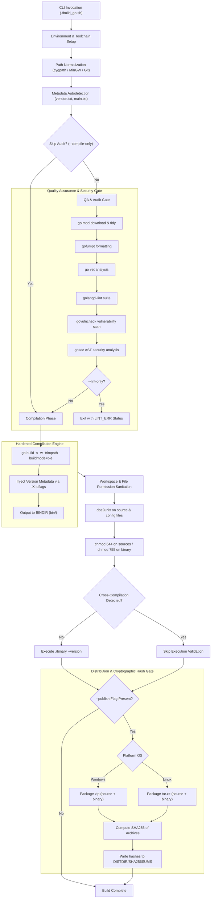
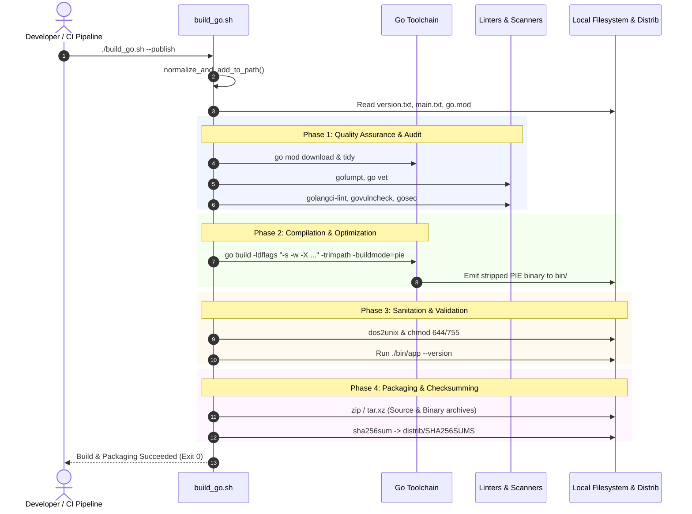
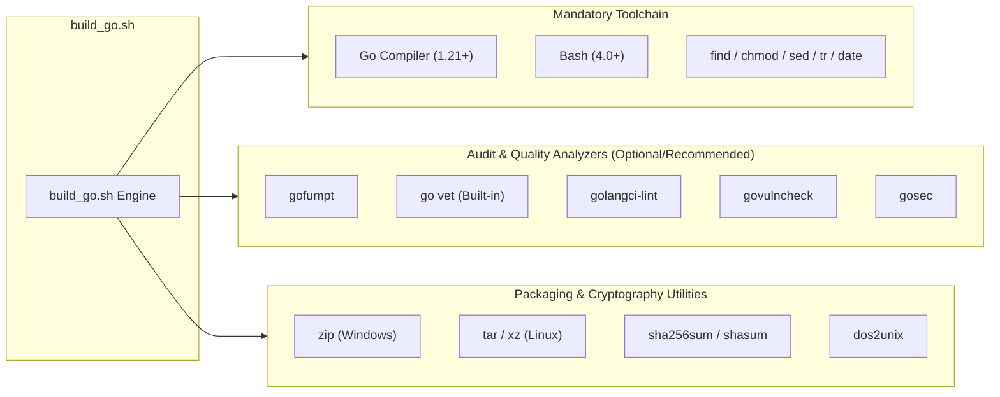
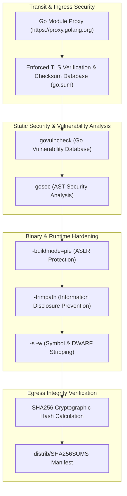

# Architecture Reference: Go Compilation & Quality Pipeline Engine (`build_go.sh`)

This document provides an architectural specification, operational sequence breakdown, and technical reference for [build_go.sh](build_go.sh), the core Go compilation, quality auditing, and packaging pipeline engine within the DevOps infrastructure.

---

## 1. Application Overview and Objectives

`build_go.sh` provides an enterprise-grade automated pipeline for Go applications. It enforces standardized formatting, executes multi-tier static code analysis and vulnerability scanning, compiles stripped Position Independent Executable (PIE) binaries with ASLR hardening, sanitizes codebases, and packages distribution archives accompanied by automated `SHA256SUMS` generation.

```
+-------------------------------------------------------------------------------------------------------+
|                                              build_go.sh                                              |
|                                                                                                       |
|  +---------------------+   +---------------------+   +---------------------+   +-------------------+  |
|  | Quality & Audit     |   | Compiler Engine     |   | Sanitation Phase    |   | Packaging Engine  |  |
|  | gofumpt, go vet     |-->| go build (-s -w,    |-->| dos2unix, chmod 644 |-->| zip / tar.xz      |  |
|  | golangci-lint,      |   |  -trimpath, -build- |   | chmod 755 binary    |   | SHA256 calculation|  |
|  | govulncheck, gosec  |   |  mode=pie, ldflags) |   | --version validation|   | (SHA256SUMS)      |  |
|  +---------------------+   +---------------------+   +---------------------+   +-------------------+  |
+-------------------------------------------------------------------------------------------------------+
```

### Core Objectives
* **Universal Path Normalization:** Transparently translates UNIX-like paths across Windows/MSYS2/Cygwin environments into Windows-native/mixed formats via `cygpath`, preventing compiler path resolution bugs and colon-separator collisions in `PATH`.
* **Zero-Trust Quality Assurance:** Enforces formatting standards (`gofumpt`), static analysis (`go vet`, `golangci-lint`), and security vulnerability detection (`govulncheck`, `gosec`) prior to binary compilation.
* **Hardened Binary Optimization:** Produces optimized, stripped (`-s -w`), path-trimmed (`-trimpath`), position-independent (`-buildmode=pie`) production binaries injected with version metadata via `-ldflags`.
* **Reproducible Packaging & Integrity:** Automates source and binary distribution bundle generation (`.zip` on Windows, `.tar.xz` on Linux) with computed `SHA256SUMS` files.
* **Cross-Compilation Awareness:** Automatically skips post-build runtime `--version` validation when target `GOOS`/`GOARCH` differs from the host environment.

---

## 2. Architecture and Design Choices, Assumptions, Edge Cases, Performance

### 2.1. Architectural Layout



### 2.2. Design Principles & Choices
1. **Dynamic Toolchain Discovery & PATH Injection:** The `normalize_and_add_to_path` routine handles custom `CC` paths and `GIT_BASE` paths, falling back to standard Windows MinGW/Git locations (`d:/dev/mingw64/bin`, `d:/dev/git/bin`) while converting Windows drive notation (`C:\...`) to UNIX `/c/...` to avoid POSIX `PATH` colon splitting.
2. **Metadata Auto-Discovery:**
   - Detects `APP_NAME` from `$(basename "$(pwd)")`.
   - Reads version numbers from `version.txt` (falling back to `dev`) and attaches the build timestamp: `${VERSION_VAL}-$(date +%Y%m%d)`.
   - Inspects `main.txt` to dynamically route custom entrypoint packages and custom version variable targets (`VERSION_PKG`).
3. **Hardened Compiler Flags:**
   - `-s -w`: Strips symbol tables and DWARF debug info to shrink binaries and deter reverse-engineering.
   - `-trimpath`: Strips absolute file system paths from panic traces and binary metadata.
   - `-buildmode=pie`: Generates Position Independent Executables, enabling full Address Space Layout Randomization (ASLR) protections by host OS kernels.
4. **Declarative Module Lock:** Honors `donot-update-mod.token`. If present, module upgrades (`go get -u`) are bypassed during QA unless `--update-modules` is explicitly supplied.
5. **DRY Packaging & Integrity Hashing:** Declares `SRC_ARC` and `BIN_ARC` variables per OS target and computes SHA256 checksums of archive basenames directly into `${DISTDIR}/SHA256SUMS`.

### 2.3. Assumptions
* Go 1.21+ compiler is installed and present in the host `PATH`.
* The project root contains a valid Go project structure or `go.mod` (auto-initialized if absent).
* Distribution output is anchored to `../bin` and `../distrib` relative to `build_go.sh`.

### 2.4. Edge Cases Handled
* **Missing Tooling Fallbacks:** Optional analyzers (`golangci-lint`, `govulncheck`, `gosec`) emit descriptive warnings instead of failing the build if not installed.
* **Cross-Compilation:** Detects when `GOOS` or `GOARCH` deviates from `$(go env GOOS)`/`$(go env GOARCH)` and gracefully bypasses binary execution validation (`--version`).
* **Line Ending Normalization:** Uses `dos2unix` across code and config files (`.go`, `.mod`, `.sum`, `.txt`, `.md`, `LICENSE`) to prevent CRLF-related build artifacts or checksum discrepancies across operating systems.

---

## 3. Data Flow and Control Logic

### 3.1. Operational Flow and Code Relations



### 3.2. Data Sequences
1. **Bootstrap & Path Ingress:** Normalizes paths and prepares `${BINDIR}` and `${DISTDIR}`.
2. **Dependency Resolution:** Pulls modules via `$GOPROXY="https://proxy.golang.org,direct"`.
3. **AST Audit & Vulnerability Check:** Scans Go Abstract Syntax Trees for lint defects and known CVEs.
4. **Binary Emission:** Compiles binaries into `../bin/${APP_NAME}${BIN_EXT}`.
5. **Distribution Egress:** Packages archives in `../distrib/` and commits checksum manifests to `SHA256SUMS`.

---

## 4. Performance and Scalability

### 4.1. Concurrency Model
* **Go Compiler Concurrency:** Automatically utilizes all available CPU cores (`GOMAXPROCS`) during compilation and test runs (`go test -v -cover ./...`).
* **Multi-Threaded Linting:** `golangci-lint` executes analysis passes concurrently across packages.
* **Batch Filesystem Operations:** Executes `find ... -exec dos2unix ... +` and `chmod ... +` using multi-file batch argument dispatching rather than per-file subshell invocations.

### 4.2. Compression & Binary Footprint
* Strips debugging symbols via `-ldflags="-s -w"`, reducing final binary size by up to 40-60%.
* Uses maximum compression (`zip -9rq` on Windows, `tar Jcf` with XZ on Linux) to minimize distribution bandwidth and storage.

---

## 5. Dependencies

### 5.1. Dependency Hierarchy



| Dependency | Classification | Optional/Required | Purpose |
| :--- | :--- | :--- | :--- |
| **Go** | Compiler | **Required** | Go build toolchain (v1.21+ recommended). |
| **Bash** | Shell Runtime | **Required** | Execution environment (Linux, Cygwin, MSYS2). |
| **gofumpt** | Formatter | Recommended | Strict code formatting. |
| **go vet** | Static Analyzer | **Required** | Standard Go correctness analysis (included with Go). |
| **golangci-lint**| Linter Runner | Recommended | Aggregated linter framework. |
| **govulncheck** | Vulnerability Scanner | Recommended | Official Go vulnerability scanner against known Go CVEs. |
| **gosec** | Security Scanner | Recommended | AST security scanner for risky coding patterns. |
| **dos2unix** | Text Sanitizer | Recommended | Normalizes line endings across operating systems. |
| **zip / tar / xz** | Archiver | **Required for --publish** | Compresses release artifacts. |
| **sha256sum** | Cryptographic Hash | **Required for --publish** | Computes SHA256 digests into `SHA256SUMS`. |

---

## 6. Security Architecture

### 6.1. Multi-Layer Security Model



### 6.2. Security Assessment

| Assessment Domain | Status | Technical Implementation |
| :--- | :--- | :--- |
| **Encryption in Transit** | **Compliant** | All dependency retrieval is routed via authenticated HTTPS TLS proxy (`https://proxy.golang.org`) verified against cryptographic hashes in `go.sum`. |
| **Secret Management** | **Compliant** | AST security scanning via `gosec` flags hardcoded API keys, passwords, and TLS misconfigurations. |
| **Authentication Configuration** | **Compliant** | Uses standard environment variables (`GOPRIVATE`, `GONOPROXY`, Git SSH agent) for private module registries without persistent secrets. |
| **RBAC & File Permissions** | **Compliant** | Enforces `chmod 644` across source and module assets, and sets `chmod 755` strictly on executable binary output. |
| **Vulnerability Scanning** | **Compliant** | Integrates `govulncheck` to detect vulnerabilities in dependencies matching the Go Vulnerability Database. |
| **Binary Hardening** | **Compliant** | Enables ASLR via `-buildmode=pie`, removes developer machine path leakage via `-trimpath`, and strips symbol tables with `-ldflags "-s -w"`. |
| **Integrity Assurance** | **Compliant** | Computes SHA-256 digests on all produced source and binary archives and stores them in `SHA256SUMS`. |
| **Unprivileged Context** | **Compliant** | Fully executable in standard user permissions; does not require administrative/root rights. |

---

## 7. Code Quality Assessment and Best Practices

* **Robust Parameter Handling:** Utilizes Bash regular expression matching (`[[ $* =~ ... ]]`) for flexible option parsing.
* **Automated Line-Ending Sanitization:** Recursively ensures all source files maintain consistent UNIX line endings (`dos2unix`).
* **Strict Compiler Invocations:** Aborts immediately if the compiler reports any compilation error.
* **Clean Cleanups:** Removes temporary uncompressed binary artifacts from the staging directory after packaging.

---

## 8. Command Line Arguments

| Flag | Argument | Type | Default | Description |
| :--- | :--- | :--- | :--- | :--- |
| `--publish` | *None* | Flag | `false` | Packages compiled binary and source into `.zip` (Windows) or `.tar.xz` (Linux) and computes `SHA256SUMS`. |
| `--compile-only` | *None* | Flag | `false` | Bypasses test runs, module updates, formatting, and linting, immediately proceeding to compilation. |
| `--lint-only` | *None* | Flag | `false` | Executes only formatting, linting, and vulnerability scanning, exiting with status code based on errors. |
| `--testsuite` | *None* | Flag | `false` | Executes automated test coverage suite (`go test -v -cover ./...`) and exits with test exit status. |
| `--update-modules` | *None* | Flag | `false` | Forces updates of all Go modules to latest releases (`go get -u -t ./...`). |
| `--vendor` | *None* | Flag | `false` | Syncs dependency vendor directory (`go mod vendor`). |
| `--main-path=<path>` | `<path>` | String | `""` (or from `main.txt`) | Overrides the target entrypoint package path for the Go compiler. |

---

## 9. Usage Examples and Deployment Workflows

### 9.1. Standard Compilation and Verification
Build the current Go application with standard quality checks:
```bash
./build_go.sh
```
**Sample Output:**
```
Generate dependency list
Linting Code
Build Module criticalsys.net/dirpoller - Version: 1.4.0-20260827 [main.version] - Main Module: generic
dirpoller version 1.4.0-20260827 (x86_64-pc-windows-msvc)
```

---

### 9.2. Build and Publish Distribution Archives with SHA256SUMS
Compile the binary and produce release archives with cryptographic SHA256 checksums:
```bash
./build_go.sh --publish
```
**Sample Output:**
```
Generate dependency list
Linting Code
Build Module criticalsys.net/dirpoller - Version: 1.4.0-20260827 [main.version] - Main Module: generic
dirpoller version 1.4.0-20260827 (x86_64-pc-windows-msvc)
Generating distribution archive [D:/devel/distrib/dirpoller-1.4.0-20260827]
Calculating SHA256 checksums
```
**Generated `SHA256SUMS` in `distrib/`:**
```
a3c4e61f9d54e5318cb9c02ff85e05a8d9b1a5e01c7694bf4f71a07df1319760  dirpoller-1.4.0-20260827-src.zip
78f0d8a6b1297e203f191b94d1b8219484b39b56f8f7c9e0134bc3d67964402a  dirpoller-1.4.0-20260827-w64.zip
```

---

### 9.3. Fast Iteration: Compile-Only Mode
Skip linters, tests, and formatting to quickly compile during rapid development:
```bash
./build_go.sh --compile-only
```
**Sample Output:**
```
Build Module criticalsys.net/dirpoller - Version: dev-20260827 [main.version] - Main Module: generic
dirpoller version dev-20260827 (x86_64-pc-windows-msvc)
```

---

### 9.4. CI/CD Static Analysis & Security Gate
Execute only quality checks and vulnerability scanners inside a CI pipeline runner:
```bash
./build_go.sh --lint-only
```
**Sample Output:**
```
Generate dependency list
Linting Code
Running golangci-lint...
Running govulncheck...
No vulnerabilities found.
Running gosec...
[gosec] Results: 0 issues found.
```

---

### 9.5. Automated Test Suite Execution
Run the full test suite with code coverage metrics:
```bash
./build_go.sh --testsuite
```
**Sample Output:**
```
=== RUN   TestPollerInitialization
--- PASS: TestPollerInitialization (0.02s)
=== RUN   TestEventStreamDispatch
--- PASS: TestEventStreamDispatch (0.05s)
PASS
coverage: 87.4% of statements
ok      criticalsys.net/dirpoller/pkg/poller    0.082s  coverage: 87.4% of statements
```
