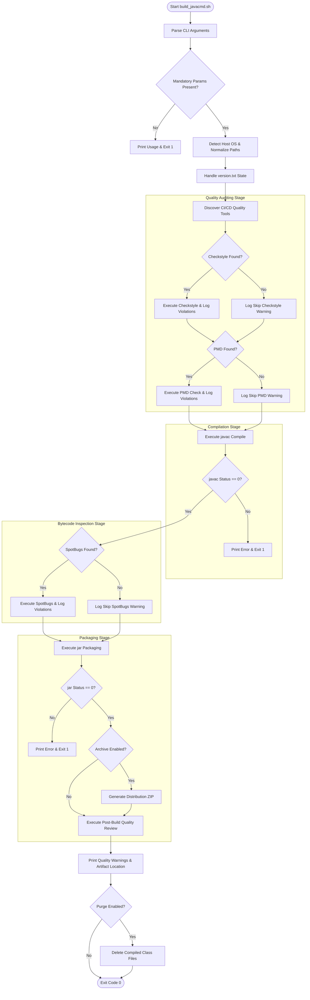
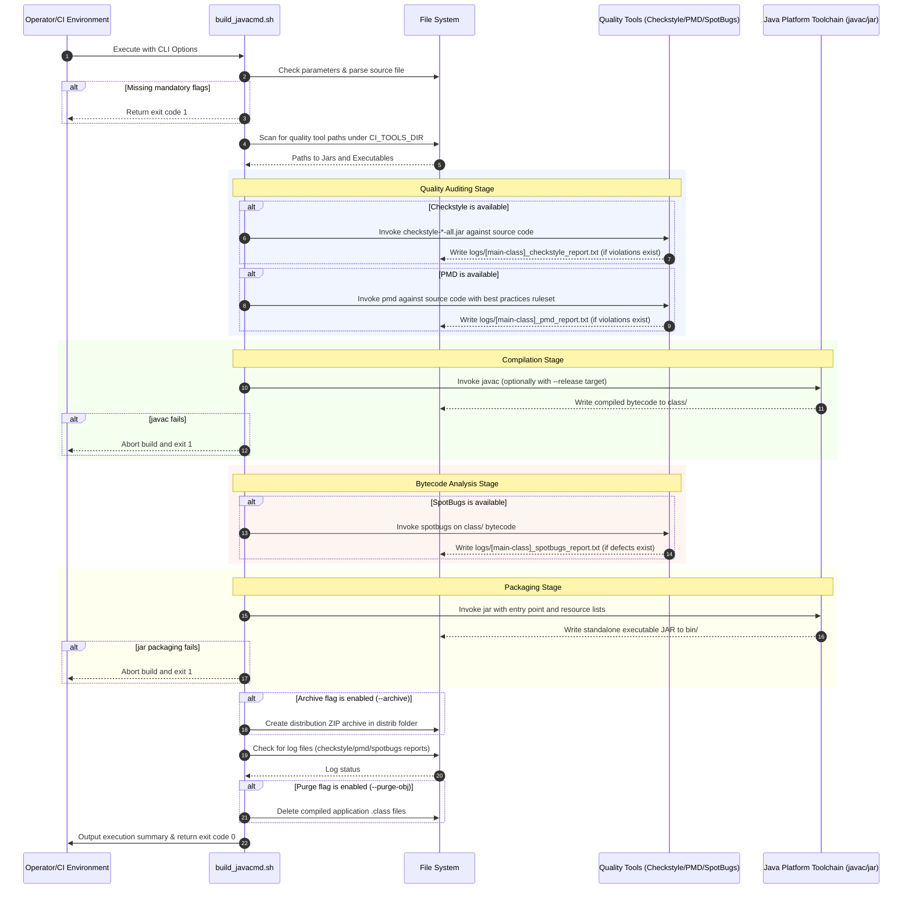

# build_javacmd.sh - Technical Specification and Operations Guide

This document describes the design, architecture, configuration, and operation of `build_javacmd.sh`, a unified build wrapper and quality auditing script for compiling, validating, and packaging standalone Java applications.

---

## 1. Application Overview and Objectives

`build_javacmd.sh` is an automated, utility-first pipeline script written in Bash. It provides a standardized build lifecycle for single-source Java files without requiring third-party build orchestration tools like Maven or Gradle. The script is structured for use in continuous integration (CI) workflows, build agents, and local development environments.

### Key Objectives
* **Unified Lifecycle Orchestration**: Integrates code formatting checks, static code analysis, compilation, bytecode verification, and JAR packaging into a single invocation.
* **Decoupled Tooling Discovery**: Dynamically scans designated directory paths to locate and execute code quality packages (Checkstyle, PMD, SpotBugs) if available, falling back gracefully to basic compilation and packaging stages when they are absent.
* **Cross-Platform Compatibility**: Standardizes execution paths and resolves differences in path representations (e.g., POSIX paths vs. Windows URI styles) on Linux environments and Windows emulation layers including MSYS2, Cygwin, and Git Bash.
* **Deterministic Configuration Control**: Provides strict command-line interfaces (CLI) for customizing compilation targets, runtime versions, entry points, and resource packaging dependencies.

---

## 2. Architecture and Design Choices

The script is structured as an orchestrator that wraps standard Java tools (`javac`, `jar`) and popular open-source analysis software (Checkstyle, PMD, SpotBugs).

### 2.1 Environmental Path Normalization
Operating system detection is completed by checking the `$OSTYPE` environment variable. The following logic ensures platform-independent execution:
* When running under Windows emulation layers (`msys`, `cygwin`, `win32`), directory paths passed to Java tools are processed using the `cygpath` utility if available. This converts POSIX-like paths (such as `/d/dev/ci-tools`) into Windows-native paths (such as `D:\dev\ci-tools`) that can be parsed by native Windows JVMs.
* File extension suffixes are adjusted dynamically based on the OS: PMD and SpotBugs are executed via `.bat` scripts on Windows environments and via native shell scripts on Unix/Linux platforms.

### 2.2 Defensive Tool discovery
Rather than hardcoding tool versions or paths, `build_javacmd.sh` scans `$CI_TOOLS_DIR` utilizing the `find` utility.
* **Checkstyle Jar**: Matches file patterns like `checkstyle-*-all.jar` or `checkstyle*.jar`.
* **PMD Home**: Locates matching directories named `pmd-bin-*` or `pmd`.
* **SpotBugs Home**: Locates matching directories named `spotbugs-*` or `spotbugs`.

If a tool is not found, the script emits a warning block to standard error and toggles a boolean flag (`RUN_CHECKSTYLE`, `RUN_PMD`, `RUN_SPOTBUGS`) to bypass the respective phase. This prevents build failures in systems that lack the full CI tools suite.

### 2.3 Modular Workspace Structure
The script maintains separation of inputs, compiler outputs, and quality report artifacts by writing to distinct subdirectories:
* **`class/`**: Designated output directory for Java class files compiled by `javac`.
* **`logs/`**: Archive location for output logs generated during quality audits. Linter reports are prefixed by the target main class name (e.g., `<main-class>_checkstyle_report.txt`, `<main-class>_pmd_report.txt`, and `<main-class>_spotbugs_report.txt`) to prevent naming collisions.
* **`bin/`**: Target directory for the final standalone executable JAR package.

---

## 3. Data Flow and Control Logic

### 3.1 Operational Flow and Code Relations
The execution path consists of sequential validations and tool executions. If compilation or packaging fails, the process is terminated immediately. Quality warnings, however, are captured as report files in the background and summarized at the end of the pipeline.

The diagram below maps the runtime stages and decision points of the build script:



### 3.2 Data Sequence Diagram
The sequence diagram below represents interactions between the script execution framework, the local file system, and external tool executables:



---

## 4. Dependencies

The script utilizes standard commands available in Unix shell environments and Java installations.

### 4.1 System Utilities
* **Shell**: `bash` (compatible with modern Linux distributions and Windows shells like MSYS2, Git Bash, or Cygwin).
* **Core Utilities**: Standard POSIX utilities including `mkdir`, `rm`, `find`, `head`, `cat`, and `shift`.
* **Path Conversion**: `cygpath` is required when running Windows Java tools inside Cygwin or MSYS2 systems.

### 4.2 Java Development Kit (JDK)
* **Compiler**: `javac` executable available in the system PATH.
* **Archiver**: `jar` executable available in the system PATH.
* **Target Version Compatibility**: Compiles and runs against JDK 8, 11, 17, 21, and 25 runtimes.

### 4.3 Code Quality Auditing Packages (Optional)
The script attempts to run these tools if they are found within the configured tools directory:
1. **Checkstyle**: Requires a `checkstyle-*-all.jar` package and a style rules configuration XML file located in the same directory as the build script, sharing the base name of the script with a `_checkstyle.xml` suffix (e.g. `<script_name>_checkstyle.xml`).
2. **PMD**: Requires a PMD installation directory (`pmd-bin-*`) containing the wrapper script (`bin/pmd` or `bin/pmd.bat`).
3. **SpotBugs**: Requires a SpotBugs directory (`spotbugs-*`) containing the wrapper script (`bin/spotbugs` or `bin/spotbugs.bat`).

---

## 5. Command Line Arguments

The script accepts CLI flags using two dashes (with optional support for one-dash structures on matching files or classes):

| Option Flag | Alternative Flag | Value Data Type | Default Value | Description |
| :--- | :--- | :--- | :--- | :--- |
| `--src-file` | `--srcfile` | `String` (File path) | *None (Mandatory)* | Absolute or relative path to the Java source file to compile. |
| `--main-class` | `--mainclass` | `String` (Class name) | *None (Mandatory)* | Fully qualified class name containing the application `main` method. |
| `--jar-name` | `--jarname` | `String` (File name) | *None (Mandatory)* | Output filename of the packaged JAR file (saved inside `bin/`). |
| `--tools-path` | *None* | `String` (Directory path)| `d:/dev/ci-tools` (Windows)<br>`/var/opt/tools` (Linux) | Directory containing Checkstyle, PMD, and SpotBugs installations. |
| `--version` | *None* | `String` (Version string)| *None* | Custom version tag. Writes value to `version.txt`. If omitted, the script reads an existing `version.txt` or writes `0.0.0-DEV`. |
| `--release` | *None* | `String` (Java version) | *None* | Compilation target release version (passed directly to `javac --release`). |
| `--resources` | *None* | `String` (Space-separated list) | `version.txt` | Files or directories to include inside the root of the output JAR. |
| `--distrib` | *None* | `String` (Directory path) | `.` (Current directory) | Target directory for output subdirectories. If specified, `bin/`, `class/`, and `logs/` will be created inside this folder. |
| `--purge-obj` | *None* | *Flag* | `false` | Toggles intermediate object purging. If enabled, intermediate compiled `.class` files corresponding to the built application (including its nested/inner classes) are deleted upon build completion. Linter reports and other build logs are unaffected. |
| `--archive` | *None* | *Flag* | `false` | Toggles distribution ZIP package generation. If enabled, compiles a distribution ZIP containing the built JAR file named `<jar-base>-<version>-<githash>-jdk<jdk_version>.zip` directly inside the distrib path, moving (deleting) the original JAR from the bin/ output folder. |

---

## 6. Detailed Operation Examples

```bash
# Enable execution permissions
chmod +x build_javacmd.sh
```

### Example 6.1: Basic Invocations
Compile and package a simple Java source file using the system default Java runtime version:
```bash
./build_javacmd.sh \
  --src-file src/Server.java \
  --main-class Server \
  --jar-name server.jar
```

### Example 6.2: Complete Release Pipeline Build
Build a production-ready archive targeting Java 11 compatibilities, using custom CI toolchain installations:
```bash
./build_javacmd.sh \
  --src-file src/com/services/DataProcessor.java \
  --main-class com.services.DataProcessor \
  --jar-name dataprocessor-service.jar \
  --tools-path /opt/ci/quality-tools \
  --version 1.4.2-RELEASE \
  --release 11
```

### Example 6.3: Packaging Multiple Resources
Compile a class and bundle its resource files (such as configuration files and templates) into the root of the output JAR:
```bash
./build_javacmd.sh \
  --src-file Application.java \
  --main-class Application \
  --jar-name webapp.jar \
  --resources "config.properties logging.properties static-assets/"
```

### Example 6.4: Running with Diagnostic Verification Bypassed
Run compilation in an environment that does not contain code quality audit installations. The script prints warnings but compiles and packages the file successfully:
```bash
./build_javacmd.sh \
  --src-file CoreEngine.java \
  --main-class CoreEngine \
  --jar-name engine.jar \
  --tools-path /tmp/empty-directory
```

### Example 6.5: Specifying Target Distribution Outputs Path
Redirect the output subdirectories (`bin/`, `class/`, and `logs/`) to a designated target location:
```bash
./build_javacmd.sh \
  --src-file ServiceRouter.java \
  --main-class ServiceRouter \
  --jar-name router.jar \
  --distrib /var/tmp/build-out
```

### Example 6.6: Generating a Distribution ZIP Archive
Build the package and generate a distribution ZIP containing the compiled JAR, naming the archive using semantic version, Git hash, and compatible JDK major version targets:
```bash
./build_javacmd.sh \
  --src-file JTLSTester.java \
  --main-class JTLSTester \
  --jar-name jtlstester.jar \
  --version 1.0.0 \
  --release 11 \
  --purge-obj \
  --archive
```
