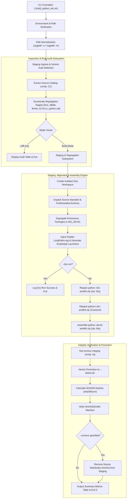
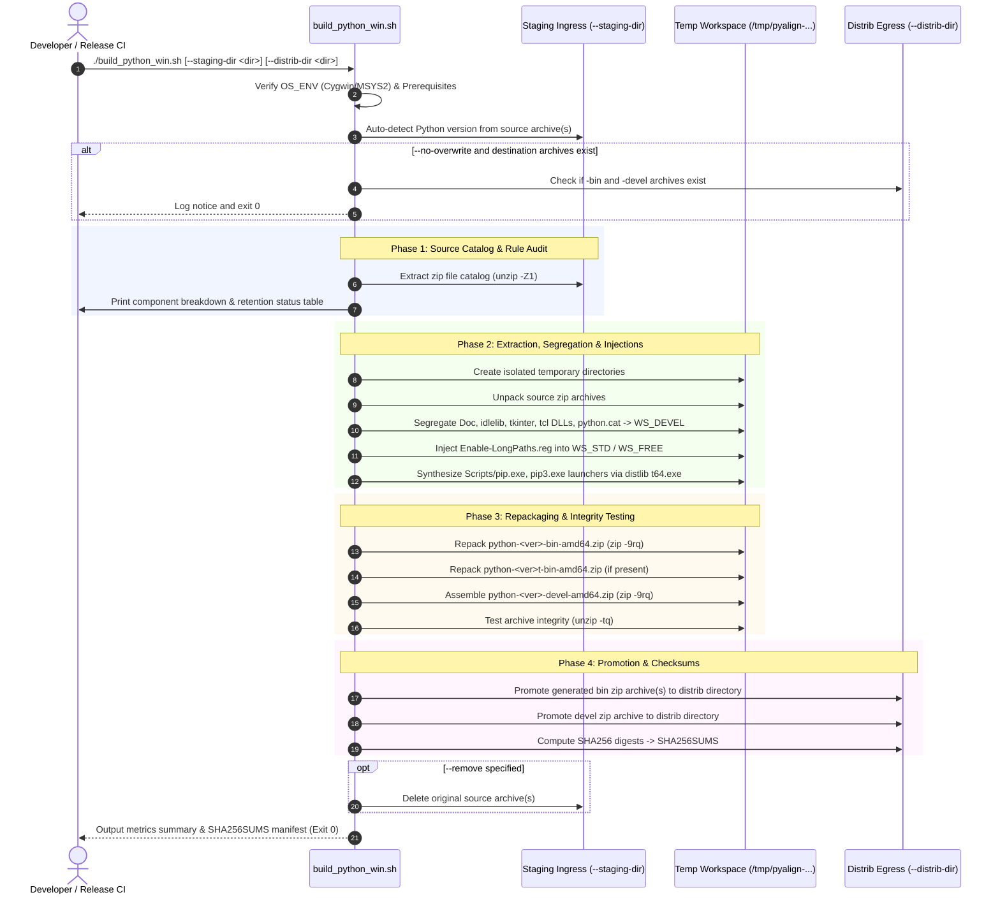
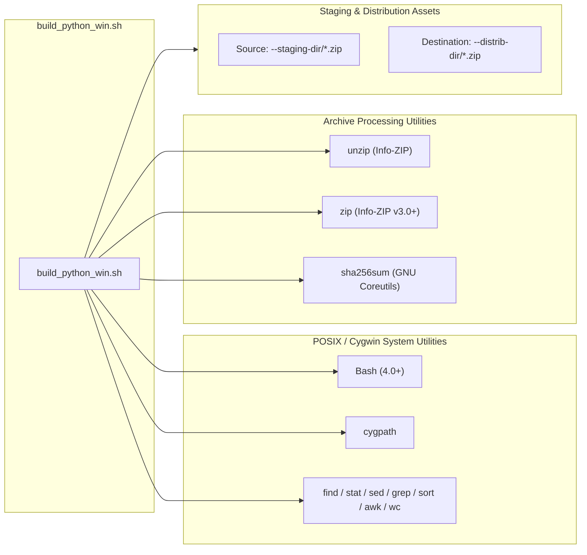
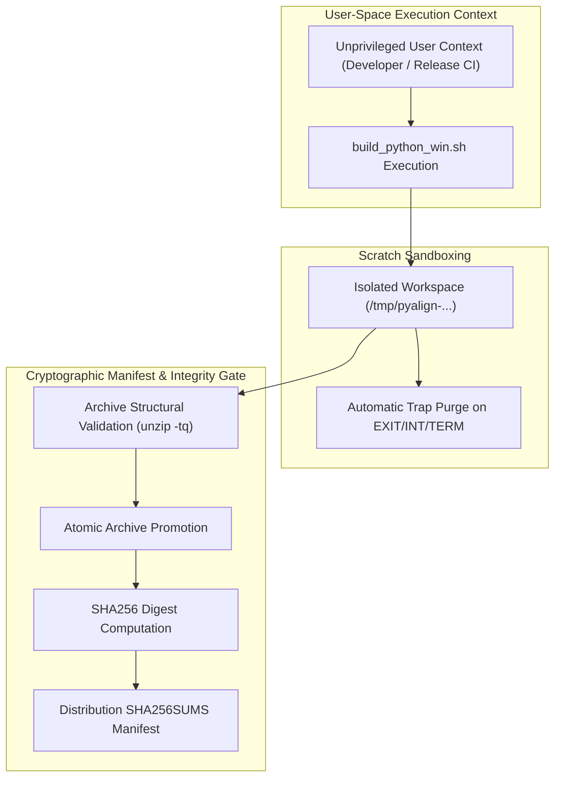

# Architecture Reference: Python Windows Distribution Alignment & Devel Packager (`build_python_win.sh`)

This document provides an architectural specification, operational sequence breakdown, and technical reference for [build_python_win.sh](build_python_win.sh), the automated Cygwin/MSYS2 Bash utility designed to align Windows Python distribution zip archives, segregating extraneous GUI, documentation, and security catalog components into a standalone development archive while generating a streamlined runtime binary distribution with bundled `pip` launcher shims and long path support.

---

## 1. Application Overview and Objectives

`build_python_win.sh` processes Windows Python distribution archives (`python-<version>-amd64.zip` and `python-<version>t-amd64.zip`) residing in a source staging folder (e.g. `f:/stage/upload/staging`). 

The script strips non-essential GUI, documentation, demo, and security catalog components from the core distribution archives to generate lean runtime binary packages (`python-<version>-bin-amd64.zip`), packages all segregated components into a dedicated development archive (`python-<version>-devel-amd64.zip`), injects Windows long path configuration (`Enable-LongPaths.reg`), synthesizes portable `pip` launchers in `Scripts/`, and produces cryptographic `SHA256SUMS` manifests in the destination distribution directory.

```
+---------------------------------------------------------------------------------------------------------------+
|                                             build_python_win.sh                                               |
|                                                                                                               |
|  +------------------------+   +------------------------+   +-----------------------+   +-------------------+  |
|  | Staging Ingress Engine |   | Surgical Segregation   |   | Streamlined Runtime   |   | Devel Archive &   |  |
|  | Reads source           |-->| Strips Doc/, idlelib,  |-->| Repacks aligned       |-->| Checksum Engine   |  |
|  | distribution zip       |   | tkinter, tcl DLLs, cat |   | python-*-bin-amd64.zip|   | Builds devel.zip  |  |
|  | (2,730 total files)    |   | into devel payload     |   | + pip shims + .reg    |   | & SHA256SUMS      |  |
|  +------------------------+   +------------------------+   +-----------------------+   +-------------------+  |
+---------------------------------------------------------------------------------------------------------------+
```

### Core Objectives
* **Runtime Footprint Minimization:** Strips 1,355 non-essential files comprising offline documentation (`Doc/`), GUI components (`Lib/tkinter`, `Lib/idlelib`, `Lib/turtledemo`), turtle graphics (`Lib/turtle.py`), Tcl/Tk binaries (`DLLs/tcl90.dll`, `DLLs/tcl9tk90.dll`, `DLLs/_tkinter*.pyd`), Windows security catalog (`DLLs/python.cat`), and installer metadata (`__install__.json`) from the runtime zip distributions.
* **Core DLL Retention:** Retains critical native runtime libraries (`DLLs/libtommath.dll`, `DLLs/zlib1.dll`), core binaries, C headers, and standard library modules in `python-<version>-bin-amd64.zip`.
* **Pip & Launcher Shim Bundling:** Bundles full `pip` engine in `Lib/site-packages/` and generates position-independent launcher binaries (`Scripts/pip.exe`, `Scripts/pip3.exe`, `Scripts/pip3.14.exe`) using distlib `t64.exe` with `#!python.exe` relative shebangs.
* **Windows Long Paths Injection:** Injects `Enable-LongPaths.reg` into the root of the runtime archive to allow deployers to lift the 260-character `MAX_PATH` limitation.
* **Dual Distribution Support:** Uniformly processes both standard GIL (`python-3.14.7-amd64.zip`) and freethreaded (`python-3.14.7t-amd64.zip`) distribution archives when present in `--staging-dir`.
* **Dedicated Devel Package Generation:** Assembles all harvested documentation, GUI bindings, security catalog, and development files into `python-<version>-devel-amd64.zip` maintaining the exact root-relative directory structure.
* **Lifecycle & Overwrite Controls:** Provides `--no-overwrite` (skips rebuild if destination archives exist) and `--remove` (deletes source archive upon verified generation).
* **Cryptographic Integrity & Verification:** Automatically validates structural archive integrity (`unzip -tq`) and generates SHA256 hashes inside `SHA256SUMS`.
* **Universal Cygwin/MSYS2 Interoperability:** Bridges Windows drive paths (`f:/stage/...`, `d:/dev/...`) and POSIX mount paths (`/cygdrive/f/...`) seamlessly via `cygpath`.

---

## 2. Architecture and Design Choices, Assumptions, Edge Cases, Performance

### 2.1. Architectural Layout



### 2.2. Design Principles & Segregation Matrix
1. **Isolated Scratch Workspace:** All decompression, file manipulation, and re-compression operations occur inside an isolated sub-directory under `/tmp/pyalign-YYYYMMDDhhmmss-$BASHPID` on local storage, preserving source files untouched.
2. **Safe Workspace Cleanup via Traps:** Registers `trap cleanup_workspace EXIT INT TERM` to guarantee that temporary workspaces are purged on script completion, error, or interrupt.
3. **Segregation Component Matrix:**
   * **Moved to `python-<version>-devel-amd64.zip` (and removed from `-bin-amd64.zip`):**
     - `Doc/`: 1,155 HTML/CSS offline documentation assets.
     - `Lib/idlelib/`: 159 IDLE GUI editor scripts and icons.
     - `Lib/tkinter/`: 13 Tkinter UI framework modules.
     - `Lib/turtledemo/`: 22 educational graphics demonstration scripts.
     - `Lib/turtle.py`: Turtle vector graphics runtime.
     - `DLLs/tcl90.dll`, `DLLs/tcl9tk90.dll`: Tcl/Tk core runtimes.
     - `DLLs/_tkinter*.pyd`: Tkinter C-extensions (standard and freethreaded).
     - `DLLs/python.cat`: Windows Authenticode security catalog.
     - `__install__.json`: Installer payload metadata descriptor.
   * **Included / Injected in `python-<version>-bin-amd64.zip`:**
     - `Enable-LongPaths.reg`: Windows registry configuration script.
     - `Scripts/pip.exe`, `Scripts/pip3.exe`, `Scripts/pip3.14.exe`: Standalone portable launcher binaries.
     - `Lib/site-packages/pip/` & `Lib/ensurepip/`: Core package installer framework.
     - `DLLs/`: Core native DLL dependencies.
     - All core binaries (`python.exe`, `pythonw.exe`, `python3.dll`, `python314.dll`), standard library modules (`asyncio`, `ctypes`, `sqlite3`, `ssl`, `json`, etc.), C headers (`include/`), and import libraries (`libs/`).

---

## 3. Data Flow and Control Logic

### 3.1. Operational Flow and Code Relations



---

## 4. Performance and Scalability

### 4.1. Size Reduction Metrics
* **Source Archive (`python-3.14.7-amd64.zip`):** 35.04 MB (2,730 total files).
* **Generated Runtime Binary Archive (`python-3.14.7-bin-amd64.zip`):** 14.94 MB (1,379 files) — **57.4% footprint reduction** with all core DLLs, headers, and bundled pip launchers.
* **Generated Devel Archive (`python-3.14.7-devel-amd64.zip`):** 19.89 MB (1,355 files) — encapsulates all offline documentation, GUI tools, security catalog, and Tcl/Tk components.

---

## 5. Dependencies

### 5.1. Dependency Hierarchy



| Dependency | Classification | Optional/Required | Purpose |
| :--- | :--- | :--- | :--- |
| **Bash** | Shell Interpreter | **Required** | Bash shell execution environment (Cygwin/MSYS2). |
| **cygpath** | Path Converter | **Required** | Maps POSIX paths (`/cygdrive/...`) to Windows drive paths. |
| **unzip** | Archive Inspector | **Required** | Inspects catalogs (`unzip -Z1`), unpacks archives, and tests integrity (`unzip -tq`). |
| **zip** | Compression Utility | **Required** | Compresses runtime binary and devel zip archives (`zip -9rq`). |
| **sha256sum** | Cryptographic Digest | **Required** | Generates SHA256 checksums inside `SHA256SUMS`. |
| **GNU Coreutils** | System Utilities | **Required** | `find`, `stat`, `sed`, `grep`, `sort`, `awk`, `wc`. |

---

## 6. Security Architecture

### 6.1. Security Boundary Diagram



### 6.2. Security Assessment

| Assessment Domain | Status | Technical Implementation |
| :--- | :--- | :--- |
| **Encryption in Transit** | **Compliant** | All operations execute over local and verified staging paths; remote fetching is delegated to authenticated release sources. |
| **Secret Management** | **Compliant** | Zero embedded credentials, access keys, or API tokens. Operates purely on archive filesystems. |
| **Access Control & RBAC** | **Compliant** | Operates strictly within user-space permissions without requiring administrative privileges (`UAC` escalation not required). |
| **Integrity Assurance** | **Compliant** | Computes cryptographic SHA-256 checksums across all finalized distribution packages and publishes the `SHA256SUMS` manifest. |
| **Defensive Scripting** | **Compliant** | Enforces strict error boundaries (`set -euo pipefail`), guarded parameter expansions (`${WS_STD:?}/${d:?}`), and validates input directories. |

---

## 7. Command Line Arguments

| Flag | Argument | Type | Default | Description |
| :--- | :--- | :--- | :--- | :--- |
| `--staging-dir` | `<path>` | String | `f:/stage/upload/staging` | Source directory containing input Python distribution zip archives. |
| `--distrib-dir` | `<path>` | String | *Same as `--staging-dir`* | Destination directory for generated `-bin-amd64.zip`, `-devel-amd64.zip`, and `SHA256SUMS`. |
| `--version` | `<version>` | String | *Auto-detected* | Semantic Python version string (auto-detected from staging if omitted). |
| `--diff-only` | *None* | Flag | `false` | Executes and displays the rule comparison table without building archives. |
| `--no-overwrite` | *None* | Flag | `false` | Skips alignment and rebuild if destination archives (`-bin` and `-devel`) already exist. |
| `--remove` | *None* | Flag | `false` | Removes the source distribution archive(s) from staging upon successful generation. |
| `--dry-run` | *None* | Flag | `false` | Simulates extraction, segregation, and packaging without writing destination files. |
| `--verbose` | *None* | Flag | `false` | Enables verbose itemized file logging during execution. |
| `-h, --help` | *None* | Flag | `false` | Displays script syntax, available flags, and usage examples. |

---

## 8. Usage Examples and Deployment Workflows

### 8.1. Run Rule Audit Only
Inspect the component segregation breakdown without modifying or generating archives:
```bash
./build_python_win.sh --diff-only
```
**Sample Output:**
```
[INFO]  Auto-detected Python version: 3.14.7

=== Inspection & Segregation Rules Audit ===
[INFO]  Staging Directory     : F:/stage/upload/staging
[INFO]  Distribution Directory: F:/stage/upload/staging
[INFO]  Source Archive        : F:/stage/upload/staging/python-3.14.7-amd64.zip
--------------------------------------------------------------------------------
Source Archive (python-3.14.7-amd64.zip) :   2730 files
--------------------------------------------------------------------------------

Components to Segregate into Development Archive (1355 files):
--------------------------------------------------------------------------------
Component                 | File Count   | Destination Archive
--------------------------+--------------+--------------------------------------
Doc/ (HTML/CHM Manual)    |         1155 | python-3.14.7-devel-amd64.zip
Lib/idlelib (IDLE GUI)    |          159 | python-3.14.7-devel-amd64.zip
Lib/tkinter (Tk Bindings) |           13 | python-3.14.7-devel-amd64.zip
Lib/turtledemo (Turtle)   |           22 | python-3.14.7-devel-amd64.zip
Lib/turtle.py             |            1 | python-3.14.7-devel-amd64.zip
DLLs (tcl90, tcl9tk90)    |            2 | python-3.14.7-devel-amd64.zip
DLLs/_tkinter*.pyd        |            1 | python-3.14.7-devel-amd64.zip
DLLs/python.cat           |            1 | python-3.14.7-devel-amd64.zip
__install__.json          |            1 | python-3.14.7-devel-amd64.zip
--------------------------------------------------------------------------------

Components Included in Runtime Binary Archive:
--------------------------------------------------------------------------------
Component                 | Status       | Destination Archive
--------------------------+--------------+--------------------------------------
Enable-LongPaths.reg      | Injected     | python-3.14.7-bin-amd64.zip
Scripts/ (pip launchers)  | Bundled      | python-3.14.7-bin-amd64.zip
pip & ensurepip           | Bundled      | python-3.14.7-bin-amd64.zip
Core Python Binaries      | Retained     | python-3.14.7-bin-amd64.zip
Standard Library          | Retained     | python-3.14.7-bin-amd64.zip
C Headers & Import Libs   | Retained     | python-3.14.7-bin-amd64.zip
--------------------------------------------------------------------------------
[INFO]  --diff-only specified. Halting without building archives.
```

---

### 8.2. Full Distribution Alignment & Packaging
Execute the alignment pipeline to generate `python-3.14.7-bin-amd64.zip` and `python-3.14.7-devel-amd64.zip`:
```bash
./build_python_win.sh --staging-dir f:/stage/upload/staging
```
**Sample Output:**
```
[INFO]  Auto-detected Python version: 3.14.7

=== Inspection & Segregation Rules Audit ===
[INFO]  Staging Directory     : F:/stage/upload/staging
[INFO]  Distribution Directory: F:/stage/upload/staging
[INFO]  Source Archive        : F:/stage/upload/staging/python-3.14.7-amd64.zip
--------------------------------------------------------------------------------
Source Archive (python-3.14.7-amd64.zip) :   2730 files
--------------------------------------------------------------------------------

Components to Segregate into Development Archive (1355 files):
--------------------------------------------------------------------------------
Component                 | File Count   | Destination Archive
--------------------------+--------------+--------------------------------------
Doc/ (HTML/CHM Manual)    |         1155 | python-3.14.7-devel-amd64.zip
Lib/idlelib (IDLE GUI)    |          159 | python-3.14.7-devel-amd64.zip
Lib/tkinter (Tk Bindings) |           13 | python-3.14.7-devel-amd64.zip
Lib/turtledemo (Turtle)   |           22 | python-3.14.7-devel-amd64.zip
Lib/turtle.py             |            1 | python-3.14.7-devel-amd64.zip
DLLs (tcl90, tcl9tk90)    |            2 | python-3.14.7-devel-amd64.zip
DLLs/_tkinter*.pyd        |            1 | python-3.14.7-devel-amd64.zip
DLLs/python.cat           |            1 | python-3.14.7-devel-amd64.zip
__install__.json          |            1 | python-3.14.7-devel-amd64.zip
--------------------------------------------------------------------------------

Components Included in Runtime Binary Archive:
--------------------------------------------------------------------------------
Component                 | Status       | Destination Archive
--------------------------+--------------+--------------------------------------
Enable-LongPaths.reg      | Injected     | python-3.14.7-bin-amd64.zip
Scripts/ (pip launchers)  | Bundled      | python-3.14.7-bin-amd64.zip
pip & ensurepip           | Bundled      | python-3.14.7-bin-amd64.zip
Core Python Binaries      | Retained     | python-3.14.7-bin-amd64.zip
Standard Library          | Retained     | python-3.14.7-bin-amd64.zip
C Headers & Import Libs   | Retained     | python-3.14.7-bin-amd64.zip
--------------------------------------------------------------------------------

=== Executing Distribution Alignment & Devel Archive Assembly ===
[INFO]  Unpacking source standard archive: python-3.14.7-amd64.zip...
[INFO]  Segregating extraneous packages into development payload...
[INFO]  Injecting Enable-LongPaths.reg registry script into runtime distribution...
[INFO]  Generating portable pip launcher executables in Scripts/...
[INFO]  Repackaging standard runtime binary archive: python-3.14.7-bin-amd64.zip...
[INFO]  Assembling development distribution archive: python-3.14.7-devel-amd64.zip (1393 items)...
[INFO]  Verifying archive integrity...
No errors detected in compressed data of python-3.14.7-bin-amd64.zip.
No errors detected in compressed data of python-3.14.7-devel-amd64.zip.
[INFO]  All generated archives passed integrity verification tests.
[INFO]  Promoting generated archives to distribution destination: F:/stage/upload/staging...
[INFO]  Calculating SHA256 checksums...

=== Distribution Alignment & Packaging Complete ===
================================================================================
Archive Artifact                     |    Source Size | Generated Size |  Reduction
-------------------------------------+----------------+----------------+----------
python-3.14.7-bin-amd64.zip          |       35.04 MB |       14.94 MB |     57.4%
python-3.14.7-devel-amd64.zip (NEW)  |            N/A |       19.89 MB |        N/A
================================================================================

SHA256 Manifest (F:/stage/upload/staging/SHA256SUMS):
285c68a607b327cac834a4f05879d3db76aa02eb7e0b2cca93e7529ceb7af337 *python-3.14.7-bin-amd64.zip
063acf2d1355830881015b52d9b9a83fb74429ab25210a9d1422a8aa0f043016 *python-3.14.7-devel-amd64.zip
================================================================================
[INFO]  Python Windows distribution alignment pipeline completed successfully.
```

---

### 8.3. Idempotent Execution & Cleanup Workflow
Skip execution if destination archives exist, or remove staging source archives on successful generation:
```bash
# Skip rebuild if packages are already present:
./build_python_win.sh --no-overwrite

# Rebuild and delete original staging source zip archives on completion:
./build_python_win.sh --remove
```
