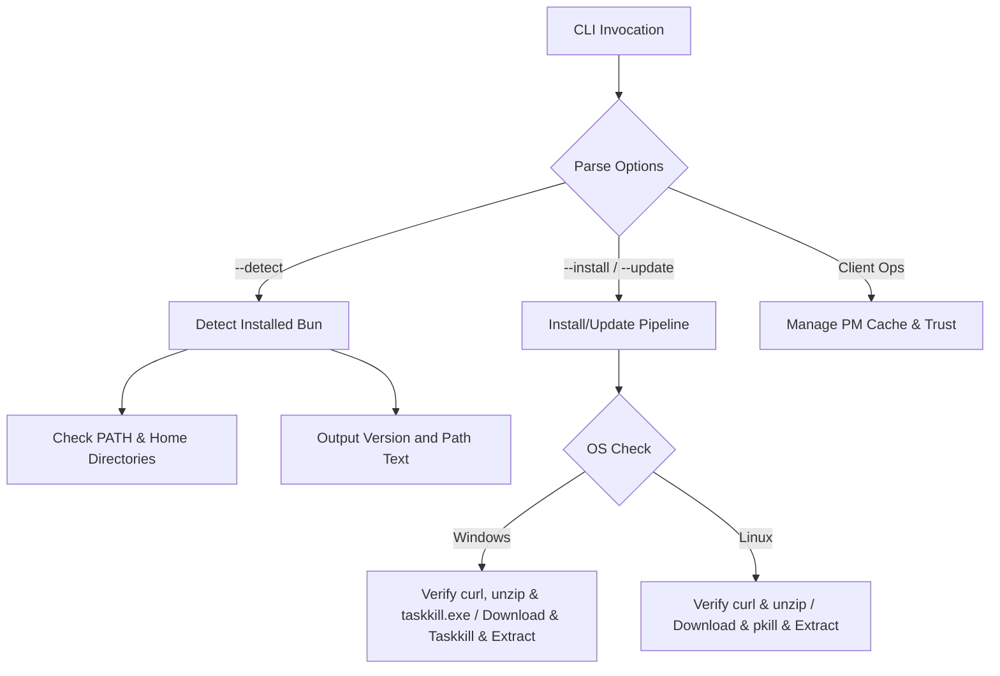

# Architecture Reference: Bun Upgrader & Environment Manager

This document provides a detailed architectural specification and user guide for [bun_upgrade.sh](bun_upgrade.sh), a cross-platform Bash utility designed to manage the lifecycle of the Bun JavaScript runtime under Windows (Cygwin/MSYS2) and Linux environments.

---

## 1. Application Overview and Objectives

`bun_upgrade.sh` simplifies and unifies the installation, upgrade, cache clearing, trust management, and package listing of Bun. It automatically identifies the host platform and executes native commands or Cygwin/MSYS2 tools as appropriate.

### Core Objectives:
* **Cross-Platform Compatibility:** Works out-of-the-box on Linux and Windows (via MSYS2/Cygwin shell environments).
* **Native Path Normalization:** Standardizes paths into standard POSIX format internally, while expressing paths to reports in mixed format (`drive:/path/sub`).
* **Mandatory Prerequisites:** Enforces that `curl` and `unzip` are installed and available in the PATH on both Windows and Linux hosts, failing fast with a descriptive error if they are missing.
* **Process Safety:** Terminates active processes using `taskkill.exe` on Windows or `pkill`/`killall` on Linux prior to upgrading to release file locks.

---

## 2. Architecture and Design Choices

The utility operates as a modular command-line parser that executes successive operations. It leverages defensive programming settings (`set -u`) and handles potential execution failures gracefully.



### 2.1. Path Normalization Engine
Cygwin and MSYS2 translate Windows drives to POSIX paths differently (e.g. `/cygdrive/e` vs `/e`). To follow strict DRY principles and minimize process spawning:
* Global variables `IS_WINDOWS` and `USER_HOME` are resolved once at script startup.
* The script calls `cygpath` inline directly (via `cygpath -u` for POSIX paths and `cygpath -m` for mixed-slash Windows drive formats) only when running on Windows.

### 2.2. Error Resilience and Robust Fallbacks
* **Active Binary Overwrites:** Windows locks executable files that are running. The script executes `taskkill.exe /F /IM bun.exe 2>/dev/null || true` to free the binary prior to replacing it. Linux runs `pkill bun 2>/dev/null || killall bun 2>/dev/null || true`.
* **Mandatory Tooling Verification:** Performs fail-fast validations at startup for necessary binaries (`curl`, `unzip` on all platforms; `taskkill.exe` on Windows) to prevent execution errors halfway through an upgrade.
* **Package Manager CWD & Global Folder Bypass:** Bun's package manager commands throw an error if no `package.json` file is present in the current working directory, and also fail during global operations (`-g`) if the global installation directory does not contain a `package.json` and a `bun.lock` file. The script resolves this by (1) executing all client operations inside an isolated temporary workspace with a dummy `package.json`, and (2) automatically initializing the global installation folder (`install/global`) with a minimal empty `package.json` and `bun.lock` structure, ensuring all global commands run cleanly.

---

## 3. Options and Flag Reference

| Flag | Argument | Description |
| :--- | :--- | :--- |
| `--detect` | None | Detects active Bun binary, version, and location. |
| `--update` | None | Triggers Bun upgrade. Uses ZIP downloads and local extraction on both Windows and Linux. |
| `--auto` | None | With `--update`, checks version first and skips if local version is already up-to-date. |
| `--clear-cache` | None | Runs `bun pm cache rm` to flush package manager dependencies. |
| `--trust-all` | None | Runs `bun pm trust -g --all` to trust global npm binary scripts. |
| `--list` | None | Runs `bun pm ls -g` to list globally installed npm packages. |
| `--update-modules` | None | Runs `bun update -g` to update global npm modules. |
| `--install` | None | Performs a clean install of Bun (requires `--path`). |
| `--path` | `<path>` | The installation target directory (mandatory for `--install`). |
| `--install-module` | `<pkg>` | Installs a global npm module (`bun add -g <pkg>`). |
| `--remove-module` | `<pkg>` | Removes a global npm module (`bun remove -g <pkg>`). |
| `-h, --help` | None | Shows help documentation. |

---

## 4. Diagnostics & Exit Codes

To facilitate automated CI/CD flow management and diagnostics, the script exits with specific, structured exit codes on failure:

| Exit Code | Classification | Trigger Description |
| :--- | :--- | :--- |
| `0` | Success | Command completed successfully. |
| `1` | Check Failure | Active Bun installation not detected during `--detect` or diagnostic tasks. |
| `2` | Bad Arguments | Invalid syntax, unknown flags, or unmet validation rules (e.g. `--install` without `--path`). |
| `3` | Missing Prerequisites | Needed executable binaries (`curl`, `unzip`, `taskkill.exe`) are missing from system PATH. |
| `4` | Network Failure | Failed to fetch target release ZIP packages from GitHub. |
| `5` | File Extraction Failure | Unpacking or writing files to target directory failed (corrupt archive, disk full). |
| `6` | Execution Verification Failure | Unpacked binary could not be executed or failed to return version check (CPU or DLL mismatch). |
| `7` | Bun Command Failure | An internal client operation (`bun pm cache rm`, `bun update`, etc.) failed. |

---

## 5. Usage Examples

### 1. Simple Environment Check
Check if Bun is installed and view its version and PATH status:
```bash
./bun_upgrade.sh --detect
```
Example Output:
```
Bun Version:    1.3.14
Located Path:   D:/dev/bun/bun.exe
In system PATH: YES
```

### 2. Standard Maintenance Cycle
Update Bun, clear outdated caches, and update global modules in one execution:
```bash
./bun_upgrade.sh --update --clear-cache --update-modules
```

### 3. Bootstrap New Workstations
Perform a fresh install of Bun in a specific directory:
```bash
./bun_upgrade.sh --install --path d:/dev/bun
```

### 4. Smart Upgrades (CI/CD)
Check GitHub for the latest version and perform the download only if an upgrade is required:
```bash
./bun_upgrade.sh --update --auto
```

### 5. Install Global npm Modules
Install a global utility or framework (e.g. `pm2`) directly using the Bun package manager:
```bash
./bun_upgrade.sh --install-module pm2
```

### 6. Remove Global npm Modules
Uninstall a globally installed package:
```bash
./bun_upgrade.sh --remove-module pm2
```
