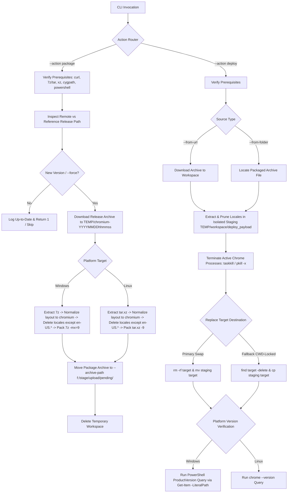

# Architecture Reference: Chromium Upgrader & Deployment Utility

This document provides architectural specifications, design workflows, and execution manuals for [chromium_upgrade.sh](chromium_upgrade.sh), a cross-platform Bash utility designed to manage the downloading, locale-pruning, repackaging, and deployment of Chromium browser builds under Windows (Cygwin/MSYS2) and Linux environments.

---

## 1. Objectives & Key Requirements Summary

`chromium_upgrade.sh` implements all functional specifications from [chromium_upgrade.txt](chromium_upgrade.txt):

### 1.1 Packaging Pipeline (`--action package`)
* **Windows Packaging Pipeline**:
  * **Inspect URL**: Checks `--from-url` (default: `https://github.com/Hibbiki/chromium-win64/releases/`) for new releases.
  * **Version Check**: Evaluates reference release path (e.g., `n:/softlib/software/public/inet/www/browser/chrome/chromium-150.0-w64.zip`) against latest remote release tag to skip unnecessary builds.
  * **Download & Workspace**: Downloads `chrome.7z` (e.g., `https://github.com/Hibbiki/chromium-win64/releases/download/v150.0.7871.187-r1639810/chrome.7z`) into `TEMP/unique_workspace` (where `unique_workspace` = `chromium-YYYYMMDDhhmmss`).
  * **Directory Normalization**: Renames internal folder `Chrome-bin` $\rightarrow$ `chromium`.
  * **Locale Pruning**: In `<version>/Locales` (e.g., `<version>` = `150.0.7871.187`), deletes all files except `en-US*.pak` (retaining `en-US.pak`, `en-US_FEMININE.pak`, `en-US_MASCULINE.pak`, and `en-US_NEUTER.pak`).
  * **Repackaging**: Repacks tree as 7z maximum compression (`7z a -t7z -m0=lzma2 -mx=9`) into packaged archive `chromium-150.0.7871.187_1639810-x64.7z`.
  * **Staging**: Moves packaged archive to `--archive-path` (default: `f:/stage/upload/pending/`).
  * **Cleanup**: Deletes temporary workspace upon successful completion.

* **Linux Packaging Pipeline**:
  * **Inspect URL**: Checks `--from-url` (default: `https://ungoogled-software.github.io/ungoogled-chromium-binaries/`) for new Portable Linux 64-bit releases.
  * **Version Check**: Evaluates reference release path (e.g., `n:/softlib/software/public/inet/www/browser/chrome/chromium-150.0-lnx.zip`).
  * **Download & Workspace**: Downloads release archive (e.g., `https://github.com/ungoogled-software/ungoogled-chromium-portablelinux/releases/download/150.0.7871.186-1/ungoogled-chromium-150.0.7871.186-1-x86_64_linux.tar.xz`) into `TEMP/unique_workspace` (`chromium-YYYYMMDDhhmmss`).
  * **Directory Normalization**: Creates internal directory `chromium/` and moves all extracted files into `chromium/`.
  * **Locale Pruning**: In `locales/`, deletes all files except `en-US*.pak` (retaining `en-US.pak`, `en-US_FEMININE.pak`, `en-US_MASCULINE.pak`, and `en-US_NEUTER.pak`).
  * **Repackaging**: Repacks tree as `tar.xz` maximum compression (`XZ_OPT="-9 -T0" tar -cJf`) into packaged archive `chromium-150.0.7871.186-1-ungoogled-x86_64_linux.tar.xz`.
  * **Staging**: Moves packaged archive to `--archive-path` (`f:/stage/upload/pending/`).
  * **Cleanup**: Deletes temporary workspace upon successful completion.

### 1.2 Deployment Pipeline (`--action deploy`)
* Target installation directory specified via `--to-folder <folder>`.
* **Sub-mode 2.1 (From Folder)**: Accepts `--from-folder <folder>` (folder containing packaged archive or direct path to archive file).
* **Sub-mode 2.2 (From URL)**: Accepts `--from-url <url>` (direct download link for packaged archive).
* **Isolated Staging & Locale Pruning**: Unpacks archive into isolated temporary workspace (`TEMP/workspace/deploy_payload`), stripping top-level directory containers and pruning non-English locales.
* **Process Safety**: Executes `terminate_running_chrome_processes` using exact process binary matching (`pkill -x` / `taskkill /IM`) to release active file locks before directory replacement.
* **Resilient Destination Update**: Swaps target directory atomically as primary strategy; if target container directory root is CWD-locked by an active shell handle, automatically falls back to in-place content wiping (`find -delete`) and payload copying (`cp -af`).
* **Extraction & Version Display**: Verifies installed build and outputs product version query:
  * **Windows PowerShell**: `(Get-Item -LiteralPath "D:\inet\www\chromium\bin\chrome.exe").VersionInfo.ProductVersion`
  * **Linux**: `chrome --version`

### 1.3 Key Operating Constraints & Notes
1. **Mandatory Platform Flag & Detection**: `--platform <windows|linux>` (with automatic environment/path hint detection if omitted).
2. **Prerequisites Verification & Fail-Fast**: All required environmental prerequisites (`curl`, `grep`, `sed`, `cygpath`, `powershell`, `tar`, `xz`, `7z`) must be present or execution aborts (exit code `3`). On Windows, `7z` location is inspected via `--with-7z <path>` (e.g. `c:/tls/arc/7zip/`), `7Z_HOME`, `PATH`, and standard installation paths (`c:/tls/arc/7zip/7z.exe`, `C:/Program Files/7-Zip/7z.exe`).
3. **Windows Path Format**: All Windows paths are output/formatted in mixed drive prefix notation: `<drive>:/path/sub`.

---

## 2. Architecture & Workflow



---

## 3. Options & Flag Reference

| Flag | Type / Value | Requirement | Description |
| :--- | :--- | :--- | :--- |
| `--action` | `package \| deploy` | **Mandatory** | Selects execution mode (packaging or deployment). |
| `--platform` | `windows \| linux \| windows,linux` | **Mandatory / Auto** | Target operating system platform (default: `windows,linux` for packaging; auto-detected for deploy). |
| `--from-url` | `<url>` | Optional | Source release page (packaging) or direct download URL (deployment). |
| `--release-path` | `<path>` | Optional | Reference path/file to compare installed version against (packaging). |
| `--archive-path` | `<path>` | Optional | Destination directory for final generated packaged archive (default: `f:/stage/upload/pending/`). |
| `--from-folder` | `<folder>` | Mandatory (Deploy 2.1) | Source directory containing packaged archive or direct file path. |
| `--to-folder` | `<folder>` | Mandatory (Deploy) | Destination directory for extraction and deployment. |
| `--with-7z` | `<path>` | Optional (Win) | Custom 7z executable or directory path (e.g. `c:/tls/arc/7zip/`). |
| `--force` | None | Optional | Force packaging or deployment even if reference version matches. |
| `-h, --help` | None | Optional | Displays execution syntax and usage manual. |

---

## 4. Diagnostics & Exit Codes

| Exit Code | Classification | Description |
| :--- | :--- | :--- |
| `0` | Success | Operation completed successfully (or skipped due to up-to-date release). |
| `1` | Up-to-Date / Skip | Local reference release is already current. |
| `2` | Bad Arguments | Missing mandatory flags, invalid platform names, or illegal syntax. |
| `3` | Missing Prerequisites | Required tool (`curl`, `7z`, `tar`, `xz`, `powershell`, `cygpath`) missing from system. |
| `4` | Network Failure | Download of release asset or deployment URL failed. |
| `5` | Extraction Failure | Failed to extract source archive or deployment package. |
| `6` | Repackaging Failure | Max compression packaging step failed. |
| `7` | Verification Failure | Failed to retrieve installed Chromium product version. |

---

## 5. Usage Examples

### 5.1 Quick Production Commands

#### [WINDOWS]
* **package**:
  ```bash
  ./chromium_upgrade.sh --action package --platform windows,linux --with-7z c:/tls/arc/7zip/
  ```
* **deploy**:
  ```bash
  ./chromium_upgrade.sh --action deploy --from-folder f:/stage/upload/pending/chromium-150.0.7871.187_1639810-x64.7z --to-folder d:/inet/www/chromium/bin/
  ```

#### [LINUX]
* **deploy**:
  ```bash
  ./chromium_upgrade.sh --action deploy --from-folder /opt/install/queue/chromium-150.0.7871.186-1-ungoogled-x86_64_linux.tar.xz --to-folder /u01/chromium/
  ```

---

### 5.2 Detailed Workflow Examples

#### Example 1: Package Windows Release (Hibbiki)
```bash
./chromium_upgrade.sh --action package \
  --platform windows \
  --from-url https://github.com/Hibbiki/chromium-win64/releases/ \
  --release-path n:/softlib/software/public/inet/www/browser/chrome/chromium-150.0-w64.zip \
  --archive-path f:/stage/upload/pending/ \
  --with-7z c:/tls/arc/7zip/
```

#### Example 2: Package Linux Release (Ungoogled Portable)
```bash
./chromium_upgrade.sh --action package \
  --platform linux \
  --from-url https://ungoogled-software.github.io/ungoogled-chromium-binaries/ \
  --release-path n:/softlib/software/public/inet/www/browser/chrome/chromium-150.0-lnx.zip \
  --archive-path f:/stage/upload/pending/
```

#### Example 3: Deploy from Local Folder (Section 2.1)
```bash
./chromium_upgrade.sh --action deploy \
  --from-folder f:/stage/upload/pending/ \
  --to-folder d:/inet/www/chromium \
  --with-7z c:/tls/arc/7zip/
```

#### Example 4: Deploy from Direct URL (Section 2.2)
```bash
./chromium_upgrade.sh --action deploy \
  --from-url https://github.com/Hibbiki/chromium-win64/releases/download/v150.0.7871.187-r1639810/chrome.7z \
  --to-folder d:/inet/www/chromium \
  --with-7z c:/tls/arc/7zip/
```
