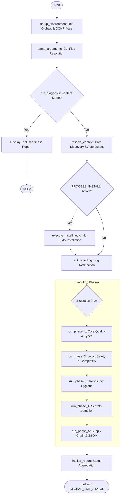

# Code Audit Pipeline: Enterprise Quality & Security Audit Utility

## Core Objectives
- **Syntactic & Stylistic Integrity**: Enforce consistent formatting and best practices across Python, Go, Node.js, and Bash ecosystems.
- **Comprehensive Reporting**: Execute all requested audit phases to completion, aggregating results into a final health status rather than terminating on the first error.
- **Multi-tiered Orchestration**: Modular support for standard core checks, extended code quality, and deep supply chain analysis.
- **Architectural Resilience**: Hardened execution environment designed for CI/CD runners and local developer environments.

## Architecture and Design Choices

### 1. Three-Tier Execution Model
To satisfy diverse use cases—from local pre-commit hooks to deep weekly security reviews—the tool implements a tiered execution strategy:
- **Standard (Core)**: Fast, essential checks for rapid feedback.
- **Extended (Quality)**: Deep static analysis and safety checks (e.g., nil-panic detection, strict formatting).
- **Extra Scan (Security)**: Heavy-duty security scanning, including SBOM generation and holistic vulnerability analysis### 2. Modular, Function-Based Architecture
The script has been refactored from a linear procedural flow into a discrete, named-module architecture. This maximizes maintainability and allows for easier integration of new audit layers. Core modules include:
- `setup_environment`: Initializes global state and hardening.
- `resolve_context`: Handles directory resolution and heuristic autodetection.
- `init_reporting`: Manages global log redirection.
- `run_phase_1-5`: Encapsulated audit execution layers.

### 3. Centralized Configuration Management
To eliminate magic numbers and hardcoded strings, all tool-specific settings (thresholds, flags, search depths) are centralized in the `setup_environment` module using the `CONF_` global namespace. This ensures that the execution phases remain purely functional and data-driven.

### 4. Logic Isolation and Context Awareness
The tool implements an "Isolation Pattern." Users can explicitly force a language context (e.g., `--python`) or utilize the built-in **Autodetection Engine**, which heuristically determines the project type by scanning the filesystem depth (configurable via `CONF_SEARCH_DEPTH`).

### 5. Pipeline Integrity (Cumulative Reporting)
The script implements a non-blocking execution model. Instead of terminating on the first failure, it captures the exit status of every tool:
1.  **Phase 1-3 (Quality & Logic)**: Executes syntax, style, and complexity checks.
2.  **Phase 4 & 5 (Secrets & Supply Chain)**: Comprehensive scanning for sensitive data exposure and third-party vulnerabilities.
3.  **Final Aggregation**: The `finalize_report` module evaluates the accumulated `GLOBAL_EXIT_STATUS`. If any tool fails, the script returns a final non-zero exit code (1) to signal the CI/CD environment.

### 6. Zero-Impact Policy (Remediation Control)
By default, the audit has **zero impact** on source code. Toolsets are configured in "check-only" modes. Source code modifications (formatting fixes and auto-linting) only occur if the `--fix` flag is explicitly provided.

### 7. Cross-Platform Path Normalization (Mixed Path Strategy)
To ensure stability across **Cygwin, MSYS, and Linux**, the utility implements the 'Mixed Path' strategy. Absolute paths are normalized to use forward slashes with Windows drive letters (e.g., `E:/path/to/rules/`).
- **Compatibility**: This format is natively understood by POSIX shells for logic tests and by Native Windows binaries for task execution, eliminating path-resolution errors (OS Error 3).

## Data Flow and Control Logic

The following diagram illustrates the modular operational flow from initialization to final status reporting.



## Dependencies

The utility relies on a suite of specialized binaries. Their presence can be verified using the `--detect` flag.

| Ecosystem | Tool(s) Required | Use Case |
| :--- | :--- | :--- |
| **Python** | `ruff`, `pyright`, `radon`, `vulture`, `pip-audit`, `bandit` | Syntax, Types, Complexity, Dead Code, Vulns, Security |
| **Golang** | `go`, `gofumpt`, `golangci-lint`, `govulncheck`, `gosec`, `nilaway` | Formatting, Safety, Lints, Security, Vulns |
| **Node.js** | `oxlint`, `oxfmt`, `biome`, `npm`, `node` | Linting, Formatting, Registry Security |
| **Bash**    | `shellcheck`, `shfmt` | Linting, Formatting, Common Bug Detection |
| **Security** | `semgrep`, `trufflehog`, `grype`, `ast-grep` | Static analysis, Secrets, Supply Chain, Structural Search |
| **Deep Scan**| `syft`, `trivy` | SBOM Generation, Configuration Scanning, Holistic SCA |
| **Installer** | `uv`, `npm`, `go` | Bootstrap tools into user-context without sudo. |

## Command Line Arguments

| Argument | Type | Default | Description |
| :--- | :--- | :--- | :--- |
| `--path <dir>` | String | `.` | Target directory for the audit. Validates existence before switching. |
| `--auto` | Flag | `false` | Enables heuristic autodetection of project language based on filesystem. |
| `--detect` | Flag | `false` | Generates a diagnostic report of all installed/missing audit tools. |
| `--extended` | Flag | `false` | Enables deep quality tools (e.g., Go Fix, extra Go linters, Radon). |
| `--inspection` | Flag | `false` | Enables specialized deep-inspection tools (e.g., NilAway). |
| `--extra-scan` | Flag | `false` | Enables heavy-duty security scanning (Syft SBOM, Trivy). |
| `--fix` | Flag | `false` | Enables auto-fix and reformatting for supported tools. |
| `--log <path>` | String | N/A | Redirects and appends all audit output to the specified log file. |
| `--python` | Flag | `true`* | Isolates the audit to Python tools only. |
| `--golang` | Flag | `true`* | Isolates the audit to Go tools only. |
| `--nodejs` | Flag | `true`* | Isolates the audit to Node.js tools only. |
| `--bash`   | Flag | `true`* | Isolates the audit to Bash tools only. |
| `--general` | Flag | `true`* | Isolates the audit to general-purpose security tools only. |
| `--run-quality` | Flag | `false` | Executes Phase 1 only (Quality, Style, Formatting). |
| `--run-logic` | Flag | `false` | Executes Phase 2 only (Logic, Safety, Complexity). |
| `--run-cleanup` | Flag | `false` | Executes Phase 3 only (Cleanup, Dead Code). |
| `--run-detectsecrets` | Flag | `false` | Executes Phase 4 only (Secret Detection). |
| `--run-supplychain` | Flag | `false` | Executes Phase 5 only (Dependency Audit, SBOM). |
| `--install` | Flag | `false` | Installs missing tools for specified scope/language and runs audit. |
| `--install-only`| Flag | `false` | Pre-stages (installs) missing tools and exits immediately. |
| `--update`       | Flag | `false` | Updates existing local tools and runs audit. |
| `--update-only`  | Flag | `false` | Updates existing local tools only and exits. |
| `--help` | Flag | `false` | Displays the usage/help manual. |

*\* Defaults are `true` unless an isolation flag or `--auto` is used.*

## Deep Dive: Tool Ecosystem

The utility orchestrates a specialized collection of industry-standard tools. Below is a detailed breakdown of each tool's category, purpose, and detection scope.

### 1. Python-Specific Suite
| Tool | Purpose | Detection Scope | Audit Tier |
| :--- | :--- | :--- | :--- |
| **Ruff** | Ultra-fast Linter & Formatter | Detects syntax errors, PEP8 style violations, unused imports, and logical anti-patterns. | Core |
| **Pyright** | Static Type Checker | Enforces type safety; detects type mismatches and missing type hints in large codebases. | Core |
| **Radon** | Complexity Analysis | Measures Cyclomatic Complexity (CC) and identifies "spaghetti code" that is difficult to maintain. | Core |
| **Vulture** | Dead Code Detection | Finds and flags unused variables, functions, and classes that bloat the repository. | Core |
| **pip-audit** | Dependency Scanner | Scans the local environment against the PyPA database to find known CVEs in Python packages. | Core |
| **Bandit** | Security Scanner | Established tool for identifying common security issues (e.g., hardcoded passwords, unsafe imports) in Python codebases. | Core |

### 2. Golang-Specific Suite
| Tool | Purpose | Detection Scope | Audit Tier |
| :--- | :--- | :--- | :--- |
| **gofumpt** | Code Formatting | Enforces standard Go style with stricter, more opinionated rules for senior-level consistency. | Core |
| **golangci-lint** | Meta-Linter Orchestrator | A high-performance runner that aggregates results from dozens of internal Go linters. | Core |
| **gosec** | Security Scanner | Core security analyzer that identifies insecure Go coding patterns (e.g., weak crypto, SQLi). | Core |
| **govulncheck** | Vulnerability Scan | Core dependency auditor that cross-references the official Go vulnerability database. | Core |
| **nilaway** | Safety (Panic Detection) | Specially designed by Uber to find potential `nil` pointer dereferences before they cause panics. | Inspection |
| **go fix** | Modernization | Modernizes legacy Go code patterns to align with current language standards. | Extended |

#### Bundled Go Linters (via `golangci-lint`)
| Linter | Focus | Detection Scope | Audit Tier |
| :--- | :--- | :--- | :--- |
| **govet** | Official Go "vet" command | Detects suspicious constructs such as Printf call arguments that do not align with format strings. | Core |
| **staticcheck** | Robust Static Analysis | Detects correctness issues, performance improvements, and simplifies code structures. | Core |
| **unused** | Dead Code Analysis | Finds uncalled constants, variables, functions, and types. | Core |
| **gocritic** | Style & Performance Linter | Finds micro-bugs, performance bottlenecks, and opinionated stylistic issues. | Extended |
| **gocyclo** | Structural Complexity | Measures function complexity via CC; parity with Python's Radon. | Extended |
| **goconst** | Optimization | Identifies hard-coded strings that appear multiple times and should be promoted to constants. | Extended |
| **mnd (Magic Number)**| Constant Enforcement | Detects "magic numbers" (unnamed numeric constants) which reduce code readability. | Extended |
| **copyloopvar** | Safety Analysis | Detects loop variable capture by reference to prevent concurrency issues. | Extended |
| **interfacebloat** | Interface Design | Flags interfaces with an excessive number of methods to enforce SRP. | Extended |
| **bodyclose** | Resource Safety | [Extended] Checks whether HTTP response bodies are closed to prevent resource leaks. | Extended |
| **nilerr** | Safety Analysis | [Extended] Finds code that returns nil instead of an error variable in a 'if err != nil' block. | Extended |
| **nilnil** | Logic Analysis | [Extended] Detects simultaneous return of both nil error and nil value for functions returning (T, error). | Extended |

### 3. Node.js-Specific Suite
| Tool | Purpose | Detection Scope | Audit Tier |
| :--- | :--- | :--- | :--- |
| **Oxlint** | Ultra-fast Linter | Detects JavaScript and TypeScript violations with zero configuration and extreme speed. | Core |
| **Oxfmt**  | High-speed Formatter | A rust-based, Prettier-compatible formatter designed for extreme performance. | Core |
| **Biome**  | Unified Toolchain | Performs **Linting, Formatting, and Import Sorting**; replaces multiple tools with a single fast binary. | Core |
| **npm audit** | Registry Security | Direct check against the npm advisory database; essential for catching "fresh" supply chain breaches. | Core |

### 4. Bash-Specific Suite
| Tool | Purpose | Detection Scope | Audit Tier |
| :--- | :--- | :--- | :--- |
| **ShellCheck** | Industry-standard Linter | Catches 90% of common shell bugs, including quoting issues and logical anti-patterns. | Core |
| **shfmt** | Shell Formatter | Standardizes code appearance; ensures consistent indentation and shell syntax. | Core |

### 5. General-Purpose Security Suite
| Tool | Purpose | Detection Scope | Audit Tier |
| :--- | :--- | :--- | :--- |
| **Semgrep** | Polyglot Static Analysis | Detects high-level dangerous patterns (XSS, SQLi, command injection) across multiple languages. | Core |
| **ast-grep** | Structural Search | High-precision configuration-driven engine for finding dangerous primitives (e.g., `eval`, `exec`). | Core |
| **TruffleHog** | Secret Detection | Scans the entire filesystem and git history for leaked API keys, tokens, and certificates. | Core |
| **Grype** | Vulnerability Scanner | Scans SBOMs and lock files for vulnerabilities across OS packages and language ecosystems. | Core |
| **Syft** | SBOM Generator | Generates a machine-readable Software Bill of Materials (SBOM) for complete supply chain transparency. | Extra Scan |
| **Trivy** | Defense-in-Depth Audit | Scans filesystem layers, config files, and Dockerfiles for vuln, misconfig, and secrets. | Extra Scan |

## Usage Examples

### 1. The "Pre-Commit" Audit (Fast & Core)
Ideal for local development. Automatically detects project type and runs standard checks.
```bash
./code_audit.sh --auto
```

### 2. The "Deep Quality" Review (Senior Developer Mode)
Runs deeper static analysis, including nil-pointer detection for Go projects and dead code analysis.
```bash
./code_audit.sh --auto --extended
```

### 3. CI/CD Pipeline Mode (Reporting & Evidence)
Executes a standard audit, ensures no code changes occur, and captures the entire transcript for audit logs.
```bash
./code_audit.sh --auto --log /path/to/artifacts/audit_report.log
```

### 4. Developer Remediation (Auto-Fix)
The developer runs the tool locally to automatically apply formatting and linting fixes identified by the CI.
```bash
./code_audit.sh --auto --fix
```

### 3. The "Full Security Integrity" Scan (Security Architect Mode)
Generates an SBOM, runs holistic configuration scanners (Trivy), and checks for hard-coded secrets.
```bash
./code_audit.sh --path ./production-service --extra-scan --general
```

### 4. Multi-Language Enterprise Audit
Runs every single tool in the suite (Quality + Security) on a multi-language root (Python, Go, Node.js, Bash).
```bash
./code_audit.sh --extended --extra-scan
```

### 5. Automated Tool Staging (No-Sudo)
Detects missing tools for the detected project type, installs them into `~/.local/bin` / `~/.npm-global`, and executes the audit.
```bash
./code_audit.sh --auto --install
```

### 6. Pre-staged Environment Preparation
Installs every tool required for a Go project into the user-context and exits. Ideal for provisioning CI/CD runners.
```bash
./code_audit.sh --golang --install-only
```

### 7. Tool Update Policy (Local vs Global)
The pipeline distinguishes between system-level (global) binaries and user-context (local) tools.
- **`--update`**: Attempts to refresh versions for tools found in `${HOME}/.local/bin`, `${HOME}/.npm-global`, or `GOPATH`.
- **Global Safety**: Tools located in system paths (e.g., `/usr/bin/`) are **ignored** for updates to avoid permission conflicts and maintain system stability.

```bash
# Update all local Python tools and exit
./code_audit.sh --python --update-only
```

### 8. Selective Phase Execution (Examples for each)
Users can run specific audit layers in isolation. Hitting any of these flags activates "Selective Mode," disabling all non-requested phases.

*   **Quality & Style (Phase 1)**: Focus only on linting, formatting, and type safety.
    ```bash
    ./code_audit.sh --run-quality
    ```
*   **Safety & Logic (Phase 2)**: Identify logical anti-patterns and structural vulnerabilities using Semgrep and ast-grep.
    ```bash
    ./code_audit.sh --run-logic
    ```
*   **Repository Hygiene (Phase 3)**: Scan for dead code and technical debt (currently Python-centric).
    ```bash
    ./code_audit.sh --run-cleanup
    ```
*   **Secrets Detection (Phase 4)**: Perform a deep-scan for hard-coded passwords, keys, and certificates.
    ```bash
    ./code_audit.sh --run-detectsecrets
    ```
*   **Supply Chain Audit (Phase 5)**: Generate SBOMs and audit third-party dependency vulnerabilities.
    ```bash
    ./code_audit.sh --run-supplychain
    ```

### 9. Environment Readiness Check
Used during CI/CD runner setup to verify all dependencies are properly mapped.
```bash
./code_audit.sh --detect
```

## Unit Tests Implementation

To ensure reliability and guard against regressions in the orchestration logic, the pipeline includes a comprehensive, self-healing unit test suite: [code_audit_test.sh](code_audit_test.sh).

### 1. Methodology: High-Fidelity Mocking
The test suite utilizes a "Black-Box" mocking strategy to validate the orchestrator's logic without requiring the actual installation of the 23+ security binaries:
- **Sandbox Isolation**: Each run creates a dedicated, unique environment (`TEST_ROOT`) via `uuidgen` to prevent interference with the host system.
- **Dynamic Registry Extraction**: The suite automatically scans `code_audit.sh` to extract the internal `AUDIT_*_TOOLS` registries. This ensures that the tests are self-healing and always synchronized with the production logic.
- **PATH Interception**: The suite generates semi-functional mock binaries and injects them into the front of the `PATH`. When the orchestrator runs, it transparently interacts with these mocks instead of system binaries.### External Security Rules (`rules/`)
The `ast-grep` scanner leverages a specialized configuration directory containing YAML rules for language-specific security patterns:
*   `python-audit.yml`: Focuses on insecure code execution and dangerous Python sinks.
*   `go-audit.yml`: Focuses on insecure Go programming patterns and generic error-handling checks.
*   `node-audit.yml`: Focuses on Node.js/Javascript security vulnerabilities.
*   `bash-audit.yml`: Focuses on high-risk shell primitives (eval, exec) and supply chain risks (curl-to-shell).

> [!IMPORTANT]  
> The `rules/` directory must be maintained alongside the `code_audit.sh` orchestrator for high-precision scanning.
- **Stateful Verification**: Every mock binary records its own execution status and cumulative arguments into "mark" files.
- **Environment Isolation (Hardened)**: Tests are run with a restricted `PATH` and an isolated `HOME` directory to prevent system-installed tools from shadowing mocks during Test 6 (Installation Lifecycle).

### 2. Execution
Execute the test suite from the script's home directory. The suite automatically removes all temporary artifacts and the sandbox environment upon completion or interruption.
```bash
./code_audit_test.sh
```

### 3. Sample Verification Output
Below is an example of the verification matrix generated by the suite, ensuring tool coverage and accurate flag propagation for both standard and fix modes.

#### Toolset Coverage Matrix
```text
---------------------------------------------------------
  CHECKLIST: Python
---------------------------------------------------------
  [✓] pip-audit       : EXECUTED, PASS
  [✓] pyright         : EXECUTED, PASS
  [✓] radon           : EXECUTED, PASS
  [✓] ruff            : EXECUTED, PASS
  [✓] vulture         : EXECUTED, PASS
---------------------------------------------------------
  CHECKLIST: Node.js
---------------------------------------------------------
  [✓] oxlint          : EXECUTED, PASS
  [✓] oxfmt           : EXECUTED, PASS
  [✓] biome           : EXECUTED, PASS
  [✓] npm             : EXECUTED, PASS
---------------------------------------------------------
  CHECKLIST: Bash
---------------------------------------------------------
  [✓] shellcheck      : EXECUTED, PASS
  [✓] shfmt           : EXECUTED, PASS
```

#### Remediation Flag Integrity
The suite verifies that auto-correction flags (e.g., `--fix`, `--write`, `--autofix`) are isolated to the `--fix` mode.

```text
--> Verifying Default Mode (Check-Only)...
TEST: Fix Safeguard: biome check (No --write)
  [✓] biome           : Correctly omitted '--write'
RESULT: PASS

--> Verifying Fix Mode (Active Corrections)...
TEST: Fix Propagation: biome check --write
  [✓] biome           : Correctly received '--write'
RESULT: PASS
TEST: Fix Propagation: semgrep --autofix
  [✓] semgrep         : Correctly received '--autofix'
RESULT: PASS
```
## Annex: Technical Specifications for Tool Management

This section provides a detailed recap of the logic, conditions, and operational flows governing automated tool procurement within the pipeline.

### 1. The Installation Engine (`--install` / `--install-only`)
The primary purpose of the installation engine is to provision a functional audit environment from scratch without manual intervention.

*   **Target Population**: **Undetected tools only**.
*   **Trigger Condition**: The system executes a `! command -v <tool>` check. If the binary is found anywhere in the active `PATH` (system or user), the installation is skipped to maintain environmental stability.
*   **Operational Flow**:
    1.  Resolve requested scope (e.g., `--python`, `--auto`).
    2.  Check for binary presence.
    3.  If missing, bootstrap appropriate manager (`uv`, `npm`, `go`).
    4.  Install binary into user-context path (`~/.local/bin`, `~/.npm-global`).
*   **Behavioral Difference**:
    - **`--install`**: Authenticates/installs missing tools and **continues** to execute the audit phases.
    - **`--install-only`**: Performs the staging operation and **terminates** immediately with status 0.

**Example Usage**:
```bash
# Prepare a clean environment for a Node.js audit and run phases
./code_audit.sh --nodejs --install

# Pre-stage all general security tools for a CI runner and exit
./code_audit.sh --general --install-only
```

### 2. The Update Engine (`--update` / `--update-only`)
The update engine is designed for maintenance, allowing users to refresh their local toolset to the latest versions.

*   **Target Population**: **Locally installed tools only**.
*   **Trigger Condition**: 
    1.  `command -v <tool>` must return a valid path.
    2.  `is_local_tool` must confirm the path resides within `${HOME}/.local/bin`, `${HOME}/.npm-global`, or `GOPATH`.
*   **Safety Boundary (Global Protection)**: If a tool is installed in a system-controlled directory (e.g., `/usr/bin/`), the update engine will **ignore** it. This prevents permission failures and avoids shadowing system-critical binaries.
*   **Operational Flow**:
    1.  Resolve requested scope.
    2.  Verify tool residency (must be Local).
    3.  Execute ecosystem-aware refresh:
        - **Python**: `uv tool install --upgrade`
        - **Node.js**: `npm install -g package@latest`
        - **Go**: `go install package@latest`
*   **Behavioral Difference**:
    - **`--update`**: Refreshes local tools and **continues** to execute the audit phases.
    - **`--update-only`**: Performs the maintenance refresh and **terminates** immediately.

**Example Usage**:
```bash
# Refresh local Go tools to latest versions and execute security audit
./code_audit.sh --golang --update

# Perform maintenance on all local Python-based audit tools and exit
./code_audit.sh --python --update-only
```
