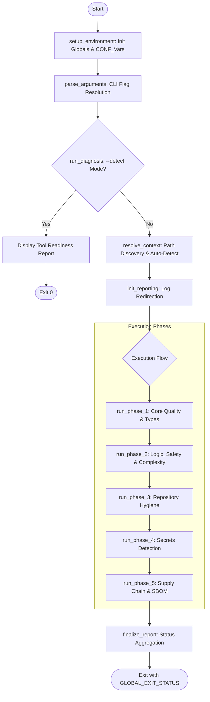

# Code Audit Pipeline: Enterprise Quality & Security Audit Utility

## Core Objectives
- **Syntactic & Stylistic Integrity**: Enforce consistent formatting and best practices across Python and Go ecosystems.
- **Comprehensive Reporting**: Execute all requested audit phases to completion, aggregating results into a final health status rather than terminating on the first error.
- **Multi-tiered Orchestration**: Modular support for standard core checks, extended code quality, and deep supply chain analysis.
- **Architectural Resilience**: Hardened execution environment designed for CI/CD runners and local developer environments.

## Architecture and Design Choices

### 1. Three-Tier Execution Model
To satisfy diverse use cases—from local pre-commit hooks to deep weekly security reviews—the tool implements a tiered execution strategy:
- **Standard (Core)**: Fast, essential checks for rapid feedback.
- **Extended (Quality)**: Deep static analysis and safety checks (e.g., nil-panic detection, strict formatting).
- **Extra Scan (Security)**: Heavy-duty security scanning, including SBOM generation and holistic vulnerability analysis### 2. Modular, Function-Based Architecture
The script has been refactored from a linear procedural flow into a discrete, named-module architecture. This maximizes maintainability and allows for easier integration of new audit layers. Core modules include:
- `setup_environment`: Initializes global state and hardening.
- `resolve_context`: Handles directory resolution and heuristic autodetection.
- `init_reporting`: Manages global log redirection.
- `run_phase_1-5`: Encapsulated audit execution layers.

### 3. Centralized Configuration Management
To eliminate magic numbers and hardcoded strings, all tool-specific settings (thresholds, flags, search depths) are centralized in the `setup_environment` module using the `CONF_` global namespace. This ensures that the execution phases remain purely functional and data-driven.

### 4. Logic Isolation and Context Awareness
The tool implements an "Isolation Pattern." Users can explicitly force a language context (e.g., `--python`) or utilize the built-in **Autodetection Engine**, which heuristically determines the project type by scanning the filesystem depth (configurable via `CONF_SEARCH_DEPTH`).

### 5. Pipeline Integrity (Cumulative Reporting)
The script implements a non-blocking execution model. Instead of terminating on the first failure, it captures the exit status of every tool:
1.  **Phase 1-3 (Quality & Logic)**: Executes syntax, style, and complexity checks.
2.  **Phase 4 & 5 (Secrets & Supply Chain)**: Comprehensive scanning for sensitive data exposure and third-party vulnerabilities.
3.  **Final Aggregation**: The `finalize_report` module evaluates the accumulated `GLOBAL_EXIT_STATUS`. If any tool fails, the script returns a final non-zero exit code (1) to signal the CI/CD environment.

### 6. Zero-Impact Policy (Remediation Control)
By default, the audit has **zero impact** on source code. Toolsets are configured in "check-only" modes. Source code modifications (formatting fixes and auto-linting) only occur if the `--fix` flag is explicitly provided.

## Data Flow and Control Logic

The following diagram illustrates the modular operational flow from initialization to final status reporting.



## Dependencies

The utility relies on a suite of specialized binaries. Their presence can be verified using the `--detect` flag.

| Ecosystem | Tool(s) Required | Use Case |
| :--- | :--- | :--- |
| **Python** | `ruff`, `pyright`, `radon`, `vulture`, `pip-audit` | Syntax, Types, Complexity, Dead Code, Vulns |
| **Golang** | `go`, `golangci-lint`, `govulncheck`, `gosec`, `gofumpt`, `nilaway` | Formatting, Safety, Lints, Security, Vulns |
| **Security** | `semgrep`, `trufflehog`, `grype` | Static analysis, Secrets, Supply Chain |
| **Deep Scan**| `syft`, `trivy` | SBOM Generation, Configuration Scanning |

## Command Line Arguments

| Argument | Type | Default | Description |
| :--- | :--- | :--- | :--- |
| `--path <dir>` | String | `.` | Target directory for the audit. Validates existence before switching. |
| `--auto` | Flag | `false` | Enables heuristic autodetection of project language based on filesystem. |
| `--detect` | Flag | `false` | Generates a diagnostic report of all installed/missing audit tools. |
| `--extended` | Flag | `false` | Enables deep quality tools (e.g., Nilaway, Gofumpt, extra Go linters). |
| `--extra-scan` | Flag | `false` | Enables heavy-duty security scanning (Syft SBOM, Trivy). |
| `--fix` | Flag | `false` | Enables auto-fix and reformatting for supported tools. |
| `--log <path>` | String | N/A | Redirects and appends all audit output to the specified log file. |
| `--python` | Flag | `true`* | Isolates the audit to Python tools only. |
| `--golang` | Flag | `true`* | Isolates the audit to Go tools only. |
| `--general` | Flag | `true`* | Isolates the audit to general-purpose security tools only. |
| `--help` | Flag | `false` | Displays the usage/help manual. |

*\* Defaults are `true` unless an isolation flag or `--auto` is used.*

## Deep Dive: Tool Ecosystem

The utility orchestrates a specialized collection of industry-standard tools. Below is a detailed breakdown of each tool's category, purpose, and detection scope.

### 1. Python-Specific Suite
| Tool | Purpose | Detection Scope |
| :--- | :--- | :--- |
| **Ruff** | Ultra-fast Linter & Formatter | Detects syntax errors, PEP8 style violations, unused imports, and logical anti-patterns. |
| **Pyright** | Static Type Checker | Enforces type safety; detects type mismatches and missing type hints in large codebases. |
| **Radon** | Complexity Analysis | Measures Cyclomatic Complexity (CC) and identifies "spaghetti code" that is difficult to maintain. |
| **Vulture** | Dead Code Detection | Finds and flags unused variables, functions, and classes that bloat the repository. |
| **pip-audit** | Dependency Scanner | Scans the local environment against the PyPA database to find known CVEs in Python packages. |

### 2. Golang-Specific Suite
| Tool | Purpose | Detection Scope |
| :--- | :--- | :--- |
| **gofmt / gofumpt**| Code Formatting | Enforces standard Go style; `gofumpt` adds stricter, opinionated rules for senior-level consistency. |
| **golangci-lint** | Meta-Linter Orchestrator | A high-performance runner that aggregates results from dozens of internal Go linters (see below for details). |
| **nilaway** | Safety (Panic Detection) | Specially designed by Uber to find potential `nil` pointer dereferences before they cause panics. |
| **gosec** | Security Audit | Scans for SQLi, hard-coded credentials, unsafe cryptography, and insecure permissions. |
| **govulncheck** | Vulnerability Scanner | The official Go tool for finding known vulnerabilities in your module's dependency graph. |

#### Bundled Go Linters (via `golangci-lint`)
| Linter | Focus | Detection Scope |
| :--- | :--- | :--- |
| **govet** | Official Go "vet" command | Detects suspicious constructs such as Printf call arguments that do not align with format strings. |
| **staticcheck** | Robust Static Analysis | Detects correctness issues, performance improvements, and simplifies code structures. |
| **unused** | Dead Code Analysis | Finds uncalled constants, variables, functions, and types. |
| **gocritic** | Style & Performance Linter | Finds micro-bugs, performance bottlenecks, and opinionated stylistic issues. |
| **gocyclo** | Structural Complexity | Measures function complexity via CC; parity with Python's Radon. |
| **goconst** | Optimization | Identifies hard-coded strings that appear multiple times and should be promoted to constants. |
| **mnd (Magic Number)**| Constant Enforcement | Detects "magic numbers" (unnamed numeric constants) which reduce code readability. |
| **copyloopvar** | Safety Analysis | Detects loop variable capture by reference to prevent concurrency issues. |
| **interfacebloat** | Interface Design | Flags interfaces with an excessive number of methods to enforce SRP. |

### 3. General-Purpose Security Suite
| Tool | Purpose | Detection Scope |
| :--- | :--- | :--- |
| **Semgrep** | Polyglot Static Analysis | Detects high-level dangerous patterns (XSS, SQLi, command injection) across multiple languages. |
| **TruffleHog** | Secret Detection | Scans the entire filesystem and git history for leaked API keys, tokens, and certificates. |
| **Grype** | Vulnerability Scanner | Scans SBOMs and lock files for vulnerabilities across OS packages and language ecosystems. |
| **Syft** | SBOM Generator | Generates a machine-readable Software Bill of Materials (SBOM) for complete supply chain transparency. |
| **Trivy** | Holistic Security Audit | Detects vulnerabilities and **misconfigurations** in config files, Dockerfiles, and cloud infrastructure. |

## Usage Examples

### 1. The "Pre-Commit" Audit (Fast & Core)
Ideal for local development. Automatically detects project type and runs standard checks.
```bash
./code_audit.sh --auto
```

### 2. The "Deep Quality" Review (Senior Developer Mode)
Runs deeper static analysis, including nil-pointer detection for Go projects and dead code analysis.
```bash
./code_audit.sh --auto --extended
```

### 3. CI/CD Pipeline Mode (Reporting & Evidence)
Executes a standard audit, ensures no code changes occur, and captures the entire transcript for audit logs.
```bash
./code_audit.sh --auto --log /path/to/artifacts/audit_report.log
```

### 4. Developer Remediation (Auto-Fix)
The developer runs the tool locally to automatically apply formatting and linting fixes identified by the CI.
```bash
./code_audit.sh --auto --fix
```

### 3. The "Full Security Integrity" Scan (Security Architect Mode)
Generates an SBOM, runs configuration scanners (Trivy), and checks for hard-coded secrets.
```bash
./code_audit.sh --path ./production-service --extra-scan --general
```

### 4. Multi-Language Enterprise Audit
Runs every single tool in the suite (Quality + Security) on a multi-language root.
```bash
./code_audit.sh --extended --extra-scan
```

### 5. Environment Readiness Check
Used during CI/CD runner setup to verify all dependencies are properly mapped.
```bash
./code_audit.sh --detect
```
