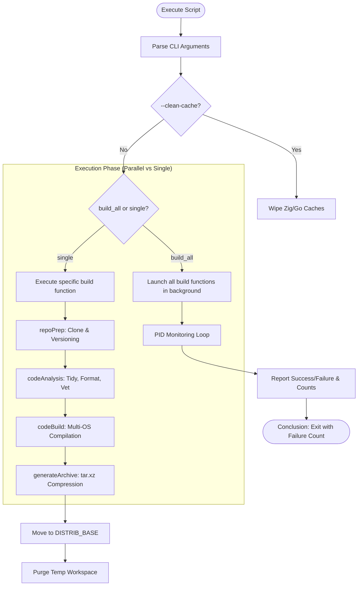

# Go Build Pipeline: Code Analyzers

## Application Overview and Objectives
The **Go Build Pipeline for Code Analyzers** is an automated shell-based build system designed to compile, cross-compile, and package a curated suite of 21 essential Go development and static analysis tools.

### Core Objectives:
*   **Automated Build Management**: Streamline the process of fetching, updating, and compiling multiple disparate tool repositories into a unified distribution.
*   **Cross-Platform Portability**: Generate high-performance, statically linked binaries for both **Windows (AMD64)** and **Linux (AMD64/musl)** using a single command.
*   **Advanced Cross-Compilation**: Utilize the **Zig toolchain** as a drop-in C compiler replacement to enable `CGO_ENABLED=1` builds (necessary for tools like Delve) with zero external library dependencies.
*   **Version Traceability**: Automatically derive semantic versions or commit timestamps to ensure every build is uniquely identifiable and reproducible.
*   **Performance**: Leverage multi-core parallelism to build the entire suite simultaneously, significantly reducing total compilation time.

---

## Architecture and Design Choices

### 1. Modular "Plug-and-Play" Wrappers
Each tool is encapsulated in a dedicated shell function (e.g., `build_staticcheck`). This allows for tool-specific overrides (like custom `LDFLAGS` or extra binaries) while sharing a common core logic.

### 2. Subshell Isolation
Tool functions are executed within subshells `(...)`. This ensures that environment variable modifications (like `PKG_NAME` or `PKG_BIN`) do not leak between builds, enabling safe parallel execution.

### 3. Zig & CGO Integration
By routing C-compilation through Zig (`zig cc`), the script bypasses traditional cross-compilation headaches. It targets `x86_64-linux-musl` for Linux to ensure binaries run on any distribution without specific GLIBC versions.

### 4. Process-Based Parallelism
The script uses standard Bash job control. It backgrounds every tool build, stores their Process IDs (PIDs), and uses a monitoring loop with `wait -n` to track completion. The loop is specifically designed to capture sub-task failure statuses without triggering a global script exit.

### 5. Absolute Binary Tracking
The orchestrator implements a **Location-Independent Tracking System**. Instead of relying on heuristic directory searches, every build engine (`codeBuild` and `codeInstall`) exports an absolute `PKG_BIN_PATH` upon successful compilation. This ensures that downstream functions (`pkgVersion`, `generateArchive`) always find the correct binary regardless of repository nesting depth (e.g., `gopls`).

### 6. Cross-Platform Environment Detection
The orchestrator is fully compatible with both **Cygwin** and **MSYS2/Git-Bash**. It dynamically detects the host environment and resolves the correct Windows drive prefixing:
- **Cygwin**: Uses `/cygdrive/` (e.g., `/cygdrive/c/`).
- **MSYS2**: Uses native roots (e.g., `/c/`).

This dynamic resolution ensures that hardcoded paths remain functional regardless of the POSIX layer being used on Windows.

### 7. Cygwin-Windows Interoperability
To support reliable metadata extraction, the script utilizes `cygpath -w` when communicating with the Windows Go toolchain. This prevents "File Not Found" errors that occur when passing POSIX-style paths to native Windows binaries.

### 8. Bash Strict Mode & Hardening
To ensure enterprise-grade reliability, the script implements "Bash Strict Mode" (`set -euo pipefail`). This enforces immediate abortion on unhandled errors and ensures that failures in parallel subshells are correctly detected.

### 9. Defensive Variable Management
*   **Immutability**: Critical configuration constants (paths, compiler strings) are declared as `readonly` to prevent accidental mutation during the parallel execution phase.
*   **Safe Expansion**: All variable accesses use defensive expansion (e.g., `${VAR:-}`) to maintain stability under `nounset` conditions, especially for optional function arguments and environment metadata.

---

## Data Flow and Control Logic

### Operational Flow Diagram


### Data Sequence
1.  **Ingress**: The script clones the source code from remote repositories into the `compile/` directory.
2.  **Metadata generation**: Git tags and commit hashes are transformed into a `PKG_VER` identifier.
3.  **Transformation**: Source code is processed by the Go compiler. If CGO is enabled, Zig acts as the linker.
4.  **Egress**: Binary artifacts are bundled with OS-specific extensions (`.exe` for Windows) and moved to the `distrib/` folder as compressed `.tar.xz` archives.

---

## Go Utilities Details
The following table provides a high-level summary of the tools included in this pipeline:

| Tool (21) | Repo URL | Short Description | Recommended Command |
| :--- | :--- | :--- | :--- |
| **TYPE: FORMATTING & STYLE (4)** | | | |
| **gofumpt** | github.com/mvdan/gofumpt | Stricter, more opinionated Go formatter | `gofumpt -w -extra .` |
| **gocritic** | github.com/go-critic/go-critic | Finds stylistic and performance micro-bugs | `gocritic check ./...` |
| **goconst** | github.com/jgautheron/goconst | Finds repeated strings to make constants | `goconst -min-occurrences 3 ./...` |
| **go-mnd** | github.com/tommy-muehle/go-mnd | Detects magic numbers (unnamed constants) | `mnd ./...` |
| **TYPE: STATIC ANALYSIS & LINTING (7)** | | | |
| **golangci-lint** | github.com/golangci/golangci-lint | Fast, parallel runner for dozens of linters | `golangci-lint run ./...` |
| **staticcheck** | github.com/dominikh/go-tools | Advanced static analysis with all checks | `staticcheck ./...` |
| **nilaway** | github.com/uber-go/nilaway | Advanced static nil-panic detector | `nilaway ./...` |
| **nilness** | golang.org/x/tools | Detects potential nil-pointer dereferences | `nilness ./...` |
| **gocyclo** | github.com/fzipp/gocyclo | Measures cyclomatic complexity of functions | `gocyclo -over 15 .` |
| **interfacebloat** | github.com/sashamelentyev/interfacebloat | Flags interfaces with too many methods | `interfacebloat -max 5 ./...` |
| **copyloopvar** | github.com/karamaru-alpha/copyloopvar | Detects loop variable pointer issues | `copyloopvar ./...` |
| **TYPE: SECURITY & VULNERABILITY (2)** | | | |
| **govulncheck** | github.com/golang/vuln | Official vulnerability scanner for Go code | `govulncheck ./...` |
| **gosec** | github.com/securego/gosec | Inspects source code for security problems | `gosec ./...` |
| **TYPE: TESTING & PERFORMANCE (3)** | | | |
| **mockery** | github.com/vektra/mockery | Generates type-safe mocks for interfaces | `mockery --all` |
| **goleak** | github.com/uber-go/goleak | Verifies no Goroutines are leaked in tests | (Library Use Only) |
| **benchstat** | github.com/golang/perf | Computes statistics about Go benchmarks | `benchstat old.txt new.txt` |
| **TYPE: DEVELOPMENT & VISUALIZATION (4)** | | | |
| **gopls** | go.googlesource.com/tools | Official Go Language Server (IDE logic) | `gopls check ./...` |
| **delve (dlv)** | github.com/go-delve/delve | The standard debugger for the Go language | `dlv debug ./main.go` |
| **go-callvis** | github.com/ondrajz/go-callvis | Interactive graph visualization of Go code | `go-callvis ./...` |
| **impl** | github.com/josharian/impl | Generates method stubs for interfaces | `impl 'r *Receiver' io.Reader` |
| **TYPE: ASSET MANAGEMENT (1)** | | | |
| **go.rice** | github.com/GeertJohan/go.rice | Embeds static assets into Go binaries | `rice embed-go` |

---

## Detailed Tool Breakdown

### 1. gofumpt
*   **Objectives**: Enforce a rigid coding style that is a strict superset of `gofmt`.
*   **Core Components**: `gofumpt` binary.
*   **Functionality**: Automates formatting with stricter rules, such as prohibiting empty lines at the start/end of functions and ensuring consistent block formatting. It is designed to minimize small stylistic diffs in large codebases.
*   **How to use**: Run `gofumpt -w -extra .` to format all files in the current directory recursively.

### 2. govulncheck
*   **Objectives**: Identify known security vulnerabilities in project dependencies.
*   **Core Components**: `govulncheck` binary.
*   **Functionality**: Queries the official Go Vulnerability Database to find vulnerabilities matching your project's imported packages and versions. Unlike simple 'audit' tools, it performs static analysis to see if your code actually *calls* the vulnerable functions.
*   **How to use**: Run `govulncheck ./...` in your project root to scan source code and dependencies.

### 3. golangci-lint
*   **Objectives**: Provide a unified, high-performance interface for dozens of Go linters.
*   **Core Components**: `golangci-lint` binary, optional `.golangci.yml` configuration file.
*   **Functionality**: Orchestrates multiple analysis tools (staticcheck, govet, errcheck, etc.) in parallel. It uses clever caching to remain extremely fast even for large repositories.
*   **How to use**: Run `golangci-lint run ./...` to execute all enabled linters across the codebase.

### 4. staticcheck
*   **Objectives**: Detect bugs, performance issues, and offer sophisticated code simplifications.
*   **Core Components**: `staticcheck` binary along with specialized layout tools: `structlayout`, `structlayout-optimize`, and `structlayout-pretty`.
*   **Functionality**: Applies hundreds of advanced checks focusing on correctness and maintainability. It is widely considered the best-in-class static analyzer for identifying logic flaws that other tools miss.
*   **How to use**: Run `staticcheck ./...` for a comprehensive codebase analysis. Use `structlayout` to analyze the memory layout of Go structs.

### 5. gopls
*   **Objectives**: Power modern IDE features including autocompletion, navigation, and refactoring.
*   **Core Components**: `gopls` binary (implements the Language Server Protocol).
*   **Functionality**: Acts as the backend for editors like VS Code, Vim, and GoLand, providing real-time code intelligence (hover docs, find-references, etc.) by analyzing your workspace index.
*   **How to use**: Typically managed by your editor, but can be manually invoked via `gopls check ./...` to verify local workspace health.

### 6. delve (dlv)
*   **Objectives**: Provide a world-class interactive debugging experience for Go.
*   **Core Components**: `dlv` binary.
*   **Functionality**: Allows developers to pause execution, inspect variables, evaluate expressions, and step through goroutines. It understands Go's specific runtime complexities better than generic debuggers like GDB.
*   **How to use**: Use `dlv debug ./main.go` to begin a local debugging session or `dlv test` to debug unit tests.

### 7. gocyclo
*   **Objectives**: Quantify and control the cyclomatic complexity of Go functions.
*   **Core Components**: `gocyclo` binary.
*   **Functionality**: Measures the number of independent paths through your code's control flow. Functions with high complexity are harder to test, understand, and maintain.
*   **How to use**: Run `gocyclo -over 15 .` to find all functions with a complexity score higher than 15.

### 8. goconst
*   **Objectives**: Eliminate "magic strings" and improve the maintainability of literal constants.
*   **Core Components**: `goconst` binary.
*   **Functionality**: Scans source code for string literals that appear multiple times. It recommends replacing these with a single package-level or local constant to prevent typos and ease future refactoring.
*   **How to use**: Run `goconst -min-occurrences 3 ./...` to identify strings repeated at least 3 times.

### 9. interfacebloat
*   **Objectives**: Enforce the Interface Segregation Principle by limiting interface size.
*   **Core Components**: `interfacebloat` binary.
*   **Functionality**: Flags interfaces that grow too large (contain too many methods). Small interfaces are more flexible and easier for others to implement.
*   **How to use**: Run `interfacebloat -max 5 ./...` to detect any interfaces defining more than 5 methods.

### 10. nilaway
*   **Objectives**: Statically guarantee nil-safety and prevent the dreaded "nil pointer dereference" panic.
*   **Core Components**: `nilaway` binary.
*   **Functionality**: Leverages sophisticated data flow and escape analysis to determine if a pointer can ever be nil at a specific call site across package boundaries.
*   **How to use**: Run `nilaway ./...` to perform a comprehensive nil-safety audit.

### 11. nilness
*   **Objectives**: Statically detect potential nil-pointer dereferences in Go code.
*   **Core Components**: `nilness` analyzer (part of `golang.org/x/tools`).
*   **Functionality**: Inspects code paths to find instances where a nil value is unconditionally dereferenced. It is a precise, low-noise analyzer that is part of the standard Go analysis suite.
*   **How to use**: Run `nilness ./...` to check for nil dereferences.

### 12. gosec
*   **Objectives**: Automate security-focused code audits to catch common vulnerabilities early.
*   **Core Components**: `gosec` binary.
*   **Functionality**: Scans for specific security anti-patterns such as hardcoded credentials, weak TLS configurations, SQL injection points, and unsafe permission settings.
*   **How to use**: Run `gosec ./...` to generate a security finding report.

### 13. go.rice (rice)
*   **Objectives**: Simplify application deployment by embedding static assets into the final binary.
*   **Core Components**: `rice` binary.
*   **Functionality**: Packs folders containing HTML, CSS, JavaScript, or templates into a specialized Go file that is compiled into your application, allowing for true single-binary distribution.
*   **How to use**: Run `rice embed-go` in your project's asset directory before running `go build`.

### 14. go-mnd (mnd)
*   **Objectives**: Eliminate "magic numbers" to improve code self-documentation.
*   **Core Components**: `mnd` binary.
*   **Functionality**: Detects raw numerical constants (e.g., `86400`) and encourages developers to give them descriptive names (e.g., `SecondsPerDay`) to improve readability.
*   **How to use**: Run `mnd ./...` to find unnamed numerical literals.

### 15. gocritic
*   **Objectives**: Provide highly detailed suggestions for stylistic, performance, and correctness micro-improvements.
*   **Core Components**: `gocritic` binary.
*   **Functionality**: Offers a collection of "critics" that look for subtle issues not covered by standard linters, such as inefficient loop patterns or redundant type conversions.
*   **How to use**: Run `gocritic check ./...` to receive a list of actionable advice.

### 16. impl
*   **Objectives**: Speed up development by automating interface implementation boilerplate.
*   **Core Components**: `impl` binary.
*   **Functionality**: Given a receiver name and an interface name (e.g., `io.Reader`), it generates the correct method signatures directly into your code or stdout.
*   **How to use**: Run `impl 'r *MyType' io.ReadWriteCloser` to instantly generate all three required method stubs.

### 17. go-callvis
*   **Objectives**: Visualize the internal structure and call graphs of Go programs.
*   **Core Components**: `go-callvis` binary.
*   **Functionality**: Analyzes call relationships and generates a graphical representation (using Graphviz) that helps developers understand package coupling and deep function chains.
*   **How to use**: Run `go-callvis ./...` to generate a live visualization or a static image file.

### 18. benchstat
*   **Objectives**: Perform statistically sound comparisons of Go benchmarks.
*   **Core Components**: `benchstat` binary.
*   **Functionality**: Compares the output of `go test -bench` from two different runs (e.g., master vs. feature branch) and determines if a performance delta is statistically significant or just noise.
*   **How to use**: Run `benchstat old_bench.txt new_bench.txt` to see the performance percentage change.

### 19. mockery
*   **Objectives**: Automate the generation of type-safe mocks for Go interfaces.
*   **Core Components**: `mockery` binary.
*   **Functionality**: Scans your Go source code and generates implementations of your interfaces that can be used in unit tests to simulate external dependencies.
*   **How to use**: Run `mockery --all` to generate mocks for all interfaces in the current directory.

### 20. copyloopvar
*   **Objectives**: Prevent common concurrency bugs by detecting loop variable capture issues.
*   **Core Components**: `copyloopvar` binary.
*   **Functionality**: Identifies places in your code where a reference to a loop variable is taken (e.g., in a goroutine or closure), which often leads to unexpected behavior in older Go versions or complex logic.
*   **How to use**: Run `copyloopvar ./...` to scan your project.

### 21. goleak
*   **Objectives**: Verify that no Goroutines are leaked during test execution.
*   **Core Components**: Integration reference (Library only).
*   **Functionality**: Unlike the other tools, `goleak` is not a standalone binary but a library you import into your `_test.go` files to check for leaked goroutines after tests finish.
*   **How to use**: Add `defer goleak.VerifyNone(t)` to your test functions or use it in `TestMain`.

---

## Dependencies

| Category | Component | Purpose |
| :--- | :--- | :--- |
| **Runtime** | `bash` | Script execution environment. |
| **Compiler** | `go` | Primary Go toolchain (1.20+ recommended). |
| **Workspace** | `GOPATH` | Must be defined in the environment for `go install` operations. |
| **Cross-Compiler** | `zig` | C compiler for statically linked CGO builds. |
| **Version Control**| `git` | Repository cloning and version metadata. |
| **Utilities** | `tar`, `xz` | Packaging and compression. |
| **Utilities** | `nproc` | CPU core detection for build optimization. |
| **Environment** | `Cygwin` or `MSYS2/Git-Bash` | Required for running on Windows systems. |

---

## Command Line Arguments

| Argument | Description | Type | Default |
| :--- | :--- | :--- | :--- |
| `--help` | Displays the help menu and list of available targets. | Flag | N/A |
| `--clean-cache` | Clears the Zig global cache and Go build cache before building. | Flag | N/A |
| `--purge-distrib` | Deletes distribution subdirectories for the selected build target(s). | Flag | N/A |
| `--report-distrib` | Generates a formatted table of all currently compiled binaries. | Flag | N/A |
| `--scope=<list>` | Restricts maintenance to a comma-separated list (e.g.: `gosec,golangci-lint`) or wildcard pattern (e.g., `go*`) of packages. | Option | N/A |
| `build_all` | Compiles all 21 targets concurrently in parallel mode. | Target | N/A |
| `build_<name>` | Build a specific tool (e.g., `build_gofumpt`, `build_nilaway`). | Target | N/A |

---

## Usage Examples

### 1. Build the entire suite in parallel
```bash
./gobuild_code-analyzers.sh build_all
```

### 2. Build a specific tool (e.g., Staticcheck)
```bash
./gobuild_code-analyzers.sh build_staticcheck
```

### 3. Fresh build with cache cleanup
```bash
./gobuild_code-analyzers.sh --clean-cache build_all
```

### 4. Purge distribution and rebuild a specific tool
```bash
./gobuild_code-analyzers.sh --purge-distrib build_gosec
```

### 5. Generate a comprehensive distribution report
```bash
./gobuild_code-analyzers.sh --report-distrib
```

### 6. Targeted Maintenance using --scope (Wildcard Support)
The `--scope` flag allows you to run maintenance tasks on a specific subset of tools without triggering a build. It supports standard shell wildcards (`*`), enabling you to target groups of tools easily.

> [!NOTE]
> When using wildcards, ensure the scope string is quoted (e.g., `--scope="go*"`) to prevent the shell from expanding the pattern against local files.

*   **Report specific tools with wildcards**:
    ```bash
    ./gobuild_code-analyzers.sh --report-distrib --scope="go*,nil*"
    ```
*   **Purge specific tool distribution**:
    ```bash
    ./gobuild_code-analyzers.sh --purge-distrib --scope=staticcheck
    ```
*   **Combined maintenance**:
    ```bash
    ./gobuild_code-analyzers.sh --purge-distrib --report-distrib --scope=gopls,mockery
    ```

---

## Viewing Results
After completion, the script provides a comprehensive summary:
`All builds finished in Xm Ys. Success: <N>, Failures: <M>, Status: PASS/FAIL`

The archives will be located in:
`<INSTALL_BASE>\distrib/<package_name>/<package>-<version>_<os>-amd64.tar.xz`

The script's exit code will be equal to the number of failed builds (0 for total success).

---

## Logging and Diagnostics
When running in parallel mode (`build_all`), the script redirects individual tool output to log files to maintain a clean console interface.

*   **Log Location**: `/tmp/logs/golang/build_<tool_name>.log`
*   **Real-time Monitoring**: You can tail logs during a build to debug specific tool failures:
    ```bash
    tail -f /tmp/logs/golang/build_gopls.log
    ```
*   **Failure Analysis**: If a build fails with `Status: 127` or `Status: 1`, check the log for specific Go compiler errors, network timeouts during `git clone`, or pathing issues.
