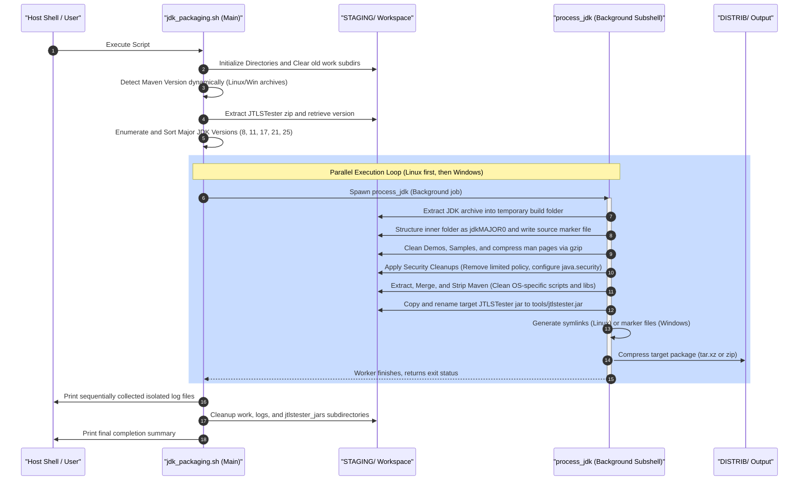

# JDK Packaging Utility Documentation

This document provides a comprehensive guide to the JDK packaging script, its architecture, design choices, data flow, dependencies, and usage examples.

## Application Overview and Objectives

The [jdk_packaging.sh](file:///usr/src/packages/SCRIPTS/jdk_packaging.sh) script is a bash-based automation utility designed to repackage multiple **Azul Zulu JDK** distributions (supporting both Linux and Windows platforms for major versions 8, 11, 17, 21, and 25).

The primary objectives of this repackaging process are:
1. **Footprint Reduction (Minimization)**: Strip unnecessary development or documentation artifacts (such as `demo/`, `sample/`, and Japanese manual pages `man/ja*`) to minimize the distribution size.
2. **Standardization of Archives**: Re-compress standard manual pages using `gzip -9` and deliver clean, consistent structures (`.tar.xz` for Linux and `.zip` for Windows).
3. **Maven Integration**: Dynamically detect, resolve, and embed an Apache Maven installation into each JDK, stripping platform-incompatible executables/libraries (e.g., removing Windows batch files and Windows-specific Jansi native libraries on Linux; keeping only the Windows-specific binaries/libraries on Windows).
4. **Security Enhancements**: 
   - Remove limited security policy directories (`policy/limited`).
   - Enable unlimited cryptographic strength in JDK 8 by modifying the `crypto.policy` configuration.
   - Strengthen the default PKCS#12 key protection algorithm.
5. **TLS Diagnostics Capability**: Embed the `JTLSTester` utility jars directly into the package structure as `tools/jtlstester.jar` (mapping `jtlstester8.jar` to JDK 8 and `jtlstester11.jar` to JDK 11+).
6. **Concurrent Processing**: Execute the repackaging tasks in parallel to optimize CPU utilization, while maintaining clean, sequential log output to prevent interleaving of console messages.

---

## Architecture and Design Choices

The script employs several key architectural strategies to ensure reliability, safety, and efficiency:

### 1. Zero-Hardcoding Version Resolution
Rather than hardcoding Maven or JTLSTester versions, the script uses Perl-compatible regular expressions (`grep -oP`) to parse version numbers dynamically from the filenames located inside the source directory. This allows updates to Maven or JTLSTester simply by replacing the files in `SOURCES/` without modifying the script code.

### 2. Concurrency and Process Isolation
To process the 10 target archives efficiently:
- The script queries the available CPU core count using `nproc` to set `MAX_JOBS`.
- It spawns background subshells for each package extraction and cleanup job.
- **Log Isolation**: To prevent console log messages from interleaving, each background process redirects stdout and stderr to a unique temporary log file under `STAGING/logs/`.
- Once all processes complete, the main script sequentially reads and outputs each log file, providing clean, readable build logs for each platform.

### 3. Strict Execution Ordering
Standard globbing orders versions alphabetically (which processes JDK 8 last due to string comparison). The script dynamically extracts major version numbers, sorts them numerically (`sort -un`), and iterates:
1. **Linux Targets First**: Ordered by JDK Version (8 -> 11 -> 17 -> 21 -> 25)
2. **Windows Targets Second**: Ordered by JDK Version (8 -> 11 -> 17 -> 21 -> 25)

### 4. Safe Scratch Workspaces
All extraction, modification, and logging happen inside isolated staging subdirectories under `STAGING/work` and `STAGING/logs`. The script specifically cleans up these workspace directories upon successful completion, ensuring that:
- No wildcard deletions (e.g. `rm -rf *`) are performed.
- The parent `STAGING/` directory itself is preserved.

---

## Data Flow and Control Logic

### Operational Flow Sequence

The diagram below outlines the sequential control logic and data manipulation steps performed from script invocation to final output generation.



### Detailed Repackaging Logic

1. **Extraction and Directory Formatting**:
   - Compiles a target directory name: `jdk-[short_version]-[os]-[arch]` (e.g., `jdk-11u31-linux-x86_64`).
   - Moves the inner extracted JDK directory to `jdk${major}0` (e.g., `jdk110`).
   - Creates a 0-byte marker file with the name of the original Zulu archive to maintain metadata.

2. **Cleanups**:
   - `rm -rf demo/ sample/ man/ja*`
   - Compresses any remaining manual pages in `man/man1/*.1` using `gzip -f -9`.

3. **JDK 8 Security Adjustments**:
   - Location: `jre/lib/security/`
   - Action: Removes `policy/limited`.
   - Backup: Copies `java.security` to `java.security.dist`.
   - Security Policies: Modifies `crypto.policy=unlimited`.
   - PKCS#12 Protection: Appends `keystore.pkcs12.keyProtectionAlgorithm=PBEWithHmacSHA256AndAES_256`.

4. **JDK 11+ Security Adjustments**:
   - Location: `conf/security/`
   - Action: Removes `policy/limited` and deletes developer sources (`lib/src.zip`, `lib/src*`).

5. **Maven OS-Specific Strip**:
   - **Linux**: Removes `.cmd` batch scripts; deletes Windows native Jansi directories (`lib/jansi-native/Windows`); creates a version-specific symlink `maven-${MAVEN_VERSION} -> maven`.
   - **Windows**: Removes UNIX shell scripts (`mvn`, `mvnDebug`, `mvnyjp`); cleans up `lib/jansi-native/Windows/` to keep only the `x86_64` folder; creates a 0-byte marker file `apache-maven-${MAVEN_VERSION}-bin`.

---

## Dependencies

The following system utilities and packages are required to run the repackaging tool successfully:

| Dependency | Purpose | Minimum Recommended / Notes |
|:---|:---|:---|
| **Bash** | Script execution interpreter | Bash 4.0+ (uses `mapfile`, arrays, and localized variable scopes) |
| **Tar** | Archive extraction and packaging for Linux | Supporting `-xf` (extract) and `-cJf` (LZMA/XZ compression) |
| **Unzip** | Archive extraction for Windows packages and JTLSTester | Supporting `-q` (quiet mode) |
| **Zip** | Compression utility for Windows packages | Supporting `-q` and `-r` (recursive packaging) |
| **Gzip** | Compression tool for JDK manual pages | Supporting `-f` and `-9` (maximum compression level) |
| **Grep** | Text search and regular expression parser | Must support `-oP` (Perl-compatible regex) |
| **Sed** | Stream editor for config updates | Used to modify `java.security` properties in place |
| **Nproc** | Core count discovery | Used to control concurrent workers dynamically |
| **Sort** | Version list sorting | Supporting `-u` (unique) and `-n` (numeric sort) |

---

## Command Line Arguments & Variables

The script does not accept arguments via standard command-line parameters (e.g. `--target`). Instead, it is configured through variables defined in the script header to ensure predictability.

### Staging and Workspace Configuration Variables

These configuration paths are defined directly in [jdk_packaging.sh](file:///usr/src/packages/SCRIPTS/jdk_packaging.sh#L45-L51):

| Variable Name | Type | Default Value | Description |
|:---|:---|:---|:---|
| `PKG_DIR` | String (Path) | `/usr/src/packages` | Root base directory for packaging operations. |
| `SOURCE_DIR` | String (Path) | `${PKG_DIR}/SOURCES` | Directory containing raw JDK, Maven, and JTLSTester archives. |
| `TARGET_DIR` | String (Path) | `${PKG_DIR}/DISTRIB` | Output folder where final repackaged archives are saved. |
| `STAGING_DIR` | String (Path) | `${PKG_DIR}/STAGING` | Scratch directory containing work folders, extracted files, and temporary logs. |
| `WORK_DIR` | String (Path) | `${STAGING_DIR}/work` | Individual package compilation workspace. |
| `JTLSTESTER_EXTRACT_DIR` | String (Path) | `${STAGING_DIR}/jtlstester_jars` | Staging location for extracted JTLSTester diagnostic utility jars. |
| `LOGS_DIR` | String (Path) | `${STAGING_DIR}/logs` | Staging folder storing isolated parallel build logs. |

---

## Detailed Examples on How to Use

### 1. Directory Structure Preparation
Before executing the script, ensure that the workspace directories are created and the raw archives are placed in the `SOURCES/` directory.

```bash
# Create directory structure
mkdir -p /usr/src/packages/{SOURCES,DISTRIB,STAGING,SCRIPTS}

# Verify content of the SOURCES directory
ls -la /usr/src/packages/SOURCES/
```

*Expected Source File Manifest Example:*
```text
-rw-r--r-- 1 builder builder  12483921 apache-maven-3.9.16-bin.tar.gz
-rw-r--r-- 1 builder builder  12589312 apache-maven-3.9.16-bin.zip
-rw-r--r-- 1 builder builder    182903 jtlstester-1.0.0-f4f9f46-java.zip
-rw-r--r-- 1 builder builder 104857600 zulu8.94.0.17-ca-jdk8.0.492-linux_x64.tar.gz
-rw-r--r-- 1 builder builder 106721034 zulu8.94.0.17-ca-jdk8.0.492-win_x64.zip
-rw-r--r-- 1 builder builder 183921048 zulu11.88.17-ca-jdk11.0.31-linux_x64.tar.gz
-rw-r--r-- 1 builder builder 185901238 zulu11.88.17-ca-jdk11.0.31-win_x64.zip
-rw-r--r-- 1 builder builder 191028301 zulu17.66.19-ca-jdk17.0.19-linux_x64.tar.gz
-rw-r--r-- 1 builder builder 192801931 zulu17.66.19-ca-jdk17.0.19-win_x64.zip
-rw-r--r-- 1 builder builder 195102938 zulu21.78.11-ca-jdk21.0.25-linux_x64.tar.gz
-rw-r--r-- 1 builder builder 197801921 zulu21.78.11-ca-jdk21.0.25-win_x64.zip
-rw-r--r-- 1 builder builder 201029381 zulu25.0.3-ca-jdk25.0.3-linux_x64.tar.gz
-rw-r--r-- 1 builder builder 203801921 zulu25.0.3-ca-jdk25.0.3-win_x64.zip
```

### 2. Execution Step
Make the script executable and run it:

```bash
# Assign execute permissions
chmod +x /usr/src/packages/SCRIPTS/jdk_packaging.sh

# Run the script
/usr/src/packages/SCRIPTS/jdk_packaging.sh
```

### 3. Verification of Output Archives
After a successful execution, check the `/usr/src/packages/DISTRIB/` directory for the newly generated files:

```bash
ls -la /usr/src/packages/DISTRIB/
```

*Expected outputs:*
- `openjdk8u-8.0.492-zulu-x86_64.tar.xz`
- `openjdk8u-8.0.492-zulu-windows-x64.zip`
- `openjdk11u-11.0.31-zulu-x86_64.tar.xz`
- `openjdk11u-11.0.31-zulu-windows-x64.zip`
- `openjdk17u-17.0.19-zulu-x86_64.tar.xz`
- `openjdk17u-17.0.19-zulu-windows-x64.zip`
- `openjdk21u-21.0.25-zulu-x86_64.tar.xz`
- `openjdk21u-21.0.25-zulu-windows-x64.zip`
- `openjdk25u-25.0.3-zulu-x86_64.tar.xz`
- `openjdk25u-25.0.3-zulu-windows-x64.zip`

### 4. Target Directory Structure Inspection
To verify the internals of a packaged Linux archive:

```bash
# Create a temp directory and extract the output package
mkdir /tmp/verify_jdk && tar -C /tmp/verify_jdk -xf /usr/src/packages/DISTRIB/openjdk11u-11.0.31-zulu-x86_64.tar.xz

# View directory layout
tree /tmp/verify_jdk/jdk-11u31-linux-x86_64 -L 2
```

*Expected Structure:*
```text
/tmp/verify_jdk/jdk-11u31-linux-x86_64
├── jdk-11.0.31 -> jdk110
├── jdk110
│   ├── bin
│   ├── conf
│   ├── include
│   ├── jmods
│   ├── legal
│   ├── lib
│   ├── man
│   ├── release
│   └── zulu11.88.17-ca-jdk11.0.31-linux_x64  <-- 0-byte original source marker file
├── maven
│   ├── bin
│   ├── boot
│   ├── conf
│   └── lib
├── maven-3.9.16 -> maven                     <-- Versioned symlink
├── system
│   └── var
└── tools
    └── jtlstester.jar                        <-- Embedded JTLSTester tool
```
