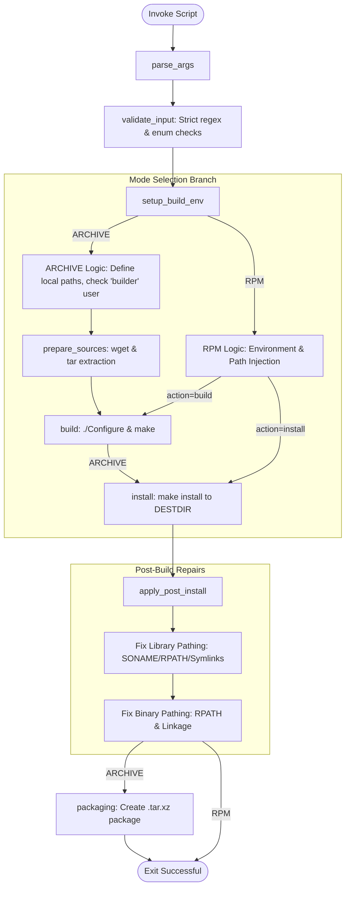

# OpenSSL Unified Build Utility (openssl_build.sh) - Technical Documentation

## 1. Application Overview and Objectives

The `openssl_build.sh` script is a sophisticated Bash-based automation tool designed to orchestrate the compilation, installation, and post-build optimization of OpenSSL. It addresses the challenge of maintaining consistent OpenSSL builds across disparate environments—namely standalone developer workspaces and automated RPM packaging pipelines.

### Core Objectives:
- **Environment Parity**: Ensuring identical build parameters (ciphers, security flags, optimizations) regardless of the deployment method.
- **Side-by-Side Versioning**: Facilitating the installation of specific OpenSSL versions into isolated prefixes (e.g., `/opt/lib/openssl`) without conflicting with the system-provided OpenSSL libraries.
- **Security Hardening**: Enforcing modern security standards through specialized compiler directives and post-build binary metadata modification.
- **Modular RPM Integration**: Supporting decoupled Build and Install phases to comply with advanced RPM packaging standards.

---

## 2. Architecture and Design Choices

### 2.1 Mode-Based Logic Partitioning
The script employs a strict dual-mode architecture (`ARCHIVE` vs. `RPM`) to cleanly separate responsibilities:

- **ARCHIVE Mode**: Operates as a "Full Lifecycle" manager. It is responsible for the build host's state, including downloading source tarballs, managing local build logs, and performing final artifact packaging. It assumes a "Builder" role with specific local filesystem permissions.
- **RPM Mode**: Operates as a "Plugin" to the RPM Build System. It yields control of source management, logging, and certain path metadata to the RPM Spec file. This mode is designed to be "non-destructive" to the host system, operating strictly within the `%{buildroot}` staging area.
- **ALL Mode**: Operates as an orchestrator. It executes the complete standalone build process (ARCHIVE) and, upon completion, automatically triggers `rpmbuild` on the spec file to generate the final RPM packages.

### 2.2 Post-Install Binary Orchestration
Standard OpenSSL builds often fall short when multiple versions are required on a single host. To solve this, the script implements an "After-Install" phase that manually intervenes in the binary metadata:
- **Linker Redirection**: Uses `sed` to update `.pc` (pkg-config) files so that downstream applications correctly link against the custom-named shared objects.
- **Metadata Patching**: Uses `patchelf` to inject specific SONAMEs (e.g., `libssl36.so`) and RPATHs. This ensures that the custom-built `openssl` binary and any linked apps look specifically in the deployment prefix (e.g., `/opt/lib/openssl/lib64`) for their dependencies.

---

## 3. Data Flow and Control Logic

### 3.1 Operational Sequence
The script follows a deterministic execution pipeline orchestrated by a `main` function.




---

## 4. OpenSSL Configuration Directives

The script utilizes a comprehensive set of directives passed to the OpenSSL `Configure` script. These are selected for a balance of security, performance, and feature richness.

| Directive | Type | Technical Purpose |
| :--- | :--- | :--- |
| `--prefix` / `--openssldir` | Path | Sets the logical installation root. Used by OpenSSL to find its config files and certificates at runtime. |
| `-Wl,-Bsymbolic` | Linker | Binds global symbol references within the shared library to their definitions within the same library, improving performance and preventing symbol preemption. |
| `-Wl,-z,relro -Wl,-z,now` | Security | Enables Full RELRO (Relocation Read-Only). This hardens the binary against Global Offset Table (GOT) overwrite attacks. |
| `-Wl,-s` | Linker | Instructs the linker to omit the symbol table from the binary during "atomic" creation. This ensures structural integrity of versioning tags (`.gnu.version`) while minimizing size and hardening the artifact. |
| `zlib` | Feature | Enables compression support for various protocols, utilizing the system zlib library. |
| `enable-ktls` | Performance | **Kernel TLS Support**: Allows encryption/decryption offloading to the kernel (Linux/FreeBSD), significantly improving throughput for large data transfers. |
| `enable-fips` | Security | Builds the FIPS (Federal Information Processing Standards) object module, enabling FIPS 140-2/3 compliance modes. |
| `enable-rfc3779` | Protocol | Adds support for IP Address and AS Identifier extensions in X.509 certificates (useful for BGP security). |
| `-DOPENSSL_PEDANTIC_ZEROIZATION` | Security | Instructs the library to use strict, audited memory zeroization for sensitive data (keys, etc.) immediately after use. |
| `enable-ec_nistp_64_gcc_128` | Optimization | Enables specialized constant-time ECDH implementations for 64-bit systems, providing a major speed boost for Elliptic Curve operations. |
| `shared` | Build | Compiles shared libraries (`.so`) in addition to static ones. Position Independent Code (`-fPIC`) is enforced. |
| `no-tests` | Optimization | Disables the generation and execution of the internal test suite to reduce build time in automated pipelines. |

> **RPATH vs. LD_SO_CONF TECHNICAL NOTE**: 
> The script uses `patchelf --set-rpath "${OPENSSL_BASE}/lib64"` to hardcode the library search path into the binary and shared objects themselves. This makes the build self-sufficient and portable. 
> 
> For **RPM mode**, system-level registration via `/etc/ld.so.conf.d/` is omitted to maintain strict environment isolation. In **ARCHIVE mode**, the configuration file is optionally generated to allow external third-party applications to link against these libraries without needing to manage their own internal RPATH metadata.


---

## 5. Environment & Dependencies

### 5.1 Build-Time Requirements
- **Bash 4.0+**: Essential for modern arrays, `[[ ]]` tests, and `nounset` functionality.
- **patchelf**: Required for modifying ELF binaries (RPATH/SONAME).
- **Toolchain**: `gcc`, `make`, `binutils` (for `readelf`), `sed`, `gzip`, `zlib-devel`.
- **rpm-build**: Required for `rpmbuild` and architecture detection (`rpm --eval`).
- **Network**: Access to `openssl.org` (ARCHIVE mode only).

### 5.2 Required Global Variables (RPM mode)
- `RPM_BUILD_ROOT`: Provided by the RPM build system.
- `OPENSSL_BASE`: The desired final target prefix (defaults to `/opt/lib/openssl`).
- `SSL_ARCH`: The OpenSSL-specific architecture string (e.g., `linux-x86_64`).

---

## 6. Command Line Interface

| Flag | Argument | Description |
| :--- | :--- | :--- |
| `--version=` | `X.Y[.Z]` | The version of OpenSSL to build. The minor version is optional. |
| `--build-mode=`| `ARCHIVE` \| `RPM` \| `ALL` | Determines the operational flow and environment expectations. |
| `--action=` | `build` \| `install` | (RPM Mode only) Decouples the compilation phase from the staging/patching phase. |
| `-h`, `--help` | N/A | Display the usage message and exit. |

---

## 7. Implementation Deep-Dive: The Patching Sequence

The most technical phase of the script occurs in `apply_post_install()`. Below is the step-by-step data sequence:

1.  **Staging Context**: The script enters `BUILD_FOLDER`. All paths are handled relative to this point using a leading `.` (e.g., `cd .${OPENSSL_BASE}`).
2.  **Library Renaming**: Standard OpenSSL naming (`libssl.so.3`) is converted to a custom tagged name (`libssl36.so`).
3.  **Metadata Injection**: 
    - `patchelf --set-soname libssl36.so` is applied to the library.
    - `patchelf --replace-needed libcrypto.so.3 libcrypto36.so` is applied to `libssl36.so` to ensure internal consistency.
4.  **Recursive Patching**: The script iterates through `ossl-modules` and `engines` to repoint their linkages and RPATHs to the isolated library stack.
5.  **RPATH Hardcoding**: Both libraries and the `openssl` binary receive an RPATH pointing to the deployment prefix's `lib64` directory.
6.  **Symlink Creation**: Logical symlinks (e.g., `libssl.so -> libssl36.so`) are created to support standard development linking while maintaining the unique underlying file.

---

## 8. Usage Examples

### Standalone (ARCHIVE Mode)
```bash
# Must be run as 'builder' user. Defaults to /opt/lib/openssl for isolation.
/bin/bash openssl_build.sh --version=3.6.1 --build-mode=ARCHIVE
```

### RPM Spec File Integration (RPM Mode)
This example demonstrates a modern phased implementation within an RPM `.spec` file.

```spec
# --- Spec File Header Snippet ---
%define somajor 36
%define srcprefix /opt/lib/openssl

%build
# 1. Compilation phase
export OPENSSL_BASE=%{srcprefix}
export SSL_ARCH=linux-x86_64
%{SOURCE1} --version=%{version} --build-mode=RPM --action=build

%install
# 2. Staging and metadata patching phase
export OPENSSL_BASE=%{srcprefix}
export SSL_ARCH=linux-x86_64
%{SOURCE1} --version=%{version} --build-mode=RPM --action=install

%files
# The script handles installation into %{buildroot}%{srcprefix}
%{srcprefix}
```

### 8.2 Internal Dependency Resolution
To ensure smooth installation of isolated packages, the accompanying spec file must utilize specialized filters to satisfy custom dependencies without polluting the standard system database:

- **Provides Filtering**: Exclude standard library names via `%global __provides_exclude` (e.g., `^lib(ssl\|crypto)\.so\.[0-9\.]+$`) to prevent system-wide library conflicts.
- **Requires Filtering (Path-Based)**: Uses `%global __requires_exclude_from ^%{srcprefix}/.*$` to prevent the RPM dependency generator from scanning the private library tree for secondary requirements.
- **Requires Filtering (Symbol-Based)**: Uses a regex via `%global __requires_exclude` (e.g., `libcrypto36.*|libssl36.*`) to strip any auto-generated requirements for the custom-named isolated libraries.
- **Manual Provides**: Explicitly declare `Provides: libcrypto%{somajor}.so()(64bit)` in the library subpackage to satisfy internal linkage for applications using the isolated stack.

> **POST-BUILD STRIPPING vs. LINK-TIME STRIPPING TECHNICAL NOTE**:
> Manual stripping with `strip` or `objcopy` failed because those tools post-process a finished ELF binary, recalculating section offsets and re-indexing the string tables to remove symbols. When combined with `-Wl,-Bsymbolic` and custom `RPATHs`, this process often misaligns the **Symbol Versioning Table** (`.gnu.version`), causing the dynamic loader to read null bytes instead of version strings—leading to the `undefined symbol: , version` crash. By using **`-Wl,-s`** during compilation, the linker generates the ELF structure without a symbol table from the start. This "atomic" creation ensures that the internal bindings, versioning tags, and relocation data are perfectly aligned and structurally optimized by the only tool that fully understands the binary's architecture, resulting in a smaller, hardened, and functionally intact artifact.

---

## 9. Implementation of CA-Bundle

To ensure the isolated OpenSSL build is fully functional for TLS verification without relying on host-system certificate stores, the script implements an automated CA-Bundle deployment.

### 9.1 Data Acquisition
The script retrieves the curated `cacert.pem` bundle from the [curl.se](https://curl.se/ca/cacert.pem) upstream repository. This occurs during the `prepare_sources` phase in **ARCHIVE** mode. For **RPM** mode, this file should be provided as a secondary source within the spec file pipeline to maintain offline build reproducibility.

### 9.2 Path Hierarchy & Symbolism
The bundle is installed into the isolated prefix to maintain strict environment decoupling:

| Component | Path | Description |
| :--- | :--- | :--- |
| **Primary Bundle** | `${OPENSSL_BASE}/${TLSDIR}/cert.pem` | The physical source file containing the trusted CA roots. |
| **Legacy Symlink** | `${OPENSSL_BASE}/${TLSDIR}/certs/ca-bundle.crt` | A relative symlink pointing to `../cert.pem` for compatibility with applications expecting a `.crt` extension. |

### 9.3 Technical Rationale
By default, OpenSSL looks for its configuration and certificates in the directory defined by `--openssldir` (mapped to `${OPENSSL_BASE}/${TLSDIR}` in this script). Without a manual bundle injection:
- The isolated `openssl` binary would fail to verify peer certificates unless the user manually passed `-CAfile`.
- Relying on the system-wide `/etc/pki/tls/cert.pem` would break the "Side-by-Side" isolation objective and potentially cause failures in minimal containers or environments with outdated root certificates.
