# Rust Upgrade Automation Tool: Architecture & Operational Manual

This document provides a technical reference and operational guide for `rust_upgrade.sh`, an automated shell script designed to manage Rust toolchain deployments and configure target standard libraries on Linux build environments.

---

## 1. Application Overview and Objectives

The `rust_upgrade.sh` utility automates the acquisition, extraction, installation, and post-install linking of the Rust programming language toolchain and the associated Windows cross-compilation target (`x86_64-pc-windows-gnu`). 

### Core Objectives
* **Consistency**: Standardizes the installed compiler and target library versions across build agents.
* **Flexibility**: Supports two discrete installation targets: global system-wide deployment or prefix-isolated local directory installations.
* **Resiliency**: Implements strict error detection at each state transition (downloads, archive extractions, directory navigation, and install scripts) to prevent partial or corrupted installations.

---

## 2. Architecture and Design Choices

The script is built as a single, self-contained Bash automation file utilizing standard Unix/Linux system utilities.

### Toolchain and Target Packaging Separation
Rust separates host-specific toolchain binaries (`rustc`, `cargo`) from target-specific standard libraries (`rust-std`). The architecture of the script reflects this:
1. It downloads and extracts the host toolchain package (`rust-${VERSION}-${ARCH}-unknown-linux-gnu.tar.xz`).
2. It separately downloads and extracts the target standard library package (`rust-std-${VERSION}-${ARCH}-pc-windows-gnu.tar.xz`).
3. It sequentially runs the vendor-provided `install.sh` executable for each package.

### Installation Target Models

The tool supports two installation modes with distinct system isolation profiles:

| Dimension | SYSTEM Mode (Default) | LOCAL Mode (`--local`) |
| :--- | :--- | :--- |
| **Primary Prefix** | `/usr/local` | `/var/opt/rust` |
| **Binary Linkage** | Direct copy to `/usr/local/bin` | Symbolic links in `/usr/local/bin` pointing to `/var/opt/rust/bin/*` |
| **Directory Owner** | `root:root` | `builder:users` (post-install chown) |
| **Isolation Profile** | Shared (merged with host utilities) | Isolated (confined to a dedicated directory tree) |
| **Target Use Case** | Production builders, containers, clean VM templates | Multi-user development environments, shared hosts |

### Failure Defensiveness
The script uses defensive programming techniques:
* **Null-Safety / Quoting**: All variable references are double-quoted to prevent execution failures on paths containing space characters or unexpected wildcard expansions.
* **Checked Operations**: Directory traversal operations (`cd`, `pushd`, and `popd`) are validated. Failure to enter a directory immediately aborts execution (`|| exit 1`) instead of executing subsequent operations in the wrong folder.
* **Secure Downloads**: Uses `curl -sSfL` to prevent silent HTTP failures (such as `404 Not Found` pages being written as successful output files).

---

## 3. Data Flow and Control Logic

### Operational Flow Diagram

```mermaid
graph TD
    A["Start Script"] --> B{"Check: Is --help or --detect?"}
    B -- "Yes" --> D["Parse arguments"]
    B -- "No" --> C{"Check: Is root user?"}
    C -- "No" --> E["Exit with Error 02"]
    C -- "Yes" --> D
    D --> F{"Check: Help requested?"}
    F -- "Yes" --> G["Show help & Exit 0"]
    F -- "No" --> H{"Check: Detect requested?"}
    H -- "Yes" --> I["Run detection logic & Exit 0"]
    H -- "No" --> J{"Check: Valid flag combination?"}
    J -- "No" --> K["Show error, help & Exit 1"]
    J -- "Yes" --> K2{"Check: Standalone Linters?"}
    K2 -- "Yes" --> LA["Linter Installation / Extraction"]
    K2 -- "No" --> L["Get local rustc version"]
    L --> M{"Check: Upgrade mode?"}
    M -- "AUTO" --> N["Fetch latest stable version from manifest"]
    N --> O["Set RUST_VERSION to latest stable"]
    M -- "VERSION" --> O
    O --> P{"Check: Local == RUST_VERSION?"}
    P -- "No" --> S{"Check: Install directory exists?"}
    P -- "Yes" --> Q{"Check: Is --force specified?"}
    Q -- "Yes" --> S
    Q -- "No" --> R["Print up-to-date message & Exit 0"]
    S -- "No" --> T["Exit with Error 03"]
    S -- "Yes" --> U{"Check: Disk space >= 1GB?"}
    U -- "No" --> V["Exit with Error 08"]
    U -- "Yes" --> W["Clean old downloads"]
    W --> X["Download Linux & Windows archives via curl -sSfL"]
    X --> Y{"Check: Downloads exist and non-empty?"}
    Y -- "No" --> Z["Exit with Error 04"]
    Y -- "Yes" --> AA["Extract tar archives"]
    AA --> AB{"Check: Extraction directories exist?"}
    AB -- "No" --> AC["Exit with Error 06"]
    AB -- "Yes" --> AD["Execute execInstall for Linux Toolchain"]
    AD --> AE["Execute execInstall for Windows target std lib"]
    AE --> AF{"Check: Install Mode?"}
    AF -- "SYSTEM" --> AG["Purge downloaded files & folders"]
    AF -- "LOCAL" --> AH["Generate symlinks in /usr/local/bin"]
    AH --> AG
    AG --> AI["Verify rustc version & target-list"]
    AI --> AJ{"Check: Linters requested?"}
    AJ -- "No" --> AK["End Script"]
    AJ -- "Yes" --> LA
    
    LA --> LA_CHECK{"Check: Archive provided?"}
    LA_CHECK -- "Yes" --> LA_VAL{"Check: Archive valid?"}
    LA_VAL -- "No (missing)" --> LA_ERR10["Exit with Error 10"]
    LA_VAL -- "No (corrupted)" --> LA_ERR11["Exit with Error 11"]
    LA_VAL -- "Yes" --> LA_EXT["Extract precompiled archive"]
    LA_EXT --> LA_EXT_VAL{"Check: Extraction OK?"}
    LA_EXT_VAL -- "No" --> LA_ERR12["Exit with Error 12"]
    LA_EXT_VAL -- "Yes" --> LA_POST{"Check: Install Mode?"}
    
    LA_CHECK -- "No" --> LA_COMP["Check existing and compile linters"]
    LA_COMP --> LA_POST
    
    LA_POST -- "LOCAL" --> LA_SYM["Generate symlinks in /usr/local/bin"]
    LA_POST -- "SYSTEM" --> AK
    LA_SYM --> AK
```



### Execution Sequencing
1. **Informational Bypass Checks**: Detects if `--help` or `--detect` are specified. If so, permits execution as any user (bypassing the root privilege requirements).
2. **Pre-flight Checks**: Confirms uid is `0` (root) for all installation modes.
3. **Argument Parsing and Validation**: Evaluates command-line flags, checks for mutually exclusive options (`--version`, `--auto`, and `--detect`), validates that `--version` has an argument, and handles `--force` and `--help`.
4. **Rust Detection (if `--detect` is used)**: Scans for an active compiler and packages, parsing sysroot targets and components into a formatted report and terminates immediately.
5. **Version Check and Resolution**: Compares the local version with the target version (either explicitly specified via `--version` or auto-detected via the official stable channel manifest). Exits `0` if they match, unless `--force` is specified.
6. **Download & Space Verification**: Validates that at least 1GB of free space is available on the target partition of the installation path, changes directory to `/opt/install`, deletes stale directories, and downloads the packages via `curl`.
7. **Decompression**: Extracts `.tar.xz` archives using `tar -Jxf` and validates the extracted directory structures.
8. **Toolchain & Component Installation**: Invokes `execInstall` sequentially. It passes `--destdir=/var/opt/rust` if `--local` is active.
9. **Linking (Optional)**: If in `LOCAL` mode, traverses `/usr/local/bin` and links all executable targets from `/var/opt/rust/bin/`.
10. **Purge**: Deletes downloaded archives and temporary directories to reclaim disk space.
11. **Verification**: Queries the active `rustc` version and checks target list availability.

---

## 4. Dependencies

The script relies on standard Linux system utilities. The following tools must be present on the host environment:

| Dependency | Purpose | Required Minimum Version |
| :--- | :--- | :--- |
| **bash** | Shell interpreter environment | 4.0+ |
| **curl** | HTTPS file downloading | 7.0+ (supporting SSL/TLS protocols) |
| **tar** | Archive extraction | 1.20+ (with `xz` support / `-J` flag) |
| **unzip** | Zip archive processing | 6.0+ |
| **chown** | Target permissions configuration | Coreutils |
| **ln** | Symbolic link generation | Coreutils |

### Linter Compilation Build Dependencies (Source Compilation Only)

When installing linters by compiling them from source (the default behavior of `--linters` when no precompiled linter archive path is provided), the host system must satisfy the following additional library and compilation dependencies:

| Dependency | Purpose | Red Hat/CentOS/Alma (dnf) | Ubuntu/Debian/Mint (apt) |
| :--- | :--- | :--- | :--- |
| **C compiler** | Compiling intermediate C-bindings (gcc or clang) | `gcc` / `gcc-c++` | `build-essential` |
| **pkg-config** | Locating system library paths for Cargo build scripts | `pkgconf` | `pkg-config` |
| **OpenSSL headers** | Development libraries for TLS/HTTPS networking support | `openssl-devel` | `libssl-dev` |

The script executes early-stage validation checks for these compilation tools before starting source builds, aborting with exit codes `13` (OpenSSL), `14` (C Compiler), or `15` (pkg-config) if any is missing.

> [!IMPORTANT]
> **No Compilation Dependencies for Precompiled Binary Deployments**
>
> If you deploy the linters by extracting a precompiled package (e.g. executing `sudo ./rust_upgrade.sh --linters /opt/done/rust-linters-<version>-<date>-<dist><os_id>-<arch>.tar.xz`), **none of the above compiler or C development libraries are required**. 
> The script will extract the precompiled binaries directly into the sysroot and establish symlinks immediately, avoiding compilation entirely.

---

## 5. Command Line Arguments

The script processes parameters non-positionally:

| Parameter | Type | Description | Default Value | Required |
| :--- | :--- | :--- | :--- | :--- |
| **`--version <version>`** | String | Target Rust toolchain version to install (e.g. `1.96.0`). | *None* | **No** (Either this, `--auto`, or `--detect` must be specified) |
| **`--auto`** | Flag | Auto-detects the latest stable version and upgrades if a new version is available. | *Inactive* | **No** (Either this, `--version`, or `--detect` must be specified) |
| **`--detect [text\|json]`** | Flag + optional arg | Scans the system for an active Rust installation and prints a report listing paths, versions, targets, and toolchain components. The optional argument selects the output format: `text` (default) for a human-readable table; `json` for a machine-readable JSON object. Does **not** require root privileges. | `text` | **No** (Either this, `--version`, or `--auto` must be specified) |
| **`--local`** | Flag | Forces compiler binaries to be installed in `/var/opt/rust` with symbolic link entrypoints, rather than installing to `/usr/local`. | *Inactive* (System Mode) | **No** |
| **`--force`** | Flag | Forces download and installation even if the detected local Rust version matches the target version. | *Inactive* | **No** |
| **`--linters [<fqdn>]`** | String (optional) | Installs Rust code quality tools. If `<fqdn>` is specified, checks and extracts precompiled linter binaries directly from the archive instead of compilation. Otherwise compiles them if not present. Can be **combined** with `--version`/`--auto` **or used standalone**. Requires root. Cannot be combined with `--detect`. | *Inactive* | **No** |
| **`--package-citools [fqdn]`** | String (optional) | Packages all installed linter binaries into a `tar.xz` archive for distribution. Automatically enables `--linters`. If `[fqdn]` is omitted, defaults to `/opt/done/rust-linters-<version>-<date>-<dist><os_id>-<arch>.tar.xz`. | *Inactive* | **No** |
| **`--help, -h`** | Flag | Displays the usage help menu and exits. | *Inactive* | **No** |

---

## 6. Detailed Examples

### Example 1: Global System Installation (Standard Build Server)
Performs a standard upgrade to version `1.96.0` directly under `/usr/local`.
```bash
# Execute as root
sudo ./rust_upgrade.sh --version 1.96.0
```
**Output Log Sample:**
```text
============================ RUST INSTALLER FOR LINUX ========================================

>> 0- Downloading Rust archives: rust-1.96.0-x86_64-unknown-linux-gnu.tar.xz, rust-std-1.96.0-x86_64-pc-windows-gnu.tar.xz

>> 1- Extracting Rust archive: rust-1.96.0-x86_64-unknown-linux-gnu.tar.xz, rust-std-1.96.0-x86_64-pc-windows-gnu.tar.xz

>> 2- Installing Rust version [1.96.0 -> rust-1.96.0-x86_64-unknown-linux-gnu]
...
>> 2- Installing Rust version [1.96.0 -> rust-std-1.96.0-x86_64-pc-windows-gnu]
...
>> 3- SYSTEM mode: Rust binaries are installed in [/usr/local/bin]

>> 4- Purging Rust archives [rust-1.96.0-x86_64-unknown-linux-gnu.tar.xz, rust-std-1.96.0-x86_64-pc-windows-gnu.tar.xz]

Rust installation was successful: rustc 1.96.0 (ac68faa20 2026-05-25)

Supported targets:
x86_64-unknown-linux-gnu
x86_64-pc-windows-gnu
```

### Example 2: Prefix-Isolated Installation (Developer Environment)
Installs version `1.96.0` in `/var/opt/rust` and links executable entrypoints.
```bash
# Execute as root
sudo ./rust_upgrade.sh --version 1.96.0 --local
```
**Resulting System Layout:**
* Binaries reside in: `/var/opt/rust/bin/` (e.g. `/var/opt/rust/bin/rustc`)
* Symlinks generated in: `/usr/local/bin/rustc` -> `/var/opt/rust/bin/rustc`
* Ownership configured to: `builder:users` for the `/var/opt/rust` tree.

### Example 3: Force Reinstallation (Up-to-Date Override)
Forces download and reinstallation even if the target version is already detected as active.
```bash
# Execute as root
sudo ./rust_upgrade.sh --version 1.96.0 --force
```

### Example 4: Rust Installation Detection (Text Format — Default)
Runs in informational mode as any user (no root permissions required) to report current Rust installation status and components.
```bash
./rust_upgrade.sh --detect
# or explicitly:
./rust_upgrade.sh --detect text
```
**Output Sample:**
```text
=============================================================================
                      RUST INSTALLATION DETECTION REPORT
=============================================================================
[1] Core Binaries & Locations
-----------------------------
  rustc path:    /usr/local/bin/rustc
  rustc version: rustc 1.96.0 (ac68faa20 2026-05-25)
  cargo path:    /usr/local/bin/cargo
  cargo version: cargo 1.96.0 (30a34c682 2026-05-25)
  Sysroot path:  /usr/local
  Host target:   x86_64-unknown-linux-gnu

[2] Installed Standard Library Targets
--------------------------------------
  - x86_64-unknown-linux-gnu
  - x86_64-pc-windows-gnu

[3] Installed Toolchain Components
----------------------------------
  - rustc
  - cargo
  - rust-std
  - rustfmt-preview
  - clippy-preview

[4] Code Quality & Linter Tools
-------------------------------
  Tool                   Status          Version
  ----                   ------          -------
  cargo-audit            Not Installed   -
  cargo-bloat            Not Installed   -
  cargo-deny             Not Installed   -
  cargo-geiger           Not Installed   -
  cargo-machete          Not Installed   -
  cargo-nextest          Not Installed   -
  cargo-outdated         Not Installed   -
  cargo-semver-checks    Not Installed   -
  cargo-tarpaulin        Not Installed   -
  cargo-udeps            Not Installed   -
  clippy                 Installed       0.1.96 (ac68faa20c 2026-05-25)
  rust-analyzer          Installed       1.96.0 (ac68faa 2026-05-25)
  rustfmt                Installed       1.9.0-stable (ac68faa20c 2026-05-25)
=============================================================================
```

### Example 5: Rust Installation Detection (JSON Format)
Returns a machine-readable JSON object — ideal for CI pipelines, monitoring scripts, or tooling that needs to parse Rust installation metadata programmatically.
```bash
./rust_upgrade.sh --detect json
```
**Output Sample:**
```json
{
  "status": "found",
  "rustc": {
    "path": "/usr/local/bin/rustc",
    "version": "rustc 1.96.0 (ac68faa20 2026-05-25)"
  },
  "cargo": {
    "path": "/usr/local/bin/cargo",
    "version": "cargo 1.96.0 (30a34c682 2026-05-25)"
  },
  "sysroot": "/usr/local",
  "host_target": "x86_64-unknown-linux-gnu",
  "std_targets": [
    "x86_64-unknown-linux-gnu",
    "x86_64-pc-windows-gnu"
  ],
  "toolchain_components": [
    "rustc",
    "cargo",
    "rust-std",
    "rustfmt-preview",
    "clippy-preview"
  ],
  "linters": {
    "cargo-audit": "not_installed",
    "cargo-bloat": "not_installed",
    "cargo-deny": "not_installed",
    "cargo-geiger": "not_installed",
    "cargo-machete": "not_installed",
    "cargo-nextest": "not_installed",
    "cargo-outdated": "not_installed",
    "cargo-semver-checks": "not_installed",
    "cargo-tarpaulin": "not_installed",
    "cargo-udeps": "not_installed",
    "clippy": "installed",
    "rust-analyzer": "installed",
    "rustfmt": "installed"
  },
  "linter_details": {
    "cargo-audit": {
      "status": "not_installed",
      "version": "-"
    },
    "cargo-bloat": {
      "status": "not_installed",
      "version": "-"
    },
    "cargo-deny": {
      "status": "not_installed",
      "version": "-"
    },
    "cargo-geiger": {
      "status": "not_installed",
      "version": "-"
    },
    "cargo-machete": {
      "status": "not_installed",
      "version": "-"
    },
    "cargo-nextest": {
      "status": "not_installed",
      "version": "-"
    },
    "cargo-outdated": {
      "status": "not_installed",
      "version": "-"
    },
    "cargo-semver-checks": {
      "status": "not_installed",
      "version": "-"
    },
    "cargo-tarpaulin": {
      "status": "not_installed",
      "version": "-"
    },
    "cargo-udeps": {
      "status": "not_installed",
      "version": "-"
    },
    "clippy": {
      "status": "installed",
      "version": "0.1.96 (ac68faa20c 2026-05-25)"
    },
    "rust-analyzer": {
      "status": "installed",
      "version": "1.96.0 (ac68faa 2026-05-25)"
    },
    "rustfmt": {
      "status": "installed",
      "version": "1.9.0-stable (ac68faa20c 2026-05-25)"
    }
  }
}
```
**Not-found response (JSON):**
```json
{
  "status": "not_found",
  "message": "No active Rust installation detected in PATH or standard location."
}
```

### Example 6: Install with Code Quality Tools
Installs Rust and immediately follows up with the full linter suite. Can be combined with `--version` or `--auto`, and optionally with `--local`.
```bash
# Specific version + linters (system-wide)
sudo ./rust_upgrade.sh --version 1.96.0 --linters

# Auto-detect latest + linters (local prefix)
sudo ./rust_upgrade.sh --auto --local --linters
```

### Example 7: Standalone Linter Installation
Adds code quality tools to an **existing** Rust installation without downloading or modifying the compiler. Useful when Rust is already at the desired version and you just want to layer in the linting suite.
```bash
# Option A: Compile and install linters from source (default)
sudo ./rust_upgrade.sh --linters

# Option B: Extract and install precompiled linters from a tar.xz distribution archive
sudo ./rust_upgrade.sh --linters /opt/done/rust-linters-1.96.0-20260601-el9-x86_64.tar.xz
```
**Note:** `--linters` standalone is **incompatible** with `--detect`. If `--version` or `--auto` is also specified, the full install pipeline runs first and linters are applied after.

> For a complete description of every tool installed, see [Section 7 — Code Quality Tools Reference](#7-code-quality-tools-reference).


### Example 8: Packaging Linter Binaries
Runs the linter verification/installation loop and packages all installed linter binaries into a `.tar.xz` distribution archive under `/opt/done`.
```bash
# Packaging with the default filename (rust-linters-<version>-<date>-<dist><os_id>-<arch>.tar.xz)
sudo ./rust_upgrade.sh --package-citools

# Packaging with a custom archive filename
sudo ./rust_upgrade.sh --package-citools custom-linter-distribution.tar.xz
```

### CI/CD and Production Deployment Best Practices

To achieve fast, reproducible linter deployments across multiple build agents of the same OS platform without compiling them from source on each machine:

1. **Initialize the Master Build Agent**:
   Compile and install the Rust toolchain along with the linter suite and package them into a redistributable archive:
   ```bash
   sudo /opt/scripts/rust_upgrade.sh --auto --package-citools
   ```
   This auto-detects the stable compiler, builds the 12 code quality linters, and packages them to `/opt/done/rust-linters-<version>-<date>-<dist><os_id>-<arch>.tar.xz`.

2. **Deploy Subordinate Build Agents**:
   Distribute the generated archive to target servers and extract it directly into their Rust paths, avoiding compilation time or external dependency fetches:
   ```bash
   sudo /opt/scripts/rust_upgrade.sh --auto --linters /opt/done/rust-linters-<version>-<date>-<dist><os_id>-<arch>.tar.xz
   ```

---

## 7. Code Quality Tools Reference

This section is the authoritative reference for every tool installed by `--linters`, organized by category. These tools collectively cover the full code quality lifecycle from security scanning to binary size profiling.

---

### 7.0 Tool Summary

| Tool | Category | Type | Purpose |
| :--- | :--- | :--- | :--- |
| **clippy** | Linting | Toolchain component | Canonical Rust linter — detects correctness, style, and idiomatic issues |
| **rustfmt** | Formatting | Toolchain component | Official Rust code formatter |
| **rust-analyzer** | Code Analysis | Toolchain component | Real-time IDE diagnostics, autocomplete, and code intelligence |
| **cargo-audit** | Security | Cargo tool | Audits `Cargo.lock` against the RustSec advisory database for known vulnerabilities |
| **cargo-deny** | Security | Cargo tool | Enforces license, duplicate dependency, and advisory policies across the workspace |
| **cargo-geiger** | Analysis | Cargo tool | Detects and counts uses of `unsafe` Rust in crates and their dependencies |
| **cargo-machete** | Analysis | Cargo tool | Detects unused dependencies in `Cargo.toml` (stable, no nightly required) |
| **cargo-semver-checks** | Analysis | Cargo tool | Detects semver-breaking API changes between versions |
| **cargo-tarpaulin** | Coverage | Cargo tool | Generates LCOV/HTML code coverage reports (Linux only) |
| **cargo-nextest** | Testing | Cargo tool | Parallel test runner with JUnit XML output for CI pipelines |
| **cargo-bloat** | Performance | Cargo tool | Analyzes what is consuming space in compiled binaries |
| **cargo-outdated** | Performance | Cargo tool | Reports crate dependencies that have newer versions available |
| **cargo-udeps** | Analysis | Cargo tool | Unused dependency detection (run with `RUSTC_BOOTSTRAP=1`) |

> **Note:** Individual tool failures during `--linters` are non-fatal. The script reports a warning for any tool that cannot be installed and continues to the next one.

---

### 7.1 Linting & Formatting

These tools enforce code correctness and style at the language level. They ship as official Rust toolchain components and are added via `rustup component add`.

#### clippy
- **Type:** Toolchain component
- **Install:** `rustup component add clippy`
- **Objective:** Catch correctness bugs, performance anti-patterns, and non-idiomatic code before compilation errors surface.
- **Description:** Clippy is the official, community-maintained Rust linter with over 700 configurable lint rules grouped into categories: `correctness`, `style`, `complexity`, `perf`, `pedantic`, `nursery`, and `cargo`. Rules can be suppressed per-item with `#[allow(...)]` or configured project-wide via `clippy.toml`. Clippy is integrated into `cargo clippy` and should be run as part of every CI pipeline check.

#### rustfmt
- **Type:** Toolchain component
- **Install:** `rustup component add rustfmt`
- **Objective:** Enforce a consistent, authoritative code style across the entire codebase automatically.
- **Description:** rustfmt formats Rust source code according to the official Rust Style Guide. It is deterministic and idempotent — formatting a formatted file produces no changes. Style rules are configurable via `rustfmt.toml`. Run with `cargo fmt` for workspace-wide formatting, or `cargo fmt --check` in CI to fail on unformatted code.

#### rust-analyzer
- **Type:** Toolchain component
- **Install:** `rustup component add rust-analyzer`
- **Objective:** Provide a fast, state-of-the-art language server for IDE features, autocompletion, compile errors/warnings, and semantic code navigation.
- **Description:** `rust-analyzer` is the official compiler frontend and Language Server Protocol (LSP) implementation for Rust. It parses source code to provide real-time compilation warnings, inline type hints, syntax checking, code formatting, refactoring actions, and code navigation (e.g. go to definition). It is widely integrated into modern IDEs (VS Code, Neovim, IntelliJ) and AI coding agents.

---

### 7.2 Security

These tools identify known vulnerabilities and policy violations in your dependency graph before they reach production.

#### cargo-audit
- **Type:** Cargo tool
- **Install:** `cargo install cargo-audit`
- **Objective:** Identify crates in `Cargo.lock` that have published security advisories in the [RustSec Advisory Database](https://rustsec.org/).
- **Description:** `cargo audit` fetches the RustSec advisory database and cross-references every locked dependency against known CVEs and security advisories. It reports vulnerability severity, affected version ranges, and patched versions. Supports output as JSON for automated pipelines. Should be run regularly and as a mandatory CI gate before any release build.

#### cargo-deny
- **Type:** Cargo tool
- **Install:** `cargo install cargo-deny`
- **Objective:** Enforce workspace-wide policies on licenses, banned crates, duplicate dependencies, and security advisories via a declarative configuration file.
- **Description:** `cargo deny` checks four policy categories: `licenses` (ensure all dependencies use approved SPDX licenses), `bans` (reject specific crates or versions), `advisories` (RustSec-based, like cargo-audit), and `sources` (restrict allowed crate registries). Configured via `deny.toml`. Highly recommended for any project with compliance or supply-chain security requirements.

---

### 7.3 Static Analysis

These tools perform deep structural analysis of your code and dependency graph to surface hidden quality issues.

#### cargo-geiger
- **Type:** Cargo tool
- **Install:** `cargo install cargo-geiger`
- **Objective:** Quantify the `unsafe` Rust surface area across your entire dependency tree to assess risk.
- **Description:** `cargo geiger` recursively scans all crates in your workspace and dependency graph, counting the number of `unsafe` functions, expressions, traits, and implementations in each. It produces a hierarchical report categorizing crates as `safe` (zero unsafe), `unsafe` (contains unsafe code), or `forbids-unsafe` (has `#![forbid(unsafe_code)]`). Essential for security audits and for enforcing memory-safety policies.

#### cargo-machete
- **Type:** Cargo tool
- **Install:** `cargo install cargo-machete`
- **Objective:** Detect dependencies declared in `Cargo.toml` that are never actually used in source code.
- **Description:** `cargo machete` performs static string-matching analysis on your Rust source files to identify `[dependencies]` entries that are not referenced by any `use`, `extern crate`, or feature flag. It runs on the stable toolchain, is extremely fast, and produces zero false positives for common patterns. Ideal for keeping the dependency tree lean and reducing compile times. Compare with `cargo-udeps` for a more thorough alternative.

#### cargo-semver-checks
- **Type:** Cargo tool
- **Install:** `cargo install cargo-semver-checks`
- **Objective:** Automatically detect breaking changes in public Rust APIs between releases to prevent accidental semver violations.
- **Description:** `cargo semver-checks` compares the public API of the current crate version against the previously published version on crates.io (or a locally specified baseline). It flags changes that are breaking under semver rules — removed functions, changed signatures, removed trait impls, etc. — even when the compiler itself does not catch them. Integrates cleanly into release CI pipelines with `cargo semver-checks check-release`.

#### cargo-udeps
- **Type:** Cargo tool
- **Install:** `cargo install cargo-udeps` (installed directly on stable)
- **Objective:** Detect unused dependencies with full compile-time accuracy.
- **Description:** `cargo udeps` checks your crate tree for unused dependencies. While it normally requires a nightly compiler, it can be run on the stable compiler by prefixing the command with `RUSTC_BOOTSTRAP=1` (e.g. `RUSTC_BOOTSTRAP=1 cargo udeps`), making a nightly toolchain or `rustup` completely unnecessary. It catches cases that static analysis tools like `cargo-machete` might miss (such as proc-macro usage).

---

### 7.4 Code Coverage

#### cargo-tarpaulin
- **Type:** Cargo tool
- **Install:** `cargo install cargo-tarpaulin`
- **Platform:** Linux only (uses `ptrace`)
- **Objective:** Measure how much of your source code is actually executed by your test suite.
- **Description:** `cargo tarpaulin` instruments your binary and runs tests, tracking which source lines are hit. It generates reports in multiple formats: plain text (console), LCOV (for integration with coverage dashboards like Codecov or SonarQube), Cobertura XML (Jenkins), and HTML. Particularly useful for identifying untested code paths in complex parsing or error-handling logic. Run with `cargo tarpaulin --out Html --output-dir ./coverage/`.

---

### 7.5 Testing

#### cargo-nextest
- **Type:** Cargo tool
- **Install:** `cargo install cargo-nextest`
- **Objective:** Replace `cargo test` with a faster, more informative test runner designed for CI environments.
- **Description:** `cargo nextest` runs each test in its own process (improving isolation and crash recovery), executes tests in parallel with configurable thread pools, and produces clean, color-coded output. It supports **JUnit XML output** (`--profile ci`) for direct integration with Jenkins, GitHub Actions, and GitLab CI test result parsers. It is a drop-in replacement: `cargo nextest run` instead of `cargo test`. Typically 1.5×–3× faster than the built-in test runner on multi-core build machines.

---

### 7.6 Performance & Dependency Management

#### cargo-bloat
- **Type:** Cargo tool
- **Install:** `cargo install cargo-bloat`
- **Objective:** Identify which functions and crates contribute most to the final binary size.
- **Description:** `cargo bloat` analyzes the compiled binary's symbol table and reports the largest contributors to binary size by function, crate, or section. Run with `cargo bloat --release` for production binaries, or `cargo bloat --release --crates` for a per-crate summary. Especially useful in this environment for monitoring the size of the cross-compiled `leanctx` Windows binary (`cargo bloat --release --target x86_64-pc-windows-gnu`).

#### cargo-outdated
- **Type:** Cargo tool
- **Install:** `cargo install cargo-outdated`
- **Objective:** Report which crate dependencies have newer versions available on crates.io.
- **Description:** `cargo outdated` queries the crates.io registry and compares current `Cargo.toml` version constraints against the latest compatible and absolute latest releases. It highlights dependencies that are behind the latest SemVer-compatible release (`--depth 1`) as well as transitive dependencies (`--root-deps-only` to scope to direct deps). Useful for scheduled dependency refresh cycles and for ensuring the project is not accumulating security debt through outdated transitive dependencies.

