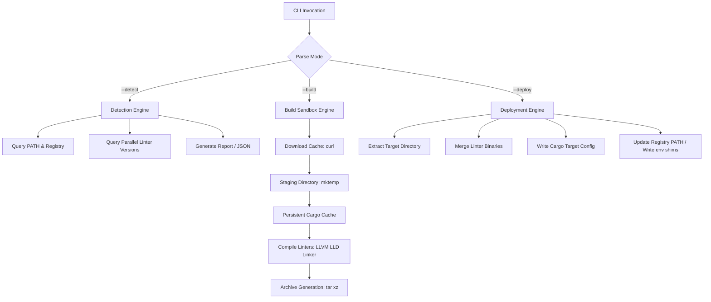
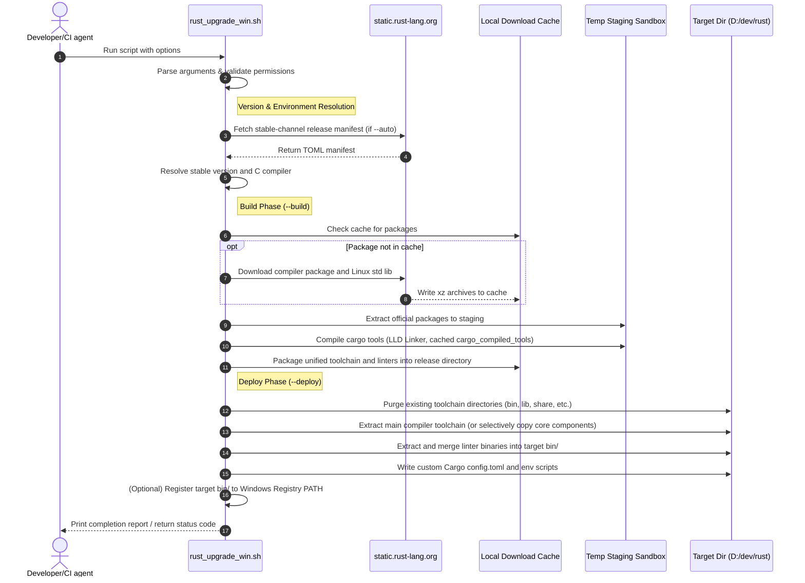

# Architecture Reference: Rust Windows Toolchain & Linter Automation

This document provides a detailed architectural specification and user guide for `rust_upgrade_win.sh`, a unified bash utility designed to automate the build, packaging, deployment, and detection of a customized Rust compilation toolchain on Windows environments utilizing Cygwin or MSYS2.

---

## 1. Application Overview and Objectives

The primary objective of `rust_upgrade_win.sh` is to manage the lifecycle of a corporate Rust development toolchain targeting both Windows (`x86_64-pc-windows-gnu`) and Linux (`x86_64-unknown-linux-gnu`) environments. It ensures that developers and CI/CD agents operate with identical compiler versions and pre-configured static analysis (linter) suites.

### Core Objectives:
*   **Version Standardization:** Automated retrieval and compilation of stable Rust compilers directly from the official manifest channels.
*   **Linter Bundling:** Automatic compilation and packaging of high-priority static analysis and security tools into a single linter archive.
*   **Dual-Target Support:** Configures the Windows host toolchain with the Linux target standard libraries, enabling seamless cross-compilation from Windows to Linux.
*   **Zero-Configuration Environment:** Automatically generates runtime shims (`env.sh`, `env.bat`) and Cargo target link configurations (`config.toml`) to bootstrap developer workstations without manual intervention.

---

## 2. Architecture and Design Choices

The utility is structured as a monolithic shell script that coordinates system-level processes, compilers, and archive utilities. It divides its behavior into isolated, modular phases (Detect, Build, Package, Deploy) governed by defensive shell execution settings (`set -euo pipefail`).



### 2.1. Performance and Efficiency Optimizations
To achieve optimal execution speeds under Windows file systems (NTFS) and shell emulation layers (Cygwin/MSYS2), several architectural performance patterns are utilized:

1.  **LLVM Linker (LLD) Optimization & Auto-Copying:**
    *   Linking is historically the slowest step of Cargo compilation on Windows.
    *   During linter compilation, the script dynamically scans the resolved GCC installation and the host `PATH` for the LLVM linker (`ld.lld.exe`).
    *   If missing or broken (fails `--version` validation), it automatically copies the actual `rust-lld.exe` binary from the active Rust toolchain's private `bin` folder and saves it as `ld.lld.exe` in the C compiler directory.
    *   Additionally, the script automatically replaces the linter wrapper inside the sandboxed staging directory with the real `rust-lld.exe` binary to prevent relative path lookup errors during bootstrapped Cargo builds.
    *   If found or successfully copied, it appends `-C link-arg=-fuse-ld=lld` to `RUSTFLAGS` (preserving any existing flags), replacing the default GNU linker (`ld.exe`) with the high-performance LLD linker.
2.  **Persistent Compiler Download Cache:**
    *   The script routes all package downloads (such as standard library archives) to a persistent cache directory (`${SYS_TMP_DIR}/devops/downloads`).
    *   By passing the `-C -` (continue) flags to `curl`, it natively supports resuming partially downloaded archives and avoids re-downloading packages across runs.
    *   This path can be customized by setting the `RUST_DOWNLOAD_CACHE_DIR` environment variable.
3.  **Persistent Cargo Build Cache:**
    *   Normally, sandboxed Cargo builds download registry indexes and package dependencies from scratch.
    *   This script redirects `CARGO_HOME` to a persistent directory (`${SYS_TMP_DIR}/devops/cargo_cache`), allowing Cargo to reuse package indexes and downloads, cutting build initialization times.
    *   This path can be customized by setting the `RUST_CARGO_CACHE_DIR` environment variable.
4.  **Persistent Compiled Tools Cache (cargo_compiled_tools):**
    *   Compiling all linters from source can take over an hour. The script implements a persistent build cache at `${SYS_TMP_DIR}/devops/cargo_compiled_tools`.
    *   Cargo compiles and installs binaries directly to this cache. On subsequent runs, Cargo natively detects that the tool is up-to-date (taking less than a second) and copies/hard-links the cached binary to the active staging area, avoiding redundant compilations.
    *   This path can be customized by setting the `RUST_PERSISTENT_TOOLS_DIR` environment variable.
5.  **Process-Optimized Detection Engine:**
    *   Process spawning (forking) is extremely slow in Windows shell emulation environments.
    *   During `--detect`, linter version queries are run in parallel background subshells.
    *   Instead of calling heavy POSIX external commands like `head`, `tr`, and `sed` to slice strings, the script parses version outputs using 100% native Bash builtins (such as `read -r` and regex pattern matching `BASH_REMATCH`), reducing process spawns by over 80%.
6.  **LTO and Parallel Codegen Acceleration (`--no-lto`):**
    *   Compiling large Rust tools in release mode defaults to single-threaded code generation and expensive Link-Time Optimization (LTO) to produce highly optimized binaries.
    *   Passing the `--no-lto` flag overrides these defaults by exporting `CARGO_PROFILE_RELEASE_LTO="false"` and `CARGO_PROFILE_RELEASE_CODEGEN_UNITS=256` in the environment.
    *   This forces the compiler to parallelize code generation across all CPU cores and skip the slow LTO phase, reducing `rustc` compilation times by up to 50% with minimal runtime speed impact.

### 2.2. Architectural Assumptions
*   **MinGW-w64 GCC Runtime:** The host compiler must target `x86_64-pc-windows-gnu` and requires a working MinGW-w64 C compiler (`gcc.exe`) to link native libraries. MSVC toolchains are not supported.
*   **Posix-like Environment:** The host must execute the script via `bash` inside Cygwin or MSYS2. Native Command Prompt or PowerShell script execution is not supported.

### 2.3. Edge Case Mitigation and Error Defensiveness
*   **GNU Tar Colon Bug (`--force-local`):**
    *   GNU `tar` interprets colons in paths (e.g. `f:/stage`) as remote tape drives/hosts.
    *   To prevent extraction failures when handling Windows-style paths, the script appends `--force-local` to all `tar` compress/decompress calls.
*   **Staged Deployment Extraction (Atomic-style deploys):**
    *   To prevent leaving the toolchain in a corrupt, non-functional state on extraction failures, the script extracts the archive into a temporary staging folder first. Old folders are only removed, and new folders moved into place, if the extraction successfully completes.
*   **Smart Cargo Config Merging:**
    *   If a `.cargo/config.toml` already exists in your target directory, the script parses it and appends the Linux target cross-compilation config instead of skipping the file entirely or overwriting it, preserving existing custom configurations.
*   **Force Compilation Override (`--force`):**
    *   If `--force` is specified during Build Mode, the script ignores any auto-discovered precompiled linter packages in the build directory, forcing Cargo to rebuild all code-quality tools from source.
*   **Cygwin cygpath Empty-Input Safeguard:**
    *   By default, calling `cygpath` with an empty string returns `.` (current directory), which could cause accidental folder operations.
    *   The path helper wrappers (`to_win_path`, `to_unix_path`, `to_mixed_path`) are guarded to immediately return `""` on empty inputs.
*   **Registry PATH Duplicate Prevention:**
    *   Persistent registry updates are guarded to normalize path separators, strip trailing slashes, and compare folder paths case-insensitively, avoiding duplicate entries in Windows Registry variables.
*   **Destructive Deletion Safeguard & Fast Deletion (`safe_delete`):**
    *   Replaces generic `rm -rf` commands. It checks that inputs are non-empty, do not equal `/`, and do not match physical or virtual drive roots (`C:`, `/cygdrive/d`, etc.), halting with exit code `99` on violation.
    *   Uses native Windows `cmd.exe //c rmdir //s //q` in the background for directory removal, preceded by an instantaneous filesystem rename (`mv -f --`) to free the build path instantly.
    *   Addresses Windows CLI parsing bugs by stripping trailing slashes before translation to avoid escaped quote (`\"`) errors, and adds the POSIX option terminator (`--`) to protect against paths starting with a hyphen.
    *   Shielded with `|| true` exit-status protection to ensure file locking errors do not abort script EXIT cleanup traps.

---

## 3. Data Flow and Control Logic

### 3.1. Operational Data Flow Sequence
The operational control sequence varies depending on the operational mode:



### 3.2. Script Execution Logic Flow
1.  **Initialization:** Define path helpers, trap registration (`cleanup` for temporary directories), and global constants.
2.  **Argument Parsing:** Match options via a loop. Windows paths (such as `d:/dev/rust`) are captured in their native forward-slash format.
3.  **Permissions Check:** If system PATH updates are requested, query `net session` to confirm Administrator privileges.
4.  **Stable Version Resolution:** If `--auto` is active, fetch the official Rust release channel file via `curl` and parse out the stable version (e.g., `1.97.0`).
5.  **Up-to-Date Verification:** Query the local target compiler (`rustc --version`). If versions match, and no linter installations or force flags are specified, exit early with status `0`.
6.  **Build Mode Execution:**
    *   Verify the C compiler path using `resolve_cc`.
    *   Download toolchain components via `curl` to the persistent downloads folder.
    *   Assemble compiler components in a sandboxed staging directory.
    *   Overwrite the sandboxed LLD forwarding wrapper inside the sandbox with the real `rust-lld.exe` binary to ensure linker compatibility during build.
    *   Prepend the compiler binaries to the environment `PATH` to bootstrap Cargo.
    *   Execute Cargo builds for each linter, pulling binaries from the persistent tools cache if already compiled. Any compiler tool installation failure is treated as a hard error (`exit 15`).
    *   Compress the compiled linters to a standalone archive, or merge them directly with the compiler components into a single unified deployment bundle.
7.  **Deployment Mode Execution:**
    *   Extract the toolchain archive into a temporary staging folder first (`exit 16` if extraction fails).
    *   (Optional) If `--core-components` is enabled, filter and strip optional components inside the staging folder.
    *   Purge existing folders (`bin`, `lib`, `share`, `etc`, `libexec`) under the target directory, and move the staged folders into place.
    *   (Optional) If `--linters` is specified, locate the matching linter archive in the pending folder, decompress it, and merge its binaries into the target `bin/` folder.
    *   Generate or update your Cargo `config.toml` to force `rust-lld` as the linker for Linux targets (appending if the file already exists).
    *   Configure path variables: Update the Windows Registry scope (`User` or `Machine`), or generate local sourceable scripts (`env.sh` and `env.bat`).

---

## 4. Dependencies

The script relies on standard tools and system shells. It is designed to run in lightweight Windows shell environments without requiring heavyweight Unix virtual machines.

### 4.1. Core Utilities & Shell
*   **Shell:** `bash` (compatible with Bash 4.0 or higher).
*   **Path Converter:** `cygpath` (must be available in the shell path).
*   **Downloader:** `curl` (compiled with SSL/TLS support).
*   **Archive Tools:** `tar` (GNU tar supporting `-I` or `--use-compress-program`), `xz` (supporting multi-threaded `-T0` flags).
*   **Text Processing:** `awk`, `grep`, `sed`.
*   **Directory Monitoring:** `df` (POSIX compatible).

### 4.2. Host Toolchain Dependencies
*   **C Compiler:** A MinGW-w64 GCC implementation (e.g. WinLibs GCC or MSYS2 Mingw-w64). Must target native Windows thread models (UCRT or MSVCRT).
*   **System API Interface:** `powershell.exe` (must be accessible from the shell to query and write Windows Registry environment variables).

> [!NOTE]
> The C compiler search order prioritizes active environment configurations:
> 1. CLI specified compiler path (`--cc`).
> 2. `CC` environment variable.
> 3. System `PATH` (`command -v`).
> 4. Hardcoded fallback directory locations (such as `d:/dev/mingw64/bin/gcc.exe`).

---

## 5. Security Assessment

This section details the security controls, boundary assumptions, and access constraints implemented by the application.

### 5.1. Encryption in Transit
*   **Mechanism:** All downloads (including compiler packages and release manifests) are conducted via HTTPS.
*   **Control:** `curl` is invoked with security options (`-sSfL`), enforcing TLS 1.2 or TLS 1.3 protocol validation. Cert validation is handled natively by the shell environment's CA certificate bundle.

### 5.2. Secrets Management
*   **Control:** The application is entirely self-contained. It contains no hardcoded API keys, passwords, private keys, or credentials.
*   **Integrity:** All packages are obtained from public, verified upstream mirrors (`static.rust-lang.org`).

### 5.3. Authentication and Privilege Escalation
*   **Boundary:** By default, the script executes in an unprivileged user context.
*   **User Account Control (UAC):** If `--path-update system` is specified, the script attempts to write to the local system registry (`HKLM\System\CurrentControlSet\Control\Session Manager\Environment`). The script validates administrative privileges at startup via `net session` and aborts early if privileges are insufficient, preventing partial/corrupted configurations.

### 5.4. RBAC and System Access
*   **Least Privilege:** Developers can install, build, and deploy the entire toolchain to user directories (e.g., `D:/dev/rust`) and update their local environment path (`--path-update user` or `script`) without requiring Administrator privileges.
*   **Write Restriction:** System-level modifications are isolated exclusively to appending the compiler's `bin/` path to the Registry. The script does not modify system files or change registry permissions.

---

## 6. Command Line Arguments

The script parsing logic processes the following CLI parameters:

| Parameter | Type | Default Value | Description |
| :--- | :--- | :--- | :--- |
| `--build` | Flag | `false` | Enables Build Mode. Packages compiler and compiles linter tools. |
| `--deploy` | Flag | `false` | Enables Deploy Mode. Installs compiler and linters to target directory. |
| `--detect` | String | `text` | Enables Detection Mode. Evaluates compiler, target, and linter versions. Options: `text` or `json`. |
| `--linters` | String | (Optional Path) | Installs linters. In Deploy mode, omitting the path triggers auto-discovery of the newest matching archive. |
| `--package-citools` | String | (Optional Path) | Packages compiled linter binaries into a standalone `tar.xz` archive. |
| `--version` | String | `""` | Manually specifies the target Rust version (e.g., `1.97.0`). |
| `--auto` | Flag | `false` | Auto-detects the latest stable Rust version from the official manifest. |
| `--cc` | String | `""` | Overrides the C compiler path (e.g., `d:/dev/mingw64/bin/gcc.exe`). |
| `--path-update` | String | `none` | Updates PATH variable. Options: `none`, `user`, `system`, `script`. |
| `--target-dir` | String | `d:/dev/rust` | Target directory for installation and deployment. |
| `--build-dir` | String | `f:/stage/upload/pending` | Output directory for built package archives. |
| `--archive-path` | String | `""` | Path to a custom toolchain package archive to deploy. |
| `--force` | Flag | `false` | Forces build/deploy actions even if versions match, and forces linter recompilation from source (ignoring cached archives). |
| `--core-components` | Flag | `false` | Limits deployment strictly to core compiler binaries and libraries (excludes docs). |
| `--no-lto` | Flag | `false` | Disables Link-Time Optimization (LTO) and forces 256 parallel codegen units to speed up Cargo compilation times. |
| `--log` | String | `""` | Redirects script output to the specified log file path. |

---

## 7. Operational Walkthroughs and Execution Logs

This section provides representative command executions and output logs for standard deployment and detection tasks.

### 7.1. Unified Deployment Command
This command auto-detects the stable Rust version, pulls the corresponding compiler and linter archives from the pending folder, cleans out the target directory, extracts the toolchain, merges the linters, and generates local environment setup shims.

```bash
./rust_upgrade_win.sh --deploy --auto --linters --path-update script
```

#### Representative Console Output:
```
>> Auto-detecting latest stable Rust version...
Latest Stable Rust Version: 1.97.0

>> Dynamically searching for latest linter archive...
   Resolved to: F:/stage/upload/pending/rust-linters-1.97.0-20260710-win-x86_64.tar.xz

=========================================================================
                        RUST WINDOWS DEPLOY MODE
=========================================================================
>> 1. Verifying target directory: D:/dev/rust

>> 2. Purging old installation files...

>> 3. Extracting toolchain files...
   Default Cargo config created to enable rust-lld linker for Linux cross-compilation.

>> 4. Configuring environment options...
   Generating setup shims in target folder...
   Scripts created: [env.sh] and [env.bat] under D:/dev/rust.

>> Deployment Complete!
   Rust compiler version: rustc 1.97.0 (2d8144b78 2026-07-07)

=========================================================================
                  RUST ENVIRONMENT VARIABLES CONFIGURATION
=========================================================================
 To configure Rust globally on this machine, add the following variables:

 1. User Environment Variables (Recommended - no Admin required):
    [PATH]        -> Add "D:\dev\rust\bin"
    [CARGO_HOME]  -> "D:\dev\rust\.cargo"

 2. System Environment Variables (Global - Administrator required):
    [PATH]        -> Add "D:\dev\rust\bin"
    [CARGO_HOME]  -> "D:\dev\rust\.cargo"
=========================================================================

>> Extracting precompiled linter binaries from [f:/stage/upload/pending/rust-linters-1.97.0-20260710-win-x86_64.tar.xz]...
   OK
```

### 7.2. System Detection Report Command
This command runs the optimized parallel detection routine and outputs a summary of the compiler, targets, installed components, and static analysis tools.

```bash
./rust_upgrade_win.sh --detect
```

#### Representative Console Output:
```
=========================================================================
                 RUST WINDOWS INSTALLATION DETECTION REPORT
=========================================================================
[1] Locations & Core Versions
  rustc path:    D:/dev/rust/bin/rustc.exe
  rustc version: rustc 1.97.0 (2d8144b78 2026-07-07)
  cargo path:    D:/dev/rust/bin/cargo.exe
  cargo version: cargo 1.97.0 (c980f4866 2026-06-30)
  Sysroot path:  D:/dev/rust
  Host target:   x86_64-pc-windows-gnu
  C compiler:    /cygdrive/d/dev/mingw64/bin/gcc.exe
  CC version:    gcc.exe (MinGW-W64 x86_64-ucrt-posix-seh, built by Brecht Sanders, r3) 16.1.0

[2] Target Standard Libraries
  - x86_64-pc-windows-gnu
  - x86_64-unknown-linux-gnu

[3] Installed Toolchain Components
  - cargo
  - clippy-preview
  - llvm-bitcode-linker-preview
  - llvm-tools-preview
  - rust-analysis-x86_64-pc-windows-gnu
  - rust-analyzer-preview
  - rustc
  - rust-docs
  - rust-docs-json-preview
  - rustfmt-preview
  - rust-mingw
  - rust-linters-custom

[4] Switchable Components
  Component                                  Status
  ---------                                  ------
  rust-docs                                  Installed
  rust-docs-json-preview                     Installed
  rust-analysis-x86_64-pc-windows-gnu        Installed
  rust-analysis-x86_64-unknown-linux-gnu     Excluded
  llvm-bitcode-linker-preview                Installed

[5] Code Quality & Linter Tools
  Tool                   Status          Version
  ----                   ------          -------
  cargo-audit            Installed       0.22.2
  cargo-bloat            Installed       0.12.1
  cargo-deny             Installed       0.20.2
  cargo-geiger           Installed       0.13.0
  cargo-machete          Installed       0.9.2
  cargo-nextest          Installed       0.9.140 (a9fef2964 2026-07-05)
  cargo-outdated         Installed       0.19.0
  cargo-semver-checks    Installed       0.48.0
  cargo-udeps            Installed       0.1.61
  clippy                 Installed       0.1.97 (2d8144b788 2026-07-07)
  rust-analyzer          Installed       1.97.0 (2d8144b7 2026-07-07)
  rustfmt                Installed       1.9.0-stable (2d8144b788 2026-07-07)
=========================================================================
```

---

## 8. Exit Codes Reference

The script exits with a non-zero code on errors to ensure reliability in automated pipelines:

| Exit Code | Error Name / Condition | Description |
| :--- | :--- | :--- |
| `1` | `Cargo Not Found` | Native `cargo.exe` is missing or not executable. |
| `2` | `UAC Elevation Required` | Attempted system registry PATH updates without Admin privileges. |
| `3` | `Write Access Denied` | Target installation directory is not writable. |
| `4` | `Retrieval Failure` | Failed to download Rust installation packages or active archive not found. |
| `8` | `Disk Space Depleted` | Less than 1GB of free disk space found on target directory. |
| `9` | `Unsupported Environment` | Running outside of a supported Cygwin or MSYS2 Bash shell. |
| `10` | `Archive Missing` | Explicitly specified linter archive path does not exist. |
| `12` | `Linter Resolution Failure` | No matching linter package archive found in build directory (deploy mode). |
| `14` | `C Compiler Missing` | No valid GCC/MinGW compiler resolved on the host. |
| `15` | `Tool Compilation Error` | Failed to build or install one or more code quality/linter tools from source. |
| `16` | `Deploy Extraction Error` | Extraction of the toolchain archive to the staging directory failed. |
| `99` | `Dangerous Deletion Blocked` | An unsafe file path deletion (e.g. root or drive root) was prevented. |
