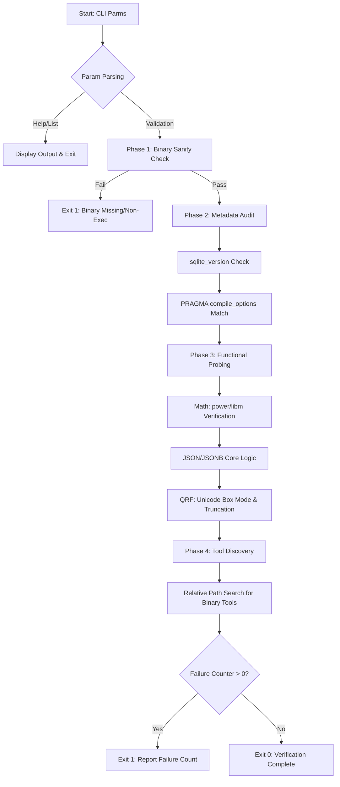

# SQLite 3 Build Verification System (sqlite3_validate.sh)

## Application Overview and Objectives

The `sqlite3_validate.sh` utility is a high-assurance validation tool designed to verify the integrity and feature-completeness of SQLite binaries produced during the `sqlite-xg` build process. In complex system deployments, simply checking the binary version is insufficient; this script performs deep functional probing and metadata inspection to ensure that the compiled artifact aligns perfectly with the architectural requirements defined in the RPM specification.

### Core Objectives:
- **Version Parity**: Confirm the reported binary version matches the target build version.
- **Feature Flag Audit**: Verify that all required compile-time flags (e.g., `ENABLE_RTREE`, `ENABLE_SESSION`) are active.
- **Functional Integrity**: Execute runtime probes for critical subsystems like Math functions, JSON core, and the Query Result Formatter (QRF).
- **Environment Discovery**: Validate the presence and executability of supplemental binaries like `sqlite3_analyzer` and `sqldiff` in the deployment path.
- **CI/CD Integration**: Provide a robust exit status mechanism to automate build-break decisions in automated pipelines.

---

## Architecture and Design Choices

The system is built on a **Modular Probing Architecture**, which separates the validation process into distinct logical layers. 

### Key Design Principles:
1.  **Functional Probing vs. Static Analysis**: Rather than relying solely on `strings` or metadata, the script executes SQL commands against the binary. This "black-box" approach confirms not only that a flag was passed to the compiler, but that the resulting code is correctly linked and functional (e.g., verifying `libm` linkage via `power()`).
2.  **Strict Execution Environment**: The script utilizes `set -euo pipefail` to ensure that failures in any piped command or unhandled variables trigger an immediate and safe abort, preventing false-positive validation results.
3.  **Path-Relative Tool Discovery**: To support non-standard installation directories (e.g., `/opt/lib/sqlite/bin`), the script uses the path of the primary `sqlite3` binary as a pivot point for locating supplemental tools, ensuring consistency across varied deployment environments.
4.  **Fail-Fast/Report-All Logic**: The script accumulates failures in a high-level counter. While it reports all issues found during a run, it ensures a final non-zero exit code if *any* check fails, facilitating clear signal-to-noise ratios in log files.

---

## Data Flow and Control Logic

The following diagram illustrates the validated lifecycle of a binary audit:



### Operational Sequence:
1.  **Ingestion**: Command line arguments are parsed into internal scoped variables.
2.  **Sanity Check**: The target binary is verified for existence and execution permissions.
3.  **Metadata Extraction**: Queries `PRAGMA compile_options` to build a feature map of the binary.
4.  **Runtime Validation**: Executes discrete SQL test cases. Each test case captures both `stdout` and `stderr` to detect syntax errors or linkage failures.
5.  **Status Accumulation**: The `log_fail` helper increments a global failure counter while providing localized logging for easy debugging.

---

## Dependencies

To run the verification suite, the following environment is required:

### Infrastructure:
- **Bash Shell**: Version 4.x or higher (utilizes `local` keywords and array-like behaviors).
- **Standard Linux Utilities**: `grep`, `dirname`, `cat`, `awk`, and `command`.

### SQLite Target:
- **Primary Binary**: An executable `sqlite3` binary (typically 3.53.0 or higher).
- **Supplemental Tools**: (Optional/Validated) `sqlite3_rsync`, `sqlite3_analyzer`, `sqldiff`, and optionally `lemon`.

---

## Command Line Arguments

| Argument | Type | Default | Description |
| :--- | :--- | :--- | :--- |
| `--version=V` | String | **Mandatory** | The expected version string (e.g., `3.53.0`). |
| `--path=P` | Path | `./sqlite3` | Absolute or relative path to the sqlite3 binary to test. |
| `--list-features` | Flag | N/A | Dumps the compiled features found via `PRAGMA` and exits. |
| `--with-lemon` | Flag | N/A | If set, includes the `lemon` parser tool in the discovery check. |
| `--help` | Flag | N/A | Displays the usage manual and exits. |

---

## Detailed Usage Examples

### Scenario 1: Standard Build Verification
Verify a newly built binary in a specific directory against version 3.53.0.
```bash
./sqlite3_validate.sh --version=3.53.0 --path=/usr/src/redhat/BUILD/bin/sqlite3
```

### Scenario 2: Comprehensive Feature Audit
Inspect all available compile-time options for a deployment audit.
```bash
./sqlite3_validate.sh --path=/opt/lib/sqlite/bin/sqlite3 --list-features
```

### Scenario 3: Automation/CI Integration
Example of using the exit code in a build script or Jenkins pipeline:
```bash
if ./sqlite3_validate.sh --version=3.53.0 --path=./sqlite3; then
    echo "Build artifacts verified. Proceeding to packaging."
else
    echo "Build verification failed. Aborting."
    exit 1
fi
```

### Scenario 4: Including External Tools
Verification including the `lemon` parser (often used for development builds).
```bash
./sqlite3_validate.sh --version=3.53.0 --with-lemon
```
