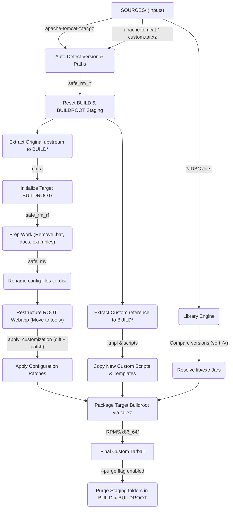
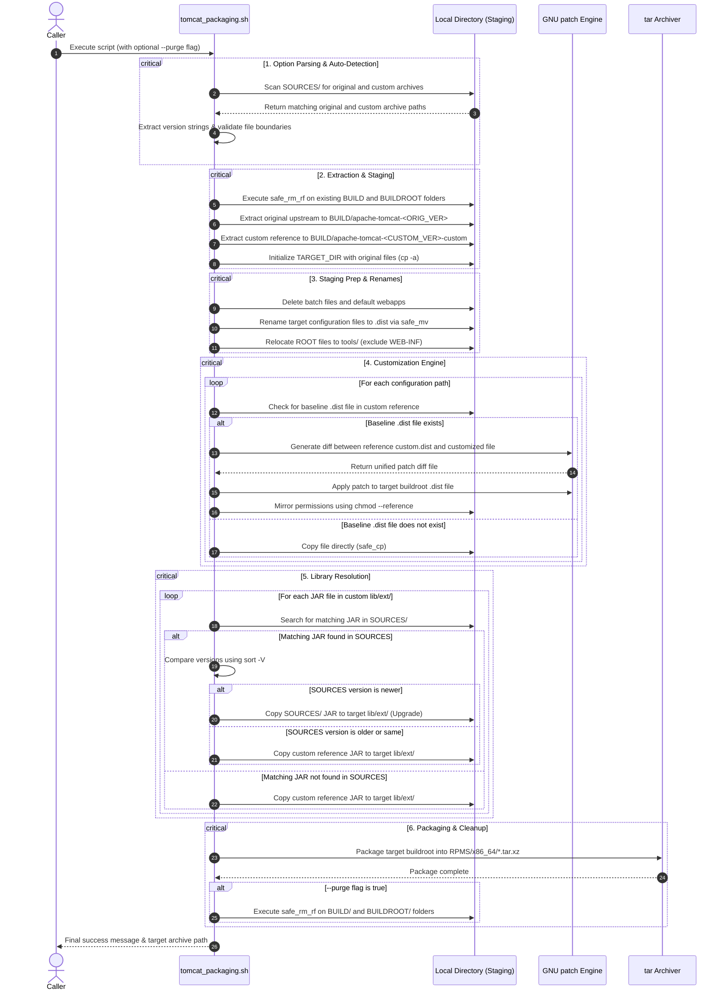

# Apache Tomcat Reconstruction & Packaging System (tomcat_packaging.sh)
## Technical Architecture & Operations Manual
**Target Audience: Senior IT Architects & Systems Engineers**

---

### 1. Application Overview and Objectives

This utility is a shell-based automation script designed to reconstruct, customize, and package Apache Tomcat layouts. Rather than hardcoding paths, versions, or overriding files directly, the script implements a dynamic, metadata-preserving patch system.

#### Key Objectives:
- **Upstream Alignment**: Apply site-specific customizations (e.g., custom scripts, security templates, and library definitions) to new upstream releases of Apache Tomcat (such as upgrading from `9.0.117` to `9.0.118`) while preserving upstream-specific security fixes and version changes.
- **Version Agility**: Auto-detect version details dynamically from archive naming patterns in `SOURCES/` rather than hardcoding version integers.
- **Metadata and Permissions Integrity**: Maintain exact filesystem metadata (permissions, timestamps, and ownership) across copies and generated patch targets.
- **Automated Library Upgrades**: Detect and upgrade external database drivers (e.g., MariaDB Java Client) inside the layout if newer driver assets are detected in the `SOURCES/` repository.
- **Safe Execution Boundaries**: Contain all modifications and deletions inside the workspace base directory (`BASE_DIR`) to prevent system-wide command injection or path traversal errors.

---

### 2. Architecture and Design Choices

The utility separates operational code from configuration states by leveraging Bash arrays. It uses GNU patch utilities to apply custom changes dynamically.

#### Core Design Elements:
1. **Decoupled Data Definitions**: Configuration files, template targets, and direct copies are defined in configuration arrays at the top of the file. The operational loops downstream consume these arrays.
2. **Patch-Based Customizations**: For configuration changes, the utility computes a unified diff between the custom reference `.dist` base file and the custom reference customized file. This diff is then applied to the target's `.dist` backup, merging upstream code updates with site customizations.
3. **Fallback direct copy**: If a customization file has no matching `.dist` file in the custom reference archive, it is copied directly as a new asset.
4. **Metadata Preservation**: Directory initialization and copies use `cp -a` (preserve). Custom scripts match the reference custom permissions dynamically via `chmod --reference`.
5. **Fail-Fast Safety Checks**: Strict shell constraints (`set -euo pipefail`) abort execution immediately upon encountering undefined variables or command failures. Safe helper wrappers (`safe_cp`, `safe_mv`, `safe_rm_rf`) validate source paths and guard directory bounds before operations are executed.

#### Architecture Diagram (System Flow)



#### Assumptions & Edge Cases:
- **Single Archive Rule**: It is assumed that exactly one original tarball (`.tar.gz`) and exactly one custom reference archive (`.tar.xz`) exist in `SOURCES/`. If multiple matching files are present, the script prints an error and exits to prevent version ambiguity.
- **Upstream Conformity**: The script assumes upstream archives maintain the standard Tomcat structure (e.g., `bin/*.sh`, `conf/server.xml`, `webapps/ROOT/`). Major layout alterations upstream require updating the array paths.
- **Root Directory Alignment**: During restructuring, `webapps/ROOT/WEB-INF/` is explicitly excluded from being relocated to `webapps/ROOT/tools/` to prevent breaking standard servlet mapping constraints.

---

### 3. Data Flow and Control Logic

#### Operational Flow & Sequence:
1. **Option Parse**: Iterates over arguments. Extracts the `--purge` flag and collects remaining arguments into `ARGS`.
2. **Version Extraction**: Parses the tarball names using `sed` to retrieve version strings. Resolves local directories:
   - `EXTRACT_ORIG` = `BUILD/apache-tomcat-<ORIG_VER>`
   - `EXTRACT_CUSTOM` = `BUILD/apache-tomcat-<CUSTOM_VER>-custom`
   - `TARGET_DIR` = `BUILDROOT/apache-tomcat-<ORIG_VER>-custom`
3. **Staging Reset**: Invokes `safe_rm_rf` to clean existing directories under the staging paths before extraction.
4. **Staging Preparation**: Extracts original and custom references. Copies original files to target directories. Deletes `.bat` scripts, `webapps/docs/`, and `webapps/examples/`.
5. **Config Renaming**: Iterates through `bin_files`, `conf_files`, and `webapp_files` to rename them with a `.dist` suffix inside the target buildroot directory.
6. **ROOT Restructuring**: Relocates ROOT webapp elements (excluding `tools` and `WEB-INF`) to `tools/` and backs up default `index.jsp` and `favicon.ico`.
7. **Patch Application**: 
   - Iterates through `standard_customizations` and `tmpl_customizations`.
   - Compares the custom reference files. If a custom `.dist` base exists, it runs `diff -u` and applies the patch to the target `.dist` using `patch`.
   - Runs `chmod --reference` to apply permissions.
   - If no `.dist` exists, copies the custom template/script directly using `safe_cp`.
8. **Direct Asset Copying**: Iterates over `direct_copies` to transfer setenv templates, internal scripts, favicon.ico, and tools JSP pages.
9. **Library Resolution**:
   - Loops through custom reference jars in `lib/ext/`.
   - Extracts the library prefix and checks for matching libraries in `SOURCES/`.
   - Evaluates version numbers using `sort -V`. Upgrades to the `SOURCES/` version if it is newer, otherwise retains the version from the custom reference archive.
10. **Packaging**: Creates an archive in `RPMS/x86_64/` containing the target directory renamed internally to `apache-tomcat-<ORIG_VER>`.
11. **Purging**: If `--purge` is set to `true`, clean up staging directories using `safe_rm_rf`.

#### Sequence Diagram (Operational Pipeline)



---

### 4. Dependencies

Running this script successfully requires the following system modules, utility binaries, and shell versions:

| Dependency | Required Version / Standard | Purpose |
| :--- | :--- | :--- |
| **Bash Shell** | `bash 4.0` or newer | Shell execution environment, array variable definitions, local functions, and string replacement utilities. |
| **GNU tar** | `tar (GNU tar)` | Extracting original tar.gz and custom tar.xz archives, and packaging target layouts. |
| **GNU diffutils** | `diff 3.0` or newer | Generating unified patch diff files between customizations and configuration baselines. |
| **GNU patch** | `patch 2.5` or newer | Applying unified patch diffs to target configurations. |
| **GNU findutils** | `find` | Scanning and restructuring directories (e.g., relocating ROOT items to tools/). |
| **GNU coreutils** | `sort`, `basename`, `mktemp` | Sorting version lists (`sort -V`), resolving paths, and creating secure temporary patch files. |

---

### 5. Security Assessment

#### Encryption in Transit:
- The script patches `conf/web.xml` by mapping customized transport configurations. Security settings inside this configuration force a `CONFIDENTIAL` transport guarantee on `/tools/*` endpoints. This redirects unsecured HTTP traffic to secure HTTPS channels, enforcing encryption in transit.

#### Secret Management:
- No passwords, keystore passphrases, or active API credentials are hardcoded inside the script or configuration files.
- The configurations use template layouts (`.tmpl`). Secrets are loaded dynamically at deployment or run-time rather than being stored statically in the build artifacts.

#### Authentication and RBAC:
- Access controls are enforced for critical administrative views:
  - Role definitions and permissions are staged in `conf/tomcat-users.xml.tmpl` rather than the active runtime file.
  - Deployment configurations (`webapps/manager/WEB-INF/web.xml` and `webapps/host-manager/WEB-INF/web.xml`) are modified to limit management interfaces using role-based constraints.

#### Library Management:
- To mitigate dependencies on vulnerable database driver libraries, the utility includes a resolution engine. During each package build, the system compares versions of driver JARs in `lib/ext/` against versions available in the secure `SOURCES/` directory. If a newer library version is available (such as `mariadb-java-client-3.5.9.jar` replacing `3.5.8`), it automatically upgrades the file in the target buildroot.

#### Unprivileged Execution Context:
- The script does not require root privileges. It runs within a standard unprivileged user environment.
- Filesystem permissions are strictly managed:
  - Timestamps, ownership, and restricted permission sets are preserved using `cp -a`.
  - The script uses `chmod --reference` to apply target file permissions from customized reference files. As a result, critical script permissions are restricted (e.g., `shutdown.sh` and `startup.sh` use `755` executable permissions, whereas other scripts in `bin/` retain `750` permissions).

---

### 6. Code Quality Assessment and Best Practices
*(For Discovery and Quality Reference)*

The script implements the following code quality standards:
- **Strict Error Handling**: Employs `set -euo pipefail`. `set -e` ensures exit on failure, `set -u` treats unset variables as errors, and `set -o pipefail` ensures pipeline return values represent the final exit code of the last command to fail.
- **Boundaries Validation**: The `safe_rm_rf` helper ensures path deletions are constrained within `${BASE_DIR}` to prevent unintended system-wide data loss.
- **Encapsulated Control Logic**: Separates data structures from code by declaring configuration targets inside arrays at the top of the file. This allows updates to file configurations to be made in the arrays without changing downstream operational code.

---

### 7. Command Line Arguments

The script accepts options and positional arguments:

```bash
./SPECS/tomcat_packaging.sh [options] [original_archive] [custom_archive] [target_buildroot]
```

| Argument | Type | Default Value | Description |
| :--- | :--- | :--- | :--- |
| `--purge` | Option Flag | `false` | If specified, the script automatically purges the temporary extraction directories under `BUILD/` and the target buildroot under `BUILDROOT/` on success. |
| `original_archive` | Positional (1) | `SOURCES/apache-tomcat-*.tar.gz` | Path override for the upstream Tomcat archive. If not specified, the script auto-detects a matching file in `SOURCES/`. |
| `custom_archive` | Positional (2) | `SOURCES/apache-tomcat-*-custom.tar.xz` | Path override for the customized reference archive. If not specified, the script auto-detects a matching file in `SOURCES/`. |
| `target_buildroot` | Positional (3) | `BUILDROOT/apache-tomcat-<version>-custom` | Destination folder path for the customized target layout. If not specified, it defaults to the standard target buildroot path. |

---

### 8. Usage and Deployment Examples

#### Example 1: Standard Build and Packaging
Executes the packaging process using auto-detection for the original and custom reference archives. Staging directories are preserved.

```bash
$ ./SPECS/tomcat_packaging.sh
```

**Expected Output:**
```
==========================================================================
=== Tomcat Packaging Script Started ===
==========================================================================
Original Archive:         /usr/src/redhat/SOURCES/apache-tomcat-9.0.118.tar.gz (version: 9.0.118)
Custom Archive:           /usr/src/redhat/SOURCES/apache-tomcat-9.0.117-custom.tar.xz (version: 9.0.117)
Original Extraction:      /usr/src/redhat/BUILD/apache-tomcat-9.0.118
Custom Reference:         /usr/src/redhat/BUILD/apache-tomcat-9.0.117-custom
Target Buildroot:         /usr/src/redhat/BUILDROOT/apache-tomcat-9.0.118-custom

[1/8] Extracting Source Archives...
Extracting original Tomcat...
Extracting custom reference Tomcat...

[2/8] Initializing Buildroot & Performing Prep Work...
Initializing target buildroot...
Performing preparation work on buildroot Tomcat...

[3/8] Restructuring ROOT Webapp...
Restructuring ROOT webapp...

[4/8] Applying Custom Configuration Patches...
Applying custom configurations...
Applying custom diff from shutdown.sh.dist -> shutdown.sh to shutdown.sh.dist
patching file /usr/src/redhat/BUILDROOT/apache-tomcat-9.0.118-custom/bin/shutdown.sh
...
[5/8] Copying Direct Templates & Assets...
Copying custom files and scripts directly...

[6/8] Resolving & Setting Up External Libraries (lib/ext)...
Setting up lib/ext database drivers...
  Resolving version for mariadb-java-client-3.5.8.jar (library: mariadb-java-client)
    Found matching jar in SOURCES: mariadb-java-client-3.5.9.jar
    --> UPGRADING to version in SOURCES: mariadb-java-client-3.5.9.jar
...
[7/8] Creating Final Target Archive...
Creating target archive in RPMS/x86_64/...

[8/8] Completing Packaging & Staging Status...
==========================================================================
=== Tomcat Packaging Complete ===
==========================================================================
Original extracted files kept in: /usr/src/redhat/BUILD/apache-tomcat-9.0.118
Custom reference files kept in:   /usr/src/redhat/BUILD/apache-tomcat-9.0.117-custom
Buildroot customized Tomcat in:   /usr/src/redhat/BUILDROOT/apache-tomcat-9.0.118-custom
Target archive created in:        /usr/src/redhat/RPMS/x86_64/apache-tomcat-9.0.118-custom.tar.xz
```

---

#### Example 2: Clean Packaging with Staging Purge
Executes the packaging process and cleans up staging directories in `BUILD/` and `BUILDROOT/` upon successful build execution.

```bash
$ ./SPECS/tomcat_packaging.sh --purge
```

**Expected Output:**
```
==========================================================================
=== Tomcat Packaging Script Started ===
==========================================================================
Original Archive:         /usr/src/redhat/SOURCES/apache-tomcat-9.0.118.tar.gz (version: 9.0.118)
Custom Archive:           /usr/src/redhat/SOURCES/apache-tomcat-9.0.117-custom.tar.xz (version: 9.0.117)
Original Extraction:      /usr/src/redhat/BUILD/apache-tomcat-9.0.118
Custom Reference:         /usr/src/redhat/BUILD/apache-tomcat-9.0.117-custom
Target Buildroot:         /usr/src/redhat/BUILDROOT/apache-tomcat-9.0.118-custom

[1/8] Extracting Source Archives...
Extracting original Tomcat...
Extracting custom reference Tomcat...
...
[7/8] Creating Final Target Archive...
Creating target archive in RPMS/x86_64/...

[8/8] Completing Packaging & Staging Status...
==========================================================================
=== Tomcat Packaging Complete ===
==========================================================================
Purging temporary build and buildroot folders...
Successfully cleaned up: /usr/src/redhat/BUILD/apache-tomcat-9.0.118, /usr/src/redhat/BUILD/apache-tomcat-9.0.117-custom, and /usr/src/redhat/BUILDROOT/apache-tomcat-9.0.118-custom
Target archive created in:        /usr/src/redhat/RPMS/x86_64/apache-tomcat-9.0.118-custom.tar.xz
```

---

#### Example 3: Build using Explicit Tarball Paths
Overrides the auto-detected upstream and customized reference file paths.

```bash
$ ./SPECS/tomcat_packaging.sh /tmp/tomcat-9.0.118.tar.gz /tmp/tomcat-9.0.117-custom.tar.xz
```
