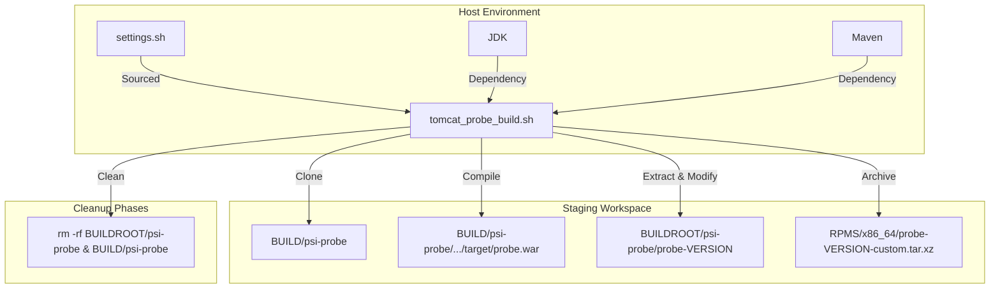
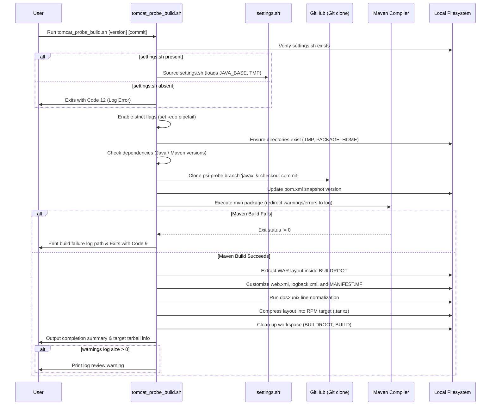

# psi-probe Packaging Script (`tomcat_probe_build.sh`)
## Technical Specification and Operations Manual

This document provides architectural, operational, and security specifications for the packaging script `tomcat_probe_build.sh`. It is intended for senior systems engineers and enterprise application architects responsible for maintaining packaging and staging scripts within RPM-based deployment systems.

---

## 1. Application Overview and Objectives

The `tomcat_probe_build.sh` script automates the retrieval, compilation, security hardening, customization, and packaging of `psi-probe` (supporting the `javax` namespace branch). The resulting artifact is a compressed tarball (`.tar.xz`) compatible with the target application servlet container (e.g., Tomcat `javax` namespace runtimes).

> [!NOTE]
> **`javax` vs. `jakarta` Namespace Transition:**
> - **`javax` Namespace (Tomcat 9 and earlier):** Supports Java EE specifications (e.g., Servlet API 4.0 and below). This script packages `psi-probe` specifically for these legacy runtimes.
> - **`jakarta` Namespace (Tomcat 10 and later):** Supports Jakarta EE specifications (e.g., Servlet API 5.0 and above).
> - **Incompatibility:** Due to the package renaming from `javax.*` to `jakarta.*`, WAR files compiled for one namespace cannot run on the other without using a migration tool (such as the Apache Tomcat Migration Tool for Jakarta EE).

### Primary Objectives:
- **Automation of Build Lifecycle**: Orchestrates source code retrieval, version tagging, compilation, staging, branding customization, and archival.
- **Java Compiler Target Compatibility**: Uses the configured Java Development Kit (JDK) compiler environment to support build plugins (such as error-prone) while targeting runtime Java bytecode compatibility levels. The generated Java binaries (compiled war bytecode) target runtime compatibility with **Java 11 or higher** runtime environments.
- **Visual Log Restructuring**: Structures verbose output into visual steps, separating background compiler logs from execution logic.

---

## 2. Architecture and Design Choices

The script is built as a modular POSIX-compliant Bash shell script designed to run in an unprivileged user context.



### Design Assumptions:
- **Environment Dependency**: Assumes that the host environment defines `JAVA_BASE` and `TMP` via `${HOME}/scripts/settings.sh`.
- **Workspace Containment**: Confines all temporary files and staging outputs to local directories under a designated `PACKAGE_HOME`.

### Edge Cases and Error Mitigation:
1. **Unbound Variables**: Enabled `set -u` safely *after* sourcing environment files to prevent early crashes due to internal oracle setups.
2. **Positional Parameter Validation**: Initialized arguments safely with `${1:-}` and `${2:-}` fallback operators to display human-readable errors when executed without arguments.
3. **Empty Variable Path Safety**: Guards destructive cleanups (`rm -rf`) with non-empty checks `[ -n "${APPL_NAME}" ]` and `[ -n "${PROBE_REL}" ]` to prevent catastrophic accidental deletion of root or parent system directories.
4. **Command Check**: Pre-verifies executable commands (`java`, `mvn`) and halts with custom exit codes if binary resources are missing.

---

## 3. Data Flow and Control Logic

### Sequence of Operations:



---

## 4. Dependencies

| Dependency Type | Resource Name | Purpose | Version Requirement |
| :--- | :--- | :--- | :--- |
| **System Binary** | `bash` | Script execution shell interpreter | Standard Linux interpreter |
| **System Binary** | `git` | Repository cloning and tag checkout | Standard git utility |
| **System Binary** | `java` | Java compiler execution engine | JDK 25 is required (defined in the application `pom.xml` compiler plugins; matches `JAVA_VERSION` constant) |
| **System Binary** | `mvn` | Java build and packaging tool | Latest release of Maven 3.9 is required (defined in the application `pom.xml` enforcer rules; matches `REQ_MVN` constant) |
| **System Binary** | `jar` | Archive extraction utility | Standard JDK packaging utility |
| **System Binary** | `tar` | High-ratio archive compression utility | Standard GNU compression utility |
| **System Binary** | `dos2unix` | Line ending configuration utility | Standard |
| **Configuration** | `settings.sh` | Environmental overrides loader | Mandatory |

---

## 5. Security Assessment

### Encryption in Transit
- **Source Retrieval**: Source code cloning relies on Git protocols over HTTPS. Ensure the `SRC_URL` is configured to use HTTPS to prevent man-in-the-middle (MitM) source injection.
- **Maven Dependencies**: Maven handles artifact download requests via HTTPS. The local Maven configuration must enforce TLS validation.

### Secrets Management
- No secrets, credentials, or private SSH keys are hardcoded in the script. Accessing private repositories requires configured system-level credential managers or environment keys.

### Staging Security Customizations
During Phase 4, the staging process customizes the target web application with security improvements:
- **SSL Enforcement**: Modifies `web.xml` transport guarantee:
  ```xml
  <transport-guarantee>CONFIDENTIAL</transport-guarantee>
  ```
  This forces Tomcat to route all inbound traffic through secure SSL/TLS channels.
- **Log Level Silencing**: Adjusts log level bounds to `OFF` inside `logback.xml`:
  ```xml
  level="OFF"
  ```
  This mitigates potential data leaks by ensuring that sensitive system transaction details are not output to text logs.
- **Unprivileged Context**: Executing builds in the unprivileged user context (`builder`) isolates compiling processes from the root shell.

---

## 6. Code Quality Assessment and Best Practices

- **Strict Mode Enforcement**: Uses `set -euo pipefail` to ensure script execution ceases immediately upon commands encountering errors or variables referencing uninitialized parameters.
- **DRY Functions Modularization**:
  - `check_command`: Encapsulates path validation logic.
  - `safe_cd` and `safe_mkdir_cd`: Mitigate command failures during navigation.
- **Defensive Error Redirections**: Prevents logs from being cluttered by redirecting command diagnostic warnings to standard error (`>&2`).
- **Resource Cleanup Integrity**: Workspace cleanup runs only on successful exit, preventing debugging context from being prematurely erased on build failures.

---

## 7. Command Line Arguments

| Parameter | Type | Required | Description | Default |
| :--- | :---: | :---: | :--- | :--- |
| **`PROBE_VER`** | `String` | **Yes** | Target application release version (parameterized) | *None* |
| **`PROBE_TAG`** | `String` | **Yes** | Target git release commit tag or hash | *None* |

---

## 8. Usage and Deployment Examples

> [!NOTE]
> The versions and tags below are illustrative placeholders. The script dynamically handles parameter parameters passed at runtime.

### Command Execution:
```bash
./tomcat_probe_build.sh 4.6.1 a229e4a0a2a8021d5e82150853b103e7330d7893
```

### Standard Output Sample:
```text
┌────────────────────────────────────────────────────────────────────────┐
│                     Probe Packaging Script Started                     │
└────────────────────────────────────────────────────────────────────────┘
  [INFO] Version:         4.6.1
  [INFO] Tag:             a229e4a0a2a8021d5e82150853b103e7330d7893
  [INFO] Target Rel:      4.6.1-a229e4
  [INFO] Staging Base:    /usr/src/redhat/BUILDROOT/psi-probe
  [INFO] Build Root:      /usr/src/redhat

================================================================================
  [1/5] Verifying system prerequisites
================================================================================
  [INFO] Java Version:  25
  [INFO] Maven Version: 3.9.16
  [OK] Prerequisites verified successfully.

================================================================================
  [2/5] Fetching and checking out source repository
================================================================================
  [INFO] Cloning repository branch 'javax'...
  [INFO] Checking out tag 'a229e4a0a2a8021d5e82150853b103e7330d7893'...
  [OK] Source checked out successfully.

================================================================================
  [3/5] Compiling and packaging WAR with Maven
================================================================================
  [INFO] Updating snapshot version in pom.xml...
  [INFO] Executing Maven build (logging to /u01/tmp/psi-probe_build_maven.log)...
  [OK] WAR compiled and packaged successfully.

================================================================================
  [4/5] Extracting and modifying staged layout inside BUILDROOT
================================================================================
  [INFO] Preparing staging directory under /usr/src/redhat/BUILDROOT/psi-probe...
  [INFO] Extracting WAR archive...
  [INFO] Configuring web.xml (transport guarantee / version branding)...
  [INFO] Configuring logback.xml and Manifest...
  [INFO] Normalizing text file line endings (dos2unix)...
  [OK] Staged layout customized successfully.

================================================================================
  [5/5] Creating final target archive
================================================================================
  [INFO] Archiving and compressing to probe-4.6.1-a229e4-custom.tar.xz...
  [INFO] Cleaning up workspace directories...
  [OK] Target archive created successfully.

┌────────────────────────────────────────────────────────────────────────┐
│                       Probe Packaging Complete                         │
└────────────────────────────────────────────────────────────────────────┘
-rw-r--r-- 1 builder builder 32M Jun 23 20:04 /usr/src/redhat/RPMS/x86_64/probe-4.6.1-a229e4-custom.tar.xz
  [WARN] Maven build generated warnings/errors. Please review: /u01/tmp/psi-probe_build_maven.log
```
