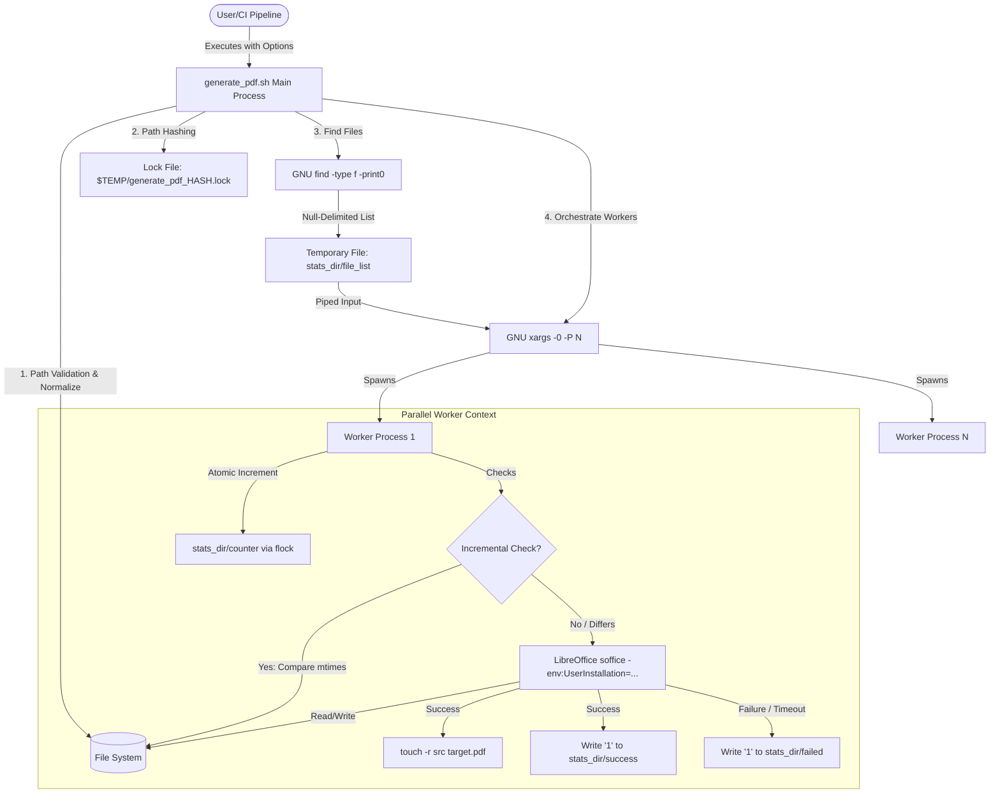
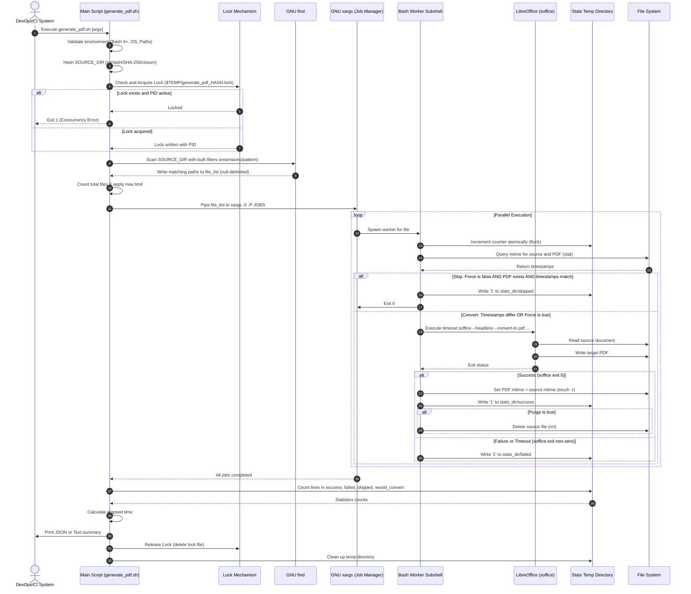

# MS Office to PDF Batch Converter Utility (`generate_pdf.sh`) - Technical Documentation

This document provides a comprehensive technical overview of the design, architecture, security posture, data flow, dependencies, and execution model of the `generate_pdf.sh` batch conversion utility. It is written to serve as a resource for a senior IT architect or devops systems engineer, maintaining a neutral, purely technical tone throughout.

---

## 1. Application Overview and Objectives

`generate_pdf.sh` is an enterprise-grade shell utility designed to recursively discover Office documents (defaulting to `*.doc`, `*.docx`, `*.xls`, `*.xlsx`, `*.ppt`, and `*.pptx` if no filter options are specified, along with support for OpenDocument, vector graphics, and raster images) and convert them to PDF using LibreOffice in headless mode. 

<!-- [Objective]: Define performance and audit-compliance boundaries -->
### Objectives
*   **Audit-Compliant Timestamp Preservation**: Maintain filesystem-level integrity by copying the modification timestamps (`mtime`) of source documents to their generated PDF counterparts. This ensures that downstream compliance engines can audit PDF generation without losing original metadata timelines.
*   **High-Performance Concurrent Conversion**: Utilize multi-core processor architectures via a parallel fork/join model, significantly reducing execution windows for bulk document sets.
*   **Incremental Build Optimization**: Implement fast-skipping logic to bypass files where the PDF output already exists and is up-to-date with the source document.
*   **Concurrency and Resource Isolation**: Prevent collision and race conditions during parallel processing by establishing isolated LibreOffice execution contexts and strict single-instance lock constraints.
*   **Integration-Friendly Outputs**: Provide structured, machine-readable JSON telemetry (along with fallback plain text streams) to enable seamless integration into DevOps pipelines, dashboards, and automated verification tasks.

### Exit Codes
The utility returns standard exit codes depending on the result of the discovery and conversion execution:
*   **`0`**: Success (all discovered files were successfully converted, skipped as up-to-date, or dry-run was executed).
*   **`1`**: Runtime error (one or more file conversions failed or timed out).
*   **`2`**: Validation failure (invalid command line options, incorrect integer parameters, missing environment dependencies, or malformed paths).

---

## 2. Architecture and Design Choices

The script is developed as a modular shell application compatible with Bash 4.0+. It avoids complex database or message-broker integrations by leveraging native POSIX operating system utilities and filesystem boundaries.

<!-- [Architecture Overview]: High-level component relationship -->


### Key Design Decisions and Rationale

<!-- [Design Decision]: Isolated User Profiles for Headless LibreOffice -->
#### 1. Isolated LibreOffice User Installations
Headless LibreOffice (`soffice`) relies on a user profile directory containing configuration, lock files, and runtime templates. If multiple headless instances attempt to launch concurrently under the same user profile (e.g. `~/.config/libreoffice`), they experience lock contentions, leading to process hangs, crashes, or aborted conversions.
*   **Mitigation**: The utility isolates each worker subshell by dynamically passing a unique, sandbox-like user profile environment flag:
    `"-env:UserInstallation=file:///$tmpdir/libreoffice_$BASHPID"`
*   **Result**: Zero lock contention during parallel processing, ensuring stable multi-threaded throughput.

<!-- [Design Decision]: Fork/Join Parallelism via xargs -->
#### 2. Fork/Join Processing Model (`xargs` Thread Pool)
Managing parallel workers and process monitoring inside a shell environment can introduce race conditions and memory leaks when implemented with ad-hoc background processes (`&` and `wait`).
*   **Mitigation**: The utility offloads process allocation to `xargs` using the `-P <jobs>` option, passing a null-delimited file stream (`-0`). 
*   **Result**: Built-in, high-performance process throttling that easily scales to match the system's available CPU cores while protecting the operating system from process-table exhaustion.

<!-- [Design Decision]: Stateless IPC via System Filesystem -->
#### 3. Stateless Concurrency Aggregation
Since `xargs` workers execute in separate subshell processes, they cannot write directly to parent shell variables.
*   **Mitigation**: Rather than introducing network-level IPC or complex pipe configurations, the script uses a secure, localized temporary stats directory (`STATS_DIR`). Workers write state by appending simple characters to separate status files:
    *   `$STATS_DIR/success` (Successful conversions)
    *   `$STATS_DIR/failed` (Failed conversions)
    *   `$STATS_DIR/skipped` (Incremental bypasses)
    *   `$STATS_DIR/would_convert` (Dry-run logs)
    *   `$STATS_DIR/purged` (Successfully deleted source files)
*   **Result**: The parent shell aggregates final statistics atomically using `wc -l` over these files. POSIX guarantees that file appends are atomic for writes smaller than `PIPE_BUF` (typically 4,906 bytes).

<!-- [Design Decision]: Process-safe Progress Tracking -->
#### 4. Atomic Counter synchronization via flock
To show real-time progress indicators (e.g. `[12/100]`), workers must increment a shared counter file without writing duplicate values.
*   **Mitigation**: The script implements file locking using `flock` on `$STATS_DIR/counter.lock`. This synchronizes increments across worker processes. If `flock` is missing (e.g., inside minimal environments), the script falls back to parsing line counts from all stats files, ensuring compatibility.

<!-- [Design Decision]: Time Inheritance -->
#### 5. Timestamp Inheritance for Incremental State
A common limitation of document conversion pipelines is that the output PDF modification time matches the execution timestamp rather than the document's content creation time. This forces subsequent runs to always rebuild.
*   **Mitigation**: On successful conversion, the worker executes `touch -r "$src" "$pdf"`, forcing the target PDF's modification time to match the source file.
*   **Result**: The script can perform incremental checks in microseconds (`src_ts == pdf_ts`) rather than spending seconds launching LibreOffice to check file changes.

<!-- [Design Decision]: Stale Lock Mitigation -->
#### 6. Stale Lock Detection & Recovery
If the script is terminated abruptly (e.g., power failure or SIGKILL), the lock file `${TEMP:-/tmp}/generate_pdf_HASH.lock` remains, blocking future executions.
*   **Mitigation**: When checking the lock file, the script extracts the recorded PID and runs `kill -0 "$LOCK_PID"`. This sends a null signal to test if the process exists. If the PID is dead, the script automatically removes the lock file and proceeds.

---

## 3. Data Flow and Control Logic

The diagram below details the operational sequence from initial command-line parser invocation through file discovery, parallel conversion execution, and cleanup.



### Phase-by-Phase Control Logic

1.  **Phase 1: Environment & Parameter Validation**
    *   Asserts Bash version is 4.0+.
    *   Verifies target platform is Linux, Cygwin, or MSYS2.
    *   Verifies the availability of mandatory system utility binaries (`find`, `xargs`, `mktemp`, `timeout`, `stat`, `touch`, `wc`, `tr`, `cut`, `date`, `grep`, `dirname`, `basename`, `rm`, `tee`) and at least one hashing function (`xxhsum`, `sha256sum`, or `cksum`), as well as checking optional utilities like `pkill` and `flock`.
    *   Normalizes and checks all filesystem inputs for Windows vs. POSIX formatting (rejects backslashes `\`).
    *   Asserts that integer inputs (`--jobs`, `--timeout`, `--max-files`) are positive.
    *   Asserts that `OFFICE_BASE` is resolved and is not blank (skipped in diagnostics mode).
    *   Validates path to LibreOffice binary (`$OFFICE_BASE/soffice`).

2.  **Phase 2: Lock Instantiation**
    *   Computes an absolute path for the target search directory.
    *   Generates a 128-bit xxHash (via `xxhsum`, with fallback to `sha256sum` and fallback to `cksum`) of the path to create a unique lock file under the `$TEMP` directory (defaulting to `/tmp` if `$TEMP` is unset).
    *   Validates and acquires the lock, writing the script's `$$` process ID.

3.  **Phase 3: File Scanning & Discovery**
    *   Builds a dynamic expression for GNU `find` based on custom categories (e.g., spreadsheets, documents) or custom regex patterns.
    *   Runs discovery in a single pass, outputting null-delimited characters (`-print0`) to avoid token splitting on paths containing spaces.
    *   Caches the discovered list in a temporary directory and applies `--max-files` truncation if requested.

4.  **Phase 4: Forking Workers (Parallel Execution)**
    *   Launches `xargs -0 -P $JOBS` parsing the cached file list.
    *   For each path, a subshell runs a standalone evaluation block.
    *   Checks the modification time (`stat -c %Y`) of the source and expected target PDF.
    *   Spawns LibreOffice under a hard limit using GNU `timeout`.

5.  **Phase 5: Consolidation & Graceful Cleanup**
    *   Once `xargs` completes, the main process gathers output tallies from the temporary stats folder.
    *   Calculates total execution time.
    *   Parses summary stats using `jq` (if `--format json` is enabled) or plain text layout.
    *   The `EXIT` trap triggers cleanup, deleting the lock file, killing remaining `soffice` processes using `pkill` (falling back to process tree traversal and standard `kill` if missing), and recursively unlinking the stats folder.

---

## 4. Dependencies

The script relies on standard utility runtimes available on enterprise Linux distributions or POSIX windows layers (Cygwin/MSYS2).

| Dependency | Scope | Version | Requirement Type | Description / Role |
| :--- | :--- | :--- | :--- | :--- |
| **`bash`** | System | `4.0+` | Mandatory | CLI interpreter runtime (relies on associative arrays and indirect expansions). |
| **`LibreOffice`** | System | `5.0+` | Mandatory | Core PDF conversion engine. Executed headlessly via `soffice` binary. For a detailed list of supported formats and filters, see [libreoffice_extensions.md](libreoffice_extensions.md). |
| **`GNU find`** | Binary | POSIX | Mandatory | Search engine for recursive document discovery. |
| **`GNU xargs`** | Binary | POSIX | Mandatory | Orchestrator for thread-like subshell process execution. |
| **`timeout`** | Binary | POSIX | Mandatory | Part of GNU coreutils. Prevents hung converter instances. |
| **`stat`** | Binary | GNU | Mandatory | Queries filesystem timestamps (`mtime`) in epoch seconds. |
| **`touch`** | Binary | POSIX | Mandatory | Copy source timestamps (`touch -r`) onto generated target PDFs. |
| **`jq`** | Binary | `1.5+` | Conditional | Parse and build structured JSON responses (mandatory when `--format json` is active). |
| **`flock`** | Binary | POSIX | Optional | Manages file-level locks to support atomic worker progress counters. |
| **`cygpath`** | Binary | POSIX | Conditional | Translates POSIX virtual mounts to mixed-mode paths (mandatory on Cygwin/MSYS2 setups). |
| **`pkill`** | Binary | POSIX | Optional | Ensures no orphaned or zombie `soffice` processes are left on termination (falls back to process tree traversal and standard `kill` if missing). |
| **`xxhsum` / `sha256sum` / `cksum`** | Binary | POSIX | Mandatory | Generates path-hashed identifiers for single-instance directory lock files. |

---

## 5. Security Assessment

This assessment reviews the script's configuration against standard enterprise security vectors.

<!-- [Security Assessment]: Evaluates threats and OS level controls -->
### 1. Execution Context and Privileges
*   **Unprivileged Execution**: The utility is designed to run entirely within the user space. It does not require administrative elevation (`sudo` on Linux or UAC elevation on Windows).
*   **Recommended Context**: To limit exposure, do not run the utility under privileged accounts (like `root` or `Administrator`). Instead, execute the script using a dedicated, non-login service account.

### 2. Sandbox Recommendations for Untrusted Input
LibreOffice contains complex parsers for multiple binary file formats (Word, Excel, PowerPoint). Historically, parsing untrusted files has exposed applications to buffer overflows and Remote Code Execution (RCE) vulnerabilities.
*   **Mitigation**: If the script is scheduled to process documents submitted by external or untrusted users, run the script within a sandboxed environment:
    *   **Container Isolation**: Run the utility inside a minimal Docker/Podman container (e.g., Alpine or Rocky Linux base) with a read-only root filesystem and restricted memory limits.
    *   **SecComp & AppArmor**: Block network system calls in the container, as document conversion has no network requirements.

### 3. File System Access Control & Path Restrictions
*   **Path Sanitization**: The utility validates all input paths. It strictly rejects backslashes (`\`) to prevent directory traversal attacks or unexpected escaping inside shell commands.
*   **POSIX ACLs**: Read access should be restricted to the target input path, and write permissions should only be granted to the designated output target and temporary directories (e.g. `/tmp`).

### 4. Secret Management & Authentication
*   **No Hardcoded Secrets**: The script does not require credentials, passwords, database connections, or API keys. 
*   **CI/CD Pipeline Security**: If the script accesses documents located on remote network shares (SMB/NFS) or object stores (AWS S3, Azure Blobs), the authentication token or mount process should be handled by the parent CI/CD pipeline or operating system service wrapper. Never write credentials directly to the script configuration.

### 5. Encryption in Transit
*   **Filesystem Boundary**: Since the script operates strictly on local or mounted paths, network-level encryption (TLS/SSL) is out of scope.
*   **Network Shares**: If reading or writing to network mounts, ensure the host OS enforces SMB 3.0 encryption or NFSv4 with Kerberos (`krb5p`) to protect files in transit over local networks.

---

## 6. Command Line Arguments

The script parses options using an iterative case-loop. Options can be passed in short or long forms.

| Argument | Parameter Type | Default Value | Description |
| :--- | :--- | :--- | :--- |
| **`--source <dir>`** | String (Directory) | N/A | Target directory to recursively search for documents (mandatory). |
| **`--dry-run`** | Flag | `false` | Scans and lists files that would be converted without executing LibreOffice. |
| **`--jobs <n>`** | Integer (Positive) | CPU Core Count | Max number of concurrent conversion jobs to run. |
| **`--log <file>`** | String (Filepath) | N/A | Log output location. Redirects combined stdout and stderr to this file. |
| **`--force`** | Flag | `false` | Bypasses the incremental timestamp check, forcing reconversion of all files. |
| **`--quiet`** | Flag | `false` | Suppresses standard output from LibreOffice, showing only the final run summary. |
| **`--verbose`** | Flag | `false` | Shows detailed debug output, including the epoch timestamps being compared. |
| **`--extensions <list>`** | String (CSV List) | `*.doc,*.docx,*.xls,*.xlsx,*.ppt,*.pptx` | Comma-separated list of extensions to find. If omitted, defaults to standard Office formats. |
| **`--pattern <regex>`**| String (Regex) | N/A | Alternative regex pattern for matching filenames. |
| **`--document`** | Flag | `false` | Category filter. Includes word processing documents (Writer formats). |
| **`--spreadsheet`** | Flag | `false` | Category filter. Includes spreadsheets (Calc formats). |
| **`--presentation`** | Flag | `false` | Category filter. Includes presentations (Impress formats). |
| **`--graphics`** | Flag | `false` | Category filter. Includes vector graphics and image formats. |
| **`--target <dir>`** | String (Directory) | N/A | Target directory for generated PDFs (defaults to same folder as source). |
| **`--purge`** | Flag | `false` | Deletes the original source file on successful conversion. |
| **`--timeout <secs>`** | Integer (Positive) | `300` (5 minutes) | Max conversion duration allowed per file. |
| **`--max-files <n>`** | Integer (Positive) | `0` (Unlimited) | Caps the total number of files processed in a single run. |
| **`--format <fmt>`** | Enum (`json` / `text`)| `json` | Specifies the output format of results and logs. |
| **`--detect`** | Flag | `false` | Run manual diagnostic checks on system prerequisites. |
| **`--version`** | Flag | N/A | Prints the script version (`1.9.0`) and exits. |
| **`--help`** | Flag | N/A | Displays the help manual and exits. |

### Environment Variables
*   **`OFFICE_BASE`**: Specifies the directory path containing the LibreOffice `soffice` binary. If unset, it resolves dynamically:
    *   **Linux**: Attempts to auto-detect via `soffice` in the system path, falling back to `/usr/lib/libreoffice/program`.
    *   **Windows (Cygwin/MSYS2)**: Attempts to detect standard installations at `c:/Program Files/LibreOffice/program` or `c:/Program Files (x86)/LibreOffice/program`, falling back to `d:/apps/office/libreoffice/program`.
    Can be explicitly overridden by exporting the variable before execution (e.g., `export OFFICE_BASE="/usr/lib/libreoffice/program"`).
*   **`TEMP`**: Defines the system temporary directory where process lock files and parallel execution stats directories are instantiated (defaults to `/tmp` if undefined).

### Validation Constraints & Mutually Exclusive Arguments
1.  **File Selection Mutex**: `--pattern` and `--extensions` are mutually exclusive.
2.  **Category Flag Mutex**: Category flags (like `--document` or `--spreadsheet`) cannot be combined with `--pattern`.
3.  **Positive Integers**: `--jobs`, `--timeout`, and `--max-files` are checked using regular expressions to ensure they are positive integers.
4.  **Format Constraints**: `--format` accepts only `json` or `text`.
5.  **Mandatory Source**: `--source` is required for all runs unless running diagnostics via `--detect`.
6.  **Forbidden Root Paths**: All path options (`--source`, `--target`, `--log`, and `OFFICE_BASE`) are checked to reject the filesystem root directory (`/` on Linux/Unix, or drive letter roots like `c:/` or `d:` on Windows) to prevent dangerous recursive walks over system-critical files.

---

## 7. Detailed Examples and Deployments

### Example 1: Basic Conversion Pass (Default: JSON format)
This command runs the converter on the current directory using the `--source .` option and default settings.

```bash
# Convert all default office files in the current folder, outputting JSON metrics
./generate_pdf.sh --source .
```

**Output:**
```json
{"level":"info","message":"[1/3] Converted: ./Compliance_Audit.docx -> ./Compliance_Audit.pdf","file":"./Compliance_Audit.docx"}
{"level":"info","message":"[2/3] Converted: ./Financial_Report.xlsx -> ./Financial_Report.pdf","file":"./Financial_Report.xlsx"}
{"level":"info","message":"[3/3] Skipping (up-to-date): ./Presentation.pptx","file":"./Presentation.pptx"}
{"status":"success","source":".","target":".","summary":{"converted":2,"failed":0,"skipped":1,"purged":0},"elapsed_seconds":4}
```

---

### Example 2: Target Redirection & Job Limiting (Text Format)
Convert only spreadsheets and documents in `/data/docs`, redirecting PDF outputs to `/data/pdfs`, using a maximum of 2 parallel worker processes.

```bash
# Convert spreadsheets and documents with limited jobs, writing plain text output
./generate_pdf.sh \
  --source /data/docs \
  --target /data/pdfs \
  --document \
  --spreadsheet \
  --jobs 2 \
  --format text
```

**Output:**
```text
Found 5 file(s) to process
Source directory: /data/docs
Target directory: /data/pdfs
Pattern: *.doc *.docx *.docm *.dotx *.dotm *.odt *.ott *.fodt *.sxw *.html *.htm *.xhtml *.rtf *.txt *.wpd *.wps *.pages *.abw *.lwp *.xlsx *.xls *.xlsm *.xlsb *.xltx *.xltm *.ods *.ots *.fods *.sxc *.csv *.tsv *.numbers *.dif *.wk1 *.123
Parallel jobs: 2

[1/5] Converted: /data/docs/Vendor_Form.docx -> /data/pdfs/Vendor_Form.pdf
[2/5] Converted: /data/docs/Q2_Balance.xlsx -> /data/pdfs/Q2_Balance.pdf
[3/5] Skipping (up-to-date): /data/docs/Policy_Brief.odt -> /data/pdfs/Policy_Brief.pdf
[4/5] Converted: /data/docs/Employee_List.csv -> /data/pdfs/Employee_List.pdf
[5/5] Skipping (up-to-date): /data/docs/Tax_Sheet.xlsx -> /data/pdfs/Tax_Sheet.pdf

=== Summary ===
Source directory: /data/docs
Target directory: /data/pdfs
Converted: 3
Failed: 0
Skipped (up-to-date): 2
Elapsed time: 5s
```

---

### Example 3: Forced Conversion with Source Purging & Debug Log
Force regeneration of Word documents matching a specific pattern, deleting the original Word files on success, and saving process logs to a file.

```bash
# Force convert documents matching vendor prefix, purge sources, and write logs to disk
./generate_pdf.sh \
  --source /data/audit \
  --pattern ".*/vendor_.*\.docx" \
  --force \
  --purge \
  --log /var/log/pdf_conversion.log \
  --format json
```

**Log Output (`/var/log/pdf_conversion.log`):**
```json
{"level":"info","message":"[1/2] Converted: /data/audit/vendor_agreement_01.docx -> /data/audit/vendor_agreement_01.pdf","file":"/data/audit/vendor_agreement_01.docx"}
{"level":"info","message":"[1/2] Purged source: /data/audit/vendor_agreement_01.docx","file":"/data/audit/vendor_agreement_01.docx"}
{"level":"info","message":"[2/2] Converted: /data/audit/vendor_invoice_12.docx -> /data/audit/vendor_invoice_12.pdf","file":"/data/audit/vendor_invoice_12.docx"}
{"level":"info","message":"[2/2] Purged source: /data/audit/vendor_invoice_12.docx","file":"/data/audit/vendor_invoice_12.docx"}
{"status":"success","source":"/data/audit","target":"/data/audit","summary":{"converted":2,"failed":0,"skipped":0,"purged":2},"elapsed_seconds":6}
```

---

### Example 4: Dry Run Execution
Preview what would be converted in the current directory using text formatting.

```bash
# Execute dry-run scan to identify pending conversions
./generate_pdf.sh --source . --dry-run --format text
```

**Output:**
```text
Found 4 file(s) to process
Source directory: .
Target directory: .
Pattern: *.doc *.docx *.xls *.xlsx *.ppt *.pptx
Parallel jobs: 4
Mode: DRY-RUN (no actual conversion)

[1/4] Would convert: ./audit_draft.docx
[2/4] Skipping (up-to-date): ./tax_final.xlsx
[3/4] Would convert: ./q2_review.pptx
[4/4] Would convert: ./ledger.xlsx

=== Summary ===
Source directory: .
Target directory: .
Would convert: 3
Skipped (up-to-date): 1
Elapsed time: 1s
```

---

### Example 5: Environment Detection (Prerequisites Verification)
Run diagnostic checks on system requirements and report findings:
```bash
# Execute prerequisites diagnosis check
./generate_pdf.sh --detect
```

**Output:**
```text
[INFO] =====================================================================
[INFO]  generate_pdf Diagnostics - Prerequisites Verification
[INFO] =====================================================================
[INFO] 1. Operating System & Shell:
[OK]   - Bash version: Found (5.3.9(1)-release)
[OK]   - Operating System: Supported (MINGW64_NT-10.0-26200)
[INFO] 2. System Utilities:
[OK]   - find: Found
[OK]   - xargs: Found
[OK]   - mktemp: Found
[OK]   - timeout: Found
[OK]   - stat: Found
[OK]   - touch: Found
[OK]   - wc: Found
[OK]   - tr: Found
[OK]   - cut: Found
[OK]   - date: Found
[OK]   - grep: Found
[OK]   - dirname: Found
[OK]   - basename: Found
[OK]   - rm: Found
[OK]   - tee: Found
[INFO]  - pkill (orphan cleanup): Not found (optional, used to terminate orphaned LibreOffice processes on interruption), failling back to standard kill
[INFO]  - xxhsum: Not found (optional fallback)
[OK]   - sha256sum: Found
[OK]   - cksum: Found
[OK]   - flock (atomic counter): Found
[INFO] 3. Format Parser:
[INFO]  - jq (JSON parsing): Not found (optional, required if using default --format json)
[INFO] 4. LibreOffice Installation:
[OK]   - LibreOffice (soffice): Found at d:/apps/office/libreoffice/program/soffice
[INFO] =====================================================================
[OK] All prerequisites are satisfied. Ready for conversion.
[INFO] =====================================================================
```

---

## 8. Deployment Configurations

### 1. CI/CD Pipeline Integration (GitLab CI/CD Runner)
Integrate the batch conversion script into a GitLab CI job to compile release-ready PDF artifacts from source documents.

```yaml
stages:
  - build-docs

compile-pdfs:
  stage: build-docs
  image: alpine:latest
  variables:
    OFFICE_BASE: "/usr/lib/libreoffice/program"
  before_script:
    - apk update
    - apk add --no-cache bash libreoffice jq coreutils util-linux
  script:
    - chmod +x ./client_tools/generate_pdf.sh
    # Convert all documents, outputting summary data programmatically
    - ./client_tools/generate_pdf.sh --source ./compliance_docs --target ./dist/pdfs --format json 2> summary.json
    - cat summary.json
    # Validate execution status
    - |
      if [ "$(jq -r '.status' summary.json)" = "partial_failure" ]; then
        echo "Error: One or more conversions failed."
        exit 1
      fi
  artifacts:
    paths:
      - ./dist/pdfs/
      - summary.json
    expire_in: 1 week
```

---

### 2. Scheduled Cron Job (System Cron with Log Rotation)
For automated daily batch conversions of active storage directories (e.g. an audit incoming queue), deploy the utility via `crontab` as a low-privilege user.

```text
# /etc/cron.d/pdf_batch_converter
# Run every night at 2:00 AM under 'pdfservice' user
0 2 * * * pdfservice /opt/devops/client_tools/generate_pdf.sh --source /mnt/shared/incoming --target /mnt/shared/archive --document --spreadsheet --quiet --purge --log /var/log/pdf_converter/daily_run.log
```

#### Logrotate Profile (`/etc/logrotate.d/pdf_converter`)
Ensure log files do not exhaust storage over time.

```text
/var/log/pdf_converter/*.log {
    daily
    rotate 7
    compress
    missingok
    notifempty
    create 0640 pdfservice pdfgroup
}
```

---

## 9. Reference Documents

*   **LibreOffice Supported File Extensions**: For a comprehensive architectural breakdown of supported formats, output filters (e.g. `writer_pdf_Export`), and headless server execution constraints, see [libreoffice_extensions.md](libreoffice_extensions.md).

