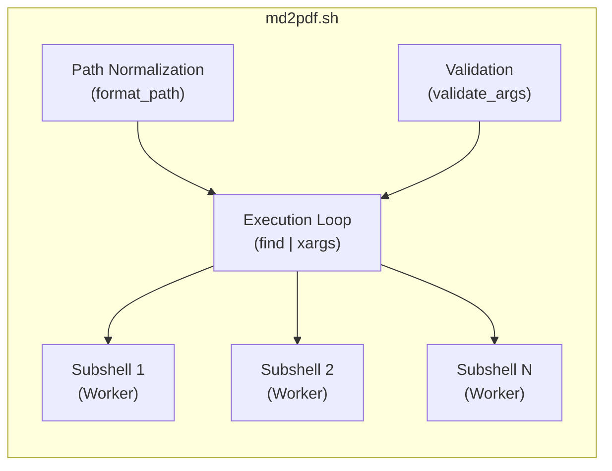
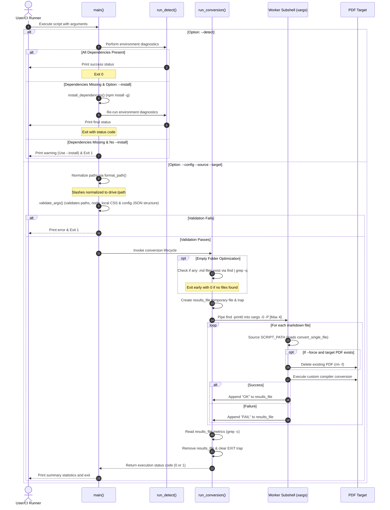

# Markdown to PDF Converter CLI Utility (`md2pdf.sh`) - Technical Documentation

This document provides a comprehensive overview of the design, architecture, security posture, data flow, dependencies, and execution model of the `md2pdf.sh` batch conversion utility. It is written for a senior IT architect level and maintains a neutral, technical tone.

---

## 1. Application Overview and Objectives

`md2pdf.sh` is a high-performance shell utility designed to convert one or more Markdown (`.md`) source documents into Portable Document Format (`.pdf`) files. 

### Objectives
*   **Cross-Platform Portability**: Execute natively and identically across Linux distributions and Windows POSIX emulation layers, specifically Git-Bash (MSYS2) and Cygwin.
*   **Performance and Concurrency**: Leverage multi-core architectures to perform batch conversions concurrently, reducing processing duration for large document sets.
*   **Resource and Platform Hardening**: Prevent system instability or crashes caused by resource starvation (specifically CPU/RAM exhaustion from headless browser engines) and path-resolution mismatches between Windows and Linux runtimes.
*   **Integration Ease**: Integrate into automated build pipelines, local pre-commit hooks, and CI/CD runners with zero configuration requirements.

---

## 2. Architecture and Design Choices

The utility is structured as a modular shell script adhering to the Bash 4+ standard. It incorporates several architectural patterns to resolve common cross-platform and execution risks.



### Path Normalization Engine
POSIX environments running on Windows (MSYS2, Cygwin) present path challenges:
*   Native Windows Node.js runtimes do not recognize POSIX virtual mounts (e.g., `/e/docs`).
*   Shell interpreters treat backslashes (`\`) as escape characters, which will strip characters (e.g., `C:\Users` becomes `C:Users`).

The `format_path` module resolves this by:
1.  Banning the backslash character (`\`) globally in variable inputs and substituting it with forward slashes (`/`).
2.  Interrogating the shell environment for the `cygpath` utility. If available, it executes `cygpath -m` to translate the path to the Windows "Mixed" format (e.g., `E:/data/docs`), which is supported natively by both native Windows executable binaries and POSIX shells.

### Portability via Worker Sourcing
Standard parallelization in shell scripts often relies on `export -f` to pass functions to subshells spawned by `xargs`. However, Windows does not support parentheses or percent signs in environment variable names, causing function exports to fail silently across process boundaries.

`md2pdf.sh` bypasses this limitation by:
1.  Extracting the script's absolute path dynamically (`SCRIPT_PATH`).
2.  Invoking `xargs` to spawn `bash -c` subshells.
3.  Each subshell explicitly runs `source "$1"` (passing `SCRIPT_PATH`), loading the script definitions natively.
4.  An execution guard is placed at the bottom of the script (`if [[ "${BASH_SOURCE[0]}" == "${0}" ]]`) to prevent the sourced script from re-running the `main` loop in the worker subshells.

### Concurrency Limit and OOM Prevention
The custom compiler uses Puppeteer to launch headless Chromium instances to render Markdown (including Mermaid diagrams) and generate PDFs. Headless browsers have large CPU and memory footprints. On high-core count machines (e.g., 32-core servers), launching a browser process per core will exhaust RAM. 

To prevent Out-of-Memory (OOM) failures:
1.  The script dynamically resolves cores using `nproc` or `sysctl`.
2.  It enforces a hard limit (capping parallel executions at a maximum of `4` concurrent worker threads).

### Atomic Results Aggregation
To track success and failure status codes across parallel subshells without blocking locks:
1.  A secure, unprivileged temporary file (`results_file`) is instantiated via `mktemp`.
2.  Subshells append status markers (`OK` or `FAIL`) to this file. Under POSIX specifications, writes smaller than `PIPE_BUF` (typically 4096 bytes) are guaranteed to be atomic, preventing write collisions or line interleaving.
3.  The parent shell reads the status lines using `grep -c` to compile final metrics.

### Shell Sourcing Leak Prevention
If the script is sourced in an active interactive shell session, standard `EXIT` traps will not trigger on function completion, leaving temporary results tracking files on disk. To prevent this, `run_conversion` performs explicit file removal (`rm -f "$results_file"`) and cleans the trap (`trap - EXIT`) prior to returning.

### Temporary HTML Lifecycle & Relative Asset Resolution
To compile PDFs, the Markdown content is rendered to an intermediate HTML file which Puppeteer loads. 
1. **Relative Asset Compatibility**: The temporary HTML file is written next to the **source Markdown file** rather than the target output directory. This allows the headless Chrome engine to resolve local relative assets (such as image paths ``) natively and render them correctly inside the output PDF.
2. **Leak-Proof Cleanup**: The compiler wraps Puppeteer operations in a `try...catch...finally` block. Process termination is deferred until after the `finally` block successfully closes the browser and removes the temporary HTML file.

### Signal Trapping & Zombie Engine Protection
To prevent orphaned processes and file clutter when the compilation is aborted abruptly (e.g. `Ctrl+C` or CI/CD job cancellation):
1. **Global Cleanup Handler**: A central asynchronous cleanup routine handles closing the Puppeteer browser instance and unlinking the temporary `.tmp.html` file.
2. **Signal Listeners**: Explicit event listeners are registered on the Node.js process for `SIGINT` (Ctrl+C), `SIGTERM` (termination signal), and `exit`. When triggered, they execute the cleanup routine before terminating the process with proper exit codes (e.g., `130` and `143`), preventing zombie headless browser instances from consuming system RAM.

### Air-gapped & Offline Rendering Reliability
In enterprise environments with strict firewall policies or complete internet isolation (air-gapped networks), fetching dependencies at runtime is blocked:
1. **Local Asset Resolution**: The stable `mermaid.min.js` rendering library is cached locally in `md2pdf_compiler/css/`. 
2. **Resilient Fallback**: At compile time, the JS runtime checks for the existence of the local copy. If present, it injects it as a `file:///` asset. Otherwise, it falls back to the public `unpkg.com` CDN, guaranteeing zero-config offline execution.

### Browser Configuration Pre-flight Validation
To avoid cryptic runtime failures or unhandled crashes due to configuration mismatch:
1. **Pre-flight Assertion**: The compiler verifies the existence of `launch_options.executablePath` in the JSON config. It then asserts that the configured file path exists on the host filesystem before initializing Puppeteer, exiting with an explicit error if validation fails.
2. **Diagnostic Integration**: The `--detect` mode reads `md2pdf_config.json`, extracts the configured browser executable path, normalizes it, and verifies its existence on the host system to provide an up-front environment verification.

### Systematic Error Handling & Safe Defaults
To prevent runtime crashes and unhandled exceptions:
1. **Safeguarded Configuration Access**: The compiler initializes all accesses to `config.pdf_options` properties using safe nullish-coalescing and fallbacks (e.g. `const pdfOptions = config.pdf_options || {};`). If optional parameters are omitted, the script falls back to safe default settings instead of throwing reference exceptions.
2. **Positional Parameter Defaulting in Shell**: Functions inside the `md2pdf.sh` wrapper bind parameters using default shell fallbacks (`local config_file="${1:-}"`). This guarantees that calling any helper utility with missing arguments does not trigger unbound variable crashes under `set -u`.
3. **Encapsulated Async Compilation**: Sourced configuration, template reading, date formatting, and browser operations are executed within the compiler's main asynchronous `try-catch` block. Any read errors (such as file permissions or locks on template files) are caught cleanly, reported as distinct compile failures, and exit with status code `1`, preventing unhandled Promise rejections.

### Input Sanitization & Injection Prevention
The toolchain is hardened against malicious script execution and file parsing issues:
1. **HTML Entity Title Escaping**: The extracted page title is passed through an HTML entity encoder (`escapeHtml`) before being written to the `<title>` tag of the generated document. This prevents HTML injections or cross-site scripting (XSS) if document headers contain layout-breaking character sequences (like `</title>`).
2. **Strict Regex Parameter Restrictions**: The configuration parameter `mermaid_options.theme` is sanitized using regex replace limits (`/[^a-zA-Z0-9_-]/g`) to restrict values to a safe alphanumeric character set. This prevents JSON config injection or script escapes from executing inside template script tags.

### Scalability and Performance
For large-scale document execution, the script is designed with specific scalability and performance design choices:
*   **Parallel Process Dispatching (`xargs` Thread Pool)**: Uses `find -print0 | xargs -0 -P $max_procs` to handle arguments in a null-separated stream, preventing command-line buffer limits (`ARG_MAX`) from being exceeded when batch converting thousands of files.
*   **Intelligent Concurrency Capping**: Headless browser rendering is extremely memory-intensive (100–150MB of RAM per instance). The script detects cores dynamically via `nproc` or `sysctl` and imposes a hard cap of 4 concurrent workers to protect the system from memory exhaustion (OOM) and CPU thrashing.
*   **Incremental Fast-Skipping**: Employs filesystem checks (`[[ -f "$target_file" ]]`) running in microseconds to skip conversion of unmodified documents. This avoids launching a Node.js runtime and Puppeteer instance entirely for unchanged files, ensuring near-instant execution for incremental documentation passes.
*   **Lock-Free Atomic IPC**: Tracks state across processes without locks by appending status characters to a shared results file. Under POSIX specifications, writes under `PIPE_BUF` (typically 4,096 bytes) are atomic at the kernel level, removing lock contention overhead.

---

## 3. Data Flow and Control Logic

The diagram below details the operational execution path from CLI entry to cleanup.



---

## 4. Dependencies

The script relies on the following runtime components:

| Dependency Type | Component Name | Resolution Scope | Purpose |
| :--- | :--- | :--- | :--- |
| **Interpreter** | `bash` | Version 4.0+ | Execution runtime environment |
| **System Utility** | `find` | POSIX compliant | Recursive file discovery |
| **System Utility** | `xargs` | POSIX compliant | Parallel job dispatching and core utilization |
| **System Utility** | `mktemp` | POSIX compliant | Secure temporary file instantiation |
| **System Utility** | `nproc` / `sysctl` | Linux / BSD | Core detection engine |
| **System Utility** | `jq` | Optional (Fallback to `node`) | High-speed JSON syntax validation |
| **OS Wrapper** | `cygpath` | Windows (Cygwin/MSYS) | Path format translation to `drive:/sub/sub` |
| **Runtime** | `node` | LTS / Current | JavaScript engine execution |
| **Package Manager**| `npm` | Core | Dependency installer |
| **Node Module** | `markdown-it` | Global or Local | Markdown parser library |
| **Node Module** | `@vscode/markdown-it-katex` | Global or Local | Mathematical equations rendering |
| **Node Module** | `highlight.js` | Global or Local | Code syntax highlighting |
| **Node Module** | `puppeteer-core` | Global or Local | Headless browser PDF printing library |
| **Node Module** | `markdown-it-emoji` | Global or Local | Emojis rendering extension |
| **Node Module** | `markdown-it-container` | Global or Local | Custom block container formatting |
| **Node Module** | `markdown-it-plantuml` | Global or Local | PlantUML diagram rendering support |
| **Built-in Module** | `node:fs` | Core Node.js library | Synchronous reading/writing of files and cleaning up assets |
| **Built-in Module** | `node:path` | Core Node.js library | Path resolution and relative/absolute conversion operations |
| **Local CSS Style** | `markdown.css` | Workspace (`css/` folder) | Core Markdown layout stylesheet (sourced from the `yzane.markdown-pdf` VS Code extension resources) |
| **Local CSS Style** | `markdown-pdf.css` | Workspace (`css/` folder) | Print margins and page-breaking adjustments (sourced from the `yzane.markdown-pdf` VS Code extension resources) |
| **Local CSS Style** | `tomorrow.css` | Workspace (`css/` folder) | Code block syntax highlighting colors (sourced from the `yzane.markdown-pdf` VS Code extension resources) |
| **Local Asset / CDN** | `mermaid.min.js` | Workspace (`css/`) or CDN | Client-side JavaScript code compiling Mermaid SVG markup. Sourced locally for offline reliability with a fallback to unpkg.com CDN. |
| **Local HTML Template** | `header.html` | Workspace (`html/` folder) | HTML template defining layout and style for custom page headers (supports dynamic `.title` and `.date` interpolation). |
| **Local HTML Template** | `footer.html` | Workspace (`html/` folder) | HTML template defining layout and style for custom page footers (supports dynamic `.url`, `.pageNumber` and `.totalPages` interpolation). |
| **System Browser** | `Google Chrome` / `Microsoft Edge` | Local machine path | Target web browser run headless via Puppeteer to write PDF files |

---

## 5. Security Assessment

An evaluation of the utility's security posture yields the following controls:

### Least Privilege Execution (Unprivileged Context)
The utility is designed to run in a fully unprivileged user context. It does not write to system-protected locations (such as `/usr/bin` or system directories) and does not require administrative elevation (`sudo` on Linux or elevated UAC on Windows). All operations occur inside the user's workspace and temporary directory.

### Root Directories Restriction (System Safety)
To prevent accidental file creation, system modifications, or permission errors on critical partitions:
*   **Constraint**: The source directory (`--source`) and target directory (`--target`) are strictly prohibited from being root directories.
*   **Linux/POSIX Root**: `/` is forbidden.
*   **Windows Drive Root**: Any single-letter drive root (e.g. `C:/`, `D:/`, etc.) is forbidden.
*   **Enforcement**: If a root path is supplied, the validation engine aborts execution immediately with a clear error notice (exit code 1) to protect target system integrity.

### Encryption in Transit
During automated dependency installation (`--install`), the script communicates with the official npm registry (`registry.npmjs.org`) exclusively via HTTPS, enforcing TLS encryption for all package downloads.

### Secret Management
The script does not store, accept, or process credentials, access tokens, keys, or passwords. 

### Input Sanitization and Escape Injection Mitigation
To prevent command injection via malformed filenames (e.g., `$(reboot).md`), the script:
*   Applies strict double-quoting around all variables to prevent word splitting.
*   Avoids evaluation commands like `eval`.
*   Passes arguments to worker subshells as positional parameters (`$1`, `$2`, etc.), preventing argument injection.

---

## 6. Code Quality and Linting Compliance

Code quality is enforced using the repository's linter framework:
*   **Static Analysis (Shell)**: Verified via `shellcheck -x` to follow bash scripting standards.
*   **Styling (Shell)**: Formatted using `shfmt` with standard formatting options (2-space indents, switch-case indentation, and space-padded redirect operators).
*   **Static Analysis & Linting (Node.js)**:
    *   `oxlint`: Used for high-speed, zero-configuration JavaScript analysis to catch logical bugs, correctness errors, and code quality issues.
    *   `oxfmt`: Applied for quick syntax formatting to align the compiler script with repository styling.
    *   `biome`: Integrated as a robust unified toolchain for formatting and linting JavaScript files, checking for code styling and compliance with modern standards (such as enforcing the `node:` protocol prefix on built-in module imports).
*   **Linting Disables**: Documented overrides exist in the shell script for specific structural choices:
    *   `# shellcheck disable=SC2064`: Disables warning regarding early trap evaluation, which is required here to preserve local scope references.
    *   `# shellcheck disable=SC2016`: Disables warning regarding unexpanded variables in single quotes, which is required here to prevent parent-shell expansion before subshell execution.

---

## 7. Command Line Arguments

The script parses options using an iterative case-loop. Options can be passed in short or long forms.

| Short Flag | Long Flag | Parameter Type | Default Value | Description |
| :--- | :--- | :--- | :--- | :--- |
| `-d` | `--detect` | Switch | `false` | Executes diagnostic check for Node.js and global dependencies. |
| `-i` | `--install` | Switch | `false` | Automatically downloads and installs compiler node modules globally. |
| `-c` | `--config` | File Path | N/A | Path to the JSON configuration file for the converter. |
| `-s` | `--source` | Directory Path| N/A | Source folder containing the input `.md` files. |
| `-t` | `--target` | Directory Path| N/A | Destination folder where the `.pdf` outputs are saved. |
| `-f` | `--force` | Switch | `false` | Force overwrite of existing target PDFs (skipped by default). |
| N/A | `--format` | String | `json` | Specify the output results format (`json` or `text`). |
| N/A | `--log` | File Path | N/A | Path to log output file (appends combined stdout and stderr logs). |
| `-v` | `--version` | Switch | `false` | Prints the version string (`1.2.0xg`) and exits. |
| `-h` | `--help` | Switch | `false` | Renders the formatted help manual and exits. |

---

## 8. Configuration Specification (`md2pdf_config.json`)

The conversion utility accepts a JSON configuration file passed via the `-c` or `--config` argument to customize rendering engine options. A reference configuration is located at [md2pdf_config.json](md2pdf_config.json).

### Structure Breakdown
The parameters follow standard structures parsed by our Node.js compiler:

*   **`pdf_options`**: Settings mapped directly to Puppeteer's PDF generation API:
    *   **`width`**: Custom page width (e.g., `"215.9mm"`).
    *   **`height`**: Custom page height (e.g., `"1500mm"` for continuous pageless rendering).
    *   **`margin`**: Outer margin spacing definitions (`top`, `bottom`, `left`, `right`; e.g., `"1.5cm"` top, `"1cm"` others).
    *   **`printBackground`**: Boolean value (`true` or `false`) to enable or disable printing of CSS background colors.
    *   **`displayHeaderFooter`**: Boolean value (`true` or `false`) to enable or disable printing of custom page headers and footers.
    *   **`headerTemplatePath`**: Relative path to the HTML template file for page headers (e.g., `"md2pdf_compiler/html/header.html"`). Resolves relative to the JSON configuration file directory. Takes precedence over `headerTemplate` if specified.
    *   **`footerTemplatePath`**: Relative path to the HTML template file for page footers (e.g., `"md2pdf_compiler/html/footer.html"`). Resolves relative to the JSON configuration file directory. Takes precedence over `footerTemplate` if specified.
    *   **`headerTemplate`**: Legacy inline HTML template string for page headers (used as fallback if `headerTemplatePath` is omitted).
    *   **`footerTemplate`**: Legacy inline HTML template string for page footers (used as fallback if `footerTemplatePath` is omitted).
*   **`launch_options`**: Settings passed directly to Puppeteer on browser launch:
    *   **`executablePath`**: Absolute path pointing to the local Google Chrome/Edge browser binary. Backslashes must be double-escaped (`\\`) to form valid JSON strings.
    *   **`args`**: Array of command-line flags forwarded to the headless browser process (e.g., `["--no-sandbox", "--disable-setuid-sandbox"]`).
*   **`markdown_options`**: Markdown-it parser behavior settings:
    *   **`breaks`**: Boolean value (`true` or `false`) to enable/disable soft line break conversion to HTML `<br>` tags.
    *   **`highlight_style`**: Name of the highlighter CSS file located inside `md2pdf_compiler/css/` (e.g., `"tomorrow.css"`).
*   **`mermaid_options`**: Settings for compiling Mermaid flowcharts and diagrams:
    *   **`theme`**: Theme string passed to Mermaid initialization (e.g. `"default"`, `"dark"`, `"forest"`, `"neutral"`).
    *   **`settle_delay`**: Time in milliseconds (e.g. `200`) to wait for diagrams to finish rendering in Puppeteer before printing.

---

## 9. Standard Streams & Output Redirection

The utility separates program output into two distinct streams in accordance with standard POSIX patterns, facilitating automation and clear piping in CI/CD environments.

### Stream Split Matrix
| Stream | Content Type | Purpose | How to Capture |
| :--- | :--- | :--- | :--- |
| **`stdout` (1)** | **Structured Data** | Contains *only* the final conversion summary. Formatted as either a JSON array (default) or an aligned text table. | `> data.json` or `1> data.json` |
| **`stderr` (2)** | **Metadata & Process Logs**| Contains progress logging, Puppeteer compile details, validation warnings, and final counts. | `2> progress.log` |

### Redirection Examples

1. **Capture Data Only**:
   To parse the results programmatically without progress info:
   ```bash
   ./md2pdf.sh -c config.json -s ./docs -t ./pdfs > data.json
   ```
   *Only the clean JSON array is written to `data.json`. All progress logs remain visible in the terminal.*

2. **Capture Logs Only**:
   To capture diagnostics and error details in a file while viewing the data table on the screen:
   ```bash
   ./md2pdf.sh -c config.json -s ./docs -t ./pdfs --format text 2> progress.log
   ```

3. **Capture Both Separately**:
   ```bash
   ./md2pdf.sh -c config.json -s ./docs -t ./pdfs --format json > data.json 2> progress.log
   ```

4. **Discard All Logs (Silent Mode)**:
   ```bash
   ./md2pdf.sh -c config.json -s ./docs -t ./pdfs 2> /dev/null
   ```

---

## 10. Execution Examples and Output Samples

### Example 1: Environment Detection (Dependencies Available)
Checks if Node.js, npm, jq, configurations, local stylesheets, and the global Node modules are ready:
```bash
./md2pdf.sh -d
```

**Output:**
```text
[INFO] =============================================================================
[INFO]  md2pdf Diagnostics - Prerequisites Verification
[INFO] =============================================================================
[INFO] 1. System Binaries:
[OK]   - Node.js: Found (v24.17.0)
[OK]   - npm: Found (v11.17.0)
[INFO]   - jq: Not found (Optional; using fallback Node.js parser for JSON validation)
[INFO] 2. Workspace Assets & Configs:
[OK]   - md2pdf_config.json: Found
[OK]   - md2pdf_compiler/ folder: Found
[OK]   - md2pdf_compiler.js: Found
[OK]   - package.json: Found
[OK]   - package-lock.json: Found
[OK]   - html/ folder: Found
[OK]     * html/header.html: Found
[OK]     * html/footer.html: Found
[OK]   - css/ folder: Found
[OK]     * css/markdown.css: Found
[OK]     * css/markdown-pdf.css: Found
[OK]     * css/tomorrow.css: Found
[INFO] 3. Global Node Modules:
[OK]   - Global npm root: D:\dev\node\node_modules
[OK]     * markdown-it: Detected
[OK]     * markdown-it-emoji: Detected
[OK]     * markdown-it-container: Detected
[OK]     * markdown-it-plantuml: Detected
[OK]     * @vscode/markdown-it-katex: Detected
[OK]     * highlight.js: Detected
[OK]     * puppeteer-core: Detected
[INFO] =============================================================================
[OK] All prerequisites are satisfied. Ready for conversion.
[INFO] =============================================================================
```

---

### Example 2: Installation Lifecycle
Installs missing npm dependencies globally:
```bash
./md2pdf.sh --detect --install
```

**Output:**
```text
[INFO] =============================================================================
[INFO]  md2pdf Diagnostics - Prerequisites Verification
[INFO] =============================================================================
[INFO] 1. System Binaries:
[OK]   - Node.js: Found (v24.17.0)
[OK]   - npm: Found (v11.17.0)
...
[INFO] 3. Global Node Modules:
[OK]   - Global npm root: D:\dev\node\node_modules
[ERROR]   * markdown-it: NOT FOUND
...
[INFO] =============================================================================
[ERROR] Some prerequisites are missing. Please fix the errors above.
[INFO] =============================================================================
[INFO] Installing compiler dependencies globally via npm...
[OK]   Installation complete
[INFO] =============================================================================
[INFO]  md2pdf Diagnostics - Prerequisites Verification
[INFO] =============================================================================
[INFO] 1. System Binaries:
[OK]   - Node.js: Found (v24.17.0)
...
[OK] All prerequisites are satisfied. Ready for conversion.
[INFO] =============================================================================
```

---

### Example 3: Batch Conversion Pass (Default: JSON format)
Converts a folder of markdown files and outputs the results summary in JSON:
```bash
./md2pdf.sh -c md2pdf_config.json -s ./docs -t ./pdfs
```

**Output:**
```text
{"timestamp":"2026-06-18T21:55:49-0500","level":"info","msg":"Starting conversion with 4 parallel processes..."}
{"timestamp":"2026-06-18T21:55:49-0500","level":"info","msg":"Config: md2pdf_config.json"}
{"timestamp":"2026-06-18T21:55:49-0500","level":"info","msg":"Source: E:/data/devel/build/code/private/devops/client_tools/docs"}
{"timestamp":"2026-06-18T21:55:49-0500","level":"info","msg":"Target: E:/data/devel/build/code/private/devops/client_tools/pdfs"}
{"timestamp":"2026-06-18T21:55:49-0500","level":"info","msg":"Force Overwrite: false"}
{"timestamp":"2026-06-18T21:55:49-0500","level":"info","msg":"Format: json"}
{"timestamp":"2026-06-18T21:55:49-0500","level":"info","msg":"Initiating parallel compiler workers. Standard outputs are buffered to prevent terminal flickering"}
{"timestamp":"2026-06-18T21:55:49-0500","level":"info","msg":"Results will be printed sequentially upon task completion..."}
[
  {
    "status": "Converted",
    "input_md": "architecture.md",
    "output_pdf": "architecture.pdf"
  },
  {
    "status": "Converted",
    "input_md": "installation.md",
    "output_pdf": "installation.pdf"
  },
  {
    "status": "Converted",
    "input_md": "usage.md",
    "output_pdf": "usage.pdf"
  }
]
{"timestamp":"2026-06-18T21:55:57-0500","level":"info","msg":"Conversion complete: 3/3 succeeded, 0 failed in 8s","success":3,"failed":0,"total":3,"duration_seconds":8}
```

---

### Example 4: Batch Conversion Pass (Tabular Text layout)
Converts a folder of markdown files and outputs the results summary in a clean tabular text table:
```bash
./md2pdf.sh -c md2pdf_config.json -s ./docs -t ./pdfs --format text
```

**Output:**
```text
[2026-06-18 21:55:49] [INFO] Starting conversion with 4 parallel processes...
[2026-06-18 21:55:49] [INFO] Config: md2pdf_config.json
[2026-06-18 21:55:49] [INFO] Source: E:/data/devel/build/code/private/devops/client_tools/docs
[2026-06-18 21:55:49] [INFO] Target: E:/data/devel/build/code/private/devops/client_tools/pdfs
[2026-06-18 21:55:49] [INFO] Force Overwrite: false
[2026-06-18 21:55:49] [INFO] Format: text
[2026-06-18 21:55:49] [INFO] Initiating parallel compiler workers. Standard outputs are buffered to prevent terminal flickering
[2026-06-18 21:55:49] [INFO] Results will be printed sequentially upon task completion...
------------------------------+------------------------------------------------------------+------------------------------------------------------------
            Status            |                           Input MD                          |                          Output PDF                         
------------------------------+------------------------------------------------------------+------------------------------------------------------------
[OK] Converted                | architecture.md                                            | architecture.pdf                                            
[OK] Converted                | installation.md                                            | installation.pdf                                            
[OK] Converted                | usage.md                                                   | usage.pdf                                                   
------------------------------+------------------------------------------------------------+------------------------------------------------------------
[2026-06-18 21:55:57] [INFO] Conversion complete: 3/3 succeeded, 0 failed in 8s
```

---

### Example 5: Log File Redirection
Generates conversion results and appends the combined stdout and stderr streams directly to an output log file while still outputting to the terminal:
```bash
./md2pdf.sh -c md2pdf_config.json -s ./docs -t ./pdfs --format json --log results_log.json
```

**Output:**
```text
{"timestamp":"2026-06-18T21:55:49-0500","level":"info","msg":"Starting conversion with 4 parallel processes..."}
{"timestamp":"2026-06-18T21:55:49-0500","level":"info","msg":"Config: md2pdf_config.json"}
{"timestamp":"2026-06-18T21:55:49-0500","level":"info","msg":"Source: E:/data/devel/build/code/private/devops/client_tools/docs"}
{"timestamp":"2026-06-18T21:55:49-0500","level":"info","msg":"Target: E:/data/devel/build/code/private/devops/client_tools/pdfs"}
{"timestamp":"2026-06-18T21:55:49-0500","level":"info","msg":"Force Overwrite: false"}
{"timestamp":"2026-06-18T21:55:49-0500","level":"info","msg":"Format: json"}
{"timestamp":"2026-06-18T21:55:49-0500","level":"info","msg":"Log File: results_log.json"}
{"timestamp":"2026-06-18T21:55:49-0500","level":"info","msg":"Initiating parallel compiler workers. Standard outputs are buffered to prevent terminal flickering"}
{"timestamp":"2026-06-18T21:55:49-0500","level":"info","msg":"Results will be printed sequentially upon task completion..."}
...
[
  {
    "status": "Converted",
    "input_md": "architecture.md",
    "output_pdf": "architecture.pdf"
  },
  ...
]
{"timestamp":"2026-06-18T21:55:57-0500","level":"info","msg":"Conversion complete: 3/3 succeeded, 0 failed in 8s","success":3,"failed":0,"total":3,"duration_seconds":8}
```

---

### Example 6: Reference Configuration File (`md2pdf_config.json`)
A complete reference configuration file detailing all supported PDF, Puppeteer browser launch, Markdown parsing, and Mermaid rendering settings:
```json
{
  "pdf_options": {
    "width": "215.9mm",
    "height": "1500mm",
    "margin": {
      "top": "1.5cm",
      "bottom": "1cm",
      "left": "1cm",
      "right": "1cm"
    },
    "printBackground": true,
    "displayHeaderFooter": true,
    "headerTemplatePath": "md2pdf_compiler/html/header.html",
    "footerTemplatePath": "md2pdf_compiler/html/footer.html"
  },
  "launch_options": {
    "executablePath": "D:\\inet\\www\\chromium\\bin\\chrome.exe",
    "args": [
      "--no-sandbox",
      "--disable-setuid-sandbox"
    ]
  },
  "markdown_options": {
    "breaks": false,
    "highlight_style": "tomorrow.css"
  },
  "mermaid_options": {
    "theme": "default",
    "settle_delay": 200
  }
}
```
