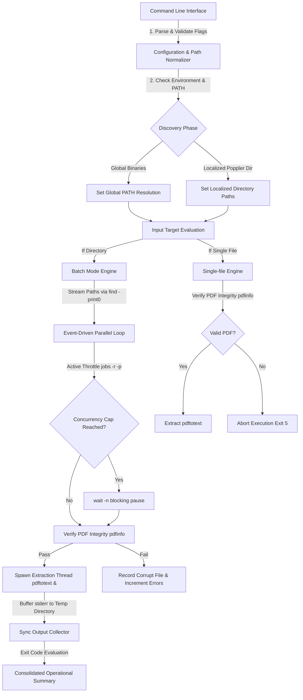

# System Architecture and Operational Documentation: `pdf_text-extractor.sh`
**Version:** 1.0.0  
**Classification:** Technical Specification & Deployment Guide

---

## 1. Application Overview and Objectives

The `pdf_text-extractor.sh` script is an high-performance utility designed to convert layout-preserved text from PDF documents into plain text (`.txt`) files. This tool serves as the ingestion and parsing pre-processor for further analysis.

<!-- OBJECTIVES INLINE CONTEXT:
  - Preserving spatial data: Strict preservation of physical layouts (-layout) is critical for structural parsing of tables, margins, and key-value grids (such as logs and reports).
  - Portability: Zero non-standard dependencies ensures that the utility runs in highly locked-down environments (including offline jump hosts, secure enclaves, and minimalist containers).
  - Scalability: The script must process thousands of large files without causing memory exhaustion, thread starvation, or resource leaks.
-->

### Core Objectives:
* **Physical Layout Preservation:** Utilizes Poppler's native extraction flags to preserve the exact columns, margins, and tabular structures of PDF outputs, ensuring key-value pairs and tabular data remain structurally intact.
* **Deterministic Execution & Safety:** Enforces strict execution safety margins to prevent silent failures, race conditions, or accidental data destruction on the filesystem.
* **Multi-Threaded Scalability:** Processes massive directories of documents concurrently by spawning parallel jobs capped automatically to system core counts, optimizing I/O and CPU throughput.
* **Universal Portability:** Avoids dynamic runtime runtimes (such as Python, Java, or Node.js) to minimize the server attack surface and dependency-chain risks. It executes natively in shell environments (Bash 4.3+) with standard POSIX binaries.

---

## 2. Architecture and Design Choices

The utility is architected as a lightweight, non-monolithic processing pipeline. Rather than incorporating heavy external libraries, it decouples the file discovery, process orchestration, and physical extraction into discrete, optimized OS boundaries.



### Design Assumptions:
* **POSIX-Compliant Environment:** Designed primarily for Unix-like environments (Linux, macOS, WSL) but fully optimized for Windows-emulated subsystems (Git Bash, MSYS2, Cygwin).
* **Poppler Suite:** Assumes the standard `pdftotext` and `pdfinfo` binaries are either deployed within a target directory (Poppler Home) or registered globally in the system `PATH`.

### Architecture & Engineering Decisions:
1. **In-Memory Path Normalization:** Avoids invoking subshells or spawning external utilities (e.g., `tr`, `sed`) inside helper loops. It uses Bash parameter expansion `"${path//\\//}"` to perform fast backslash-to-slash conversion entirely in memory, eliminating filesystem bottlenecks.
2. **Asynchronous Stream Ingestion & Memory Scale:** The discovery phase utilizes standard input streams (`find -print0` piped to `IFS= read -r -d ''`) to ingest file paths as an asynchronous stream, maintaining an $O(1)$ memory profile during discovery. To maintain sequence and aggregate exit statuses, PIDs and file metadata are stored in a Bash tracking array (`pids_and_names`), scaling memory usage linearly at $O(N)$ where $N$ is the number of processed files (highly efficient up to hundreds of thousands of files).
3. **Throttled Concurrency Scheduling:** Orchestrates parallel execution natively. It queries CPU counts dynamically (`nproc` or Windows `%NUMBER_OF_PROCESSORS%`, defaulting to `4`) and schedules background extractions (`&`). Concurrency limits are checked using `jobs -r -p`. On systems with Bash 4.3+, it executes a blocking `wait -n` for zero-polling CPU idle states, and falls back to a sub-second polling loop (`sleep 0.1`) if `wait -n` behaves unexpectedly or is unsupported.
4. **Buffered Stderr Streams (Log Isolation):** When multiple processes run concurrently, printing standard error logs to the console causes interleaved and corrupted output. To prevent this, the script buffers each extraction's `stderr` to a unique file inside a secure RAM-backed temporary directory (`/tmp` or similar) and outputs them sequentially and synchronously as each background process is collected.
5. **Non-Recursive Execution Constraint:** To prevent accidental recursive directory scans and excessive filesystem traversal, the directory batch mode uses `find -maxdepth 1` to target only the immediate files matching the glob pattern inside the source folder.
6. **Soft Dependency on Integrity Checker:** The `pdfinfo` utility is treated as an optional soft dependency. If `pdfinfo` is not found, the script gracefully bypasses the pre-extraction sanity check and relies entirely on the exit code of `pdftotext` to determine success or failure.

### Edge Cases Handled:
* **Single Trailing Slash Removal:** Stripping `/` from paths could turn the root directory into an empty string `""` and cause critical failures. The normalization engine checks `[ "$VAR" != "/" ]` defensively before performing suffix stripping.
* **Corrupted or Incomplete PDFs:** Spawning full extraction threads on invalid files wastes memory and threads. Upfront validation via `pdfinfo` catches file corruptions instantly before any parallel resources are allocated.
* **Strict Mode Array Traversal:** Under `set -u`, traversing an empty array triggers unbound variable errors. The script implements the safe expansion pattern `${pids[@]+"${pids[@]}"}` to ensure backwards compatibility with older Bash runtimes under strict validation.

---

## 3. Data Flow and Control Logic

The execution control flow proceeds through a deterministic state machine, ensuring high security and structural checking before, during, and after extraction.

### Operational Sequence:
1. **Bootstrap Phase:** Initializes environment constraints (`set -uo pipefail`) and verifies core POSIX binaries are available in `PATH`.
2. **Parsing Phase:** Evaluates options and strictly verifies that mandatory boundaries (like value arguments following flags) are respected.
3. **Verification Phase:** Confirms that mandatory inputs (`--source-pdf`, `--target-text`) are non-empty. If either is missing, it terminates and directs the user to `--help`.
4. **Resolution Phase:** Determines binary paths (localized vs global) and normalizes paths (removing trailing slashes).
5. **Mode Evaluation:** Route processing based on target file types:
   * **Single-file Mode:** Validates file readability, checks for safe-mode conflicts, performs integrity pre-checks via `pdfinfo`, and calls `pdftotext` synchronously.
   * **Batch/Directory Mode:** Evaluates CPU allocation limit, initializes temporary log buffers, traps exit signals for cleanup, streams paths through a concurrency scheduler, blocks on CPU saturation, gathers execution outputs sequentially, and issues a final operations summary.

### Control Logic Sequence Diagram:

```mermaid
sequenceDiagram
    autonumber
    actor Operator as Operator / Pipeline
    participant Script as Parent Script (pdf_text-extractor.sh)
    participant FS as Local Filesystem
    participant Info as pdfinfo (Sanity Check)
    participant Engine as pdftotext (Worker Engine)
    participant Temp as Temp Directory (RAM buffer)

    Operator->>Script: Execute (with args)
    Active Script
    Script->>FS: Verify system tools (find, dirname, mkdir, etc.)
    FS-->>Script: Tools present
    Script->>Script: Parse options & Verify mandatory boundaries
    alt Argument boundaries invalid / --help requested
        Script-->>Operator: Display help menu & exit
    end
    Script->>FS: Verify source file/directory existence
    FS-->>Script: Paths validated
    Script->>Script: Detect pdftotext & pdfinfo binary resolution (Global vs Local)
    
    alt MODE 1: Directory Batch Mode
        Script->>FS: ensure_directory (Target output folder)
        Script->>Script: Query system core count & Initialize Temp Buffer
        Script->>FS: Create Secure Temp Directory
        FS-->>Script: Temp directory path resolved
        Script->>Script: Register EXIT Trap for Temp Cleanup
        
        loop Stream matched PDFs (find -print0)
            FS-->>Script: File path stream (Null-separated)
            Script->>Script: Verify target file existence (Safe-mode check)
            alt Concurrency Cap Reached
                Script->>Script: wait -n / sleep 0.1 (Throttle CPU block)
            end
            
            critical Fast Integrity Pre-Check (If pdfinfo exists)
                Script->>Info: Execute pdfinfo - integrity check
                Info-->>Script: Return validation code
            end
            
            alt Pass Integrity (or pdfinfo missing)
                Script->>Engine: Spawn pdftotext worker in background (&)
                Active Engine
                Engine->>Temp: Buffer stderr to discrete file
                Script->>Script: Store PID and filename mappings
            else Fail Integrity
                Script->>Script: Log corrupt error & Increment failures
            end
        end
        
        loop Synchronous Job Collection
            Script->>Script: wait PID (Sequential process wait)
            Engine-->>Script: Worker process exits
            Deactive Engine
            Script->>Temp: Check buffer size (test -s)
            alt Buffer contains error data
                Temp-->>Script: Read error buffer
                Script-->>Operator: Output buffered error to stderr
            end
            Script->>Script: Aggregate final status & counters
        end
        Script->>FS: Execute EXIT Trap (rm -rf Temp Directory)
        FS-->>Script: Temp folder purged
        Script-->>Operator: Display Operation Summary Line & exit status
        
    else MODE 2: Single-File Mode
        Script->>FS: Verify source readability
        FS-->>Script: Read permissions confirmed
        Script->>Script: Resolve target output path (Custom name vs derived name)
        Script->>Script: Verify target existence (Safe-mode check)
        critical Fast Integrity Pre-Check (If pdfinfo exists)
            Script->>Info: Execute pdfinfo on single target file
            Info-->>Script: Return validation code
        end
        alt Pass Integrity (or pdfinfo missing)
            Script->>Engine: Execute pdftotext synchronously
            Engine-->>Script: Status return
            Script-->>Operator: Extraction successful
        else Fail Integrity
            Script-->>Operator: Error: corrupt/invalid PDF & Exit 5
        end
    end
    Deactive Script
```

---

## 4. Dependencies

The application relies strictly on standard Unix system utilities and the Poppler binary package. It requires no dynamic runtimes or external programming environments.

### 1. System Utilities (POSIX Compliance):
* **`bash` (v4.3+):** Execution shell (utilizes `set -uo pipefail` and `wait -n`).
* **`find`:** Scans directories asynchronously and outputs null-delimited paths (`-print0`).
* **`basename` & `dirname`:** Splits and derives filesystem paths.
* **`mkdir`:** Creates directories recursively (`-p`).
* **`mktemp`:** Allocates a secure, randomized temporary directory.
* **`jq` (v1.5+):** JSON processor used to construct, filter, and output structured, secure log strings in NDJSON format.

### 2. Extraction Core Engine (Poppler Utility Suite):
* **`pdftotext`:** Executable responsible for the actual text extraction. Requires support for the `-layout` option (maintains physical text margins and columns).
* **`pdfinfo` (Soft Dependency):** Executable used to inspect document headers and verify structural integrity before processing. If this utility is unavailable, integrity checks are bypassed gracefully, and failures are handled at the extraction step.

---

## 5. Security Assessment

This script has been architected to adhere to strict best practices guidelines and is hardened against standard runtime attack vectors.

### 1. Secrets and Authentication Configuration:
* **Zero Secret Storage:** The utility requires no system credentials, database tokens, API keys, or service account files.
* **Authentication Boundary:** Governed entirely by the operating system's native Access Control Lists (ACLs) and SSH/Execution parameters. No separate authentication framework is embedded, eliminating credential exposure vectors.

### 2. Encryption and Transport:
* **Encryption-in-Transit:** Not applicable as it is a localized filesystem processing tool. However, if the output `.txt` files are integrated into downstream services, they should be transmitted using secure protocols (e.g., SFTP, TLS 1.3, HTTPS).
* **Encryption-at-Rest:** The script writes output directly to the specified target directory. Architects should ensure that the underlying storage volume (such as AWS EBS volumes, local NVMe drives, or SAN volumes) utilizes AES-256 disk-level encryption.

### 3. Role-Based Access Control (RBAC) & Privileges:
* **Least Privilege Model:** The script **must never be run as root or Administrator**. It is fully designed to operate inside a standard, unprivileged user context.
* **Filesystem Isolation:** The execution account requires read permissions (`r`) strictly on the source directory, write permissions (`w`) on the target output directory, and execute permissions (`x`) on the Poppler binaries. It requires no write-level access to system folders or binary paths.

### 4. Vulnerability & Library Profile:
* **No External Package Vulnerabilities:** The script imports no external programming packages (e.g., PyPI, npm, Maven, or NuGet packages). This bypasses the vast majority of software supply-chain threats (such as Log4j, Prototype Pollution, or Remote Code Execution via third-party modules).
* **Runtime Hardening:** Variables are defensively quoted to prevent **Argument Injection** or **Command Injection** vectors.

---

## 6. Command Line Arguments

The application accepts command-line configuration using standard GNU long options.

| Argument | Mandatory | Parameter Type | Default Value | Functional Description |
| :--- | :---: | :---: | :---: | :--- |
| `-h`, `--help` | No | *None* | N/A | Displays the professionally formatted command usage menu, options, and operational examples, then terminates with exit status `0`. |
| `--source-pdf` | **Yes** | Path (File/Folder) | N/A | Specifies the input target on disk. Can point to a single PDF document or a folder containing multiple PDFs. Note: folders are processed non-recursively. |
| `--target-text` | **Yes** | Path (File/Folder) | N/A | Specifies the output destination. If `--source-pdf` is a folder, this must be an output folder. If single-file, this can be a custom `.txt` path. |
| `--poppler-path`| No | Path (Directory) | `"${POPPLER_HOME}"` | Root installation directory of Poppler containing `pdftotext` (and optionally `pdfinfo`). If omitted, checks `POPPLER_HOME` env variable, then falls back to global system `PATH`. |
| `--pattern` | No | Glob String | `*.pdf` | Case-insensitive glob expression (e.g., `*.PDF`, `doc_*.pdf`) used to filter files when in directory mode. |
| `--safe` | No | *None* | `false` | Activating this flag enforces overwrite prevention. The script will refuse to extract and will skip/abort if the output text file already exists. |
| `--json` | No | *None* | `false` | Formats all logs, warnings, errors, and operation summaries as Newline-Delimited JSON (NDJSON) output (requires the `jq` utility). |

---

## 7. Examples and Deployment Guide

The following sections provide real-world operational examples and exact command-terminal replicas.

### Scenario A: Global Environment Setup (Zero-Configuration)
In environments where Poppler is installed globally (e.g., using `apt install poppler-utils`), you do not need to specify `--poppler-path` or configure `POPPLER_HOME`.

#### Input Command:
```sh
./pdf_text-extractor.sh \
  --source-pdf /opt/data/source_pdfs \
  --target-text /opt/data/extracted_text \
  --pattern "*.pdf"
```

#### Terminal Log output:
```
Extracting: '/opt/data/source_pdfs/app_doc_q1.pdf' -> '/opt/data/extracted_text/app_doc_q1.txt'
Extracting: '/opt/data/source_pdfs/app_doc_q2.pdf' -> '/opt/data/extracted_text/app_doc_q2.txt'
Batch Extraction Completed: 2 file(s) found [2 succeeded, 0 skipped, 0 failed].
```

---

### Scenario B: Sandboxed Jump Host (Local Poppler Binaries with Safe Mode)
In highly locked-down environments, utilities are often uninstalled from the system path. Here, Poppler is executed from a secure localized storage area (`/opt/bin/poppler`), and we enforce the `--safe` flag to prevent overwriting existing data.

#### Input Command:
```sh
./pdf_text-extractor.sh \
  --source-pdf /var/data/reports \
  --target-text /var/data/text_outputs \
  --poppler-path /opt/bin/poppler \
  --safe
```

#### Terminal Log output (with preexisting safe-mode conflict & corrupt file skip):
```
Warning: Target file '/var/data/text_outputs/report_january.txt' already exists. Skipping (safe mode).
Error: PDF file '/var/data/reports/report_february.pdf' is corrupt or invalid. Skipping.
Extracting: '/var/data/reports/report_march.pdf' -> '/var/data/text_outputs/report_march.txt'
Batch Extraction Completed: 3 file(s) found [1 succeeded, 1 skipped, 1 failed].
```
*Note: The exit status of the above operation will be 5 because of the corrupted February report failure, allowing automatic alerting pipelines to flag the processing failure.*

---

### Scenario C: Single PDF Document Verification
When analyzing or testing individual files, a direct source-to-target path can be executed synchronously.

#### Input Command:
```sh
./pdf_text-extractor.sh \
  --source-pdf /var/data/reports/vault_policy.pdf \
  --target-text /var/data/text_outputs/vault_policy_extracted.txt
```

#### Terminal Log output:
```
Extracting: '/var/data/reports/vault_policy.pdf' -> '/var/data/text_outputs/vault_policy_extracted.txt'
```

#### Error Handling (Corrupt Single File):
```sh
./pdf_text-extractor.sh \
  --source-pdf /var/data/reports/corrupt_vault_policy.pdf \
  --target-text /var/data/text_outputs/corrupt_extracted.txt
```
```
Error: Source PDF '/var/data/reports/corrupt_vault_policy.pdf' is corrupt or invalid.
```
*(The process terminates instantly with exit code 5 before allocating conversion resources.)*

---

### Scenario D: Enterprise NDJSON Logging Integration
For seamless ingestion into Logstash, Fluentd, Splunk, or Datadog, the script supports structural Newline-Delimited JSON output streams via the `--json` flag.

#### Input Command:
```sh
./pdf_text-extractor.sh \
  --source-pdf /var/data/app_doc \
  --target-text /var/data/text_outputs \
  --safe \
  --json
```

#### Terminal Log output (NDJSON format on stdout/stderr streams):
```json
{"timestamp":"2026-06-24T15:38:10Z","level":"warn","event":"file_skip_existing","message":"Target file '/var/data/text_outputs/report_january.txt' already exists. Skipping (safe mode).","pdf_path":"/var/data/app_doc/report_january.pdf","target_path":"/var/data/text_outputs/report_january.txt"}
{"timestamp":"2026-06-24T15:38:11Z","level":"error","event":"file_corrupt","message":"PDF file '/var/data/app_doc/report_february.pdf' is corrupt or invalid. Skipping.","pdf_path":"/var/data/app_doc/report_february.pdf"}
{"timestamp":"2026-06-24T15:38:11Z","level":"info","event":"extraction_start","message":"Extracting: '/var/data/app_doc/report_march.pdf' -> '/var/data/text_outputs/report_march.txt'","pdf_path":"/var/data/app_doc/report_march.pdf","target_path":"/var/data/text_outputs/report_march.txt"}
{"timestamp":"2026-06-24T15:38:12Z","level":"info","event":"batch_summary","message":"Batch Extraction Completed: 3 file(s) found [1 succeeded, 1 skipped, 1 failed]."}
```
*Note: Diagnostic levels `"error"` and `"warn"` are cleanly piped to stderr, while `"info"` and `"summary"` route to stdout, respecting POSIX standard stream separation while preserving structured NDJSON formatting.*

---

## 8. Operational Exit Codes

For robust integration inside enterprise orchestration engines (e.g., Jenkins, Kubernetes CronJobs, Autosys, or GitLab CI), the script returns standard, self-healing granular exit codes.

| Exit Code | Severity | Classification | Description |
| :---: | :---: | :---: | :--- |
| **`0`** | Info | **Success** | All extractions completed flawlessly without error. |
| **`2`** | Warn | **CLI Configuration Error** | Invalid flags, missing mandatory inputs, or argument value boundaries validation failure. |
| **`3`** | Error | **Dependency Failure** | Standard POSIX dependencies (`find`, `mkdir`) or core execution engines (`pdftotext`, `pdfinfo`, `jq`) missing in the system `PATH` or localized directory. |
| **`4`** | Error | **Filesystem Input/Output Violation** | Input path does not exist, file/directory readability checks fail, or target write/safe-mode overwrite protection is triggered. |
| **`5`** | Error | **Partial / Integrity Failure** | Extraction process completed but one or more PDF documents were corrupt or failed processing. |
| **`6`** | Fatal | **Target Directory Allocation Error** | Parent shell was unable to recursively create (`mkdir -p`) or write to the target text folder path. |

