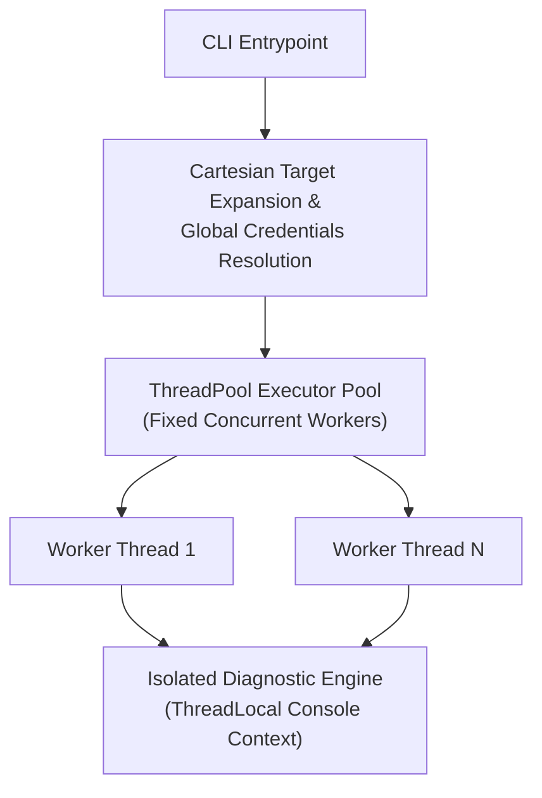
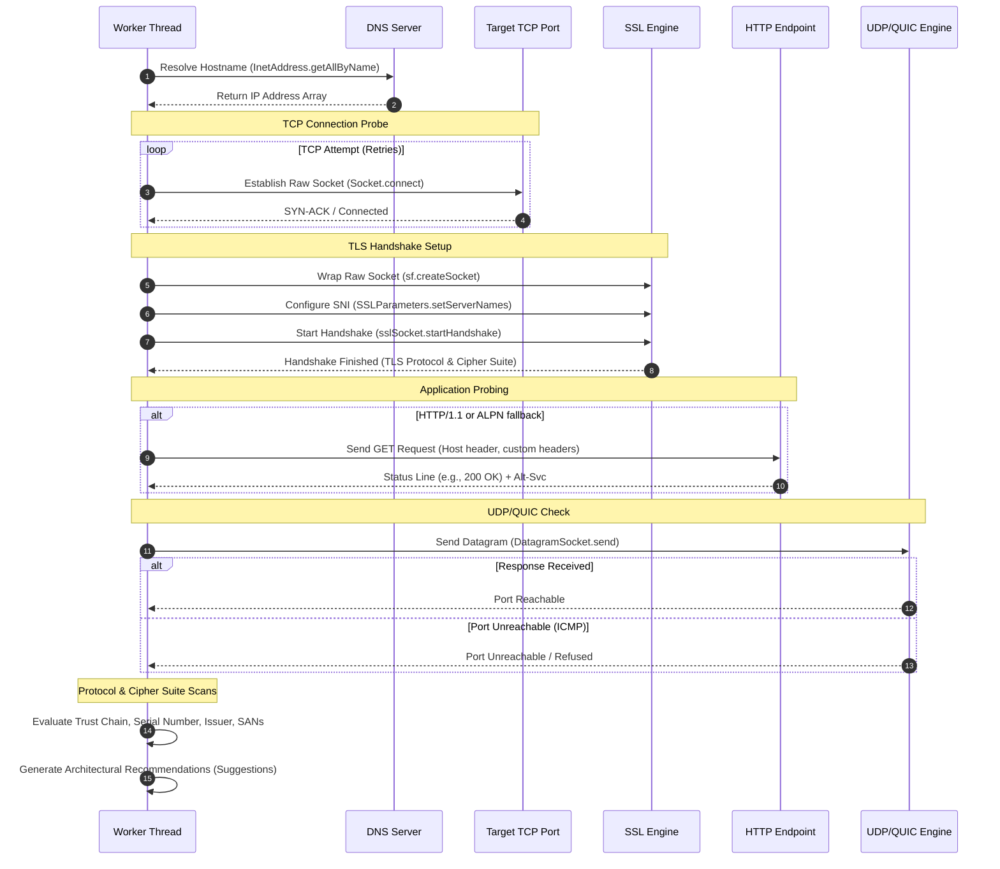

# JTLSTester - High-Performance Java TLS Diagnostics Utility

JTLSTester is a production-grade, single-binary TLS diagnostics utility written in Java. It is designed to verify, troubleshoot, and audit network paths, TLS handshakes, certificate chains, cipher configurations, session resumption, UDP/QUIC reachability, and application-level HTTP routing. The utility is engineered for high concurrency, zero external dependencies, and runtime compatibility spanning JDK 8 to JDK 25 on both Linux and Windows platforms.

---

## 1. Application Overview and Objectives

The primary objective of JTLSTester is to provide a low-footprint, command-line-driven diagnostic tool to probe network targets and verify their cryptographic safety. It operates as a troubleshooting agent when debugging connection dropouts, trust validation failures, misconfigured Server Name Indication (SNI), certificate expiration, or service degradation.

### Key Functional Objectives
* **Parallelized Target Probing**: Scale diagnostics across multiple targets concurrently using configurable thread pools.
* **Cartesian Probing Grid**: Support automated target grid expansion across combinations of hostnames and ports.
* **Cryptographic Auditing**: Enforce deep security validation of TLS protocols and cipher suites, scanning for obsolete protocols (SSLv3, TLS 1.0, TLS 1.1) and cryptographically weak ciphers (e.g., RC4, 3DES, null ciphers, non-PFS suites).
* **Certificate Chain Validation**: Inspect certificate validity windows, CN/SAN matches, validation chains, and structural order, capturing peer certificates even when handshakes fail.
* **Dual-Layer Diagnostics**: Prove socket layer reachability (including SOCKS/HTTP proxy routing and UDP/QUIC ICMP validation) as well as application-layer health via HTTP GET status assertions, ALPN verification, and Alt-Svc header extraction.
* **Structured Output Integration**: Supply tabular ANSI reports for humans, CSV exports for reporting, and comprehensive JSON outputs for integration into automated CI/CD and deployment pipelines.

---

## 2. Architecture and Design Choices

JTLSTester is designed to run in environments where installing heavy dependencies or native binaries is restricted. 



### 2.1 Single-Class Compilation Model
To ease distribution across secure segments, the utility is packed into a single source file (`JTLSTester.java`). Internal data transfer objects (`Target`, `TargetResult`, `ProtocolScanResult`) and supporting components (`SavingTrustManager`, `Console`) are implemented as nested classes.

### 2.2 Reflection-Based JDK Compatibility Layer
The utility maintains binary compatibility with Java 8 while dynamically leveraging advanced capabilities introduced in JDK 9 and above:
* **ALPN Negotiation**: Accesses `SSLSocket.getApplicationProtocol()` and `SSLParameters.setApplicationProtocols()` via reflection. On JDK 8 runtimes, these methods are bypassed gracefully, and fallback reports are generated without causing linkage errors.
* **OCSP Stapling**: Evaluates OCSP response payloads dynamically by querying `javax.net.ssl.ExtendedSSLSession.getStatusResponses()` using reflection, allowing stapling audits on systems where the JDK class hierarchies differ.

### 2.3 Concurrency and Console Isolation
The tool scales worker execution through an `ExecutorService` backed by a fixed thread pool. Because workers print real-time status updates, console output is coordinated via a `ThreadLocal<String>` context prefix. This prevents interleaving stdout operations while retaining target-specific trace lines when operating in verbose modes. A final `try-finally` block inside the execution engine guarantees context prefix clearance to prevent state leaks when pooled threads are recycled.

### 2.4 Defensive Resource Management
To avoid file descriptor exhaustion (a common failure mode on high-throughput Linux diagnostics), sockets are managed using strict lifecycle protocols:
* **Raw Socket Cleanup**: Connection logic inside `createConnectedSocket` connects a raw `java.net.Socket` before wrapping it in an `SSLSocket`. If the TLS handshake wrapping or SNI configuration throws an exception, the underlying TCP socket is closed in a defensive `catch` block before propagating the failure.
* **HTTP Stream Lifecycle**: The application-level probe uses nested try-with-resources blocks for `BufferedWriter` and `BufferedReader` stream wrappers. This guarantees that all JVM character buffers are flushed and network stream descriptors are closed cleanly.

### 2.5 Dynamic Credentials Lifecycle
When reading truststore or keystore passphrases, JTLSTester attempts to leverage native system masks via `System.console().readPassword()`. In headless/automated setups (e.g., Docker containers or Jenkins agents), the system falls back to standard input stream reads. It outputs a warning detailing heap string retention risks (since standard JVM strings cannot be programmatically zeroed) and recommends environment variables (`TLSTESTER_TRUSTSTORE_PASS` / `TLSTESTER_KEYSTORE_PASS`) for zero-retention automation.

---

## 3. Data Flow and Control Logic

### 3.1 Main Program Lifecycle
1. **Argument Parsing & Validation**: Enforces strict keyed parameter verification. Any positional arguments are rejected immediately to prevent command ambiguity.
2. **Cartesian Target Expansion**: Multi-value inputs (from `--hostname` and `--port`) are expanded into a Cartesian list of specific host-port execution nodes. URLs are resolved to their protocol ports (HTTPS to 443, HTTP to 80).
3. **Credentials Loading**: Custom keystores (for mTLS client certificates) and truststores are resolved from environments, secrets, or console inputs. Passwords are zeroed in memory immediately after keystore initialization.
4. **Task Dispatching**: Targets are submitted to the thread pool executor.
5. **Reporting**: Results are aggregated, compiled into a tabular dashboard, exported to CSV if requested, or serialized as JSON. If any target fails a TCP check, TLS handshake, or HTTP status code assertion, the application exits with status code `1`.

### 3.2 Target Diagnostic Sequence
For each target, a worker thread performs the following sequential actions:



---

## 4. Dependencies

JTLSTester enforces a **zero external dependency** design. It compiles directly against the standard Java Runtime Environment (JRE).

### Required Environment
* **Java Development Kit (JDK) / Java Runtime Environment (JRE)**: Version 8, 11, 17, 21, or 25.
* **Operating System**: Linux (CentOS/RHEL, Ubuntu/Debian, Alpine) or Microsoft Windows Server / Desktop.
* **Cryptographic Providers**: Standard JCE providers (e.g., SunJSSE) shipped with standard runtimes. Native OS keystores (like Keychain on macOS or Windows-MY on Windows) can be resolved if configured in local JRE profiles.

---

## 5. Build and Packaging

JTLSTester is compiled using standard Java Development Kit (JDK) compiler and archiver tools. Run the following commands from the utility source directory to compile and package the application:

### 5.1 Compilation
Compile the `JTLSTester.java` source file, directing output `.class` files into a dedicated `class` subdirectory. By default, this compiles using the host JRE/JDK's target settings. To enforce a specific backward-compatible runtime target (e.g. JDK 8 or JDK 11), utilize the `--release` parameter:
```bash
# Ensure target class output directory exists
mkdir -p class

# Compile using host JRE/JDK default settings
javac -d class JTLSTester.java

# Enforce a specific target release version (e.g., Java 8)
javac -d class --release 8 JTLSTester.java
```

### 5.2 Packaging the Executable Jar
Bundle the resulting compiled class files from the `class` directory and the `version.txt` metadata resource file into an executable JAR file, defining `JTLSTester` as the entrypoint:
```bash
# Ensure target output directory exists
mkdir -p bin

# Package classes from the class directory and the resource version.txt into bin/jtlstester.jar
jar cvfe bin/jtlstester.jar JTLSTester -C class . version.txt
```

### 5.3 Automated Quality Build Script (Linux & Windows Bash)
For automated build environments (Cygwin, MSYS2/Git Bash, or Linux), the project includes a unified `build_javacmd.sh` script.

To build the JTLSTester application using the automated quality build pipeline:

```bash
# Run the build for JTLSTester:
./build_javacmd.sh --src-file JTLSTester.java --main-class JTLSTester --jar-name jtlstester.jar --distrib $TMPDIR/distrib/ --purge-obj --archive
```

For detailed documentation on the build script parameters, architecture, and design, refer to [build_javacmd_README.md](build_javacmd_README.md).


---

## 6. Command Line Arguments

| Parameter | Alternate | Argument Type | Default Value | Description |
| :--- | :--- | :--- | :--- | :--- |
| `-e` | `--endpoint` | `String` (Host:Port) | *None* | Specifies a target server endpoint. Can be repeated. |
| `-u` | `--url` | `String` (URL) | *None* | Specifies a target URL to check. Can be repeated. |
| `-f` | `--file` | `String` (Path) | *None* | Loads targets from a file. Use `-` to read from stdin. |
| `--hostname` | *None* | `String` (CSV list) | *None* | Commas-separated list of hostnames. Expands with ports. |
| `-p` | `--port` | `String` (CSV list) | `443` | Target ports to pair with hostname list. |
| `--workers` | *None* | `Integer` | `4` | Number of concurrent execution threads in the pool. |
| `-t` | `--timeout` | `Integer` (ms) | `5000` | Socket connect and read timeout in milliseconds. |
| `-i` | `--retries` | `Integer` | `3` | Number of connection retry attempts on transient network failures. |
| `-c` | `--cert` | *Flag* | `false` | Prints the complete X509 certificate chain details. |
| `-r` | `--truststore` | `String` | *None* | Load truststore: format `<file>,<type>[,<passfile>]`. Type: `env`/`interactive`/`secret`. |
| `-K` | `--keystore` | `String` | *None* | Load client keystore: format `<file>,<type>[,<passfile>]`. Type: `env`/`interactive`/`secret`. |
| `--sni` | *None* | `String` | *Host* | Overrides the Server Name Indication (SNI) host header value. |
| `--no-sni` | *None* | *Flag* | `false` | Disables SNI configuration during the client hello. |
| `--debug-ssl` | *None* | *Flag* | `false` | Enables raw JVM SSL debug logs (`javax.net.debug=ssl,handshake`). |
| `--json` | *None* | *Flag* | `false` | Formats output as a serialized JSON array. Implies quiet mode. |
| `--proxy` | *None* | `String` (Host:Port) | *None* | Routes outbound calls through the specified proxy gateway. |
| `--proxy-type` | *None* | `String` | `http` | Type of proxy: `http` or `socks`. |
| `-l` | `--log` | `String` (Path) | *None* | Redirects console log output directly to the specified file path. |
| `-H` | `--header` | `String` | *None* | Appends custom headers to the HTTP probe (e.g. `Authorization: Bearer x`). |
| `--assert-status`| *None* | `String` (CSV list) | *None* | Enforces HTTP status validations (e.g., `200,301,302`). |
| `--csv` | *None* | `String` (Path) | *None* | Path to write the aggregated CSV report summary. |
| `--export-cert` | *None* | `String` (Prefix) | *None* | Export PEM certificates with prefix `<prefix>_<host>_<port>_<index>.crt`. |
| `-s` | `--scan` | *Flag* | `false` | Executes full cipher suite scanning against targets. |
| `-V` | `--verbose` | *Flag* | `false` | Prints low-level diagnostic logs and stack traces on error. |
| `-k` | `--insecure` | *Flag* | `false` | Disables certificate trust path verification. |
| `-d` | `--diagnose` | *Flag* | `false` | Dumps the host JRE security providers and cipher configurations. |
| `--color` | *None* | *Flag* | `auto` | Forces ANSI color output execution. |
| `--no-color` | *None* | *Flag* | *Env check* | Suppresses ANSI color output. Triggered automatically if `NO_COLOR` is present in env. |
| `-h` | `--help` | *Flag* | `false` | Prints the application help page. |
| `-v` | `--version` | *Flag* | `false` | Prints application version information. |

---

## 7. Detailed Examples

### 7.1 Basic Probing with Certificate Inspection
Execute a single target probe on default HTTPS port (443) and print the full X509 certificate chain:
```bash
java -jar bin/jtlstester.jar -e api.github.com:443 -c
```

### 7.2 Cartesian Expansion Probing with High Concurrency
Scan multiple hostnames across multiple ports concurrently using 8 threads:
```bash
java -jar bin/jtlstester.jar --hostname google.com,cloudflare.com,github.com -p 443,8443,8080 --workers 8
```

### 7.3 Automated CI Integration with HTTP Status Assertions and JSON Formatting
Query a specific URL endpoint, assert that the response returns either a `200 OK` or a `302 Redirect`, write results to a JSON array for logstash ingest, and verify return code logic:
```bash
java -jar bin/jtlstester.jar -u https://internal.corp/healthz --assert-status 200,302 --json > report.json
echo "Return Code: $?"
```

### 7.4 Client Certificate Authentication (mTLS) Diagnostics
Specify a custom client certificate (keystore) and an internal truststore to troubleshoot a mutual TLS tunnel. Read passphrases securely from password files:
```bash
java -jar bin/jtlstester.jar \
  -e internal-secure-gw.corp:8443 \
  -K /opt/certs/client.p12,secret,/run/secrets/key_pass.txt \
  -r /opt/certs/truststore.jks,secret,/run/secrets/trust_pass.txt
```

### 7.5 Full Suite Cipher Probing and Certificate Extraction
Perform a sequential cipher suite capability sweep of a server while writing the certificates out to disk:
```bash
java -jar bin/jtlstester.jar -e internal-loadbalancer.corp:443 -s --export-cert /tmp/certs/exported
```

### 7.6 Routed SOCKS Proxy Diagnostic Verification
Route diagnostics to an external endpoint via a local corporate bastion SOCKS proxy server:
```bash
java -jar bin/jtlstester.jar -e target-api.external.com:443 --proxy 10.0.1.200:1080 --proxy-type socks
```

### 7.7 Multi-Source Target Aggregation
Aggregate targets dynamically from standard input (stdin), URLs, and individual target host arguments:
```bash
echo "192.168.1.50:8443" | java -jar bin/jtlstester.jar -f - -e google.com:443 -u https://api.github.com/status
```

### 7.8 Customized HTTP API Verification with Headers and Assertions
Probe internal API routes requiring bearer token authentication and custom client headers, enforcing a strict 200 HTTP response code assertion:
```bash
java -jar bin/jtlstester.jar \
  -u https://api.internal.corp/v1/metrics \
  -H "Authorization: Bearer d3f4a9b8c7" \
  -H "X-Device-Id: JTLSTester-Prober" \
  --assert-status 200 \
  -V
```

### 7.9 SNI Host Routing Override Troubleshooting
Diagnose virtual host configurations by forcing custom Server Name Indication (SNI) routing headers, or disabling SNI entirely to evaluate default route fallbacks:
```bash
# Force custom SNI routing on an edge gateway
java -jar bin/jtlstester.jar -e edge-proxy.internal.corp:443 --sni app-service.internal.corp -c

# Disable SNI completely (omitting the server name extension from the Client Hello)
java -jar bin/jtlstester.jar -e edge-proxy.internal.corp:443 --no-sni -c
```

### 7.10 Bulk Infrastructure Audits with CSV Reporting and Trust Bypass
Orchestrate large-scale cryptographic discovery and TLS compliance sweeps across internal target nodes, executing with high concurrency, bypassing certificate validation warnings, performing sequential cipher scans, and outputting structured CSV metrics:
```bash
java -jar bin/jtlstester.jar \
  -f /etc/ops/endpoints.list \
  -p 443,8443,9443 \
  -k \
  -s \
  --workers 16 \
  -t 3000 \
  -i 2 \
  --csv /var/log/tls_audit_report.csv \
  --no-color \
  -l /var/log/tls_audit.log
```

#### Sample `/etc/ops/endpoints.list` Structure:
The target configuration loader skips empty lines and lines starting with `#`. Host entries without an inline port are combined with the ports provided via `-p` (Cartesian expansion), whereas entries with inline ports or protocol prefixes are parsed directly:
```text
# Core internal microservices (ports will be expanded via -p)
api.internal.corp
auth.internal.corp

# Direct IP targets (IPv4 and IPv6)
10.240.10.15
[fd00::10:240:10:15]

# Specific endpoint with explicit port override
app-server-01.internal.corp:8443

# Specific HTTP endpoint path probe
https://k8s-ingress.internal.corp/healthz
```


