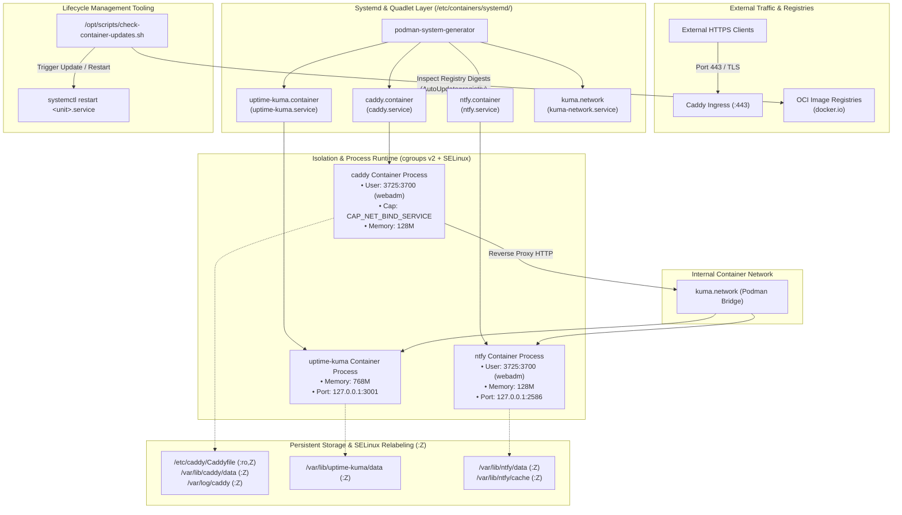
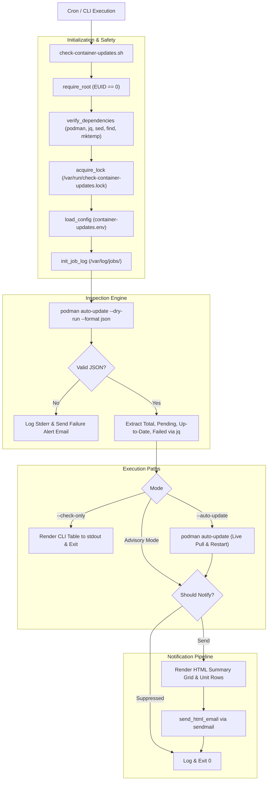
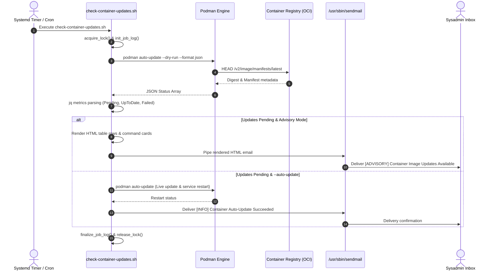
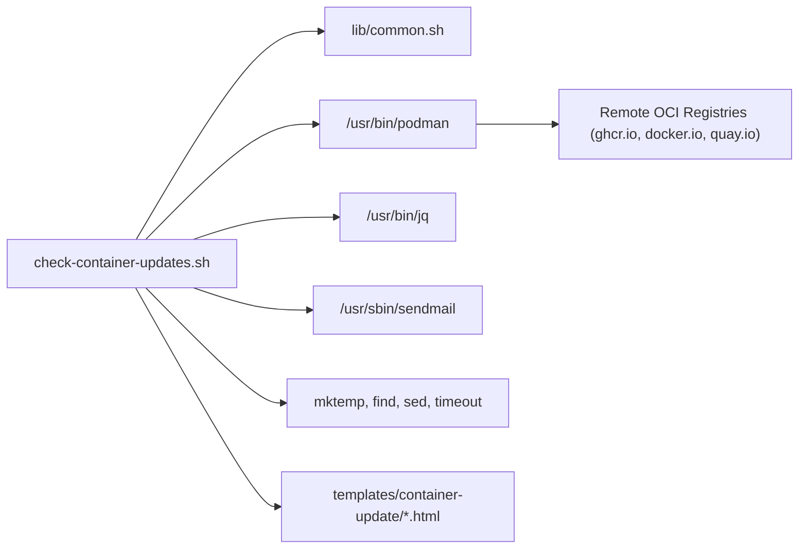
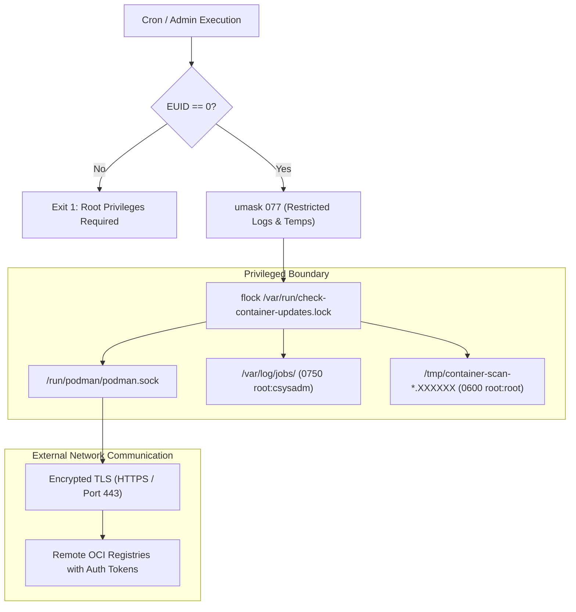

# `check-container-updates.sh` Documentation

Comprehensive operational and architecture guide for [`/opt/scripts/check-container-updates.sh`](file:///opt/scripts/check-container-updates.sh).

---

## 1. Application Overview and Objectives

[`check-container-updates.sh`](file:///opt/scripts/check-container-updates.sh) is a container lifecycle monitor and update automation tool designed for production Podman environments running systemd Quadlet container services.

### Key Objectives
* **Non-Intrusive Registry Inspection:** Inspect remote registries via `podman auto-update --dry-run` to detect newer container images without interrupting active workloads.
* **Controlled Human-in-the-Loop Advisory:** Assemble rich, branded HTML email reports detailing pending updates, container units, and rollback guidance for sysadmin review.
* **Automated Maintenance Mode:** Optionally pull updated images and trigger systemd container restarts automatically via `--auto-update`.
* **Execution Logging & Retention:** Maintain persistent, date-stamped execution logs in `/var/log/jobs/` with an automated 14-day log rotation policy.
* **Concurrency Locking:** Prevent overlapping execution across cron schedules using flock-based mutex guards.

---

## 2. Technical Note: Production Container Architecture (Podman Quadlets & Systemd)

The container runtime on this system implements Red Hat's **Podman Quadlet** architecture, integrating container workloads directly into native `systemd` process management without relying on a persistent, privileged daemon (such as `dockerd`).



### 1. Daemonless Architecture vs Traditional Docker
* **No Single Point of Failure:** Docker requires a long-running, privileged daemon (`dockerd`). If the daemon crashes or hangs, all running containers are impacted. Podman operates daemonless; each container is an independent child process of systemd via the OCI runtime (`crun`).
* **Audit & Security:** Systemd manages process IDs, cgroups, restarts, and resource tracking directly in kernel space. There is no socket hijacking risk (such as unauthorized access to `/var/run/docker.sock`).

### 2. The Systemd Quadlet Generator Framework
Quadlets translate declarative container configuration files into standard systemd service units at boot time or during `systemctl daemon-reload`.
* **Generator Location:** `/usr/lib/systemd/system-generators/podman-system-generator`
* **Configuration Directory:** `/etc/containers/systemd/`
* **Active Production Specifications on Host:**
  1. [`caddy.container`](file:///etc/containers/systemd/caddy.container): Manages the edge reverse proxy and TLS termination engine.
  2. [`uptime-kuma.container`](file:///etc/containers/systemd/uptime-kuma.container): Manages the application health monitoring service.
  3. [`ntfy.container`](file:///etc/containers/systemd/ntfy.container): Manages the HTTP-based push notification server.
  4. [`kuma.network`](file:///etc/containers/systemd/kuma.network): Declares the isolated user-defined container bridge network.

### 3. Automated Lifecycle Tracking (`AutoUpdate=registry`)
Every active `.container` unit declares:
```ini
[Container]
AutoUpdate=registry
```
* **How It Works:** Podman annotates the running container with the remote image reference (`docker.io/library/caddy:2-alpine`, etc.).
* **Dry-Run Inspection:** `podman auto-update --dry-run --format json` queries remote OCI registries via HTTP `HEAD` requests to inspect the latest image manifest digest. If the remote digest differs from the local digest, the container is flagged as `pending`.
* **Atomic Rollback:** If an updated image fails to start or pass its health check, Podman supports immediate recovery via `podman auto-update --rollback`.
* **Role of `check-container-updates.sh`:** Bridges this native Quadlet feature with operations by providing non-disruptive automated scanning, HTML advisory emails, and policy-driven execution.

### 4. Network Topology & Ingress Shielding
* **Isolated Bridge (`kuma.network`):** The containers communicate over an internal network bridge declared via `kuma.network`.
* **Zero Public Port Exposure for Backends:**
  - `uptime-kuma` publishes exclusively to `127.0.0.1:3001` (localhost only).
  - `ntfy` publishes exclusively to `127.0.0.1:2586` (localhost only).
  - Neither service is directly reachable from external networks or unauthenticated public clients.
* **Single Ingress Gateway:** Only `caddy` publishes port `443` publicly, handling automatic Let's Encrypt TLS certificate provisioning and reverse-proxying traffic to backend services.

### 5. Least-Privilege & Defense-in-Depth Security
* **Unprivileged User Context:** `caddy` and `ntfy` execute as `User=3725:3700` (`webadm:devops`) inside their respective containers, preventing container escapes from inheriting root access on the host.
* **Targeted Linux Capabilities:** To bind low-numbered port `443` without root, `caddy.container` retains only `AddCapability=CAP_NET_BIND_SERVICE`. All other root capabilities are dropped.
* **SELinux Labeling (`:Z` and `:ro,Z`):** Volumes are mounted with `:Z` to dynamically re-label directory contexts (`container_file_t`) for private container process isolation. Sensitive configuration files (e.g. `/etc/caddy/Caddyfile`) are mounted `:ro,Z` (read-only).
* **Cgroup Memory Limits:** Strict memory limits are enforced directly at the systemd slice level (`Memory=128M` for Caddy/Ntfy, `Memory=768M` for Uptime Kuma) to prevent runaway memory leaks from affecting the host.

---

## 3. Architecture and Design Choices, Assumptions, Edge Cases, Performance and Efficiency

### Architecture and Design Choices
* **Quadlet Standard Integration:** Leverages systemd Quadlet architecture (`.container` units with `AutoUpdate=registry`).
* **DRY Template Engine:** Employs modular HTML snippet templates located in [`templates/container-update/`](file:///opt/scripts/templates) and shared email layouts from [`lib/common.sh`](file:///opt/scripts/lib/common.sh).
* **Timeout Protection:** Encapsulates registry network operations within configurable timeouts (`timeout 900`) to prevent hanging processes during upstream registry latency.
* **Clean Trapped Scratch Space:** Uses `mktemp` with automated trap cleanup hooks (`register_cleanup`) to guarantee zero temporary file leakage.

### Assumptions
* Podman 4.0+ is installed and configured with Quadlet container units.
* The host has local MTA / `sendmail` configured for HTML email dispatch (or SMTP via mail transfer agent).
* Execution occurs with superuser privileges (`root`).

### Handled Edge Cases
* **Registry Network Outages:** If the inspection fails or times out, an alert email is dispatched containing the sanitized stderr output from the registry scan.
* **Malformed Output:** Validates that raw output conforms to valid JSON via `jq empty` before parsing.
* **Zero Pending Notifications:** Honors `--notify-new-only` to suppress emails when all containers are already running the latest image.
* **Rollback Guidance:** Every pending advisory email includes the exact shell commands required to apply the update and roll back if necessary.

### Architecture Diagram



---

## 4. Data Flow and Control Logic

### Sequence Diagram



---

## 5. Performance and Scalability

### Concurrency Model
* **File Locking Mutex:** Protects against overlapping runs via `acquire_lock` (using `flock` on `/var/run/check-container-updates.lock`). If a scan is already running, subsequent invocations exit immediately with a warning.
* **Network Throttling & Timeouts:** Wrapped in `timeout 900` to prevent stalled HTTP connections to remote OCI registries.
* **Transient Memory:** Streaming parsing via `jq` avoids memory bloat even when monitoring dozens of container services.

---

## 6. Dependencies

### Component Chart



### Dependency Inventory
| Dependency | Type | Source Package | Minimum Version | Purpose |
| :--- | :--- | :--- | :--- | :--- |
| `bash` | Interpreter | `bash` | 4.4+ | Script execution and strict error handling |
| `podman` | Container Engine | `podman` | 4.0+ | Container status and dry-run registry inspection |
| `jq` | JSON Processor | `jq` | 1.6+ | Extracting image digests and unit update statuses |
| `sendmail` | Mail Transport | `postfix` / `sendmail` | Any | HTML notification dispatch |
| `mktemp` | Temp Utility | `coreutils` | Any | Secure diagnostic file creation |
| `templates/` | Modular HTML | Repository Internal | 1.0.0+ | Summary cards, row badges, and layout templates |

---

## 7. Security Architecture



---

## 8. Security Assessment

* **Strict Umask Governance:** Sets `umask 077` at initialization. Temporary files (`mktemp`) and job log files are created strictly with `0600`/`0700` root permissions.
* **HTML Sanitization:** Raw container stderr outputs are passed through `escape_html()` before interpolation into email templates, preventing HTML/script injection in email clients.
* **Secret Isolation:** Uses Podman's built-in registry authentication credentials (`/root/.config/containers/auth.json`). No plaintext tokens or secrets exist in the script.
* **TLS Transport Security:** All registry interactions via Podman enforce TLS encryption (HTTPS/443).

---

## 9. Code Quality Assessment, Review, and Best Practices

* **Bash Strict Mode:** Built with `set -euo pipefail` and `shopt -u patsub_replacement`.
* **Zero Orphan Resource Leaks:** Trap handlers registered via `register_cleanup` ensure all temporary files created by `mktemp` are deleted upon exit, regardless of termination signals.
* **Config Overrides:** Supports external overrides via `/etc/devops/container-updates.conf` or `config/container-updates.env` while allowing CLI flags to override configuration files.

---

## 10. Command Line Arguments

| Argument | Type | Default | Description |
| :--- | :--- | :--- | :--- |
| `--check-only`, `--dry-run` | Flag | `0` | Prints scan results to stdout in a formatted terminal table without sending email. |
| `--auto-update` | Flag | `false` | Automatically pulls newer images and restarts Quadlet container services. |
| `--no-auto-update` | Flag | `false` | Explicitly disables auto-updates, overriding `AUTO_UPDATE="true"` from config. |
| `--notify-new-only` | Flag | `false` | Sends email only if new images are available; remains silent if all are up to date. |
| `--notify-all` | Flag | `true` | Sends notification email even if all images are up to date, overriding `NOTIFY_NEW_ONLY="true"` from config. |
| `--force`, `--test`, `--always-notify` | Flag | `0` | Forces sending notification email even if all container images are up to date. |
| `-h`, `--help` | Flag | N/A | Displays CLI usage documentation and exits `0`. |

---

## 11. Detailed Examples on How to Use and Deploy

### Manual Usage Examples

#### 1. Interactive Terminal Check (`--check-only`)
```bash
sudo /opt/scripts/check-container-updates.sh --check-only
```
**Sample Terminal Output:**
```text
[*] Starting Podman container update inspection on cs-us-pweb001.criticalsys.net...
[*] Mode: Dry-Run Inspection via 'podman auto-update --dry-run --format json'
[*] Scan complete: 3 services scanned | 0 updates pending | 3 up to date | 0 failed
================================================================================
SYSTEMD SERVICE                CONTAINER NAME            STATUS      
================================================================================
caddy.service                  caddy                     Up to Date  
uptime-kuma.service            uptime-kuma               Up to Date  
ntfy.service                   ntfy                      Up to Date  
================================================================================
Summary: 3 containers monitored, 0 updates available, 0 scan failures.
```

**Corresponding Production Execution Log (`/var/log/jobs/container-updates-20261002_180757.log`):**
```text
================================================================================
Execution Log: container-updates
Host:       cs-us-pweb001.criticalsys.net
Start Time: 2026-10-02 18:07:57 UTC
Script:     /opt/scripts/check-container-updates.sh
Arguments:  --check-only
User:       root (UID: 0)
PID:        109219
================================================================================
[2026-10-02 18:07:57 UTC] [*] Starting Podman container update inspection on cs-us-pweb001.criticalsys.net...
[2026-10-02 18:07:57 UTC] [*] Mode: Dry-Run Inspection via 'podman auto-update --dry-run --format json'
[2026-10-02 18:07:58 UTC] [*] Scan complete: 3 services scanned | 0 updates pending | 3 up to date | 0 failed

================================================================================
Execution Summary:
Status:     COMPLETED (Exit Code: 0)
End Time:   2026-10-02 18:07:58 UTC
Duration:   1s
Log File:   /var/log/jobs/container-updates-20261002_180757.log
================================================================================
```

#### 2. Run Scan with Notification Policy (`--notify-new-only`)
```bash
sudo /opt/scripts/check-container-updates.sh --notify-new-only
```
**Sample Output (When all containers are up to date):**
```text
[*] Starting Podman container update inspection on cs-us-pweb001.criticalsys.net...
[*] Mode: Dry-Run Inspection via 'podman auto-update --dry-run --format json'
[*] Scan complete: 3 services scanned | 0 updates pending | 3 up to date | 0 failed
[*] Notification policy: All 3 containers up to date. Suppressing email notification (--notify-new-only active).
```

#### 3. Automated Maintenance Execution (`--auto-update`)
```bash
sudo /opt/scripts/check-container-updates.sh --auto-update
```
**Sample Output:**
```text
[*] Starting Podman container update inspection on cs-us-pweb001.criticalsys.net...
[*] Scan complete: 3 services scanned | 1 updates pending | 2 up to date | 0 failed
[!] Policy Mode: AUTO_UPDATE enabled. Applying updates to pending containers...
Trying to pull docker.io/library/caddy:latest...
Restarting caddy.service...
[✓] Auto-update successfully completed.
[✓] Email notification successfully dispatched to criticalsys.mis@gmail.com.
```

---

### Automated Deployment

Deploy automated daily container update checks using systemd:

1. **Service Unit:** `/etc/systemd/system/container-updates.service`
   ```ini
   [Unit]
   Description=Podman Container Update Advisory Scan
   After=network-online.target

   [Service]
   Type=oneshot
   ExecStart=/opt/scripts/check-container-updates.sh --notify-new-only
   StandardOutput=journal
   StandardError=journal
   ```

2. **Timer Unit:** `/etc/systemd/system/container-updates.timer`
   ```ini
   [Unit]
   Description=Daily Podman Container Update Check Timer

   [Timer]
   OnCalendar=*-*-* 04:00:00
   RandomizedDelaySec=1800
   Persistent=true

   [Install]
   WantedBy=timers.target
   ```

3. **Activate:**
   ```bash
   sudo systemctl daemon-reload
   sudo systemctl enable --now container-updates.timer
   ```
