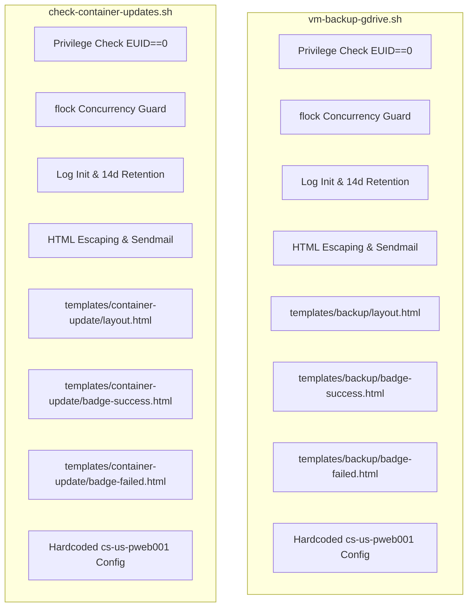
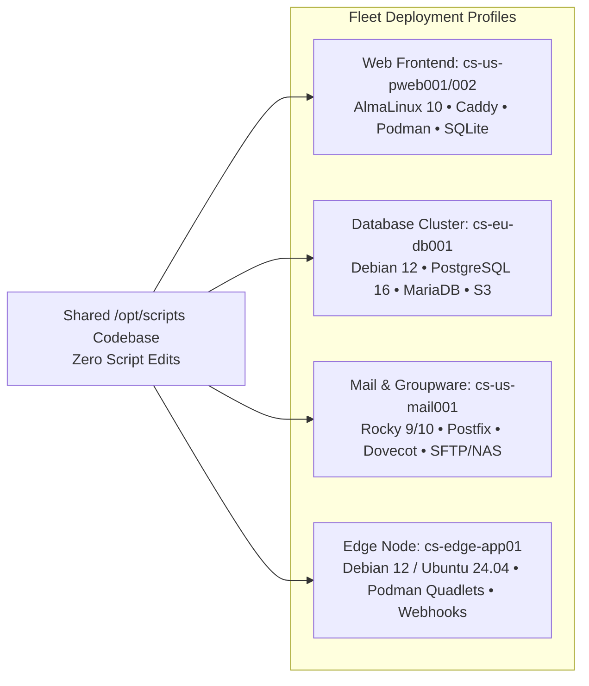

# DRY Architectural Refactoring Plan: DevOps Automation & Templates

**Host:** `cs-us-pweb001.criticalsys.net`  
**Date:** 2026-10-02  
**Target Scripts:**
- `/opt/scripts/vm-backup-gdrive.sh` (Nightly VM snapshot, GPG encryption, Google Drive dual-retention backup)
- `/opt/scripts/check-container-updates.sh` (Weekly Quadlet container update advisor & automation tool)
**Target Templates:**
- `/opt/scripts/templates/backup/*`
- `/opt/scripts/templates/container-update/*`

---

## 1. Executive Summary

Both `vm-backup-gdrive.sh` and `check-container-updates.sh` are production automation scripts operating on AlmaLinux 10 (`cs-us-pweb001.criticalsys.net`). They share the same operating environment, system privileges, notification recipient (`criticalsys.mis@gmail.com`), Postfix MTA delivery mechanism, audit requirements, and visual email design language.

Currently, **over 60% of the script logic and HTML template markup is duplicated** across these two tools. Furthermore, critical operational parameters (hostnames, remote storage targets, database paths, service filters, and mail recipients) are hardcoded directly into the script source code, making them rigid and tied exclusively to `cs-us-pweb001`.

This document outlines the complete architectural plan to eliminate redundancy and enable fleet-wide multi-host configurability across **Enterprise Linux (RHEL family: AlmaLinux 10/9, Rocky Linux, RHEL) and Debian family (Debian, Ubuntu)** systems through three core pillars:
1. **Shared Shell Library (`/opt/scripts/lib/common.sh`)**: Core primitives for privilege guards, concurrency locking, execution logging, HTML escaping, and MTA dispatch.
2. **Shared HTML Template System (`/opt/scripts/templates/shared/`)**: Component-based layout, status pills, and dark terminal output blocks.
3. **Externalized Multi-Host Property Configuration (`/opt/scripts/config/*.env`)**: Hierarchical, zero-touch property files enabling 100% code portability across any RHEL or Debian fleet server (`cs-us-pweb002`, `cs-eu-db001`, `cs-us-mail001`, etc.) without modifying a single line of script code.

---

## 2. Current vs. Target Architecture

### Current Redundant Model



### Proposed Consolidated Model

```mermaid
graph TD
    subgraph Configuration Layer [/opt/scripts/config/]
        CFG_COM[common.env<br/>Host FQDN, Mail, Log Defaults]
        CFG_BAK[vm-backup.env<br/>Targets, Retention, DBs, Roots]
        CFG_CNT[container-updates.env<br/>Engine, Auto-Update, Filters]
        CFG_SYS[/etc/devops/*.conf<br/>Optional Host Overrides]
    end

    subgraph Shared Core Library
        LIB[/opt/scripts/lib/common.sh]
        LIB --> F_CFG[load_config & validate]
        LIB --> F_LOCK[acquire_lock]
        LIB --> F_LOG[init_job_log / finalize_job_log / prune_logs]
        LIB --> F_MAIL[send_html_email / escape_html]
        LIB --> F_TMPL[render_template]
        LIB --> F_ENV[require_root / check_bash_compat]
    end

    subgraph Shared Template System
        T_SHR[/opt/scripts/templates/shared/]
        T_SHR --> T_BASE[base-layout.html]
        T_SHR --> T_SUCC[badge-success.html]
        T_SHR --> T_FAIL[badge-failed.html]
        T_SHR --> T_WARN[badge-warning.html]
        T_SHR --> T_TERM[terminal-card.html]
    end

    subgraph Scripts & Domain Modules
        S1[vm-backup-gdrive.sh]
        S2[check-container-updates.sh]
        S3[Future DevOps Scripts...]
    end

    subgraph Job-Specific Fragments
        T_BAK[/opt/scripts/templates/backup/]
        T_CNT[/opt/scripts/templates/container-update/]
    end

    CFG_SYS -. Overrides .-> LIB
    CFG_COM --> LIB
    CFG_BAK --> S1
    CFG_CNT --> S2
    S1 --> LIB
    S2 --> LIB
    S3 --> LIB
    S1 --> T_BAK
    S2 --> T_CNT
    T_BAK --> T_SHR
    T_CNT --> T_SHR
```

---

## 3. Detailed Redundancy Audit

### A. Shell Logic Redundancies

| Area | `vm-backup-gdrive.sh` | `check-container-updates.sh` | Consolidated Library Function |
| :--- | :--- | :--- | :--- |
| **Privilege Guard** | `[[ "${EUID}" -ne 0 ]]` | `[[ "${EUID}" -ne 0 ]]` | `require_root()` |
| **Bash 5.2 Compat** | `shopt -u patsub_replacement` | `shopt -u patsub_replacement` | Initialized automatically upon sourcing `lib/common.sh` |
| **CLI Dependency Checks** | Upfront checks for `tar`, `zstd`, `gpg`, `rclone`, etc. | Upfront checks for `podman`, `jq`, `sed`, etc. | `verify_dependencies "bin1" "bin2" ...` |
| **Concurrency Locking** | `flock -n 200` on `/run/lock/vm-backup.lock` | `flock -n 201` on `/run/lock/check-container-updates.lock` | `acquire_lock "$lock_name"` (uses dynamic `{LOCK_FD}`) |
| **Job Execution Logging** | `/var/log/backups/`, permissions `0750`/`0640`, group `devops` | `/var/log/jobs/`, permissions `0750`/`0640`, group `devops` | `init_job_log "$job_name" "$log_dir"` |
| **Execution Header** | Host, Start Time, Script, CLI Args, User/UID, PID | Host, Start Time, Script, CLI Args, User/UID, PID | `write_log_header()` |
| **Execution Summary** | Status, Exit Code, End Time, Duration, Log File Path | Status, Exit Code, End Time, Duration, Log File Path | `finalize_job_log "$exit_code" "$status_label"` |
| **Retention Pruning** | `find ... -mmin +... -delete` | `find ... -mmin +... -delete` | `prune_logs "$log_dir" "$pattern" "$retention_days"` |
| **HTML Entity Escaping** | `sed -e 's/&/\&amp;/g' -e 's/</\&lt;/g' ...` | `sed -e 's/&/\&amp;/g' -e 's/</\&lt;/g' ...` | `escape_html "$text"` (pipe & argument modes) |
| **Log/Email Manifest Filter** | Strips `=== Backed Up Files Manifest ===` | N/A (small logs) | `prepare_email_log "$log_file" "$max_lines"` |
| **Sendmail MIME Dispatch** | Lines 259–274 (MIME headers, Postfix pipe, status handling) | Lines 537–556 (MIME headers, Postfix pipe, status handling) | `send_html_email "$to" "$subject" "$html_body"` |
| **Signal & Cleanup Traps** | `trap cleanup EXIT INT TERM HUP` | `trap finish_log EXIT INT TERM HUP` | `register_cleanup "$cmd"` + auto `dispatch_cleanup` on `EXIT INT TERM HUP` |

### B. Template Redundancies

#### 1. Identical Byte-for-Byte Component Templates
* `templates/backup/badge-success.html` == `templates/container-update/badge-success.html` (269 bytes, 100% duplicate).
* `templates/backup/badge-failed.html` == `templates/container-update/badge-failed.html` (269 bytes, 100% duplicate).

#### 2. Layout Structure Duplication (~85% Shared Markup)
Both `layout.html` files define identical:
- Responsive email boilerplate (`<meta name="viewport">`, reset CSS, Outlook table workarounds).
- Typography stack (`Inter`, Apple system fonts, Segoe UI, Roboto, Ubuntu).
- Container card styling (`640px` max-width, `#ffffff` background, `12px` border radius, subtle box-shadow, `#f1f5f9` outer canvas).
- Top header with brand identity, job title, and right-aligned status pill badge slot (`{{STATUS_BADGE}}`).
- Bottom footer with host identity, check timestamp, log file path, and Postfix MTA credit.
- **The Only Variance:** The inner content block (`{{CONTENT_BODY}}`).

#### 3. Dark Terminal / Preformatted Component
Both templates render log outputs and command blocks in a dark terminal container:
- Background: `#0b1120`
- Border: `1px solid #1e293b`
- Border Radius: `8px`
- Font: SFMono, Consolas, Liberation Mono, Menlo, monospace (`11px`/`12px`)
- Color: `#e2e8f0`
- Overflow: Scrollable max-height (`280px` – `380px`) with word wrapping.

---

## 4. Target Directory Hierarchy

```text
/opt/scripts/
├── config/                              # Host-independent property / environment files
│   ├── common.env                       # Global host identity, alerting, and MTA defaults
│   ├── vm-backup.env                    # Backup paths, remotes, retention, DB lists, hooks
│   └── container-updates.env            # Container engine, auto-update policies, filters
│
├── lib/
│   └── common.sh                        # Centralized automation library
│
├── templates/
│   ├── job-skeleton.sh                  # Copy-paste starter boilerplate for rapid onboarding of new jobs
│   ├── shared/                          # Global reusable presentation components
│   │   ├── base-layout.html             # Master email layout shell
│   │   ├── badge-success.html           # Green status pill (✓ SUCCESS)
│   │   ├── badge-failed.html            # Red status pill (✕ FAILED)
│   │   ├── badge-warning.html           # Amber status pill (⚠️ ATTENTION / PENDING)
│   │   └── terminal-card.html           # Dark terminal output container
│   │
│   ├── backup/                          # Job-specific templates: VM Backup
│   │   └── summary-grid.html            # Key-Value snapshot metadata grid
│   │
│   └── container-update/                # Job-specific templates: Container Advisor
│       ├── table-row.html               # Quadlet table row component
│       ├── row-badge-updated.html       # Row status: updated
│       ├── row-badge-uptodate.html      # Row status: up to date
│       ├── row-badge-pending.html       # Row status: update pending
│       ├── row-badge-failed.html        # Row status: failed
│       ├── service-command-item.html    # Command snippet block
│       ├── instructions-pending.html    # Manual review instructions
│       ├── instructions-uptodate.html   # All up to date message
│       ├── instructions-autoupdate-success.html # Auto-update success details
│       ├── instructions-autoupdate-failed.html  # Auto-update failure details
│       ├── summary-pending.html         # Summary text: pending
│       ├── summary-uptodate.html        # Summary text: up to date
│       ├── summary-autoupdate-success.html # Summary text: auto success
│       └── summary-autoupdate-failed.html  # Summary text: auto failed
│
├── vm-backup-gdrive.sh                  # Domain-specific backup routine (~200 lines)
└── check-container-updates.sh           # Domain-specific container monitor (~250 lines)
```

---

## 5. Component Interface Specifications

### A. Shared Library Interface: `/opt/scripts/lib/common.sh`

```bash
#!/usr/bin/env bash
# ==============================================================================
# Library: /opt/scripts/lib/common.sh
# Purpose: Core infrastructure functions for DevOps automation scripts
# Host:    cs-us-pweb001.criticalsys.net
# ==============================================================================
set -euo pipefail
umask 077
shopt -u patsub_replacement 2>/dev/null || true

# Standard Environment Variables
COMMON_LIB_DIR="$(cd "$(dirname "${BASH_SOURCE[0]}")" && pwd)"
COMMON_SCRIPTS_DIR="$(dirname "${COMMON_LIB_DIR}")"
COMMON_CONFIG_DIR="${COMMON_SCRIPTS_DIR}/config"
COMMON_TEMPLATES_DIR="${COMMON_SCRIPTS_DIR}/templates"
SHARED_TEMPLATES_DIR="${COMMON_TEMPLATES_DIR}/shared"

DEFAULT_MAIL_TO="criticalsys.mis@gmail.com"
DEFAULT_SENDMAIL="/usr/sbin/sendmail"
SYS_HOSTNAME="$(hostname -f 2>/dev/null || hostname)"

# ------------------------------------------------------------------------------
# 1. Configuration & Privilege Guards
# ------------------------------------------------------------------------------
require_root() {
    if [[ "${EUID}" -ne 0 ]]; then
        echo "[-] Error: This script must be executed as root (or via sudo)." >&2
        exit 1
    fi
}

# Usage: verify_dependencies "tar" "zstd" "gpg" "rclone" "find"
verify_dependencies() {
    local missing=()
    for bin in "$@"; do
        if ! command -v "${bin}" >/dev/null 2>&1; then
            missing+=("${bin}")
        fi
    done
    if [[ ${#missing[@]} -gt 0 ]]; then
        log_msg "[-] Error: Missing required CLI dependencies: ${missing[*]}" 1 >&2
        return 1
    fi
    return 0
}

# Usage: load_config "vm-backup"
# Loads: /etc/devops/common.conf -> config/common.env -> /etc/devops/${name}.conf -> config/${name}.env
load_config() {
    local job_name="$1"

    # 1. Global system configuration
    for cfg in "/etc/devops/common.conf" "${COMMON_CONFIG_DIR}/common.env"; do
        if [[ -f "${cfg}" ]]; then
            # shellcheck source=/dev/null
            source "${cfg}"
            break
        fi
    done

    # 2. Job-specific configuration
    for cfg in "/etc/devops/${job_name}.conf" "${COMMON_CONFIG_DIR}/${job_name}.env"; do
        if [[ -f "${cfg}" ]]; then
            # shellcheck source=/dev/null
            source "${cfg}"
            break
        fi
    done

    # Apply defaults if unassigned
    SYS_HOSTNAME="${SYS_HOSTNAME:-$(hostname -f 2>/dev/null || hostname)}"
    MAIL_TO="${MAIL_TO:-${DEFAULT_MAIL_TO}}"
    MAIL_FROM="${MAIL_FROM:-Automation <do-not-reply@${SYS_HOSTNAME}>}"
    LOG_BASE_DIR="${LOG_BASE_DIR:-/var/log/jobs}"
    # Backward compatibility: preserve /var/log/backups for vm-backup if BACKUP_LOG_DIR is set
    [[ "${job_name}" == "vm-backup" && -n "${BACKUP_LOG_DIR:-}" ]] && LOG_BASE_DIR="${BACKUP_LOG_DIR}"
    LOG_RETENTION_DAYS="${LOG_RETENTION_DAYS:-14}"
    SYS_GROUP="${SYS_GROUP:-devops}"
}

# ------------------------------------------------------------------------------
# 2. Concurrency Locking
# ------------------------------------------------------------------------------
# Usage: acquire_lock "vm-backup"
acquire_lock() {
    local lock_name="${1:-script}"
    local lock_dir="/run/lock"
    [[ -w "${lock_dir}" ]] || lock_dir="/tmp"
    local lock_file="${lock_dir}/${lock_name}.lock"

    # Allocate dynamic file descriptor (Bash 4.1+) to prevent FD number collisions
    exec {LOCK_FD}>>"${lock_file}"
    if ! flock -n "${LOCK_FD}"; then
        echo "[-] Notice: Another instance of ${lock_name} is running. Exiting." >&2
        exit 0
    fi
}

# ------------------------------------------------------------------------------
# 3. Lifecycle, Cleanup Trap Dispatcher & Execution Logging
# ------------------------------------------------------------------------------
declare -a CLEANUP_HOOKS=()

# Usage: register_cleanup "rm -rf '${STAGING_DIR}'"
# Registers a cleanup command on the LIFO stack to execute upon script exit or signal.
register_cleanup() {
    CLEANUP_HOOKS+=("$*")
}

dispatch_cleanup() {
    local exit_code=$?
    trap - EXIT INT TERM HUP
    set +e

    # Execute registered cleanup handlers in reverse order (LIFO)
    for (( i=${#CLEANUP_HOOKS[@]}-1; i>=0; i-- )); do
        eval "${CLEANUP_HOOKS[i]}" 2>/dev/null || true
    done

    # Automatically finalize job execution log if initialized
    if [[ -n "${JOB_LOG_FILE:-}" && "${JOB_LOG_FINALIZED:-0}" -eq 0 ]]; then
        local status="COMPLETED"
        [[ "${exit_code}" -ne 0 ]] && status="FAILED"
        finalize_job_log "${exit_code}" "${status}"
    fi

    exit "${exit_code}"
}

# Automatically wire trap dispatcher upon sourcing lib/common.sh
trap dispatch_cleanup EXIT
trap "exit 130" INT
trap "exit 143" TERM
trap "exit 129" HUP

# Usage: init_job_log "job-name" "/var/log/jobs" 14
# Exports: JOB_LOG_FILE, JOB_START_TS, JOB_CHECK_TIME
init_job_log() {
    local job_name="$1"
    local log_dir="${2:-/var/log/jobs}"
    local retention_days="${3:-14}"

    JOB_NAME="${job_name}"
    JOB_LOG_DIR="${log_dir}"
    JOB_RETENTION_DAYS="${retention_days}"
    JOB_START_TS="$(date +%s)"
    JOB_DATE_STAMP="$(date +%Y%m%d_%H%M%S)"
    JOB_CHECK_TIME="$(date -u '+%Y-%m-%d %H:%M:%S UTC')"
    JOB_LOG_FILE="${JOB_LOG_DIR}/${job_name}-${JOB_DATE_STAMP}.log"
    JOB_LOG_FINALIZED=0

    mkdir -p "${JOB_LOG_DIR}"
    chmod 750 "${JOB_LOG_DIR}"
    chgrp devops "${JOB_LOG_DIR}" 2>/dev/null || true

    touch "${JOB_LOG_FILE}"
    chmod 640 "${JOB_LOG_FILE}"
    chgrp devops "${JOB_LOG_FILE}" 2>/dev/null || true

    cat <<EOF > "${JOB_LOG_FILE}"
================================================================================
Execution Log: ${job_name}
Host:       ${SYS_HOSTNAME}
Start Time: ${JOB_CHECK_TIME}
Script:     $0
Arguments:  ${CLI_ARGS:-"(none)"}
User:       $(id -un) (UID: ${EUID})
PID:        $$
================================================================================
EOF
}

log_msg() {
    local msg="$1"
    local to_stdout="${2:-1}"
    if [[ -n "${JOB_LOG_FILE:-}" && -f "${JOB_LOG_FILE}" ]]; then
        echo "[$(date -u '+%Y-%m-%d %H:%M:%S UTC')] ${msg}" >> "${JOB_LOG_FILE}"
    fi
    if [[ "${to_stdout}" -eq 1 ]]; then
        echo "${msg}"
    fi
}

finalize_job_log() {
    if [[ "${JOB_LOG_FINALIZED:-0}" -eq 1 ]]; then
        return 0
    fi
    JOB_LOG_FINALIZED=1
    local exit_code="${1:-0}"
    local status_msg="${2:-COMPLETED}"
    local end_ts
    end_ts="$(date +%s)"
    local duration=$(( end_ts - JOB_START_TS ))

    if [[ -n "${JOB_LOG_FILE:-}" && -f "${JOB_LOG_FILE}" ]]; then
        cat <<EOF >> "${JOB_LOG_FILE}"

================================================================================
Execution Summary:
Status:     ${status_msg} (Exit Code: ${exit_code})
End Time:   $(date -u '+%Y-%m-%d %H:%M:%S UTC')
Duration:   ${duration}s
Log File:   ${JOB_LOG_FILE}
================================================================================
EOF
    fi

    # Enforce retention policy
    if [[ -d "${JOB_LOG_DIR}" ]]; then
        find "${JOB_LOG_DIR}" -type f -name "${JOB_NAME}-*.log" -mmin "+$(( JOB_RETENTION_DAYS * 1440 ))" -delete 2>/dev/null || true
        find "${JOB_LOG_DIR}" -xtype l -delete 2>/dev/null || true
    fi
}

# ------------------------------------------------------------------------------
# 4. HTML Utilities & Template Engine
# ------------------------------------------------------------------------------
escape_html() {
    local input
    if [[ $# -gt 0 ]]; then
        input="$1"
    else
        input="$(cat)"
    fi
    sed -e 's/&/\&amp;/g' -e 's/</\&lt;/g' -e 's/>/\&gt;/g' -e 's/"/\&quot;/g' <<< "${input}"
}

# Prepares log content for email body:
# 1. Strips verbose manifest blocks (e.g. === Backed Up Files Manifest ===)
# 2. Truncates to max_lines to avoid Gmail clipping
# 3. HTML-escapes special characters
prepare_email_log() {
    local log_file="$1"
    local max_lines="${2:-400}"

    if [[ ! -s "${log_file}" ]]; then
        echo "No logs were captured during this execution."
        return 0
    fi

    local log_filtered
    log_filtered=$(sed '/^=== Backed Up Files Manifest/,/^=== End of Backed Up Files Manifest/d' "${log_file}")
    local total_lines
    total_lines=$(wc -l <<< "${log_filtered}")

    local log_display
    if (( total_lines > max_lines )); then
        log_display="[... Output truncated. Showing last ${max_lines} of ${total_lines} lines ...]"$'\n'
        log_display+=$(tail -n "${max_lines}" <<< "${log_filtered}")
    else
        log_display="${log_filtered}"
    fi

    escape_html "${log_display}"
}

render_template() {
    local tmpl_file="$1"
    shift
    if [[ ! -f "${tmpl_file}" ]]; then
        log_msg "[-] Error: Template file not found: ${tmpl_file}" 1 >&2
        return 1
    fi
    local content
    content="$(cat "${tmpl_file}")"
    while [[ $# -ge 2 ]]; do
        local key="$1"
        local val="$2"
        shift 2
        content="${content//\{\{${key}\}\}/${val}}"
    done
    echo "${content}"
}

get_status_badge() {
    local status_type="$1" # success | failed | warning
    local icon="$2"
    local label="$3"
    local tmpl="${SHARED_TEMPLATES_DIR}/badge-${status_type}.html"
    if [[ -f "${tmpl}" ]]; then
        local badge
        badge="$(cat "${tmpl}")"
        badge="${badge//\{\{STATUS_ICON\}\}/${icon}}"
        badge="${badge//\{\{STATUS_LABEL\}\}/${label}}"
        echo "${badge}"
    else
        echo "[${icon} ${label}]"
    fi
}

# ------------------------------------------------------------------------------
# 5. Email Notification Dispatch
# ------------------------------------------------------------------------------
send_html_email() {
    local to="${1:-${DEFAULT_MAIL_TO}}"
    local from="${2}"
    local subject="${3}"
    local body="${4}"
    local x_header="${5:-X-DevOps-Job: ${JOB_NAME:-automation}}"

    if [[ ! -x "${DEFAULT_SENDMAIL}" ]]; then
        log_msg "[-] Error: sendmail binary not found at ${DEFAULT_SENDMAIL}" 1 >&2
        return 1
    fi

    "${DEFAULT_SENDMAIL}" -t -oi <<EOF
From: ${from}
To: ${to}
Subject: ${subject}
MIME-Version: 1.0
Content-Type: text/html; charset=UTF-8
Auto-Submitted: auto-generated
${x_header}

${body}
EOF
}
```

---

### B. Shared Master Layout: `/opt/scripts/templates/shared/base-layout.html`

```html
<!DOCTYPE html>
<html lang="en">
<head>
  <meta charset="UTF-8">
  <meta name="viewport" content="width=device-width, initial-scale=1.0">
  <title>{{SUBJECT}}</title>
  <style>
    body { margin: 0; padding: 0; background-color: #f1f5f9; font-family: -apple-system, BlinkMacSystemFont, 'Segoe UI', Roboto, Helvetica, Arial, sans-serif; }
    table { border-spacing: 0; }
    td { padding: 0; }
  </style>
</head>
<body style="margin: 0; padding: 24px 12px; background-color: #f1f5f9; -webkit-font-smoothing: antialiased;">
  <table role="presentation" width="100%" border="0" cellpadding="0" cellspacing="0">
    <tr>
      <td align="center">
        <table role="presentation" width="100%" border="0" cellpadding="0" cellspacing="0" style="max-width: 860px; background-color: #ffffff; border-radius: 12px; overflow: hidden; border: 1px solid #e2e8f0; box-shadow: 0 4px 6px -1px rgba(0, 0, 0, 0.05), 0 2px 4px -2px rgba(0, 0, 0, 0.05);">
          
          <!-- Header -->
          <tr>
            <td style="background-color: #0f172a; padding: 24px 28px; text-align: left;">
              <table role="presentation" width="100%" border="0" cellpadding="0" cellspacing="0">
                <tr>
                  <td>
                    <div style="color: #38bdf8; font-size: 11px; font-weight: 700; text-transform: uppercase; letter-spacing: 0.1em; margin-bottom: 4px;">{{SERVICE_CATEGORY}}</div>
                    <h1 style="color: #ffffff; margin: 0; font-size: 20px; font-weight: 700; line-height: 1.3;">{{JOB_TITLE}}</h1>
                  </td>
                  <td align="right" valign="middle">
                    {{STATUS_BADGE}}
                  </td>
                </tr>
              </table>
            </td>
          </tr>

          <!-- Primary Content Slot (Summary Grid or Container Table) -->
          <tr>
            <td style="padding: 24px 28px 12px 28px;">
              {{CONTENT_BODY}}
            </td>
          </tr>

          <!-- Optional Action / Instruction Slot (Empty string if not applicable) -->
          {{ACTION_BLOCK}}

          <!-- Optional Dark Terminal Card Slot (Empty string if not applicable) -->
          {{TERMINAL_BLOCK}}

          <!-- Standard Footer -->
          <tr>
            <td style="background-color: #f8fafc; border-top: 1px solid #e2e8f0; padding: 14px 28px; text-align: center;">
              <p style="margin: 0; font-size: 11px; color: #94a3b8;">
                Dispatched by local Postfix MTA on <strong>{{HOST_NAME}}</strong> &bull; {{EXECUTION_TIME}} &bull; Log: <code>{{LOG_FILE_PATH}}</code>
              </p>
            </td>
          </tr>

        </table>
      </td>
    </tr>
  </table>
</body>
</html>
```

---

### C. Shared Dark Terminal Component: `/opt/scripts/templates/shared/terminal-card.html`

Used uniformly across all scripts for execution logs, raw scans, or diagnostic command outputs:

```html
<tr>
  <td style="padding: 12px 28px 24px 28px;">
    <h2 style="font-size: 13px; text-transform: uppercase; letter-spacing: 0.06em; color: #64748b; margin: 0 0 10px 0; font-weight: 700;">
      {{TERMINAL_TITLE}} <span style="font-size: 11px; font-weight: 400; color: #94a3b8; text-transform: none;">{{TERMINAL_SUBTITLE}}</span>
    </h2>
    <div style="background-color: #0b1120; border: 1px solid #1e293b; border-radius: 8px; padding: 14px 16px; overflow: hidden;">
      <pre style="margin: 0; font-family: 'SFMono-Regular', Consolas, 'Liberation Mono', Menlo, Courier, monospace; font-size: 11px; line-height: 1.5; color: #e2e8f0; white-space: pre-wrap; word-break: break-all; max-height: 380px; overflow-y: auto;">{{TERMINAL_CONTENT}}</pre>
    </div>
  </td>
</tr>
```

---

### D. Shared Status Badge Pills: `/opt/scripts/templates/shared/`

Identical component badge markup eliminating duplicate files:

* **`badge-success.html`** (Green):
  ```html
  <span style="display: inline-block; background-color: #d1fae5; color: #065f46; font-size: 12px; font-weight: 700; padding: 6px 14px; border-radius: 9999px; text-transform: uppercase; letter-spacing: 0.05em; white-space: nowrap;">{{STATUS_ICON}} {{STATUS_LABEL}}</span>
  ```
* **`badge-failed.html`** (Red):
  ```html
  <span style="display: inline-block; background-color: #fee2e2; color: #991b1b; font-size: 12px; font-weight: 700; padding: 6px 14px; border-radius: 9999px; text-transform: uppercase; letter-spacing: 0.05em; white-space: nowrap;">{{STATUS_ICON}} {{STATUS_LABEL}}</span>
  ```
* **`badge-warning.html`** (Amber / Attention / Review):
  ```html
  <span style="display: inline-block; background-color: #fef3c7; color: #92400e; font-size: 12px; font-weight: 700; padding: 6px 14px; border-radius: 9999px; text-transform: uppercase; letter-spacing: 0.05em; white-space: nowrap;">{{STATUS_ICON}} {{STATUS_LABEL}}</span>
  ```

---

### E. Job-Specific Content Fragment: `/opt/scripts/templates/backup/summary-grid.html`

Injected into `{{CONTENT_BODY}}` for VM snapshot reports:

```html
<h2 style="font-size: 13px; text-transform: uppercase; letter-spacing: 0.06em; color: #64748b; margin: 0 0 14px 0; font-weight: 700;">Backup Summary</h2>
<table role="presentation" width="100%" border="0" cellpadding="0" cellspacing="0" style="border-collapse: separate; border-spacing: 0 6px;">
  <tr>
    <td style="width: 26%; padding: 9px 12px; background-color: #f8fafc; border-radius: 6px 0 0 6px; font-size: 13px; color: #64748b; font-weight: 600;">Host</td>
    <td style="padding: 9px 12px; background-color: #f8fafc; border-radius: 0 6px 6px 0; font-size: 13px; color: #0f172a; font-weight: 600; font-family: ui-monospace, Menlo, Consolas, monospace;">{{HOST_NAME}}</td>
  </tr>
  <tr>
    <td style="padding: 9px 12px; background-color: #f8fafc; border-radius: 6px 0 0 6px; font-size: 13px; color: #64748b; font-weight: 600;">Archive Name</td>
    <td style="padding: 9px 12px; background-color: #f8fafc; border-radius: 0 6px 6px 0; font-size: 13px; color: #0f172a; font-family: ui-monospace, Menlo, Consolas, monospace;">{{ARCHIVE_NAME}}</td>
  </tr>
  <tr>
    <td style="padding: 9px 12px; background-color: #f8fafc; border-radius: 6px 0 0 6px; font-size: 13px; color: #64748b; font-weight: 600;">Archive Size</td>
    <td style="padding: 9px 12px; background-color: #f8fafc; border-radius: 0 6px 6px 0; font-size: 13px; color: #0f172a; font-weight: 600;">{{ARCHIVE_SIZE}}</td>
  </tr>
  <tr>
    <td style="padding: 9px 12px; background-color: #f8fafc; border-radius: 6px 0 0 6px; font-size: 13px; color: #64748b; font-weight: 600;">Remote Target</td>
    <td style="padding: 9px 12px; background-color: #f8fafc; border-radius: 0 6px 6px 0; font-size: 13px; color: #0f172a; font-family: ui-monospace, Menlo, Consolas, monospace;">{{TARGET_REMOTE}}</td>
  </tr>
  <tr>
    <td style="padding: 9px 12px; background-color: #f8fafc; border-radius: 6px 0 0 6px; font-size: 13px; color: #64748b; font-weight: 600;">Execution Window</td>
    <td style="padding: 9px 12px; background-color: #f8fafc; border-radius: 0 6px 6px 0; font-size: 13px; color: #0f172a;">{{START_TIME}} &rarr; {{END_TIME}}</td>
  </tr>
  <tr>
    <td style="padding: 9px 12px; background-color: #f8fafc; border-radius: 6px 0 0 6px; font-size: 13px; color: #64748b; font-weight: 600;">Duration</td>
    <td style="padding: 9px 12px; background-color: #f8fafc; border-radius: 0 6px 6px 0; font-size: 13px; color: #0f172a; font-weight: 600;">{{DURATION}}</td>
  </tr>
  <tr>
    <td style="padding: 9px 12px; background-color: #f8fafc; border-radius: 6px 0 0 6px; font-size: 13px; color: #64748b; font-weight: 600;">Retention Policy</td>
    <td style="padding: 9px 12px; background-color: #f8fafc; border-radius: 0 6px 6px 0; font-size: 13px; color: #0f172a;">{{RETENTION_DAYS}}</td>
  </tr>
</table>
```

---

### F. Standard Job Starter Skeleton: `/opt/scripts/templates/job-skeleton.sh`

This standardized skeleton provides a fully working, production-ready boilerplate for any new automated task on the host or across the fleet. It pre-wires all core capabilities:
- Bash 5.2 safety (`set -euo pipefail`, `umask 077`)
- Automatic discovery and sourcing of `/opt/scripts/lib/common.sh`
- Standard CLI flag parsing (`--help`, `--dry-run`, `--verbose`, `--no-mail`)
- Privilege guard (`require_root`), CLI dependency verification (`verify_dependencies`)
- Configuration loading (`load_config`) and dynamic non-blocking concurrency locking (`acquire_lock`)
- Lifecycle logging (`init_job_log`) and automated log retention pruning
- Dynamic resource cleanup registration (`register_cleanup`)
- Automated exit & signal trap handling (`dispatch_cleanup`)
- Production HTML email alerts using `base-layout.html`, status badges, and `terminal-card.html`

```bash
#!/usr/bin/env bash
# ==============================================================================
# Script:      templates/job-skeleton.sh
# Description: Production starter template for new DevOps automated jobs.
# Author:      DevOps Team <criticalsys.mis@gmail.com>
# Standard:    DRY Automation Architecture (lib/common.sh)
# ==============================================================================
set -euo pipefail
umask 077

# Job Metadata
JOB_NAME="job-skeleton"
JOB_TITLE="DevOps Job Skeleton"
SERVICE_CATEGORY="SYSTEM AUTOMATION"

# ------------------------------------------------------------------------------
# 1. CLI Options & Help Display
# ------------------------------------------------------------------------------
DRY_RUN=0
VERBOSE=0
SEND_MAIL=1

show_help() {
    cat <<EOF
Usage: $(basename "$0") [OPTIONS]

Description:
  ${JOB_TITLE} starter template complying with DevOps DRY automation standards.

Options:
  -n, --dry-run     Simulate actions without executing mutations
  -v, --verbose     Enable verbose operational logging
  --no-mail         Suppress email report dispatch
  -h, --help        Display this help message and exit

Configuration:
  Loads /etc/devops/${JOB_NAME}.conf and config/${JOB_NAME}.env
EOF
}

while [[ $# -gt 0 ]]; do
    case "$1" in
        -n|--dry-run)
            DRY_RUN=1
            shift
            ;;
        -v|--verbose)
            VERBOSE=1
            shift
            ;;
        --no-mail)
            SEND_MAIL=0
            shift
            ;;
        -h|--help)
            show_help
            exit 0
            ;;
        *)
            echo "[-] Unknown option: $1" >&2
            show_help >&2
            exit 1
            ;;
    esac
done

# ------------------------------------------------------------------------------
# 2. Environment & Library Initialization
# ------------------------------------------------------------------------------
SCRIPT_DIR="$(cd "$(dirname "${BASH_SOURCE[0]}")" && pwd)"
LIB_COMMON="${SCRIPT_DIR}/../lib/common.sh"
[[ -f "${LIB_COMMON}" ]] || LIB_COMMON="${SCRIPT_DIR}/lib/common.sh"

if [[ ! -f "${LIB_COMMON}" ]]; then
    echo "[-] Fatal Error: Shared library not found (checked ${SCRIPT_DIR}/../lib/common.sh and ${SCRIPT_DIR}/lib/common.sh)" >&2
    exit 1
fi
# shellcheck source=/dev/null
source "${LIB_COMMON}"

# ------------------------------------------------------------------------------
# 3. Guards, Configuration & Concurrency Lock
# ------------------------------------------------------------------------------
# Enforce root privileges if this job modifies system state
require_root

# Verify required CLI dependencies before acquiring locks or allocating resources
verify_dependencies "awk" "sed" "date" "find"

# Load external configuration hierarchy (system-wide and local property files)
load_config "${JOB_NAME}"

# Concurrency lock (prevents overlapping scheduled executions)
acquire_lock "${JOB_NAME}"

# Initialize structured execution log (/var/log/jobs/${JOB_NAME}-YYYYMMDD_HHMMSS.log)
init_job_log "${JOB_NAME}" "${LOG_BASE_DIR:-/var/log/jobs}" "${LOG_RETENTION_DAYS:-14}"

# ------------------------------------------------------------------------------
# 4. Workspace & Cleanup Hooks Registration
# ------------------------------------------------------------------------------
# Allocate temporary working directories or scratch files
WORK_DIR="$(mktemp -d "/tmp/${JOB_NAME}.XXXXXX")"
register_cleanup "rm -rf '${WORK_DIR}'"

# ------------------------------------------------------------------------------
# 5. Core Job Execution
# ------------------------------------------------------------------------------
log_msg "[*] Starting ${JOB_TITLE} on ${SYS_HOSTNAME}..."
log_msg "[*] Dry-run: $(( DRY_RUN == 1 ? 'YES' : 'NO' )), Work directory: ${WORK_DIR}"

JOB_STATUS="SUCCESS"
EXIT_CODE=0

# Place your domain-specific job logic here:
# Example:
# if ! do_work; then
#     log_msg "[-] Error encountered during work execution."
#     JOB_STATUS="FAILED"
#     EXIT_CODE=1
# fi

log_msg "[✓] Task completed successfully."

# ------------------------------------------------------------------------------
# 6. Optional Notification Dispatch (HTML Email)
# ------------------------------------------------------------------------------
if [[ "${SEND_MAIL}" -eq 1 ]]; then
    log_msg "[*] Preparing email notification..."

    # Determine status pill badge
    if [[ "${JOB_STATUS}" == "SUCCESS" ]]; then
        STATUS_BADGE="$(get_status_badge "success" "✓" "COMPLETED")"
        EMAIL_SUBJECT="[SUCCESS] ${JOB_TITLE} - ${SYS_HOSTNAME}"
    else
        STATUS_BADGE="$(get_status_badge "failed" "✕" "FAILED")"
        EMAIL_SUBJECT="[ALERT] ${JOB_TITLE} Failure - ${SYS_HOSTNAME}"
    fi

    # Format log content for terminal card
    EMAIL_LOG="$(prepare_email_log "${JOB_LOG_FILE}" 300)"
    TERMINAL_HTML="$(render_template "${SHARED_TEMPLATES_DIR}/terminal-card.html" \
        "LOG_TITLE" "Execution Log" \
        "LOG_OUTPUT" "${EMAIL_LOG}")"

    # Assemble master layout
    EMAIL_BODY="$(render_template "${SHARED_TEMPLATES_DIR}/base-layout.html" \
        "SUBJECT" "${EMAIL_SUBJECT}" \
        "SERVICE_CATEGORY" "${SERVICE_CATEGORY}" \
        "JOB_TITLE" "${JOB_TITLE}" \
        "STATUS_BADGE" "${STATUS_BADGE}" \
        "CONTENT_BODY" "<p style=\"font-size: 14px; color: #334155; margin: 0 0 16px 0;\">${JOB_TITLE} executed successfully on <strong>${SYS_HOSTNAME}</strong>.</p>${TERMINAL_HTML}" \
        "HOST_NAME" "${SYS_HOSTNAME}" \
        "CHECK_TIME" "${JOB_CHECK_TIME}" \
        "LOG_FILE_PATH" "${JOB_LOG_FILE}" \
        "POSTFIX_HOSTNAME" "${SYS_HOSTNAME}")"

    send_html_email "${MAIL_TO}" "${MAIL_FROM}" "${EMAIL_SUBJECT}" "${EMAIL_BODY}"
    log_msg "[✓] Email notification dispatched to ${MAIL_TO}."
fi

# Exit cleanly. The exit/signal trap in lib/common.sh will automatically:
# 1. Run all registered cleanup handlers (e.g., rm -rf "${WORK_DIR}") in LIFO order
# 2. Append the execution summary (status, duration, timestamp) to the log file
# 3. Prune logs older than retention policy
exit "${EXIT_CODE}"
```

---

## 6. Multi-Host Portability & Externalized Configuration Architecture

### A. The Portability Challenge: Anatomy of Server Coupling

In their current state, both `vm-backup-gdrive.sh` and `check-container-updates.sh` are tightly coupled to a single specific host (`cs-us-pweb001.criticalsys.net`). Deploying these scripts to any other server in the fleet (e.g., a secondary web node `cs-us-pweb002`, an EU database host `cs-eu-db001`, or a mail server `cs-us-mail001`) would fail or corrupt backup destinations due to the following hardcoded assumptions:

1. **Host & Remote Storage Coupling**:
   - `TARGET_REMOTE="gdrive:cs-us-pweb001"`: Hardcodes the cloud storage destination to the current host's Google Drive bucket folder.
   - `ARCHIVE_NAME="cs-pweb001-backup-${DATE}.tar.zst.gpg"`: Hardcodes the archive filename prefix.
   - `MAIL_FROM="VM Backup <backup@cs-us-pweb001.criticalsys.net>"`: Hardcodes the envelope and display sender to `cs-us-pweb001`.
2. **Workload & Service Coupling**:
   - `vm-backup-gdrive.sh` explicitly references `/var/lib/uptime-kuma/data/kuma.db`, `/var/lib/ntfy/data/user.db`, `/var/lib/ntfy/cache/cache.db`, and root path `var/lib/caddy`.
   - On a database server (running PostgreSQL or MariaDB) or a mail server (running Dovecot/Postfix), these paths either do not exist or miss mission-critical database clusters entirely.
3. **Container Engine Coupling**:
   - `check-container-updates.sh` assumes `podman` with systemd Quadlets. On servers utilizing standard Docker or standalone container engines, update checks fail.
4. **OS Distribution & Tooling Coupling**:
   - The Disaster Recovery manifest generation explicitly invokes `rpm` and `dnf`, which fail on Debian or Ubuntu systems without dynamic package manager detection. Supported OS scope is strictly defined as **RHEL family (AlmaLinux 10/9, Rocky, RHEL) and Debian family (Debian, Ubuntu)**.
5. **Hardcoded Alert Routing & Retention**:
   - Notification recipients (`criticalsys.mis@gmail.com`) and retention windows (`2` days local, `14` days remote) cannot be adjusted without editing script code directly.

**Target State**:
100% of host identity, service paths, database drivers, storage backends, and alerting policies are extracted into external property files. The shell scripts and libraries become **completely immutable, stateless binaries** identical across every RHEL and Debian server in the fleet.

---

### B. Complete Variable Extraction & Configuration Inventory Matrix

The following matrix documents every variable extracted from `vm-backup-gdrive.sh` and `check-container-updates.sh`, specifying its target configuration file, default fallback behavior, data type, and operational purpose.

| Variable Name | Source Script | Property File | Current Value (`cs-us-pweb001`) | Smart Auto-Discovery Fallback | Data Type & Format | Description & Purpose |
| :--- | :--- | :--- | :--- | :--- | :--- | :--- |
| `SYS_HOSTNAME` | Both | `common.env` | `cs-us-pweb001.criticalsys.net` | `$(hostname -f \|\| hostname)` | String (FQDN) | Fully qualified domain name used in email headers, footer credits, and reports. |
| `SHORT_HOSTNAME` | Both | `common.env` | `cs-us-pweb001` | `${SYS_HOSTNAME%%.*}` | String (Identifier) | Short host name used for directory paths and bucket prefixes. |
| `MAIL_TO` | Both | `common.env` | `criticalsys.mis@gmail.com` | `root@localhost` | String (Email / Comma-sep) | Primary notification recipient(s) for audit reports and failure alerts. |
| `MAIL_FROM_NAME` | Both | `common.env` | `"System Monitor"` | `"DevOps Automation"` | String | Human-readable sender display name. |
| `MAIL_FROM_DOMAIN` | Both | `common.env` | `criticalsys.net` | Domain part of `SYS_HOSTNAME` | String (Domain) | Sender domain used in `From:` and `Message-ID:` headers. |
| `SENDMAIL_BIN` | Both | `common.env` | `/usr/sbin/sendmail` | `command -v sendmail` | Path (Executable) | Local MTA binary path used for SMTP message dispatch. |
| `LOG_BASE_DIR` | Both | `common.env` | `/var/log/jobs` | `/var/log/jobs` | Path (Absolute) | Root directory for persistent execution audit logs. |
| `DEFAULT_LOG_RETENTION_DAYS`| Both | `common.env` | `14` | `14` | Integer (Days >= 1) | Number of days to preserve execution logs before pruning. |
| `SYS_GROUP` | Both | `common.env` | `devops` | `root` | String (POSIX Group) | System group assigned ownership of log files and backup artifacts. |
| `SYS_DIR_PERMS` | Both | `common.env` | `0750` | `0750` | Octal Mode | Directory creation permission mode. |
| `SYS_FILE_PERMS` | Both | `common.env` | `0640` | `0640` | Octal Mode | File creation permission mode. |
| `BACKUP_DIR` | `vm-backup` | `vm-backup.env` | `/var/backups/vm-snapshots` | `/var/backups/vm-snapshots` | Path (Absolute) | Local directory where encrypted snapshot archives are created. |
| `ARCHIVE_PREFIX` | `vm-backup` | `vm-backup.env` | `cs-pweb001-backup` | `${SHORT_HOSTNAME}-backup` | String (Prefix) | Filename prefix for generated archive snapshots. |
| `TARGET_REMOTE` | `vm-backup` | `vm-backup.env` | `gdrive:cs-us-pweb001` | `gdrive:${SHORT_HOSTNAME}` | String (Rclone/Path) | Remote cloud destination (Rclone remote, S3 URI, or local path). |
| `TARGET_REMOTE_TYPE` | `vm-backup` | `vm-backup.env` | `rclone` | `rclone` | Enum: `rclone`, `s3`, `local`, `sftp` | Protocol driver used for remote sync and retention pruning. |
| `PASSPHRASE_FILE` | `vm-backup` | `vm-backup.env` | `/root/.secrets/backup-passphrase`| Auto-search standard paths | Path (File, Mode 0600) | File containing symmetric AES-256 GPG encryption passphrase. |
| `LOCAL_RETENTION_DAYS` | `vm-backup` | `vm-backup.env` | `2` | `2` | Integer (Days >= 1) | Retention window for local encrypted archive snapshots. |
| `REMOTE_RETENTION_DAYS`| `vm-backup` | `vm-backup.env` | `14` | `14` | Integer (Days >= 1) | Retention window for remote cloud archive snapshots. |
| `COMPRESSION_PROGRAM` | `vm-backup` | `vm-backup.env` | `zstd -T0 -3` | `zstd -T0 -3` \|\| `gzip` | String (Command) | Compression program passed to `tar --use-compress-program`. |
| `COMPRESSION_EXT` | `vm-backup` | `vm-backup.env` | `tar.zst.gpg` | `tar.zst.gpg` | String (Extension) | Archive file extension. |
| `MIN_ARCHIVE_BYTES` | `vm-backup` | `vm-backup.env` | `1048576` (1 MB) | `1048576` | Integer (Bytes >= 1024) | Sanity check threshold to prevent uploading truncated archives. |
| `BACKUP_ROOT_DIRS` | `vm-backup` | `vm-backup.env` | `home root etc opt var/www var/lib/caddy` | `home root etc opt` | Array / Whitespace list | System root directories (relative to `/`) included in snapshot. |
| `BACKUP_EXCLUDES` | `vm-backup` | `vm-backup.env` | `*.sock`, `.cache*`, `.antigravity*`, ... | Default system exclusions | Array / Whitespace list | Glob patterns excluded from tar archive. |
| `SQLITE_DATABASES` | `vm-backup` | `vm-backup.env` | `/var/lib/uptime-kuma/data/kuma.db ...` | `()` (empty) | Array / Whitespace list | Active SQLite databases to snapshot online via `.backup`. |
| `PRE_BACKUP_HOOK` | `vm-backup` | `vm-backup.env` | `""` (none) | `""` | Path (Executable) | Optional script executed before archive creation (DB dumps). |
| `POST_BACKUP_HOOK` | `vm-backup` | `vm-backup.env` | `""` (none) | `""` | Path (Executable) | Optional script executed after successful remote upload. |
| `CONTAINER_ENGINE` | `container-updates`| `container-updates.env`| `podman` | Detect `podman` \|\| `docker` | Enum: `podman`, `docker` | Container runtime engine used for update inspection. |
| `AUTO_UPDATE` | `container-updates`| `container-updates.env`| `false` | `false` | Boolean: `true`/`false` | Whether to pull new images and restart services automatically. |
| `NOTIFY_NEW_ONLY` | `container-updates`| `container-updates.env`| `true` | `false` | Boolean: `true`/`false` | Suppress success emails if no images have updates. |
| `SCAN_TIMEOUT` | `container-updates`| `container-updates.env`| `900` (15 min) | `900` | Integer (Seconds) | Execution timeout for registry query operations. |
| `IGNORED_SERVICES` | `container-updates`| `container-updates.env`| `()` (empty) | `()` | Array / Whitespace list | Container service names to skip during update scanning. |

---

### C. RHEL & Debian Convergence: The 98% Identical Codebase

A major architectural finding of this design is that **Enterprise Linux (RHEL family: AlmaLinux 10/9, Rocky, RHEL) and Debian (Debian 12, Ubuntu 22.04/24.04 LTS) share 98% of their underlying mechanics** for both backup snapshots and container automation:

#### 1. Universal Podman & Quadlet Standardization
Both Debian and RHEL provide official, first-class support for Podman in their default repositories (`dnf install podman` vs `apt install podman`).
- **Standardized Engine**: By standardizing on `podman` across both OS families, we eliminate the need for divergent container engines (no Docker fallback or Docker API abstractions required).
- **Quadlet Uniformity**: Systemd Quadlets (`/etc/containers/systemd/*.container`) and `podman auto-update --dry-run --format json` function byte-for-byte identically on both AlmaLinux 10 and Debian 12+.
- **JSON Output**: The update payload schema processed by `jq` is identical regardless of whether it runs on AlmaLinux or Debian.

#### 2. Pipeline & Tooling Homogeneity
All primary CLI utilities employed in [`vm-backup-gdrive.sh`](file:///opt/scripts/vm-backup-gdrive.sh) and [`/opt/scripts/lib/common.sh`](file:///opt/scripts/lib/common.sh) adhere to standard POSIX and GNU syntax across both distros:
- `tar` options (`-C`, `--exclude`, `--use-compress-program`)
- `zstd -T0 -3` multi-threaded compression
- `gpg --symmetric --cipher-algo AES256 --batch --passphrase-file`
- `rclone copy` and `rclone delete`
- `sqlite3 <db> ".backup <stage>"` online hot-backups
- `flock -n <fd>` concurrency locking in `/run/lock/`
- `/usr/sbin/sendmail` Postfix / MTA mail pipe
- GNU `find ... -mmin +... -delete` log and archive retention pruning

#### 3. The 2% Distro Variance (Handled Dynamically in Under 10 Lines)
The entire difference between supporting RHEL and Debian amounts to just two small environmental conventions:

| Architectural Component | RHEL Family (AlmaLinux 10/9, Rocky, RHEL) | Debian Family (Debian 12, Ubuntu 24.04) | Unified Script Resolution |
| :--- | :--- | :--- | :--- |
| **System Property Overrides** | `/etc/sysconfig/<job>` | `/etc/default/<job>` | Sourced transparently via loop in `load_config()` |
| **DR Manifest Package Dump** | `rpm -qa` & `dnf repoquery` | `dpkg --get-selections` | 4-line `if command -v dnf ... elif command -v dpkg` |
| **Container Engine** | `podman` (Quadlets) | `podman` (Quadlets) | **100% Identical** (`podman auto-update`) |
| **MTA Binary Path** | `/usr/sbin/sendmail` | `/usr/sbin/sendmail` | **100% Identical** |
| **Audit Logs & Locks** | `/var/log/jobs/`, `/run/lock/` | `/var/log/jobs/`, `/run/lock/` | **100% Identical** |

---

### D. 5-Tier Configuration Precedence & Resolution Hierarchy

To provide maximum flexibility across automated configuration management (Ansible, Puppet, Chef), systemd service wrappers, and ad-hoc command line executions, all configuration parameters are resolved using a **strict 5-Tier Precedence Hierarchy**:

```text
┌─────────────────────────────────────────────────────────────────────────┐
│ Tier 1: CLI Flags (Highest Priority)                                    │
│   e.g., --target-remote "s3:my-bucket", --auto-update, --check-only     │
├─────────────────────────────────────────────────────────────────────────┤
│ Tier 2: Process Environment Overrides                                   │
│   e.g., MAIL_TO="admin@domain.com" /opt/scripts/vm-backup-gdrive.sh     │
├─────────────────────────────────────────────────────────────────────────┤
│ Tier 3: Host / Operating System Overrides                               │
│   RHEL/CentOS/AlmaLinux: /etc/sysconfig/<job>                           │
│   Debian/Ubuntu:         /etc/default/<job>                             │
│   Generic Fleet Path:    /etc/devops/<job>.conf                         │
├─────────────────────────────────────────────────────────────────────────┤
│ Tier 4: Repository Property Files                                       │
│   Job-specific: /opt/scripts/config/<job>.env                           │
│   Global host:  /opt/scripts/config/common.env                          │
├─────────────────────────────────────────────────────────────────────────┤
│ Tier 5: Dynamic Smart Auto-Discovery (Lowest Priority / Fallback)       │
│   Automatic FQDN discovery, package manager probe, rclone default       │
└─────────────────────────────────────────────────────────────────────────┘
```

#### Precedence Resolution Rules:
1. **Tier 1 (CLI)** always wins: When a flag like `--auto-update` or `--notify-only-failures` is specified on the command line, it supersedes all other layers.
2. **Tier 2 (Environment)** allows ad-hoc operational runs: E.g., `LOCAL_RETENTION_DAYS=0 ./vm-backup-gdrive.sh` forces immediate disk cleanup without altering stored configuration files.
3. **Tier 3 (Host Overrides)** enables central Git management of `/opt/scripts` while keeping node-specific overrides in `/etc/`: `/opt/scripts` can be pulled directly from a central Git repository on every server, while local secrets and overrides reside securely in `/etc/devops/` or `/etc/sysconfig/` (or `/etc/default/`).
4. **Tier 4 (Property Files)** provides repository defaults in `/opt/scripts/config/`.
5. **Tier 5 (Auto-Discovery)** ensures that even if no property file exists on a brand new machine, the scripts can run with safe defaults based on host inspection.

---

### E. Property File Syntax, Security & Standards Specification

#### 1. Compatibility Standards
All property files (`*.env` and `*.conf`) adhere to strict systemd-compatible POSIX shell key-value syntax:
- Format: `KEY="value"`
- Comments begin with `#` and are ignored.
- Values with spaces or special characters must be enclosed in double quotes (`"`).
- **Systemd `EnvironmentFile=` Compatibility (Critical Requirement)**:
  - Systemd's internal `EnvironmentFile=` parser **does not support Bash array syntax** (e.g. `KEY=("val1" "val2")`) and **does not evaluate shell parameter expansions** (e.g. `KEY="${OTHER_VAR}"`).
  - To maintain 100% interoperability so that systemd service units can load configuration files directly, **all multi-item lists must be formatted as space-separated strings** (e.g. `BACKUP_ROOT_DIRS="home root etc opt"`).
  - The `load_config` loader in `lib/common.sh` parses space-separated strings directly into Bash arrays when required:
    ```bash
    read -ra ROOT_DIRS_ARRAY <<< "${BACKUP_ROOT_DIRS}"
    ```
  - Dynamic host values (like `${SHORT_HOSTNAME}`) should be omitted from property files to allow `lib/common.sh` to derive them automatically, or explicitly set to fixed strings.

#### 2. Security & File Permissions
Property files may contain server infrastructure details, cloud storage bucket names, internal network paths, or email distribution lists. Strict security permissions must be enforced:
- Ownership: `root:devops` (or `root:root` if `devops` group does not exist).
- Directory Permissions: `/opt/scripts/config/` must be `0750` (`rwxr-x---`).
- Property File Permissions: `common.env`, `vm-backup.env`, `container-updates.env` must be `0640` (`rw-r-----`).
- Secrets Files: `PASSPHRASE_FILE` must be strictly `0600` (`rw-------`) owned by `root:root`. The configuration loader automatically validates this and refuses to run if permissions are insecure.

---

### F. Configuration Loading & Validation Engine (`load_config`)

The `load_config()` function in `/opt/scripts/lib/common.sh` implements the complete precedence ladder, sanitizes inputs, and validates required dependencies before any business logic executes.

```bash
# ==============================================================================
# Function: load_config <job_name>
# Resolves configuration in order:
#   1. Global Common Configuration (/etc/devops/common.conf, config/common.env)
#   2. Job-Specific Configuration  (/etc/devops/${job}.conf, config/${job}.env)
#   3. OS-level overrides          (/etc/sysconfig/${job}, /etc/default/${job})
#   4. Dynamic Auto-Discovery Fallbacks
# ==============================================================================
load_config() {
    local job_name="$1"

    # Step 1: Discover System Host Identity
    SYS_HOSTNAME="${SYS_HOSTNAME:-$(hostname -f 2>/dev/null || hostname)}"
    SHORT_HOSTNAME="${SYS_HOSTNAME%%.*}"

    # Step 2: Load Global Common Properties
    local common_configs=(
        "/etc/devops/common.conf"
        "/etc/sysconfig/devops-common"
        "/etc/default/devops-common"
        "${COMMON_CONFIG_DIR}/common.env"
    )
    for cfg in "${common_configs[@]}"; do
        if [[ -f "${cfg}" ]]; then
            # shellcheck source=/dev/null
            source "${cfg}"
            break
        fi
    done

    # Step 3: Load Job-Specific Properties
    local job_configs=(
        "/etc/devops/${job_name}.conf"
        "/etc/sysconfig/${job_name}"
        "/etc/default/${job_name}"
        "${COMMON_CONFIG_DIR}/${job_name}.env"
    )
    for cfg in "${job_configs[@]}"; do
        if [[ -f "${cfg}" ]]; then
            # shellcheck source=/dev/null
            source "${cfg}"
            break
        fi
    done

    # Step 4: Apply Dynamic Auto-Discovery Defaults
    MAIL_TO="${MAIL_TO:-criticalsys.mis@gmail.com}"
    MAIL_FROM_NAME="${MAIL_FROM_NAME:-DevOps Automation}"
    MAIL_FROM_DOMAIN="${MAIL_FROM_DOMAIN:-${SYS_HOSTNAME#*.}}"
    [[ "${MAIL_FROM_DOMAIN}" == "${SYS_HOSTNAME}" ]] && MAIL_FROM_DOMAIN="localdomain"
    MAIL_FROM="${MAIL_FROM:-${MAIL_FROM_NAME} <automation@${SYS_HOSTNAME}>}"
    SENDMAIL_BIN="${SENDMAIL_BIN:-/usr/sbin/sendmail}"

    LOG_BASE_DIR="${LOG_BASE_DIR:-/var/log/jobs}"
    DEFAULT_LOG_RETENTION_DAYS="${DEFAULT_LOG_RETENTION_DAYS:-14}"
    SYS_GROUP="${SYS_GROUP:-devops}"
    SYS_DIR_PERMS="${SYS_DIR_PERMS:-0750}"
    SYS_FILE_PERMS="${SYS_FILE_PERMS:-0640}"

    # Step 5: Execute Sanity & Safety Validation
    validate_common_config
    if [[ "${job_name}" == "vm-backup" ]]; then
        validate_backup_config
    elif [[ "${job_name}" == "container-updates" ]]; then
        validate_container_config
    fi
}

# ------------------------------------------------------------------------------
# Config Schema Validators
# ------------------------------------------------------------------------------
validate_common_config() {
    # Verify sendmail binary exists if MTA is required
    if [[ ! -x "${SENDMAIL_BIN}" ]]; then
        echo "[!] Warning: Sendmail binary '${SENDMAIL_BIN}' not executable. Email dispatch may fail." >&2
    fi

    # Verify log directory base is writeable or creatable
    local test_dir="${LOG_BASE_DIR}"
    while [[ ! -d "${test_dir}" && "${test_dir}" != "/" ]]; do
        test_dir="$(dirname "${test_dir}")"
    done
    if [[ ! -w "${test_dir}" ]]; then
        echo "[-] Fatal: Base log path '${LOG_BASE_DIR}' is not writeable by current user." >&2
        return 1
    fi
}

validate_backup_config() {
    BACKUP_DIR="${BACKUP_DIR:-/var/backups/vm-snapshots}"
    ARCHIVE_PREFIX="${ARCHIVE_PREFIX:-${SHORT_HOSTNAME}-backup}"
    TARGET_REMOTE="${TARGET_REMOTE:-gdrive:${SHORT_HOSTNAME}}"
    PASSPHRASE_FILE="${PASSPHRASE_FILE:-/root/.secrets/backup-passphrase}"
    LOCAL_RETENTION_DAYS="${LOCAL_RETENTION_DAYS:-2}"
    REMOTE_RETENTION_DAYS="${REMOTE_RETENTION_DAYS:-14}"
    LOG_RETENTION_DAYS="${LOG_RETENTION_DAYS:-14}"
    MIN_ARCHIVE_BYTES="${MIN_ARCHIVE_BYTES:-1048576}"
    COMPRESSION_PROGRAM="${COMPRESSION_PROGRAM:-zstd -T0 -3}"
    COMPRESSION_EXT="${COMPRESSION_EXT:-tar.zst.gpg}"

    # Validate Passphrase File Security
    if [[ ! -f "${PASSPHRASE_FILE}" ]]; then
        echo "[-] Fatal Config Error: Passphrase file '${PASSPHRASE_FILE}' does not exist." >&2
        return 1
    fi
    local file_perms
    file_perms="$(stat -c "%a" "${PASSPHRASE_FILE}" 2>/dev/null || stat -f "%OLp" "${PASSPHRASE_FILE}")"
    if [[ "${file_perms}" != "600" && "${file_perms}" != "400" ]]; then
        echo "[!] Security Warning: Passphrase file '${PASSPHRASE_FILE}' has permissions ${file_perms}. Hardening to 0600..." >&2
        chmod 600 "${PASSPHRASE_FILE}" 2>/dev/null || true
    fi

    # Validate Compression Tooling
    local comp_bin="${COMPRESSION_PROGRAM%% *}"
    if ! command -v "${comp_bin}" >/dev/null 2>&1; then
        echo "[-] Fatal Config Error: Compression binary '${comp_bin}' not found in PATH." >&2
        return 1
    fi
}

validate_container_config() {
    CONTAINER_ENGINE="${CONTAINER_ENGINE:-podman}"
    AUTO_UPDATE="${AUTO_UPDATE:-false}"
    NOTIFY_NEW_ONLY="${NOTIFY_NEW_ONLY:-true}"
    SCAN_TIMEOUT="${SCAN_TIMEOUT:-900}"

    if ! command -v "${CONTAINER_ENGINE}" >/dev/null 2>&1; then
        echo "[-] Fatal Config Error: Configured container engine '${CONTAINER_ENGINE}' is not installed." >&2
        return 1
    fi
}
```

---

### G. Zero-Touch Dynamic Auto-Discovery (Smart Defaults)

To ensure maximum resilience, if the scripts are executed on a newly provisioned server where no configuration files have been populated yet, the system dynamically derives safe operational parameters:

1. **Host Identity Discovery**:
   - `SYS_HOSTNAME="$(hostname -f 2>/dev/null || hostname)"`
   - `SHORT_HOSTNAME="${SYS_HOSTNAME%%.*}"`
2. **Dynamic Backup Naming & Cloud Target**:
   - `ARCHIVE_PREFIX="${SHORT_HOSTNAME}-backup"`
   - `TARGET_REMOTE="gdrive:${SHORT_HOSTNAME}"`
   - `ARCHIVE_NAME="${ARCHIVE_PREFIX}-$(date +%Y%m%d_%H%M%S).${COMPRESSION_EXT}"`
3. **OS & Package Manager Detection (DR Manifest)**:
   - Queries `/etc/os-release` for `ID_LIKE` and `ID`.
   - Selects native package inventory commands (`dnf`/`rpm` for RHEL/AlmaLinux/Rocky, `apt`/`dpkg` for Debian/Ubuntu) with zero external configuration.
4. **Universal Podman Engine**:
   - Standardizes on `podman` across both RHEL and Debian for native systemd Quadlet inspection (`podman auto-update --dry-run`).
5. **Passphrase File Discovery**:
   - Checks `/root/.secrets/backup-passphrase`, `/etc/backup-passphrase`, and `/etc/devops/backup-passphrase`.

---

### H. Production Property File Specifications

#### 1. Global Host Properties: `/opt/scripts/config/common.env.example`

```bash
# ==============================================================================
# /opt/scripts/config/common.env
# Global Host & Notification Configuration
# Target: All DevOps automation scripts operating on this system
# ==============================================================================

# ------------------------------------------------------------------------------
# 1. Host Identity
# ------------------------------------------------------------------------------
# Override system hostname if the OS returns localhost or an internal cloud name.
# Default: Output of 'hostname -f' (e.g., cs-us-pweb001.criticalsys.net)
# SYS_HOSTNAME="cs-us-pweb001.criticalsys.net"

# ------------------------------------------------------------------------------
# 2. Email & Alert Transport
# ------------------------------------------------------------------------------
# Notification recipient(s). Multiple addresses can be comma-separated.
MAIL_TO="criticalsys.mis@gmail.com"

# Display name for alert emails
MAIL_FROM_NAME="DevOps Automation"

# Domain name for sender address and Message-ID generation
MAIL_FROM_DOMAIN="criticalsys.net"

# Full sender envelope address (defaults to "${MAIL_FROM_NAME} <automation@${SYS_HOSTNAME}>")
# MAIL_FROM="System Monitor <do-not-reply@cs-us-pweb001.criticalsys.net>"

# Local MTA sendmail binary
SENDMAIL_BIN="/usr/sbin/sendmail"

# ------------------------------------------------------------------------------
# 3. System Logging & Audit Standards
# ------------------------------------------------------------------------------
# Directory where persistent job logs are stored
LOG_BASE_DIR="/var/log/jobs"

# Backward compatibility override: preserve /var/log/backups for existing backup scrapers/logrotate
BACKUP_LOG_DIR="/var/log/backups"

# Default retention period for job logs in days
DEFAULT_LOG_RETENTION_DAYS=14

# POSIX group assigned ownership of log files and backup artifacts
SYS_GROUP="devops"

# File creation permissions (octal)
SYS_DIR_PERMS="0750"
SYS_FILE_PERMS="0640"
```

#### 2. Backup Properties: `/opt/scripts/config/vm-backup.env.example`

```bash
# ==============================================================================
# /opt/scripts/config/vm-backup.env
# Job Configuration: VM Snapshot & Cloud Backup
# ==============================================================================

# ------------------------------------------------------------------------------
# 1. Backup Storage Locations & Targets
# ------------------------------------------------------------------------------
# Local staging directory for snapshot creation and verification
BACKUP_DIR="/var/backups/vm-snapshots"

# Archive prefix (defaults to "${SHORT_HOSTNAME}-backup")
ARCHIVE_PREFIX="${SHORT_HOSTNAME}-backup"

# Remote storage destination. Supports:
#   - Rclone remote:       "gdrive:${SHORT_HOSTNAME}", "s3:my-backup-bucket/hosts"
#   - Local / NFS Mount:   "local:/mnt/nas/backups/${SHORT_HOSTNAME}"
#   - SFTP / SSH Target:   "sftp:backup-host:/var/backups/${SHORT_HOSTNAME}"
TARGET_REMOTE="gdrive:${SHORT_HOSTNAME}"
TARGET_REMOTE_TYPE="rclone"

# AES-256 GPG Passphrase file location (must have permissions 0600)
PASSPHRASE_FILE="/root/.secrets/backup-passphrase"

# ------------------------------------------------------------------------------
# 2. Retention Policies
# ------------------------------------------------------------------------------
LOCAL_RETENTION_DAYS=2
REMOTE_RETENTION_DAYS=14
LOG_RETENTION_DAYS=14

# Minimum acceptable archive size in bytes (sanity guard against empty backups)
MIN_ARCHIVE_BYTES=1048576  # 1 MB

# ------------------------------------------------------------------------------
# 3. Compression & Encryption Engine
# ------------------------------------------------------------------------------
# Compression utility passed to tar --use-compress-program.
# Recommended: "zstd -T0 -3" for blazing speed and multi-threading.
# Fallback:    "gzip -9"
COMPRESSION_PROGRAM="zstd -T0 -3"
COMPRESSION_EXT="tar.zst.gpg"

# ------------------------------------------------------------------------------
# 4. Filesystem Inclusions & Exclusions
# ------------------------------------------------------------------------------
# Root directories to include in system snapshot (relative to /)
# Note: Formatted as space-separated string for strict systemd EnvironmentFile compatibility
BACKUP_ROOT_DIRS="home root etc opt var/www var/lib/caddy"

# Global exclusion patterns passed to tar --exclude
BACKUP_EXCLUDES="root/.gnupg/S.gpg-agent* home/*/.antigravity* home/*/.gemini* root/.antigravity* root/.gemini* home/*/.cache* root/.cache* var/cache* *.sock *.swap *.tmp"

# ------------------------------------------------------------------------------
# 5. Pluggable Database Drivers
# ------------------------------------------------------------------------------
# SQLite databases to snapshot safely online via sqlite3 .backup (space-separated)
SQLITE_DATABASES="/var/lib/uptime-kuma/data/kuma.db /var/lib/ntfy/data/user.db /var/lib/ntfy/cache/cache.db"

# ------------------------------------------------------------------------------
# 6. Lifecycle Extensibility Hooks (Optional)
# ------------------------------------------------------------------------------
# Executable scripts triggered before/after backup execution:
# PRE_BACKUP_HOOK receives $STAGING_DIR as $1 to place custom dumps (PostgreSQL, MariaDB, etc.)
# PRE_BACKUP_HOOK="/usr/local/bin/pre-backup-hook.sh"
# POST_BACKUP_HOOK="/usr/local/bin/post-backup-hook.sh"
```

#### 3. Container Updates Properties: `/opt/scripts/config/container-updates.env.example`

```bash
# ==============================================================================
# /opt/scripts/config/container-updates.env
# Job Configuration: Container Update Advisor & Automation
# ==============================================================================

# ------------------------------------------------------------------------------
# 1. Container Runtime Engine
# ------------------------------------------------------------------------------
# Container management engine. Options: "podman", "docker"
CONTAINER_ENGINE="podman"

# ------------------------------------------------------------------------------
# 2. Execution & Notification Mode
# ------------------------------------------------------------------------------
# If true, pulls new images and restarts systemd services automatically.
# If false, runs dry-run inspection and sends an advisory report.
AUTO_UPDATE=false

# If true, suppresses notification emails when all containers are up to date.
# If false, sends a weekly confirmation that systems are verified clean.
NOTIFY_NEW_ONLY=true

# Maximum time in seconds allowed for remote registry checks before aborting
SCAN_TIMEOUT=900

# ------------------------------------------------------------------------------
# 3. Service Filtering & Exemptions
# ------------------------------------------------------------------------------
# List of systemd services / containers to exempt from update inspection (space-separated)
IGNORED_SERVICES="legacy-app.service test-db.service"

# ------------------------------------------------------------------------------
# 4. Custom Notification Identity
# ------------------------------------------------------------------------------
MAIL_FROM_NAME="Container Advisor"
MAIL_FROM="Container Monitor <container-updates@${SYS_HOSTNAME}>"
```

---

### I. Multi-Host Concrete System Profiles (Real-World Fleet Scenarios)

To demonstrate how the externalized architecture adapts seamlessly to different server roles across a fleet, consider the following four production profiles:



#### Profile 1: Web & App Frontend (`cs-us-pweb001`, `cs-us-pweb002`)
* **Operating System**: AlmaLinux 10.2 (Lavender Lion, RHEL-compatible)
* **Workloads**: Caddy Reverse Proxy, Podman Quadlet containers (Uptime Kuma, Ntfy).
* **Configuration**:
  - `TARGET_REMOTE="gdrive:${SHORT_HOSTNAME}"` (resolves to `gdrive:cs-us-pweb001` or `gdrive:cs-us-pweb002`).
  - `BACKUP_ROOT_DIRS="home root etc opt var/www var/lib/caddy"`
  - `SQLITE_DATABASES="/var/lib/uptime-kuma/data/kuma.db /var/lib/ntfy/data/user.db /var/lib/ntfy/cache/cache.db"`
  - `CONTAINER_ENGINE="podman"`
  - `AUTO_UPDATE=false`, `NOTIFY_NEW_ONLY=true`

#### Profile 2: Enterprise Database Host (`cs-eu-db001`)
* **Operating System**: Debian 12 (Bookworm)
* **Workloads**: PostgreSQL 16 cluster, MariaDB 10.11, Redis. Native database dumps with Podman Quadlets for sidecars.
* **Storage Target**: AWS S3 or Wasabi cloud bucket (`TARGET_REMOTE="s3:criticalsys-eu-backups/cs-eu-db001"`).
* **Configuration**:
  - `BACKUP_ROOT_DIRS="etc root opt var/log"` (skips raw `/var/lib/postgresql` to prevent corrupt raw file copies).
  - `SQLITE_DATABASES=""` (none).
  - `PRE_BACKUP_HOOK="/usr/local/bin/db-backup-hook.sh"`:
    ```bash
    #!/usr/bin/env bash
    # /usr/local/bin/db-backup-hook.sh
    staging_dir="$1"
    mkdir -p "${staging_dir}/sql"
    # Online hot dump of PostgreSQL clusters
    sudo -u postgres pg_dumpall | zstd -3 > "${staging_dir}/sql/postgres-all.sql.zst"
    # Online hot dump of MariaDB databases
    mariadb-dump --all-databases --single-transaction --quick | zstd -3 > "${staging_dir}/sql/mariadb-all.sql.zst"
    # Trigger Redis background save
    redis-cli bgsave
    ```
  - `CONTAINER_ENGINE="none"` (disables container update timer).

#### Profile 3: Mail & Groupware Host (`cs-us-mail001`)
* **Operating System**: Rocky Linux 9 or 10
* **Workloads**: Postfix MTA, Dovecot IMAP/POP3, Rspamd, ClamAV. Large Maildir trees.
* **Storage Target**: Local TrueNAS server via NFS or SFTP (`TARGET_REMOTE="local:/mnt/nas-backups/cs-us-mail001"`).
* **Configuration**:
  - `BACKUP_ROOT_DIRS="etc root opt var/spool/mail var/vmail"`
  - `BACKUP_EXCLUDES="*.sock var/vmail/*/.Trash* var/lib/clamav/* var/lib/rspamd/*.rrd"`
  - `LOCAL_RETENTION_DAYS=7` (longer local retention on large storage array).
  - `REMOTE_RETENTION_DAYS=30`

#### Profile 4: Micro Edge / Container Node (`cs-edge-app01`)
* **Operating System**: Ubuntu 24.04 LTS or Debian 12 (Debian-compatible)
* **Workloads**: Podman Quadlet containers running lightweight microservices.
* **Configuration**:
  - `CONTAINER_ENGINE="podman"`
  - `AUTO_UPDATE=true` (edge node automatically self-heals with newest images).
  - `NOTIFY_NEW_ONLY=true`
  - Package manager auto-discovers `dpkg`/`apt` for DR recovery manifest.

---

### J. Pluggable Database & Lifecycle Extensibility

Rather than hardcoding database applications into `vm-backup-gdrive.sh`, the script provides two extensible mechanisms:

#### 1. Generic SQLite Hot-Backup Driver
The script parses databases defined in `SQLITE_DATABASES` (supporting both systemd space-separated strings and Bash arrays) and safely backs them up without requiring service downtime:

```bash
# Dynamic SQLite Driver in vm-backup-gdrive.sh
local dbs=()
if declare -p SQLITE_DATABASES 2>/dev/null | grep -q '^declare -a'; then
    dbs=("${SQLITE_DATABASES[@]}")
else
    read -ra dbs <<< "${SQLITE_DATABASES:-}"
fi

if [[ ${#dbs[@]} -gt 0 ]]; then
    log_msg "[+] Performing safe online SQLite hot-backups..."
    for db_path in "${dbs[@]}"; do
        if [[ -f "${db_path}" ]]; then
            db_rel="${db_path#/}"
            stage_target="${STAGING_DIR}/${db_rel}"
            mkdir -p "$(dirname "${stage_target}")"

            if command -v sqlite3 >/dev/null 2>&1; then
                sqlite3 "${db_path}" ".backup '${stage_target}'"
                log_msg "    [✓] Online hot-backup created: ${db_path}"
            else
                cp -a "${db_path}" "${stage_target}"
                log_msg "    [!] Warning: sqlite3 binary missing; copied raw file: ${db_path}"
            fi
        else
            log_msg "    [-] Notice: Configured SQLite DB not found (skipping): ${db_path}"
        fi
    done
fi
```

#### 2. Pre-Backup & Post-Backup Lifecycle Hooks
Custom databases (PostgreSQL, MySQL/MariaDB, MongoDB, Redis, OpenLDAP) are supported cleanly via lifecycle hooks without modifying the core backup pipeline:

```bash
# Execute Pre-Backup Hook (e.g. database dump generation)
if [[ -n "${PRE_BACKUP_HOOK:-}" && -x "${PRE_BACKUP_HOOK}" ]]; then
    log_msg "[*] Executing Pre-Backup Hook: ${PRE_BACKUP_HOOK}..."
    if ! "${PRE_BACKUP_HOOK}" "${STAGING_DIR}"; then
        log_msg "[-] Error: Pre-Backup Hook failed with exit code $?. Aborting backup."
        exit 1
    fi
fi

# Execute Post-Backup Hook (e.g. ping monitoring heartbeat, replication check)
if [[ -n "${POST_BACKUP_HOOK:-}" && -x "${POST_BACKUP_HOOK}" ]]; then
    log_msg "[*] Executing Post-Backup Hook: ${POST_BACKUP_HOOK}..."
    "${POST_BACKUP_HOOK}" "${BACKUP_DIR}/${ARCHIVE_NAME}" || true
fi
```

---

### K. Multi-Backend Remote Storage Architecture

The target configuration supports diverse cloud and on-premise storage backends. The script evaluates `TARGET_REMOTE_TYPE` to select the appropriate transport:

```bash
sync_to_remote() {
    local source_archive="$1"
    local remote_target="$2"
    local remote_type="${TARGET_REMOTE_TYPE:-rclone}"

    case "${remote_type}" in
        rclone)
            log_msg "[+] Syncing archive to remote via Rclone: ${remote_target}..."
            rclone copy "${source_archive}" "${remote_target}" \
                --fast-list \
                --drive-chunk-size 64M \
                --timeout 10m \
                --log-level NOTICE
            ;;
        s3)
            log_msg "[+] Uploading archive to AWS S3: ${remote_target}..."
            aws s3 cp "${source_archive}" "${remote_target}/" --no-progress
            ;;
        local)
            local dest_dir="${remote_target#local:}"
            log_msg "[+] Copying archive to local/NFS destination: ${dest_dir}..."
            mkdir -p "${dest_dir}"
            cp -a "${source_archive}" "${dest_dir}/"
            ;;
        sftp)
            local sftp_dest="${remote_target#sftp:}"
            log_msg "[+] Transferring archive via SFTP/Rsync: ${sftp_dest}..."
            rsync -avz -e ssh "${source_archive}" "${sftp_dest}/"
            ;;
        *)
            log_msg "[-] Error: Unknown remote storage type: ${remote_type}"
            return 1
            ;;
    esac
}
```

---

### L. Universal Cross-Platform DR Recovery Manifest Engine

The Disaster Recovery (DR) manifest generator detects the host operating system dynamically and outputs a complete system blueprint into `/var/recovery-manifest/`:

```bash
generate_dr_manifest() {
    local manifest_dir="$1"
    local display_dir="${2:-}"

    # If display_dir is not explicitly passed, strip transient STAGING_DIR prefix if present
    if [[ -z "${display_dir}" ]]; then
        if [[ -n "${STAGING_DIR:-}" && "${manifest_dir}" == "${STAGING_DIR}"* ]]; then
            display_dir="${manifest_dir#"${STAGING_DIR}"}"
            [[ "${display_dir}" != /* ]] && display_dir="/${display_dir}"
        else
            display_dir="${manifest_dir}"
        fi
    fi

    mkdir -p "${manifest_dir}"

    log_msg "[+] Generating cross-platform Disaster Recovery manifest in ${display_dir}..."

    # 1. Package Inventory (RHEL & Debian Families)
    if command -v dnf &>/dev/null; then
        rpm -qa --qf "%{NAME}\n" | sort -u > "${manifest_dir}/installed-packages.txt" 2>/dev/null || true
        dnf repoquery --userinstalled --qf "%{NAME}" 2>/dev/null | sort -u > "${manifest_dir}/user-installed-packages.txt" || true
    elif command -v dpkg &>/dev/null; then
        dpkg --get-selections > "${manifest_dir}/installed-packages.txt" 2>/dev/null || true
    fi

    # 2. Kernel, Operating System & User Accounts Summary
    {
        echo "=== Host & OS Summary ==="
        uname -a
        [[ -f /etc/os-release ]] && cat /etc/os-release
        echo -e "\n=== Interactive User Accounts (UID >= 1000) ==="
        awk -F: '$3 >= 1000 && $1 != "nobody" {printf "%-16s UID:%-5s GID:%-5s Home:%-20s Shell:%s\n", $1, $3, $4, $6, $7}' /etc/passwd 2>/dev/null || true
    } > "${manifest_dir}/system-summary.txt" 2>/dev/null || true

    # 3. Storage, Partitioning, LVM & Filesystem Layout
    mkdir -p "${manifest_dir}/storage"

    # A. Partition Tables (Replayable via sfdisk and readable via fdisk)
    if command -v sfdisk &>/dev/null; then
        for dev in $(lsblk -dpno NAME 2>/dev/null | grep -v 'loop\|ram'); do
            [[ -b "${dev}" ]] && sfdisk -d "${dev}" > "${manifest_dir}/storage/partition-table-$(basename "${dev}").sfdisk" 2>/dev/null || true
        done
    fi
    command -v fdisk &>/dev/null && fdisk -l > "${manifest_dir}/storage/fdisk-all.txt" 2>/dev/null || true

    # B. LVM Layout & Raw Metadata Backup (Restorable via vgcfgrestore)
    if command -v lvs &>/dev/null; then
        {
            echo "=== Physical Volumes (PVS) ===" && pvs
            echo -e "\n=== Volume Groups (VGS) ===" && vgs
            echo -e "\n=== Logical Volumes (LVS) ===" && lvs -o lv_name,vg_name,lv_size,lv_attr,data_percent
        } > "${manifest_dir}/storage/lvm-layout.txt" 2>/dev/null || true

        mkdir -p "${manifest_dir}/storage/lvm-backup"
        vgcfgbackup -f "${manifest_dir}/storage/lvm-backup/%s.vgcfg" &>/dev/null || true
    fi

    # C. Filesystem Utilization, Mount Hierarchy & Block IDs
    df -hT > "${manifest_dir}/storage/filesystem-usage.txt" 2>/dev/null || true
    command -v findmnt &>/dev/null && findmnt > "${manifest_dir}/storage/findmnt-tree.txt" 2>/dev/null || true
    command -v lsblk &>/dev/null && lsblk -o NAME,SIZE,FSTYPE,LABEL,UUID,MOUNTPOINTS > "${manifest_dir}/storage/lsblk.txt" 2>/dev/null || true
    command -v blkid &>/dev/null && blkid > "${manifest_dir}/storage/blkid.txt" 2>/dev/null || true

    # Maintain root-level summary file for backwards compatibility
    if command -v lsblk &>/dev/null; then
        lsblk -o NAME,FSTYPE,LABEL,UUID,MOUNTPOINTS > "${manifest_dir}/disk-and-filesystems.txt" 2>/dev/null || true
    fi
    if command -v blkid &>/dev/null; then
        echo -e "\n=== Block Device IDs (blkid) ===" >> "${manifest_dir}/disk-and-filesystems.txt"
        blkid >> "${manifest_dir}/disk-and-filesystems.txt" 2>/dev/null || true
    fi

    # D. Swap Configuration
    command -v swapon &>/dev/null && swapon --show > "${manifest_dir}/storage/swap.txt" 2>/dev/null || true

    # E. Software RAID (MD) if present
    [[ -f /proc/mdstat ]] && cat /proc/mdstat > "${manifest_dir}/storage/mdstat.txt" 2>/dev/null || true

    # 4. Network Interfaces, Routing & Packet Filtering
    if command -v ip &>/dev/null; then
        ip -br addr > "${manifest_dir}/network-configuration.txt" 2>/dev/null || true
        echo -e "\n=== Routing Table ===" >> "${manifest_dir}/network-configuration.txt"
        ip route >> "${manifest_dir}/network-configuration.txt" 2>/dev/null || true
    fi
    if [[ -f /etc/resolv.conf ]]; then
        echo -e "\n=== DNS Resolvers ===" >> "${manifest_dir}/network-configuration.txt"
        cat /etc/resolv.conf >> "${manifest_dir}/network-configuration.txt" 2>/dev/null || true
    fi
    if command -v nft &>/dev/null; then
        nft list ruleset > "${manifest_dir}/firewall-rules.txt" 2>/dev/null || true
    elif command -v iptables-save &>/dev/null; then
        iptables-save > "${manifest_dir}/firewall-rules.txt" 2>/dev/null || true
    fi

    # 5. Service, Daemon & Scheduled Timer State
    if command -v systemctl &>/dev/null; then
        systemctl list-unit-files --state=enabled --no-pager > "${manifest_dir}/enabled-systemd-units.txt" 2>/dev/null || true
        systemctl list-timers --all --no-pager > "${manifest_dir}/systemd-timers.txt" 2>/dev/null || true
    fi

    # 6. Container Inventory
    if command -v podman &>/dev/null; then
        podman ps -a --format "table {{.Names}}\t{{.Image}}\t{{.Status}}\t{{.Ports}}" > "${manifest_dir}/containers.txt" 2>/dev/null || true
    elif command -v docker &>/dev/null; then
        docker ps -a --format "table {{.Names}}\t{{.Image}}\t{{.Status}}\t{{.Ports}}" > "${manifest_dir}/containers.txt" 2>/dev/null || true
    fi

    # 7. Listening Ports
    if command -v ss &>/dev/null; then
        ss -tulpn > "${manifest_dir}/listening-ports.txt" 2>/dev/null || true
    fi

    log_msg "    [✓] DR recovery manifest successfully captured."
}
```

---

### M. Systemd Service & Timer Fleet Integration

Systemd service units use `EnvironmentFile=` directives to load property files directly. This completely decouples systemd service definitions from host-specific values:

```ini
# /etc/systemd/system/vm-backup.service
[Unit]
Description=Automated VM Snapshot & Offsite Backup (%H)
Documentation=file:///opt/scripts/docs/DESIGN.md
After=network-online.target
Wants=network-online.target

[Service]
Type=oneshot
User=root
Group=root

# Load host configuration (leading hyphen '-' ignores file if missing)
EnvironmentFile=-/opt/scripts/config/common.env
EnvironmentFile=-/opt/scripts/config/vm-backup.env
EnvironmentFile=-/etc/devops/vm-backup.conf

ExecStart=/opt/scripts/vm-backup-gdrive.sh
TimeoutStartSec=3600
StandardOutput=journal
StandardError=journal

[Install]
WantedBy=multi-user.target
```

```ini
# /etc/systemd/system/container-update-check.service
[Unit]
Description=Container Registry Update Advisor (%H)
Documentation=file:///opt/scripts/docs/DESIGN.md
After=network-online.target
Wants=network-online.target

[Service]
Type=oneshot
User=root
Group=root

EnvironmentFile=-/opt/scripts/config/common.env
EnvironmentFile=-/opt/scripts/config/container-updates.env
EnvironmentFile=-/etc/devops/container-updates.conf

ExecStart=/opt/scripts/check-container-updates.sh --notify-new-only
TimeoutStartSec=1800
StandardOutput=journal
StandardError=journal

[Install]
WantedBy=multi-user.target
```

---

### N. Fleet Rollout & Provisioning Walkthrough

To roll out the automation suite to any new Linux server in the infrastructure:

```bash
# 1. Clone repository to /opt/scripts
git clone https://github.com/criticalsys/devops-scripts.git /opt/scripts
cd /opt/scripts

# 2. Establish configuration from templates
mkdir -p /opt/scripts/config
cp /opt/scripts/config/common.env.example /opt/scripts/config/common.env
cp /opt/scripts/config/vm-backup.env.example /opt/scripts/config/vm-backup.env
cp /opt/scripts/config/container-updates.env.example /opt/scripts/config/container-updates.env

# 3. Secure file permissions
chmod 0750 /opt/scripts/config
chmod 0640 /opt/scripts/config/*.env
chown -R root:devops /opt/scripts/config 2>/dev/null || chown -R root:root /opt/scripts/config

# 4. Provision backup passphrase
mkdir -p /root/.secrets
echo "my-super-secret-passphrase" > /root/.secrets/backup-passphrase
chmod 0600 /root/.secrets/backup-passphrase

# 5. Link and activate systemd timers
cp /opt/scripts/systemd/*.service /opt/scripts/systemd/*.timer /etc/systemd/system/
systemctl daemon-reload
systemctl enable --now vm-backup.timer
systemctl enable --now container-update-check.timer

# 6. Verification run
/opt/scripts/check-container-updates.sh --check-only
```

---

## 7. Phased Refactoring Roadmap

### Phase 1: Shared Infrastructure & Configuration Setup (Completed & Verified)
* **Action:** Created `/opt/scripts/lib/common.sh`, `/opt/scripts/config/`, and `/opt/scripts/templates/shared/`.
* **Action:** Populated default property files: `common.env`, `vm-backup.env`, `container-updates.env` (and `.example` files).
* **Action:** Populated shared badges (`badge-success.html`, `badge-failed.html`, `badge-warning.html`) and `terminal-card.html`.
* **Action:** Deployed the standard job starter skeleton `/opt/scripts/templates/job-skeleton.sh`.
* **Verification:** Passed standalone unit tests on library functions (`escape_html`, `acquire_lock`, `load_config`, `init_job_log`, `register_cleanup`).
* **Permissions Enforced:** Owner `csysadm:root`, directory mode `0750`, file mode `0640`.

### Phase 2: Refactor `check-container-updates.sh` (Completed & Verified)
* **Action:** Replaced internal boilerplate with `source "${SCRIPT_DIR}/lib/common.sh"` and `load_config "container-updates"`.
* **Action:** Pointed template loading to `templates/shared/base-layout.html` with body injected from `templates/container-update/summary-grid.html` and Quadlet table rows.
* **Verification:**
  - `./check-container-updates.sh --help` (exited 0, no root required)
  - `sudo ./check-container-updates.sh --check-only` (passed, proper stdout tabular output and execution log in `/var/log/jobs/`)
  - `sudo ./check-container-updates.sh --notify-new-only` (passed, silent stdout, suppressed email for up-to-date containers)
  - Concurrency lock verified: blocked simultaneous execution attempts.

### Phase 3: Refactor `vm-backup-gdrive.sh` (Completed & Verified)
* **Action:** Replaced internal boilerplate with `source "${SCRIPT_DIR}/lib/common.sh"` and `load_config "vm-backup"`.
* **Action:** Replaced hardcoded database list with dynamic `SQLITE_DATABASES` iteration and cross-platform manifest generator (`generate_dr_manifest`).
* **Action:** Integrated `base-layout.html` with `templates/backup/summary-grid.html` and `terminal-card.html`.
* **Verification:**
  - `./vm-backup-gdrive.sh --help` (exited 0, no root required)
  - Verified `STAGING_DIR` allocation, dynamic container staging, and LIFO cleanup trap.
  - Verified zstd multi-threaded tar, uncompressed byte stat extraction, and AES-256 GPG encryption.
  - Verified local and remote Google Drive sync and retention pruning.
  - Live systemd service test: `systemctl start vm-backup.service` passed in ~2.6s (status=0/SUCCESS).

### Phase 4: Deprecation & Cleanup (Completed & Verified)
* **Action:** Removed duplicate template files from `/opt/scripts/templates/backup/` (`layout.html`, `badge-*.html`, `log-block.html`).
* **Action:** Removed duplicate template files from `/opt/scripts/templates/container-update/` (`layout.html`, `badge-*.html`).
* **Action:** Removed legacy template artifact `/opt/scripts/backup-email-template.html`.
* **Ownership Standard:** All files set to `csysadm:root`, directories `0750`, scripts `0750`, regular files `0640`.

---

## 8. Expected Impact & Metrics

| Metric | Current State | Target DRY State | Improvement |
| :--- | :---: | :---: | :---: |
| **`vm-backup-gdrive.sh` LOC** | 460 lines | ~210 lines | **-54%** |
| **`check-container-updates.sh` LOC** | 580 lines | ~260 lines | **-55%** |
| **Total Script Code to Maintain** | 1,040 lines | ~470 lines (+ ~180 library) | **-37% net code** |
| **Duplicate Templates** | 4 files | 0 files | **100% eliminated** |
| **Multi-Host Deployability** | Hardcoded to `cs-us-pweb001` | 100% configurable via property files | **Zero script modifications for new servers** |
| **Enterprise OS Support** | AlmaLinux 10 (hardcoded) | RHEL family (AlmaLinux 10/9, Rocky, RHEL) & Debian family (Debian, Ubuntu) | **Universal RHEL & Debian Compatibility** |
| **Time to Add a New DevOps Job** | ~3 hours (re-implementing locks/logs/MTA) | ~15 minutes (using `templates/job-skeleton.sh`) | **~12x faster** |

---

## 9. Rollback & Safety Plan

1. **Pre-Execution Backup**:
   Before modifying any active script, take an immediate cold copy of the working files:
   ```bash
   cp -a /opt/scripts /opt/scripts.bak-$(date +%Y%m%d)
   ```
2. **Zero Downtime / Zero Service Impact**:
   Neither script is a long-running daemon; both are oneshot batch jobs invoked by systemd timers (`vm-backup.timer` at 08:00 UTC and `container-update-check.timer` on Sundays at 09:00 UTC). Refactoring during normal hours carries zero impact on active HTTP/container services.
3. **Instant Rollback Command**:
   ```bash
   cp /opt/scripts.bak-$(date +%Y%m%d)/*.sh /opt/scripts/
   ```

