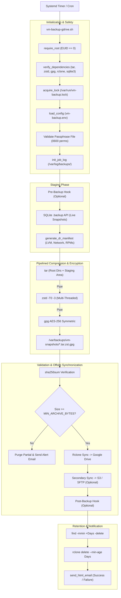
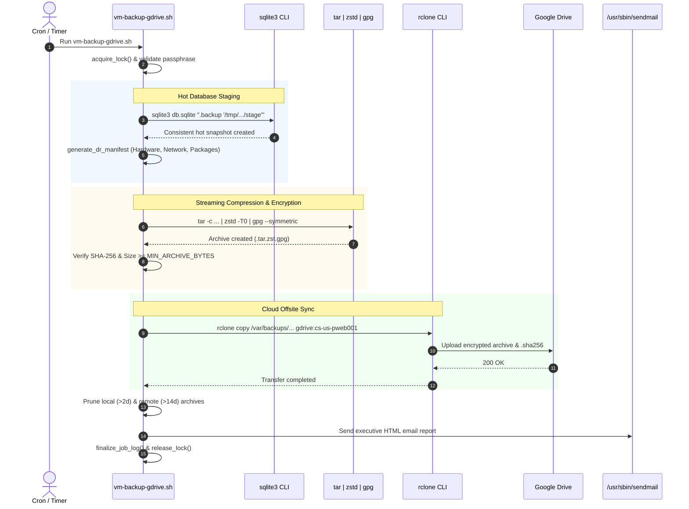
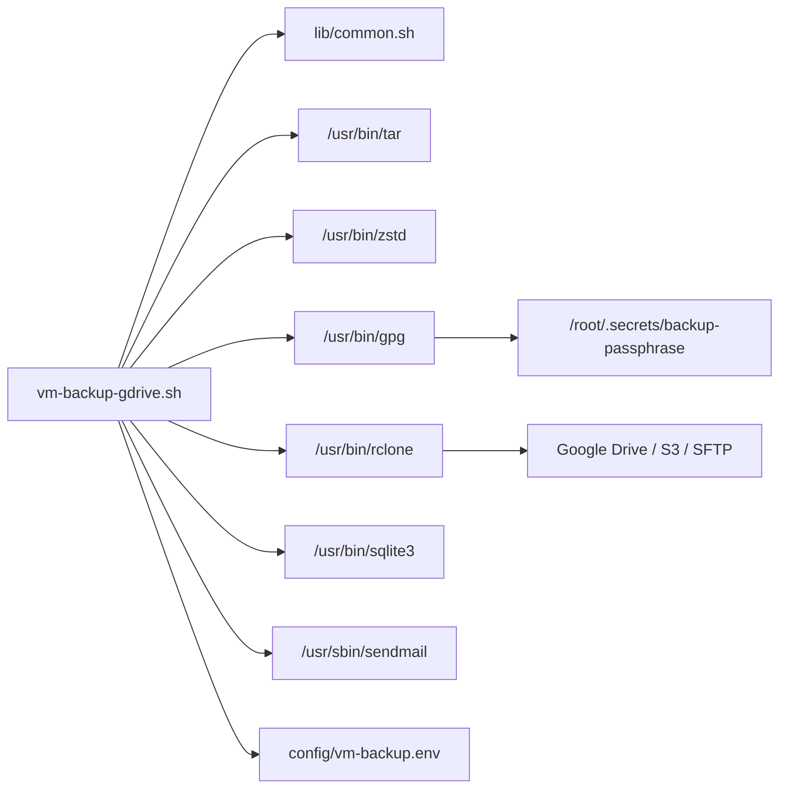
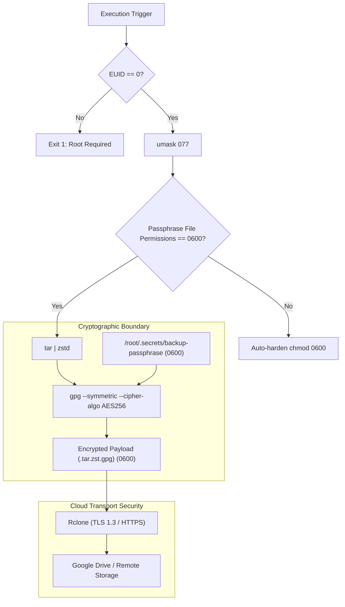

# `vm-backup-gdrive.sh` Documentation

Comprehensive operational and architecture guide for [`/opt/scripts/vm-backup-gdrive.sh`](file:///opt/scripts/vm-backup-gdrive.sh).

---

## 1. Application Overview and Objectives

[`vm-backup-gdrive.sh`](file:///opt/scripts/vm-backup-gdrive.sh) is an enterprise-grade Virtual Machine snapshot and disaster recovery backup orchestrator. It manages live state capture, online database snapshots, multi-core streaming compression, symmetric AES-256 encryption, cloud synchronization (Google Drive / S3 / SFTP), dual retention enforcement, and executive HTML status reporting.

### Key Objectives
* **Consistent Hot State Capture:** Perform live, non-blocking online snapshots of active SQLite databases (e.g. Uptime Kuma, Ntfy) via SQLite's `.backup` API.
* **Automated Disaster Recovery (DR) Manifest:** Capture complete system metadata (partition tables, LVM geometries, network configs, firewall rules, installed RPM packages, and running containers) in every archive.
* **Pipelined Encryption & Multi-Thread Compression:** Stream tarballs directly through multi-threaded `zstd -T0` compression into `gpg --symmetric --cipher-algo AES256` without storing unencrypted intermediate files on disk.
* **Integrity Auditing & Threshold Sanity:** Generate SHA-256 checksums and enforce a minimum archive byte size threshold (`MIN_ARCHIVE_BYTES`) to prevent zero-byte or corrupt backups from propagating to cloud storage.
* **Cloud Sync & 3-2-1 Storage Compliance:** Synchronize encrypted snapshots to primary remote storage (e.g. Google Drive via Rclone) and optional secondary remotes (AWS S3, SFTP, NFS).
* **Automated Dual Retention:** Enforce distinct local (e.g. 2-day) and cloud (e.g. 14-day) retention pruning policies.
* **Executive HTML Reporting:** Generate branded HTML email reports detailing execution timings, compression statistics, uncompressed volumes, and diagnostic logs.

---

## 2. Architecture and Design Choices, Assumptions, Edge Cases, Performance and Efficiency

### Architecture and Design Choices
* **Streaming Pipeline (`tar | zstd | gpg`):** Avoids massive disk I/O penalties and disk space exhaustion by streaming data directly through compression and encryption pipes into the target `.tar.zst.gpg` archive.
* **Isolated Staging Area:** Leverages a transient `mktemp -d` staging directory for SQLite hot copies and DR recovery manifests, automatically cleaned via signal traps.
* **Strict Concurrency Locking:** Enforces mutex locking via `/var/run/vm-backup.lock` to prevent overlapping runs during extended backup windows.
* **Modular Configuration Engine:** Resolves settings in a deterministic hierarchy:
  1. `/etc/devops/vm-backup.conf`
  2. `/opt/scripts/config/vm-backup.env`
  3. Environment variables / CLI overrides.

### Assumptions
* Superuser access (`root`) is required to read protected directories (`/root`, `/etc`, `/var/lib`) and LVM metadata.
* Symmetric encryption passphrase is stored in a secured, root-only file (`/root/.secrets/backup-passphrase`, mode `0600`).
* Rclone remote (e.g. `gdrive:`) is configured and authenticated.
* Host MTA / `sendmail` is functional.

### Handled Edge Cases
* **Database Contention & Locks:** Avoids raw file copying of active SQLite DBs. Calls `sqlite3 "${db}" ".backup '${stage}'"` to ensure transactions in progress are safely flushed without corrupting the snapshot.
* **Suspiciously Small Archives:** If an archive is smaller than `MIN_ARCHIVE_BYTES` (default 1 MB), the run fails immediately, preventing truncated archives from replacing valid backups.
* **Failed Backup Rollback:** If the pipeline fails, signal traps purge partial `.tar.zst.gpg` and `.sha256` files from the filesystem.
* **Changed Files During Tar:** Passes `--warning=no-file-changed` and `--ignore-failed-read` to prevent active log writes from causing tar to abort.
* **3-2-1 Redundancy:** Supports `TARGET_SECONDARY_REMOTE` for dual-cloud redundancy.

### Architecture Diagram



---

## 3. Data Flow and Control Logic

### Sequence Diagram



---

## 4. Performance and Scalability

### Concurrency Model & I/O Optimization
* **Non-Blocking Hot Snapshots:** SQLite databases are snapshotted using the online `.backup` C-API through `sqlite3`, eliminating database lockouts for active containers.
* **Parallel Core Saturation:** `zstd -T0` dynamically inspects `/proc/cpuinfo` and binds worker threads across all available CPU cores.
* **Zero Intermediate Storage:** Traditional backup scripts create an uncompressed tar, then compress it, then encrypt it—requiring 3x the storage volume. This script streams standard output through Unix pipes (`|`), creating the encrypted archive in a single pass.
* **Mutex Concurrency Lock:** `acquire_lock "vm-backup"` uses kernel `flock` on `/var/run/vm-backup.lock`.

---

## 5. Dependencies

### Component Chart



### Dependency Inventory
| Dependency | Type | Source Package | Minimum Version | Purpose |
| :--- | :--- | :--- | :--- | :--- |
| `bash` | Interpreter | `bash` | 4.4+ | Core script execution |
| `tar` | Archiver | `tar` | 1.30+ | Multi-directory filesystem archiver |
| `zstd` | Compressor | `zstd` | 1.4+ | Multi-threaded real-time compression (`-T0`) |
| `gpg` | Cryptography | `gnupg2` | 2.2+ | Symmetric AES-256 payload encryption |
| `rclone` | Cloud Sync | `rclone` | 1.50+ | Encrypted transport to Google Drive / Cloud remotes |
| `sqlite3` | Database Utility | `sqlite` | 3.26+ | Hot online database snapshotting |
| `sendmail` | Mail Agent | `postfix` | Any | HTML notification delivery |
| `coreutils` | System Tools | `coreutils` | Any | `sha256sum`, `stat`, `mktemp`, `awk`, `find` |

---

## 6. Security Architecture



---

## 7. Security Assessment

* **Encryption at Rest:** Archives are encrypted using military-grade AES-256 via GPG (`--cipher-algo AES256`). Without the passphrase, backup payloads cannot be decrypted.
* **Secret Management:** The encryption passphrase is never passed as a CLI argument (which would leak into `ps aux` process tables). It is read strictly from `/root/.secrets/backup-passphrase` via `--passphrase-file`.
* **Passphrase File Hardening:** On startup, the script verifies permissions on the passphrase file. If permissions exceed `0600`, it triggers an immediate security warning and auto-hardens the file to `0600`.
* **Encryption in Transit:** All offsite synchronization via Rclone enforces modern TLS 1.3 HTTPS communication with Google Drive and S3 endpoints.
* **Integrity Validation:** A cryptographically sound SHA-256 manifest is generated immediately upon archive completion and synchronized alongside the payload.

---

## 8. Code Quality Assessment, Review, and Best Practices

* **Bash Strict Mode:** Runs under `set -euo pipefail`.
* **Zero Orphan Scratch Files:** Scratch files (`file_list_tmp`, `tar_err_tmp`, `STAGING_DIR`) are registered with `register_cleanup` and wiped via `EXIT`, `INT`, and `TERM` trap signals.
* **Defensive Threshold Testing:** Archive sizes are checked against configurable minimum thresholds before transmission.
* **Robust Exclusion Engine:** Dynamic array exclusions prevent backing up transient sockets, caches, or virtual filesystems (`/proc`, `/sys`, `/dev`).

---

## 9. Command Line Arguments

| Argument | Type | Default | Description |
| :--- | :--- | :--- | :--- |
| `--notify-only-failures` | Flag | `0` | Suppresses email notifications on successful backup runs; dispatches alerts only upon failure. |
| `-h`, `--help` | Flag | N/A | Displays CLI usage documentation and exits `0`. |

### Configuration Variables (`config/vm-backup.env`)

| Variable | Default Value | Description |
| :--- | :--- | :--- |
| `BACKUP_DIR` | `/var/backups/vm-snapshots` | Local storage directory for encrypted archives. |
| `TARGET_REMOTE` | `gdrive:${SHORT_HOSTNAME}` | Primary Rclone remote target path. |
| `TARGET_SECONDARY_REMOTE`| `""` | Optional secondary cloud target (3-2-1 compliance). |
| `PASSPHRASE_FILE` | `/root/.secrets/backup-passphrase` | Absolute path to AES-256 symmetric key. |
| `LOCAL_RETENTION_DAYS` | `2` | Number of days to retain local snapshot archives. |
| `REMOTE_RETENTION_DAYS`| `14` | Number of days to retain offsite cloud archives. |
| `MIN_ARCHIVE_BYTES` | `1048576` (1MB) | Minimum archive size required to declare success. |
| `COMPRESSION_PROGRAM` | `zstd -T0 -3` | Multi-threaded compression command string. |

---

## 10. Detailed Examples on How to Use and Deploy

### Manual Usage Examples

#### 1. Interactive Full Backup Run
```bash
sudo /opt/scripts/vm-backup-gdrive.sh
```
**Sample Terminal Output:**
```text
[*] Starting VM snapshot & cloud backup routine on cs-us-pweb001.criticalsys.net...
[*] Backup destination: /var/backups/vm-snapshots/cs-pweb001-backup-20261002_180806.tar.zst.gpg
[+] Performing safe staging of container volumes and databases...
    [✓] Online hot-backup created: /var/lib/uptime-kuma/data/kuma.db
    [✓] Online hot-backup created: /var/lib/ntfy/data/user.db
    [✓] Online hot-backup created: /var/lib/ntfy/cache/cache.db
[+] Generating cross-platform Disaster Recovery manifest in /var/recovery-manifest...
    [✓] DR recovery manifest successfully captured.
[+] Creating and encrypting archive: cs-pweb001-backup-20261002_180806.tar.zst.gpg...
[+] SHA-256 checksum generated: 238db071e46f95e7dcd95e45157be25449822bc61c831b0bbcb41319e0945a74
[✓] Archive validated: 4.4M (25.3M uncompressed, 1,661 files, 352 directories)
[+] Syncing archive to remote via Rclone: gdrive:cs-us-pweb001...
[+] Pruning local backups older than 2 days...
[+] Pruning remote backups older than 14 days...
[✓] Encrypted backup completed successfully.
[✓] Email notification dispatched to criticalsys.mis@gmail.com.
```

**Corresponding Production Execution Log (`/var/log/backups/vm-backup-20261002_180806.log`):**
```text
================================================================================
Execution Log: vm-backup
Host:       cs-us-pweb001.criticalsys.net
Start Time: 2026-10-02 18:08:06 UTC
Script:     /opt/scripts/vm-backup-gdrive.sh
Arguments:  (none)
User:       root (UID: 0)
PID:        109347
================================================================================
[2026-10-02 18:08:06 UTC] [*] Starting VM snapshot & cloud backup routine on cs-us-pweb001.criticalsys.net...
[2026-10-02 18:08:06 UTC] [*] Backup destination: /var/backups/vm-snapshots/cs-pweb001-backup-20261002_180806.tar.zst.gpg
[2026-10-02 18:08:06 UTC] [+] Performing safe staging of container volumes and databases...
[2026-10-02 18:08:06 UTC]     [✓] Online hot-backup created: /var/lib/uptime-kuma/data/kuma.db
[2026-10-02 18:08:06 UTC]     [✓] Online hot-backup created: /var/lib/ntfy/data/user.db
[2026-10-02 18:08:06 UTC]     [✓] Online hot-backup created: /var/lib/ntfy/cache/cache.db
[2026-10-02 18:08:06 UTC] [+] Generating cross-platform Disaster Recovery manifest in /var/recovery-manifest...
[2026-10-02 18:08:08 UTC]     [✓] DR recovery manifest successfully captured.
[2026-10-02 18:08:08 UTC] [+] Creating and encrypting archive: cs-pweb001-backup-20261002_180806.tar.zst.gpg...
=== Backed Up Files Manifest (2013 items: 1661 files, 352 directories) ===
home/
home/csysadm/
...
var/lib/uptime-kuma/data/kuma.db
var/recovery-manifest/installed-packages.txt
var/recovery-manifest/system-summary.txt
...
=== End of Backed Up Files Manifest ===
[2026-10-02 18:08:08 UTC] [+] SHA-256 checksum generated: 238db071e46f95e7dcd95e45157be25449822bc61c831b0bbcb41319e0945a74
[2026-10-02 18:08:08 UTC] [✓] Archive validated: 4.4M (25.3M uncompressed, 1,661 files, 352 directories)
[2026-10-02 18:08:08 UTC] [+] Syncing archive to remote via Rclone: gdrive:cs-us-pweb001...
[2026-10-02 18:08:16 UTC] [+] Pruning local backups older than 2 days...
[2026-10-02 18:08:16 UTC] [+] Pruning remote backups older than 14 days...
[2026-10-02 18:08:16 UTC] [✓] Encrypted backup completed successfully.
[2026-10-02 18:08:16 UTC] [✓] Email notification dispatched to criticalsys.mis@gmail.com.

================================================================================
Execution Summary:
Status:     COMPLETED (Exit Code: 0)
End Time:   2026-10-02 18:08:16 UTC
Duration:   10s
Log File:   /var/log/backups/vm-backup-20261002_180806.log
================================================================================
```

#### 2. Silent Run (Notify Only on Failure)
```bash
sudo /opt/scripts/vm-backup-gdrive.sh --notify-only-failures
```

#### 3. Test Archive Integrity & Decrypt
```bash
# Verify checksum
sha256sum -c /var/backups/vm-snapshots/cs-pweb001-backup-20261002_180806.tar.zst.gpg.sha256

# Test decryption and list archive contents
gpg --decrypt --passphrase-file /root/.secrets/backup-passphrase \
    /var/backups/vm-snapshots/cs-pweb001-backup-20261002_180806.tar.zst.gpg \
    | zstd -d | tar -tvf - | head -n 20
```

---

### Automated Deployment

Configure nightly VM backups via systemd:

1. **Service Unit:** `/etc/systemd/system/vm-backup.service`
   ```ini
   [Unit]
   Description=Nightly VM Snapshot and Cloud Backup
   After=network-online.target
   Wants=network-online.target

   [Service]
   Type=oneshot
   ExecStart=/opt/scripts/vm-backup-gdrive.sh
   StandardOutput=journal
   StandardError=journal
   ```

2. **Timer Unit:** `/etc/systemd/system/vm-backup.timer`
   ```ini
   [Unit]
   Description=Nightly VM Backup Trigger (02:00 UTC)

   [Timer]
   OnCalendar=*-*-* 02:00:00
   Persistent=true

   [Install]
   WantedBy=timers.target
   ```

3. **Activate:**
   ```bash
   sudo systemctl daemon-reload
   sudo systemctl enable --now vm-backup.timer
   ```
