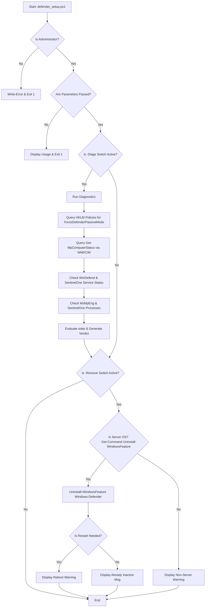

# Microsoft Defender and SentinelOne Management Tool: defender_setup.ps1

## 1. Application Overview and Objectives

The `defender_setup.ps1` script is a consolidated PowerShell utility designed to manage and audit the coexistence of Microsoft Defender and SentinelOne on Windows-based enterprise hosts. 

### Objectives
* **Prevent Anti-Virus Collision:** Ensure that only one active real-time protection engine runs on the host at any given time to avoid performance degradation, deadlocks, and false positives.
* **Audit System State:** Retrieve and report current registry policies, active Microsoft Defender operational modes (e.g., Active, Passive, EDR Block Mode), service states, and active memory processes.
* **Orchestrate Uninstallation:** Perform a clean uninstallation of the Microsoft Defender feature on Windows Server environments where SentinelOne is designated as the primary Endpoint Detection and Response (EDR) agent.

---

## 2. Architecture and Design Choices, Assumptions and Edge Cases

### Design Choices
* **Native Execution:** The script is written in vanilla PowerShell without dependencies on external modules or third-party binary wrapper executables.
* **CmdletBinding Implementation:** Uses standard `[CmdletBinding()]` to support common parameters (such as `-Verbose`, `-Debug`, and `-ErrorAction`) and enforce strict parameter validation.
* **Linter Compliance:** Suppresses cosmetic warnings (`PSAvoidUsingWriteHost`) at the cmdlet level using `SuppressMessageAttribute` while maintaining clean syntax that yields 0 warnings in `PSScriptAnalyzer`.

### Technical Assumptions
* **Administrative Context:** Executing commands such as querying Windows features or interacting with the `WinDefend` service controllers requires local administrative privileges.
* **OS Distribution:** Feature removal (`Uninstall-WindowsFeature`) is only applicable to Windows Server editions. Client OS editions (Windows 10/11) must manage Defender via settings, registry, or Group Policies.

### Edge Cases and Handling
* **WMI Namespace Corruption:** If the Microsoft Defender WMI provider is uninstalled or corrupted, standard calls to `Get-MpComputerStatus` fail with an `Invalid class` error. The script catches this exception specifically and infers a clean uninstalled engine state.
* **Partial SentinelOne Installation:** If a SentinelOne agent installation is incomplete (e.g., only one service of the suite is present), the script compares the active services against an expected list of three services (`SentinelAgent`, `SentinelHelperService`, `SentinelStaticEngine`) and reports missing services as `NOT INSTALLED`.
* **Safe Null Navigation:** When handling CIM or WMI exceptions, inner exception checking verifies `$null -ne $_.Exception.InnerException` before accessing child properties, preventing runtime crashes.

---

## 3. Data Flow and Control Logic

### Operational Flow Diagram



### Control Logic Description
1. **Administrative Validation:** The script queries the current Windows Security Principal role. If the running context does not contain `Administrator`, execution aborts with exit code `1`.
2. **Parameter Routing:** The script checks the status of the two main switch inputs:
   * **`-Diags` Execution:** Gathers diagnostic data sequentially across registry configurations, live WMI namespaces, local service controllers, and running process memory.
   * **`-Remove` Execution:** Evaluates environment compatibility and triggers the `Windows-Defender` feature uninstallation on Windows Server.

---

## 4. Dependencies

The script relies purely on built-in Windows components:

| Dependency Type | Component Name | Minimum Version / Requirement | Purpose |
| :--- | :--- | :--- | :--- |
| **Execution Environment** | PowerShell | 4.0+ | Script execution host |
| **OS Cmdlet** | `Get-CimInstance` | CIM Cmdlets (PS 3.0+) | Query operating system properties |
| **OS Module** | `ServerManager` | Windows Server OS | Access to `Uninstall-WindowsFeature` |
| **WMI Provider** | `Root\Microsoft\Windows\Defender` | Windows Defender installed | Access to WMI state query classes |

---

## 5. Command Line Arguments

| Argument | Type | Default Value | Description |
| :--- | :--- | :--- | :--- |
| **`-Remove`** | `[Switch]` | `$false` | Instructs the script to execute the uninstallation logic of the Microsoft Defender feature (supported on Windows Server OS only). |
| **`-Diags`** | `[Switch]` | `$false` | Instructs the script to execute the diagnostics audit, checking registry parameters, running mode, services, and memory states. |

---

## 6. Detailed Examples and Deployment

### Example 1: Executing Diagnostics Audit
Runs the endpoint diagnostics audit on an active machine.

```powershell
.\defender_setup.ps1 -Diags
```

#### Sample Output:
```text
====================================================
   ENDPOINT SECURITY DIAGNOSTICS REPORT (TUNED)
====================================================
Timestamp: 06/16/2026 00:27:00
OS Version: Microsoft Windows Server 2022 Datacenter
----------------------------------------------------
[1/4] Checking Staged Registry Configuration...
  [+] Registry Key Present: ForceDefenderPassiveMode is set to 1

[2/4] Querying Live Microsoft Defender Status...
  - AM Running Mode       : Passive Mode
  - Real-Time Protection  : False

[3/4] Checking Antivirus System Processes and Services...
  - Service 'WinDefend'   : Running
  - Service 'SentinelAgent' : Running
  - Service 'SentinelHelperService' : Running
  - Service 'SentinelStaticEngine' : Running
  - Active Executables Running in Memory:
    - MsMpEng.exe (PID: 3412)
    - SentinelAgent.exe (PID: 1204)
    - SentinelServiceHost.exe (PID: 1450)

[4/4] Summary and Next Steps:
  -> VERDICT: Healthy Co-existence State. Defender is running in Passive mode.
====================================================
```

### Example 2: Executing Defender Removal (Windows Server)
Executes feature uninstallation.

```powershell
.\defender_setup.ps1 -Remove
```

#### Sample Output (Reboot Required):
```text
Initiating complete removal of Microsoft Defender to prevent collision with SentinelOne...
Microsoft Defender feature uninstalled successfully.
WARNING: A system reboot is REQUIRED to completely remove the kernel-level file filters from memory.
Please execute: Restart-Computer -Force
```

#### Sample Output (Already Removed):
```text
Initiating complete removal of Microsoft Defender to prevent collision with SentinelOne...
Microsoft Defender feature is already removed or inactive.
```

### Example 3: Executing Defender Removal (Windows Client OS fallback)
If executed on Windows 10/11 Client OS, the script falls back gracefully.

```powershell
.\defender_setup.ps1 -Remove
```

#### Sample Output:
```text
WARNING: Uninstall-WindowsFeature is not available on this operating system.
For non-Server Windows editions, Microsoft Defender is managed via policies or settings.
```
