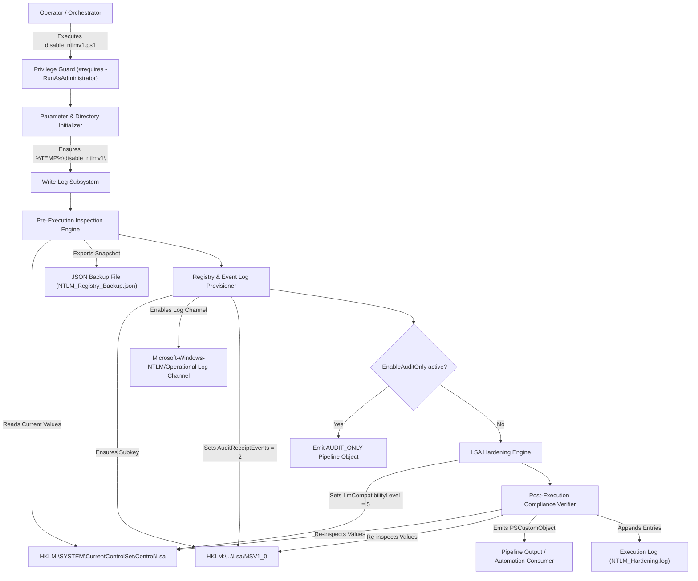
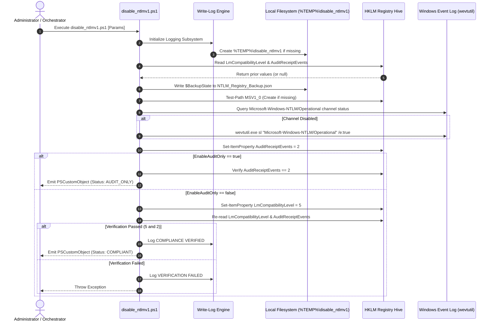

# NTLM Hardening & Compliance Tool: disable_ntlmv1.ps1

**Version:** 2.0.0  
**Date:** 2026-07-23  
**Target Environment:** Windows Server 2016+ / Windows 10+ (PowerShell 5.1+)

---

## 1. Application Overview and Objectives

The `disable_ntlmv1.ps1` script is an enterprise-grade PowerShell security utility designed to eliminate legacy authentication vulnerabilities by disabling NTLMv1 and LAN Manager (LM) protocols while enforcing NTLMv2 and Kerberos authentication across Windows hosts.

### Primary Objectives
* **Protocol Hardening:** Enforce `LmCompatibilityLevel = 5` under `HKLM:\SYSTEM\CurrentControlSet\Control\Lsa` to send NTLMv2 responses only and strictly refuse LM and NTLMv1 authentication.
* **Authentication Auditing:** Set `AuditReceiptEvents = 2` under `HKLM:\SYSTEM\CurrentControlSet\Control\Lsa\MSV1_0` to enable incoming NTLM authentication audit logging.
* **Event Log Activation:** Automatically inspect and activate the `Microsoft-Windows-NTLM/Operational` Windows Event Log channel to ensure NTLM audit events (IDs 8001–8004) are captured.
* **Pre-Execution Backup & Inspection:** Capture the pre-execution registry state into a JSON backup artifact (`NTLM_Registry_Backup.json`) prior to performing any registry mutations.
* **Compliance Verification:** Perform post-execution verification to confirm target registry settings are active and emit a structured `PSCustomObject` for pipeline integration and CI/CD reporting.
* **Standardized Log Auditing:** Output timestamped (`yyyy-MM-dd HH:mm:ss`) and hostname-tagged (`[$env:COMPUTERNAME]`) log entries to both the console host and log file.

---

## 2. Architecture, Design Choices, Assumptions, and Edge Cases

### Architectural Design Choices
* **Native PowerShell Implementation:** Built purely in PowerShell 5.1+ without external binary dependencies or third-party modules.
* **Subfolder Artifact Encapsulation:** By default, all generated log files and JSON backups are written to a isolated subdirectory under `%TEMP%` (`$env:TEMP\disable_ntlmv1\`), avoiding clutter on system root drives.
* **WhatIf / Confirm Support:** Implements `[CmdletBinding(SupportsShouldProcess = $true, ConfirmImpact = 'High')]` to allow dry-run previews (`-WhatIf`) and safety confirmations (`-Confirm`).
* **Non-Destructive Life-Cycle:** Replaces hard process terminations (`exit`) with `throw` and `return` logic, ensuring the script can be cleanly imported or invoked within parent automation hosts.
* **Pipeline Composability:** Returns unformatted `PSCustomObject` instances to the pipeline, enabling downstream filtering, CSV exporting, or JSON serialization.

### Technical Assumptions
* **Administrative Privileges:** Executing LSA registry modifications and enabling event log channels requires local administrative privileges (`#requires -RunAsAdministrator`).
* **Group Policy Considerations:** Local registry settings applied by this script can be overwritten by Active Directory Group Policy Objects (GPO) during `gpupdate` cycles if domain GPOs enforce conflicting LM authentication levels.

### Edge Case Handling

| Edge Case | Risk / Failure Mode | Automated Remediation Strategy |
| :--- | :--- | :--- |
| **Missing `MSV1_0` Subkey** | `Set-ItemProperty` throws `ItemNotFoundException` if `MSV1_0` key does not exist. | Dynamically checks `Test-Path $MsvPath` and invokes `New-Item -Path $MsvPath -Force` prior to property assignment. |
| **Disabled NTLM Event Log** | `AuditReceiptEvents = 2` is set, but no audit events are recorded. | Queries `Get-WinEvent -ListLog` and executes `wevtutil.exe sl "Microsoft-Windows-NTLM/Operational" /e:true` if channel is disabled. |
| **Missing Target Directory** | File creation fails if `$LogPath` or `$BackupPath` directories do not exist. | Evaluates parent directory paths and invokes `New-Item -ItemType Directory -Force` during startup initialization. |
| **Dry-Run Preview (`-WhatIf`)** | Script attempts to read modified values during dry runs, causing false verification errors. | Wraps post-execution verification checks in `if (-not $WhatIfPreference)` blocks to allow clean dry runs. |

### Performance and Efficiency
* **Execution Time:** Completes in < 100 milliseconds under standard operating conditions.
* **Resource Impact:** Minimal CPU and RAM utilization; performs a single directory check, single JSON write, and direct LSA registry key operations without polling loops.

### System Architecture Diagram



---

## 3. Data Flow and Control Logic

### Sequence Diagram



---

## 4. Dependencies

The script operates using native Windows system modules and utilities:

| Dependency Type | Component Name | Required Version | Purpose |
| :--- | :--- | :--- | :--- |
| **Execution Host** | PowerShell Host | 5.1 or higher | Core script runtime environment |
| **Security Authority** | HKLM Registry Hive | Windows OS Native | Access to LSA registry configurations |
| **Log Utility** | `wevtutil.exe` | Windows OS Native | Enabling Windows NTLM Operational event log channel |
| **Event Cmdlet** | `Get-WinEvent` | `Microsoft.PowerShell.Diagnostics` | Querying event log channel enabled status |
| **JSON Provider** | `ConvertTo-Json` | `Microsoft.PowerShell.Utility` | Exporting pre-execution backup state to disk |

---

## 5. Security Assessment

* **Encryption in Transit & Secret Management:** The script manages system registry security policies locally and does not transmit, request, handle, or store plain-text credentials, secrets, or API keys.
* **Authentication Configuration:** Directly secures local Security Authority (LSA) policies by disabling legacy authentication protocols (LM & NTLMv1) and enforcing NTLMv2 and Kerberos (`LmCompatibilityLevel = 5`).
* **Role-Based Access Control (RBAC):** Access is strictly restricted to administrative users via `#requires -RunAsAdministrator` and `$PSCmdlet.ShouldProcess` boundaries.
* **Vulnerability & Library Assessment:** Uses 100% native PowerShell cmdlets and built-in Windows binaries (`wevtutil.exe`). No third-party modules or unverified DLLs are imported.

---

## 6. Code Quality Assessment and Best Practices

* **PSScriptAnalyzer Compliance:** Evaluated with `pslint.ps1 -Strict` (PSScriptAnalyzer v1.25.0) with **0 Errors** and **0 Warnings**.
* **Linter Warnings Suppressed Cleanly:** The `Write-Host` usage inside `function Write-Log` is scoped and explicitly suppressed using `[Diagnostics.CodeAnalysis.SuppressMessageAttribute("PSAvoidUsingWriteHost", "")]`.
* **Standardized Logging Schema:** Every console and file log message enforces a strict `[yyyy-MM-dd HH:mm:ss] [$env:COMPUTERNAME] [LEVEL]` structure.
* **Clean Exception Life-Cycle:** Unhandled exceptions in `try/catch` blocks are logged and rethrown via `throw $_`, preserving original stack traces for caller error handling.

---

## 7. Command Line Arguments

| Parameter | Type | Default Value | Description |
| :--- | :--- | :--- | :--- |
| **`-EnableAuditOnly`** | `[Switch]` | `$false` | Activates NTLM incoming authentication auditing (`AuditReceiptEvents = 2`) while skipping the `LmCompatibilityLevel` registry modification. |
| **`-LogPath`** | `[String]` | `$env:TEMP\disable_ntlmv1\NTLM_Hardening.log` | Specifies the target path for script execution log records. |
| **`-BackupPath`** | `[String]` | `$env:TEMP\disable_ntlmv1\NTLM_Registry_Backup.json` | Specifies the target path for saving pre-execution registry state backups. |
| **`-WhatIf`** | `[Switch]` | `$false` | Previews changes without performing registry mutations or file modifications. |
| **`-Confirm`** | `[Switch]` | `$false` | Prompts for explicit operator confirmation before making registry changes. |

---

## 8. Detailed Examples and Deployment

### Example 1: Standard Enforcement Execution

Applies NTLMv2 enforcement (`LmCompatibilityLevel = 5`), enables auditing (`AuditReceiptEvents = 2`), and emits a compliance object.

```powershell
.\disable_ntlmv1.ps1
```

**Output Sample:**

```text
[2026-07-23 12:36:08] [DESKTOP-DEV01] [INFO] Initializing NTLM Hardening Script (disable_ntlmv1.ps1)...
[2026-07-23 12:36:08] [DESKTOP-DEV01] [INFO] Inspecting prior registry state...
[2026-07-23 12:36:08] [DESKTOP-DEV01] [INFO] PRIOR STATE -> LmCompatibilityLevel: Not Set (Legacy System Default) | AuditReceiptEvents: Not Set
[2026-07-23 12:36:08] [DESKTOP-DEV01] [INFO] Saved pre-execution registry state backup to: C:\Users\Admin\AppData\Local\Temp\disable_ntlmv1\NTLM_Registry_Backup.json
[2026-07-23 12:36:09] [DESKTOP-DEV01] [INFO] Verifying NTLM Operational Event Log channel status...
[2026-07-23 12:36:09] [DESKTOP-DEV01] [INFO] Enabling NTLM incoming authentication auditing (AuditReceiptEvents = 2)...
[2026-07-23 12:36:09] [DESKTOP-DEV01] [SUCCESS] NTLM Auditing (AuditReceiptEvents) enabled successfully.
[2026-07-23 12:36:09] [DESKTOP-DEV01] [INFO] Applying LmCompatibilityLevel = 5 (Send NTLMv2 response only. Refuse LM & NTLMv1)...
[2026-07-23 12:36:09] [DESKTOP-DEV01] [INFO] POST INSPECTION -> LmCompatibilityLevel: 5 | AuditReceiptEvents: 2
[2026-07-23 12:36:09] [DESKTOP-DEV01] [SUCCESS] COMPLIANCE VERIFIED: LmCompatibilityLevel=5 and AuditReceiptEvents=2.
[2026-07-23 12:36:09] [DESKTOP-DEV01] [INFO] Execution finished. All output artifacts stored in directory: C:\Users\Admin\AppData\Local\Temp\disable_ntlmv1 (Log: C:\Users\Admin\AppData\Local\Temp\disable_ntlmv1\NTLM_Hardening.log, Backup: C:\Users\Admin\AppData\Local\Temp\disable_ntlmv1\NTLM_Registry_Backup.json)

ComputerName       : DESKTOP-DEV01
PriorLmLevel       : Not Set (Legacy System Default)
AppliedLmLevel     : 5
PriorAuditEvents   : Not Set
AppliedAuditEvents : 2
Status             : COMPLIANT
Timestamp          : 2026-07-23 12:36:09
OutputDir          : C:\Users\Admin\AppData\Local\Temp\disable_ntlmv1
LogPath            : C:\Users\Admin\AppData\Local\Temp\disable_ntlmv1\NTLM_Hardening.log
BackupPath         : C:\Users\Admin\AppData\Local\Temp\disable_ntlmv1\NTLM_Registry_Backup.json
```

---

### Example 2: Dry-Run Execution (`-WhatIf`)

Previews the operations without modifying system registry keys or creating disk artifacts.

```powershell
.\disable_ntlmv1.ps1 -WhatIf
```

**Output Sample:**

```text
What if: Performing the operation "Save Pre-execution Registry State" on target "C:\Users\Admin\AppData\Local\Temp\disable_ntlmv1\NTLM_Registry_Backup.json".
What if: Performing the operation "Create Registry Key" on target "HKLM:\SYSTEM\CurrentControlSet\Control\Lsa\MSV1_0".
What if: Performing the operation "Enable Event Log Channel" on target "Microsoft-Windows-NTLM/Operational".
What if: Performing the operation "Set AuditReceiptEvents = 2" on target "HKLM:\SYSTEM\CurrentControlSet\Control\Lsa\MSV1_0".
What if: Performing the operation "Set LmCompatibilityLevel = 5" on target "HKLM:\SYSTEM\CurrentControlSet\Control\Lsa".
```

---

### Example 3: Audit-Only Mode Execution

Enables incoming NTLM audit tracking without enforcing NTLMv2 (`LmCompatibilityLevel` remains unchanged).

```powershell
.\disable_ntlmv1.ps1 -EnableAuditOnly
```

**Output Sample:**

```text
[2026-07-23 12:36:09] [DESKTOP-DEV01] [WARN] -EnableAuditOnly flag specified. Skipping LmCompatibilityLevel registry modification.
[2026-07-23 12:36:09] [DESKTOP-DEV01] [SUCCESS] POST INSPECTION -> AuditReceiptEvents verified as: 2

ComputerName       : DESKTOP-DEV01
PriorLmLevel       : Not Set (Legacy System Default)
AppliedLmLevel     : Skipped (-EnableAuditOnly)
PriorAuditEvents   : Not Set
AppliedAuditEvents : 2
Status             : AUDIT_ONLY
Timestamp          : 2026-07-23 12:36:09
OutputDir          : C:\Users\Admin\AppData\Local\Temp\disable_ntlmv1
LogPath            : C:\Users\Admin\AppData\Local\Temp\disable_ntlmv1\NTLM_Hardening.log
BackupPath         : C:\Users\Admin\AppData\Local\Temp\disable_ntlmv1\NTLM_Registry_Backup.json
```

---

### Example 4: Exporting Compliance Data to JSON

Invokes the script and converts the compliance output object directly into formatted JSON for SIEM or automation collection.

```powershell
.\disable_ntlmv1.ps1 | ConvertTo-Json
```

**Output Sample:**

```json
{
  "ComputerName": "DESKTOP-DEV01",
  "PriorLmLevel": "Not Set (Legacy System Default)",
  "AppliedLmLevel": 5,
  "PriorAuditEvents": "Not Set",
  "AppliedAuditEvents": 2,
  "Status": "COMPLIANT",
  "Timestamp": "2026-07-23 12:36:09",
  "OutputDir": "C:\\Users\\Admin\\AppData\\Local\\Temp\\disable_ntlmv1",
  "LogPath": "C:\\Users\\Admin\\AppData\\Local\\Temp\\disable_ntlmv1\\NTLM_Hardening.log",
  "BackupPath": "C:\\Users\\Admin\\AppData\\Local\\Temp\\disable_ntlmv1\\NTLM_Registry_Backup.json"
}
```
