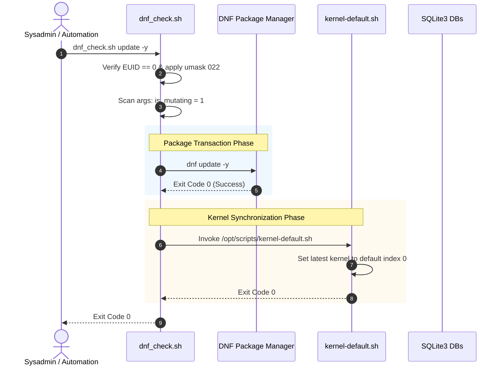
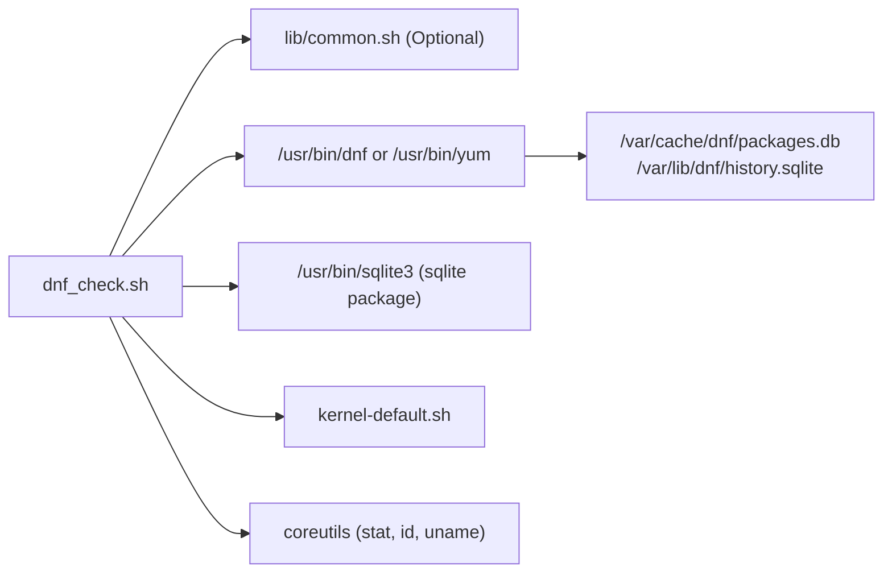
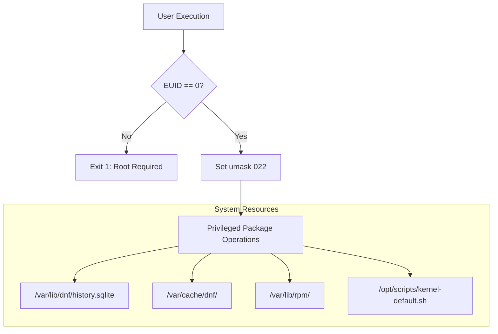

# `dnf_check.sh` Documentation

Comprehensive operational and architecture guide for [`/opt/scripts/dnf_check.sh`](file:///opt/scripts/dnf_check.sh).

---

## 1. Application Overview and Objectives

[`dnf_check.sh`](file:///opt/scripts/dnf_check.sh) is a system maintenance wrapper around the Enterprise Linux package manager (`dnf` / `yum`). It bridges routine package management tasks with automated bootloader kernel synchronization and database integrity validation.

### Key Objectives
* **Package Management Gateway:** Execute arbitrary DNF subcommands transparently, preserving options and exit statuses.
* **Database Integrity Auditing:** Inspect the structural integrity of DNF's core SQLite databases (`packages.db` and `history.sqlite`) without mutating data.
* **Safe Cache Purging:** Execute clean, native cache invalidation via `dnf clean all` instead of risky direct filesystem deletions.
* **Automated Bootloader Synchronization:** Detect mutating package transactions (`update`, `install`, `upgrade`, etc.) and automatically trigger [`kernel-default.sh`](file:///opt/scripts/kernel-default.sh) to ensure the bootloader default points to the newest valid kernel.
* **Execution Safety:** Never modify the bootloader on read-only queries (e.g. `check-update`, `search`, `info`, `list`) or failed package operations.

---

## 2. Architecture and Design Choices, Assumptions, Edge Cases, Performance and Efficiency

### Architecture and Design Choices
* **Dynamic Package Manager Binding:** Discovers `dnf` or `yum` at runtime, ensuring complete portability across EL8, EL9, and EL10 installations.
* **Transparent Pass-Through:** Preserves exact quoting, parameter boundaries, and subshell environments using `"$@"`.
* **Zero Overhead on Read Queries:** Skips bootloader synchronization when executing read-only commands.
* **Independent Operation:** Sibling scripts are dynamically resolved relative to `${SCRIPT_DIR}` with fallbacks to `/opt/scripts/`.

### Assumptions
* Target system is an RPM-based distribution running Enterprise Linux 8, 9, or 10.
* Package management commands require superuser privileges (`EUID == 0`).
* SQLite3 command-line client (`/usr/bin/sqlite3`) is available if `--sqlite-check` is invoked.

### Handled Edge Cases
* **Options Preceding Subcommands:** Flags with arguments (e.g. `--enablerepo crb install`) are correctly scanned across all arguments so mutating commands are never missed.
* **Uninitialized SQLite Databases:** If `/var/cache/dnf/packages.db` does not exist (e.g. after a clean wipe), the script warns and continues without throwing false-positive errors.
* **Active WAL Journaling:** Detects and reports the size of active `-wal` journal files without modifying SQLite journal modes or deleting journal files.
* **Exit Code Integrity:** If DNF terminates with an error (e.g. code 1 on dependency conflict or 100 on updates available in `check-update`), the exit code is preserved and returned immediately.

### Architecture Diagram

```mermaid
graph TD
    Caller["Administrator / Automated Task"] -->|"Arguments ($@)"| Script["/opt/scripts/dnf_check.sh"]

    subgraph "Initialization & Privilege Guard"
        Script --> HelpCheck{"Is -h or --help?"}
        HelpCheck -->|Yes| ShowHelp["Display Usage & Exit 0"]
        HelpCheck -->|No| RequireRoot["require_root (EUID == 0)"]
        RequireRoot --> DetectPkgMgr["Detect PKG_MGR (dnf / yum)"]
        DetectPkgMgr --> EnforceUmask["umask 022"]
    end

    subgraph "Internal Command Handlers"
        EnforceUmask --> ActionSwitch{"Argument Match"}
        ActionSwitch -->|"--sqlite-check"| SqliteCheck["sqliteWalCheck<br/>(PRAGMA integrity_check)"]
        ActionSwitch -->|"--purge-cache"| CleanCache["${PKG_MGR} clean all"]
        ActionSwitch -->|"Other Commands"| ExecDNF["Execute: ${PKG_MGR} $@"]
    end

    subgraph "Post-Transaction Logic"
        ExecDNF --> CheckStatus{"Status == 0?"}
        CheckStatus -->|No| ExitFail["Exit with DNF_STATUS"]
        CheckStatus -->|Yes| MutateScan{"Mutating Subcommand?"}
        MutateScan -->|No (search, list)| ExitSuccess["Exit 0"]
        MutateScan -->|Yes (update, install)| TriggerKernel["Invoke kernel-default.sh"]
        TriggerKernel --> ExitSuccess
    end
```

---

## 3. Data Flow and Control Logic

### Sequence Diagram



---

## 4. Performance and Scalability

### Concurrency Model
* **DNF Transaction Lock:** DNF internally handles global transaction locking (`/var/run/dnf.pid`). If another package manager instance is active, DNF queues or fails predictably without wrapper interference.
* **Transient Memory Footprint:** Executes in standard Bash context (< 12 MB overhead).
* **Non-Blocking SQLite Checks:** `PRAGMA integrity_check` is executed with shared read locks, allowing concurrent SQLite reads without table locking.

---

## 5. Dependencies

### Component Chart



### Dependency Inventory
| Dependency | Type | Source Package | Minimum Version | Purpose |
| :--- | :--- | :--- | :--- | :--- |
| `bash` | Shell Runtime | `bash` | 4.4+ (EL8+) | Script interpreter |
| `dnf` / `yum` | Package Manager | `dnf` | 4.0+ | Package installations, updates, and repo queries |
| `sqlite3` | SQLite Utility | `sqlite` | 3.26+ | Database integrity validation in `sqliteWalCheck` |
| `kernel-default.sh` | Sibling Script | Repository Internal | 1.1.0+ | Post-transaction default boot kernel synchronization |
| `lib/common.sh` | Shared Library | Repository Internal | 1.0.0+ | Optional shared framework functions (`require_root`) |

---

## 6. Security Architecture



---

## 7. Security Assessment

* **Privileged Execution Context:** Requires `root` permissions for package manager commands and database operations. Non-root users can only run `-h` / `--help`.
* **Zero Shell Injection Surface:** Avoids `eval` and unquoted variable expansions (`$*`). All arguments pass directly through `"$@"`.
* **Umask Enforcement:** Explicitly declares `umask 022` to ensure packages and logs are created with standard system permissions rather than inheriting restrictive parent environments.
* **Non-Destructive Database Audits:** SQLite integrity checks run read-only PRAGMAs without altering journal modes or writing data.

---

## 8. Code Quality Assessment, Review, and Best Practices

* **Bash Strict Mode:** Runs under `set -euo pipefail`.
* **Clean Exit Code Propagation:** Never masks non-zero exit codes from DNF; failures are immediately bubbled up to callers and CI/CD pipelines.
* **Backward Compatibility:** Provides function aliases (`sqlite_wal_check`, `sqliteWalClean`) and flag aliases (`--sqlite-close`) for seamless legacy script support.
* **Modular Path Discovery:** Sibling scripts are dynamically resolved via `${SCRIPT_DIR}` to allow deployment in non-standard directories.

---

## 9. Command Line Arguments

| Argument | Type | Default | Description |
| :--- | :--- | :--- | :--- |
| `--sqlite-check` | Flag | N/A | Validates the integrity of DNF's SQLite databases (`packages.db`, `history.sqlite`). |
| `--sqlite-close` | Flag | N/A | Legacy compatibility alias for `--sqlite-check`. |
| `--purge-cache` | Flag | N/A | Safely cleans all DNF metadata and package caches via native `dnf clean all`. |
| `-h`, `--help` | Flag | N/A | Displays CLI usage documentation and exits `0`. |
| `[DNF_COMMAND...]` | Pass-through | N/A | Standard DNF arguments (e.g. `update`, `install nginx`, `clean all`, `search`). |

---

## 10. Detailed Examples on How to Use and Deploy

### Manual Usage Examples

#### 1. Perform Package Update with Automated Kernel Sync
```bash
sudo /opt/scripts/dnf_check.sh update -y
```
**Sample Output:**
```text
Last metadata expiration check: 0:15:32 ago on Fri 02 Oct 2026 07:30:12 PM UTC.
Dependencies resolved.
Nothing to do.
Complete!
[*] Synchronizing default boot kernel post-transaction...
[*] Assigning index '0' to default kernel...
Available GRUB Kernel Entries:
index=0
kernel="/boot/vmlinuz-6.12.0-211.56.1.el10_2.x86_64"
title="AlmaLinux (6.12.0-211.56.1.el10_2.x86_64) 10.2 (Lavender Lion)"
index=1
kernel="/boot/vmlinuz-6.12.0-211.38.1.el10_2.x86_64"
title="AlmaLinux (6.12.0-211.38.1.el10_2.x86_64) 10.2 (Lavender Lion)"

The default is /boot/loader/entries/69f855f0bfb64c198867787acd8e4753-6.12.0-211.56.1.el10_2.x86_64.conf with index 0 and kernel /boot/vmlinuz-6.12.0-211.56.1.el10_2.x86_64
Current Default Boot Kernel:
  Title : AlmaLinux (6.12.0-211.56.1.el10_2.x86_64) 10.2 (Lavender Lion)
  Kernel: /boot/vmlinuz-6.12.0-211.56.1.el10_2.x86_64
  Index : 0
```

#### 2. Verify DNF SQLite Database Integrity
```bash
sudo /opt/scripts/dnf_check.sh --sqlite-check
```
**Sample Output:**
```text
[*] Checking integrity of DNF SQLite databases...
    Checking integrity of [/var/cache/dnf/packages.db]... OK
    Checking integrity of [/var/lib/dnf/history.sqlite]... OK
[+] All DNF SQLite database integrity checks passed.
```

#### 3. Native DNF Cache Purge
```bash
sudo /opt/scripts/dnf_check.sh --purge-cache
```
**Sample Output:**
```text
[*] Purging DNF cache via native package manager (dnf)...
49 files removed
```

#### 4. Read-Only Query (No Bootloader Interaction)
```bash
sudo /opt/scripts/dnf_check.sh repoquery --latest-limit=1 -q kernel-core
```
**Sample Output:**
```text
kernel-core-0:6.12.0-211.56.1.el10_2.x86_64
```
*(Notice that `kernel-default.sh` is not invoked.)*

---

### Automated Deployment

Integrate `dnf_check.sh` into administrative aliases or automated cron jobs:

1. **System-wide Administrative Alias:** Add to `/etc/profile.d/dnf_check.sh`:
   ```bash
   alias dnf-safe='/opt/scripts/dnf_check.sh'
   ```

2. **Automated Weekly Maintenance Cron:** `/etc/cron.weekly/system-updates`
   ```bash
   #!/bin/bash
   /opt/scripts/dnf_check.sh --sqlite-check
   /opt/scripts/dnf_check.sh -y --refresh update
   ```
