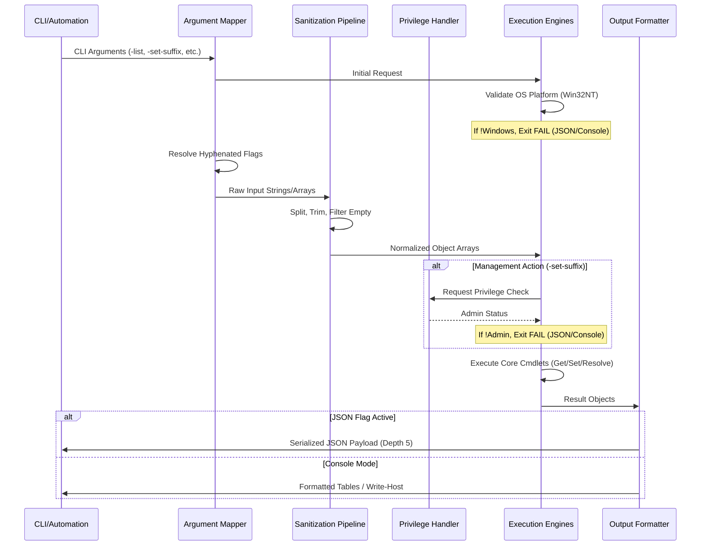

# DNS Management Utility (`dnsmgr.ps1`)

## 1. Application Overview and Objectives

`dnsmgr.ps1` is a specialized, headless PowerShell utility designed for the inspection, configuration, and diagnostics of Domain Name System (DNS) settings on Windows-based infrastructure. The primary objective is to provide a unified, scriptable interface that abstracts the complexity of multiple Windows networking modules into a single, high-fidelity tool.

### Core Objectives:
- **Automated Inspection**: Provide a consolidated view of active name servers and global search suffixes across all network interfaces.
- **System configuration Guardrails**: Enforce platform compatibility (Windows-only) and administrative rights for system-level configuration changes.
- **Synchronous Resolution**: Implement a robust hostname resolution engine capable of processing batch requests and returning consistent, machine-readable data.
- **Integration Readiness**: Support high-depth JSON output to facilitate seamless integration with CI/CD pipelines, monitoring systems, and configuration management tools.

## 2. Architecture and Design Choices

The utility is architected around a tiered logic structure to ensure modularity, reliability, and ease of maintenance.

### Modular Tiers:
0.  **Validation Tier**: A primary guard that verifies the host operating system platform is `Win32NT`. This prevents execution on unsupported platforms and ensures system-specific cmdlets do not fail unpredictably.
1.  **Argument Mapping Tier**: A dual-input parsing system that supports both standard PowerShell parameter binding and manual hyphenated flag mapping. This ensures compatibility across various terminal emulators and remote execution environments (e.g., Cygwin, MSYS2, SSH).
2.  **Sanitization Tier**: A rigorous input processing pipeline that normalizes data types (e.g., forcing `[string[]]` arrays) and strips invalid whitespace or malformed delimiters before they reach system cmdlets.
3.  **Execution Engine**:
    *   **Inspection Engine**: Queries `Get-DnsClientServerAddress` and `Get-DnsClientGlobalSetting`, with optional logic to isolate the primary interface via route metric analysis.
    *   **Management Engine**: Wraps `Set-DnsClientGlobalSetting` with transactional error handling (`try/catch`) and privilege verification.
    *   **Resolution Engine**: Leverages `Resolve-DnsName` to perform multi-host lookups, ensuring that return types (like Record Type) are normalized into strings for consistent serialization.

### Technical Design Decisions:
- **Strict Mode Enforcement**: The script executes under `Set-StrictMode -Version Latest` to prevent the use of uninitialized variables or invalid property references, which is critical for system-level automation.
- **Stateful Orchestration**: An internal `$executed` state tracker ensures the script provides actionable feedback or help documentation if no valid operation is specified.
- **Output Standardization**: Human-readable output utilizes `Format-Table -AutoSize` for console clarity, while `ConvertTo-Json -Depth 5` ensures that nested object properties (like IP address lists) are preserved in machine-readable formats.

## 3. Data Flow and Control Logic

### Operational Flow Diagram
The following diagram illustrates the sequence of operations from argument ingestion to final output serialization.



## 4. Dependencies

The utility relies on standard Windows PowerShell modules. No external libraries or third-party binaries are required.

- **Operating System**: Windows 10/Windows Server 2016 or newer.
- **PowerShell Version**: 5.1 (Desktop) or PowerShell 7+ (Core).
- **Core Modules**:
    - `DnsClient`: Used for name server retrieval and suffix configuration.
    - `NetTCPIP`: Used for interface route and metric analysis.
    - `Microsoft.PowerShell.Utility`: Used for JSON serialization and object manipulation.
- **Privileges**: Administrative rights are required only for the `-set-suffix` operation. All other operations can be performed with standard user privileges.

## 5. Command Line Arguments

| Argument | Type | Default | Description |
| :--- | :--- | :--- | :--- |
| `-list` | `Switch` | `$false` | Triggers the inspection engine to display name servers and search suffixes. |
| `-primary` | `Switch` | `$false` | Filters `-list` output to only show the interface associated with the default gateway. |
| `-set-suffix` | `string[]` | `$null` | List of DNS search suffixes to apply. Supports comma, space, or semicolon separation. |
| `-resolve` | `string[]` | `$null` | Hostnames to resolve. Supports single string, comma-separated lists, or multiple arguments. |
| `-json` | `Switch` | `$false` | Switches output format to machine-readable JSON. |
| `-version` | `Switch` | `$false` | Returns the current script version (1.0.0). |
| `-help` | `Switch` | `$false` | Displays structured usage and action documentation. |

## 6. Detailed Examples

### Example 1: Consolidated System Audit
Retrieve all active DNS configurations in a human-readable format, focusing only on the primary gateway interface.
```powershell
.\dnsmgr.ps1 -list -primary
```

### Example 2: Batch Host Resolution (JSON)
Perform a resolution of multiple high-profile targets and return the results as a JSON array for ingestion by a monitoring tool.
```powershell
.\dnsmgr.ps1 -resolve "google.com,microsoft.com,aws.amazon.com" -json
```

### Example 3: Global Suffix Management
Set the corporate DNS search suffixes. This operation requires an elevated PowerShell prompt.
```powershell
.\dnsmgr.ps1 -set-suffix "corp.internal,dev.internal,guest.internal"
```

### Example 4: Mixed-Shell Compatibility
Using hyphenated flags in a non-PowerShell environment (e.g., a bash script running in MSYS2).
```bash
powershell.exe -File ./dnsmgr.ps1 --resolve target.local --json
```
