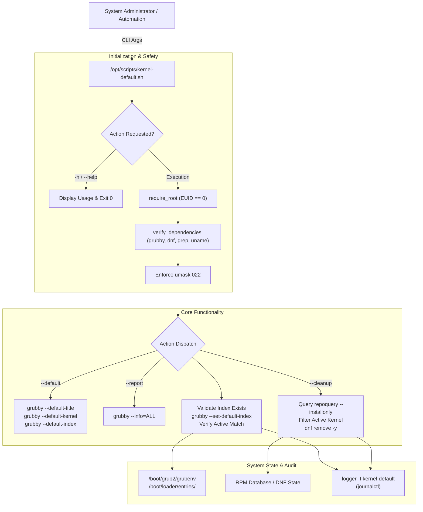
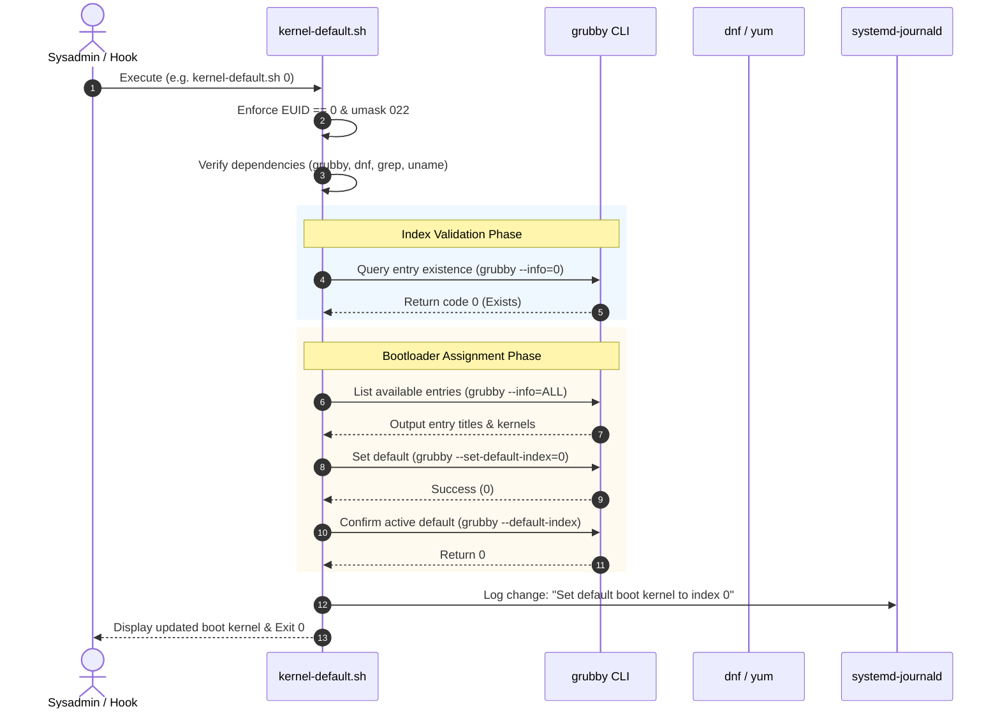
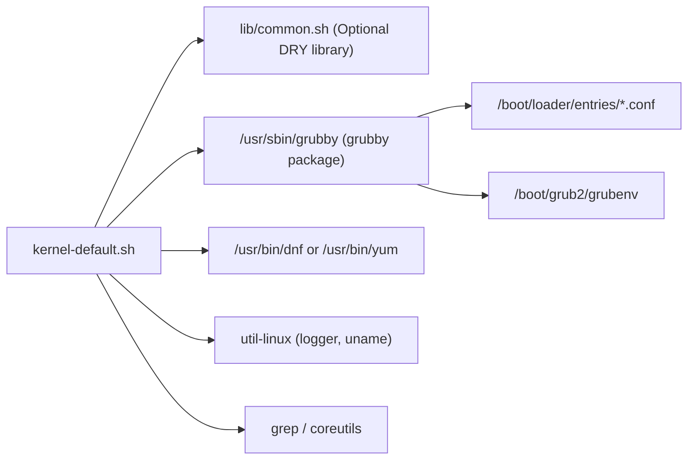
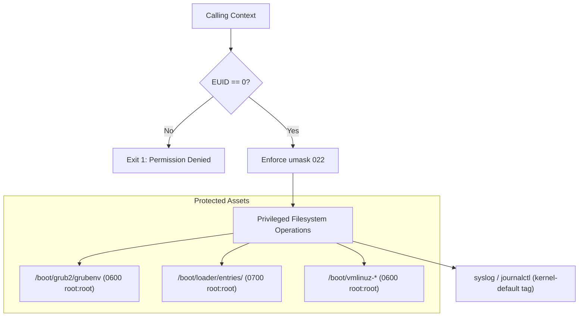

# `kernel-default.sh` Documentation

Comprehensive operational and architecture guide for [`/opt/scripts/kernel-default.sh`](file:///opt/scripts/kernel-default.sh).

---

## 1. Application Overview and Objectives

[`kernel-default.sh`](file:///opt/scripts/kernel-default.sh) is a system administration utility designed for Enterprise Linux 8, 9, and 10 (RHEL, AlmaLinux, Rocky Linux, CentOS Stream, Oracle Linux). Its primary mission is to provide safe, deterministic, and scriptable management of GRUB2 bootloader defaults following kernel installations, updates, or maintenance cycles.

### Key Objectives
* **Default Bootloader Management:** Inspect and configure default boot entries across modern Boot Loader Specification (BLS) configurations.
* **Safe Kernel Retirement Cleanup:** Identify and purge obsolete, retired kernel packages via the native package manager while safeguarding the currently running kernel.
* **Non-Destructive Fail-Safe Design:** Validate kernel indexes prior to applying configuration changes to prevent unbootable server states.
* **Automated Package Manager Integration:** Serve as an idempotent post-transaction hook for [`dnf_check.sh`](file:///opt/scripts/dnf_check.sh).
* **System Audit Logging:** Record all kernel modifications and package removals to syslog via `logger` for traceability in `journalctl`.

---

## 2. Architecture and Design Choices, Assumptions, Edge Cases, Performance and Efficiency

### Architecture and Design Choices
* **Native Tooling Layer:** Built directly on top of `grubby` and `${PKG_MGR}` (`dnf`/`yum`), avoiding manual editing or parsing of `/boot/grub2/grub.cfg` or `/boot/loader/entries/`.
* **Universal EL8/9/10 Compatibility:** Operates seamlessly across UEFI and legacy BIOS firmware layouts.
* **Loose Coupling with Shared Infrastructure:** Sources [`/opt/scripts/lib/common.sh`](file:///opt/scripts/lib/common.sh) for DRY conventions, with complete standalone fallback definitions if executed in isolation.
* **Strict Shell Governance:** Enforces `set -euo pipefail` and `umask 022`.

### Assumptions
* The host operating system utilizes GRUB2 with the Boot Loader Specification (`BLS`) enabled (standard in EL8+).
* The running user possesses superuser privileges (`EUID == 0`) for configuration mutating commands.
* `/boot` and `/boot/loader/entries` are accessible and mounted read-write during updates.

### Handled Edge Cases
* **Missing or Non-Existent Index:** Validates requested indexes with both `grubby --info="${INDEX}"` and `grubby --info=ALL` before attempting modification.
* **Active Kernel Protection:** Automatically filters out package candidates matching `*$(uname -r)*` to prevent purging the booted kernel, even if older than other installed kernels.
* **Empty Package Sets:** Bypasses `${PKG_MGR} remove` when zero retired kernels exist, avoiding package manager syntax errors.
* **Pipefail Resilience:** Output pipelines append `|| true` to prevent `set -o pipefail` from terminating the script on empty filter results.
* **Strict Single Argument Enforcement:** Rejects multi-argument typos (e.g. `kernel-default.sh 0 1`) before executing any action.

### Architecture Diagram



---

## 3. Data Flow and Control Logic

### Sequence Diagram



---

## 4. Performance and Scalability

### Concurrency Model
* **Process Execution:** Operates as a lightweight, single-threaded Bash process.
* **Transient Memory Footprint:** Consumes less than 15 MB of resident memory (standard Bash subshell).
* **Execution Latency:** Typical query operations (`--default`, `--report`) complete in under 50 ms. Mutating index operations complete in under 150 ms.
* **Package Query Optimization:** When executing `--cleanup`, queries RPM metadata in memory via native repoquery without initiating remote repository downloads or metadata synchronization.

---

## 5. Dependencies

### Component Chart



### Dependency Inventory
| Dependency | Type | Source Package | Minimum Version | Purpose |
| :--- | :--- | :--- | :--- | :--- |
| `bash` | Shell Runtime | `bash` | 4.4+ (EL8+) | Script interpreter supporting strict mode & `mapfile` |
| `grubby` | Bootloader CLI | `grubby` | 8.40+ | Inspecting and modifying GRUB/BLS boot parameters |
| `dnf` / `yum` | Package Manager | `dnf` | 4.0+ | Querying and removing retired installonly kernel packages |
| `logger` | Syslog Utility | `util-linux` | 2.32+ | Recording operational audit events to systemd journal |
| `grep`, `uname` | Core Utilities | `grep`, `coreutils` | Any | String filtering and active kernel detection |
| `lib/common.sh` | Shared Library | Repository Internal | 1.0.0+ | Optional shared framework functions (`require_root`) |

---

## 6. Security Architecture



---

## 7. Security Assessment

* **Privilege & Access Control (RBAC):** All modifying actions (`--cleanup`, index assignment) and GRUB environment reads require `root` (EUID 0). Unprivileged users cannot manipulate or view root-only GRUB environment files.
* **Secret Management:** The script processes zero credentials, tokens, or encryption keys.
* **Encryption in Transit:** N/A (all operations are local to the host).
* **Sanitized Argument Handling:** Argument parsing uses strict integer regex (`^[0-9]+$`) and case blocks, preventing command injection or directory traversal attacks.
* **Fail-Safe Integrity:** Verification guards guarantee that accidental execution without arguments defaults safely to index 0 rather than accepting arbitrary input.

---

## 8. Code Quality Assessment, Review, and Best Practices

* **POSIX & ShellCheck Adherence:** Complies with ShellCheck standards (e.g. no SC2112 deprecated function declarations, no SC2086 unquoted expansions).
* **Deterministic Error Handling:** Governed by `set -euo pipefail`. Any command error halts execution unless explicitly guarded.
* **Array-Safe Command Substitutions:** Uses `mapfile -t` to read multi-line package names safely into arrays without string splitting or glob expansion hazards.
* **Idempotency:** Re-executing `kernel-default.sh 0` when index 0 is already default safely validates and preserves state without generating redundant changes.

---

## 9. Command Line Arguments

| Argument | Type | Default | Description |
| :--- | :--- | :--- | :--- |
| `<INDEX>` | Integer (`^[0-9]+$`) | `0` | Sets the default boot kernel to the specified GRUB index (e.g. `0`, `1`). |
| `--default` | Flag | N/A | Prints the current default boot kernel title, file path, and index. |
| `--report` | Flag | N/A | Displays all available GRUB kernel entries with index, path, and title. |
| `--cleanup` | Flag | N/A | Removes older installed kernel packages while preserving the running kernel. |
| `--latest` | Flag | N/A | Alias to explicitly set index `0` as the default boot kernel. |
| `-h`, `--help` | Flag | N/A | Displays CLI usage documentation and exits `0`. |

*Note: If no argument is provided, the script defaults to index `0`.*

---

## 10. Detailed Examples on How to Use and Deploy

### Manual Usage Examples

#### 1. Display Current Default Boot Kernel
```bash
sudo /opt/scripts/kernel-default.sh --default
```
**Sample Output:**
```text
Current Default Boot Kernel:
  Title : AlmaLinux (6.12.0-211.56.1.el10_2.x86_64) 10.2 (Lavender Lion)
  Kernel: /boot/vmlinuz-6.12.0-211.56.1.el10_2.x86_64
  Index : 0
```

#### 2. Inspect Available Kernel Entries
```bash
sudo /opt/scripts/kernel-default.sh --report
```
**Sample Output:**
```text
Available GRUB Kernel Entries:
index=0
kernel="/boot/vmlinuz-6.12.0-211.56.1.el10_2.x86_64"
title="AlmaLinux (6.12.0-211.56.1.el10_2.x86_64) 10.2 (Lavender Lion)"
index=1
kernel="/boot/vmlinuz-6.12.0-211.38.1.el10_2.x86_64"
title="AlmaLinux (6.12.0-211.38.1.el10_2.x86_64) 10.2 (Lavender Lion)"
index=2
kernel="/boot/vmlinuz-0-rescue-69f855f0bfb64c198867787acd8e4753"
title="AlmaLinux (0-rescue-69f855f0bfb64c198867787acd8e4753) 10.1 (Heliotrope Lion)"
```

#### 3. Assign Default Kernel by Index
```bash
sudo /opt/scripts/kernel-default.sh 0
```
**Sample Output:**
```text
[*] Assigning index '0' to default kernel...
Available GRUB Kernel Entries:
index=0
kernel="/boot/vmlinuz-6.12.0-211.56.1.el10_2.x86_64"
title="AlmaLinux (6.12.0-211.56.1.el10_2.x86_64) 10.2 (Lavender Lion)"
index=1
kernel="/boot/vmlinuz-6.12.0-211.38.1.el10_2.x86_64"
title="AlmaLinux (6.12.0-211.38.1.el10_2.x86_64) 10.2 (Lavender Lion)"

The default is /boot/loader/entries/69f855f0bfb64c198867787acd8e4753-6.12.0-211.56.1.el10_2.x86_64.conf with index 0 and kernel /boot/vmlinuz-6.12.0-211.56.1.el10_2.x86_64
Current Default Boot Kernel:
  Title : AlmaLinux (6.12.0-211.56.1.el10_2.x86_64) 10.2 (Lavender Lion)
  Kernel: /boot/vmlinuz-6.12.0-211.56.1.el10_2.x86_64
  Index : 0
```

#### 4. Purge Retired Kernel Packages
```bash
sudo /opt/scripts/kernel-default.sh --cleanup
```
**Sample Output:**
```text
[*] Inspecting installed kernel packages...
[*] Removing retired kernel packages:
  - kernel-core-0:6.12.0-211.38.1.el10_2.x86_64
  - kernel-modules-0:6.12.0-211.38.1.el10_2.x86_64
Dependencies resolved.
Transaction completed.
[+] Kernel cleanup completed successfully.
```

---

### Automated Deployment

To automate monthly kernel cleanup via systemd:

1. **Create Service Unit:** `/etc/systemd/system/kernel-cleanup.service`
   ```ini
   [Unit]
   Description=Retired Kernel Cleanup Service
   After=network.target

   [Service]
   Type=oneshot
   ExecStart=/opt/scripts/kernel-default.sh --cleanup
   StandardOutput=journal
   StandardError=journal
   ```

2. **Create Timer Unit:** `/etc/systemd/system/kernel-cleanup.timer`
   ```ini
   [Unit]
   Description=Monthly Retired Kernel Cleanup Timer

   [Timer]
   OnCalendar=monthly
   Persistent=true

   [Install]
   WantedBy=timers.target
   ```

3. **Enable and Start Timer:**
   ```bash
   sudo systemctl daemon-reload
   sudo systemctl enable --now kernel-cleanup.timer
   ```
