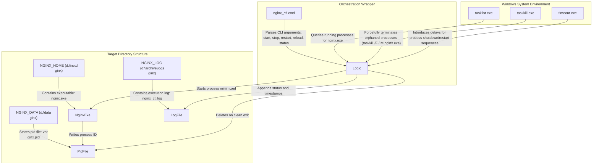

# Nginx Service Control Wrapper (`nginx_ctl.cmd`)

## 1. Application Overview and Objectives

`nginx_ctl.cmd` is a native Windows command script designed to manage the runtime lifecycle of the Nginx web server/reverse proxy. It provides a standardized interface for administrative operators and automation frameworks to orchestrate starting, stopping, restarting, reloading, and checking the status of Nginx without directly invoking low-level executables or manually managing process tables.

### 1.1 Objectives
* **Process Lifecycle Wrapper**: Abstract the startup, shutdown, config reload, and status retrieval of Nginx on Windows into a single CLI tool.
* **Execution Idempotency**: Ensure that calling the start command when Nginx is already active, or the stop command when Nginx is already terminated, returns gracefully without generating system errors or duplicate processes.
* **Process Leak Prevention**: Enforce a multi-stage shutdown process that attempts a clean application shutdown before falling back to a forced process termination, minimizing orphaned worker processes.
* **Traceability and Audit Logging**: Write chronological execution records with timestamps to a centralized log file (`nginx_ctl.log`) to assist with system auditing and diagnostics.

### 1.2 Exit Codes
* `0`: Success (indicates the requested state was verified or successfully transitioned).
* `1`: Failure (indicates a missing executable, an invalid argument, or a failed status/reload check).

---

## 2. Architecture and Design Choices, Assumptions, and Edge Cases

### 2.1 Architecture and Component Layout
The application is structured as a single-entry CLI wrapper written in Windows Command Script (`.cmd`). It relies on label-based branching (`goto`) to route execution based on user-supplied parameters.



### 2.2 Design Choices and Rationale
* **Minimized Background Startup**: The script uses `start /MIN` to execute Nginx. This launches the Nginx master process asynchronously in a minimized command window, preventing the invoking terminal session from blocking while Nginx is running.
* **Directory Context Switching**: The command `cd /d %NGINX_HOME%` is executed prior to invoking Nginx commands. This ensures that relative path mappings in the `nginx.conf` file (e.g., config, logs, html) resolve correctly within Nginx's runtime context.
* **Double-Tiered Termination**: The stop sequence initiates a soft stop command (`nginx -s stop`). To handle scenarios where Nginx processes hang or fail to process the control signal, a 5-second grace period is observed via `timeout`, followed by a forced `taskkill /F /IM nginx.exe`. This guarantees that all Nginx worker and master processes are terminated.
* **Static Path Declarations**: System paths (`NGINX_HOME`, `NGINX_DATA`, `NGINX_LOG`) are set statically at the top of the file to maintain environment consistency and prevent execution errors arising from dynamic user-injected paths.

### 2.3 System Assumptions
* **Single Host Instance**: The script assumes a single configuration layout where Nginx runs directly on the Windows host rather than within a containerized environment (e.g., Docker).
* **Process Ownership**: It is assumed that the invoking user profile or service account holds sufficient privilege to write to the designated log directory, execute `taskkill` on processes named `nginx.exe`, and read/write files under `NGINX_DATA`.

### 2.4 Edge Cases and Mitigations
* **Orphaned Process Nodes**: If Nginx is terminated abnormally, child worker processes may survive the master process termination. The script mitigates this by running `taskkill /F /IM nginx.exe` during the stop sequence, targeting all active instances regardless of parent-child hierarchy.
* **Missing Target Directories**: The script dynamically checks for the existence of `%NGINX_LOG%` and creates it via `mkdir` if missing, suppressing error output (`2>nul`) to handle scenarios where the directory is created concurrently.
* **Stale Pid Files**: If Nginx terminates abnormally, it may leave behind a stale PID file in `%NGINX_DATA%\var\nginx.pid`. The script explicitly deletes this file at the end of the stop sequence (`del %NGINX_DATA%\var\nginx.pid 2>nul`) to clear the state.
* **Non-existent Binaries**: Before performing any system operations, the script validates that `nginx.exe` is present in the `NGINX_HOME` path. If missing, it prints a clear diagnostic error and terminates with exit code `1` rather than failing mid-process.

### 2.5 Performance and Efficiency
* **Zero Runtime Overhead**: As a native Command Script, it does not require a virtual machine execution host (such as .NET or Java) or scripting interpreter engines (such as Python), resulting in sub-millisecond execution overhead for administrative commands.
* **Process Separation**: By utilizing the built-in `start` command with the `/MIN` flag, the process table is updated without locking the parent command line interface, maximizing responsiveness for automated orchestration tools.

---

## 3. Nginx File System Layout

The Nginx installation directory at `D:\inetd\nginx` is organized using a hybrid layout. Core binaries are stored directly on the fast system drive, while configuration directories, volatile data, temporary file caches, and logging outputs are redirected via NTFS symbolic links (directory junctions or symlinks) to separate storage drives (`D:\data` and `D:\archive`). This decoupling separates system binaries from application state, logs, and configuration, simplifying backups and system upgrades.

### 3.1 Directory Structure and Symbolic Link Targets

The directory listing of `D:\inetd\nginx` reveals the following layout:

| Entry Name | Mode | Source Path | Target/Mapped Path | Purpose |
| :--- | :--- | :--- | :--- | :--- |
| **`nginx.exe`** | File | `D:\inetd\nginx\nginx.exe` | *N/A (Local)* | Core Nginx web server/proxy binary. |
| **`nginx_service.exe`** | File | `D:\inetd\nginx\nginx_service.exe` | *N/A (Local)* | Windows service wrapper execution wrapper (e.g., WinSW). |
| **`nginx_service.exe.config`** | File | `D:\inetd\nginx\nginx_service.exe.config` | *N/A (Local)* | Configuration file for the .NET service wrapper application. |
| **`nginx_service.xml`** | File | `D:\inetd\nginx\nginx_service.xml` | *N/A (Local)* | XML service definition defining executable paths, arguments, and logging settings. |
| **`conf`** | Symlink | `D:\inetd\nginx\conf` | `d:\data\nginx\conf` | Contains active Nginx configuration files, including `nginx.conf`, virtual host maps, and SSL certificates. |
| **`html`** | Symlink | `D:\inetd\nginx\html` | `d:\data\nginx\html` | Document root storing static pages, maintenance files, and default assets. |
| **`logs`** | Symlink | `D:\inetd\nginx\logs` | `d:\archive\logs\nginx\` | Mount target for Nginx operational logs (e.g., `access.log`, `error.log`). |
| **`temp`** | Symlink | `D:\inetd\nginx\temp` | `d:\data\nginx\temp` | Storage area for Nginx temporary file buffering (client request bodies, fastcgi buffers). |
| **`var`** | Symlink | `D:\inetd\nginx\var` | `d:\data\nginx\var` | Variable data storage containing the active process identification PID file (`nginx.pid`). |
| **`contrib`** | Directory | `D:\inetd\nginx\contrib` | *N/A (Local)* | Supplemental tools, utilities, and helper scripts for Nginx extensions. |
| **`docs`** | Directory | `D:\inetd\nginx\docs` | *N/A (Local)* | Documentation, licensing terms, and default instruction manuals. |

### 3.2 Partition Separation Strategy
1. **Binaries Layer (`D:\inetd\nginx`)**: Keep Nginx software binaries isolated. This allows security scanning and binary updates without affecting static files, logs, or active configuration states.
2. **Data Layer (`D:\data\nginx`)**: All dynamic elements, including configuration updates, active web assets, temporary files, and variables (e.g. PID files), reside on the dedicated data drive (`D:\data`).
3. **Log Archival Layer (`D:\archive\logs\nginx`)**: Redirects high-throughput logging outputs to an archive storage partition. This prevents high log volume from consuming system or data disk space, averting service degradation if disks fill up.

### 3.3 Data Directory Structure (`D:\data\nginx`)
The persistent storage root located at `D:\data\nginx` hosts the directories referenced by the symbolic links inside the Nginx home folder. The structure is organized as follows:

* **`conf`** (`D:\data\nginx\conf`): Contains configuration files. This includes:
  * `nginx.conf`: The main configuration file. Note that this file has been customized specifically for Windows execution parameters (e.g., optimizing worker connections, event handling, thread pools, and path structures).
  * `conf.d/`: Directory containing several virtual host definitions that have been customized for Windows-specific server routing and load balancing.
  * Security configurations (TLS certificates and private keys).
* **`html`** (`D:\data\nginx\html`): The document root for the server. It stores the static HTML files, CSS, JavaScript, images, and other web assets served directly to client requests.
* **`temp`** (`D:\data\nginx\temp`): The temporary storage area. Used by Nginx for intermediate runtime write operations, such as:
  * Buffering large client request bodies.
  * Staging upstream proxy response data caches.
  * Managing temporary fastcgi, uwsgi, or scgi payloads.
* **`var`** (`D:\data\nginx\var`): Variable state directory. Primarily stores the active process ID (PID) file (`nginx.pid`) and other dynamic runtime lock/state indicators generated during the operation of the web server.

---

## 4. Data Flow and Control Logic

### 4.1 Control Logic Flow
1. **Environment Ingestion**: The script initializes local scope (`setlocal`), sets system constants, and checks for binary presence.
2. **Argument Evaluation**: The argument passed in `%1` is validated case-insensitively using `if /i` mappings.
3. **Execution Routing**:
   * If `start`: Calls `:is_running`. If running, exits `0`. If not, logs the start action, calls `:do_start`, and exits `0`.
   * If `stop`: Calls `:is_running`. If not running, exits `0`. If running, logs the stop action, calls `:do_stop`, and exits `0`.
   * If `restart`: Logs the restart action, calls `:do_stop`, pauses for 2 seconds, calls `:do_start`, and exits `0`.
   * If `reload`: Calls `:is_running`. If not running, exits `1`. If running, logs the reload action, executes `%NGINX_HOME%\nginx -s reload`, and exits `0`.
   * If `status`: Queries the process table via `tasklist`. If found, extracts the first matching PID, displays it, and exits `0`. If not found, displays a message and exits `1`.
   * If invalid/empty: Outputs script usage options and exits `1`.

### 4.2 Code Relations
The following table outlines how the script blocks map to their physical label designations and system commands:

| Script Label | Associated CLI Input | Secondary Functions Invoked | Executed Utilities / Commands |
| :--- | :--- | :--- | :--- |
| `(Global Init)` | None | None | `setlocal`, `set`, `if not exist`, `mkdir`, `cd /d` |
| `:start` | `start` | `:is_running`, `:do_start` | `echo`, `exit /b` |
| `:stop` | `stop` | `:is_running`, `:do_stop` | `echo`, `exit /b` |
| `:restart` | `restart` | `:do_stop`, `:do_start` | `echo`, `timeout`, `exit /b` |
| `:reload` | `reload` | `:is_running` | `echo`, `nginx.exe -s reload`, `exit /b` |
| `:status` | `status` | None | `tasklist.exe`, `find.exe`, `echo`, `exit /b` |
| `:is_running` | None (Internal) | None | `tasklist.exe`, `find.exe`, `exit /b %errorlevel%` |
| `:do_start` | None (Internal) | None | `start /MIN`, `exit /b` |
| `:do_stop` | None (Internal) | None | `start /MIN`, `timeout`, `taskkill.exe`, `del`, `exit /b` |

### 4.3 Data Sequence Diagram
The sequence diagram below displays the interaction flow during a typical lifecycle invocation.

```mermaid
sequenceDiagram
    autonumber
    actor Ops as Administrator / Automated Agent
    participant Script as nginx_ctl.cmd
    participant System as Windows OS (Process Table)
    participant Nginx as nginx.exe
    participant FS as Filesystem (Logs / PID)

    %% Flow initiation
    Ops->>Script: Run script with parameter (e.g., 'start')
    Note over Script: Environment initialization: sets local variables and checks binary presence

    Script->>FS: Verify file exists: d:\inetd\nginx\nginx.exe
    FS-->>Script: File exists status (Boolean)
    
    alt File Missing
        Script-->>Ops: Print ERROR and terminate with exit code 1
    end

    Script->>FS: Ensure d:\archive\logs\nginx exists
    FS-->>Script: Success/Exists

    %% Start Flow logic
    rect rgb(30, 30, 40)
        Note over Script: Start Sequence Evaluation
        Script->>System: Query running processes (tasklist.exe)
        System-->>Script: Process table details
        Script->>Script: Filter processes for "nginx.exe" via find.exe
        
        alt Process Already Active
            Script-->>Ops: Print "nginx is already running" & exit 0
        else Process Not Active
            Script->>FS: Append "Starting nginx" and timestamp to nginx_ctl.log
            Script->>System: Invoke start /MIN d:\inetd\nginx\nginx.exe
            System->>Nginx: Spawn nginx process in minimized window
            Nginx->>FS: Write PID file to d:\data\nginx\var\nginx.pid
            Script-->>Ops: Return exit code 0
        end
    end
```



---

## 5. Dependencies

The wrapper operates using native Windows Command shell built-in variables and calls external system executables included in standard Windows installations.

### 5.1 System Executables
* **`cmd.exe`**: Command line interpreter. Provides shell environments, variable operations (`setlocal`), directory transitions (`cd /d`), and conditional branching (`if`, `goto`).
* **`tasklist.exe`**: Queries the Windows Process table. Used to verify if `nginx.exe` is running and to retrieve process identifier numbers (PIDs) using filter parameters (`/FI "IMAGENAME eq nginx.exe"`).
* **`find.exe`**: Scans stream outputs. Used to filter the output of `tasklist.exe` to check for process presence.
* **`taskkill.exe`**: Terminates processes. Used to force shutdown Nginx processes using parameter flags `/F` (forced) and `/IM nginx.exe` (image name match).
* **`timeout.exe`**: Standard Windows delay utility. Used to pause script execution (`timeout /t 5 /nobreak`) to allow Nginx worker processes time to process the soft shutdown signals.

### 5.2 Application and File Dependencies
* **Nginx Executable**: Must be located at `%NGINX_HOME%\nginx.exe` (defaults to `d:\inetd\nginx\nginx.exe`).
* **Configuration Files**: Nginx configuration files must reside within `%NGINX_HOME%\conf\nginx.conf` (or custom locations configured in the binary registry).
* **PID File Location**: The script targets `%NGINX_DATA%\var\nginx.pid` (defaults to `d:\data\nginx\var\nginx.pid`) for clean deletion during stops.
* **Execution Log File**: Write-access must be available to write to `%NGINX_LOG%\nginx_ctl.log` (defaults to `d:\archive\logs\nginx\nginx_ctl.log`).

---

## 6. Security Assessment

### 6.1 Security Controls Matrix

| Security Area | Implementation Status | Technical Mechanism |
| :--- | :--- | :--- |
| **Privilege Escalation** | Not Implemented | The script executes in the context of the calling shell. It does not contain privilege elevation routines (e.g. `runas`). |
| **Input Sanitization** | Implemented | Argument parameters are mapped strictly via exact string matches (`if /i "%~1"=="start"`). Unmatched inputs result in help output and termination. |
| **Credential Storage** | Implemented (None Used) | No usernames, passwords, or configuration keys are hardcoded in the command script. |
| **Execution Logging** | Implemented | System status transitions are recorded to `%NGINX_LOG%\nginx_ctl.log` with date and time details. Log injection is prevented by writing static script-controlled text. |
| **Process Control Limits**| Partially Implemented | Script targets Nginx processes by filename (`nginx.exe`) using `tasklist` and `taskkill`. Access control relies on OS-level process ownership boundaries. |

### 6.2 Encryption in Transit
The management script operates strictly on the local host filesystem. No network ports, remote sockets, or remote procedure calls (RPC) are opened or managed by this wrapper. 
Encryption of network payloads managed by Nginx (e.g., TLS 1.2 or TLS 1.3 configuration) must be defined within the Nginx configuration file (`nginx.conf`) and is external to the execution bounds of this script.

### 5.3 Secret Management
The script does not store or process operational secrets. Certificates, private keys, and environment passwords used by the Nginx proxy should be stored securely on the filesystem and protected using Windows NTFS Access Control Lists (ACLs) to prevent access by unauthorized users.

### 6.4 Access Control and RBAC
Because this script calls system management utilities (`taskkill`, `mkdir`, and `start`), permissions are subject to the active Windows User Account Control (UAC) context:
* **Administrators**: Full capabilities. Able to start Nginx, write logs, and terminate all active `nginx.exe` processes on the host.
* **Standard/Unprivileged Users**: Restrictive capabilities. Can check Nginx status (`nginx_ctl.cmd status`) and view logs, but cannot write to administrative paths (`NGINX_HOME`, `NGINX_LOG`) or kill Nginx processes owned by other users.
* **Action Recommendation**: To restrict execution access, apply NTFS security permissions on [nginx_ctl.cmd](file:///e:/data/devel/build/code/private/devops/os_sys/nginx_ctl.cmd):
  * Grant `Read & Execute` to designated service accounts or automation groups.
  * Grant `Full Control` exclusively to local system administrators.

### 6.5 Software Supply Chain and Vulnerability Status
The script utilizes core Windows OS system binaries (`tasklist.exe`, `taskkill.exe`, `timeout.exe`, `find.exe`) located in `C:\Windows\System32`.
* **Vulnerability Status**: These binaries are part of the core operating system and are maintained directly by Microsoft via standard system patches. They do not introduce third-party libraries or open-source dependencies (e.g., npm, pip, nuget packages) that could contain unpatched CVEs.
* **Execution Verification**: The script calls these system utilities from the local path. To prevent DLL hijacking or executable spoofing, ensure the host system's `PATH` environment variable lists `%SystemRoot%\System32` prior to user-writable directories.

### 6.6 Unprivileged Context
As a service control wrapper, the script is typically run in an administrative or service account context. However, it can run in an unprivileged context for `status` queries. It is recommended to run the wrapper using a dedicated service account that only holds write access to the specific folders (`d:\data\nginx` and `d:\archive\logs\nginx`) and lacks full local administrator privileges, provided it has the necessary rights to start processes and kill those owned by itself.

---

## 7. Command Line Arguments

The script processes a single, optional, case-insensitive positional argument:

| Argument | Type | Default Value | Valid Options | Description |
| :--- | :--- | :--- | :--- | :--- |
| `%1` | `String` | *(None - displays usage)* | `start`, `stop`, `restart`, `reload`, `status` | Controls the operational state transition of the Nginx server. |

*Note: Passing any other argument, multiple arguments, or leaving the parameter empty will print the usage guidelines to stderr/stdout and terminate with exit code `1`.*

---

## 8. Detailed Examples and Deployment

### 8.1 Command Usage and Console Outputs

#### 8.1.1 Running with No Arguments
Executing the script without arguments displays usage rules.

**Command:**
```cmd
:: Invoke the script without any parameters to display usage instructions
nginx_ctl.cmd
```

**Console Output:**
```text
Usage: nginx_ctl.cmd [start|stop|restart|reload|status]
```
*Note: Script exits with code `1`.*

#### 8.1.2 Starting Nginx (State: Stopped)
Invokes the startup process when Nginx is not running.

**Command:**
```cmd
:: Start Nginx server in the background
nginx_ctl.cmd start
```

**Console Output:**
```text
Starting nginx web proxy
```
*Note: Log file `nginx_ctl.log` is updated; Nginx starts in a minimized shell window. Exit code `0`.*

**Appended log line (`d:\archive\logs\nginx\nginx_ctl.log`):**
```text
:: Timestamped log generated on successful initialization
[Mon 07/06/2026 23:30:15.12] Starting nginx
```

#### 8.1.3 Starting Nginx (State: Running)
Attempts to start Nginx when it is already running.

**Command:**
```cmd
:: Redundant start command verification (idempotency test)
nginx_ctl.cmd start
```

**Console Output:**
```text
nginx is already running
```
*Note: No log entry is written. Exit code `0`.*

#### 8.1.4 Checking Status (State: Running)
Retrieves process information for the active instance.

**Command:**
```cmd
:: Query process table for running Nginx processes
nginx_ctl.cmd status
```

**Console Output:**
```text
nginx is running [PID: 4312]
```
*Note: Exit code `0`.*

#### 8.1.5 Reloading Configuration (State: Running)
Triggers configuration reload without stopping the service.

**Command:**
```cmd
:: Reload configuration dynamically without process downtime
nginx_ctl.cmd reload
```

**Console Output:**
```text
Reloading nginx configuration
```
*Note: Execution log is appended. Exit code `0`.*

**Appended log line:**
```text
:: Reload event trace recorded in audit log
[Mon 07/06/2026 23:35:42.55] Reloading nginx configuration
```

#### 8.1.6 Stopping Nginx (State: Running)
Performs service shutdown, waits for grace period, and cleans up.

**Command:**
```cmd
:: Initiate service stop, timeout, force termination and pid file cleanup
nginx_ctl.cmd stop
```

**Console Output:**
```text
Stopping nginx web proxy
```
*Note: Execution logs are appended. Exits with code `0` after process termination and PID file cleanup.*

**Appended log line:**
```text
:: Shutdown trace recorded in audit log
[Mon 07/06/2026 23:40:02.10] Stopping nginx
```

---

## Appendix: WinSW Service Wrapper Configuration

This appendix details the configuration files and binary origin for the Windows Service Wrapper (WinSW) v2.12.0 utilized to register and run Nginx as a native Windows service.

### A.1 Binary Origin
The service wrapper executable `nginx_service.exe` in `D:\inetd\nginx` is a renamed instance of the official community binary `winsw-2.12.0-net461.exe` (WinSW targeted for .NET Framework 4.6.1).

### A.2 XML Service Descriptor (`nginx_service.xml`)
This file defines the service metadata, execution path, stop signals, and failover behavior.

```xml
<!-- WinSW v2.12 Configuration for Nginx Service Daemon -->
<service>
  <!-- Unique service identifier in the Windows Service Database -->
  <id>Nginx</id>
  
  <!-- Display name of the service in Windows Services Console -->
  <name>Nginx</name>
  
  <!-- Description of the service -->
  <description>Nginx</description>
  
  <!-- Absolute path to the executable to be wrapped as a service -->
  <executable>D:\inetd\nginx\nginx.exe</executable>
  
  <!-- Target directory where WinSW will write its own execution logs -->
  <logpath>D:\inetd\nginx\logs</logpath>
  
  <!-- Working directory context in which the target executable runs -->
  <workingdirectory>D:\inetd\nginx</workingdirectory>
  
  <!-- Logging configuration: rolls logs daily based on dates -->
  <log mode="roll-by-time">
    <pattern>yyyyMMdd</pattern>
  </log>
  
  <!-- Optional service dependencies (none mapped) -->
  <depend></depend>
  
  <!-- Execution arguments passed to the binary (none mapped) -->
  <argument></argument>
  
  <!-- Startup arguments passed to the binary (none mapped) -->
  <startargument></startargument>
  
  <!-- Shutdown arguments passed to signal graceful stop -->
  <stopargument>-s stop</stopargument>
  
  <!-- Grace period to wait for clean exit before forcing termination -->
  <stoptimeout>60sec</stoptimeout>
  
  <!-- Progressive crash handling rules -->
  <onfailure action="restart" delay="10 sec"/>
  <onfailure action="restart" delay="20 sec"/>
  <onfailure action="none"/>
  
  <!-- Time duration after which failure counters are reset to zero -->
  <resetfailure>1 hour</resetfailure>
</service>
```

### Configuration Element Reference Table
| XML Element | Description | Configured Value | Operational Purpose |
| :--- | :--- | :--- | :--- |
| `<id>` | Service ID | `Nginx` | Used by the Windows service controller for CLI actions (e.g. `net start Nginx`). |
| `<name>` | Display Name | `Nginx` | Human-readable service identifier displayed in `services.msc`. |
| `<executable>` | Core Binary | `D:\inetd\nginx\nginx.exe` | Path to the daemon started by the wrapper. |
| `<logpath>` | Logs Path | `D:\inetd\nginx\logs` | Output path for standard error and standard output redirects of the wrapper. |
| `<workingdirectory>` | Directory Context | `D:\inetd\nginx` | Execution path (ensures relative configuration paths resolve). |
| `<log>` | Logging Policy | `roll-by-time` | Rollover behavior for wrapper console logs. |
| `<stopargument>` | Shutdown Signal | `-s stop` | Command sent to `nginx.exe` to trigger a graceful shutdown. |
| `<stoptimeout>` | Force Kill Wait | `60sec` | Maximum duration to wait for graceful stop before hard-terminating the process. |
| `<onfailure>` | Recovery Steps | `restart / restart / none` | Step 1: Restart after 10s; Step 2: Restart after 20s; Step 3+: No action. |
| `<resetfailure>` | Recovery Counter Reset | `1 hour` | Time interval of healthy uptime required to reset crash counters. |

### A.3 Service Wrapper Runtime Configuration (`nginx_service.exe.config`)

To configure the .NET assembly execution environment and optimize service initialization performance, the wrapper utilizes the following XML configuration file (`nginx_service.exe.config`):

```xml
<!-- WinSW v2.12 Runtime configuration for CLR and publisher verification -->
<configuration>
  <runtime>
    <!-- Disable Authenticode signature validation at startup to prevent load delays on machines without internet access -->
    <generatePublisherEvidence enabled="false"/> 
  </runtime>
  <startup>
      <!-- Specify the supported version of the Common Language Runtime (CLR) -->
      <supportedRuntime version="v4.0" />
  </startup>
</configuration>
```

### A.4 Service Installation, Uninstallation, and Management Commands

The WinSW executable `nginx_service.exe` acts as the interface to the Windows Service Controller. To configure Nginx to run as a boot-time background service, system administrators must execute the lifecycle commands in an elevated shell session (Command Prompt or PowerShell run as Administrator).

#### A.4.1 Installation Procedure
To register Nginx as a Windows Service:
1. Open an elevated command window.
2. Change directory to the binary location:
   ```cmd
   :: Navigate to the Nginx home directory
   cd /d D:\inetd\nginx
   ```
3. Execute the `install` command:
   ```cmd
   :: Registers the service definition XML into the Windows Service Control Manager
   nginx_service.exe install
   ```

**Console Output:**
```text
Installing the service with id 'Nginx'...
Service 'Nginx' was installed successfully.
```

#### A.4.2 Uninstallation Procedure
To remove the service registry entries from the Windows Service Controller:
1. Open an elevated command window.
2. Change directory to the binary location:
   ```cmd
   :: Navigate to the Nginx home directory
   cd /d D:\inetd\nginx
   ```
3. Execute the `uninstall` command:
   ```cmd
   :: Stop the service and remove it from the Windows Service Database
   nginx_service.exe uninstall
   ```

**Console Output:**
```text
Uninstalling the service with id 'Nginx'...
Service 'Nginx' was uninstalled successfully.
```

#### A.4.3 Command Line Management Interface
The service wrapper exposes administrative subcommands to manage the service without opening the Windows Service GUI Console (`services.msc`):

| Command | Action Description | Execution Context |
| :--- | :--- | :--- |
| **`start`** | Starts the Nginx service. Service must be installed first. | Elevated Command Prompt |
| **`stop`** | Sends a stop signal and terminates the service. | Elevated Command Prompt |
| **`stopwait`** | Stops the Nginx service and blocks execution until the processes have terminated. | Elevated Command Prompt |
| **`restart`** | Triggers a service stop followed by a start sequence. | Elevated Command Prompt |
| **`status`** | Returns the current state of the service (e.g., `Started`, `Stopped`). | Standard/Elevated Command Prompt |
| **`test`** | Launches Nginx, verifies startup behavior, and immediately shuts down. | Elevated Command Prompt |
| **`version`** | Prints version information of the WinSW service wrapper. | Standard Command Prompt |

