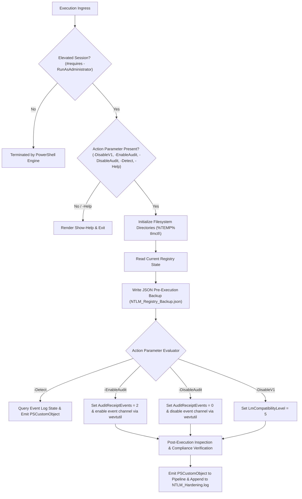
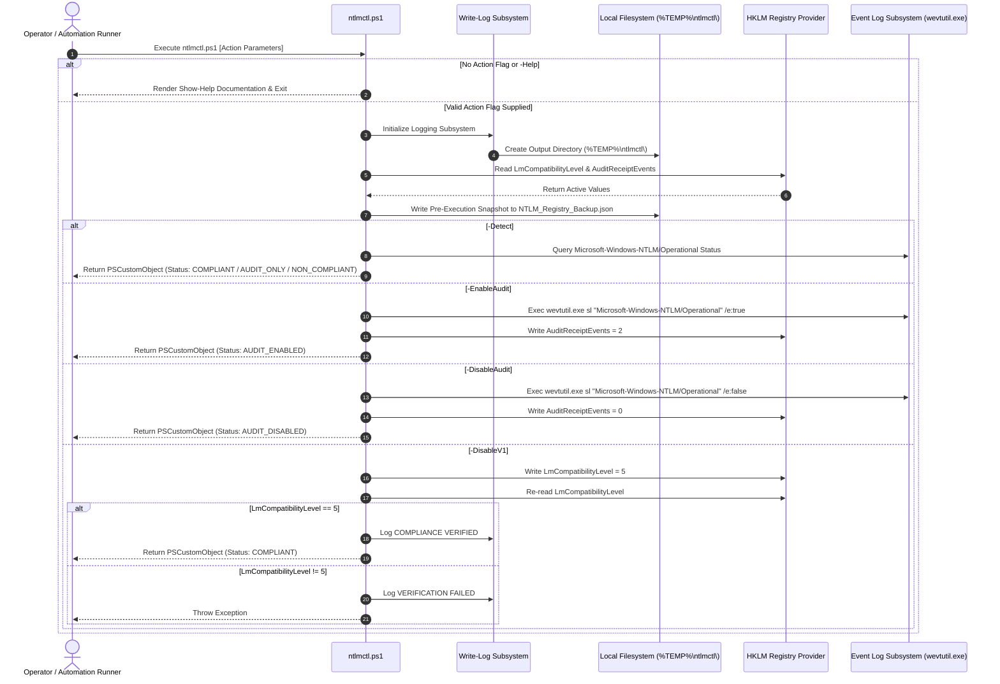

# NTLM Protocol & Audit Manager: ntlmctl.ps1

**Version:** 2.1.0  
**Date:** 2026-07-23  
**Target Environment:** Windows Server 2016+ / Windows 10+ (PowerShell 5.1+)

---

## 1. Executive Summary and Architecture Overview

`ntlmctl.ps1` is a PowerShell management script designed to control Windows Local Security Authority (LSA) NTLM authentication protocol enforcement and auditing settings across standalone and domain-joined Windows operating systems.

The tool provides targeted control over the LSA Security Support Provider (SSP) authentication levels (`LmCompatibilityLevel`) and incoming NTLM audit events (`AuditReceiptEvents`), enabling system administrators and security engineers to audit, enforce, or revert NTLM security policies without external module dependencies.

### Primary Operational Objectives
* **Protocol Compliance Enforcement (`-DisableV1`):** Enforces security compliance by setting `LmCompatibilityLevel = 5` (REG_DWORD) under `HKLM:\SYSTEM\CurrentControlSet\Control\Lsa` to require NTLMv2 exclusively and refuse legacy LM and NTLMv1 authentication attempts.
* **Optional Transition & Diagnostic Auditing (`-EnableAudit` / `-DisableAudit`):**
  * `-EnableAudit`: Activates incoming NTLM audit logging (`AuditReceiptEvents = 2` under `MSV1_0` and event channel `/e:true`) to identify legacy clients during pre-migration discovery or post-enforcement diagnostics.
  * `-DisableAudit`: Deactivates incoming NTLM audit logging (`AuditReceiptEvents = 0` under `MSV1_0` and event channel `/e:false`).
* **Non-Mutating State Inspection (`-Detect`):** Evaluates host compliance based strictly on `LmCompatibilityLevel = 5`, reporting `COMPLIANT` when NTLMv1 is disabled regardless of audit channel state.
* **Guardrail Execution:** Executing `.\ntlmctl.ps1` without an action flag (`-DisableV1`, `-EnableAudit`, `-DisableAudit`, or `-Detect`) displays usage documentation (`Show-Help`) and terminates with zero side effects.

---

## 2. Windows LSA & NTLM Technical Specifications

> [!WARNING]
> **Reboot & Active Session Operational Impact:**
> * **No Reboot Required:** The Local Security Authority Subsystem Service (`lsass.exe`) dynamically evaluates `LmCompatibilityLevel` and `AuditReceiptEvents` in real-time. System reboots or service restarts are not required.
> * **Existing Network Sessions:** Protocol changes take effect immediately for all *new* incoming authentication negotiations. Pre-existing active SMB/RPC sessions established prior to execution remain authenticated until session renewal or manual termination occurs (`Close-SmbSession`).

### 2.1 LmCompatibilityLevel Registry Mapping

The `LmCompatibilityLevel` registry entry under `HKLM:\SYSTEM\CurrentControlSet\Control\Lsa` determines which authentication protocol variants are negotiated by the MSV1_0 SSP.

| Value | Protocol Negotiation Level | Security Implications |
| :---: | :--- | :--- |
| **0** | Send LM & NTLM responses; never use NTLMv2 session security. | Vulnerable to DES session key extraction and hash relay attacks. |
| **1** | Send LM & NTLM responses; use NTLMv2 session security if negotiated. | Legacy fallback allowed; vulnerable to protocol downgrade. |
| **2** | Send NTLM responses only; refusal of LM authentication. | LM rejected; NTLMv1 authentication remains permitted. |
| **3** | Send NTLMv2 responses only; refuse LM & NTLMv1 for domain controllers. | Standard baseline; NTLMv1 permitted for member servers. |
| **4** | Send NTLMv2 responses only; refuse LM & NTLMv1 across member systems. | Strict client configuration; NTLMv1 rejected. |
| **5** | **Send NTLMv2 responses only; refuse LM & NTLMv1 universally (Enforced by `-DisableV1`).** | **Optimal hardening baseline. LM and NTLMv1 authentication requests are rejected.** |

> [!NOTE]
> **Technical Security Risks of the NTLMv1 Protocol:**
> 
> * **DES Cryptographic Weakness:** NTLMv1 derives session responses by splitting the user's 16-byte MD4 password hash into three 7-byte keys to encrypt an 8-byte server challenge using single DES (Data Encryption Standard). The 56-bit DES key space allows offline cracking of the underlying NTLM hash in deterministic time, regardless of password length or complexity.
> * **Credential Relay Vulnerabilities:** NTLMv1 lacks Channel Binding Tokens (CBT), Extended Protection for Authentication (EPA), and mandatory SMB signing protections. Challenge-response pairs captured via Man-in-the-Middle (MitM) positioning can be relayed in real-time to gain unauthorized execution contexts on network hosts.
> * **Absence of Server Mutual Authentication:** Unlike Kerberos, NTLMv1 does not authenticate the server to the client. Rogue authentication endpoints can accept NTLMv1 responses to harvest credential hashes without Detection.
> * **Lack of Session Key Integrity:** NTLMv1 session keys are derived using weak algorithm negotiations vulnerable to session key extraction and downgrade attacks.

### 2.2 NTLM Audit Architecture & Event Log Channel

Incoming NTLM authentication auditing is governed by the `MSV1_0` subkey property `AuditReceiptEvents` in conjunction with the Windows Event Log subsystem.

* **Registry Subkey:** `HKLM:\SYSTEM\CurrentControlSet\Control\Lsa\MSV1_0`
* **Value Name:** `AuditReceiptEvents` (REG_DWORD)
  * `0`: Auditing Disabled.
  * `1`: Audit incoming NTLMv1 traffic.
  * `2`: Audit all incoming NTLM traffic (NTLMv1 and NTLMv2).
* **Event Log Channel:** `Microsoft-Windows-NTLM/Operational`
* **Log File Location:** `%SystemRoot%\System32\Winevt\Logs\Microsoft-Windows-NTLM%4Operational.evtx`

#### Generated Event IDs

| Event ID | Provider | Description |
| :---: | :--- | :--- |
| **8001** | `Microsoft-Windows-NTLM` | Audit incoming NTLM authentication attempt. Captures client account name, domain, workstation, and negotiated process. |
| **8002** | `Microsoft-Windows-NTLM` | NTLM authentication blocked by policy. |
| **8003** | `Microsoft-Windows-NTLM` | NTLMv1 incoming authentication attempt logged (identifies legacy clients prior to enforcement). |
| **8004** | `Microsoft-Windows-NTLM` | Domain Controller NTLM authentication audit event. |

### 2.3 Group Policy Interoperability

Local registry configurations set by `ntlmctl.ps1` correspond to the following Group Policy object path:

* **GPO Path:** `Computer Configuration\Windows Settings\Security Settings\Local Policies\Security Options`
* **GPO Policy Name:** `Network security: LAN Manager authentication level`
* **GPO Audit Policy Name:** `Network security: Restrict NTLM: Audit Incoming NTLM Traffic`

*Note:* Local registry assignments will be overwritten during Group Policy refresh cycles (`gpupdate /force`) if domain GPOs enforce conflicting configurations for `LmCompatibilityLevel` or `AuditReceiptEvents`.

---

## 3. Control Logic and Execution Flow

### 3.1 Execution State Machine



### 3.2 Sequence Diagram



---

## 4. Dependencies and Subsystem Requirements

| Dependency | Component | Minimum Version | Operational Role |
| :--- | :--- | :--- | :--- |
| **Runtime Host** | PowerShell Engine | 5.1 | Core execution host and parameter binding engine |
| **Security Authority** | LSA Subsystem (`lsass.exe`) | Windows OS Native | Target authority for `LmCompatibilityLevel` enforcement |
| **Log Management Utility** | `wevtutil.exe` | Windows OS Native | Command-line utility for toggling event channel enablement |
| **Diagnostics Module** | `Get-WinEvent` | `Microsoft.PowerShell.Diagnostics` | Inspects event log channel properties and status |
| **Serialization Utility** | `ConvertTo-Json` | `Microsoft.PowerShell.Utility` | Exports pre-execution registry snapshots to JSON |

---

## 5. Security Control Analysis

* **Credential Handling:** The script does not collect, process, cache, or transmit plain-text credentials or authorization tokens.
* **Privilege Scope:** Requires process elevation (`#requires -RunAsAdministrator`) to write to protected registry paths under `HKLM:\SYSTEM\CurrentControlSet\Control\Lsa`.
* **Execution Boundary:** Built exclusively using core Windows PowerShell cmdlets and native Windows system binaries (`wevtutil.exe`). No third-party modules or external binary dependencies are loaded.
* **Process Exit Safety:** Replaces hard process termination calls (`exit`) with `return` and `throw` statements to allow parent orchestration runners to manage script life-cycle and trap exceptions cleanly.

---

## 6. Code Quality and Static Analysis

* **Static Analysis Verification:** Validated with `pslint.ps1 -Strict` (wrapping `PSScriptAnalyzer` v1.25.0), passing with **0 Errors** and **0 Warnings**.
* **Host Output Scope:** `Write-Host` invocations inside logging and help functions are explicitly suppressed via `[Diagnostics.CodeAnalysis.SuppressMessageAttribute("PSAvoidUsingWriteHost", "")]`.
* **Log Record Schema:** Enforces timestamped (`yyyy-MM-dd HH:mm:ss`) and hostname-tagged (`[$env:COMPUTERNAME]`) log entries across stdout and file destinations.

---

## 7. Command Line Argument Reference

| Parameter | Alias | Type | Default Value | Technical Description |
| :--- | :--- | :--- | :--- | :--- |
| **`-DisableV1`** | `-dv1` | `[Switch]` | `$false` | Enforces NTLMv2 protocol hardening (`LmCompatibilityLevel = 5`). Can be combined with `-EnableAudit` or `-DisableAudit`. |
| **`-EnableAudit`** | `-a` | `[Switch]` | `$false` | Sets `AuditReceiptEvents = 2` and enables `Microsoft-Windows-NTLM/Operational` event log channel. Mutually exclusive with `-DisableAudit`. |
| **`-DisableAudit`** | `-da` | `[Switch]` | `$false` | Sets `AuditReceiptEvents = 0` and disables `Microsoft-Windows-NTLM/Operational` event log channel. Mutually exclusive with `-EnableAudit`. |
| **`-Batch`** | `-b` | `[Switch]` | `$false` | Suppresses confirmation prompts by overriding `$ConfirmPreference = 'None'`. Requires a modifying switch (`-DisableV1`, `-EnableAudit`, or `-DisableAudit`). |
| **`-Detect`** | `-d` | `[Switch]` | `$false` | Exclusive read-only compliance inspection switch. Cannot be combined with modifying switches or `-Batch`. |
| **`-Help`** | `-h`, `-?` | `[Switch]` | `$false` | Exclusive help switch; renders usage documentation and parameter descriptions. |
| **`-LogPath`** | | `[String]` | `%TEMP%\ntlmctl\NTLM_Hardening.log` | Target file path for execution logging. |
| **`-BackupPath`** | | `[String]` | `%TEMP%\ntlmctl\NTLM_Registry_Backup.json` | Target file path for pre-execution JSON registry backup. |
| **`-WhatIf`** | | `[Switch]` | `$false` | Native PowerShell dry-run flag; previews registry and event log changes without executing mutations. |

---

## 8. Deployment and Execution Examples

### 8.1 Default Invocation (Usage Help Display)

Executing the script without an action parameter renders usage help and exits without modifying system state:

```powershell
.\ntlmctl.ps1
```

---

### 8.2 Protocol Enforcement Execution (`-DisableV1 -Batch`)

Enforces `LmCompatibilityLevel = 5` non-interactively in batch mode:

```powershell
.\ntlmctl.ps1 -DisableV1 -Batch
```

**Pipeline Output Object:**

```text
[2026-07-23 18:50:30] [CS-MAIN] [INFO] Initializing NTLM Protocol & Audit Manager (ntlmctl.ps1)...
[2026-07-23 18:50:30] [CS-MAIN] [INFO] Inspecting prior registry state...
[2026-07-23 18:50:30] [CS-MAIN] [INFO] PRIOR STATE -> LmCompatibilityLevel: 5 | AuditReceiptEvents: Not Set
[2026-07-23 18:50:30] [CS-MAIN] [INFO] Saved pre-execution registry state backup to: F:\TEMP\ntlmctl\NTLM_Registry_Backup.json
[2026-07-23 18:50:30] [CS-MAIN] [INFO] -DisableV1 flag specified. Applying LmCompatibilityLevel = 5 (Send NTLMv2 response only. Refuse LM & NTLMv1)...
[2026-07-23 18:50:30] [CS-MAIN] [INFO] POST INSPECTION -> LmCompatibilityLevel: 5
[2026-07-23 18:50:30] [CS-MAIN] [SUCCESS] COMPLIANCE VERIFIED: LmCompatibilityLevel=5.

ComputerName       : CS-MAIN
PriorLmLevel       : 5
AppliedLmLevel     : 5
PriorAuditEvents   : Not Set
AppliedAuditEvents : Skipped (Not Specified)
Status             : COMPLIANT
Timestamp          : 2026-07-23 18:50:30
OutputDir          : F:\TEMP\ntlmctl
LogPath            : F:\TEMP\ntlmctl\NTLM_Hardening.log
BackupPath         : F:\TEMP\ntlmctl\NTLM_Registry_Backup.json
```

---

### 8.3 Audit Activation Execution (`-EnableAudit -Batch`)

Activates incoming NTLM auditing (`AuditReceiptEvents = 2`) and enables the `Microsoft-Windows-NTLM/Operational` log channel without altering `LmCompatibilityLevel`:

```powershell
.\ntlmctl.ps1 -EnableAudit -Batch
```

---

### 8.4 Audit Deactivation Execution (`-DisableAudit -Batch`)

Deactivates incoming NTLM auditing (`AuditReceiptEvents = 0`) and disables the `Microsoft-Windows-NTLM/Operational` log channel without altering `LmCompatibilityLevel`:

```powershell
.\ntlmctl.ps1 -DisableAudit -Batch
```

---

### 8.5 Read-Only Compliance State Inspection (`-Detect`)

Evaluates active registry configuration and event channel enablement without making changes:

```powershell
.\ntlmctl.ps1 -Detect
```

---

### 8.6 Pipeline JSON Serialization

Invokes state detection and pipe-serializes the resulting `PSCustomObject` to JSON:

```powershell
.\ntlmctl.ps1 -Detect | ConvertTo-Json
```
