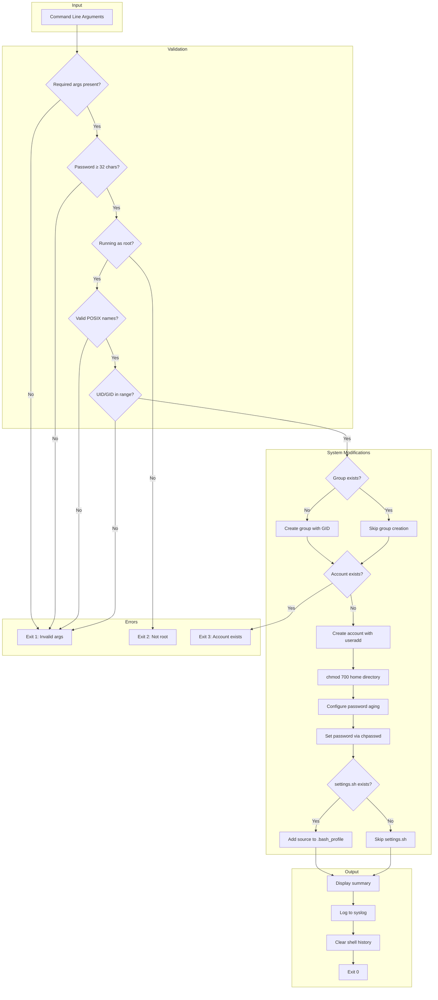
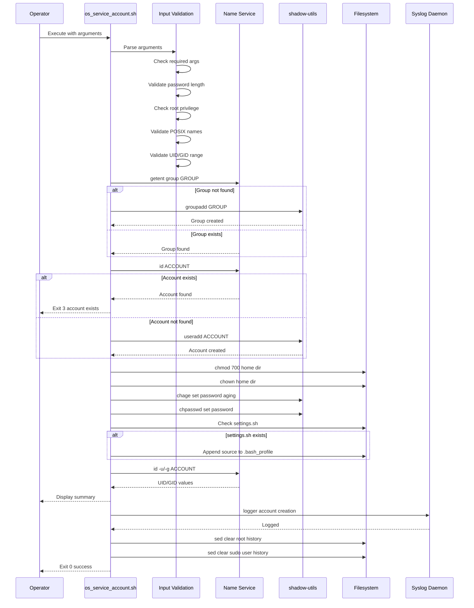

# os_service_account.sh

**Version:** 1.0.0  
**Date:** 2026-06-16  
**Classification:** Infrastructure Provisioning Script

---

## Table of Contents

1. [Application Overview and Objectives](#1-application-overview-and-objectives)
2. [Architecture and Design Choices](#2-architecture-and-design-choices)
3. [Assumptions and Edge Cases](#3-assumptions-and-edge-cases)
4. [Data Flow and Control Logic](#4-data-flow-and-control-logic)
5. [Dependencies](#5-dependencies)
6. [Security Assessment](#6-security-assessment)
7. [Command Line Arguments](#7-command-line-arguments)
8. [Deployment and Usage Examples](#8-deployment-and-usage-examples)

---

## 1. Application Overview and Objectives

### 1.1 Purpose

`os_service_account.sh` is a Bash script that provisions unprivileged OS service accounts for automation on Linux systems. The script creates dedicated service accounts with restricted privileges to run scheduled jobs against application, database and configuration files.

### 1.2 Objectives

| Objective | Description |
|-----------|-------------|
| **Account Provisioning** | Create a dedicated POSIX-compliant service account with configurable UID |
| **Group Management** | Create or reuse a primary group with configurable GID |
| **Security Hardening** | Apply restrictive permissions and password policies |
| **Environment Configuration** | Configure shell profile with global environment settings |
| **Audit Trail** | Log account creation to syslog for compliance tracking |
| **Credential Protection** | Clear shell history to prevent password exposure |

### 1.3 Use Case

The primary use case is provisioning  service accounts that executes scripts via cron or systemd timer. This account typically requires:

- Read access to application configuration files
- R/W access to application data directories
- Database access for reporting or application troubleshooting
- No interactive login requirements (though shell access is preserved for troubleshooting)

### 1.4 Exit Codes

| Code | Meaning |
|------|---------|
| `0` | Success - account created and configured |
| `1` | Invalid arguments (missing, malformed, or out of range) |
| `2` | Insufficient privileges (not running as root) |
| `3` | Account creation failed (e.g., account already exists) |

---

## 2. Architecture and Design Choices

### 2.1 Script Architecture

The script follows a linear, fail-fast architecture with the following phases:


### 2.2 Design Decisions

| Decision | Rationale |
|----------|-----------|
| **Bash over Python/Perl** | Minimizes dependencies; uses only POSIX utilities present on all Linux systems |
| **Fail-fast with `set -e`** | Prevents partial execution that could leave system in inconsistent state |
| **Validation before modification** | All inputs validated before any system changes occur |
| **Idempotent group creation** | Checks group existence before creation; allows rerunning for different accounts in same group |
| **Non-idempotent account creation** | Explicitly fails if account exists to prevent accidental modification of existing accounts |
| **Shell set to /bin/bash** | Allows interactive troubleshooting while still being suitable for cron execution |
| **UID/GID range 5000-50000** | Avoids collision with system accounts (0-999), standard user accounts (1000-4999), and high-range reserved IDs |
| **Heredoc for chpasswd** | Avoids password exposure in process list (`ps aux`) |
| **umask 027** | Default file permissions of 640 (rw-r-----) and directory permissions of 750 (rwxr-x---) |

### 2.3 Constants Configuration

The following constants can be adjusted per organizational policy by editing the script:

```bash
readonly MIN_PASSWORD_LENGTH=32   # Minimum password length
readonly MIN_ID_NUMBER=5000       # Minimum UID/GID
readonly MAX_ID_NUMBER=50000      # Maximum UID/GID
```

---

## 3. Assumptions and Edge Cases

### 3.1 Assumptions

| Assumption | Impact if Invalid |
|------------|-------------------|
| Linux operating system with GNU coreutils | Script will fail on BSD, macOS, or minimal containers |
| `/home` is the home directory base | Accounts with non-standard home bases require script modification |
| `shadow-utils` package installed | `useradd`, `groupadd`, `chpasswd`, `chage` commands unavailable |
| `util-linux` package installed | `logger` command unavailable; syslog entry not created |
| Local authentication (not LDAP/AD-managed) | Script creates local accounts; may conflict with directory services |
| `/opt/scripts/settings.sh` path convention | Global environment file may be in different location |
| Syslog daemon running | Audit log entry not recorded |

### 3.2 Edge Cases

| Edge Case | Handling |
|-----------|----------|
| Account already exists | Exits with code 3; no modifications made |
| Group already exists | Reuses existing group; logs informational message |
| UID/GID already in use | `useradd`/`groupadd` fails; script exits via `errexit` |
| Password contains special characters | Handled correctly via proper quoting; user must quote on command line |
| Home directory already exists | `useradd -m` does not fail but may not set permissions correctly |
| `/opt/scripts/settings.sh` missing | Skips with informational message; account still created |
| No shell history file | Silently skips history clearing |
| Run without sudo | Exits with code 2 before any modifications |
| Empty UID/GID arguments | Treated as unspecified; auto-assignment used |

### 3.3 Known Limitations

1. **Single group membership**: Only sets primary group; supplementary groups must be added separately via `usermod -aG`
2. **No SSH key provisioning**: Public keys must be added manually to `~/.ssh/authorized_keys`
3. **No sudoers configuration**: If sudo access needed, must be configured separately
4. **Password in command line**: Despite history clearing, password may appear in process accounting or audit logs
5. **No rollback on partial failure**: If script fails mid-execution, manual cleanup may be required

---

## 4. Data Flow and Control Logic

### 4.1 Operational Flow Diagram



### 4.2 Data Sequence Diagram



### 4.3 Code Component Relations

| Component | Function | Dependencies |
|-----------|----------|--------------|
| `_usage()` | Display help and exit | None |
| `_error()` | Display error and exit | None |
| `_info()` | Display informational message | None |
| Argument parsing loop | Populate global variables | None |
| Input validation block | Validate all inputs | `id` command |
| Group creation block | Create group if needed | `getent`, `groupadd` |
| Account existence check | Prevent duplicate accounts | `id` command |
| Account creation block | Create user account | `useradd` |
| Home directory block | Set restrictive permissions | `chmod`, `chown` |
| Password aging block | Configure chage policy | `chage` |
| Password assignment block | Set account password | `chpasswd` |
| Bash profile block | Configure environment | `cat`, `grep`, `echo` |
| Verification block | Display summary | `id`, `chage -l`, `groups` |
| Audit logging block | Log to syslog | `logger` |
| History cleanup block | Remove sensitive commands | `sed` |

---

## 5. Dependencies

### 5.1 System Packages

| Package | Commands Used | RHEL/CentOS | Debian/Ubuntu |
|---------|---------------|-------------|---------------|
| `shadow-utils` | `useradd`, `groupadd`, `chpasswd`, `chage` | `shadow-utils` | `passwd` |
| `util-linux` | `logger` | `util-linux` | `util-linux` |
| `glibc-common` | `getent` | `glibc-common` | `libc-bin` |
| `sed` | `sed` | `sed` | `sed` |
| `coreutils` | `chmod`, `chown`, `cat`, `echo`, `id`, `groups` | `coreutils` | `coreutils` |
| `grep` | `grep` | `grep` | `grep` |
| `bash` | Shell interpreter | `bash` | `bash` |

### 5.2 Verification Commands

```bash
# RHEL/CentOS/Rocky/Alma
rpm -q shadow-utils util-linux glibc-common sed coreutils grep bash

# Debian/Ubuntu
dpkg -l passwd util-linux libc-bin sed coreutils grep bash
```

### 5.3 Minimum Versions

| Dependency | Minimum Version | Notes |
|------------|-----------------|-------|
| Bash | 4.0+ | Required for `[[ ]]` conditionals and `<<<` heredoc |
| GNU sed | 4.0+ | Required for `-i` in-place editing |
| shadow-utils | 4.1+ | Required for `chpasswd` stdin support |

### 5.4 Optional Dependencies

| Component | Purpose | Impact if Missing |
|-----------|---------|-------------------|
| `/opt/scripts/settings.sh` | Global environment variables | Skipped with informational message |
| Syslog daemon (rsyslog/syslog-ng) | Audit logging | Logger succeeds but entry not persisted |
| `~/.bash_history` | History cleanup | Silently skipped |

---

## 6. Security Assessment

### 6.1 Security Controls Summary

| Control Area | Implementation | Status |
|--------------|----------------|--------|
| Privilege escalation | Requires root; validates with `id -u` | ✓ Implemented |
| Input validation | POSIX regex for names; range check for UID/GID | ✓ Implemented |
| Password policy | Minimum 32 characters enforced | ✓ Implemented |
| Credential exposure | Heredoc prevents process list exposure | ✓ Implemented |
| Audit trail | Syslog logging with user attribution | ✓ Implemented |
| File permissions | Home directory 700; files 640 via umask | ✓ Implemented |
| History cleanup | sed removes command from bash history | ✓ Implemented |

### 6.2 Encryption in Transit

| Data | Encryption | Notes |
|------|------------|-------|
| Password argument | None | Password passed in cleartext on command line |
| Syslog transmission | Depends on syslog configuration | Local logging uses Unix socket |
| Network traffic | N/A | Script operates locally only |

**Recommendation:** For environments requiring encryption of credentials in transit, consider:
- Using a secrets manager (HashiCorp Vault, AWS Secrets Manager)
- Prompting for password interactively with `read -s`
- Using SSH key authentication instead of passwords

### 6.3 Secret Management

| Secret | Storage | Exposure Risk |
|--------|---------|---------------|
| Account password | Command-line argument | High - visible in process list briefly; may appear in audit logs |
| Password in history | Cleared from `.bash_history` | Medium - cleared after execution; may exist in memory |

**Mitigations implemented:**
1. Heredoc (`<<<`) used instead of `echo ... | chpasswd` to minimize process list exposure
2. Shell history cleared for both root and sudo user
3. Syslog entry does not include password

**Residual risks:**
- Process accounting logs (`/var/log/psacct`) may capture command line
- `auditd` with `execve` auditing will capture command line
- Terminal recordings (script, screen logs) may capture command
- Memory forensics could recover password

### 6.4 Authentication Configuration

| Setting | Value | Rationale |
|---------|-------|-----------|
| Password minimum length | 32 characters | Compliance requirement; exceeds NIST 800-63B minimum |
| Password aging (max days) | 99999 (~273 years) | Service accounts should not expire; rotation handled operationally |
| Password aging (min days) | 0 | Allow immediate change if compromised |
| Inactive lock | Disabled (-1) | Service accounts should not lock |
| Account expiration | Disabled (-1) | Service accounts should not expire |

**Note:** These settings are appropriate for service accounts. Interactive user accounts should have stricter aging policies.

### 6.5 Role-Based Access Control (RBAC)

| Principal | Access Level | Mechanism |
|-----------|--------------|-----------|
| Service account | Owner of home directory | POSIX file permissions (700) |
| Primary group | No access to home directory | Excluded by 700 permissions |
| Other users | No access to home directory | Excluded by 700 permissions |
| Root | Full access | Standard root privileges |

**Additional RBAC considerations:**
- Service account has no sudo privileges by default
- Supplementary group membership must be configured separately
- SELinux/AppArmor contexts not configured by this script

### 6.6 Unprivileged Context

| Aspect | Implementation |
|--------|----------------|
| UID range | 5000-50000 (non-system range) |
| No setuid binaries | Account owns no setuid/setgid files |
| No capabilities | Account has no special Linux capabilities |
| No sudo | Not added to sudoers |
| Login shell | `/bin/bash` (interactive capable but not privileged) |

### 6.7 Library and Utility Versions

All dependencies are standard Linux system utilities with long-standing security track records:

| Utility | CVE History | Notes |
|---------|-------------|-------|
| `useradd`/`groupadd` | Rare | Part of shadow-utils; heavily audited |
| `chpasswd` | Rare | Part of shadow-utils |
| `sed` | Rare | GNU sed is mature and stable |
| `logger` | None significant | Simple syslog interface |

**Recommendation:** Keep system packages updated via standard OS patch management.

### 6.8 Security Recommendations

1. **High Priority:**
   - Consider interactive password prompt (`read -s`) for high-security environments
   - Enable auditd exclusion rules if command-line logging is a concern
   - Implement secrets rotation procedure for service account passwords

2. **Medium Priority:**
   - Configure SELinux/AppArmor context for the service account
   - Add supplementary group membership for least-privilege file access
   - Implement SSH key authentication as alternative to password

3. **Low Priority:**
   - Consider `/sbin/nologin` shell if interactive access never needed
   - Implement account lockout monitoring via `faillock`

---

## 7. Command Line Arguments

### 7.1 Argument Reference

| Argument | Type | Required | Default | Description |
|----------|------|----------|---------|-------------|
| `--account <name>` | String | Yes | None | Service account username. Must be POSIX-compliant: starts with lowercase letter or underscore, followed by lowercase letters, digits, underscores, or dashes. |
| `--password <pass>` | String | Yes | None | Account password. Minimum 32 characters. Should be quoted if contains special characters. |
| `--group <name>` | String | Yes | None | Primary group name. Created if it does not exist. Must follow same POSIX naming rules as account. |
| `--uid <number>` | Integer | No | Auto-assigned | User ID number. Must be in range 5000-50000. |
| `--gid <number>` | Integer | No | Auto-assigned | Group ID number. Must be in range 5000-50000. Only used if group is being created. |
| `-h, --help` | Flag | No | N/A | Display usage information and exit. |

### 7.2 Validation Rules

| Argument | Validation | Error Message |
|----------|------------|---------------|
| `--account` | Required; regex `^[a-z_][a-z0-9_-]*$` | "Invalid account name: '...'. Must be lowercase alphanumeric with _ or -" |
| `--password` | Required; length ≥ 32 | "Password must be at least 32 characters" |
| `--group` | Required; regex `^[a-z_][a-z0-9_-]*$` | "Invalid group name: '...'. Must be lowercase alphanumeric with _ or -" |
| `--uid` | Optional; numeric; 5000-50000 | "UID '...' out of range. Must be 5000-50000 (non-system accounts)" |
| `--gid` | Optional; numeric; 5000-50000 | "GID '...' out of range. Must be 5000-50000 (non-system groups)" |

### 7.3 Argument Examples

```bash
# Minimum required arguments (UID/GID auto-assigned)
--account myappuser --password 'P@ssw0rd!ComplexString32CharsMin' --group myappgroup

# Full specification with explicit UID/GID
--account myappuser --password 'P@ssw0rd!ComplexString32CharsMin' --group myappgroup --uid 5020 --gid 5010

# Password with special characters (properly quoted)
--account myappuser --password 'My$ecret!P@ss"w0rd&With<Special>Chars' --group myappgroup
```

---

## 8. Deployment and Usage Examples

### 8.1 Pre-Deployment Checklist

```bash
# 1. Verify root access
sudo -v

# 2. Verify required packages
which useradd groupadd chpasswd chage logger getent sed

# 3. Check if account/group already exist
id myappuser 2>/dev/null && echo "Account exists" || echo "Account available"
getent group myappgroup && echo "Group exists" || echo "Group available"

# 4. Verify UID/GID availability
getent passwd 5020 && echo "UID 5020 in use" || echo "UID 5020 available"
getent group 5010 && echo "GID 5010 in use" || echo "GID 5010 available"

# 5. Generate secure password (32+ characters)
openssl rand -base64 32
```

### 8.2 Basic Deployment

```bash
# Deploy with auto-assigned UID/GID
sudo ./os_service_account.sh \
    --account myappuser \
    --password 'Min32CharacterPasswordRequired!!' \
    --group myappgroup
```

**Expected Output:**

```
[INFO] Creating group: myappgroup (GID: auto-assigned)
[INFO] Creating service account: myappuser (UID: auto-assigned, Group: myappgroup)
[INFO] Setting home directory permissions: /home/myappuser
[INFO] Configuring password policy (no expiration)
[INFO] Setting account password
[INFO] Configuring .bash_profile
[INFO] Skipping settings.sh (/opt/scripts/settings.sh not found)

============================================================
  Service Account Created Successfully
============================================================

Account Details:
  Username:   myappuser
  UID:        5001
  Group:      myappgroup
  GID:        5001
  Home:       /home/myappuser
  Shell:      /bin/bash

Password Aging:
Last password change                                    : Jun 16, 2026
Password expires                                        : never
Password inactive                                       : never
Account expires                                         : never
Minimum number of days between password change          : 0
Maximum number of days between password change          : 99999
Number of days of warning before password expires       : 7

Group Membership:
myappuser : myappgroup

============================================================
[INFO] Clearing this command from shell history (security)
[INFO] Removed os_service_account entries from /root/.bash_history
```

### 8.3 Deployment with Explicit UID/GID

```bash
# Deploy with specific UID/GID (for consistency across environments)
sudo ./os_service_account.sh \
    --account myappuser \
    --password 'Min32CharacterPasswordRequired!!' \
    --group myappgroup \
    --uid 5020 \
    --gid 5010
```

**Expected Output:**

```
[INFO] Creating group: myappgroup (GID: 5010)
[INFO] Creating service account: myappuser (UID: 5020, Group: myappgroup)
[INFO] Setting home directory permissions: /home/myappuser
[INFO] Configuring password policy (no expiration)
[INFO] Setting account password
[INFO] Configuring .bash_profile
[INFO] Skipping settings.sh (/opt/scripts/settings.sh not found)

============================================================
  Service Account Created Successfully
============================================================

Account Details:
  Username:   myappuser
  UID:        5020
  Group:      myappgroup
  GID:        5010
  Home:       /home/myappuser
  Shell:      /bin/bash

Password Aging:
Last password change                                    : Jun 16, 2026
Password expires                                        : never
Password inactive                                       : never
Account expires                                         : never
Minimum number of days between password change          : 0
Maximum number of days between password change          : 99999
Number of days of warning before password expires       : 7

Group Membership:
myappuser : myappgroup

============================================================
[INFO] Clearing this command from shell history (security)
[INFO] Removed os_service_account entries from /root/.bash_history
[INFO] Removed os_service_account entries from /home/adminuser/.bash_history
```

### 8.4 Error Handling Examples

#### Missing Required Argument

```bash
sudo ./os_service_account.sh --account myappuser --group myappgroup
```

**Output:**

```
ERROR: Missing required argument: --password
```

**Exit code:** 1

#### Password Too Short

```bash
sudo ./os_service_account.sh \
    --account myappuser \
    --password 'TooShort123!' \
    --group myappgroup
```

**Output:**

```
ERROR: Password must be at least 32 characters
```

**Exit code:** 1

#### Not Running as Root

```bash
./os_service_account.sh \
    --account myappuser \
    --password 'Min32CharacterPasswordRequired!!' \
    --group myappgroup
```

**Output:**

```
ERROR: This script must be run as root
```

**Exit code:** 2

#### Account Already Exists

```bash
sudo ./os_service_account.sh \
    --account myappuser \
    --password 'Min32CharacterPasswordRequired!!' \
    --group myappgroup
```

**Output:**

```
[INFO] Group already exists: myappgroup
ERROR: Account already exists: myappuser
```

**Exit code:** 3

#### Invalid UID Range

```bash
sudo ./os_service_account.sh \
    --account myappuser \
    --password 'Min32CharacterPasswordRequired!!' \
    --group myappgroup \
    --uid 500
```

**Output:**

```
ERROR: UID '500' out of range. Must be 5000-50000 (non-system accounts)
```

**Exit code:** 1

### 8.5 Post-Deployment Verification

```bash
# Verify account creation
id myappuser
# Output: uid=5020(myappuser) gid=5010(myappgroup) groups=5010(myappgroup)

# Verify home directory permissions
ls -la /home/myappuser
# Output: drwx------ 2 myappuser myappgroup 4096 Jun 16 10:30 /home/myappuser

# Verify password aging
chage -l myappuser

# Verify syslog entry
sudo grep os_service_account /var/log/messages
# Output: Jun 16 10:30:45 hostname os_service_account.sh: Service account 'myappuser' (UID: 5020) created by root (SUDO_USER=adminuser)

# Verify shell history cleared
grep os_service_account ~/.bash_history
# Output: (none)

# Test account login
su - myappuser -c "whoami && pwd"
# Output:
# myappuser
# /home/myappuser
```

### 8.6 Integration with shell script

After account creation, configure the job:

```bash
# 1. Switch to service account
sudo su - myappuser

# 2. Create bin directory for scripts
mkdir -p ~/bin

# 3. Copy script
cp /path/to/myscript.sh ~/bin/
chmod 750 ~/bin/myscript.sh

# 4. Configure cron job
crontab -e
# Add: 0 2 * * * /home/myappuser/bin/myscript.sh --config /etc/myappuser/config.ini

# 5. Verify cron
crontab -l
```

### 8.7 Multi-Environment Deployment

For consistent UID/GID across development, staging, and production:

```bash
# environments.conf
# DEV:  UID=5020, GID=5010
# STG:  UID=5020, GID=5010
# PROD: UID=5020, GID=5010

# Deploy script (deploy_service_account.sh)
#!/bin/bash
ACCOUNT="myappuser"
GROUP="myappgroup"
UID_NUM="5020"
GID_NUM="5010"

# Generate password or retrieve from secrets manager
PASSWORD=$(vault kv get -field=password secret/myappuser)

sudo ./os_service_account.sh \
    --account "${ACCOUNT}" \
    --password "${PASSWORD}" \
    --group "${GROUP}" \
    --uid "${UID_NUM}" \
    --gid "${GID_NUM}"
```

### 8.8 Cleanup/Removal Procedure

If the service account needs to be removed:

```bash
# 1. Disable account (preserves for audit)
sudo usermod -L myappuser

# 2. Or delete account and home directory
sudo userdel -r myappuser

# 3. Remove group (if no longer needed)
sudo groupdel myappgroup

# 4. Verify removal
id myappuser
getent group myappgroup
```

---

## Appendix A: Quick Reference

```bash
# Help
./os_service_account.sh --help

# Basic deployment
sudo ./os_service_account.sh \
    --account myappuser \
    --password 'Min32CharacterPasswordRequired!!' \
    --group myappgroup

# Full deployment
sudo ./os_service_account.sh \
    --account myappuser \
    --password 'Min32CharacterPasswordRequired!!' \
    --group myappgroup \
    --uid 5020 \
    --gid 5010

# Verify
id myappuser
ls -la /home/myappuser
sudo grep os_service_account /var/log/messages
```

---

## Document History

| Version | Date | Author | Changes |
|---------|------|--------|---------|
| 1.0.0 | 2026-06-16 | — | Initial release |
