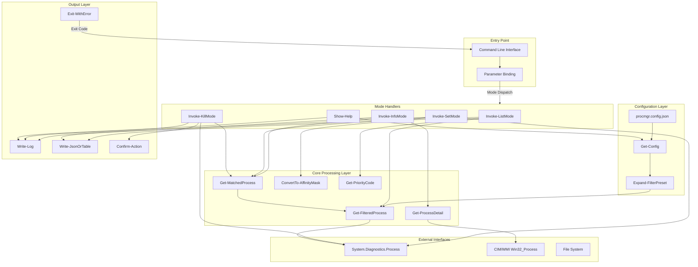
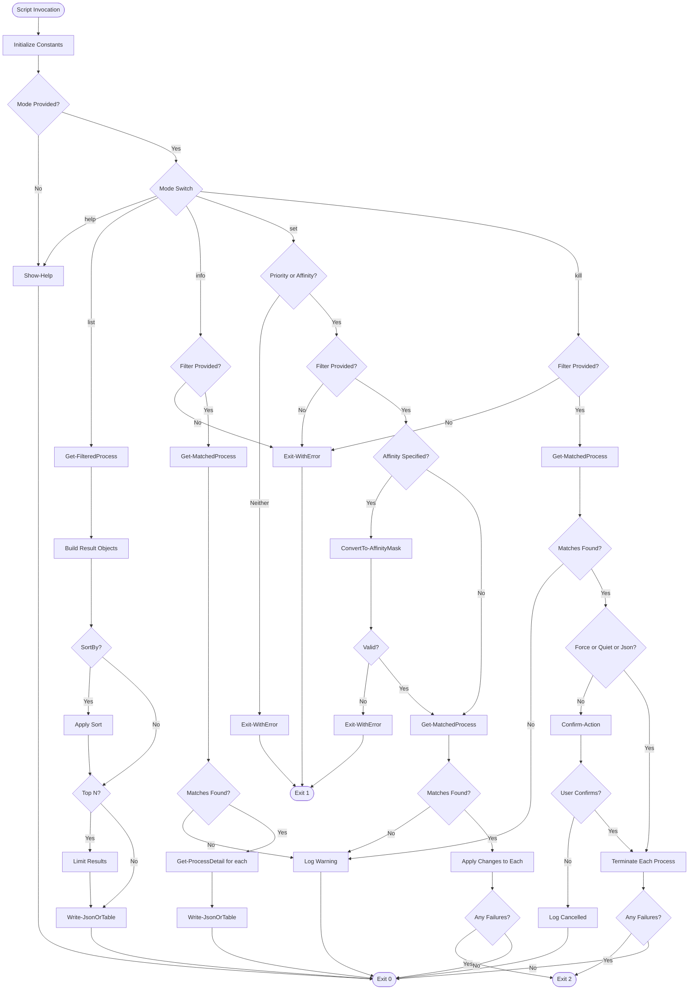
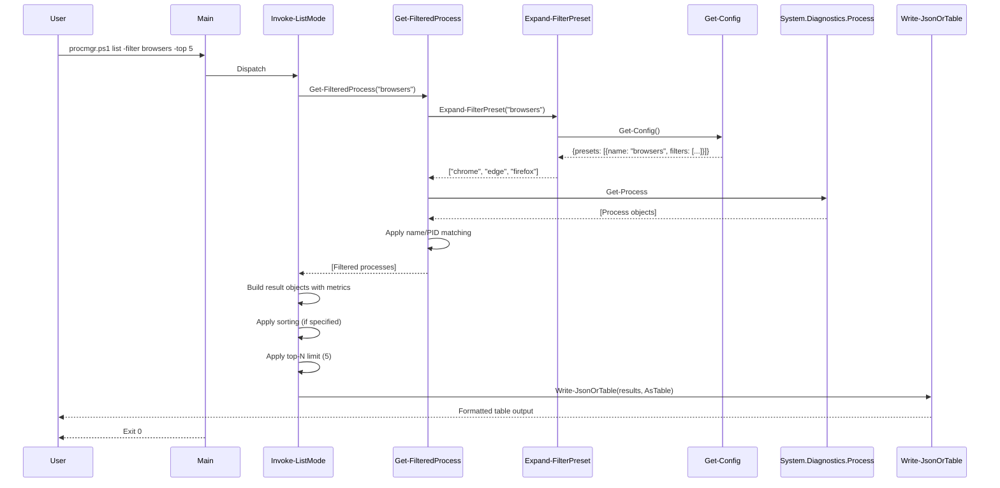
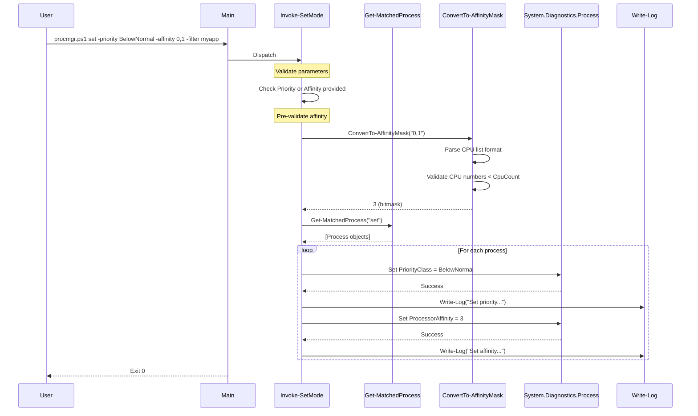
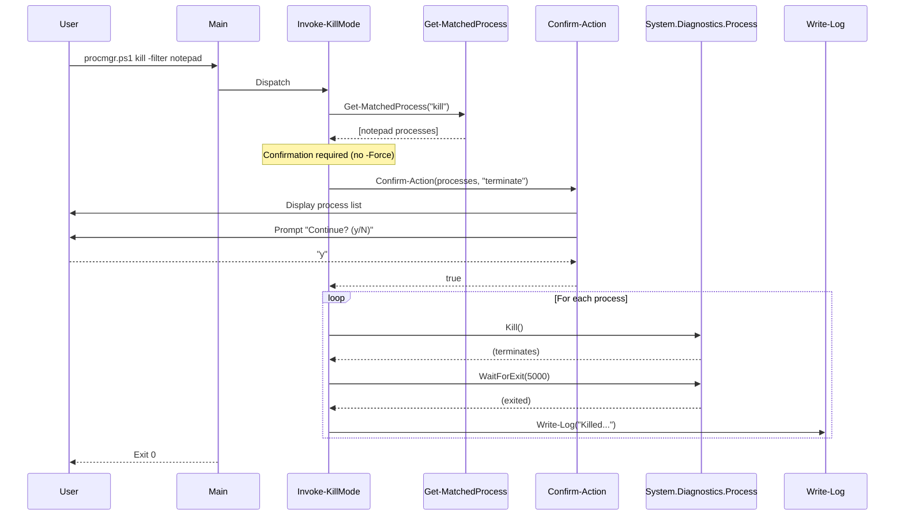
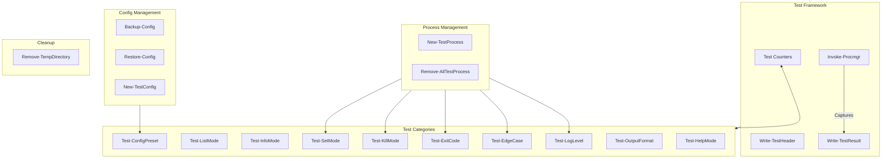

# procmgr.ps1 - Process Management Utility

<!-- 
    README Documentation for procmgr.ps1
    
    This document provides comprehensive technical documentation for the process
    management utility, targeting senior IT architects and infrastructure engineers.
    
    Document Version: 1.0.0
    Last Updated: 2026-07-08
    Maintainer: Infrastructure Team
-->

## Table of Contents

1. [Application Overview and Objectives](#application-overview-and-objectives)
2. [Architecture and Design](#architecture-and-design)
3. [Data Flow and Control Logic](#data-flow-and-control-logic)
4. [Dependencies](#dependencies)
5. [Security Assessment](#security-assessment)
6. [Command Line Arguments](#command-line-arguments)
7. [Usage Examples](#usage-examples)
8. [Test Suite Documentation](#test-suite-documentation)

---

## Application Overview and Objectives

<!--
    This section establishes the purpose, scope, and intended use cases for the
    utility. Understanding the objectives helps architects evaluate whether the
    tool fits their operational requirements.
-->

### Purpose

`procmgr.ps1` is a command-line process management utility for Windows systems. It provides a unified interface for process inspection, resource control, and lifecycle management through five operational modes.

### Objectives

| Objective | Description |
|-----------|-------------|
| **Process Visibility** | Provide consolidated view of running processes with key metrics (CPU, memory, priority, affinity, ownership) |
| **Resource Control** | Enable modification of process priority class and CPU affinity without requiring external tools |
| **Lifecycle Management** | Support controlled process termination with confirmation safeguards |
| **Automation Support** | Offer JSON output mode and appropriate exit codes for CI/CD and scripting integration |
| **Operational Safety** | Implement confirmation prompts and user-session filtering to prevent accidental system impact |

### Scope

The utility operates exclusively on Windows systems and interacts with processes through the .NET `System.Diagnostics.Process` class and Windows Management Instrumentation (WMI/CIM). It does not:

- Manage services (use `sc.exe` or `*-Service` cmdlets)
- Handle remote process management (local system only)
- Persist configuration changes (priority/affinity resets on process restart)
- Require or provide elevated privileges for standard operations

### Target Users

- System administrators performing routine process management
- DevOps engineers automating build/deployment environments
- Developers managing resource-intensive applications during development
- Operations teams monitoring and controlling application processes

---

## Architecture and Design

<!--
    This section documents the structural decisions, assumptions, and trade-offs
    made during development. Architects can use this to assess maintainability,
    extensibility, and alignment with organizational standards.
-->

### Architecture Diagram



### Design Choices

#### 1. Single-File Architecture

<!--
    The decision to use a single script file rather than a module structure
    was intentional for portability and deployment simplicity.
-->

**Decision**: Implement as a standalone `.ps1` script rather than a PowerShell module.

**Rationale**:
- Zero installation footprint - copy and execute
- No module path configuration required
- Simplified version management (single file to track)
- Suitable for inclusion in configuration management tools (Ansible, SCCM, etc.)

**Trade-off**: Cannot be imported into other scripts; must be invoked as external process.

#### 2. Session-Based Owner Detection

<!--
    WMI queries for process owner are expensive (~100ms per process). Using
    session ID comparison provides adequate ownership indication at minimal cost.
-->

**Decision**: Use `SessionId` comparison instead of WMI `GetOwner()` method.

**Rationale**:
- Performance: Session ID is a property of the Process object (no additional query)
- Sufficient granularity: Distinguishes user processes from system/service processes
- Scalability: O(1) per process vs O(n) with WMI queries

**Trade-off**: Cannot distinguish between different interactive users on terminal servers. Reports "User" for current session, "Other" for all others.

#### 3. Fail-Safe Affinity Validation

<!--
    Affinity changes are validated before any modifications to prevent partial
    application in multi-process scenarios.
-->

**Decision**: Pre-validate affinity mask before modifying any processes.

**Rationale**:
- Atomic operation semantics: Either all processes are modified or none
- Early failure: Invalid CPU numbers detected before any system changes
- Predictable behavior: Users can trust that partial failures are due to access rights, not input validation

#### 4. Configuration File Optional

<!--
    The config file provides convenience features but should never be required
    for core functionality.
-->

**Decision**: Configuration file is optional; all functionality available without it.

**Rationale**:
- Reduces deployment complexity
- Supports both ad-hoc and configured usage patterns
- Graceful degradation: Invalid or missing config produces warnings, not failures

### Assumptions

| Assumption | Implication |
|------------|-------------|
| PowerShell 5.1+ available | Uses `#Requires` directive; fails fast on older versions |
| Single-user context | Owner detection assumes current session is the relevant user |
| Local execution only | No remoting support; process objects are local |
| Interactive or automated | Supports both TTY (confirmation prompts) and non-TTY (force flag) contexts |
| Standard process permissions | Does not attempt to acquire elevated privileges |

### Edge Cases

<!--
    Documenting known edge cases helps operators understand expected behavior
    in unusual situations.
-->

| Edge Case | Behavior |
|-----------|----------|
| **No matching processes** | Exits with code 0 (success); logs warning unless `-Quiet` |
| **Process exits during operation** | Logs warning; continues with remaining processes; exit code 2 if any failures |
| **Access denied on process** | Catches exception; logs warning; reports failure in results; continues with others |
| **Invalid JSON in config** | Logs warning; proceeds without presets |
| **Config file missing** | Proceeds normally; presets unavailable |
| **CPU affinity out of range** | Fails validation before any modifications; exit code 1 |
| **Priority change on protected process** | Catches exception; reports failure; continues with others |
| **Empty filter string** | Treated as no filter; returns all processes |
| **Filter matches PID and name** | OR logic; process included if either matches |
| **RealTime priority without admin** | Access denied exception; reported as failure |

### Performance and Efficiency

<!--
    Performance characteristics are critical for operations teams who may run
    this utility frequently or against large process lists.
-->

| Operation | Complexity | Typical Duration | Notes |
|-----------|------------|------------------|-------|
| `list` (all processes) | O(n) | 200-500ms | n = process count; no WMI queries |
| `list` with filter | O(n) | 200-500ms | Filter applied in-memory after retrieval |
| `info` | O(m) | 50-100ms per process | m = matched processes; includes CIM query |
| `set` | O(m) | 10-50ms per process | Direct process object manipulation |
| `kill` | O(m) | 50-200ms per process | Includes 5-second wait for exit |

**Memory Footprint**: Minimal; process objects are lightweight. Peak memory during `list` of 500+ processes: approximately 20-30 MB.

**Optimization Strategies Employed**:
1. Single `Get-Process` call retrieves all processes
2. In-memory filtering avoids multiple API calls
3. CIM queries only in `info` mode where extended data is required
4. Lazy evaluation: Config file read only when presets referenced

---

## Data Flow and Control Logic

<!--
    This section provides detailed insight into how data moves through the
    application and how control decisions are made. Essential for debugging
    and extending the utility.
-->

### Operational Flow



### Code Relations

<!--
    Function dependency map showing which functions call which others.
    Useful for impact analysis when modifying code.
-->

| Function | Calls | Called By |
|----------|-------|-----------|
| `Write-Log` | (none) | `Get-Config`, `Get-MatchedProcess`, `Invoke-KillMode`, `Invoke-SetMode` |
| `Write-JsonOrTable` | (none) | `Invoke-ListMode`, `Invoke-InfoMode`, `Invoke-KillMode`, `Invoke-SetMode` |
| `Exit-WithError` | (none) | `Get-MatchedProcess`, `Invoke-SetMode` |
| `Get-Config` | (none) | `Expand-FilterPreset`, `Show-Help` |
| `Expand-FilterPreset` | `Get-Config` | `Get-FilteredProcess` |
| `Get-FilteredProcess` | `Expand-FilterPreset` | `Invoke-ListMode`, `Get-MatchedProcess` |
| `Get-MatchedProcess` | `Get-FilteredProcess`, `Exit-WithError`, `Write-Log` | `Invoke-InfoMode`, `Invoke-SetMode`, `Invoke-KillMode` |
| `Get-PriorityCode` | (none) | `Invoke-ListMode` |
| `Get-AffinityDisplay` | (none) | `Invoke-ListMode`, `Get-ProcessDetail` |
| `ConvertTo-AffinityMask` | (none) | `Invoke-SetMode` |
| `Get-ProcessDetail` | `Get-AffinityDisplay` | `Invoke-InfoMode` |
| `Confirm-Action` | (none) | `Invoke-KillMode` |
| `Invoke-ListMode` | `Get-FilteredProcess`, `Get-PriorityCode`, `Get-AffinityDisplay`, `Write-JsonOrTable` | Main |
| `Invoke-InfoMode` | `Get-MatchedProcess`, `Get-ProcessDetail`, `Write-JsonOrTable` | Main |
| `Invoke-SetMode` | `Get-MatchedProcess`, `ConvertTo-AffinityMask`, `Exit-WithError`, `Write-Log`, `Write-JsonOrTable` | Main |
| `Invoke-KillMode` | `Get-MatchedProcess`, `Confirm-Action`, `Write-Log`, `Write-JsonOrTable` | Main |
| `Show-Help` | `Get-Config` | Main |

### Data Sequence Diagrams

#### List Mode Sequence



#### Set Mode Sequence



#### Kill Mode Sequence



---

## Dependencies

<!--
    Complete dependency inventory for deployment planning and security review.
    Distinguishes between required and optional dependencies.
-->

### Runtime Dependencies

| Dependency | Type | Version | Purpose | Required |
|------------|------|---------|---------|----------|
| PowerShell | Runtime | 5.1+ | Script execution environment | Yes |
| .NET Framework | Runtime | 4.5+ (with PS 5.1) | Process class, StringBuilder | Yes |
| Windows OS | Platform | Server 2012+ / Windows 8+ | Process APIs, WMI provider | Yes |

### PowerShell Modules

| Module | Source | Purpose | Required |
|--------|--------|---------|----------|
| Microsoft.PowerShell.Management | Built-in | `Get-Process`, `Stop-Process` | Yes |
| CimCmdlets | Built-in | `Get-CimInstance` for extended process info | Yes (for `info` mode) |
| Microsoft.PowerShell.Utility | Built-in | `ConvertTo-Json`, `ConvertFrom-Json` | Yes |

### External Utilities

None required. The utility is self-contained and does not invoke external executables.

### File Dependencies

| File | Location | Purpose | Required |
|------|----------|---------|----------|
| `procmgr.ps1` | Script directory | Main utility script | Yes |
| `procmgr.config.json` | Script directory | Filter presets configuration | No |
| `procmgr_test.ps1` | Script directory | Test suite (development/validation) | No |

### Configuration File Schema

```json
{
  "$schema": "http://json-schema.org/draft-07/schema#",
  "type": "object",
  "properties": {
    "presets": {
      "type": "array",
      "items": {
        "type": "object",
        "required": ["name", "filters"],
        "properties": {
          "name": {
            "type": "string",
            "description": "Preset identifier used in -filter parameter"
          },
          "filters": {
            "type": "array",
            "items": { "type": "string" },
            "description": "Process name substrings to match"
          }
        }
      }
    }
  }
}
```

**Example Configuration**:

```json
{
  "presets": [
    { "name": "browsers", "filters": ["chrome", "edge", "firefox", "opera", "brave"] },
    { "name": "office", "filters": ["outlook", "teams", "excel", "word", "powerpoint", "onenote"] },
    { "name": "dev", "filters": ["code", "devenv", "rider", "idea", "node", "python"] },
    { "name": "comms", "filters": ["teams", "slack", "zoom", "discord"] }
  ]
}
```

---

## Security Assessment

<!--
    Security evaluation following standard assessment criteria. This section
    helps security teams evaluate risk and compliance.
-->

### Threat Model Context

| Attribute | Value |
|-----------|-------|
| **Deployment Context** | Local workstation/server utility |
| **Trust Boundary** | Local system; no network communication |
| **Data Classification** | Process metadata (names, PIDs, resource usage) |
| **User Context** | Interactive user or scheduled task identity |

### Encryption in Transit

**Assessment**: Not Applicable

The utility operates entirely locally. No network communication occurs:
- No remote process management
- No telemetry or analytics
- No update mechanism
- Configuration file is local filesystem only

### Secret Management

**Assessment**: Not Applicable

The utility does not handle secrets:
- No credentials stored or transmitted
- No API keys or tokens
- No encryption keys
- Configuration file contains only process name patterns

### Authentication Configuration

**Assessment**: Relies on Windows Security Context

| Aspect | Implementation |
|--------|----------------|
| **User Authentication** | Inherits PowerShell session identity |
| **Process Access Control** | Windows process security descriptors |
| **Elevation Requirements** | None for standard operations |

**Notes**:
- Setting `RealTime` priority requires local Administrator privileges
- Killing system/protected processes requires appropriate privileges
- No additional authentication layer implemented or required

### Role-Based Access Control (RBAC)

**Assessment**: Delegated to Windows Security

The utility does not implement its own RBAC. Access control relies on:

1. **Windows Process Security**: Each process has a security descriptor; the utility can only modify processes where the current user has appropriate access rights.

2. **File System Permissions**: The script and configuration file should be protected with appropriate NTFS permissions.

3. **Execution Policy**: PowerShell execution policy controls who can run scripts.

**Recommended NTFS Permissions**:

| File | Recommended Permissions |
|------|------------------------|
| `procmgr.ps1` | Administrators: Full Control; Users: Read & Execute |
| `procmgr.config.json` | Administrators: Full Control; Users: Read |
| Script Directory | Administrators: Full Control; Users: Read & Execute |

### Library Security Assessment

| Component | Version Assessment | Vulnerability Status |
|-----------|-------------------|---------------------|
| PowerShell 5.1 | Current (Windows built-in) | Patched via Windows Update |
| .NET Framework | Current (Windows built-in) | Patched via Windows Update |
| CIM/WMI | Current (Windows built-in) | Patched via Windows Update |

**Third-Party Dependencies**: None. The utility uses only built-in PowerShell cmdlets and .NET classes.

### Unprivileged Context Operation

**Assessment**: Fully Supported

The utility is designed to operate in unprivileged context:

| Operation | Unprivileged | Elevated |
|-----------|--------------|----------|
| `list` (all modes) | Full functionality | Full functionality |
| `info` | Full functionality | Full functionality |
| `set` (Normal, BelowNormal, Idle) | Own processes only | All accessible processes |
| `set` (AboveNormal, High) | Own processes only | All accessible processes |
| `set` (RealTime) | Access Denied | All accessible processes |
| `kill` | Own processes only | All accessible processes |

**Failure Mode**: Access denied errors are caught, logged, and reported. The utility continues processing remaining targets and returns exit code 2 (partial failure).

### Security Recommendations

1. **Script Signing**: Sign `procmgr.ps1` with a code signing certificate for environments requiring script signing.

2. **Constrained Language Mode**: The script is compatible with PowerShell Constrained Language Mode.

3. **AppLocker/WDAC**: Include the script hash or signer in application control policies.

4. **Audit Logging**: Enable PowerShell script block logging to track utility usage:
   ```powershell
   # Group Policy: Administrative Templates > Windows Components > Windows PowerShell
   # Enable "Turn on PowerShell Script Block Logging"
   ```

5. **Least Privilege**: Run with minimum necessary privileges. Do not run as Administrator unless required for specific operations.

---

## Command Line Arguments

<!--
    Complete parameter reference with types, defaults, and validation rules.
    Formatted for quick reference during operations.
-->

### Syntax

```
procmgr.ps1 [[-Mode] <String>] [-Filter <String[]>] [-Priority <String>]
            [-Affinity <String>] [-Top <Int32>] [-SortBy <String>]
            [-Json] [-Force] [-User] [-Quiet]
```

### Parameter Reference

| Parameter | Type | Required | Default | Valid Values | Description |
|-----------|------|----------|---------|--------------|-------------|
| `-Mode` | String | No | (shows help) | `list`, `info`, `set`, `kill`, `help` | Operational mode |
| `-Filter` | String[] | Conditional | (none) | Any string | Process name substring, PID, or preset name. Required for `info`, `set`, `kill` modes |
| `-Priority` | String | Conditional | (none) | `Idle`, `BelowNormal`, `Normal`, `AboveNormal`, `High`, `RealTime` | Priority class to set. Required for `set` mode if `-Affinity` not specified |
| `-Affinity` | String | Conditional | (none) | `all`, CPU list (`0,1,2`), hex (`0xF`), decimal (`15`) | CPU affinity mask to set. Required for `set` mode if `-Priority` not specified |
| `-Top` | Int32 | No | (all) | Positive integer | Limit output to first N results. Applies to `list` mode only |
| `-SortBy` | String | No | (none) | `CPU`, `Mem`, `Name`, `PID` | Sort field. Applies to `list` mode only |
| `-Json` | Switch | No | `$false` | (flag) | Output results as JSON |
| `-Force` | Switch | No | `$false` | (flag) | Skip confirmation prompts. Applies to `kill` mode |
| `-User` | Switch | No | `$false` | (flag) | Filter to current user's session processes only |
| `-Quiet` | Switch | No | `$false` | (flag) | Suppress all output; communicate via exit codes only |

### Exit Codes

| Code | Name | Description |
|------|------|-------------|
| 0 | Success | Operation completed successfully, or no matches found |
| 1 | Invalid Arguments | Missing required parameters, invalid values, or validation failure |
| 2 | Partial Failure | Some operations failed (e.g., access denied on some processes) |

### Parameter Validation Rules

| Parameter | Validation |
|-----------|------------|
| `-Mode` | PowerShell `ValidateSet` - must be one of the five modes |
| `-Priority` | PowerShell `ValidateSet` - must be valid priority class name |
| `-SortBy` | PowerShell `ValidateSet` - must be one of four sort fields |
| `-Affinity` | Custom validation in `ConvertTo-AffinityMask` - format and CPU range checks |
| `-Top` | PowerShell `Int32` - must be valid integer; values <= 0 return empty result |

---

## Usage Examples

<!--
    Comprehensive examples with actual output samples. These serve as both
    documentation and validation reference.
-->

### Basic Process Listing

**Command**:
```powershell
.\procmgr.ps1 list
```

**Output** (truncated):
```
Name                  PID Status  Owner Pri Affinity CPU   MemMB
----                  --- ------  ----- --- -------- ---   -----
System                  4 Running Other -   -          0     0.1
Registry               92 Running Other N   All        0    43.2
smss                  456 Running Other N   All        0     1.1
csrss                 624 Running Other N   All       12     5.4
wininit               720 Running Other H   All        0     1.8
services              784 Running Other N   All        2     9.2
lsass                 804 Running Other N   All        5    18.7
svchost              1012 Running Other N   All       45   112.3
powershell           8456 Running User  N   All        3    89.4
...
```

### Filtered Listing with Sorting

**Command**:
```powershell
.\procmgr.ps1 list -filter chrome -sortby mem -top 5
```

**Output**:
```
Name   PID   Status  Owner Pri Affinity CPU   MemMB
----   ---   ------  ----- --- -------- ---   -----
chrome 12456 Running User  N   All      234.5 1245.8
chrome 12892 Running User  N   All       89.2  456.3
chrome 13104 Running User  N   All       45.1  312.7
chrome 12788 Running User  N   All       12.3  187.4
chrome 13256 Running User  N   All        5.6   98.2
```

### User-Only Listing

**Command**:
```powershell
.\procmgr.ps1 list -user -sortby cpu -top 10
```

**Output**:
```
Name                PID   Status  Owner Pri Affinity CPU   MemMB
----                ---   ------  ----- --- -------- ---   -----
chrome             12456 Running User  N   All      234.5 1245.8
code               15678 Running User  N   All      156.2  892.4
teams              18234 Running User  N   All       89.4  567.8
outlook            19012 Running User  N   All       45.6  234.5
explorer           11234 Running User  N   All       23.4   89.2
powershell          8456 Running User  N   All       12.3   89.4
conhost            14567 Running User  N   All        5.6   12.3
RuntimeBroker      16789 Running User  N   All        4.2   45.6
SearchHost         17890 Running User  N   All        3.1   67.8
StartMenuExper...  18901 Running User  N   All        2.4   34.5
```

### Using Configuration Presets

**Command**:
```powershell
.\procmgr.ps1 list -filter browsers -top 10
```

**Explanation**: Expands `browsers` preset to `["chrome", "edge", "firefox", "opera", "brave"]` from config file.

**Output**:
```
Name    PID   Status  Owner Pri Affinity CPU   MemMB
----    ---   ------  ----- --- -------- ---   -----
chrome  12456 Running User  N   All      234.5 1245.8
chrome  12892 Running User  N   All       89.2  456.3
msedge  14567 Running User  N   All       45.6  312.4
chrome  13104 Running User  N   All       45.1  312.7
msedge  14789 Running User  N   All       23.4  187.6
firefox 16234 Running User  N   All       12.3   98.4
chrome  12788 Running User  N   All       12.3  187.4
msedge  14890 Running User  N   All        8.9   76.5
firefox 16456 Running User  N   All        6.7   54.3
chrome  13256 Running User  N   All        5.6   98.2
```

### Detailed Process Information

**Command**:
```powershell
.\procmgr.ps1 info -filter 12456
```

**Output**:
```
Name            : chrome
PID             : 12456
Status          : Running
Path            : C:\Program Files\Google\Chrome\Application\chrome.exe
CommandLine     : "C:\Program Files\Google\Chrome\Application\chrome.exe" --type=browser
StartTime       : 7/8/2026 9:15:23 AM
CPU             : 234.52
MemoryMB        : 1245.8
PrivateMemoryMB : 1189.4
Threads         : 47
Handles         : 1234
Priority        : Normal
Affinity        : All
ParentName      : explorer
ParentPID       : 11234
```

### JSON Output for Scripting

**Command**:
```powershell
.\procmgr.ps1 list -filter powershell -json
```

**Output**:
```json
[
  {
    "Name": "powershell",
    "PID": 8456,
    "Status": "Running",
    "Owner": "User",
    "Pri": "N",
    "Affinity": "All",
    "CPU": 12.3,
    "MemMB": 89.4
  },
  {
    "Name": "powershell",
    "PID": 9234,
    "Status": "Running",
    "Owner": "User",
    "Pri": "N",
    "Affinity": "All",
    "CPU": 5.6,
    "MemMB": 67.8
  }
]
```

### Setting Process Priority

**Command**:
```powershell
.\procmgr.ps1 set -priority BelowNormal -filter teams,outlook
```

**Output**:
```
Set priority of 'Teams' (PID: 18234) to BelowNormal
Set priority of 'OUTLOOK' (PID: 19012) to BelowNormal
```

### Setting CPU Affinity

**Command** (restrict to CPUs 0, 1, 2):
```powershell
.\procmgr.ps1 set -affinity 0,1,2 -filter myapp
```

**Output**:
```
Set affinity of 'myapp' (PID: 23456) to 7 (CPUs: 0,1,2)
```

**Command** (restore to all CPUs):
```powershell
.\procmgr.ps1 set -affinity all -filter myapp
```

**Output**:
```
Set affinity of 'myapp' (PID: 23456) to 255 (CPUs: all)
```

### Combined Priority and Affinity

**Command**:
```powershell
.\procmgr.ps1 set -priority Idle -affinity 0 -filter backgroundtask
```

**Output**:
```
Set priority of 'backgroundtask' (PID: 25678) to Idle
Set affinity of 'backgroundtask' (PID: 25678) to 1 (CPUs: 0)
```

### Terminating Processes with Confirmation

**Command**:
```powershell
.\procmgr.ps1 kill -filter notepad
```

**Output**:
```
Will terminate 2 process(es):
  - notepad (PID: 27890)
  - notepad (PID: 28901)
Continue? (y/N): y
Killed 'notepad' (PID: 27890)
Killed 'notepad' (PID: 28901)
```

### Silent Process Termination

**Command**:
```powershell
.\procmgr.ps1 kill -filter notepad -force -quiet
```

**Output**: (none)

**Exit Code**: 0 (success) or 2 (partial failure if some could not be killed)

### Automation Script Example

```powershell
# Scheduled task to manage resource-heavy applications during work hours

# Lower priority of background applications
$result = .\procmgr.ps1 set -priority BelowNormal -filter teams,slack,outlook -json | ConvertFrom-Json
$failures = $result | Where-Object { -not $_.Success }
if ($failures) {
    Write-EventLog -LogName Application -Source "ProcessManager" -EventId 1001 -EntryType Warning -Message "Failed to set priority for: $($failures.Name -join ', ')"
}

# Restrict resource-intensive processes to specific CPUs
.\procmgr.ps1 set -affinity 0,1 -filter chrome,firefox -quiet
if ($LASTEXITCODE -eq 2) {
    # Handle partial failure
}
```

### Pipeline Integration Example

```powershell
# Get processes using more than 500MB memory
$heavyProcesses = .\procmgr.ps1 list -user -json | ConvertFrom-Json | Where-Object { $_.MemMB -gt 500 }

# Display summary
$heavyProcesses | Format-Table Name, PID, MemMB -AutoSize

# Total memory usage
$totalMB = ($heavyProcesses | Measure-Object -Property MemMB -Sum).Sum
Write-Host "Total memory usage by heavy processes: $totalMB MB"
```

---

## Test Suite Documentation

<!--
    Comprehensive test documentation for QA and development teams. Includes
    test methodology, individual test descriptions, and execution instructions.
-->

### Test Suite Overview

| Attribute | Value |
|-----------|-------|
| **Test File** | `procmgr_test.ps1` |
| **Test Framework** | Custom (no external dependencies) |
| **Total Tests** | 121 |
| **Coverage Target** | 100% functional coverage |
| **Execution Time** | 60-120 seconds typical |

### Test Architecture



### Test Execution Flow

1. **Initialization**: Create ephemeral workspace in `%TEMP%\unittests\procmgr_<timestamp>`
2. **Execution**: Run each test category sequentially
3. **Cleanup**: Terminate test processes, remove temporary files, restore config
4. **Reporting**: Display summary with pass/fail counts and percentage

### Test Categories

#### Help Mode Tests (21 tests)

**Purpose**: Validate help output completeness and no-argument behavior.

| Test | Description | Pass Condition | Fail Condition |
|------|-------------|----------------|----------------|
| No arguments shows help | Running without arguments displays help | Output contains "USAGE:" | Output missing "USAGE:" |
| No arguments exits with code 0 | Exit code when no arguments | Exit code = 0 | Exit code != 0 |
| help shows USAGE section | Help contains usage section | Output contains "USAGE:" | Output missing "USAGE:" |
| help shows MODES section | Help contains modes section | Output contains "MODES:" | Output missing "MODES:" |
| help shows OPTIONS section | Help contains options section | Output contains "OPTIONS:" | Output missing "OPTIONS:" |
| help shows EXAMPLES section | Help contains examples section | Output contains "EXAMPLES:" | Output missing "EXAMPLES:" |
| help shows EXIT CODES section | Help contains exit codes section | Output contains "EXIT CODES:" | Output missing "EXIT CODES:" |
| help lists list mode | List mode documented | Output contains "list" | Output missing "list" |
| help lists info mode | Info mode documented | Output contains "info" | Output missing "info" |
| help lists set mode | Set mode documented | Output contains "set" | Output missing "set" |
| help lists kill mode | Kill mode documented | Output contains "kill" | Output missing "kill" |
| help lists -filter | Filter option documented | Output contains "-filter" | Output missing "-filter" |
| help lists -priority | Priority option documented | Output contains "-priority" | Output missing "-priority" |
| help lists -affinity | Affinity option documented | Output contains "-affinity" | Output missing "-affinity" |
| help lists -json | JSON option documented | Output contains "-json" | Output missing "-json" |
| help lists -user | User option documented | Output contains "-user" | Output missing "-user" |
| help lists -quiet | Quiet option documented | Output contains "-quiet" | Output missing "-quiet" |
| help lists -force | Force option documented | Output contains "-force" | Output missing "-force" |
| help lists -top | Top option documented | Output contains "-top" | Output missing "-top" |
| help lists -sortby | SortBy option documented | Output contains "-sortby" | Output missing "-sortby" |
| help exits with code 0 | Help mode exit code | Exit code = 0 | Exit code != 0 |

#### List Mode Tests (20 tests)

**Purpose**: Validate process listing, filtering, sorting, and output options.

| Test | Description | Pass Condition | Fail Condition |
|------|-------------|----------------|----------------|
| list mode runs | Basic list execution | Exit code = 0 | Exit code != 0 |
| list shows Name column | Name column present | Output contains "Name" | Output missing "Name" |
| list shows PID column | PID column present | Output contains "PID" | Output missing "PID" |
| list shows Status column | Status column present | Output contains "Status" | Output missing "Status" |
| list shows Owner column | Owner column present | Output contains "Owner" | Output missing "Owner" |
| list shows Pri column | Priority column present | Output contains "Pri" | Output missing "Pri" |
| list shows Affinity column | Affinity column present | Output contains "Affinity" | Output missing "Affinity" |
| list -filter works | Filter by name | Exit code = 0 and output contains filter term | Filter not applied |
| list -filter by PID | Filter by process ID | Exit code = 0 | Exit code != 0 |
| list no matches exits 0 | No matches is not error | Exit code = 0 | Exit code != 0 |
| list -user works | User session filter | Exit code = 0 | Exit code != 0 |
| list -top 5 works | Limit results | Exit code = 0 | Exit code != 0 |
| list -sortby CPU | Sort by CPU | Exit code = 0 | Exit code != 0 |
| list -sortby Mem | Sort by memory | Exit code = 0 | Exit code != 0 |
| list -sortby Name | Sort by name | Exit code = 0 | Exit code != 0 |
| list -sortby PID | Sort by PID | Exit code = 0 | Exit code != 0 |
| list -json exits 0 | JSON mode execution | Exit code = 0 | Exit code != 0 |
| list -json is JSON | JSON output format | Output starts with "[" or "{" | Output is not valid JSON structure |
| list -quiet suppresses output | Quiet mode | StdOut is empty | StdOut contains text |
| list comma-separated filters | Multiple filters | Exit code = 0 | Exit code != 0 |

#### Info Mode Tests (14 tests)

**Purpose**: Validate detailed process information retrieval.

| Test | Description | Pass Condition | Fail Condition |
|------|-------------|----------------|----------------|
| info requires -filter (exit 1) | Filter is mandatory | Exit code = 1 | Exit code != 1 |
| info -filter works | Basic info execution | Exit code = 0 | Exit code != 0 |
| info shows Name | Name field present | Output contains "Name :" | Output missing "Name" |
| info shows PID | PID field present | Output contains "PID :" | Output missing "PID" |
| info shows Path | Path field present | Output contains "Path :" | Output missing "Path" |
| info shows Threads | Threads field present | Output contains "Threads :" | Output missing "Threads" |
| info shows Handles | Handles field present | Output contains "Handles :" | Output missing "Handles" |
| info shows Priority | Priority field present | Output contains "Priority :" | Output missing "Priority" |
| info shows MemoryMB | MemoryMB field present | Output contains "MemoryMB :" | Output missing "MemoryMB" |
| info -json exits 0 | JSON mode execution | Exit code = 0 | Exit code != 0 |
| info -json is JSON | JSON output format | Output starts with "[" or "{" | Output is not valid JSON structure |
| info -quiet suppresses output | Quiet mode | StdOut is empty | StdOut contains text |
| info no matches exits 0 | No matches is not error | Exit code = 0 | Exit code != 0 |
| info -user works | User session filter | Exit code = 0 | Exit code != 0 |

#### Set Mode Tests (24 tests)

**Purpose**: Validate priority and affinity modification with verification.

| Test | Description | Pass Condition | Fail Condition |
|------|-------------|----------------|----------------|
| set requires -filter (exit 1) | Filter is mandatory | Exit code = 1 | Exit code != 1 |
| set requires priority/affinity (exit 1) | At least one setting required | Exit code = 1 | Exit code != 1 |
| set -priority Idle | Set Idle priority | Exit code = 0 | Exit code != 0 |
| Priority verified: Idle | Verify Idle applied | Process.PriorityClass = Idle | Priority mismatch |
| set -priority BelowNormal | Set BelowNormal priority | Exit code = 0 | Exit code != 0 |
| Priority verified: BelowNormal | Verify BelowNormal applied | Process.PriorityClass = BelowNormal | Priority mismatch |
| set -priority Normal | Set Normal priority | Exit code = 0 | Exit code != 0 |
| Priority verified: Normal | Verify Normal applied | Process.PriorityClass = Normal | Priority mismatch |
| set -priority AboveNormal | Set AboveNormal priority | Exit code = 0 | Exit code != 0 |
| Priority verified: AboveNormal | Verify AboveNormal applied | Process.PriorityClass = AboveNormal | Priority mismatch |
| set -priority High | Set High priority | Exit code = 0 | Exit code != 0 |
| Priority verified: High | Verify High applied | Process.PriorityClass = High | Priority mismatch |
| set -affinity all | Set all-CPU affinity | Exit code = 0 | Exit code != 0 |
| set -affinity 0,1 (list) | Set CPU list affinity | Exit code = 0 | Exit code != 0 |
| Affinity verified: 0,1 | Verify CPU 0,1 applied | Process.ProcessorAffinity = 3 | Affinity mismatch |
| set -affinity 0xF (hex) | Set hex affinity | Exit code = 0 | Exit code != 0 |
| set -affinity 7 (decimal) | Set decimal affinity | Exit code = 0 | Exit code != 0 |
| set priority + affinity | Combined modification | Exit code = 0 | Exit code != 0 |
| set -json exits 0 | JSON mode execution | Exit code = 0 | Exit code != 0 |
| set -json is JSON | JSON output format | Output contains "[" or "{" | Output is not valid JSON structure |
| set -quiet suppresses output | Quiet mode | StdOut is empty | StdOut contains text |
| set invalid affinity (exit 1) | Invalid format rejected | Exit code = 1 | Exit code != 1 |
| set out-of-range CPU (exit 1) | Out of range rejected | Exit code = 1 | Exit code != 1 |
| set no matches exits 0 | No matches is not error | Exit code = 0 | Exit code != 0 |
| set -user works | User session filter | Exit code = 0 | Exit code != 0 |

#### Kill Mode Tests (10 tests)

**Purpose**: Validate process termination with verification.

| Test | Description | Pass Condition | Fail Condition |
|------|-------------|----------------|----------------|
| kill requires -filter (exit 1) | Filter is mandatory | Exit code = 1 | Exit code != 1 |
| kill no matches exits 0 | No matches is not error | Exit code = 0 | Exit code != 0 |
| kill -force works | Force kill execution | Exit code = 0 | Exit code != 0 |
| Process terminated | Verify process killed | Process no longer exists | Process still running |
| kill -json exits 0 | JSON mode execution | Exit code = 0 | Exit code != 0 |
| kill -json is JSON | JSON output format | Output contains "[" or "{" | Output is not valid JSON structure |
| kill -quiet suppresses output | Quiet mode | StdOut is empty | StdOut contains text |
| kill -user works | User session filter | Exit code = 0 | Exit code != 0 |
| kill multiple processes | Multiple target termination | Exit code = 0 | Exit code != 0 |

#### Config Preset Tests (8 tests)

**Purpose**: Validate configuration file handling and preset expansion.

| Test | Description | Pass Condition | Fail Condition |
|------|-------------|----------------|----------------|
| list with preset | Preset expansion works | Exit code = 0 | Exit code != 0 |
| help shows presets | Presets in help output | Output contains preset name | Preset missing from help |
| preset + regular filter | Combined filters | Exit code = 0 | Exit code != 0 |
| unknown preset as filter | Unknown preset passthrough | Exit code = 0 | Exit code != 0 |
| invalid config handled | Invalid JSON graceful | Exit code = 0 | Exit code != 0 |
| config without presets | Config missing presets key | Exit code = 0 | Exit code != 0 |
| missing config file | No config graceful | Exit code = 0 | Exit code != 0 |
| help without config | Help works without config | Exit code = 0 and no preset shown | Preset shown or failure |

#### Exit Code Tests (7 tests)

**Purpose**: Validate correct exit codes for various scenarios.

| Test | Description | Pass Condition | Fail Condition |
|------|-------------|----------------|----------------|
| EXIT 0: help | Help success code | Exit code = 0 | Exit code != 0 |
| EXIT 0: list | List success code | Exit code = 0 | Exit code != 0 |
| EXIT 0: no matches | No matches success | Exit code = 0 | Exit code != 0 |
| EXIT 1: missing filter | Missing filter error | Exit code = 1 | Exit code != 1 |
| EXIT 1: missing priority/affinity | Missing setting error | Exit code = 1 | Exit code != 1 |
| EXIT 1: kill no filter | Kill missing filter error | Exit code = 1 | Exit code != 1 |
| EXIT 1: invalid affinity | Invalid affinity error | Exit code = 1 | Exit code != 1 |

#### Edge Case Tests (9 tests)

**Purpose**: Validate boundary conditions and error handling.

| Test | Description | Pass Condition | Fail Condition |
|------|-------------|----------------|----------------|
| invalid mode rejected | Invalid mode error | Exit code != 0 | Exit code = 0 |
| invalid priority rejected | Invalid priority error | Exit code != 0 | Exit code = 0 |
| invalid sortby rejected | Invalid sortby error | Exit code != 0 | Exit code = 0 |
| -top 0 handled | Zero limit handled | Exit code = 0 | Exit code != 0 |
| long filter handled | 100-char filter ok | Exit code = 0 | Exit code != 0 |
| wildcard filter handled | Wildcard in filter ok | Exit code = 0 | Exit code != 0 |
| empty filter handled | Empty string filter ok | Exit code = 0 | Exit code != 0 |
| multiple flags combined | Flag combination ok | Exit code = 0 | Exit code != 0 |
| affinity single CPU | Single CPU affinity ok | Exit code = 0 | Exit code != 0 |

#### Output Format Tests (4 tests)

**Purpose**: Validate output format correctness.

| Test | Description | Pass Condition | Fail Condition |
|------|-------------|----------------|----------------|
| list uses table format | Table formatting | Output contains separators | Missing table structure |
| info uses list format | List formatting | Output contains " : " | Missing list structure |
| JSON is array | JSON array structure | Output starts with "[" | Not array format |
| error in JSON mode | JSON error output | Output contains "Error" or "{" | Missing error info |

#### Log Level Tests (4 tests)

**Purpose**: Validate logging behavior with verbosity options.

| Test | Description | Pass Condition | Fail Condition |
|------|-------------|----------------|----------------|
| Info: set success message | Success logged | Output contains "Set priority" | Missing log message |
| Warning: no matches | Warning logged | Output contains "No processes found" | Missing warning |
| -quiet suppresses warning | Quiet mode | StdOut is empty | Output present |
| -json suppresses warning | JSON mode | StdOut missing "No processes" | Warning in output |

### Running the Test Suite

#### Basic Execution

```powershell
# Run all tests with console output
.\procmgr_test.ps1
```

#### Silent Execution (CI/CD)

```powershell
# Run silently and check exit code
.\procmgr_test.ps1 | Out-Null
if ($LASTEXITCODE -ne 0) {
    Write-Error "Tests failed"
    exit 1
}
```

#### With Transcript Logging

```powershell
# Capture full output for review
Start-Transcript -Path "test_results_$(Get-Date -Format 'yyyyMMdd_HHmmss').txt"
.\procmgr_test.ps1
Stop-Transcript
```

### Test Output Example

```
================================================================
         procmgr.ps1 Test Suite - 100% Coverage                 
================================================================

Script: D:\admin\scripts\procmgr.ps1
Config: D:\admin\scripts\procmgr.config.json
TempDir: D:\TEMP\unittests\procmgr_20260708180604

============================================================
  Help Mode Tests
============================================================
  [PASS] No arguments shows help
  [PASS] No arguments exits with code 0
  [PASS] help shows USAGE section
  ...

============================================================
  List Mode Tests
============================================================
  [PASS] list mode runs
  [PASS] list shows Name column
  ...

================================================================
                       Test Summary                             
================================================================

  Total Tests:  121
  Passed:       121
  Failed:       0

  Pass Rate:    100%
```

### Troubleshooting Test Failures

| Symptom | Possible Cause | Resolution |
|---------|---------------|------------|
| "procmgr.ps1 not found" | Script not in same directory | Ensure both files in same folder |
| Timeout failures | Slow system or hung process | Increase timeout in `Invoke-Procmgr` (default: 60s) |
| Access denied in set/kill tests | Insufficient permissions | Run with appropriate user rights |
| Orphaned notepad processes | Test interrupted | Run `Get-Process notepad \| Stop-Process -Force` |
| Config tests fail | Existing config interference | Check `procmgr.config.json.bak` for orphaned backup |
| Sporadic failures | Process timing issues | Re-run tests; timing-sensitive tests have built-in delays |

---

## Document Revision History

| Version | Date | Author | Changes |
|---------|------|--------|---------|
| 1.0.0 | 2026-07-08 | Infrastructure Team | Initial documentation |

---

## References

- [PowerShell Documentation](https://docs.microsoft.com/en-us/powershell/)
- [System.Diagnostics.Process Class](https://docs.microsoft.com/en-us/dotnet/api/system.diagnostics.process)
- [Win32_Process WMI Class](https://docs.microsoft.com/en-us/windows/win32/cimwin32prov/win32-process)
- [Process Priority Classes](https://docs.microsoft.com/en-us/windows/win32/procthread/scheduling-priorities)
- [Processor Affinity](https://docs.microsoft.com/en-us/windows/win32/procthread/processor-groups)
