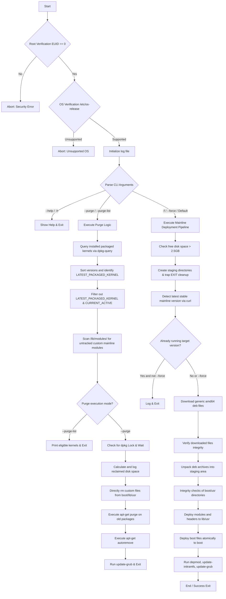

# ubuntu_kernel_updater.sh - Technical Specification and Architecture Document

This document provides a comprehensive overview of the design, architecture, security model, dependencies, and operational characteristics of the `ubuntu_kernel_updater.sh` utility. It is written for senior IT architects and systems administrators.

---

## 1. Application Overview and Objectives

The `ubuntu_kernel_updater.sh` script is a hardened system utility designed to automate two core tasks on Debian, Ubuntu, and Linux Mint distributions:
1. **Upstream Mainline Kernel Deployment:** Auto-detects, downloads, extracts, and atomically deploys the latest stable mainline Linux kernel from the official Ubuntu kernel archives.
2. **Hardened Kernel Purging:** Identifies and purges obsolete mainline (custom/untracked) and official (packaged/tracked) kernel installations to prevent `/boot` and `/usr/src` exhaustion, while strictly enforcing safety checks to keep the active booted kernel and the newest packaged kernel.

### Objectives
- **System Stability:** Implement atomic filesystem moves and dependency validation to guarantee that a partially downloaded or corrupted kernel installation never breaks the bootloader.
- **Space Optimization:** Maintain a healthy `/boot` partition size by cleaning obsolete modules, headers, and binary images.
- **Zero Lock-in:** Operate outside the native APT database for mainline deployments, ensuring that the official package manager database remains completely untouched and compatible.

---

## 2. Architecture and Design Choices

### Core Design Principles
- **Decoupled Mainline Deployment:** Mainline kernels downloaded from the PPA repository are manually extracted and deployed to system directories (`/boot`, `/lib/modules`, and `/usr/src`) instead of being registered via `dpkg -i`. This protects the system package manager database from unresolved dependencies.
- **Atomic File Operations:** When files are copied to the critical `/boot` directory, they are first copied with a `.tmp` suffix (e.g. `vmlinuz-xxx.tmp`) and then atomically renamed via `mv`. This prevents a partial copy from being parsed by the bootloader in the event of power loss or disk exhaustion.
- **Defensive Sourcing and Array commands:** Commands (such as `linux-version sort` or its fallback `sort -V`) are stored as Bash arrays to ensure safe shell expansion, completely eliminating unquoted word-splitting issues.
- **Lock-Aware Execution:** The script does not compete with system package managers; it dynamically queries `/var/lib/dpkg/lock-frontend` and yields execution until concurrent updates complete.

### Assumptions
- **Architecture:** The target system must be running on `amd64` (x86_64) CPU architectures.
- **OS Compatibility:** The system must be a Debian-like distribution (`ubuntu`, `debian`, or `linuxmint` defined in `/etc/os-release`).
- **Network Access:** Sourcing remote mainline payloads requires outbound HTTPS connections to `kernel.ubuntu.com`.

### Edge Cases Handled
- **Missing Sourcing Utility:** If the standard `linux-version` tool is absent, the script falls back to GNU standard `sort -V` for version resolution.
- **Lock Contention:** Prevents installation failures due to background `apt` or `unattended-upgrades` processes by waiting on the dpkg frontend lock.
- **Shared Base Headers:** Shared base headers (e.g. `linux-headers-6.8.0-120`) are only deleted if no other flavored kernel (like `lowlatency`) is still installed on the system.
- **Disk Exhaustion:** Verifies `/` contains at least 2.5 GB of free space before initiating downloads.

---

## 3. Data Flow and Control Logic

### Operational Flow Diagram



### Data Sequencing (Mainline Pipeline)
1. **Scraping Phase:** Slices the HTML payload of `kernel.ubuntu.com/mainline/` -> Parses tags into version strings (`vX.Y.Z`) -> Sorts to locate the highest stable tag.
2. **Download Phase:** Queries the specific architecture folder -> Selects 4 essential files (`linux-image-*`, `linux-modules-*`, `linux-headers-*_all`, `linux-headers-*-generic`) -> Saves to staging sandbox.
3. **Extraction & Move Phase:** Unpacks archives in temporary sandbox -> Validates the directory structures -> Syncs files into system production pathways -> Runs `depmod` and `update-initramfs` -> Updates GRUB configuration.

---

## 4. Dependencies

The script relies exclusively on standard utilities found on modern Ubuntu/Debian server environments.

### System Utilities
- **`bash` (>= 4.0):** Execution shell.
- **`curl`:** HTTPS requests for version querying and binary downloads.
- **`dpkg-deb`:** Tool used to unpack package archives without installing them via `dpkg`.
- **`dpkg-query`:** Used to verify package ownership and sizes.
- **`awk` / `sed` / `grep`:** Text processing and metadata matching.
- **`df`:** File system space verification.
- **`uname`:** Booted kernel version query.
- **`fuser` (Optional, from `psmisc`):** Dpkg lock detection.
- **`linux-version` (Optional, from `linux-base`):** Standard kernel version sorting.
- **`depmod` / `update-initramfs` / `update-grub`:** Bootloader and kernel mapping integration.

---

## 5. Security Assessment

### Encryption in Transit
All outgoing HTTP connections made by the script to scrape metadata or retrieve Debian archives (`.deb` files) are strictly routed over **HTTPS** (TLS 1.2/1.3) using `curl -sSf`. This prevents man-in-the-middle (MITM) attacks and payload tampering during download.

### Secret Management
The script does not store, request, or handle any secrets, api keys, or system credentials.

### Authentication & Privilege Model
- **Root Context requirement:** Since it manages kernel deployments and configures system boot sequences (GRUB), the script runs strictly under a root context (`EUID == 0`). 
- **Non-Privileged Restriction:** If executed by a standard unprivileged user, the script immediately prints a Security Error and exits with status code `1`, preventing unauthorized system configuration tampering.

### RBAC (Role-Based Access Control)
System administrators should manage execution privileges of this script using standard Linux permissions and file ownership:
```bash
sudo chown root:root /opt/scripts/ubuntu_kernel_updater.sh
sudo chmod 700 /opt/scripts/ubuntu_kernel_updater.sh
```
This ensures that only the root user can read or execute the tool.

---

## 6. Code Quality Assessment and Review

### Linting
The script is fully compliant with POSIX/Bash coding standards and passes **ShellCheck** with zero errors or warnings:
```bash
shellcheck /opt/scripts/ubuntu_kernel_updater.sh
```

### Key Coding Safeguards Implemented
- **`set -euo pipefail`:**
  - `-e` (Exit immediately if a command exits with a non-zero status).
  - `-u` (Treat unset variables as an error when expanding).
  - `-o pipefail` (Pipeline returns the exit status of the last command to exit with a non-zero status).
- **Directory Traps:** Staging sandboxes are allocated using `mktemp -d`. An `EXIT` signal trap is registered early to guarantee that directory cleanups (`rm -rf`) are always executed upon script termination, regardless of whether it exits normally, crashes, or is terminated by the user (`Ctrl+C`).

---

## 7. Command Line Arguments

| Option | Long Option | Description | Type | Default |
| :--- | :--- | :--- | :--- | :--- |
| `-h` | `--help` | Renders the usage matrix. | Boolean | `false` |
| `-f` | `--force` | Force download/installation of the mainline kernel. | Boolean | `false` |
| N/A | `--purge-list` | Lists older custom/packaged kernels eligible for purging. | Boolean | `false` |
| N/A | `--purge` | Purges older custom/packaged kernels non-interactively. | Boolean | `false` |

---

## 8. Detailed Operational Examples

### Example 1: Querying Eligible Kernels for Purging (`--purge-list`)
Use this command to safely check what kernels will be removed before executing the actual purge.

#### Command
```bash
sudo /opt/scripts/ubuntu_kernel_updater.sh --purge-list
```

#### Sample Output
```
[+] 2026-06-17 21:52:36 : Scanning system for custom mainline and packaged distribution kernel instances...
[!] 2026-06-17 21:52:36 : ELIGIBLE FOR PURGE: Custom Kernel [ 6.5.0-27-generic ]
[!] 2026-06-17 21:52:36 : ELIGIBLE FOR PURGE: Packaged Kernel [ 6.8.0-120-generic ]
```

---

### Example 2: Performing Kernel Purge Execution (`--purge`)
Executes the deletion of custom files and package purges non-interactively.

#### Command
```bash
sudo /opt/scripts/ubuntu_kernel_updater.sh --purge
```

#### Sample Output
```
[+] 2026-06-17 21:53:10 : Scanning system for custom mainline and packaged distribution kernel instances...
[+] 2026-06-17 21:53:10 : This purge will reclaim approximately 412 MB of disk space.
[!] 2026-06-17 21:53:10 : Crucial Step: Purging packaged kernel packages: linux-headers-6.8.0-120-generic linux-image-6.8.0-120-generic linux-modules-6.8.0-120-generic linux-modules-extra-6.8.0-120-generic linux-headers-6.8.0-120
(Reading database ... 281940 files and directories currently installed.)
Removing linux-headers-6.8.0-120-generic (6.8.0-120.120) ...
Removing linux-image-6.8.0-120-generic (6.8.0-120.120) ...
Purging configuration files for linux-image-6.8.0-120-generic (6.8.0-120.120) ...
...
[+] 2026-06-17 21:53:45 : Running autoremove to clean up unused dependencies...
[+] 2026-06-17 21:53:50 : Rebuilding system bootloader layout configuration maps...
Generating grub configuration file ...
Found linux image: /boot/vmlinuz-7.1.0-070100-generic
Found initrd image: /boot/initrd.img-7.1.0-070100-generic
Found linux image: /boot/vmlinuz-6.8.0-124-generic
Found initrd image: /boot/initrd.img-6.8.0-124-generic
done
==========================================================================
[+] 2026-06-17 21:54:02 : Selected custom and packaged kernel configurations successfully purged!
==========================================================================
```

---

### Example 3: Upstream Stable Kernel Check and Deployment (Default)
Queries the remote repository and installs the newest stable kernel if it is newer than the booted kernel.

#### Command
```bash
sudo /opt/scripts/ubuntu_kernel_updater.sh
```

#### Sample Output (Up-to-Date System)
```
[+] 2026-06-17 21:55:01 : Initializing hardened kernel deployment pipeline...
[+] 2026-06-17 21:55:01 : Auto-detecting latest stable upstream kernel...
[+] 2026-06-17 21:55:02 : Latest stable version detected: v7.1.0
[!] 2026-06-17 21:55:02 : System is already running 7.1.0-070100-generic. Aborting safely.
```
