# Ubuntu Upgrade & Hardening Utility Suite Documentation

This documentation provides an architectural and functional overview of the automated upgrade and system hardening suite, which consists of the orchestrator script [ubuntu_upgrade.sh](file:///opt/scripts/ubuntu_upgrade.sh) and the standalone deployment engine [ubuntu_kernel_updater.sh](file:///opt/scripts/ubuntu_kernel_updater.sh).

---

## 1. Application Overview and Objectives

The objective of the upgrade suite is to automate system-level updates, strip tracking/telemetry mechanisms, optimize performance through parallel execution, and manage mainline kernel lifecycles.

### Primary Objectives:
1. **Automated Package lifecycle management:** Fully non-interactive execution of system package upgrades and kernel distribution upgrades.
2. **System Hardening:** Disabling and masking of telemetry services, ESM caching layers, and MOTD ads.
3. **Execution Optimization:** Concurrently running Flatpak upgrades in the background to avoid blocking native APT processes.
4. **Custom Upstream Kernel Deployment:** Checking, staging, verifying, and deploying mainline Linux kernels while keeping the native APT package manager clean of dependency issues.
5. **System Sanitation:** Safe recovery of unconfigured packages and clean removal of removed package configuration structures.

---

## 2. Architecture and Design Choices, Assumptions, and Edge Cases

### Architectural Design Choices
* **Bypassing APT for Mainline Kernels:**Mainline kernels from upstream distributions are unpacked manually via `dpkg-deb -x` rather than installed via `dpkg -i`. This design choice protects the host APT database from dependency mismatches (e.g., when a new kernel requires a newer glibc than the host distribution provides). 
* **Process Parallelism:** By spawning Flatpak updates in a background process, the native package manager (`apt-get`) can update concurrently. Since Flatpak uses sandboxed user/system space libraries, it does not lock `/var/lib/dpkg/lock-frontend`, preventing write conflicts.
* **Environment Sourcing:** The application sources [sysenv.sh](file:///opt/scripts/sysenv.sh) to explicitly define and export `PATH` variable hierarchies, ensuring that execution path resolution remains identical whether run interactively, via crontab, or under systemd timers.
* **Robust Status Parsing:** Package states are checked using `dpkg-query` formatting strings rather than scraping standard `dpkg -l`. This avoids shell scripts breaking when the terminal width (`COLUMNS`) is low or unconfigured, which causes truncation.

### Key Assumptions
* **Execution Context:** The calling user has root context (`EUID = 0`).
* **Active Networking:** An online route exists to communicate with Debian/Ubuntu package mirrors and the Ubuntu Mainline Kernel Index (`https://kernel.ubuntu.com/mainline/`).
* **Systemd Availability:** The host relies on systemd for process control (fallback wrappers handle exceptions).

### Edge Cases Handled
* **Interrupted Packages:** Runs `dpkg --configure -a` before cleanups to configure any `unpacked` packages that failed in a previous run.
* **Disk Exhaustion on /boot:** The kernel updater verifies that `/boot` has at least 150 MB free space (and the root filesystem has 2.5 GB free space) to avoid half-written kernel images or incomplete RAM disk generations.
* **Unsafe Delete Guard:** When purging custom kernels, the script validates that the kernel version string contains more than 6 characters to prevent execution of destructive `rm -rf` operations on truncated directories.

---

## 3. Data Flow and Control Logic

### Operational Flow Sequence

```mermaid
sequenceDiagram
    autonumber
    actor Admin as System Administrator
    participant Upgrader as ubuntu_upgrade.sh
    participant Systemctl as systemctl daemon
    participant APT as apt-get frontend
    participant Flatpak as flatpak daemon
    participant Kernel as ubuntu_kernel_updater.sh

    Admin->>Upgrader: Execute with root privileges
    activate Upgrader
    Upgrader->>Upgrader: Verify EUID & OS Release (/etc/os-release)
    Upgrader->>Upgrader: Source settings.sh & export DEBIAN_FRONTEND=noninteractive
    
    rect rgb(30, 30, 40)
        Note over Upgrader, Flatpak: Parallel Job Spawner
        Upgrader->>Flatpak: Fork flatpak upgrade -y (Background)
        activate Flatpak
    end

    Upgrader->>APT: Run apt-get clean & apt-get update
    Upgrader->>APT: Run apt-get upgrade & dist-upgrade
    Upgrader->>Systemctl: Stop/Mask telemetry & ESM services (apt-news, esm-cache, etc.)
    Upgrader->>Upgrader: Run dpkg --configure -a (Configure unpacked packages)
    Upgrader->>APT: Run autoremove & autoclean
    Upgrader->>APT: Purge leftover configuration directories (rc)
    
    rect rgb(30, 30, 40)
        Note over Upgrader, Flatpak: Sync Background Job
        Flatpak-->>Upgrader: Exit and return status
        deactivate Flatpak
        Upgrader->>Upgrader: Wait for FLATPAK_PID
    end

    Upgrader->>Kernel: Invoke mainline kernel deployment pipeline
    activate Kernel
    Kernel->>Kernel: Perform disk space audit on /boot and /
    Kernel->>Kernel: Auto-detect latest stable kernel from mainline registry
    Kernel->>Kernel: Download, extract and deploy vmlinuz, modules & headers
    Kernel->>Kernel: Trigger update-initramfs & update-grub
    Kernel-->>Upgrader: Return success
    deactivate Kernel

    Upgrader-->>Admin: Execution complete (logs to /var/log/ubuntu_upgrade.log)
    deactivate Upgrader
```


---

## 4. Dependencies

The utility suite relies on the following standard utilities and libraries:

| Dependency | Required Version / Range | Context of Usage |
| :--- | :--- | :--- |
| **Bash** | `>= 4.0` | Interpreting shell control structures. |
| **apt-get** | Standard APT suite | Syncing repository indexes and applying system patches. |
| **dpkg-query** | Standard dpkg utility | Inspecting package statuses securely. |
| **curl** | Standard binary | Fetching remote HTML indexes and downloading mainline kernel assets. |
| **flatpak** | Optional | Updating sandboxed application runtimes in parallel. |
| **systemctl** | Optional (Systemd environment) | Disabling and masking telemetry services. |
| **depmod** | Standard module-init-tools | Rebuilding hardware module maps for newly deployed kernels. |
| **update-initramfs** | Standard initramfs-tools | Compiling the initial RAM disk boot environment. |
| **update-grub** | Standard grub2 utility | Updating GRUB boot options to integrate the new kernel. |

---

## 5. Security Assessment

### Encryption in Transit
* **HTTPS Enforcement:** Communication with the mainline kernel index is forced over HTTPS (`https://kernel.ubuntu.com/mainline/`). If redirection to HTTP is attempted, `curl -sSf` rejects the transaction.
* **APT Validation:** Repository indexes and archive packages are validated by APT using native GPG verification keys before unpacking.

### Secret Management
* **Credentials:** The application does not store, process, or require system tokens, passwords, or configuration keys.
* **Log Scrubbing:** Output verification logs written to `/var/log/ubuntu_upgrade.log` and `/var/log/flatpak_upgrade.log` contain no sensitive configuration details.

### Authentication & Authorization (RBAC)
* **Access Control:** The script verifies the execution context (`EUID = 0`). Non-root executions fail immediately, preventing unprivileged users from accessing package databases or service managers.
* **Execution Context:** As a system-level upgrade tool, the script operates within a highly privileged administrative container/context. It does not run in user space.

---

## 6. Code Quality Assessment and Linting

### Linting Compliance
The upgrade suite was analyzed using **ShellCheck** to verify syntax compatibility and security controls.
* **Diagnostic Command:** `shellcheck /opt/scripts/ubuntu_upgrade.sh`
* **Result:** `Passed with zero warnings, errors, or stylistic exceptions.`

### Hardened Parameters in Scripting
1. **Shell Security Flags:** Sourced with `set -euo pipefail`. The script will terminate immediately if any component command returns a non-zero exit code, or if an uninitialized variable is referenced.
2. **Safe Array Handling:** Options like `APT_OPTS` are stored as Bash arrays (`"${APT_OPTS[@]}"`) to preserve double-quoting and prevent word-splitting vulnerabilities.
3. **dpkg-query Safe Parsing:** Package removals extract package names by matching against specific db status strings, completely avoiding terminal-width dependent truncation bugs.

---

## 7. Command Line Arguments

### Orchestrator: `ubuntu_upgrade.sh`
* **Arguments:** None. It runs the full system patching and hardening pipeline sequentially, including flatpak updates in the background, and mainline kernel deployment pipeline.

---

## 8. Detailed Use and Deployment Examples

### Example 1: Executing a System Upgrade and Mainline Deployment
To execute the complete system upgrade process, run:
```bash
sudo /opt/scripts/ubuntu_upgrade.sh
```

#### Expected Log Output `/var/log/ubuntu_upgrade.log`:
```
[+] 2026-06-18 03:20:00 : Starting background Flatpak updates (logging to /var/log/flatpak_upgrade.log)...
_____APT-CACHE-SYNC->PRD|prd|wks|localhost__________________________________
Hit:1 http://archive.ubuntu.com/ubuntu noble InRelease
Hit:2 http://archive.ubuntu.com/ubuntu noble-updates InRelease
Reading package lists...
_____APT-PATCH-OS->PRD|prd|wks|localhost_____________________________________
Reading package lists...
Building dependency tree...
Calculating upgrade...
0 upgraded, 0 newly installed, 0 to remove and 0 not upgraded.
_____APT-PATCH-KERNEL->PRD|prd|wks|localhost_________________________________
Reading package lists...
Building dependency tree...
Calculating upgrade...
0 upgraded, 0 newly installed, 0 to remove and 0 not upgraded.
_____APT-PATCH-CLEANUP->PRD|prd|wks|localhost________________________________
[+] 2026-06-18 03:20:05 : Attempting to configure any unpacked packages...
[+] 2026-06-18 03:20:06 : Autoremove and clean orphan packages
[+] 2026-06-18 03:20:08 : Waiting for background Flatpak updates to complete...
[+] 2026-06-18 03:20:10 : Initializing hardened kernel deployment pipeline...
[+] 2026-06-18 03:20:10 : Auto-detecting latest stable upstream kernel...
[+] 2026-06-18 03:20:12 : Latest stable version detected: v6.8.1
[!] 2026-06-18 03:20:12 : System is already running 6.8.1-060801-generic. Aborting safely.

Execute after reboot to purge obsolete kernels:
   [1] sudo /opt/scripts/ubuntu_kernel_updater.sh --purge
```

### Example 2: Purging Obsolete System Kernels
To check and remove older, redundant kernel installations and reclaim space:
```bash
sudo /opt/scripts/ubuntu_kernel_updater.sh --purge
```

#### Expected Log Output `/var/log/kernel_updater.log`:
```
[+] 2026-06-18 03:21:00 : Scanning system for custom mainline and packaged distribution kernel instances...
[!] 2026-06-18 03:21:02 : ELIGIBLE FOR PURGE: Packaged Kernel [ 6.5.0-18-generic ]
[+] 2026-06-18 03:21:02 : This purge will reclaim approximately 412 MB of disk space.
[!] 2026-06-18 03:21:02 : Crucial Step: Purging packaged kernel packages: linux-image-6.5.0-18-generic linux-headers-6.5.0-18-generic
[+] 2026-06-18 03:21:05 : Running autoremove to clean up unused dependencies...
[+] 2026-06-18 03:21:08 : Rebuilding system bootloader layout configuration maps...
Generating grub configuration file ...
Found linux image: /boot/vmlinuz-6.8.1-060801-generic
Found initrd image: /boot/initrd.img-6.8.1-060801-generic
done
==========================================================================
[+] 2026-06-18 03:21:12 : Selected custom and packaged kernel configurations successfully purged!
==========================================================================
```
