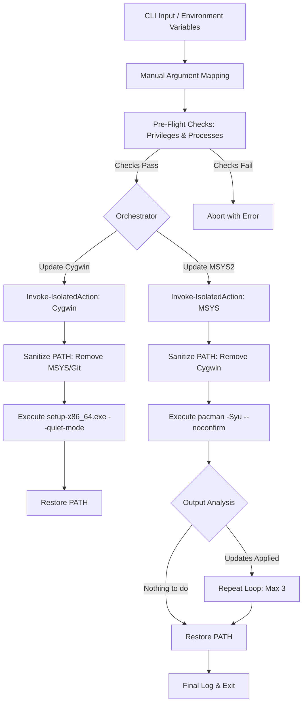

# WinPOSIX Update Technical Specification & Orchestration Guide

## 1. Application Overview and Objectives

**WinPOSIX Update** is an orchestration utility designed to automate the maintenance of Cygwin and MSYS2 environments on Windows systems. Its primary objective is to provide a headless, non-interactive update mechanism that ensures environment stability and prevents cross-contamination between different POSIX-like runtimes.

### **Functional Objectives:**
- **Automated Lifecycle Management**: Executes system-wide updates for Cygwin and MSYS2 without requiring manual GUI interaction.
- **Fresh Environment Provisioning**: Supports automated, headless installation of new Cygwin and MSYS2 environments to custom paths.
- **Global Variable Persistence**: Automatically populates and persists `CYGWIN_HOME` and `MSYS_HOME` in the Machine-level environment variables if missing.
- **Environment Isolation**: Guarantees that each update process operates within a sanitized `PATH` environment, eliminating the risk of binary collisions.
- **Transactional Logging**: Captures detailed execution logs for auditability and remote troubleshooting.

---

## 2. Architecture and Design Choices

The architecture of WinPOSIX Update is centered around the concept of **Process-Level Isolation**.

### **Key Design Patterns:**
- **Bootstrap-First Architecture**: For Cygwin, the script performs an intelligent version check via HTTP `HEAD` and automatically downloads the latest `setup-x86_64.exe` only when a newer version is available on the mirror.
- **Dynamic Installer Discovery**: Fresh MSYS2 installations utilize the GitHub API to dynamically resolve and download the latest "base" SFX archive, ensuring a modern starting point.
- **Temporary Path Sanitization**: To prevent critical runtime failures caused by DLL collisions and **tool name collisions** (e.g., conflicting versions of `grep`, `ls`, or `awk`), the script dynamically constructs a "Clean Room" `PATH` for each target. This ensures that a Cygwin update never "sees" an MSYS2 binary (and vice versa), guaranteeing that each process loads its specific, intended POSIX emulation DLL (`cygwin1.dll` vs `msys-2.0.dll`).
- **Headless GUI Suppression**: Utilizes `-WindowStyle Hidden` and unattended command-line flags to ensure the process remains entirely in the background.
- **State-Aware Retries**: Specifically for MSYS2, the script supports a multi-pass update logic for pacman runtime stability.

---

## 3. Data Flow and Control Logic

The following diagram illustrates the operational flow of a WinPOSIX update session, highlighting the isolation and orchestration sequence.



### **Operational Sequence:**
1.  **Argument Mapping**: Resolves and maps POSIX-style CLI flags (e.g. `--update-all`, `--json`) from unbound remaining arguments.
2.  **Pre-Flight Verification**: Enforces administrative privilege checks (bypassed for read-only `--help` and `--info` requests) and verifies that no active/blocking processes are running under the target environments (aborts execution if conflicts are detected).
3.  **Discovery**: Resolves the home directories for Cygwin and MSYS2 using environment variables (`CYGWIN_HOME`, `MSYS_HOME`, `MSYS2_HOME`) with an array of standardized local fallbacks (`C:\admin\cygwin`, `C:\cygwin64`, `C:\admin\msys2`, `C:\msys64`).
4.  **Isolation**: Before triggering an update engine, the script saves the current `env:PATH` and applies a filtered version containing only the target's binaries.
5.  **Execution**:
    - **Cygwin**: Triggers the setup utility with `-WindowStyle Hidden` to suppress all graphical prompts.
    - **MSYS2**: Streams pacman output in real-time, monitoring for specific strings to determine if a subsequent update pass is required.
6.  **Restoration**: Guaranteed restoration of the original system `PATH` in the `finally` block of the isolation wrapper, ensuring no side effects for the calling shell.

---

## 4. Dependencies

WinPOSIX Update requires the following components to be present on the host:

| Component | Purpose |
| :--- | :--- |
| **PowerShell 5.1+** | Script execution and process orchestration. |
| **Cygwin setup-x86_64.exe** | Required for Cygwin package management (must be in `CYGWIN_HOME`). |
| **MSYS2 pacman.exe** | Required for MSYS2 package management (must be in `MSYS_HOME/usr/bin`). |
| **Administrative Privileges** | Necessary for modifying files within the protected system or admin directories. |

---

## 5. Command Line Arguments

| Argument | Type | Default | Description |
| :--- | :--- | :--- | :--- |
| `--update-all` | `switch` | `$false` | Orchestrates updates for both Cygwin and MSYS2. |
| `--update-cygwin`| `switch` | `$false` | Triggers the Cygwin update engine. |
| `--update-msys`  | `switch` | `$false` | Triggers the MSYS2 update engine. |
| `--install-cygwin`| `switch` | `$false` | Installs a fresh Cygwin environment (Errors if already present). |
| `--install-msys` | `switch` | `$false` | Installs a fresh MSYS2 environment (Errors if already present). |
| `--path`         | `string` | `$null`  | Explicit target directory for installation. |
| `--info`         | `switch` | `$false` | Inspects and displays details about existing installations. |
| `--LogPath`      | `string` | `$null`  | Destination path for the session log file. |
| `--CygwinMirror` | `string` | `mirrors.kernel.org` | URL of the mirror to be used for Cygwin package downloads. |
| `--help`         | `switch` | `$false` | Displays the help output and exits. |
| `--json`         | `switch` | `$false` | Formats all logs, warnings, errors, and environment info in structured ndjson (no colorization) for CI/CD pipelines. |

### **Environment Variables**
The script resolves installation directories by checking environment variables, and if undefined, inspecting an array of standard fallback paths.

| Variable | Fallback Paths (in order) | Description |
| :--- | :--- | :--- |
| `CYGWIN_HOME` | `C:\admin\cygwin`, `C:\cygwin64` | Root directory of the Cygwin installation. |
| `MSYS_HOME`<br>`MSYS2_HOME` | `C:\admin\msys2`, `C:\msys64`  | Root directory of the MSYS2 installation. |

---

## 6. Detailed Usage Examples

### **Scenario A: Complete System Maintenance**
Perform a background update of all POSIX environments with logging.
```powershell
.\os_sys\winposix_update.ps1 --update-all --LogPath "C:\logs\winposix_maintenance.log"
```

### **Scenario B: Targetted Cygwin Update**
Update only the Cygwin environment using a specific mirror.
```powershell
.\os_sys\winposix_update.ps1 --update-cygwin --CygwinMirror "http://mirrors.sonic.net/cygwin/"
```

### **Scenario C: MSYS2 Only Update**
Execute the pacman update sequence in the current console.
```powershell
.\os_sys\winposix_update.ps1 --update-msys
```

### **Scenario E: Fresh Environment Installation**
Install Cygwin to a custom directory.
```powershell
.\os_sys\winposix_update.ps1 --install-cygwin --path "C:\devel\cygwin"
```

### **Scenario F: Environment Inspection**
Inspect existing installations and environment variables.
```powershell
.\os_sys\winposix_update.ps1 --info
```

### **Scenario D: Scheduled Task Integration**
Example command for a Windows Scheduled Task (Running as SYSTEM or Admin).
```powershell
powershell.exe -ExecutionPolicy Bypass -File "C:\scripts\winposix_update.ps1" --update-all
```

### **Scenario G: CI/CD Pipeline Integration (JSON Output)**
Execute updates and pipe structured ndjson logs directly to an external ingest processor.
```powershell
.\os_sys\winposix_update.ps1 --update-all --json
```

---

## 7. Important Technical Notes

### **Administrative Privileges**
> [!IMPORTANT]
> **Administrative rights are mandatory.** The script performs system-level modifications, including writing to protected directories (e.g., `C:\cygwin64`) and updating Machine-level environment variables. The script includes a built-in check and will exit with an error if executed without elevated privileges (unless requesting the help menu, which is permitted to run as non-admin).

### **Running Process Prevention**
> [!WARNING]
> **No active POSIX environments should be running during updates.**
> To prevent file-locking conflicts, installation corruption, or DLL collisions, the script checks for running processes under the target Cygwin and MSYS2 directories before performing any update or install operations. If blocking processes are detected, the script lists their names and PIDs and aborts execution with an error.

### **Automatic Environment Variable Population**
To ensure consistent environment discovery across the system, WinPOSIX Update manages **Machine-level** environment variables:
- **Auto-Discovery**: If an existing installation is detected but the corresponding `CYGWIN_HOME` or `MSYS_HOME` variable is missing, the script will automatically populate it.
- **Installation Persistence**: When performing a fresh installation (`--install-*`), the target path is immediately persisted to the system environment.
- **PATH Integrity**: In accordance with best practices for environment isolation, the script **never** modifies the global system `PATH`. It only ensures the home directory variables are correctly positioned for external tool resolution.

### **PowerShell Script Execution Policy & Digital Signatures**
> [!NOTE]
> **PowerShell Digital Signature & Execution Policy Restriction:**
> If executing the script results in the following error:
> `winposix_update.ps1 cannot be loaded. The file is not digitally signed. You cannot run this script on the current system. For more information about running scripts and setting execution policy, see about_Execution_Policies.`
> 
> This restriction can be bypassed or resolved using one of the following approaches:
> 
> - **Bypass the Execution Policy (Recommended for scheduled tasks/one-off runs)**:
>   Launch PowerShell with the bypass parameter:
>   ```powershell
>   powershell.exe -ExecutionPolicy Bypass -File "path\to\winposix_update.ps1"
>   ```
> - **Unblock the Script File**:
>   If the file has been downloaded or transferred and is flagged by Windows SmartScreen, unblock it:
>   ```powershell
>   Unblock-File -Path "path\to\winposix_update.ps1"
>   ```

### **Script Exit Codes & Diagnostics**
The script surfaces specific diagnostic exit codes to simplify pipeline reporting and debugging:

| Exit Code | Classification | Trigger Conditions / Description |
| :---: | :--- | :--- |
| **`0`** | Success | All requested tasks completed cleanly, help menu was shown, or environment info was printed. |
| **`2`** | Privilege Failure | Administrative privileges are required for the requested action but are missing. |
| **`3`** | Process Conflict | Conflicting running processes detected locking files in target environment paths. |
| **`4`** | Parameter Validation | Validation check failed (e.g. providing `--path` without installation mode switches, or target path is not writeable). |
| **`5`** | Guardrail Failure | Fresh installation aborted because target platform already exists at installation path. |
| **`6`** | Cygwin Engine Failure | Setup utility missing, bootstrapper download failed, or setup-x86_64.exe returned a non-zero exit code. |
| **`7`** | MSYS2 Engine Failure | SFX download failed, extraction failed, pacman was missing, or pacman returned a non-zero exit code. |
| **`8`** | Isolation Exception | Unexpected runtime or path isolation exception caught inside the context manager wrapper. |
