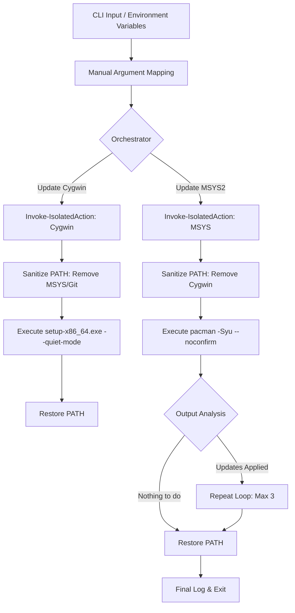

# WinPOSIX Update Technical Specification & Orchestration Guide

## 1. Application Overview and Objectives

**WinPOSIX Update** is an orchestration utility designed to automate the maintenance of Cygwin and MSYS2 environments on Windows systems. Its primary objective is to provide a headless, non-interactive update mechanism that ensures environment stability and prevents cross-contamination between different POSIX-like runtimes.

### **Functional Objectives:**
- **Automated Lifecycle Management**: Executes system-wide updates for Cygwin and MSYS2 without requiring manual GUI interaction.
- **Environment Isolation**: Guarantees that each update process operates within a sanitized `PATH` environment, eliminating the risk of binary collisions between competing runtimes.
- **Transactional Logging**: Captures detailed execution logs for auditability and remote troubleshooting.
- **Optimized Execution**: Implements intelligent output analysis to detect "nothing to do" states, reducing redundant processing cycles and network load.

---

## 2. Architecture and Design Choices

The architecture of WinPOSIX Update is centered around the concept of **Process-Level Isolation**.

### **Key Design Patterns:**
- **Temporary Path Sanitization**: The script does not rely on the global system `PATH`. Instead, it dynamically constructs a "Clean Room" `PATH` for each update target, removing any directories that might contain conflicting binaries (e.g., removing MSYS2 paths when updating Cygwin).
- **Headless GUI Suppression**: Utilizes `-WindowStyle Hidden` and unattended command-line flags (`--quiet-mode`, `--noconfirm`) to ensure the update process remains entirely in the background, making it suitable for scheduled tasks and remote management.
- **Fail-Safe Argument Mapping**: Implements a manual argument mapping block to handle non-standard double-dash flags (`--update-all`), ensuring robust CLI behavior across different shell environments.
- **State-Aware Retries**: Specifically for MSYS2, the script supports a multi-pass update logic, which is a requirement for pacman when core system components or the package manager itself are updated.

---

## 3. Data Flow and Control Logic

The following diagram illustrates the operational flow of a WinPOSIX update session, highlighting the isolation and orchestration sequence.



### **Operational Sequence:**
1.  **Discovery**: Resolves the home directories for Cygwin and MSYS2 using environment variables (`CYGWIN_HOME`, `MSYS_HOME`, `MSYS2_HOME`) with an array of standardized local fallbacks (`C:\admin\cygwin`, `C:\cygwin64`, `C:\admin\msys2`, `C:\msys64`).
2.  **Isolation**: Before triggering an update engine, the script saves the current `env:PATH` and applies a filtered version containing only the target's binaries.
3.  **Execution**:
    - **Cygwin**: Triggers the setup utility with `-WindowStyle Hidden` to suppress all graphical prompts.
    - **MSYS2**: Streams pacman output in real-time, monitoring for specific strings to determine if a subsequent update pass is required.
4.  **Restoration**: Guaranteed restoration of the original system `PATH` in the `finally` block of the isolation wrapper, ensuring no side effects for the calling shell.

---

## 4. Dependencies

WinPOSIX Update requires the following components to be present on the host:

| Component | Purpose |
| :--- | :--- |
| **PowerShell 5.1+** | Script execution and process orchestration. |
| **Cygwin setup-x86_64.exe** | Required for Cygwin package management (must be in `CYGWIN_HOME`). |
| **MSYS2 pacman.exe** | Required for MSYS2 package management (must be in `MSYS_HOME/usr/bin`). |
| **Administrative Privileges** | Necessary for modifying files within the protected system or admin directories. |

---

## 5. Command Line Arguments

| Argument | Type | Default | Description |
| :--- | :--- | :--- | :--- |
| `--update-all` | `switch` | `$false` | Orchestrates updates for both Cygwin and MSYS2. |
| `--update-cygwin`| `switch` | `$false` | Triggers the Cygwin update engine. |
| `--update-msys`  | `switch` | `$false` | Triggers the MSYS2 update engine. |
| `--LogPath`      | `string` | `$null`  | Destination path for the session log file. |
| `--CygwinMirror` | `string` | `mirrors.kernel.org` | URL of the mirror to be used for Cygwin package downloads. |
| `--help`         | `switch` | `$false` | Displays the help output and exits. |

### **Environment Variables**
The script resolves installation directories by checking environment variables, and if undefined, inspecting an array of standard fallback paths.

| Variable | Fallback Paths (in order) | Description |
| :--- | :--- | :--- |
| `CYGWIN_HOME` | `C:\admin\cygwin`, `C:\cygwin64` | Root directory of the Cygwin installation. |
| `MSYS_HOME`<br>`MSYS2_HOME` | `C:\admin\msys2`, `C:\msys64`  | Root directory of the MSYS2 installation. |

---

## 6. Detailed Usage Examples

### **Scenario A: Complete System Maintenance**
Perform a background update of all POSIX environments with logging.
```powershell
.\os_sys\winposix_update.ps1 --update-all --LogPath "C:\logs\winposix_maintenance.log"
```

### **Scenario B: Targetted Cygwin Update**
Update only the Cygwin environment using a specific mirror.
```powershell
.\os_sys\winposix_update.ps1 --update-cygwin --CygwinMirror "http://mirrors.sonic.net/cygwin/"
```

### **Scenario C: MSYS2 Only Update**
Execute the pacman update sequence in the current console.
```powershell
.\os_sys\winposix_update.ps1 --update-msys
```

### **Scenario D: Scheduled Task Integration**
Example command for a Windows Scheduled Task (Running as SYSTEM or Admin).
```powershell
powershell.exe -ExecutionPolicy Bypass -File "C:\scripts\winposix_update.ps1" --update-all
```
