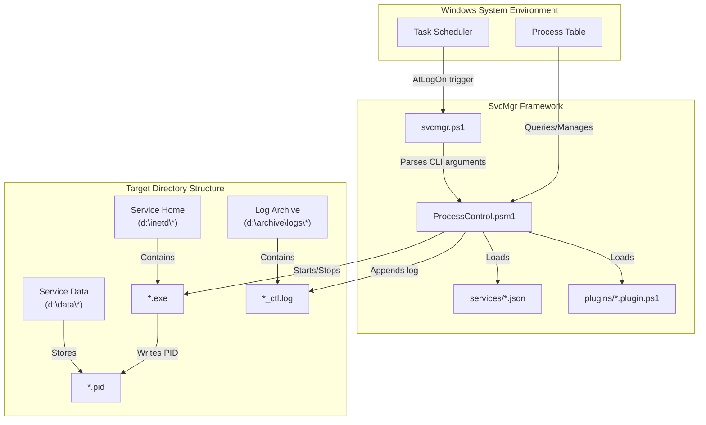
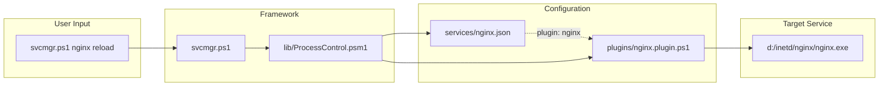
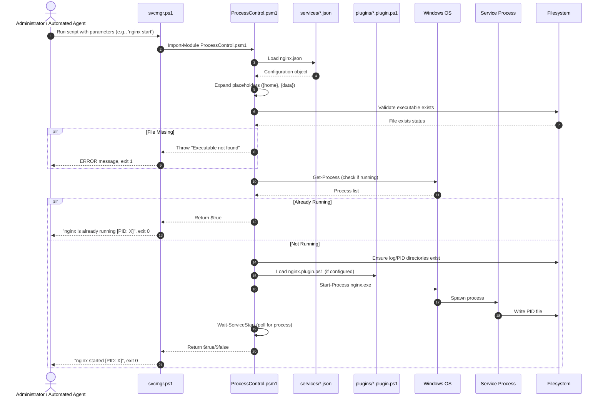

# Windows Service Manager (`svcmgr.ps1`)

## 1. Application Overview and Objectives

`svcmgr.ps1` is a PowerShell-based framework designed to manage the runtime lifecycle of multiple user-space services on Windows, including Nginx, Gitea, and SFTPGo. It provides a unified interface for administrative operators and automation frameworks to orchestrate starting, stopping, restarting, and checking the status of services without directly invoking low-level executables or manually managing process tables.

> [!NOTE]
> Unlike registering or controlling services through the Windows Service Control Manager (which requires local Administrator privileges), `svcmgr.ps1` manages services as user-space processes and does not require administrative privileges to start, stop, or query services, provided the calling user has read/write permissions to the configured paths.

### 1.1 Objectives
* **Unified Service Management**: Abstract the startup, shutdown, config reload, and status retrieval of multiple services into a single CLI tool with consistent behavior.
* **Extensible Architecture**: Support adding new services through JSON configuration files and optional PowerShell plugins without modifying core code.
* **Execution Idempotency**: Ensure that calling the start command when a service is already active, or the stop command when a service is already terminated, returns gracefully without generating system errors or duplicate processes.
* **Process Leak Prevention**: Enforce a multi-stage shutdown process that attempts a clean application shutdown before falling back to a forced process termination, minimizing orphaned worker processes.
* **Auto-Start Integration**: Enable services to start automatically at user logon via Windows Task Scheduler without requiring administrative privileges.
* **Traceability and Audit Logging**: Write chronological execution records with timestamps to service-specific log files to assist with system auditing and diagnostics.

### 1.2 Exit Codes
* `0`: Success (indicates the requested state was verified or successfully transitioned).
* `1`: Failure (indicates a missing executable, an invalid argument, a failed status check, or service not running when expected).

---

## 2. Architecture and Design Choices, Assumptions, and Edge Cases

### 2.1 Architecture and Component Layout
The application is structured as a modular PowerShell framework consisting of a CLI entry point, a core module, JSON configuration files, and optional plugin scripts.



### 2.2 Design Choices and Rationale
* **Minimized Background Startup**: The framework uses `Start-Process -WindowStyle Minimized` to execute services. This launches processes asynchronously in minimized windows, preventing the invoking terminal session from blocking.
* **Directory Context Switching**: The `WorkingDirectory` parameter is set to the service home prior to invoking service commands. This ensures that relative path mappings in configuration files resolve correctly within the service's runtime context.
* **Three-Stage Termination**: The stop sequence implements a progressive shutdown:
  1. **Graceful stop**: Service-specific signal (e.g., `nginx -s stop`) or plugin-defined stop method
  2. **Force PID**: If still running after grace period, force-kill the specific PID
  3. **Force all**: If processes remain, terminate all instances by executable name
* **JSON Configuration**: Service definitions are externalized to JSON files, enabling new services to be added without code changes.
* **Plugin Architecture**: Service-specific commands (reload, test, ping, doctor) are implemented as PowerShell plugins, keeping the core module generic.
* **Forward-Slash Paths**: All paths use forward slashes for consistency and to avoid escape character issues.

### 2.3 System Assumptions
* **Single Host Instance**: The framework assumes services run directly on the Windows host rather than within a containerized environment.
* **Process Ownership**: The invoking user profile or service account must hold sufficient privileges to write to designated directories, execute process control on owned processes, and read/write files under service data paths.
* **PowerShell 5.1+**: The framework requires Windows PowerShell 5.1 or later (enforced via `#Requires -Version 5.1`).

### 2.4 Edge Cases and Mitigations
* **Orphaned Process Nodes**: If a service is terminated abnormally, child worker processes may survive. The framework mitigates this by running a final `Stop-Process -Force` targeting all active instances by executable name.
* **Missing Target Directories**: The framework dynamically checks for the existence of log and PID directories and creates them via `New-Item -ItemType Directory -Force` if missing.
* **Stale PID Files**: If a service terminates abnormally, it may leave behind a stale PID file. The framework validates that the PID in the file corresponds to a running process with the correct executable name before trusting it.
* **Non-existent Binaries**: Before performing any operations, the framework validates that the service executable is present. If missing, it throws a clear diagnostic error.
* **Stderr as ErrorRecord**: External commands that output to stderr (e.g., `nginx -t`) can trigger PowerShell errors when `$ErrorActionPreference = "Stop"`. Plugins temporarily set `$ErrorActionPreference = "Continue"` and check `$LASTEXITCODE` instead.

### 2.5 Performance and Efficiency
* **Native PowerShell**: As a PowerShell module, it leverages built-in cmdlets for process management without external dependencies.
* **Parallel-Ready**: Independent service operations can be executed concurrently using PowerShell jobs or workflows.
* **Minimal Dependencies**: Requires only PowerShell 5.1 (included with Windows Server 2016+ and Windows 10+). No external tools like curl are needed.

---

## 3. File System Layout

### 3.1 Framework Directory Structure

The framework is organized in the `winsvc` directory with a clear separation of concerns:

```
winsvc/
├── svcmgr.ps1              # CLI entry point (user runs this)
├── svcmgr_test.ps1         # Test suite (63 tests, 100% coverage)
├── README.md               # This documentation
│
├── lib/                    # Core module (do not modify)
│   ├── ProcessControl.psm1 # All service management functions
│   └── ProcessControl.psd1 # Module manifest
│
├── services/               # Service definitions (add new services here)
│   ├── nginx.json          # Nginx configuration
│   ├── gitea.json          # Gitea configuration
│   └── sftpgo.json         # SFTPGo configuration
│
└── plugins/                # Optional service-specific commands
    ├── nginx.plugin.ps1    # reload, test commands
    ├── gitea.plugin.ps1    # doctor command
    └── sftpgo.plugin.ps1   # ping (health check) command
```

### 3.2 Component Responsibilities

| Directory/File | Responsibility | When to Modify |
| :--- | :--- | :--- |
| `svcmgr.ps1` | CLI parsing, command dispatch, help display | Rarely (adding global commands) |
| `lib/` | Core process management logic | Never (unless fixing bugs) |
| `services/*.json` | Service definitions | **Add new JSON file per service** |
| `plugins/*.plugin.ps1` | Custom commands per service | **Add plugin for service-specific commands** |

### 3.3 How Components Connect



**Flow:**
1. User runs `svcmgr.ps1 nginx reload`
2. CLI imports `ProcessControl.psm1` module
3. Module loads `services/nginx.json` configuration
4. Configuration specifies `"plugin": "nginx"`
5. Module loads `plugins/nginx.plugin.ps1`
6. Plugin's `Reload` command executes `nginx.exe -s reload`

### 3.4 Service Configuration Files

Each service is defined in a JSON file under `services/`:

#### nginx.json
```json
{
  "name": "nginx",
  "exe": "nginx.exe",
  "home": "d:/inetd/nginx",
  "data": "d:/data/nginx",
  "args": "-c \"{home}/conf/nginx.conf\" -p \"{home}\"",
  "pidFile": "{home}/var/nginx.pid",
  "stopMethod": "signal",
  "stopSignal": "-s stop -c \"{home}/conf/nginx.conf\" -p \"{home}\"",
  "plugin": "nginx"
}
```

#### gitea.json
```json
{
  "name": "gitea",
  "exe": "gitea.exe",
  "home": "d:/inetd/gitea",
  "data": "d:/data/gitea",
  "args": "web --config \"{data}/conf/app.ini\" --custom-path \"{data}/custom\" --work-path \"{data}/work\" --pid \"{data}/work/pid/gitea.pid\"",
  "pidFile": "{data}/work/pid/gitea.pid",
  "stopMethod": "graceful",
  "plugin": "gitea"
}
```

#### sftpgo.json
```json
{
  "name": "sftpgo",
  "exe": "sftpgo.exe",
  "home": "d:/inetd/sftpgo",
  "data": "d:/data/sftpgo",
  "args": "serve --config-dir \"{data}\" --grace-time 30 --log-file-path \"d:/archive/logs/sftpgo/sftpgo.log\" --log-level info",
  "pidFile": "{data}/sftpgo.pid",
  "ctlLogFile": "d:/archive/logs/sftpgo/sftpgo_ctl.log",
  "stopMethod": "graceful",
  "plugin": "sftpgo",
  "healthUrl": "https://mgmteatst.mckesson.com:8443/healthz"
}
```

### 3.3 Configuration Schema

| Field | Required | Description |
| :--- | :--- | :--- |
| `name` | Yes | Service identifier (used in CLI commands) |
| `exe` | Yes | Executable filename |
| `home` | Yes | Installation directory containing the executable |
| `data` | No | Data directory for configuration and state |
| `args` | No | Command-line arguments (supports `{home}`, `{data}`, `{name}` placeholders) |
| `pidFile` | No | Path to PID file (supports placeholders) |
| `logFile` | No | Path to service log file |
| `ctlLogFile` | No | Path to control script log file |
| `stopMethod` | No | Stop method: `signal` (uses stopSignal) or `graceful` (default) |
| `stopSignal` | No | Arguments to pass to executable for graceful stop |
| `plugin` | No | Name of plugin file (without `.plugin.ps1` extension) |
| `healthUrl` | No | URL for health check (used by sftpgo ping) |
| `env` | No | Object containing environment variables to set |

### 3.4 Partition Separation Strategy

The framework follows a three-tier separation strategy:

1. **Binaries Layer (`D:\inetd\*`)**: Service executables isolated from data and state
2. **Data Layer (`D:\data\*`)**: Configuration, state files, and PID files
3. **Log Archival Layer (`D:\archive\logs\*`)**: High-throughput logging outputs on separate storage

---

## 4. Data Flow and Control Logic

### 4.1 Control Logic Flow

1. **Module Import**: The CLI imports `ProcessControl.psm1` which initializes paths
2. **Argument Evaluation**: Service name and command are parsed from positional parameters
3. **Configuration Loading**: Service JSON is loaded and placeholders expanded
4. **Plugin Loading**: If configured, the plugin script is dot-sourced
5. **Command Dispatch**: The appropriate function is called based on the command
6. **Exit Code**: Success/failure status is propagated via exit code

### 4.2 Command Reference

| Command | Description | Exit 0 | Exit 1 |
| :--- | :--- | :--- | :--- |
| `start` | Start the service | Started or already running | Failed to start |
| `stop` | Stop the service | Stopped or not running | Failed to stop |
| `restart` | Stop then start | Successfully restarted | Stop or start failed |
| `status` | Check if running | Service is running | Service is not running |
| `enable` | Enable auto-start at logon | Task created/exists | Task creation failed |
| `disable` | Disable auto-start | Task removed/not present | Task removal failed |
| `is-enabled` | Show auto-start status | Auto-start enabled | Auto-start disabled |
| `list` | List all services | Always | Never |
| `rotate` | Rotate control logs | Always | Never |
| `help` | Show usage | Always | Never |
| `version` | Show version | Always | Never |

### 4.3 Plugin Commands

| Service | Command | Description |
| :--- | :--- | :--- |
| nginx | `reload` | Reload configuration without restart |
| nginx | `test` | Test configuration syntax |
| gitea | `doctor` | Run Gitea diagnostics |
| sftpgo | `ping` | Health check via HTTPS endpoint |

### 4.4 Plugin Architecture

The plugin system extends the framework with service-specific commands without modifying core code.

#### How Plugins Work

```
User runs: svcmgr.ps1 nginx reload
                ↓
CLI dispatches to Invoke-ServiceCommand("nginx", "Reload")
                ↓
Module loads services/nginx.json → finds "plugin": "nginx"
                ↓
Module dot-sources plugins/nginx.plugin.ps1
                ↓
Module calls $script:PluginCommands["Reload"]($config)
                ↓
Plugin executes nginx.exe -s reload
                ↓
Plugin returns $true/$false → CLI sets exit code
```

#### Plugin Loading Rules

1. Plugin filename must match `"plugin"` value + `.plugin.ps1`
2. Plugin is loaded fresh for each command (no caching)
3. Plugin runs in module scope (can call module functions)
4. Unknown commands that aren't plugins return exit code 1

#### Built-in vs Plugin Commands

| Command | Type | Implementation |
| :--- | :--- | :--- |
| `start` | Built-in | `Start-ServiceProcess` in module |
| `stop` | Built-in | `Stop-ServiceProcess` in module |
| `restart` | Built-in | `Restart-ServiceProcess` in module |
| `status` | Built-in | `Get-ServiceStatus` in module |
| `enable` | Built-in | `Enable-ServiceAutoStart` in module |
| `disable` | Built-in | `Disable-ServiceAutoStart` in module |
| `is-enabled` | Built-in | `Get-ServiceAutoStartInfo` in module |
| `reload` | Plugin | `$PluginCommands.Reload` in nginx.plugin.ps1 |
| `test` | Plugin | `$PluginCommands.Test` in nginx.plugin.ps1 |
| `ping` | Plugin | `$PluginCommands.Ping` in sftpgo.plugin.ps1 |

### 4.5 Sequence Diagram



---

## 5. Dependencies

### 5.1 PowerShell Requirements
* **PowerShell 5.1+**: Enforced via `#Requires -Version 5.1` directive
* **Execution Policy**: Must allow script execution (`Bypass` or `RemoteSigned`)

### 5.2 System Components
* **Process Management**: `Get-Process`, `Start-Process`, `Stop-Process` cmdlets
* **Task Scheduler**: `Get-ScheduledTask`, `Register-ScheduledTask`, `Unregister-ScheduledTask` cmdlets
* **File System**: Standard PowerShell file operations

### 5.3 No External Dependencies
The framework intentionally avoids external tools:
* No `curl` - uses `System.Net.WebClient` for health checks
* No third-party modules - pure PowerShell 5.1
* No elevated privileges required for normal operations

---

## 6. Security Assessment

### 6.1 Security Controls Matrix

| Security Area | Implementation Status | Technical Mechanism |
| :--- | :--- | :--- |
| **Privilege Escalation** | Not Required | Executes in calling user context; AtLogOn trigger requires no admin |
| **Input Sanitization** | Implemented | Commands matched via switch statement; service names validated against JSON files |
| **Credential Storage** | Implemented (None Used) | No credentials stored; health checks use certificate bypass for self-signed certs only |
| **Execution Logging** | Implemented | Operations logged to `*_ctl.log` with timestamps |
| **Process Control** | Implemented | Targets processes by PID first, then by executable name |

### 6.2 Certificate Validation

The SFTPGo health check temporarily bypasses certificate validation for self-signed certificates:
* The bypass is scoped to the specific WebClient call
* The original `ServerCertificateValidationCallback` is saved and restored
* TLS 1.2 is explicitly required

### 6.3 Access Control

* **Standard Users**: Can manage services they have filesystem access to
* **Administrators**: Full capabilities including Task Scheduler access
* **Service Accounts**: Can run via scheduled tasks with appropriate NTFS permissions

### 6.4 Unprivileged Context

The framework can run entirely without Administrator rights:

1. NTFS permissions to execute `svcmgr.ps1` and service executables
2. Write access to data and logging directories
3. Rights to spawn/terminate processes owned by the same user
4. Task Scheduler access for the current user (AtLogOn trigger)

---

## 7. Command Line Interface

### 7.1 Syntax

```
svcmgr.ps1 [-Quiet|-q] [-Json] <service|all|list|rotate> <command>
```

### 7.2 Parameters

| Parameter | Type | Position | Description |
| :--- | :--- | :--- | :--- |
| `-Quiet`, `-q` | Switch | Named | Suppress all output (for scripting/automation) |
| `-Json` | Switch | Named | Output in JSON format (for automation/pipelines) |
| `-Version`, `-v` | Switch | Named | Show version information and exit |
| `Service` | String | 0 | Service name, `all`, `list`, `rotate`, or `version` |
| `Command` | String | 1 | Operation to perform (default: `help`) |

### 7.3 Special Service Names

| Name | Description |
| :--- | :--- |
| `all` | Apply command to all configured services |
| `list` | Display all services with status and auto-start state |
| `rotate` | Rotate all control log files |

---

## 8. Detailed Examples

### 8.1 Displaying Help

```powershell
.\svcmgr.ps1 help
```

**Output:**
```
Usage: svcmgr.ps1 <service|all|list|rotate> <command>

Services:
  nginx, gitea, sftpgo, ...   (from services/*.json)
  all                          All configured services
  list                         List available services
  rotate                       Rotate all control logs

Commands:
  start     Start the service
  stop      Stop the service
  restart   Restart the service
  status    Check if service is running
  enable     Enable auto-start at user logon
  disable    Disable auto-start
  is-enabled Show auto-start status
  help      Show this help

Service-specific commands:
  nginx     reload, test
  gitea     doctor
  sftpgo    ping

Options:
  -Quiet, -q     Suppress output (for scripting)
  -Json          Output in JSON format (for automation)
  -Version, -v   Show version information

Examples:
  .\svcmgr.ps1 nginx start
  .\svcmgr.ps1 all status
  .\svcmgr.ps1 nginx reload
  .\svcmgr.ps1 nginx enable
  .\svcmgr.ps1 list
  .\svcmgr.ps1 rotate
  .\svcmgr.ps1 -q all status
  .\svcmgr.ps1 list -Json
```

### 8.2 Checking Version

```powershell
.\svcmgr.ps1 -v
# or
.\svcmgr.ps1 version
```

**Output:**
```
svcmgr version 1.1.0
```

### 8.3 Listing Services

```powershell
.\svcmgr.ps1 list
```

**Output:**
```
Available services:

  gitea        [running]  [enabled]
  nginx        [running]  
  sftpgo       [running]  
```

### 8.4 Starting a Service

```powershell
.\svcmgr.ps1 nginx start
```

**Output (not running):**
```
Starting nginx
nginx started [PID: 4312]
```

**Output (already running):**
```
nginx is already running [PID: 4312]
```

### 8.5 Checking Status

```powershell
.\svcmgr.ps1 nginx status
```

**Output (running):**
```
nginx is running [PID: 4312]
```
*Exit code: 0*

**Output (stopped):**
```
nginx is not running
```
*Exit code: 1*

### 8.6 Reloading Configuration (Nginx)

```powershell
.\svcmgr.ps1 nginx reload
```

**Output:**
```
Testing configuration...
Reloading nginx configuration
nginx configuration reloaded
```

### 8.7 Health Check (SFTPGo)

```powershell
.\svcmgr.ps1 sftpgo ping
```

**Output (healthy):**
```
Pinging sftpgo...
sftpgo is healthy
```

### 8.8 Enabling Auto-Start

```powershell
.\svcmgr.ps1 nginx enable
```

**Output:**
```
nginx enabled (starts at logon)
```

### 8.9 Checking Auto-Start Status

```powershell
.\svcmgr.ps1 nginx is-enabled
```

**Output (enabled):**
```
nginx auto-start: enabled
  Task:    SvcMgr-nginx
  Trigger: At logon
  State:   Ready
```

### 8.10 All Services Status

```powershell
.\svcmgr.ps1 all status
```

**Output:**
```
=== gitea ===
gitea is running [PID: 3904]

=== nginx ===
nginx is running [PID: 6208]

=== sftpgo ===
sftpgo is running [PID: 8472]
```

### 8.11 Quiet Mode for Scripting

```powershell
.\svcmgr.ps1 -q nginx status
if ($LASTEXITCODE -eq 0) { Write-Host "Nginx is up" }
```

**Output:**
```
Nginx is up
```

### 8.12 JSON Output for Automation

The `-Json` flag outputs machine-readable JSON for CI/CD pipelines and automation tools.

#### List Services (JSON)

```powershell
.\svcmgr.ps1 list -Json
```

**Output:**
```json
{
  "version": "1.1.0",
  "timestamp": "2026-07-07T20:00:17.9159063-05:00",
  "command": "list",
  "services": [
    {
      "name": "gitea",
      "running": true,
      "autoStart": false,
      "pid": 8748,
      "home": "d:/inetd/gitea"
    },
    {
      "name": "nginx",
      "running": true,
      "autoStart": true,
      "pid": 14920,
      "home": "d:/inetd/nginx"
    },
    {
      "name": "sftpgo",
      "running": true,
      "autoStart": false,
      "pid": 9716,
      "home": "d:/inetd/sftpgo"
    }
  ]
}
```

#### Service Status (JSON)

```powershell
.\svcmgr.ps1 nginx status -Json
```

**Output:**
```json
{
  "version": "1.1.0",
  "timestamp": "2026-07-07T20:00:26.4359601-05:00",
  "command": "status",
  "exitCode": 0,
  "results": [
    {
      "service": "nginx",
      "command": "status",
      "success": true,
      "status": {
        "name": "nginx",
        "running": true,
        "pid": 14920,
        "autoStart": false,
        "home": "d:/inetd/nginx",
        "exe": "nginx.exe"
      }
    }
  ]
}
```

#### All Services Status (JSON)

```powershell
.\svcmgr.ps1 all status -Json
```

**Output:**
```json
{
  "version": "1.1.0",
  "timestamp": "2026-07-07T20:00:37.5694796-05:00",
  "command": "status",
  "exitCode": 0,
  "results": [
    {
      "service": "gitea",
      "command": "status",
      "success": true,
      "status": { "name": "gitea", "running": true, "pid": 8748, ... }
    },
    {
      "service": "nginx",
      "command": "status",
      "success": true,
      "status": { "name": "nginx", "running": true, "pid": 14920, ... }
    },
    {
      "service": "sftpgo",
      "command": "status",
      "success": true,
      "status": { "name": "sftpgo", "running": true, "pid": 9716, ... }
    }
  ]
}
```

#### Parsing JSON in PowerShell

```powershell
$result = .\svcmgr.ps1 all status -Json | ConvertFrom-Json
if ($result.exitCode -eq 0) {
    Write-Host "All services healthy"
} else {
    $failed = $result.results | Where-Object { -not $_.success }
    $failed | ForEach-Object { Write-Host "FAILED: $($_.service)" }
}
```

---

## 9. Adding a New Service

Adding a new service requires **only one file** (the JSON configuration). A plugin is optional and only needed for service-specific commands like `reload`, `test`, or `ping`.

### 9.1 Quick Start: Minimal Service (No Plugin)

**Step 1: Create `services/myservice.json`:**

```json
{
  "name": "myservice",
  "exe": "myservice.exe",
  "home": "d:/inetd/myservice"
}
```

**Step 2: Test it:**

```powershell
.\svcmgr.ps1 myservice status    # Check status
.\svcmgr.ps1 myservice start     # Start service
.\svcmgr.ps1 myservice stop      # Stop service
.\svcmgr.ps1 list                # Verify it appears in list
```

That's it! With just 5 lines of JSON, you get full `start`, `stop`, `restart`, `status`, `enable`, `disable`, and `is-enabled` functionality.

### 9.2 Complete Service Configuration

For production use, add more fields:

```json
{
  "name": "myservice",
  "exe": "myservice.exe",
  "home": "d:/inetd/myservice",
  "data": "d:/data/myservice",
  "args": "--config \"{data}/config.yml\" --pid \"{data}/myservice.pid\"",
  "pidFile": "{data}/myservice.pid",
  "ctlLogFile": "d:/archive/logs/myservice/myservice_ctl.log",
  "stopMethod": "graceful"
}
```

#### Field Reference

| Field | Required | Example | Description |
| :--- | :---: | :--- | :--- |
| `name` | ✅ | `"myservice"` | CLI identifier (used in `svcmgr.ps1 myservice start`) |
| `exe` | ✅ | `"myservice.exe"` | Executable filename (relative to `home`) |
| `home` | ✅ | `"d:/inetd/myservice"` | Directory containing the executable |
| `data` | | `"d:/data/myservice"` | Data directory (config, state, PID files) |
| `args` | | `"--config ..."` | Command-line arguments |
| `pidFile` | | `"{data}/myservice.pid"` | Path to PID file for process tracking |
| `ctlLogFile` | | `"d:/.../myservice_ctl.log"` | Control script audit log |
| `stopMethod` | | `"graceful"` or `"signal"` | How to stop (see below) |
| `stopSignal` | | `"-s stop"` | Arguments for signal-based stop |
| `plugin` | | `"myservice"` | Plugin filename (without `.plugin.ps1`) |
| `env` | | `{"VAR": "value"}` | Environment variables to set |
| `healthUrl` | | `"https://..."` | URL for health checks (plugin use) |

#### Placeholder Expansion

Use placeholders in `args`, `pidFile`, `stopSignal`, and other string fields:

| Placeholder | Expands To | Example |
| :--- | :--- | :--- |
| `{home}` | Value of `home` field | `d:/inetd/myservice` |
| `{data}` | Value of `data` field | `d:/data/myservice` |
| `{name}` | Value of `name` field | `myservice` |

**Example:**
```json
"args": "--config \"{data}/conf/app.ini\" --work-path \"{data}/work\""
```
Expands to:
```
--config "d:/data/myservice/conf/app.ini" --work-path "d:/data/myservice/work"
```

#### Stop Methods

| Method | Behavior | Use When |
| :--- | :--- | :--- |
| `graceful` (default) | Send `CloseMainWindow()` signal | Service handles graceful shutdown |
| `signal` | Run `exe` with `stopSignal` arguments | Service has stop command (e.g., nginx `-s stop`) |

**Signal example (nginx):**
```json
{
  "stopMethod": "signal",
  "stopSignal": "-s stop -c \"{home}/conf/nginx.conf\" -p \"{home}\""
}
```

### 9.3 Adding a Plugin (Optional)

Plugins add **custom commands** beyond the built-in `start`, `stop`, `restart`, `status`, `enable`, `disable`, `is-enabled`.

#### When to Create a Plugin

| Scenario | Plugin Needed? |
| :--- | :--- |
| Basic start/stop/status | ❌ No |
| Service has `reload` command | ✅ Yes |
| Service has config `test` command | ✅ Yes |
| Service has health check endpoint | ✅ Yes |
| Service has diagnostic tools | ✅ Yes |

#### Plugin Template

Create `plugins/myservice.plugin.ps1`:

```powershell
#Requires -Version 5.1
<#
.SYNOPSIS
    MyService plugin - provides reload, test, and ping commands
#>

$script:PluginCommands = @{

    # Command: svcmgr.ps1 myservice reload
    Reload = {
        param($Config)

        if (-not (Test-ServiceRunning -Name $Config.name)) {
            Write-Host "$($Config.name) is not running"
            return $false
        }

        Write-Host "Reloading $($Config.name) configuration..."
        
        # Handle stderr without triggering PowerShell errors
        $oldEAP = $ErrorActionPreference
        $ErrorActionPreference = "Continue"
        
        & $Config.ExePath reload --config "$($Config.data)/config.yml" 2>&1 | Out-Null
        $exitCode = $LASTEXITCODE
        
        $ErrorActionPreference = $oldEAP

        if ($exitCode -eq 0) {
            Write-Host "$($Config.name) configuration reloaded"
            return $true
        } else {
            Write-Host "ERROR: reload failed" -ForegroundColor Red
            return $false
        }
    }

    # Command: svcmgr.ps1 myservice test
    Test = {
        param($Config)

        Write-Host "Testing $($Config.name) configuration..."
        
        $oldEAP = $ErrorActionPreference
        $ErrorActionPreference = "Continue"
        
        & $Config.ExePath validate --config "$($Config.data)/config.yml" 2>&1 | 
            ForEach-Object { Write-Host $_ }
        $exitCode = $LASTEXITCODE
        
        $ErrorActionPreference = $oldEAP
        
        return $exitCode -eq 0
    }

    # Command: svcmgr.ps1 myservice ping
    Ping = {
        param($Config)

        Write-Host "Checking $($Config.name) health..."

        if ($Config.healthUrl) {
            try {
                $response = Invoke-WebRequest -Uri $Config.healthUrl -UseBasicParsing -TimeoutSec 5
                if ($response.StatusCode -eq 200) {
                    Write-Host "$($Config.name) is healthy"
                    return $true
                }
            } catch {
                Write-Host "$($Config.name) is not responding: $_" -ForegroundColor Red
                return $false
            }
        }
        
        Write-Host "No healthUrl configured" -ForegroundColor Yellow
        return $false
    }

}
```

#### Plugin Requirements

1. **File location**: `plugins/<name>.plugin.ps1`
2. **Variable name**: Must define `$script:PluginCommands` hashtable
3. **Command names**: Use TitleCase (e.g., `Reload`, `Test`, `Ping`)
4. **Parameters**: Each command receives `$Config` object
5. **Return value**: Return `$true` for success, `$false` for failure
6. **Link to config**: Add `"plugin": "myservice"` to JSON

#### Available Config Properties

Inside plugin commands, `$Config` contains:

| Property | Source | Example |
| :--- | :--- | :--- |
| `$Config.name` | JSON `name` | `"myservice"` |
| `$Config.exe` | JSON `exe` | `"myservice.exe"` |
| `$Config.home` | JSON `home` | `"d:/inetd/myservice"` |
| `$Config.data` | JSON `data` | `"d:/data/myservice"` |
| `$Config.ExePath` | Computed | `"d:/inetd/myservice/myservice.exe"` |
| `$Config.healthUrl` | JSON `healthUrl` | `"https://..."` |
| `$Config.*` | Any JSON field | (all fields available) |

#### Available Module Functions

Plugins can call these exported functions:

| Function | Description |
| :--- | :--- |
| `Test-ServiceRunning -Name $Config.name` | Check if service is running |
| `Get-ServiceProcess -Name $Config.name` | Get process object |
| `Get-ServiceConfig -Name "other"` | Load another service's config |

### 9.4 Complete Onboarding Checklist

#### Minimal Setup (5 minutes)

- [ ] Create `services/myservice.json` with `name`, `exe`, `home`
- [ ] Run `.\svcmgr.ps1 myservice status` to verify config loads
- [ ] Run `.\svcmgr.ps1 myservice start` to test startup
- [ ] Run `.\svcmgr.ps1 list` to verify service appears

#### Production Setup (15 minutes)

- [ ] Add `data` field if service has separate data directory
- [ ] Add `args` field with proper command-line arguments
- [ ] Add `pidFile` field for reliable process tracking
- [ ] Add `ctlLogFile` for audit logging
- [ ] Choose appropriate `stopMethod` (`graceful` or `signal`)
- [ ] Create plugin if service has custom commands
- [ ] Test all commands: `start`, `stop`, `restart`, `status`
- [ ] Test `enable` and `is-enabled` for auto-start
- [ ] Run test suite to verify no regressions: `.\svcmgr_test.ps1`

### 9.5 Example: Adding Redis

**Step 1: Create `services/redis.json`:**

```json
{
  "name": "redis",
  "exe": "redis-server.exe",
  "home": "d:/inetd/redis",
  "data": "d:/data/redis",
  "args": "\"{data}/redis.conf\"",
  "pidFile": "{data}/redis.pid",
  "ctlLogFile": "d:/archive/logs/redis/redis_ctl.log",
  "stopMethod": "graceful",
  "plugin": "redis"
}
```

**Step 2: Create `plugins/redis.plugin.ps1`:**

```powershell
#Requires -Version 5.1

$script:PluginCommands = @{

    Ping = {
        param($Config)
        
        $redisCli = Join-Path $Config.home "redis-cli.exe"
        
        if (-not (Test-Path $redisCli)) {
            Write-Host "redis-cli not found" -ForegroundColor Red
            return $false
        }

        $result = & $redisCli ping 2>&1
        
        if ($result -eq "PONG") {
            Write-Host "$($Config.name) is healthy"
            return $true
        } else {
            Write-Host "$($Config.name) is not responding" -ForegroundColor Red
            return $false
        }
    }

    Info = {
        param($Config)
        
        $redisCli = Join-Path $Config.home "redis-cli.exe"
        & $redisCli info server 2>&1 | ForEach-Object { Write-Host $_ }
        return $LASTEXITCODE -eq 0
    }

}
```

**Step 3: Test:**

```powershell
.\svcmgr.ps1 redis start
.\svcmgr.ps1 redis ping
.\svcmgr.ps1 redis info
.\svcmgr.ps1 redis enable
```

---

## 10. Testing

### 10.1 Running the Test Suite

```powershell
# Run all tests
.\svcmgr_test.ps1

# Show commands being executed (for debugging)
.\svcmgr_test.ps1 -ShowCommands
```

### 10.2 Test Coverage

The test suite provides 100% functionality coverage across 63 tests:

| Category | Tests | Description |
| :--- | :---: | :--- |
| Help Command | 3 | `help`, no args, service help |
| Version Command | 4 | `-Version`, `-v`, version command |
| List Command | 6 | Header, services listed, status indicators |
| Status Command | 3 | Single service, PID display, all status |
| Quiet Mode | 3 | `-Quiet`, `-q`, exit codes preserved |
| Exit Codes | 3 | Running=0, invalid service/command |
| Config Loading | 3 | All 3 service configs load |
| Plugin Commands | 5 | nginx test/reload, sftpgo ping, gitea doctor, case-insensitive |
| JSON Output | 9 | list/status/all JSON validation, required fields |
| Log Rotation | 2 | rotate runs, exits 0 |
| Auto-Start | 6 | is-enabled, enable, disable, task details |
| Start/Stop/Restart | 6 | Single service lifecycle |
| All Command | 8 | all status/is-enabled/start/stop/restart |
| Error Handling | 2 | Invalid service/command |
| **Total** | **63** | |

### 10.3 Prerequisites Check

The test suite automatically checks prerequisites before running:

```
=== Checking Prerequisites ===
  [OK] nginx.json config found
  [OK] gitea.json config found
  [OK] sftpgo.json config found

  [OK] nginx is running
  [....] gitea is stopped - starting...  [OK] gitea started successfully
  [OK] sftpgo is running

  All prerequisites met.
```

If services are not running, the test suite will attempt to start them automatically.

### 10.4 Sample Output

```
========================================
  svcmgr.ps1 Test Suite
========================================
Started: 2026-07-07 20:01:42

=== Checking Prerequisites ===
  [OK] nginx.json config found
  [OK] gitea.json config found
  [OK] sftpgo.json config found
  [OK] nginx is running
  [OK] gitea is running
  [OK] sftpgo is running
  All prerequisites met.

=== Help Command ===
  [PASS] help shows usage
  [PASS] no args shows help
  [PASS] service help shows usage

...

=== JSON Output ===
  [PASS] list -Json is valid JSON
  [PASS] list -Json has version
  [PASS] list -Json has timestamp
  [PASS] list -Json has services array
  [PASS] status -Json is valid JSON
  [PASS] status -Json has results
  [PASS] status -Json has exitCode
  [PASS] all status -Json is valid JSON
  [PASS] all status -Json has multiple results

...

========================================
  Test Results
========================================
Passed: 63
Failed: 0
Total:  63

ALL TESTS PASSED
```

---

## 11. Comparison with Legacy Batch Scripts

The PowerShell framework replaces the legacy batch scripts (`nginx_ctl.cmd`, `gitea_ctl.cmd`, `process_ctl.cmd`):

| Aspect | Batch (.cmd) | PowerShell |
| :--- | :--- | :--- |
| Lines of code | ~530 (lib) + ~50/service | ~700 (module) + ~15 JSON/service |
| Adding a service | Copy script, edit vars | Add JSON file |
| Error handling | `errorlevel` gymnastics | `try/catch`, exceptions |
| Structured data | String parsing | Native JSON, objects |
| Variable scoping | `setlocal`/`endlocal` tricks | Clean `$script:` scoping |
| Auto-start | Not implemented | Task Scheduler integration |
| Extensibility | Hardcoded commands | Plugin architecture |
| Readability | Cryptic (`%%~dpF`) | Self-documenting |
| Testing | Manual | Automated 63-test suite |

---

## Appendix A: Module Function Reference

### Exported Functions

| Function | Description |
| :--- | :--- |
| `Get-ServiceConfig` | Load and parse service JSON configuration |
| `Get-AllServiceConfigs` | Load all service configurations |
| `Get-ServiceProcess` | Get running process for a service |
| `Test-ServiceRunning` | Check if service is running (returns bool) |
| `Start-ServiceProcess` | Start a service |
| `Stop-ServiceProcess` | Stop a service (3-stage shutdown) |
| `Restart-ServiceProcess` | Stop then start a service |
| `Get-ServiceStatus` | Display and return service status |
| `Invoke-ServiceCommand` | Execute a plugin command |
| `Invoke-LogRotation` | Rotate control logs |
| `Enable-ServiceAutoStart` | Create AtLogOn scheduled task |
| `Disable-ServiceAutoStart` | Remove scheduled task |
| `Get-ServiceAutoStartStatus` | Check if auto-start enabled (returns bool) |
| `Get-ServiceAutoStartInfo` | Display auto-start task details |

---

## Appendix B: Troubleshooting

### B.1 Service Won't Start

1. Check executable exists: `Test-Path "d:/inetd/nginx/nginx.exe"`
2. Check configuration syntax: `.\svcmgr.ps1 nginx test`
3. Check control log: `Get-Content "d:/archive/logs/nginx/nginx_ctl.log" -Tail 20`
4. Check service log for errors

### B.2 Service Won't Stop

1. Check if multiple instances: `Get-Process nginx`
2. Force stop all: `Stop-Process -Name nginx -Force`
3. Check for stale PID file: `Remove-Item "d:/data/nginx/var/nginx.pid"`

### B.3 Auto-Start Not Working

1. Check task exists: `Get-ScheduledTask -TaskName "SvcMgr-nginx"`
2. Check task state: `.\svcmgr.ps1 nginx is-enabled`
3. Verify user logon trigger is for correct user

### B.4 Plugin Command Not Found

1. Verify plugin file exists: `Test-Path "plugins/nginx.plugin.ps1"`
2. Check plugin is configured in JSON: `"plugin": "nginx"`
3. Verify command name matches (case-insensitive, converted to TitleCase)
