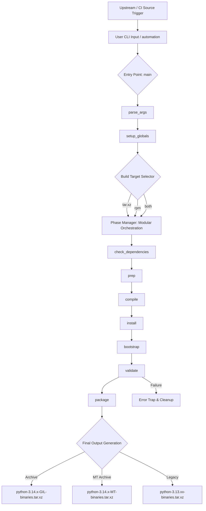

# Python Build System: Unified Modular Orchestrator
**Version**: 2.0.2  2026/04/13
**Target Platform**: EL8/9/10 (RHEL/AlmaLinux/Rocky/CentOS)  
**Distribution Prefix**: `/opt/lib/python3`

## 1. Application Overview and Objectives

The **Python Build System** is an infrastructure tool designed to produce fully isolated, relocatable, and production-ready Python 3.13+ distributions. It is engineered to decouple the Python runtime from the host operating system's library dependencies, ensuring long-term stability for IT engineering and business data processing pipelines.

### Core Objectives:
*   **Total Binary Isolation**: Eliminate "library pollution" by linking against custom, versioned libraries (OpenSSL, Expat, SQLite) in isolated prefixes.
*   **Relocatability**: Utilize advanced RPATH strategies (`$ORIGIN`) to allow the distribution to function regardless of its final mount point.
*   **Free-Threading (GIL-less) Support**: Built-in orchestration for Python 3.14+ multi-threaded builds (`--mt`), including standard binary suffixing (`t`) and **MT-Delta Packaging** for clean side-by-side coexistence.
*   **Unified Lifecycle**: Provide a single entry point for both standalone development builds and standardized RPM-spec integration.
*   **Strict Integrity Auditing**: Implement bit-level and logic-level validation (25-module registry) to prevent build-path leaks into production binaries.
*   **IT Business Ready**: Ship with a curated "Battery-Included" bundle of 13 essential PyPI packages (including **Cython**, **CFFI**, and **pip-tools**) for immediate utility.

---

## 2. Architecture and Design Choices

### 2.1 Centralized Configuration Registry (CONF)
The script utilizes a central associative array (`CONF`) to manage global state. 
*   **Design Choice**: By consolidating all paths, versions, and flags into a single registry, we eliminate the "scattered variable" anti-pattern common in complex shell scripts.
*   **Advantage**: This ensures that all modular phases (Prep, Compile, etc.) have a 100% predictable view of the environment, facilitating debugging and auditability.

### 2.2 Relocatable Isolation Strategy ($ORIGIN)
The build system employs a nested RPATH strategy. 
*   **LDFLAGS Logic**: Encodes relative paths using the `\$\$ORIGIN` variable.
*   **Design Choice**: By setting RPATHs to `'\$\$ORIGIN:\$\$ORIGIN/../lib64:\$\$ORIGIN/../..' `, the binary becomes self-aware. It searches for its shared libraries relative to its own location on disk, rather than relying on global system paths like `/usr/lib64`.

### 2.3 Compiler and Linker Specifications (CFLAGS/LDFLAGS)
To enforce binary security and isolation, the system utilizes a specific set of optimized flags:

#### CFLAGS (Compiler Flags)
*   **`-I/opt/lib/python3/include`**: Prioritizes local headers for custom-built extensions.
*   **`-O3` / `--enable-optimizations`**: Triggers Profile Guided Optimization (PGO) and Link-Time Optimization (LTO) for maximum runtime performance.
*   **`-fPIC`**: Generates Position Independent Code, essential for relocatable shared library stability.

#### LDFLAGS (Linker Flags)
*   **`-L/opt/lib/python3/lib64`**: Directs the linker to prioritize the isolated library prefix.
*   **`-Wl,-Bsymbolic`**: Binds global symbol references to their definitions within the shared library, preventing symbol preemption.
*   **`-Wl,-z,relro -Wl,-z,now`**: Hardens the binary by making the Global Offset Table (GOT) read-only and resolving all dynamic symbols at startup (Immediate Binding).
*   **`-Wl,-s`**: Strips debug symbols from production binaries to reduce footprint and improve load times.
*   **`-Wl,--disable-new-dtags`**: Force-enables `RPATH` instead of `RUNPATH`. This ensures the linker ignores `LD_LIBRARY_PATH` for internal dependencies, preventing "Library Hijacking."

> [!IMPORTANT]
> **Technical Note: The Necessity of RPATH Isolation**
> In standard RHEL/EL environments, the dynamic linker (`ld.so`) typically relies on global configuration or environment variables. This creates a risk of **Library Pollution**, where a high-assurance Python binary might accidentally load a system-level OpenSSL version instead of the specifically audited version staged in `/opt/lib/openssl`.
>
> By embedding **RPATHs** using the **`$ORIGIN`** variable, we create a "Self-Aware" distribution. This strategy is the technical foundation of **Total Relocatability**: the entire `/opt/lib/python3` hierarchy can be tarred, moved, and extracted to another location or machine, and it will continue to resolve its internal dependencies perfectly without any host-level configuration.

### 2.4 Python Configuration Strategy (./configure)
The build system utilizes a specific set of configuration flags to ensure the resulting binary is optimized for high-density IT environments and total isolation.

| Flag | Purpose | Architect Note |
| :--- | :--- | :--- |
| `--enable-optimizations` | Triggers PGO and LTO | Essential for production. Increases build time but ensures peak execution performance. |
| `--prefix` | Version-neutral root | Set to `/opt/lib/python3` to maintain path stability across upgrades. |
| `--with-platlibdir` | Forced `lib64` | Ensures architecture-dependent modules are correctly segmented in EL9-compliant paths. |
| `--disable-test-modules`| Lean binary footprint | Prevents the installation of the ~30MB test suite, reducing deployment size and attack surface. |
| `--with-ensurepip` | Native bootstrap | Deploys 'pip' within the prefix during the initial install, facilitating the `bootstrap()` phase. |
| `--enable-shared` | Shared library support | Required for extensions and for the `$ORIGIN` RPATH strategy to function. |
| `--with-system-expat` | Isolation consistency | Forces the build to use our audited Expat prefix instead of the host system's version. |
| `--with-lto` | Link-Time Optimization | Further serializes and optimizes the binary across translation units for speed. |
| `--with-openssl` | Custom OpenSSL linking | Pivotal for security; ensures the binary uses the enterprise-grade OpenSSL in `/opt/lib/openssl`. |
| `--without-static-libpython` | Dynamic-only linkage | Favors shared objects to minimize binary size and simplify library patching. |
| `--enable-ipv6` | IPv6 networking | Required for modern network environments. |
| `--with-dbmliborder` | DBM resolution | Explicitly sets the order for DBM modules to avoid host library pollution. |
| `--enable-loadable-sqlite-extensions` | SQLite power | Enables full extension support within the isolated `_sqlite3` module. |
| `--disable-gil` | Free-Threading | (Python 3.14+ only) Disables the Global Interpreter Lock. Triggers MT-Delta packaging to ensure zero-overlap with GIL. |

### 2.5 Modular Phase Separation
The script is architected as a series of idempotent (where possible) functional phases:
*   **Prep**: Source acquisition and remediation (e.g., PGO optimization patches).
*   **Compile**: Parallelized build using optimized compiler flags.
*   **Install**: Staging into a `BUILDROOT` environment to simulate final installation.
*   **Bootstrap**: Automated enrichment with core IT packages.
*   **Validate**: Strict cryptographic and logic audit (via `inspect_python.py`) of the final result.
*   **Package**: Final artifact generation. For 3.14+ MT builds, this phase strips all GIL-redundant artifacts to create a lightweight **Delta Archive**.

### 2.6 IT Business Bundle: The 13-Module Core
The distribution is pre-enriched with a "Mission-Critical" bundle of 13 packages. This registry is enforced during the `bootstrap()` phase to ensure that every Python instance is production-ready for EL9 enterprise environments.

#### Group A: Packaging & Distribution Core
1.  **`pip`**: The foundational package installer; pinned and upgraded to the latest version during bootstrap.
2.  **`setuptools`**: Essential for building and distributing Python packages using legacy and modern methods.
3.  **`wheel`**: The standard for binary package distribution; ensures faster installations by avoiding on-host compilation.
4.  **`build`**: A simple, PEP-517 consistent build frontend for generating source and binary distributions.
5.  **`installer`**: A lightweight, low-level library for installing Python wheels into an environment.

#### Group B: Secure Connectivity & Environment
6.  **`requests`**: The de-facto standard for secure HTTP communication; linked against the isolated SSL stack.
7.  **`certifi`**: Carefully curated CA bundle that ensures SSL certificate verification is decoupled from host OS roots.
8.  **`virtualenv`**: Enables the creation of isolated development sandboxes, ensuring zero pollution of the `/opt` root.
9.  **`python-dateutil`**: Advanced date and time arithmetic; essential for complex data processing pipelines.
10. **`packaging`**: Core utilities used across the ecosystem for version parsing and dependency resolution.

#### Group C: Engineering & Performance Tools
11. **`pip-tools`**: Professional-grade dependency management; provides `pip-compile` and `pip-sync` for immutable environment pinning.
12. **`cython`**: C-extensions for Python; allows for significant performance gains by compiling Python code to C.
13. **`cffi`**: Foreign Function Interface for Python; essential for high-performance integration with C libraries in free-threading (MT) environments.

All included tool binaries (e.g., `pip-compile3.14`) follow a standardized versioning and symlinking convention to ensure CLI predictability.

### 2.7 Dynamic Libraries (Isolated Core)
The following shared objects are the "Core Pillars" of the distribution. They are linked using the `$ORIGIN` RPATH strategy and reside in the isolated `lib64` prefix:

*   **`libpython3.1x.so.1.0`**: The primary shared object for the Python runtime. Note: Suffixes like `t` appear for GIL-less builds (e.g., `libpython3.14t.so`).
*   **`libssl.so` & `libcrypto.so`**: High-assurance OpenSSL libraries (isolated from host OS version).
*   **`libexpat.so`**: Custom XML parsing engine (decoupled from `/usr/lib64/libexpat`).
*   **`libsqlite3.so`**: Optimized SQLite extension with full loadable module support enabled.
*   **`libz.so`, `libbz2.so`, `liblzma.so`**: Compression backends required for modern package management.

### 2.8 Dynamic Distribution Detection & Identification
To ensure cross-machine compatibility, the system implements a multi-tier fallback detection logic to derive the distribution identifier (e.g., `el8`, `el9`, `el10`):
*   **Tier 1**: Prioritizes `/etc/distrib` (Internal IT standard).
*   **Tier 2**: Parses `VERSION_ID` from `/etc/os-release` and prefixes with `el`.
*   **Tier 3**: Defaults to `unknown` to prevent build failure, while issuing a high-visibility warning.

### 2.9 Python Extension Modules (Dynamic Shared Objects)
The following core Python extensions are built as shared objects (`.so`) and reside in the `lib-dynload` directory. They are optimized for performance and linked against the isolated core:

| Module (.so) | Functional Description | Shared Library Dependency |
| :--- | :--- | :--- |
| `_ssl` | Implements the TLS/SSL protocol suite for secure network communication. | `libssl`, `libcrypto` |
| `_hashlib` | High-performance cryptographic hashing (SHA256, BLAKE2, etc.). | `libcrypto` |
| `pyexpat` | The primary interface to the Expat XML parsing engine. | `libexpat` |
| `_sqlite3` | Native interface to the SQLite relational database engine. | `libsqlite3` |
| `_ctypes` | Foreign Function Interface (FFI) for calling C libraries from Python code. | `libffi` |
| `_socket` | Low-level networking primitives (TCP/UDP, Unix sockets). | `libc` |
| `_multiprocessing`| Support for concurrent processing and shared-memory communication. | `librt`, `libpthread` |
| `_decimal` | High-precision IEEE 754-2008 decimal floating point arithmetic. | `libmpdec` |
| `_bz2` / `_lzma` | High-ratio compression backends using Bzip2 and LZMA algorithms. | `libbz2`, `liblzma` |
| `_zlib` | Industry-standard compression/decompression interface. | `libz` |

### 2.10 Identity Governance (SHELL_BUILDUSER)
The orchestrator implements a strict identity audit to prevent permission pollution.
*   **Design Choice**: The `SHELL_BUILDUSER` variable (default: `builder`) defines the authorized executor.
*   **Enforcement**: For standalone builds, the script validates the current shell identity. If a mismatch is detected (e.g., running as `root` without RPM mode), the build is hard-aborted to maintain binary owner/group integrity.

### 2.11 Production Resilience & Observability
The system is built for "lights-out" reliability in CI/CD and automation pipelines:
*   **Safety Shell**: Uses `set -euo pipefail` to ensure the script terminates immediately on any command failure, preventing "silent failures" in intermediate build steps.
*   **Autoconf Patching**: Automatically detects Python 3.14+ and applies a compatibility patch to `configure.ac`, lowering the `AC_PREREQ` from 2.72 to 2.69 to match standard host toolchains.
*   **Cleanup Trap**: Implements a `trap cleanup EXIT` handler to manage temporary build states and provide diagnostic feedback on failure.
*   **Automated Audit Trail**: Captures all `stdout` and `stderr` into a timestamped log file within `/opt/done/` using a persistent `tee` pipe, ensuring a paper trail exists for every production build.

### 2.12 Dual-Lifecycle Orchestration (Archive vs. RPM)
The orchestrator is designed for architectural flexibility, supporting two distinct production lifecycles:

1.  **Standalone (Archive Mode)**: 
    *   **Workflow**: `prep` -> `compile` -> `install` -> `bootstrap` -> `validate` -> `package`.
    *   **Output**: A portable `.tar.xz` distribution that can be extracted into any compliant host's `/opt` hierarchy. This is ideal for rapid development and side-by-side version testing.
2.  **Governed (RPM Mode)**:
    *   **Workflow**: The script's modular phases are invoked individually by an RPM `.spec` file.
    *   **Output**: A standard `.rpm` package managed by the system package manager (`dnf`/`rpm`). This is preferred for high-assurance production environments requiring dependency tracking and immutable file manifests.

### 2.13 Binary Versioning & Symlink Convention
The system implements a standardized naming convention for all entry-point binaries (pip, cython, wheel, etc.):
*   **Versioned Binary**: `tool3.14` (GIL) or `tool3.14t` (MT).
*   **Standard Symlinks**: `tool3` and `tool` both symlink to the active versioned binary.
*   **MT Isolation**: Generic symlinks (without the `t`) are stripped from MT-Delta archives to prevent overwriting GIL-base symlinks during overlay deployment.

### 2.14 MT-Delta Packaging Policy (Zero Overlap)
For Python 3.14+ Free-Threading builds, the system enforces a strict "Zero Overlap" policy:
*   **GIL Requirement**: The MT archive is an overlay and **requires** the standard GIL distribution to be pre-installed.
*   **Artifact Stripping**: All artifacts already provided by the GIL build (non-threaded standard library, generic symlinks, common binaries, man pages) are stripped from the MT archive during the `package` phase.
*   **Result**: The MT package contains ONLY the threaded-specific delta (`libpython3.14t.so`, `lib/python3.14t/`, `bin/python3.14t`).

---

## 3. Data Flow and Control Logic

### 3.1 Operational Flow
The system follows a strict linear sequence when executed in `all` mode, but allows for surgical execution of specific steps via the `--step` flag.



### 3.2 Control Logic: The Validation Gate
The `validate` phase serves as the system's "Quality Gate." It triggers the `inspect_python.py` utility using the **newly built interpreter**. 
*   **Headless Audit**: It verifies that `sys.path` does not contain any references to the build-time source directory (`/usr/src/redhat/BUILD`).
*   **Functional Verification**: It performs code execution tests for `pyexpat`, `sqlite3`, `ssl`, and `hashlib` to ensure the dynamically loaded modules are operational and correctly linked.

---

## 4. Dependencies

### 4.1 Build-Time Dependencies (Host DNF)
Accessible via the automated `check_dependencies` phase:
*   **Compiler Toolchain**: `gcc`, `make`, `autoconf`, `automake`, `pkgconf-pkg-config`.
*   **System Headers**: `glibc-devel`, `libffi-devel`, `zlib-ng-devel`, `bzip2-devel`, `xz-devel`.
*   **Support Libraries**: `bluez-libs-devel`, `gdbm-devel`, `libuuid-devel`, `mpdecimal-devel`, `ncurses-devel`, `readline-devel`.
*   **Development Tools**: `git-core`, `wget`, `tar`, `readelf`.
*   **Custom Libraries (Optional)**: `openssl-cs-devel`, `expat-cs-devel`, `sqlite-cs-devel`.

### 4.2 Application Utilities
*   **wget**: For secure source acquisition.
*   **tar**: For handling XZ-compressed archives.
*   **readelf**: Used for RPATH header auditing during validation.
*   **sudo**: Required for dependency installation (requires TTY).

### 4.3 Internal Components
*   **inspect_python.py**: A standalone Python utility responsible for deep-state auditing.

---

## 5. Command Line Arguments

| Argument | Type | Default | Description |
| :--- | :--- | :--- | :--- |
| `--python-version` | String | (Required) | Target Python version (e.g., `3.13.13`). |
| `--openssl-version`| String | (Required*) | OpenSSL version (Required if `--custom-libs` is set). |
| `--custom-libs` | Boolean | `false` | Enable linking against isolated custom libraries. |
| `--step` | Enum | `all` | Specific phase: `prep`, `compile`, `install`, `bootstrap`, `validate`, `package`. |
| `--all` | Boolean | `all` | Alias for `--step=all`. |
| `--purge` | Boolean | `false` | Remove build artifacts after successful packaging. |
| `--no-deps` | Boolean | `false` | Skip DNF dependency check (Auto-enabled in RPM builds). |
| `--mt` | Boolean | `false` | Enable Free-Threading (MT) build (Python 3.14+). Adds `t` suffix to binary and libs. |
| `--distrib` | String | (Auto) | Override distribution detection (e.g., `el9`, `el10`). |
| `--help` | Boolean | `false` | Show CLI usage help. |

---

## 6. Detailed Usage Examples

### 6.1 Standard Production Build
To generate a full relocatable Python 3.13 distribution with custom libraries and full cleanup:
```bash
./python_build.sh --python-version=3.13.13 --openssl-version=3.6.2 --custom-libs --purge --all
```

### 6.2 Specialized Development (Compilation Only)
When iterating on local patches within the `BUILD` directory, run only the compilation phase:
```bash
./python_build.sh --python-version=3.13.13 --custom-libs --step=compile
```

### 6.3 Free-Threading (MT) Build
To build a GIL-less Python 3.14 instance with custom libraries:
```bash
./python_build.sh --python-version=3.14.0 --mt --custom-libs --all
```

### 6.4 Security Validation Audit
To audit an existing installation staged in the `BUILDROOT`:
```bash
./python_build.sh --python-version=3.13.13 --step=validate
```

## 7. RPM Integration Reference (%spec)

The following template demonstrates a production-grade `.spec` file designed to orchestrate the `python_build.sh` script. This approach ensures that the build is governed by the standard RPM lifecycle while benefiting from the script's advanced isolation and validation logic.

```spec
Name:           python-cs
Version:        3.13.13
Release:        1%{?dist}
Summary:        Isolated, Relocatable Python Distribution

License:        Internal
URL:            https://www.python.org/
BuildRoot:      %{_tmppath}/%{name}-%{version}-%{release}-root-%(%{__id_u} -n)

# Hard Build Requirement for total isolation
BuildRequires:  autoconf, automake, gcc, make, pkgconfig
BuildRequires:  openssl-cs-devel, expat-cs-devel, sqlite-cs-devel
BuildRequires:  zlib-devel, bzip2-devel, xz-devel, libffi-devel

%description
A fully isolated and relocatable Python distribution. 
Includes core IT modules (requests, certifi, pip-tools, etc.) 
and is linked against custom versions of OpenSSL, Expat, and SQLite.

%prep
# Call the orchestrator's prep phase to acquire and patch sources.
%{_sourcedir}/python_build.sh --python-version=%{version} --step=prep

%build
# Orchestrate optimized compilation with custom library isolation.
%{_sourcedir}/python_build.sh --python-version=%{version} --openssl-version=3.6.2 --custom-libs --step=compile

%install
# Stage the installation into the versioned Safety Sandbox.
# Path: BUILDROOT/Python-%{version}/opt/...
%{_sourcedir}/python_build.sh --python-version=%{version} --step=install

# Enrich the environment with the IT Business Bundle.
# This ensures the RPM payload contains the pre-installed PyPI packages.
%{_sourcedir}/python_build.sh --python-version=%{version} --step=bootstrap

%check
# Strict Automated Audit: GATE the build on RPATH leaks and functional tests.
%{_sourcedir}/python_build.sh --python-version=%{version} --step=validate

%clean
rm -rf %{buildroot}

%files
%defattr(-,builder,users,-)
# Governance: Standard prefix for isolated Python distributions.
/opt/lib/python3/
# System Configuration: LD runtime linker hint.
/etc/ld.so.conf.d/python3.conf

%changelog
* Fri Apr 10 2026 IT Engineering - 3.13.13-1
- Initial Unified Modular Build
```

---

## 8. Mode-Based Governance & Execution Playbook

The system provides three distinct operational modes to meet production, hybrid, and development requirements.

### 8.1 Operational Governance Matrix

The system provides three distinct operational modes to meet production, hybrid, and development requirements.

| Lifecycle Archetype | Governance | Primary Invocation Example | Primary Artifacts | Technical Alignment |
| :--- | :--- | :--- | :--- | :--- |
| **Production RPM (GIL)** | Spec-Governed | `rpmbuild -bb python-cs.spec` | `python-cs` | **Standard Deployment.** GIL-parallel distribution; providing shared stdlib. |
| **Production RPM (MT)** | Spec-Governed | `rpmbuild -bb --with mt ...` | `python-cs-mt` | **Parallel Add-on.** Additional unique package identity; coexists with and overlays `python-cs`. |
| **Hybrid Dual-Artifact** | Spec-Governed | `rpmbuild -bb --with archive ...` | `.rpm` + `.tar.xz` | **Additive Mode.** 100% binary parity; non-exclusive threading selection. |
| **Developer Sandbox** | Standalone | `./python_build.sh --all` | `.tar.xz` Archive Only | **Rapid Iteration.** Zero RPM side-effects; isolated versioned staging. |

#### Combinatorial Tuning Note:
Spec-Governed modes can be combined. Threading model (`--with mt`), version overrides (`--define "python_version ..."`), and artifact triggers (`--with archive`) can be used in a single command pass.

### Technical Considerations for All Modes:
*   **Relocatability**: $ORIGIN RPATHs are applied to ensure artifacts can be moved/renamed post-deployment.
*   **Dependency Stack**: Linked against custom prefixes for OpenSSL (%{openssl_version}), Expat, and SQLite.
*   **IT Bundle**: Automated bootstrap of core packages (Cython, pip-tools, etc.) is included in all modes.
