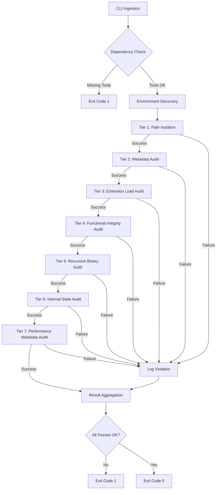

# Technical Specification: Python Build Isolation Auditor (inspect_python.py)

## 1. Application Overview and Objectives
`inspect_python.py` serves as a high-assurance validation gate within the Python 3.14.5 build orchestration pipeline. Its primary objective is to verify that the newly compiled interpreter and its associated extension modules are strictly isolated from the host environment and compliant with architectural hardening requirements.

### Core Objectives:
*   **Environment Neutrality**: Ensure no build-time absolute paths leak into the runtime `sys.path` or internal metadata.
*   **Library Isolation**: Validate that core C-extensions (SSL, SQLite, Expat) exclusively resolve their dependencies from the isolated `/opt/lib` stack.
*   **Binary Relocatability**: Enforce `$ORIGIN`-relative `RPATH` headers and prohibit the use of `RUNPATH` to ensure the prefix remains portable.
*   **Performance Verification**: Audit the persistence of PGO (Profile Guided Optimization) and LTO (Link Time Optimization) metadata in the `sysconfig` registry.

## 2. Architecture and Design Choices
The auditor employs a multi-tiered, sequential validation strategy. Each tier must pass for the build to be considered compliant.

### Granular 7-Tier Audit Sequence:
1.  **Environment Isolation (Tier 1)**: Initial verification that `sys.path` is purged of host build-time absolute paths.
2.  **Distribution Metadata (Tier 2)**: Verification of `PLATLIBDIR` consistency (e.g., enforcing `lib64` on RedHat systems).
3.  **Extension Load Stability (Tier 3)**: Programmatic verification that core shared objects (e.g., `_ssl`, `_sqlite3`) can be imported without resolution errors.
4.  **Deep Functional Integrity (Tier 4)**: Real-world execution of extension logic (XML parsing, SQL arithmetic, SSL handshakes) to verify symbol resolution.
5.  **Recursive Binary Audit (Tier 5)**: Static inspection of every ELF binary in the prefix to enforce `$ORIGIN` RPATHs and prohibit `RUNPATH`.
6.  **Internal State Audit (Tier 6)**: Verification that `sys.prefix`, `sys.executable`, and `sysconfig` paths are strictly anchored within the `/opt` root.
7.  **Performance & Hardening Metadata (Tier 7)**: Final audit of the `sysconfig` registry to confirm the persistence of PGO, LTO, and RELRO/BIND_NOW flags.

## 3. Data Flow and Control Logic
The application follows a strictly deterministic data flow, transitioning from environment discovery to a cumulative result aggregation.

### Operational Flow Diagram:


### Control Logic:
*   **Binary Discovery**: Uses `os.walk` for recursive traversal. ELF identification is performed via magic-byte signature (`\x7fELF`) rather than file extension to ensure comprehensive coverage.
*   **Isolation Logic**: Distinguishes between "Internal Staging" (paths within the temporary `BUILDROOT`) and "Forbidden System Paths" (e.g., `/usr/lib64`). This enables the script to run effectively both during the build phase and after final deployment.

## 4. Dependencies
The auditor relies on a minimal footprint of system utilities and Python standard modules to maintain its integrity.

### External Utilities:
*   **readelf (binutils)**: Required for non-intrusive static inspection of ELF dynamic sections.
*   **ldd (glibc-common)**: Required for runtime dependency resolution verification.

### Python Modules:
*   **sysconfig**: Used for retrieving build-time configuration variables.
*   **importlib**: Used for programmatic verification of extension loader stability.
*   **subprocess**: Used for orchestration of external binary audits.

## 5. Command Line Arguments
The script supports a focused set of arguments to control audit strictness and verbosity.

| Argument | Type | Default | Description |
| :--- | :--- | :--- | :--- |
| `--verbose` | Boolean | `False` | Enables engineering-level logging, including RPATH values and LDD resolution paths for all audited binaries. |
| `--custom-libs` | Boolean | `False` | Enforces strict `/opt/lib` isolation. When active, core modules resolving to system paths (`/usr/lib`) are treated as critical violations. |

## 6. Detailed Examples

### Standalone Production Audit
Used to verify the integrity of an existing installation in the `/opt/lib/python3` prefix:
```bash
/opt/lib/python3/bin/python3.14 inspect_python.py --verbose --custom-libs
```

### Build-Pipeline Integration
Typical invocation during the `validate` phase of the `python_build.sh` orchestrator:
```bash
# Executed within the BUILDROOT environment
${STAGING_INTERPRETER} inspect_python.py --custom-libs
```

### Targeted Module Verification
To verify the isolation of a specific subset of libraries (e.g., only checking SSL and SQLite):
```bash
# This is handled internally by modifying LIBS_FOR_ISOLATION in the configuration section
# Default: ['libpython', 'libexpat', 'libsqlite3', 'libssl', 'libcrypto']
```
