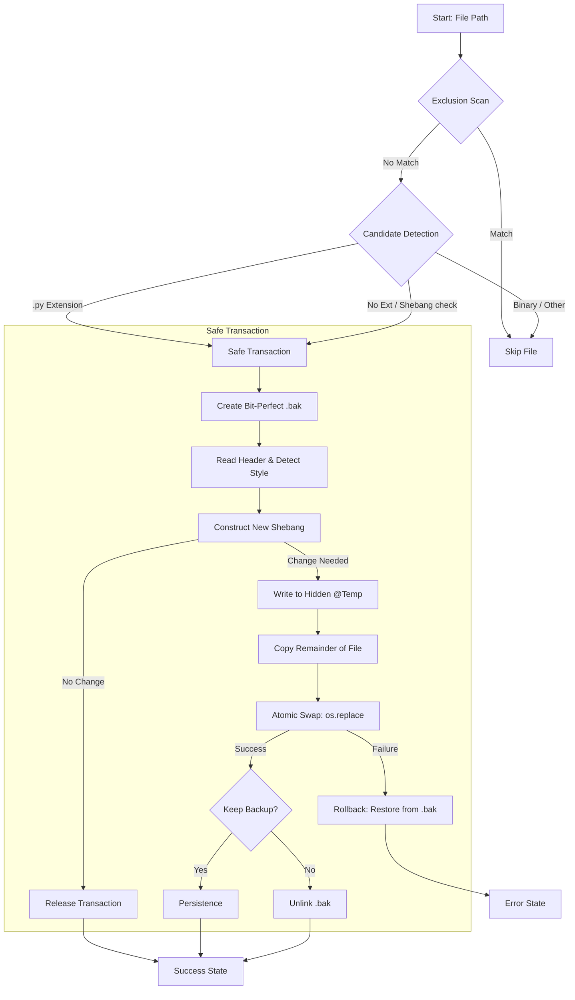

# Pathfix Execution Intelligence (v2.7.0) - Safe Edition
**Document Version:** v1.0.0xg 04/15/2026

### 1. Application Overview and Objectives
`pathfix.py` is a high-integrity DevOps utility designed to orchestrate the mass-upgrading of Python interpreter paths (shebang lines) across complex directory topologies. Unlike standard stream editors (like `sed` or `awk`), Pathfix provides **semantic awareness** of the shebang structure and implements a **Safe Transactional Model** to guarantee data safety during bulk mutations.

**Core Objectives:**
*   **Operational Integrity**: Ensure that partial writes or system failures never leave a script in an inconsistent or corrupted state.
*   **Scalable Performance**: Provide O(n) performance on massive repositories by utilizing selective tree-pruning and low-I/O header inspection.
*   **Agnostic Execution**: Maintain identical behavior across POSIX and Windows environments through abstracted path and metadata handling.

---

### 2. Architecture and Design Choices

#### 2.1 Safe Transactional Model
At the heart of Pathfix is the Safe Transactional Engine. It treats every file update as an isolated transaction with four distinct phases:
1.  **Staging (Bit-Perfect Backup)**: A mandatory safety copy (`.bak`) is created using `shutil.copy2` to preserve both content and ACL/metadata.
2.  **Transformation (Isolated Workspace)**: The mutation is performed in a hidden temporary file (@+name) in the same directory.
3.  **Atomic Commitment (The Swap)**: The `os.replace` syscall is used for an atomic overwrite. On modern filesystems, this ensures the file is never missing or empty.
4.  **Verification & Rollback**: Any exception triggers an automatic rollback of the `.bak` file, restoring the system to its pre-transaction state.

#### 2.2 Performance Architecture: Tree Pruning
To handle repositories with hundreds of thousands of files (e.g., node_modules or large monorepos), the script implements **Pruning Recursion**. By modifying `os.walk`'s `dirs` list in-place, the crawler skips hidden folders (`.*`) and noise directories (`__pycache__`, `target`, etc.) without ever performing `lstat` calls on their children, dramatically reducing IOPS.

---

### 3. Data Flow and Control Logic

#### 3.1 Operational Flow Diagram
The following Mermaid diagram illustrates the decision tree and transactional boundaries of a single file operation.



#### 3.2 Data Sequences
*   **Input Sequence**: `Path String` -> `Path Object` -> `Absolute Resolution`.
*   **Stream Sequence**: `Binary Read (Header)` -> `Buffered Stream Copy (shutil.copyfileobj)` to minimize memory footprint.
*   **Metadata Sequence**: `stat(original)` -> `copymode(temp)` -> `utime(final)`.

---

### 4. Dependencies
The application adheres strictly to the **Python 3 Standard Library** to ensure zero-bootstrap deployment in restricted CI/CD environments.

| Module | Purpose |
| :--- | :--- |
| `argparse` | Robust command-line parsing and help generation. |
| `pathlib` | Object-oriented filesystem path manipulation. |
| `shutil` | High-level file operations (copy2, copymode, copyfileobj). |
| `fnmatch` | Shell-style glob pattern matching for target/exclude filters. |
| `logging` | Level-aware status and error reporting. |
| `dataclasses` | Structured configuration state management (v3.7+). |

---

### 5. Command Line Arguments

| Short | Long | Type | Default | Description |
| :--- | :--- | :--- | :--- | :--- |
| `-i` | `--interpreter` | `String` | **REQUIRED** | Absolute path to the new interpreter (e.g., `/usr/bin/python3`). |
| `-v` | `--verbose` | `Flag` | `False` | Enables `DEBUG` level logging for engineering analysis. |
| `-p` | `--preserve` | `Flag` | `False` | Preserve original Access/Modification timestamps using `os.utime`. |
| `-b` | `--backup` | `Flag` | `False` | Persist the `.bak` file after a successful update. |
| `-s` | `--keep-space` | `Flag` | `False` | Favor `#! /` style if detected. Default is compact `#!/`. |
| `-k` | `--keep-flags` | `Flag` | `False` | Inherit and keep any flags from the original shebang. |
| `-a` | `--add-flags` | `String` | `None` | Append a single literal flag string (e.g., `W` for `-W`). |
| `-t` | `--file-pattern` | `String` | `None` | Restrict search scope via glob (e.g., `"test_*.py"`). |
| `-o` | `--scope` | `Int` | `None` | Max recursion depth. `0` = Current Directory only. |
| `-x` | `--exclude` | `String` | `None` | CSV list of names/patterns to prune (e.g., `"legacy,*.tmp"`). |

---

### 6. Detailed Engineering Examples

#### 6.1 Standard Enterprise Migration
Migrate all scripts to Python 3.12 while preserving original file timestamps but cleaning up the internal space.
```powershell
python pathfix.py -i /opt/service/bin/python3.12 -p .
```

#### 6.2 Targeted Rollout with Flag Inheritance
Fix shebangs only for `app_` prefixed scripts within two directory levels, inheriting original flags (like `-s` or `-O`) and making the backup permanent for audit purposes.
```powershell
python pathfix.py -i /usr/bin/python3 -k -b -o 2 -t "app_*.py" .
```

#### 6.3 Maintenance Scan of Clean Repositories
Identify extensionless scripts in a dirty build tree while excluding specific legacy folders and patterns.
```powershell
python pathfix.py -v -i /usr/bin/python3 -x "build_old,archive_*,temp" .
```

#### 6.4 Cross-Project Mass Migration (Multi-Root)
Update shebangs across multiple independent project roots in a single execution.
```powershell
python pathfix.py -i /usr/local/bin/python3.13 project_a/src project_b/scripts
```

#### 6.5 Enforcing Unbuffered I/O for CI/CD
Inject the `-u` flag into all scripts ending in `_worker.py` while ensuring original space styles are preserved for readability.
```powershell
python pathfix.py -i /usr/bin/python3 -a u -s -t "*_worker.py" .
```

#### 6.6 Recovery Audit (Safe-Only)
Run in verbose mode to identify which files *would* be updated, while using `-b` to ensure a permanent roll-back path exists for every single mutation.
```powershell
python pathfix.py -v -i /usr/bin/python3 -b .
```

#### 6.7 Excluding Specific File Generations
Target all Python files except those generated by specific tools (e.g., Protobuf or Swagger generated files).
```powershell
python pathfix.py -i /usr/bin/python3 -x "*_pb2.py,swagger_*" .
```
