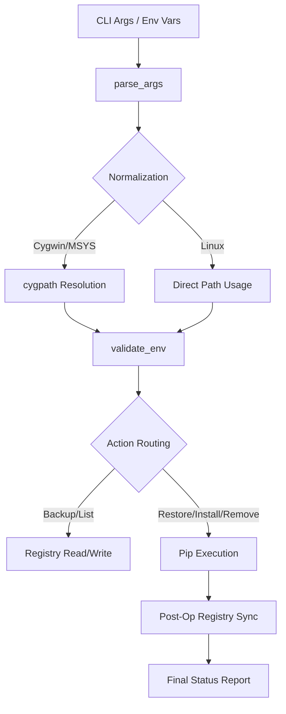

# Python Module Manager (`py_module_manager.sh`)

## 1. Overview and Objectives
The `py_module_manager.sh` is a modular, cross-platform Bash utility designed to manage the lifecycle of Python packages within specific environments. Its primary objective is to provide a reliable bridge between the live Python environment and a version-controlled registry file, enabling:
- **Environment Replication**: Capturing (`backup`) and recreating (`restore`) package states.
- **Controlled Lifecycle**: Direct installation and removal of packages with automatic registry synchronization.
- **Portability**: Seamless operation across Linux, Cygwin, and MSYS2 environments.
- **Reconciliation**: Auditing live environments against target states to identify drift.

## 2. Architecture and Design Choices
### 2.1 Centralized Configuration (`CONF`)
The script utilizes a single associative array (`CONF`) as the "Source of Truth" for all operational state. This ensures a consistent value resolution hierarchy:
1. **Command Line Flags** (Highest priority)
2. **Environment Variables**
3. **Hardcoded Defaults** (Lowest priority)

### 2.2 Portability Layer (`normalize_path`)
To support hybrid Windows/Unix environments (Cygwin/MSYS2), the script implements a normalization layer. It detects the host `$OSTYPE` and leverages `cygpath` to transform Windows-style paths (e.g., `D:\dev\...`) into Unix-compatible paths before any file system operations or binary executions are performed.

### 2.3 Fail-Fast Strategy
The script enforces strict error handling using `set -euo pipefail`. Every critical path is protected by explicit validation checks to ensure that incomplete or corrupted state changes are never committed to the registry or the live environment.

## 3. Data Flow and Control Logic

### 3.1 Operational Flow
The utility follows a sequential pipeline from input resolution to state persistence.



### 3.2 Code Relations
- **Input Processing**: `parse_args` handles complex colon-prefixed actions (`install:pkg1,pkg2`).
- **Validation**: `validate_env` ensures binary executability and registry write permissions.
- **Reconciliation Engine**: `status_pkg_list` compares live `pip show` outputs against registry metadata.

## 4. Dependencies
The script is designed to be lightweight but requires the following external components:

| Dependency | Required For | Note |
| :--- | :--- | :--- |
| **Bash 4.0+** | Base Logic | Required for associative arrays. |
| **pip / sysconfig** | All Live Actions | Must be accessible as modules (`python -m pip`, `python -m sysconfig`). |
| **jq** | JSON Output | Hard dependency for `--format=json`. |
| **cygpath** | Windows Portability | Automatically used on Cygwin/MSYS2 platforms. |
| **Standard Unix Tools** | Text Processing | `grep`, `sed`, `printf`, `sort`, `wc`. |

## 5. Safety Features & Best Practices
- **Global Write Enforcement**: The script proactively verifies write permissions for the Python `purelib` and `platlib` directories. This prevents `pip` from silently falling back to user-level installations (`--user`) if system paths are protected.
- **Fail-Fast Validation**: Any dependency issues, permission conflicts, or path errors are caught early in the execution chain to protect environment integrity.
- **Atomic Registry Updates**: State mutations (install/remove) are followed by a full registry refresh to ensure 100% synchronization.

## 6. Command Line Arguments

| Argument | Type | Default | Description |
| :--- | :--- | :--- | :--- |
| `--action` | String | (Required) | Action to perform: `backup`, `restore`, `list`, `install:<pkgs>`, `remove:<pkgs>`, `status:<pkgs>`. |
| `--python` | Path | `$PYTHON` | Path to the target Python binary. |
| `--registry` | Path | `$PYTHON_PKG_REGISTRY` | Path to the package registry file (e.g., `pkgs.txt`). |
| `--jq` | Path | `$JQ` or `jq` | Path to the `jq` binary (optional fallback to PATH). |
| `--format` | String | `text` | Output format for `list`: `text` or `json`. |
| `--help` | N/A | N/A | Displays help and usage examples. |

## 6. Detailed Examples

### 6.1 State Management (Backup & Restore)

**Scenario 1: Full Environment Backup**
Capture the current environment state into a portable registry file.
```bash
./py_module_manager.sh --action=backup --registry=./python-3.14-packages.txt
```

**Scenario 2: Environment Migration**
Replicate the captured state in a new Python environment.
```bash
./py_module_manager.sh --python=/opt/new_python/bin/python3 \
                       --action=restore \
                       --registry=./python-3.14-packages.txt
```

### 6.2 Managed Lifecycle Actions

**Scenario 3: Bulk Installation with Auto-Sync**
Install multiple packages and immediately update the registry to reflect new versions and dependencies.
```bash
./py_module_manager.sh --action=install:requests,jinja2,boto3 \
                       --registry=./registry.txt
```

**Scenario 4: Selective Removal**
Uninstall a package and clean its entry from the registry automatically.
```bash
./py_module_manager.sh --action=remove:pyflakes --registry=./registry.txt
```

### 6.3 Reconciliation & Observability

**Scenario 5: Reconciliation Audit (Status)**
Check if specific packages match the expected registry state. Identifies version drift (MISMATCH) or missing installations (MISSING_LIVE).
```bash
./py_module_manager.sh --action=status:requests,urllib3 --registry=./registry.txt
```

**Scenario 6: Full Environment Reconciliation**
Audit the entire environment against a registry to identify all untracked, mismatched, or missing packages.
```bash
./py_module_manager.sh --action=status:all --registry=./registry.txt
```

**Scenario 7: JSON Export for Tool Integration**
Generate a structured JSON view of the registry for use in automated dashboards or reporting tools.
```bash
./py_module_manager.sh --action=list --format=json --jq="/usr/local/bin/jq" > audit.json
```

### 6.4 Advanced Portability & Environment Variables

**Scenario 7: Cross-Platform Path Normalization (Cygwin/MSYS2)**
Pass native Windows paths directly; the script handles the translation to Unix-style paths.
```bash
./py_module_manager.sh --python="D:\dev\python314\python.exe" \
                       --action=status:requests \
                       --registry="E:\backups\packages.txt"
```

**Scenario 8: Using Environment Variables**
Configure the script via environment variables to simplify CLI calls.
```bash
export PYTHON="/usr/bin/python3.14"
export PYTHON_PKG_REGISTRY="./packages.txt"

# CLI call is now simplified
./py_module_manager.sh --action=backup
```

## 7. Troubleshooting & Error Handling
- **Missing PIP**: The script will validate pip availability before execution. If missing, it returns Exit Code 1 with a descriptive error.
- **JQ Dependency**: If `--format=json` is requested but `jq` is not found, the script provides instructions on how to provide a custom path via `--jq`.
- **Registry Permissions**: If the target registry directory is not writable, the script fails fast during the `validate_env` stage to prevent data loss.
