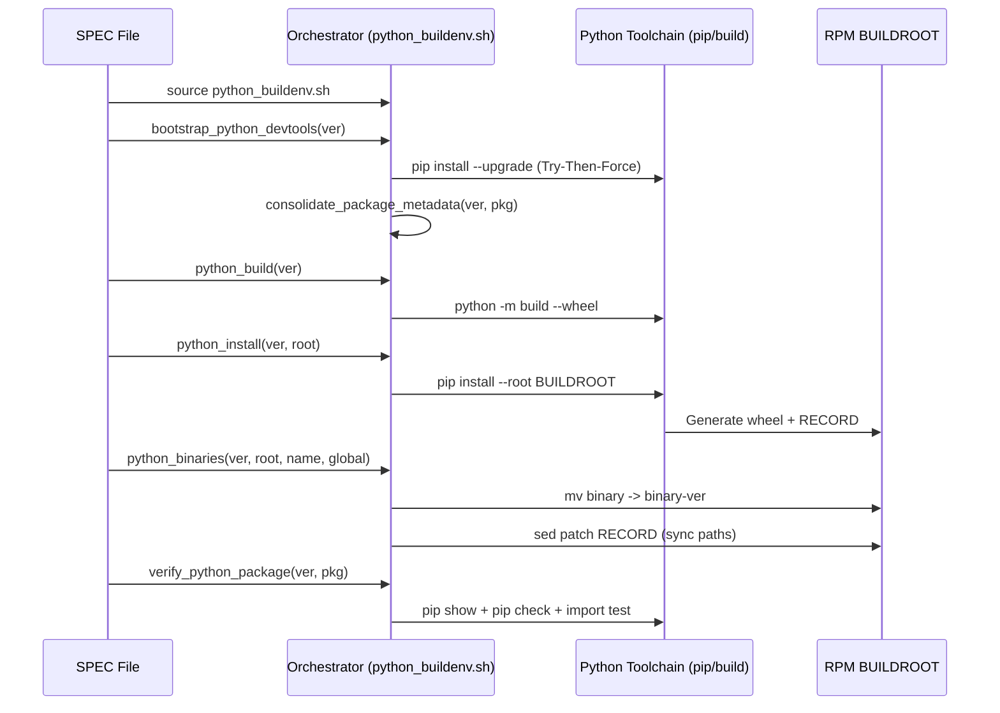

# Python Environment Loader (`python_buildenv.sh`)

## Application Overview and Objectives
The `python_buildenv.sh` script is a collection of functions designed to standardize the Python RPM build process. It addresses the complexity of managing multiple Python versions on a single host by providing a conflict-free, PEP 376-compliant environment.

**Key Objectives:**
- **Standardized Metadata**: Ensure every Python RPM contains native, trusted `RECORD` metadata (the PEP 376 manifest used by pip to track file inventory, hashes, and uninstallation).
- **Binary Isolation**: Automatically version all binaries (e.g., `tool` -> `tool-3.13`) to prevent cross-package conflicts.
- **Environment Resilience**: Implement "Try-Then-Force" bootstrapping to recover from broken host environments.
- **SPEC Simplification**: Reduce complex RPM SPEC installation logic to a few standardized function calls.

---

## Architecture and Design Choices

### 1. Centralized Orchestration
Instead of duplicating logic in every SPEC file, all core Python build and installation logic is consolidated into a single sourceable script. This ensures that a bug fix or feature update (like adding a new security flag) propagates to all packages instantly.

### 2. Standard-First Metadata
The architecture abandons custom metadata patching in favor of native `pip` behavior. By using `pip install --root`, we generate standard `RECORD` files that are natively trusted by the Python ecosystem (`pip list`, `pip check`, etc.).

### 3. Universal Binary Versioning
Rather than requiring the developer to list every binary name in the SPEC file, `python_binaries` loops over all files in `/usr/bin`. This makes the script package-agnostic and extremely resilient to upstream changes in tool names.

### 4. Metadata Synchronization (`sed` Patching)
To maintain the "Standard Metadata" goal while still renaming files for isolation, the script uses a high-performance `sed` batch process to update the `RECORD` file paths. This keeps the disk state and the metadata state in 100% synchronization.

### 5. Post-Install Metadata Consolidation
To resolve "RPM vs pip" conflicts where multiple versions of the same tool might exist in metadata, the script implements a **PIP-Authority** strategy. After an upgrade, it programmatically purges any "dangling" `.dist-info` or `.egg-info` directories that don't match the version `pip` just installed, including older RPM-managed folders.

### 6. Tiered Integrity Verification
Beyond basic existence checks, the script provides 3-tier validation:
1. **Metadata Health**: Confirms `pip` can read the package manifest.
2. **Dependency Audit**: Ensures no conflicting versions exist in the environment.
3. **Functional Import**: Confirms the package is loadable into memory and source files are intact.

### 7. Automated Identity Injection
The script automatically identifies all PEP 376 `INSTALLER` files in the buildroot and overwrites them with `"rpm"`. This ensures that the Python ecosystem (e.g., `pip list`) correctly identifies the package as system-managed without requiring manual overrides in the SPEC file.

---

## Data Flow and Control Logic

### Operational Flow
The typical lifecycle of an RPM build using this orchestrator follows this sequence:



---

## Dependencies
- **Shell**: Bash 4.0+ (utilizes `[[ ]]` and `local` scoping).
- **Core Utilities**: `sed`, `find`, `pushd/popd`, `which`.
- **Python Stack**: 
  - Python 3.13+ (designed for modern versions).
  - `ensurepip` (standard library).
  - `pip`, `build`, `setuptools`, `wheel` (installed during bootstrap).
- **Permissions**: `sudo` access (configurable via `python_sudo` variable).

---

## Binary Management & Versioning

The Loader automatically governs the `/usr/bin` namespace to ensure total isolation and metadata integrity. This is handled by the `python_binaries` function.

### 1. Isolated Mode (`python_global_default = 0`)
In this mode, the package provides versioned access only, preventing conflicts with other Python installations.

| Original File | Renamed Binary | Symlink Alias | Purpose |
| :--- | :--- | :--- | :--- |
| `binary` | `binary-3.13` | `binary3.13` | Primary versioned entrypoint. |
| `binary3` | (Deleted) | (None) | Redundant major-version alias. |
| `binary3.13`| (Deleted) | (None) | Redundant full-version alias. |

**Note**: The Loader implements a **Redundancy Detection** strategy. It only purges versioned upstream aliases (e.g., `pip3`, `pip3.13`) if their base counterpart (e.g., `pip`) is present. This protects legitimate versioned tools (e.g., `ipv6`) while ensuring a clean, isolated namespace.

Physical files are renamed to `${f}-${py_ver}`. Symlinks are created as `${f}${py_ver}`.

### 2. Global Default Mode (`python_global_default = 1`)
When a package is designated as the system default, it provides the isolated binaries above **plus** the following global symlinks:

| Symlink Name | Points To | Purpose |
| :--- | :--- | :--- |
| `binary-3` | `binary-3.13` | Major version compatibility. |
| `binary3` | `binary3.13` | Standard Python 3 alias. |
| `binary` | `binary3` | Global system entrypoint. |

---

## Functional API

### `check_python_id [version]`
- **Objective**: Normalizes and verifies the Python version.
- **Args**: `version` (string, e.g., "3.13").
- **Default**: Falls back to `${python_version}` environment variable.

### `bootstrap_python_devtools version`
- **Objective**: Ensures a healthy build environment.
- **Args**: `version` (required).
- **Behavior**: Uses "Try-Then-Force" and automatic metadata consolidation to ensure a clean slate.

### `consolidate_package_metadata version package`
- **Objective**: Resolves metadata conflicts for a specific package.
- **Args**: `version`, `package_name`.
- **Behavior**: Purges all metadata directories that don't match the version pip currently considers active.

### `verify_python_package version package [import_name] [verbose]`
- **Objective**: Performs a 3-tier health check on an installed package.
- **Args**: 
  - `version`: Target Python version.
  - `package_name`: Name of the package to verify.
  - `import_name`: (Optional) Custom import name.
  - `verbose`: (Optional) Set to `1` to enable detailed logging and command output.
- **Checks**: Metadata (`pip show`), Dependencies (`pip check`), and Functional Import (`python -c`).

### `python_build version`
- **Objective**: Generates a standard wheel from `pyproject.toml`.
- **Args**: `version` (required).

### `python_install version buildroot`
- **Objective**: Performs a root-redirected installation.
- **Args**: `version` (required), `buildroot` (path).

### `python_binaries version buildroot [pypi_name] [is_global]`
- **Objective**: Handles versioning and metadata patching.
- **Args**: 
  - `version`: Target Python version.
  - `buildroot`: RPM buildroot path.
  - `pypi_name`: Primary name for symlinking (optional).
  - `is_global`: `1` to create global links (e.g., `/usr/bin/wheel`).

---

## Detailed Usage Examples

### Manual CLI Usage
You can use the script directly for development or debugging:
```bash
source /opt/scripts/python_buildenv.sh
bootstrap_python_devtools 3.13
python_build 3.13
# Results in ./dist/*.whl
```

### RPM SPEC Implementation
The script is designed to be called directly in the `%install` section:
```spec
%install
/bin/bash << 'EOF'
  source %{python_buildenv}
  python_install %{__python3_id} %{buildroot}
  python_binaries %{__python3_id} %{buildroot} %{srcname} %{python_global_default}
EOF
```

---

## Sample SPEC File Template
Below is a standardized template using the orchestrator for a typical Python package:

```spec
Name:           python-%{pypi_name}
Version:        0.47.0
Release:        10%{?dist}
Summary:        Standardized Python Package

%description
Standardized package built using the python_buildenv.sh orchestration layer.

%prep
%autosetup -n %{pypi_name}-%{version}
/bin/bash << 'EOF'
  source %{python_buildenv}
  bootstrap_python_devtools %{__python3_id}
EOF

%build
/bin/bash << 'EOF'
  source %{python_buildenv}
  python_build %{__python3_id} --no-isolation
EOF

%install
/bin/bash << 'EOF'
  source %{python_buildenv}
  python_install %{__python3_id} %{buildroot}
  python_binaries %{__python3_id} %{buildroot} %{pypi_name} %{python_global_default}
EOF

%files
/usr/bin/%{pypi_name}-%{__python3_id}
/usr/bin/%{pypi_name}%{__python3_id}
# Global symlinks (conditional in real spec)
/usr/bin/%{pypi_name}
/usr/bin/%{pypi_name}3
%{python3_sitelib}/%{pypi_name}
%{python3_sitelib}/%{pypi_name}-%{version}.dist-info/
```
