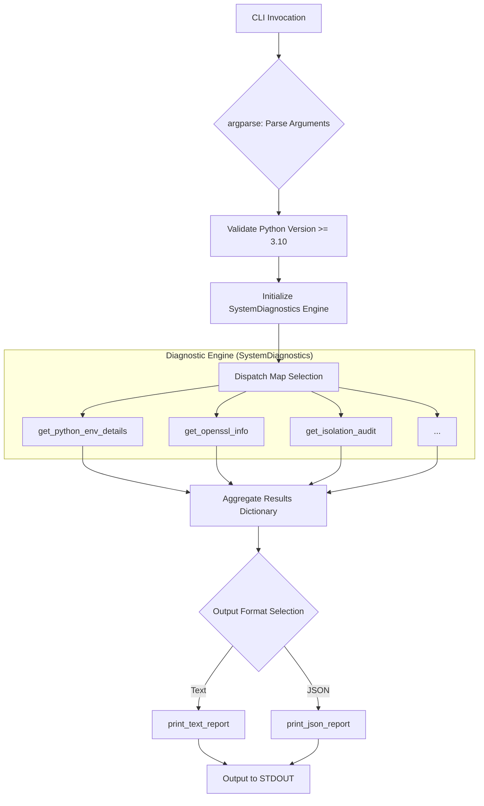

# Python System Diagnostics (`python_sysdiags.py`)

## 1. Application Overview and Objectives

The **Python System Diagnostics** script is a command-line tool designed to provide a comprehensive, detailed report on the Python interpreter's configuration and its interaction with the underlying system. Its primary objective is to help developers, system administrators, and security engineers quickly diagnose issues related to the Python build environment, library linkage (especially OpenSSL), and system capabilities.

The script can produce output in either a human-readable text format or a machine-readable JSON format, making it suitable for both interactive use and automated CI/CD pipelines.

## 2. Architecture and Design Choices

The script is designed with a focus on **modularity**, **separation of concerns**, and **extensibility**.

### 2.1 Core Components

- **`SystemDiagnostics` Class**: This class is the engine of the script, encapsulating all data-gathering logic. Each diagnostic check is implemented as a separate atomic method (e.g., `get_python_env_details()`, `get_openssl_info()`) that returns a structured dictionary. This design isolates data collection from presentation.
- **Separation of Concerns (Data vs. Presentation)**: The script strictly separates the process of gathering data from displaying it. The `SystemDiagnostics` class only collects data. The `main` function then passes this data to specialized presentation functions (`print_text_report()` or `print_json_report()`).
- **Dispatch Table for Command-Line Control**: Instead of a long chain of conditional statements, the `main` function uses a dispatch table (dictionary) to map command-line arguments to the corresponding methods in the `SystemDiagnostics` class.
- **Platform-Aware and Version-Safe**: The script handles platform-specific features (like the `resource` module on Unix) and enforces a version check to ensure it runs on a compatible Python version (3.10+).

## 3. Operational Flow and Control Logic

The following diagram illustrates the sequence from CLI invocation to report generation.



## 4. Dependencies

### 4.1 Internal Dependencies (Standard Library)
The utility relies primarily on the Python Standard Library:
- `ssl`, `hashlib`: Cryptographic and protocol auditing.
- `sysconfig`: Access to build-time configuration variables.
- `importlib`: Dynamic module resolution.
- `argparse`: Command-line interface management.
- `subprocess`, `re`: Binary header inspection.
- `resource`: (Unix-only) System resource limits.

### 4.2 External Dependencies
- **`readelf`**: Required for the `--isolation` audit to inspect ELF binary headers.

## 5. Pre-Execution Requirements (Environment Isolation)

To ensure accurate diagnostic results, it is recommended to unset environment variables that might shadow the interpreter's default behavior:
```bash
unset PYTHONPATH PYTHONHOME PYTHON PYTHON_PLATFORM
```

## 6. Command-Line Arguments

If no specific check is requested, `--all` is assumed.

| Argument | Description |
| :--- | :--- |
| `--json` | Output results in JSON format. |
| `--env` | Display Python Interpreter & Environment details. |
| `--build` | Display Python Build-Time Configuration. |
| `--paths` | Display Python Module Search Path (`sys.path`). |
| `--stdlib` | Display Key Standard Library C-Extensions check. |
| `--math` | Display Math Module C-Functionality Check. |
| `--ssl` | Display OpenSSL & SSL Module Information. |
| `--tls13` | Display TLS 1.3 Capability Check. |
| `--hashlib` | Display Hashlib Functionality Check. |
| `--rlimits` | Display System Resource Limits (Unix-like only). |
| `--optimizations` | Display Performance & Optimization Audit (PGO/LTO). |
| `--isolation` | Display Binary Search Strategy (Isolation Audit). |
| `--pypi_bundle` | Display Core Module Inventory (IT Business Bundle). |
| `--thread` | Display Threading & GIL Governance status. |
| `--all` | Display all sections (default). |
| `-h, --help` | Show this help message and exit. |

## 7. Examples

### Example 1: Running a Full System Diagnostic (Human-Readable)

To get a complete report in the default text format, run the script with no arguments.

```bash
python3 python_sysdiags.py
```

### Example 2: Getting a Full Report in JSON Format

To get all diagnostic data in a structured JSON format, use the `--json` flag. This is ideal for automation.

```bash
python3 python_sysdiags.py --json
```
```json
{
  "env": {
    "executable": "/usr/bin/python3",
    "version": "3.12.3 ...",
    "platform": "linux"
  },
  "build": {
    "compiler": "gcc",
    "debug_build": "no"
  }
}
```

### Example 3: Targeted Diagnostic (SSL & TLS 1.3)
```bash
python3 python_sysdiags.py --ssl --tls13 --json
```
```json
{
  "ssl": {
    "openssl_version": "OpenSSL 3.0.13 30 Jan 2024",
    "protocol_tls_client": "Protocol.TLS_CLIENT"
  },
  "tls13": {
    "status": "OK",
    "details": "SSLContext created with minimum TLS 1.3 version."
  }
}
```

### Example 4: Security & Isolation Audit
Performs a live binary header audit to verify RPATH/RUNPATH integrity.
```bash
python3 python_sysdiags.py --isolation
```

### Example 5: Performance & Optimization Audit
Checks for PGO and LTO build-time optimizations.
```bash
python3 python_sysdiags.py --optimizations
```